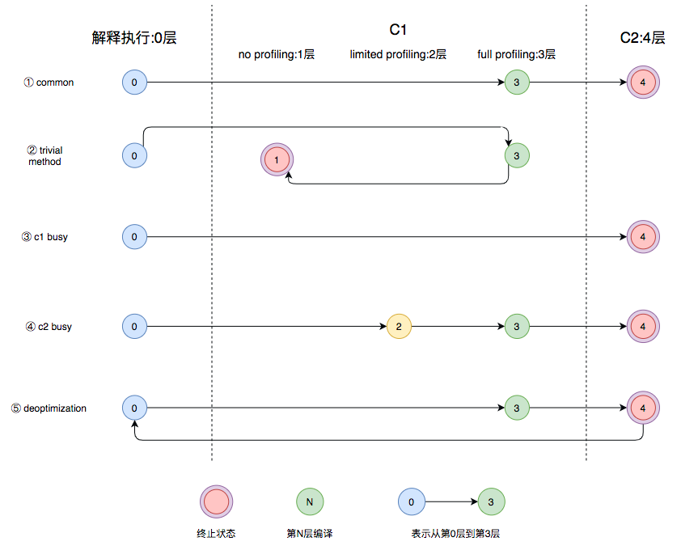

* [什么是](#什么是)
* [Java的执行过程](#java的执行过程)
    * [Java的执行过程整体可以分为两个部分](#java的执行过程整体可以分为两个部分)
    * [1.JVM中的编译器](#1jvm中的编译器)
        * [Client Compiler](#client-compiler)
        * [Server Compiler](#server-compiler)
    * [从JDK 9开始，Hotspot VM中集成了一种新的Server Compiler，Graal编译器。相比C2编译器，Graal有这样几种关键特性](#从jdk-9开始hotspot-vm中集成了一种新的server-compilergraal编译器相比c2编译器graal有这样几种关键特性)
    * [2.分层编译](#2分层编译)
        * [什么是](#什么是-1)
        * [五个层级](#五个层级)
    * [3.即时编译的触发](#3即时编译的触发)
        * [Java虚拟机根据方法的调用次数以及循环回边的执行次数来触发即时编译](#java虚拟机根据方法的调用次数以及循环回边的执行次数来触发即时编译)
        * [当方法的调用次数和循环回边的次数的和，超过由参数-XX:CompileThreshold指定的阈值时（使用C1时，默认值为1500；使用C2时，默认值为10000），就会触发即时编译](#当方法的调用次数和循环回为10000就会触发即时编译)
        * [开启分层编译的情况下，-XX:CompileThreshold参数设置的阈值将会失效，触发编译会由以下的条件来判断](#开启分层编译的情况下-xxcompilethreshold参数设置的阈值将会失效触发编译会由以下的条件来判断)
        * [分层编译触发条件公式](#分层编译触发条件公式)
* [编译优化](#编译优化)
    * [1. 中间表达形式（Intermediate Representation）](#1-中间表达形式intermediate-representation)
    * [2.方法内联](#2方法内联)
        * [虚函数内联（多态、接口）](#虚函数内联多态接口)
    * [3. 逃逸分析](#3-逃逸分析)
        * [1、锁消除](#1锁消除)
        * [2、栈上分配](#2栈上分配)
        * [3、标量替换](#3标量替换)
        * [4、部分逃逸分析](#4部分逃逸分析)
    * [4. Loop Transformations](#4-loop-transformations)
        * [1、循环展开](#1循环展开)
        * [2、循环分离](#2循环分离)
    * [5. 窥孔优化与寄存器分配](#5-窥孔优化与寄存器分配)
* [参考文章](#参考文章)


# 什么是

- 常见的编译型语言如C++，通常会把代码直接编译成CPU所能理解的机器码来运行。而Java为了实现“一次编译，处处运行”的特性，把编译的过程分成两部分，首先它会先由javac编译成通用的中间形式——字节码，然后再由解释器逐条将字节码解释为机器码来执行。所以在性能上，Java通常不如C++这类编译型语言
- 为了优化Java的性能 ，JVM在解释器之外引入了即时（Just In
  Time）编译器：当程序运行时，解释器首先发挥作用，代码可以直接执行。随着时间推移，即时编译器逐渐发挥作用，把越来越多的代码编译优化成本地代码，来获取更高的执行效率。解释器这时可以作为编译运行的降级手段，在一些不可靠的编译优化出现问题时，再切换回解释执行，保证程序可以正常运行
- 即时编译器极大地提高了Java程序的运行速度，而且跟静态编译相比，即时编译器可以选择性地编译热点代码，省去了很多编译时间，也节省很多的空间。目前，即时编译器已经非常成熟了，在性能层面甚至可以和编译型语言相比。不过在这个领域，大家依然在不断探索如何结合不同的编译方式，使用更加智能的手段来提升程序的运行速度。

# Java的执行过程

## Java的执行过程整体可以分为两个部分

1. 第一步由javac将源码编译成字节码，在这个过程中会进行词法分析、语法分析、语义分析，编译原理中这部分的编译称为前端编译
2. 接下来无需编译直接逐条将字节码解释执行，在解释执行的过程中，虚拟机同时对程序运行的信息进行收集，在这些信息的基础上，编译器会逐渐发挥作用，它会进行后端编译——把字节码编译成机器码，但不是所有的代码都会被编译，只有被JVM认定为的热点代码，才可能被编译。
   - **热点代码** JVM中会设置一个阈值，当方法或者代码块的在一定时间内的调用次数超过这个阈值时就会被编译，存入codeCache中。当下次执行时，再遇到这段代码，就会从codeCache中读取机器码，直接执行，以此来提升程序运行的性能

## 1.JVM中的编译器

JVM中集成了两种编译器

### Client Compiler

- Client Compiler注重启动速度和局部的优化
- HotSpot VM带有一个Client Compiler C1编译器。这种编译器启动速度快，但是性能比较Server Compiler来说会差一些。C1会做三件事
    - 局部简单可靠的优化，比如字节码上进行的一些基础优化，方法内联、常量传播等，放弃许多耗时较长的全局优化。
    - 将字节码构造成高级中间表示（High-level Intermediate Representation，以下称为HIR），HIR与平台无关，通常采用图结构，更适合JVM对程序进行优化。
    - 最后将HIR转换成低级中间表示（Low-level Intermediate
      Representation，以下称为LIR），在LIR的基础上会进行寄存器分配、窥孔优化（局部的优化方式，编译器在一个基本块或者多个基本块中，针对已经生成的代码，结合CPU自己指令的特点，通过一些认为可能带来性能提升的转换规则或者通过整体的分析，进行指令转换，来提升代码性能）等操作，最终生成机器码。

### Server Compiler

- Server Compiler则更加关注全局的优化，性能会更好，但由于会进行更多的全局分析，所以启动速度会变慢
- Server Compiler主要关注一些编译耗时较长的全局优化，甚至会还会根据程序运行的信息进行一些不可靠的激进优化。这种编译器的启动时间长，适用于长时间运行的后台程序，它的性能通常比Client
  Compiler高30%以上。目前，Hotspot虚拟机中使用的Server Compiler有两种：C2和Graal
    - C2 Compiler
        - C2编译器在进行编译优化时，会使用一种控制流与数据流结合的图数据结构，称为Ideal Graph。 Ideal
          Graph表示当前程序的数据流向和指令间的依赖关系，依靠这种图结构，某些优化步骤（尤其是涉及浮动代码块的那些优化步骤）变得不那么复杂
        - Ideal
          Graph的构建是在解析字节码的时候，根据字节码中的指令向一个空的Graph中添加节点，Graph中的节点通常对应一个指令块，每个指令块包含多条相关联的指令，JVM会利用一些优化技术对这些指令进行优化，比如Global
          Value Numbering、常量折叠等，解析结束后，还会进行一些死代码剔除的操作。生成Ideal
          Graph后，会在这个基础上结合收集的程序运行信息来进行一些全局的优化，这个阶段如果JVM判断此时没有全局优化的必要，就会跳过这部分优化。
        - 构建Ideal Graph其实就是把指令添加到Ideal Graph，然后形成一个指向这个指令的节点，并且用各种优化手段优化这些指令
        - 无论是否进行全局优化，Ideal Graph都会被转化为一种更接近机器层面的MachNode Graph，最后编译的机器码就是从MachNode Graph中得的，生成机器码前还会有一些包括寄存器分配、窥孔优化等操作
    - Graal Compiler
        - 从JDK 9开始，Hotspot VM中集成了一种新的Server Compiler，Graal编译器。相比C2编译器，Graal有这样几种关键特性
            -
            JVM会在解释执行的时候收集程序运行的各种信息，然后编译器会根据这些信息进行一些基于预测的激进优化，比如分支预测，根据程序不同分支的运行概率，选择性地编译一些概率较大的分支。Graal比C2更加青睐这种优化，所以Graal的峰值性能通常要比C2更好
            - 使用Java编写，对于Java语言，尤其是新特性，比如Lambda、Stream等更加友好。
            - 更深层次的优化，比如虚函数的内联、部分逃逸分析等
        - Graal编译器可以通过Java虚拟机参数-XX:+UnlockExperimentalVMOptions -XX:
          +UseJVMCICompiler启用。当启用时，它将替换掉HotSpot中的C2编译器，并响应原本由C2负责的编译请求。

## 2.分层编译

### 什么是

- 在Java 7以前，需要研发人员根据服务的性质去选择编译器
- 对于需要快速启动的，或者一些不会长期运行的服务，可以采用编译效率较高的C1，对应参数-client。长期运行的服务，或者对峰值性能有要求的后台服务，可以采用峰值性能更好的C2，对应参数-server
- Java 7开始引入了分层编译的概念，它结合了C1和C2的优势，追求启动速度和峰值性能的一个平衡。分层编译将JVM的执行状态分为了五个层次

### 五个层级

- 层次
    - 解释执行。
    - 执行不带profiling的C1代码。
        - profiling就是收集能够反映程序执行状态的数据。其中最基本的统计数据就是方法的调用次数，以及循环回边的执行次数
    - 执行仅带方法调用次数以及循环回边执行次数profiling的C1代码。
    - 执行带所有profiling的C1代码。
    - 执行C2代码。
- 特点
    - 通常情况下，C2代码的执行效率要比C1代码的高出30%以上。C1层执行的代码，按执行效率排序从高至低则是1层>2层>3层。
    - 这5个层次中，1层和4层都是终止状态，当一个方法到达终止状态后，只要编译后的代码并没有失效，那么JVM就不会再次发出该方法的编译请求的。
    - 服务实际运行时，JVM会根据服务运行情况，从解释执行开始，选择不同的编译路径，直到到达终止状态
- 常见的编译路径
  
    - 图中第①条路径，代表编译的一般情况，热点方法从解释执行到被3层的C1编译，最后被4层的C2编译。
    -
    如果方法比较小（比如Java服务中常见的getter/setter方法），3层的profiling没有收集到有价值的数据，JVM就会断定该方法对于C1代码和C2代码的执行效率相同，就会执行图中第②条路径。在这种情况下，JVM会在3层编译之后，放弃进入C2编译，直接选择用1层的C1编译运行。
    - 在C1忙碌的情况下，执行图中第③条路径，在解释执行过程中对程序进行profiling ，根据信息直接由第4层的C2编译。
    - 前文提到C1中的执行效率是1层>2层>3层，第3层一般要比第2层慢35%以上，所以在C2忙碌的情况下，执行图中第④条路径。这时方法会被2层的C1编译，然后再被3层的C1编译，以减少方法在3层的执行时间。
    - 如果编译器做了一些比较激进的优化，比如分支预测，在实际运行时发现预测出错，这时就会进行反优化，重新进入解释执行，图中第⑤条执行路径代表的就是反优化。
- 总的来说，C1的编译速度更快，C2的编译质量更高，分层编译的不同编译路径，也就是JVM根据当前服务的运行情况来寻找当前服务的最佳平衡点的一个过程。从JDK 8开始，JVM默认开启分层编译。

## 3.即时编译的触发

### Java虚拟机根据方法的调用次数以及循环回边的执行次数来触发即时编译
- 循环回边
    - 循环回边是一个控制流图中的概念，程序中可以简单理解为往回跳转的指令，比如下面这段代码：
      ```java
      public void nlp(Object obj) {
         int sum = 0;
         for (int i = 0; i < 200; i++) {
             sum += i;
         }
      }
      ```

    - 上面这段代码经过编译生成下面的字节码。其中，偏移量为18的字节码将往回跳至偏移量为4的字节码中。在解释执行时，每当运行一次该指令，Java虚拟机便会将该方法的循环回边计数器加1。 
    - 字节码 
      ```java
        public void nlp(java.lang.Object); 
          Code:
             0: iconst_0 
             1: istore_1 
             2: iconst_0 
             3: istore_2 
             4: iload_2 
             5: sipush 200 
             8: if_icmpge 21 
             11: iload_1 
             12: iload_2 
             13:iadd 
             14: istore_1 
             15: iinc 2, 1 
             18: goto 4 
             21: return
      ```
      
- 在即时编译过程中，编译器会识别循环的头部和尾部。上面这段字节码中，循环体的头部和尾部分别为偏移量为11的字节码和偏移量为15的字节码。编译器将在循环体结尾增加循环回边计数器的代码，来对循环进行计数
### 当方法的调用次数和循环回边的次数的和，超过由参数`-XX:CompileThreshold`指定的阈值时（使用C1时，默认值为1500；使用C2时，默认值为10000），就会触发即时编译
### 开启分层编译的情况下，`-XX:CompileThreshold`参数设置的阈值将会失效，触发编译会由以下的条件来判断 
- 方法调用次数大于由参数`-XX:TierXInvocationThreshold`指定的阈值乘以系数。 
- 方法调用次数大于由参数`-XX:TierXMINInvocationThreshold`指定的阈值乘以系数，并且方法调用次数和循环回边次数之和大于由参数-XX:TierXCompileThreshold指定的阈值乘以系数时。 
### 分层编译触发条件公式 
- `i >TierXInvocationThreshold * s || (i > TierXMinInvocationThreshold * s && i + b > TierXCompileThreshold * s)`i为调用次数，b是循环回边次数 
- 上述满足其中一个条件就会触发即时编译，并且JVM会根据当前的编译方法数以及编译线程数动态调整系数s。

# 编译优化
即时编译器会对正在运行的服务进行一系列的优化，包括字节码解析过程中的分析，根据编译过程中代码的一些中间形式来做局部优化，还会根据程序依赖图进行全局优化，最后才会生成机器码
## 1. 中间表达形式（Intermediate Representation）
在编译原理中，通常把编译器分为前端和后端，前端编译经过词法分析、语法分析、语义分析生成中间表达形式（Intermediate Representation，以下称为IR），后端会对IR进行优化，生成目标代码
- Java字节码就是一种IR，但是字节码的结构复杂，字节码这样代码形式的IR也不适合做全局的分析优化。现代编译器一般采用图结构的IR，静态单赋值（Static Single Assignment，SSA）IR是目前比较常用的一种。这种IR的特点是每个变量只能被赋值一次，而且只有当变量被赋值之后才能使用
  - SSA IR
   ``` 
   Plain Text
    {
        a = 1;
        a = 2;
        b = a;
    }
  ```
  - 上述代码中我们可以轻易地发现a = 1的赋值是冗余的，但是编译器不能。传统的编译器需要借助数据流分析，从后至前依次确认哪些变量的值被覆盖掉。不过，如果借助了SSA IR，编译器则可以很容易识别冗余赋值。
  - 上面代码的SSA IR形式的伪代码可以表示为
  ```Plain Text
  {
      a_1 = 1;
      a_2 = 2;
      b_1 = a_2;
  }
  ```
  - 由于SSA IR中每个变量只能赋值一次，所以代码中的a在SSA IR中会分成a_1、a_2两个变量来赋值，这样编译器就可以很容易通过扫描这些变量来发现a_1的赋值后并没有使用，赋值是冗余的
- 我们可以将编译器的每一种优化看成一个图优化算法，它接收一个IR图，并输出经过转换后的IR图。编译器优化的过程就是一个个图节点的优化串联起来的
## 2.方法内联
- 方法内联，是指在编译过程中遇到方法调用时，将目标方法的方法体纳入编译范围之中，并取代原方法调用的优化手段。JIT大部分的优化都是在内联的基础上进行的，方法内联是即时编译器中非常重要的一环。
- Java服务中存在大量getter/setter方法，如果没有方法内联，在调用getter/setter时，程序执行时需要保存当前方法的执行位置，创建并压入用于getter/setter的栈帧、访问字段、弹出栈帧，最后再恢复当前方法的执行。内联了对 getter/setter的方法调用后，上述操作仅剩字段访问
- 编译器的大部分优化都是在方法内联的基础上。所以一般来说，内联的方法越多，生成代码的执行效率越高。但是对于即时编译器来说，内联的方法越多，编译时间也就越长，程序达到峰值性能的时刻也就比较晚
### 虚函数内联（多态、接口）
内联是JIT提升性能的主要手段，但是虚函数使得内联是很难的，因为在内联阶段并不知道他们会调用哪个方法。例如，我们有一个数据处理的接口，这个接口中的一个方法有三种实现add、sub和multi，JVM是通过保存虚函数表Virtual Method Table（以下称为VMT）存储class对象中所有的虚函数，class的实例对象保存着一个VMT的指针，程序运行时首先加载实例对象，然后通过实例对象找到VMT，通过VMT找到对应方法的地址，所以虚函数的调用比直接指向方法地址的classic call性能上会差一些。很不幸的是，Java中所有非私有的成员函数的调用都是虚调用
- 比如如下代码将会优化
```java
    public class SimpleInliningTest {
    public static void main(String[] args) throws InterruptedException {
        VirtualInvokeTest obj = new VirtualInvokeTest();
        VirtualInvoke1 obj1 = new VirtualInvoke1();
        for (int i = 0; i < 100000; i++) {
            invokeMethod(obj);
            invokeMethod(obj1);
        }
        Thread.sleep(1000);
    }
    public static void invokeMethod(VirtualInvokeTest obj) {
        obj.methodCall();
    }
    private static class VirtualInvokeTest {
        public void methodCall() {
            System.out.println("virtual call");
        }
    }
    private static class VirtualInvoke1 extends VirtualInvokeTest {
        @Override
        public void methodCall() {
            super.methodCall();
        }
    }
}
```

- 如下代码多个实现未被优化
```java
    public class SimpleInliningTest {
    public static void main(String[] args) throws InterruptedException {
        VirtualInvokeTest obj = new VirtualInvokeTest();
        VirtualInvoke1 obj1 = new VirtualInvoke1();
        VirtualInvoke2 obj2 = new VirtualInvoke2();
        for (int i = 0; i < 100000; i++) {
            invokeMethod(obj);
            invokeMethod(obj1);
            invokeMethod(obj2);
        }
        Thread.sleep(1000);
    }
    public static void invokeMethod(VirtualInvokeTest obj) {
        obj.methodCall();
    }
    private static class VirtualInvokeTest {
        public void methodCall() {
            System.out.println("virtual call");
        }
    }
    private static class VirtualInvoke1 extends VirtualInvokeTest {
        @Override
        public void methodCall() {
            super.methodCall();
        }
    }
    private static class VirtualInvoke2 extends VirtualInvokeTest {
        @Override
        public void methodCall() {
            super.methodCall();
        }
    }
}
```

## 3. 逃逸分析
逃逸分析是“一种确定指针动态范围的静态分析，它可以分析在程序的哪些地方可以访问到指针”。Java虚拟机的即时编译器会对新建的对象进行逃逸分析，判断对象是否逃逸出线程或者方法。即时编译器判断对象是否逃逸的依据有两种
- 对象是否被存入堆中（静态字段或者堆中对象的实例字段），一旦对象被存入堆中，其他线程便能获得该对象的引用，即时编译器就无法追踪所有使用该对象的代码位置。
- 对象是否被传入未知代码中，即时编译器会将未被内联的代码当成未知代码，因为它无法确认该方法调用会不会将调用者或所传入的参数存储至堆中，这种情况，可以直接认为方法调用的调用者以及参数是逃逸的。
### 1、锁消除
- 在学习Java并发编程时会了解锁消除，而锁消除就是在逃逸分析的基础上进行的。
- 如果即时编译器能够证明锁对象不逃逸，那么对该锁对象的加锁、解锁操作没就有意义。因为线程并不能获得该锁对象。在这种情况下，即时编译器会消除对该不逃逸锁对象的加锁、解锁操作。实际上，编译器仅需证明锁对象不逃逸出线程，便可以进行锁消除。由于Java虚拟机即时编译的限制，上述条件被强化为证明锁对象不逃逸出当前编译的方法。不过，基于逃逸分析的锁消除实际上并不多见。
### 2、栈上分配
- 我们都知道Java的对象是在堆上分配的，而堆是对所有对象可见的。同时，JVM需要对所分配的堆内存进行管理，并且在对象不再被引用时回收其所占据的内存
- 如果逃逸分析能够证明某些新建的对象不逃逸，那么JVM完全可以将其分配至栈上，并且在new语句所在的方法退出时，通过弹出当前方法的栈桢来自动回收所分配的内存空间。这样一来，我们便无须借助垃圾回收器来处理不再被引用的对象
### 3、标量替换
过Hotspot虚拟机，并没有进行实际的栈上分配，而是使用了标量替换这一技术。所谓的标量，就是仅能存储一个值的变量，比如Java代码中的基本类型。与之相反，聚合量则可能同时存储多个值，其中一个典型的例子便是Java的对象。编译器会在方法内将未逃逸的聚合量分解成多个标量，以此来减少堆上分配。下面是一个标量替换的例子
  ```java
      public class Example{
      @AllArgsConstructor
      class Cat{
          int age;
          int weight;
      }
      public static void example(){
          Cat cat = new Cat(1,10);
          addAgeAndWeight(cat.age,Cat.weight);
      }
  }
  ```
  - 经过逃逸分析，cat对象未逃逸出example()的调用，因此可以对聚合量cat进行分解，得到两个标量age和weight，进行标量替换后的伪代码：
    ```java
        public class Example{
        @AllArgsConstructor
        class Cat{
            int age;
            int weight;
        }
        public static void example(){
            int age = 1;
            int weight = 10;
            addAgeAndWeight(age,weight);
        }
    }
    ```

### 4、部分逃逸分析
部分逃逸分析也是Graal对于概率预测的应用。通常来说，如果发现一个对象逃逸出了方法或者线程，JVM就不会去进行优化，但是Graal编译器依然会去分析当前程序的执行路径，它会在逃逸分析基础上收集、判断哪些路径上对象会逃逸，哪些不会。然后根据这些信息，在不会逃逸的路径上进行锁消除、栈上分配这些优化手段。
## 4. Loop Transformations
C2编译器在构建Ideal Graph后会进行很多的全局优化，其中就包括对循环的转换，最重要的两种转换就是循环展开和循环分离
### 1、循环展开
循环展开是一种循环转换技术，它试图以牺牲程序二进制码大小为代价来优化程序的执行速度，是一种用空间换时间的优化手段。
- 循环展开通过减少或消除控制程序循环的指令，来减少计算开销，这种开销包括增加指向数组中下一个索引或者指令的指针算数等。如果编译器可以提前计算这些索引，并且构建到机器代码指令中，那么程序运行时就可以不必进行这种计算。也就是说有些循环可以写成一些重复独立的代码。比如下面这个循环
```java
    public void loopRolling(){
        for(int i = 0;i<200;i++){
            delete(i);
        }
    }
```
- 上面的代码需要循环删除200次，通过循环展开可以得到下面这段代码：
```java
    public void loopRolling(){
        for(int i = 0;i<200;i+=5){
            delete(i);
            delete(i+1);
            delete(i+2);
            delete(i+3);
            delete(i+4);
        }
    }
```
- 这样展开就可以减少循环的次数，每次循环内的计算也可以利用CPU的流水线提升效率。当然这只是一个示例，实际进行展开时，JVM会去评估展开带来的收益，再决定是否进行展开。
### 2、循环分离
循环分离也是循环转换的一种手段。它把循环中一次或多次的特殊迭代分离出来，在循环外执行。举个例子，下面这段代码
```java
int a = 10;
for(int i = 0;i<10;i++){
    b[i] = x[i] + x[a];
    a = i;
}
```
可以看出这段代码除了第一次循环a = 10以外，其他的情况a都等于i-1。所以可以把特殊情况分离出去，变成下面这段代码
```java
b[0] = x[0] + 10;
for(int i = 1;i<10;i++){
    b[i] = x[i] + x[i-1];
}
```
这种等效的转换消除了在循环中对a变量的需求，从而减少了开销。
## 5. 窥孔优化与寄存器分配
前文提到的窥孔优化是优化的最后一步，这之后就会程序就会转换成机器码，窥孔优化就是将编译器所生成的中间代码（或目标代码）中相邻指令，将其中的某些组合替换为效率更高的指令组，常见的比如强度削减、常数合并等，看下面这个例子就是一个强度削减的例子
- 强度削减
  - y1=x1*3  经过强度削减后得到  y1=(x1<<1)+x1
  - 编译器使用移位和加法削减乘法的强度，使用更高效率的指令组
- 寄存器分配
  - 寄存器分配也是一种编译的优化手段，在C2编译器中普遍的使用。它是通过把频繁使用的变量保存在寄存器中，CPU访问寄存器的速度比内存快得多，可以提升程序的运行速度。
  - 寄存器分配和窥孔优化是程序优化的最后一步。经过寄存器分配和窥孔优化之后，程序就会被转换成机器码保存在codeCache中

# 参考文章
- https://tech.meituan.com/2020/10/22/java-jit-practice-in-meituan.html