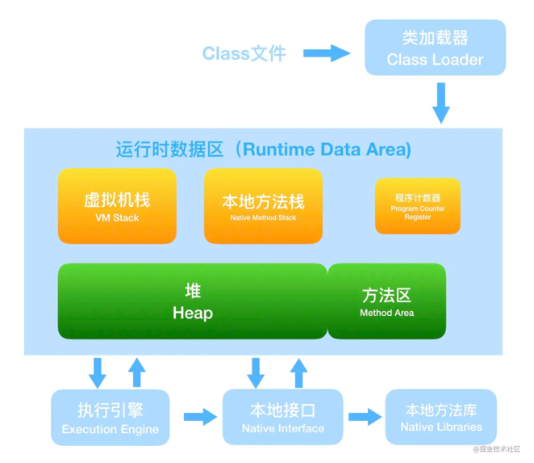
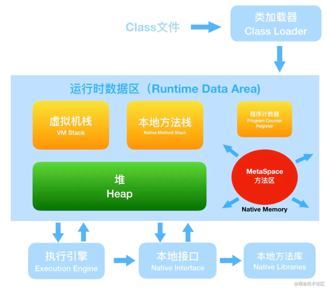
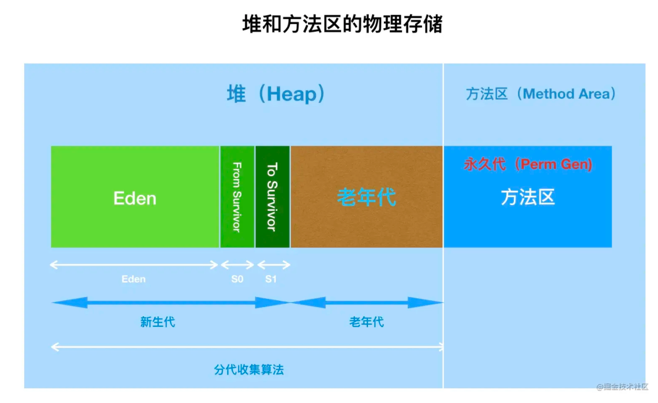

* [内存结构](#内存结构)
* [程序计数器](#程序计数器)
* [Java虚拟机栈](#java虚拟机栈)
* [本地方法栈](#本地方法栈)
* [堆](#堆)
  * [堆的分代](#堆的分代)
  * [逃逸分析](#逃逸分析)
* [方法区](#方法区)
* [运行时常量池](#运行时常量池)
* [直接内存](#直接内存)


# 内存结构
JDK1.7


JDK1.8

# 程序计数器
- 程序计数器（Program Counter Register）是一块较小的内存空间，它可以看作是当前线程所执行的 字节码的行号指示器
- 字节码解释器工作时就是通过改变这个计数器 的值来选取下一条需要执行的字节码指令
# Java虚拟机栈
虚拟机栈描述的是Java方法执行的线程内存模型：
- 每个方法被执行的时候，Java虚拟机都 会同步创建一个栈帧[1]（Stack Frame）用于存储局部变量表、操作数栈、动态连接、方法出口等信 息
- 每一个方法被调用直至执行完毕的过程，就对应着一个栈帧在虚拟机栈中从入栈到出栈的过程。
- 可以通过 -Xss 这个虚拟机参数来指定每个线程的 Java 虚拟机栈内存大小，在 JDK 1.4 中默认为 256K，而在 JDK1.5+ 默认为 1M：
  - java -Xss2M HackTheJava
- 异常
  - 当线程请求的栈深度超过最大值，会抛出 StackOverflowError 异常；
  - 栈进行动态扩展时如果无法申请到足够内存，会抛出 OutOfMemoryError 异常。
# 本地方法栈
本地方法栈（Native Method Stacks）与虚拟机栈所发挥的作用是非常相似的，其区别只是虚拟机 栈为虚拟机执行Java方法（也就是字节码）服务，而本地方法栈则是为虚拟机使用到的本地（Native） 方法服务。
# 堆
“几乎”所有的对象实例都在这里分配内存
## 堆的分代
- 新生代 Eden:Survivor=8:1:1
  - Eden
  - Survivor
    - to
    - from
- 老年代
- JVM参数 新生代：老年代=1：2
  - -Xms 初始值
  - -Xmx 最大值
## 逃逸分析
逃逸分析(Escape Analysis)是目前Java虚拟机中比较前沿的优化技术。这是一种可以有效减少Java 程序中同步负载和内存堆分配压力的跨函数全局数据流分析算法。通过逃逸分析，Java Hotspot编译器能够分析出一个新的对象的引用的使用范围从而决定是否要将这个对象分配到堆上
- 逃逸分析的基本行为就是分析对象动态作用域
- 举例
  - 方法逃逸
    - 当一个对象在方法中被定义后，它可能被外部方法所引用，例如作为调用参数传递到其他地方中，称为方法逃逸
    - 代码
      - ```java
        public static StringBuffer craeteStringBuffer(String s1, String s2) {
           StringBuffer sb = new StringBuffer();
           sb.append(s1);
           sb.append(s2);
           return sb;
        }
        ```
      - StringBuffer sb是一个方法内部变量，上述代码中直接将sb返回，这样这个StringBuffer有可能被其他方法所改变，这样它的作用域就不只是在方法内部，虽然它是一个局部变量，称其逃逸到了方法外部
      - 上述代码如果想要StringBuffer sb不逃出方法，可以这样写
      - ```java
        public static String createStringBuffer(String s1, String s2) {
            StringBuffer sb = new StringBuffer();
            sb.append(s1);
            sb.append(s2);
            return sb.toString();
        }
        ```
      - 不直接返回 StringBuffer，那么StringBuffer将不会逃逸出方法
  - 线程逃逸
    - 甚至还有可能被外部线程访问到，譬如赋值给类变量或可以在其他线程中访问的实例变量，称为线程逃逸
- 使用逃逸分析，编译器可以对代码做如下优化
  - 一、同步省略。如果一个对象被发现只能从一个线程被访问到，那么对于这个对象的操作可以不考虑同步。
  - 二、将堆分配转化为栈分配。如果一个对象在子程序中被分配，要使指向该对象的指针永远不会逃逸，对象可能是栈分配的候选，而不是堆分配。
    - JVM参数
      - -XX:+DoEscapeAnalysis ： 表示开启逃逸分析
      - -XX:-DoEscapeAnalysis ： 表示关闭逃逸分析
    - 对象的栈上内存分配
      - 我们知道，在一般情况下，对象和数组元素的内存分配是在堆内存上进行的。但是随着JIT编译器的日渐成熟，很多优化使这种分配策略并不绝对，JIT编译器就可以在编译期间根据逃逸分析的结果，来决定是否可以将对象的内存分配从堆转化为栈
  - 三、分离对象或标量替换。有的对象可能不需要作为一个连续的内存结构存在也可以被访问到，那么对象的部分（或全部）可以不存储在内存，而是存储在CPU寄存器中。
# 方法区
1.7

用于存放已被加载的类信息、常量、静态变量、即时编译器编译后的代码等数据。
- HotSpot 虚拟机把它当成永久代来进行垃圾回收。但很难确定永久代的大小，因为它受到很多因素影响，并且每次
- Full GC 之后永久代的大小都会改变，所以经常会抛出 OutOfMemoryError 异常。为了更容易管理方法区，从 JDK
- 1.8 开始，移除永久代，并把方法区移至元空间，它位于本地内存中，而不是虚拟机内存中。
- 方法区的回收
  - 因为方法区主要存放永久代对象，而永久代对象的回收率比新生代低很多，所以在方法区上进行回收性价比不高
  - 主要是对常量池的回收和对类的卸载
  - 为了避免内存溢出，在大量使用反射和动态代理的场景都需要虚拟机具备类卸载功能
  - 类的卸载条件很多，需要满足以下三个条件，并且满足了条件也不一定会被卸载
    - 该类所有的实例都已经被回收，此时堆中不存在该类的任何实例。
    - 加载该类的 ClassLoader 已经被回收。
    - 该类对应的 Class 对象没有在任何地方被引用，也就无法在任何地方通过反射访问该类方法。
# 运行时常量池
运行时常量池是方法区的一部分。 
- Class 文件中的常量池（编译器生成的字面量和符号引用）会在类加载后被放入这个区域。
  - 运行时常量池（Runtime Constant Pool）是方法区的一部分。Class文件中除了有类的版本、字 段、方法、接口等描述信息外，还有一项信息是常量池表（Constant Pool Table），用于存放编译期生 成的各种字面量与符号引用，这部分内容将在类加载后存放到方法区的运行时常量池中。
- 除了在编译期生成的常量，还允许动态生成，例如 String 类的 intern()。
# 直接内存
直接内存（Direct Memory）并不是虚拟机运行时数据区的一部分
- 在JDK 1.4中新加入了NIO（New Input/Output）类，引入了一种基于通道（Channel）与缓冲区 （Buffer）的I/O方式，它可以使用Native函数库直接分配堆外内存，然后通过一个存储在Java堆里面的 DirectByteBuffer对象作为这块内存的引用进行操作。这样能在一些场景中显著提高性能，因为避免了 在Java堆和Native堆中来回复制数据。
  - 受到 本机总内存（包括物理内存、SWAP分区或者分页文件）大小以及处理器寻址空间的限制

# 参考文章
- https://www.hollischuang.com/archives/2398