* [判断一个对象能否被回收](#判断一个对象能否被回收)
  * [引用计数法](#引用计数法)
  * [可达性算法](#可达性算法)
  * [哪些可以作为是根节点](#哪些可以作为是根节点)
  * [方法区的回收](#方法区的回收)
  * [finalize()](#finalize)
  * [引用类型](#引用类型)
    * [引用类型](#引用类型-1)
* [分代收集理论](#分代收集理论)
* [GC定义](#gc定义)
  * [新生代收集（Minor GC/Young GC）](#新生代收集minor-gcyoung-gc)
  * [老年代收集（Major GC/Old GC）](#老年代收集major-gcold-gc)
  * [混合收集（Mixed GC）](#混合收集mixed-gc)
  * [整堆收集（Full GC）](#整堆收集full-gc)
* [回收算法](#回收算法)
  * [标记-清除](#标记-清除)
  * [原理](#原理)
  * [优缺点](#优缺点)
  * [标记-复制](#标记-复制)
  * [原理](#原理-1)
  * [优缺点](#优缺点-1)
  * [标记-整理](#标记-整理)
  * [原理](#原理-2)
  * [优缺点](#优缺点-2)
* [Hotspot算法实现细节](#hotspot算法实现细节)
  * [根节点枚举GC Roots](#根节点枚举gc-roots)
  * [安全点Safe Point](#安全点safe-point)
  * [安全区域Safe Region](#安全区域safe-region)
  * [记忆集Remembered Set与卡表Card Table](#记忆集remembered-set与卡表card-table)
  * [写屏障Write Barrier](#写屏障write-barrier)
  * [并发的可达性分析](#并发的可达性分析)
    * [为什么需要并发标记](#为什么需要并发标记)
    * [三色标记Tri-color Marking](#三色标记tri-color-marking)
      * [什么是三色标记](#什么是三色标记)
        * [白色](#白色)
        * [黑色](#黑色)
        * [灰色](#灰色)
      * [如果现在GC和用户线程同时运行](#如果现在gc和用户线程同时运行)
        * [GC在标记颜色](#gc在标记颜色)
        * [问题](#问题)
      * [标记过程](#标记过程)
        * [正常标记](#正常标记)
        * [对象消失的情况](#对象消失的情况)
      * [对象消失的条件](#对象消失的条件)
      * [解决方案](#解决方案)
* [垃圾回收器](#垃圾回收器)
  * [Serial收集器](#serial收集器)
    * [流程](#流程)
    * [特点](#特点)
  * [ParNew收集器](#parnew收集器)
    * [流程](#流程-1)
    * [特点](#特点-1)
  * [ParallelScavenge收集器](#parallelscavenge收集器)
    * [特点](#特点-2)
    * [JVM参数](#jvm参数)
  * [SerialOld收集器](#serialold收集器)
    * [流程](#流程-2)
    * [特点](#特点-3)
  * [ParallelOld收集器](#parallelold收集器)
    * [流程](#流程-3)
    * [特点](#特点-4)
  * [CMS收集器](#cms收集器)
    * [流程](#流程-4)
    * [特点](#特点-5)
  * [G1收集器](#g1收集器)
    * [流程](#流程-5)
    * [特点](#特点-6)
  * [ZGC收集器](#zgc收集器)
    * [特点](#特点-7)
      * [动态创建和销毁以及动态的容量大小的region](#动态创建和销毁以及动态的容量大小的region)
      * [染色指针技术](#染色指针技术)

# 判断一个对象能否被回收
## 引用计数法
- 为对象添加一个引用计数器，当对象增加一个引用时计数器加 1，引用失效时计数器减 1。引用计数为 0 的对象可被回收。
- 在两个对象出现循环引用的情况下，此时引用计数器永远不为 0，导致无法对它们进行回收。正是因为循环引用的存在，因此 Java 虚拟机不使用引用计数算法。
## 可达性算法
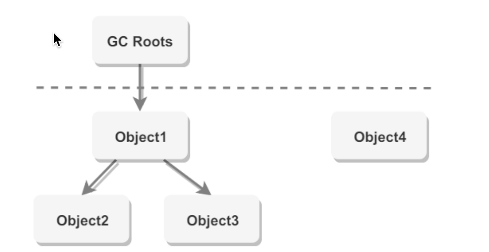
以 GC Roots 为起始点进行搜索，可达的对象都是存活的，不可达的对象可被回收。
## 哪些可以作为是根节点
- 虚拟机栈（栈帧中的本地变量表）中引用的对象
- 本地方法栈中 JNI（即一般说的 Native 方法）引用的对象
- 方法区中类静态属性引用的对象
- 方法区中常量引用的对象
- 正在运⾏的线程
- 锁住的对象

## 方法区的回收
## finalize()
当一个对象可被回收时，如果需要执行该对象的 finalize() 方法，那么就有可能在该方法中让对象重新被引用，从而实现自救。自救只能进行一次，如果回收的对象之前调用了 finalize() 方法自救，后面回收时不会再调用该方法。
- 经过可达性分析后如果对象没有域root有任何相关的引用链，则会被标记，随后经过一次筛选，筛选的条件就是是否需要执行finalize()方法，如果对象没有覆盖finalize方法，或者已经被虚拟机调用过。则没必要执行
- 如果需要执行，则把对象放在一个名为F-Queue的队列中中，并由一个优先级低的由虚拟机创建的线程去执行他们的finalize()方法，这里的执行只是触发，并不一定要等待他们执行完，否则如果该方法之心缓慢甚至死循环，则会阻塞队列
## 引用类型
无论是通过引用计数算法判断对象的引用数量，还是通过可达性分析算法判断对象是否可达，判定对象是否可被回收都与引用有关。
### 引用类型
- 强引用
  - 被强引用关联的对象不会被回收。
  - 使用 new 一个新对象的方式来创建强引用。`Object obj = new Object();`
- 软引用
  - 被软引用关联的对象只有在内存不够的情况下才会被回收。
  - 使用 SoftReference 类来创建软引用。
  ```java
    Object obj = new Object();
    SoftReference<Object> sf = new SoftReference<>(obj);
    obj = null;//使对象只被软引用关联
  ```
- 弱引用
  - 被弱引用关联的对象一定会被回收，也就是说它只能存活到下一次垃圾回收发生之前。
  - 使用 WeakReference 类来创建弱引用。
  ```java
    Object obj = new Object();
    WeakReference<Object> sf = new WeakReference<>(obj);
    obj = null;
  ```
- 虚引用
  - 又称为幽灵引用或者幻影引用，一个对象是否有虚引用的存在，不会对其生存时间造成影响，也无法通过虚引用得到一个对象。
  - 为一个对象设置虚引用的唯一目的是能在这个对象被回收时收到一个系统通知。
  - 使用 PhantomReference 来创建虚引用。
  ```java
    Object obj = new Object();
    PhantomReference<Object> sf = new PhantomReference<>(obj,null);
    obj = null;
  ```
# 分代收集理论
当前商业虚拟机的垃圾收集器，大多数都遵循了“分代收集”（Generational Collection）[1]的理论进 行设计，分代收集名为理论，实质是一套符合大多数程序运行实际情况的经验法则，它建立在两个分 代假说之上：
- 1）弱分代假说（Weak Generational Hypothesis）：绝大多数对象都是朝生夕灭的。
- 2）强分代假说（Strong Generational Hypothesis）：熬过越多次垃圾收集过程的对象就越难以消 亡。

这两个分代假说共同奠定了多款常用的垃圾收集器的一致的设计原则：收集器应该将Java堆划分 出不同的区域，然后将回收对象依据其年龄（年龄即对象熬过垃圾收集过程的次数）分配到不同的区 域之中存储

# GC定义
### 新生代收集（Minor GC/Young GC）
指目标只是新生代的垃圾收集。
- 当Eden区满了的时候，会触发Young GC
### 老年代收集（Major GC/Old GC）
指目标只是老年代的垃圾收集。目前只有CMS收集器会有单 独收集老年代的行为。另外请注意“Major GC”这个说法现在有点混淆，在不同资料上常有不同所指， 读者需按上下文区分到底是指老年代的收集还是整堆收集。
### 混合收集（Mixed GC）
指目标是收集整个新生代以及部分老年代的垃圾收集。目前只有G1收 集器会有这种行为。
### 整堆收集（Full GC） 
收集整个Java堆和方法区的垃圾收集
- 在发生Young GC的时候，虚拟机会检测之前每次晋升到老年代的平均大小是否大于年老代的剩余空间，如果大于，则直接进行Full GC；
- 如果小于，但设置了Handle PromotionFailure，那么也会执行Full GC。
  - -XX:HandlePromotionFailure：是否设置空间分配担保 JDK7及以后这个参数就失效了. 只要老年代的连续空间大于新生代对象的总大小或者历次晋升到老年代的对象的平均大小就进行MinorGC，否则FullGC
- 永久代空间不足，会触发Full GC
- System.gc()也会触发Full GC
- 堆中分配很大的对象 所谓大对象，是指需要大量连续内存空间的java对象，例如很长的数组，此种对象会直接进入老年代，而老年代虽然有很大的剩余空间，但是无法找到足够大的连续空间来分配给当前对象，此种情况就会触发JVM进行Full GC。
# 回收算法
### 标记-清除
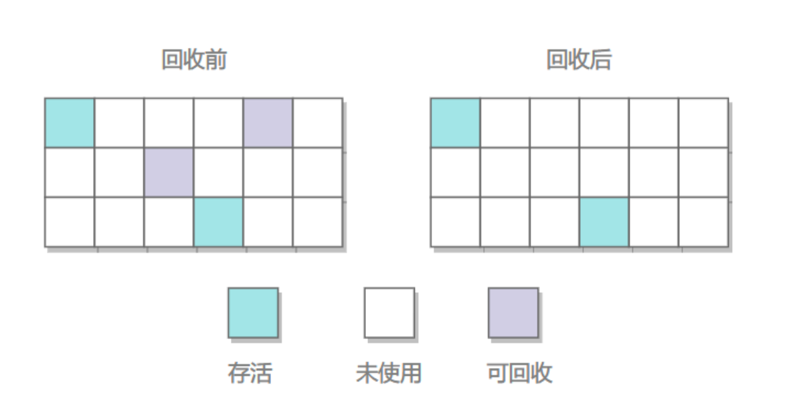
#### 原理
首先标记出所有需要回 收的对象，在标记完成后，统一回收掉所有被标记的对象，也可以反过来，标记存活的对象，统一回 收所有未被标记的对象
#### 优缺点
- 优点
  - 简单
- 缺点
  - 标记和清除过程效率都不高；
  - 会产生大量不连续的内存碎片，导致无法给大对象分配内存。
### 标记-复制
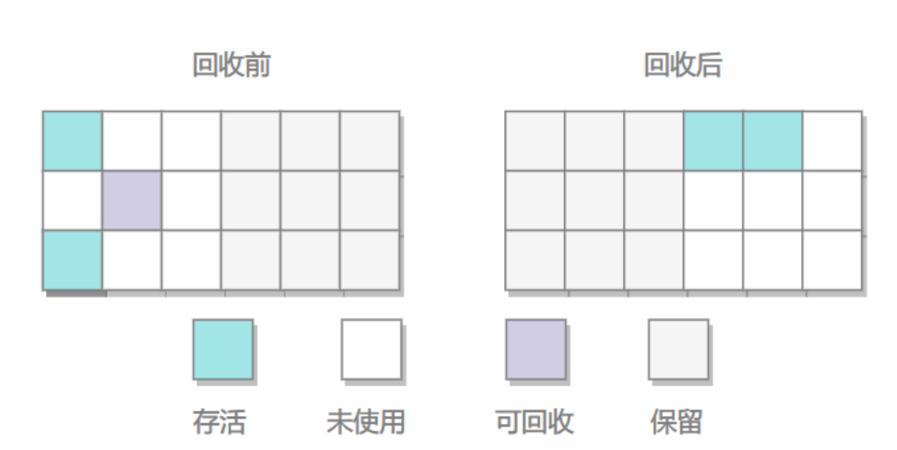
#### 原理
- 为了解决标记-清除算法面对大量可回收对象时执行效率低 的问题
- 它将可用 内存按容量划分为大小相等的两块，每次只使用其中的一块。当这一块的内存用完了，就将还存活着 的对象复制到另外一块上面，然后再把已使用过的内存空间一次清理掉
- 新生代采用此算法
#### 优缺点
- 优点
  - 不会产生内存碎片
- 缺点
  - 空间浪费
  - 对象存活率较高时就要进行较多的复制操作，效率将会降低
### 标记-整理
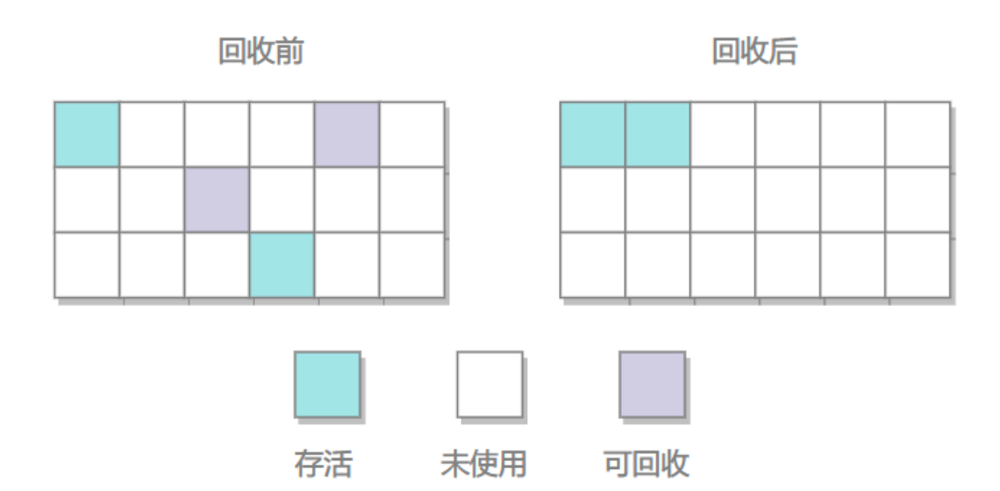
#### 原理
- 让所有存活的对象都向一端移动，然后直接清理掉端边界以外的内存。
- 老年代采用此算法
#### 优缺点
- 优点
  - 不会产生内存碎片
- 缺点
  - 需要移动大量对象，处理效率比较低。

# Hotspot算法实现细节
## 根节点枚举GC Roots
- 必须暂定用户线程STW
- 需要在一个能保障一致性的快照中进行
  - 如果在分析过程对象引用关系不断变化肯定是不行的
- 但是如果在此时依次枚举成百上万的关系肯定会耗费大大量的时间
- 所以应当是能直接获取到哪些地方存放着对象的引用
- 一个数据结构OopMap
  - 一旦类加载完成，就会把对象内什么偏移量上是什么类型的数据计算出来，在特定的位置记录下栈里和寄存器里哪些位置是引用
  - 相当于把引用已经存在了这里，扫描时直接来拿就好了
## 安全点Safe Point
- 在OopMap的协助下，HotSpot可以快速准确地完成GC Roots枚举，但一个很现实的问题随之而 来：可能导致引用关系变化，或者说导致OopMap内容变化的指令非常多，如果为每一条指令都生成 对应的OopMap，那将会需要大量的额外存储空间，这样垃圾收集伴随而来的空间成本就会变得无法 忍受的高昂。
- 实际上HotSpot也的确没有为每条指令都生成OopMap，前面已经提到，只是在“特定的位置”记录 了这些信息，这些位置被称为安全点（Safepoint）。
- 让线程跑到安全点再GC
  - 抢先式中断
    - GC时中断所有的用户线程
    - 如果发现该线程不在安全点则恢复，直到它跑到了安全点
      - 现在几乎没有虚拟机实现采用抢先式中断来暂停线程响应GC事件。
  - 主动式中断
    - 不主动中断线程，设置一个标志位，让线程自己主动轮询这个标志位，一旦发现标志位为真，就自己在最近的安全点主动中断挂起
## 安全区域Safe Region
如果线程未获取到处理器时间则无法到达安全点
- 于是设置一个安全区域，在这个区域的任意地方开始GC都是安全的
  - 执行到安全区时标识自己已进入，当离开时检查是否完成了根节点枚举，完成了继续执行，否则一直等待直到收到离开安全区的信号为止
## 记忆集Remembered Set与卡表Card Table
- 解决对象跨代引用所带来的问题，垃圾收集器在新生代中建 立了名为记忆集（Remembered Set）的数据结构用以避免把整个老年代加进GC Roots扫描范围
  - 所有跨代引用都会存在这个问题
- 记忆集是一种用于记录从非收集区域指向收集区域的指针集合的抽象数据结构
- 因为记忆集的出现只是为了根节点枚举，所以能标记对象是否有引用即可，如果使用一个结构来储存所有非收集区域指向收集区域未免代价过大，而如果在每个对象里都标明含有跨代指针也是精度过细，于是使用卡表的方式（精确到一块内存区域该区域内有对象含有跨代指针）
- 记忆集来缩减GC Roots扫描范围的问题
## 写屏障Write Barrier
- 还没有解决卡表元素如何维 护的问题，例如它们何时变脏、谁来把它们变脏等
- 卡表元素何时变脏的答案是很明确的
  - 有其他分代区域中对象引用了本区域对象时，其对应的 卡表元素就应该变脏
  - 变脏时间点原则上应该发生在引用类型字段赋值的那一刻
- 但问题是如何变 脏，即如何在对象赋值的那一刻去更新维护卡表呢？假如是解释执行的字节码，那相对好处理，虚拟 机负责每条字节码指令的执行，有充分的介入空间；但在编译执行的场景中呢？经过即时编译后的代 码已经是纯粹的机器指令流了，这就必须找到一个在机器码层面的手段，把维护卡表的动作放到每一 个赋值操作之中。
  - 在HotSpot虚拟机里是通过写屏障（Write Barrier）技术维护卡表状态的
  - 写屏障可以看作在虚拟机层面对“引用类型字段赋值”这个动作的AOP切 面[2]，在引用对象赋值时会产生一个环形（Around）通知，供程序执行额外的动作，也就是说赋值的 前后都在写屏障的覆盖范畴内
    - 在赋值前的部分的写屏障叫作写前屏障（Pre-Write Barrier），在赋值 后的则叫作写后屏障（Post-Write Barrier）
    - 应用写屏障后，虚拟机就会为所有赋值操作生成相应的指令，一旦收集器在写屏障中增加了更新 卡表操作，无论更新的是不是老年代对新生代对象的引用，每次只要对引用进行更新，就会产生额外 的开销，不过这个开销与Minor GC时扫描整个老年代的代价相比还是低得多的。
## 并发的可达性分析
### 为什么需要并发标记
首先GC的前提是：基于一个能保证一致性的快照中，这就意味必须要STW，STW的停顿时间是和需要标记的堆的对象数量成正比的，所以能相对削弱这部分的停顿时间，收益是客观的，如果不冻结用户线程就需要GC线程和用户线程同时运行，这就需要并发标记
### 三色标记Tri-color Marking
#### 什么是三色标记
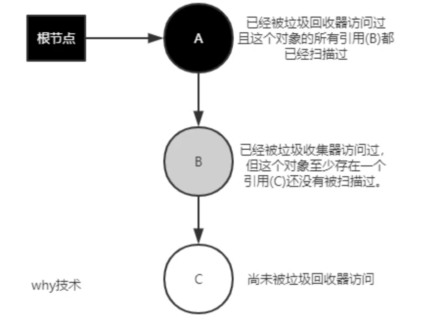

在遍历对象图的过程中，把访问的对象都按照是否访问过标记成3种颜色
- `白色` 还未被垃圾回收器访问过，开始阶段所有对象都是白色的，在结束阶段如果对象还是白色则不可达
- `黑色` 对象已经被垃圾回收器访问过，且这个对象的所有引用都已经被扫描过，是安全存活的
- `灰色` 对象被垃圾回收器访问过，但是这个对象至少存在一个引用没有被访问过

如果现在GC和用户线程同时运行，GC在标记颜色，用户线程在修改引用关系
##### 问题
- 把原本死亡的对象标记为存活
  - 其实这个是小问题因为这就产生了浮动的垃圾，下次清理就好了
- 把原本存活的对象标记为死亡
  - 这个问题就非常严重了，需要的对象被回收，程序肯定会发生错误
#### 标记过程
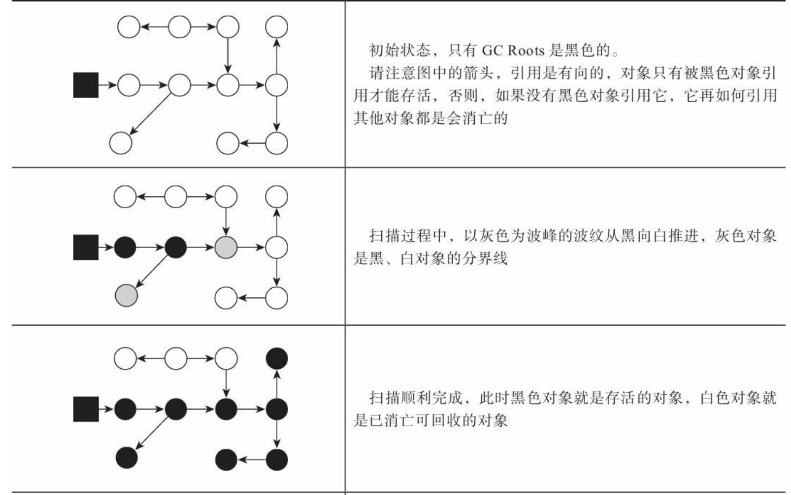
##### 正常标记
##### 对象消失的情况
- 正在扫描的灰色对象的一个引用被切断，与一个原本已经被扫描过的黑色对象产生了引用关系
  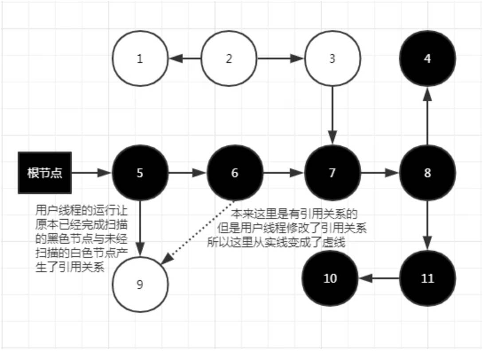
- 原本是引用链的一部分，但是被切断了并与原本扫描的黑色节点产生了引用关系
  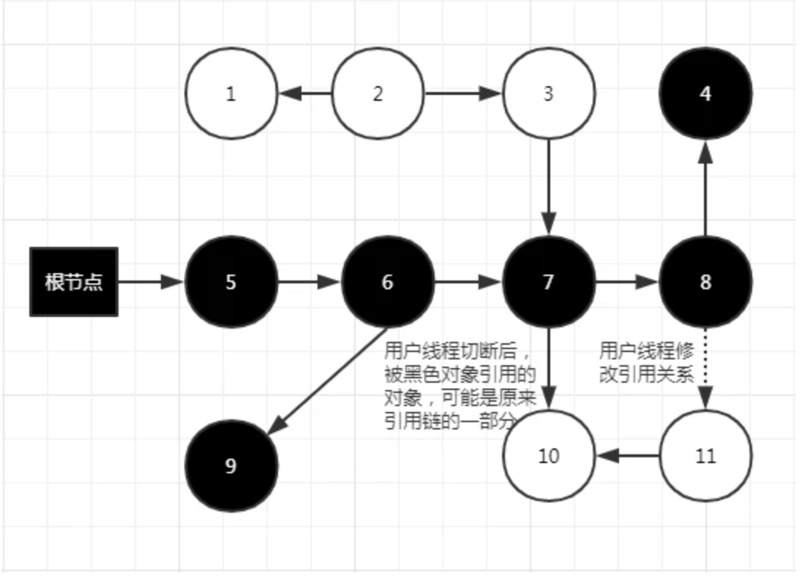
#### 对象消失的条件
当且仅当以下两个条件同时满足时会产生对象消失问题
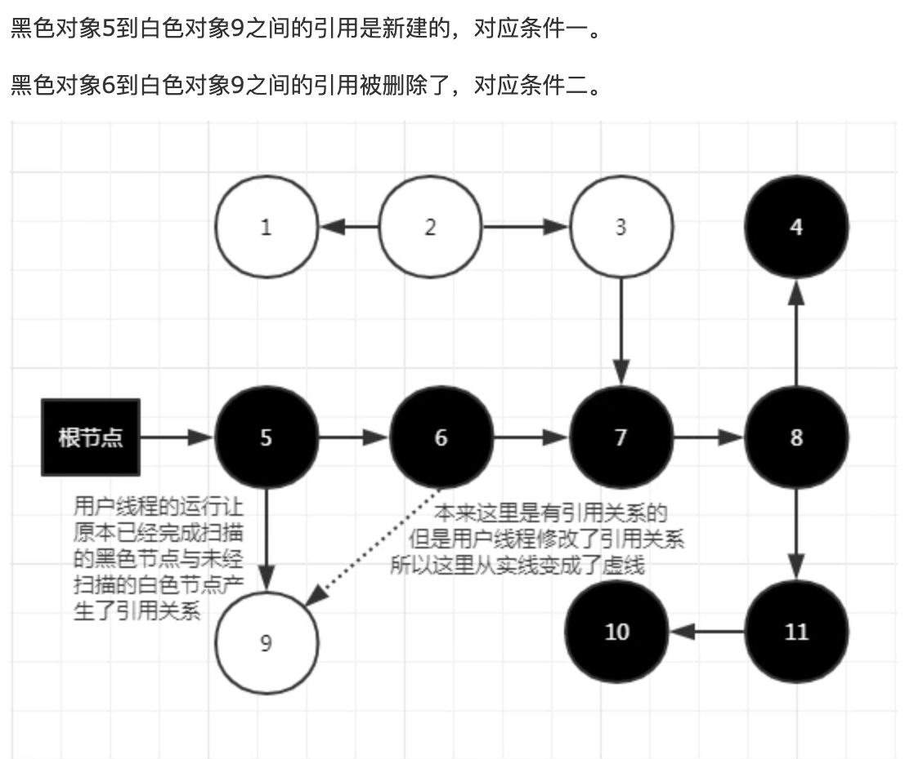
- 条件一
  - 赋值器插入了一条或者多条黑色到白色对象的引用
- 条件二
  - 赋值器删除了全部灰色对象到白色对象的直接或间接引用
- 这两个条件只要破坏一个即可
#### 解决方案
- 增量更新
  - 什么是增量更新Incremental Update
  - 增量更新是破坏第一个条件，当黑色对象插入了新的白色对象引用时，就将这个新插入的引用记录下来，等并发扫描结束后，再将这些记录按黑色对象为根重新扫描一次
  - CMS收集器是使用这个
- 原始快照
  - 什么是原始快照Snapshot At The Beginning， SATB
  - 原始快照是破坏第二个条件，当灰色对象要删除指向白色对象的引用时就将这个删除的引用记录下来，并发扫描结束后，将这些记录再以灰色对象为根，重新扫描一次
  - 相当于不管删除与否，都会按照刚扫描那一刻的对象图扫描


# 垃圾回收器
## Serial收集器
### 流程
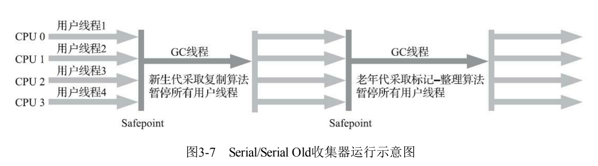
### 特点
- 单线程
- 停顿时间长
- 但对应资源紧张的服务器却是最优的选择
  - 单核
  - 内存小
  - 因为它没有切换线程的开销
- 它是 Client 场景下的默认新生代收集器，因为在该场景下内存一般来说不会很大。它收集一两百兆垃圾的停顿时间可以控制在一百多毫秒以内，只要不是太频繁，这点停顿时间是可以接受的。
## ParNew收集器
### 流程
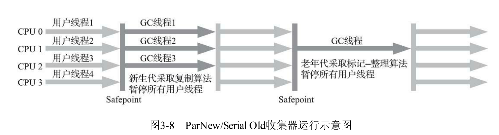
### 特点
- 多线程
- 实际就是Serial的多线程版本
- 只有它能与CMS 收集器配合工作。
## ParallelScavenge收集器
### 特点
- 基于标记-复制算法
- 多线程
- 其它收集器目标是尽可能缩短垃圾收集时用户线程的停顿时间，而它的目标是达到一个可控制的吞吐量
  - 这里的吞吐量指 CPU 用于运行用户程序的时间占总时间的比值
- 吞吐量优先收集器
### JVM参数
- -XX：MaxGCPauseMillis
  - 大于0的毫秒值
  - 控制最大垃圾收集停顿时间，收集器尽力暴走内存回收花费的时间不超过用户设定的值
  - 如果设置小一些，使得垃圾回收快一点，其实是通过减少新生代的大小来实现的，回收300M肯定比回收500M花的时间少，但是GC 也会变得更频繁，吞吐量就下来了
- -XX：GCTimeRatio
  - 直接设置吞吐量大小，也就是GC时间占总时间的比率
  - 大于0小于100的整数
  - 譬如把此参数设置为19，那允许的最大垃圾收集时间就占总时间的5% （即1/(1+19)），默认值为99，即允许最大1%（即1/(1+99)）的垃圾收集时间
- -XX：+UseAdaptiveSizePolicy
  - 激活后不需要人工指定新生代的大小、新生代和老年代的比值、晋升老年代的大小等细节参数，虚拟机会自适应，自动调节
## SerialOld收集器
### 流程
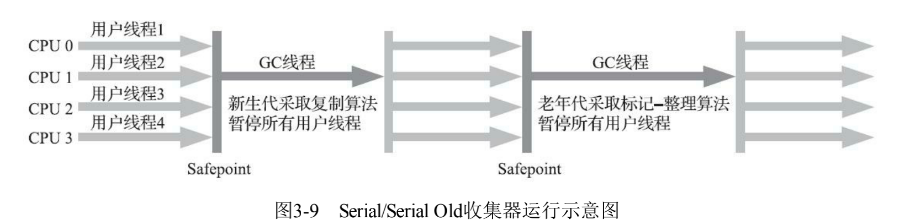
### 特点
- Serial的老年代版本
- 单线程
- 使用标记-整理算法
## ParallelOld收集器
### 流程
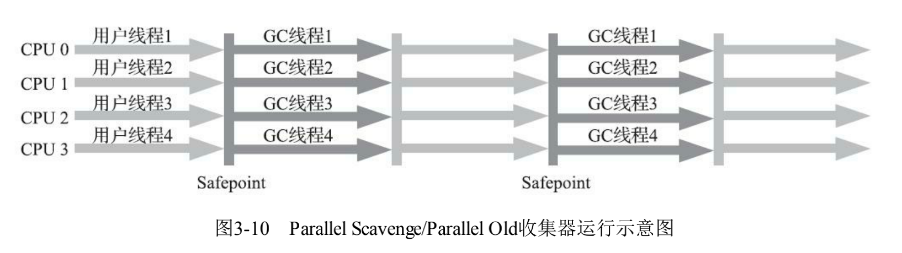
### 特点
- Parallel Scavenge收集器的老年代版本
- 多线程
- 注重吞吐量
## CMS收集器
### 流程
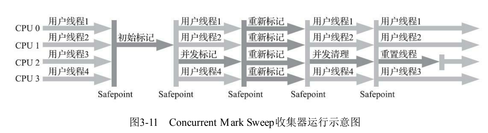
- 初始标记
  - 仅仅只是标记一下GC Roots能直接关联到的对象，速度很快
  - 需要STW
- 并发标记
  - 从GC Roots的直接关联对象开始遍历整个对 象图的过程
  - 并发
- 重新标记
  - 为了修正并发标记期间，因用户程序继续运作而导致标记产生变动的那一部分对象的 标记记录，这个阶段的停顿时间通常会比初始标记阶段稍长一 些，但也远比并发标记阶段的时间短
  - 并发
- 并发清除
  - 清理删除掉标记阶段判断的已经死亡的 对象，由于不需要移动存活对象，所以这个阶段也是可以与用户线程同时并发的
  - 并发
### 特点
- 吞吐量低：低停顿时间是以牺牲吞吐量为代价的，导致 CPU 利用率不够高
- 无法处理浮动垃圾，可能出现 Concurrent Mode Failure。浮动垃圾是指并发清除阶段由于用户线程继续运行而产生的垃圾，这部分垃圾只能到下一次 GC 时才能进行回收。由于浮动垃圾的存在，因此需要预留出一部分内存，意味着 CMS 收集不能像其它收集器那样等待老年代快满的时候再回收。如果预留的内存不够存放浮动垃圾，就会出现 Concurrent Mode Failure，这时虚拟机将临时启用 Serial Old 来替代 CMS
  - 并发阶段用户线程也在产生垃圾，只能下一次清理
  - 浮动垃圾
- 标记 - 清除算法导致的空间碎片，往往出现老年代空间剩余，但无法找到足够大连续空间来分配当前对象，不得不提前触发一次 Full GC。
## G1收集器
### 流程
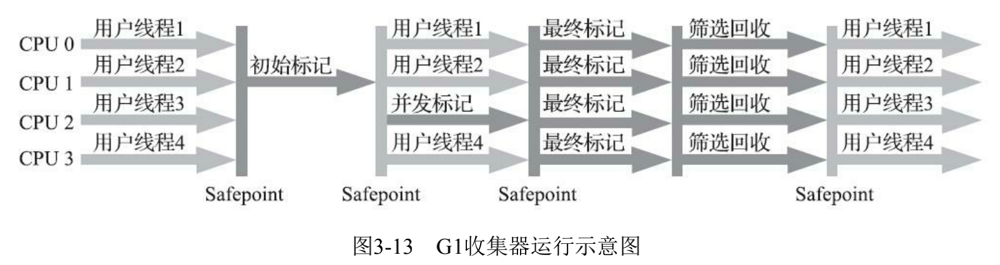
- 初始标记
  - 仅仅只是标记一下GC Roots能直接关联到的对象，并且修改TAMS 指针的值，让下一阶段用户线程并发运行时，能正确地在可用的Region中分配新对象。
  - STW
- 并发标记
  - 从GC Root开始对堆中对象进行可达性分析，递归扫描整个堆 里的对象图，找出要回收的对象，这阶段耗时较长，但可与用户程序并发执行。当对象图扫描完成以 后，还要重新处理SATB记录下的在并发时有引用变动的对象
  - 并发
- 最终标记
  - 对用户线程做另一个短暂的暂停，用于处理并发阶段结束后仍遗留 下来的最后那少量的SATB记录
  - STW
- 筛选回收
  - 负责更新Region的统计数据，对各个Region的回 收价值和成本进行排序，根据用户所期望的停顿时间来制定回收计划，可以自由选择任意多个Region 构成回收集，然后把决定回收的那一部分Region的存活对象复制到空的Region中，再清理掉整个旧 Region的全部空间。这里的操作涉及存活对象的移动，是必须暂停用户线程，由多条收集器线程并行 完成的。
  - STW
### 特点
- 主要面向服务端应用的垃圾收集器。
- 基于Region的堆内存布局
  - 不在基于分代，而是回收任何区域，基于哪块内存存放的垃圾数量最多，回收收益最大
  - G1不再坚持固定大小以及固定数量的 分代区域划分，而是把连续的Java堆划分为多个大小相等的独立区域（Region），每一个Region都可以根据需要，扮演新生代的Eden空间、Survivor空间，或者老年代空间
    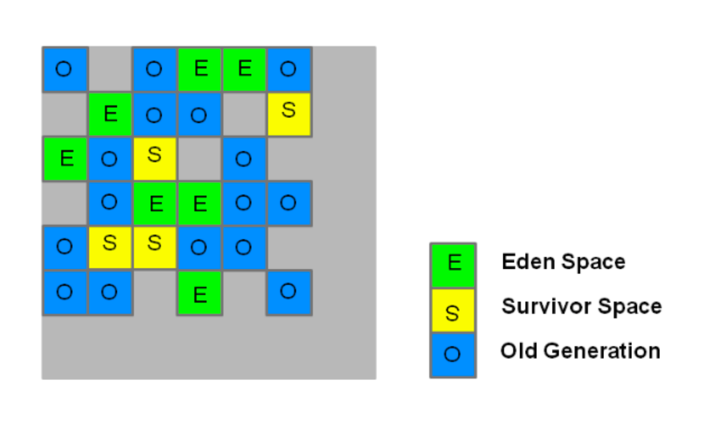
    - 收集器能够对扮演不同角色的 Region采用不同的策略去处理，这样无论是新创建的对象还是已经存活了一段时间、熬过多次收集的 旧对象都能获取很好的收集效果
    - 跨Region引用对象如何解决
      - 使用记忆集避免全堆作为GC Roots扫描，
      - 但是G1的记忆集设计更复杂，在本质上是一种哈希表，key是别的region的起始位置，value是一个集合储存卡表的索引号，这里的卡表是“双向的”（卡表是我指向谁，但是这种结构还记录谁指向我）比之前的要复杂
    - 并发标记新对象的标记
      - 原始快照
      - 每一个Region上都设计了两个名为TAMS（top at mark start）的指针，把region的一部分空间划分出来用于并发回收过程中的新对象的内存分配，并发回收时新分配的对象地址都必须要在这两个指针位置以上
  - 每次收集到的内存空间都是Region大小的整数倍,这样可以有计划地避免 在整个Java堆中进行全区域的垃圾收集
- Humongous区域
专门用来存储大对象。G1认为只要大小超过了一个 Region容量一半的对象即可判定为大对象。每个Region的大小可以通过参数-XX：G1HeapRegionSize设 定，取值范围为1MB～32MB，且应为2的N次幂。而对于那些超过了整个Region容量的超级大对象， 将会被存放在N个连续的Humongous Region之中，G1的大多数行为都把Humongous Region作为老年代 的一部分来进行看待
## ZGC收集器
### 特点
#### 动态创建和销毁以及动态的容量大小的region
- ·小型Region（Small Region）：容量固定为2MB，用于放置小于256KB的小对象。
- ·中型Region（Medium Region）：容量固定为32MB，用于放置大于等于256KB但小于4MB的对 象。
- ·大型Region（Large Region）：容量不固定，可以动态变化，但必须为2MB的整数倍，用于放置 4MB或以上的大对象。
#### 染色指针技术
- 直接将少量额外的信息存储在指针上的技术
  - 尽管Linux下64位指针的高18位不能用来寻址，但剩余的46位指针所能支持的64TB内存在今天仍 然能够充分满足大型服务器的需要。鉴于此，ZGC的染色指针技术继续盯上了这剩下的46位指针宽 度，将其高4位提取出来存储四个标志信息。通过这些标志位，虚拟机可以直接从指针中看到其引用对 象的三色标记状态、是否进入了重分配集（即被移动过）、是否只能通过finalize()方法才能被访问 到
    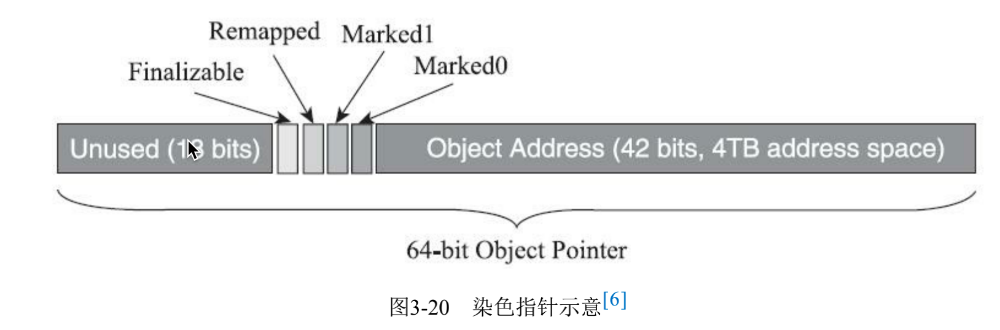
- 特点
  - 染色指针可以使得一旦某个Region的存活对象被移走之后，这个Region立即就能够被释放和重用 掉，而不必等待整个堆中所有指向该Region的引用都被修正后才能清理
  - 染色指针可以大幅减少在垃圾收集过程中内存屏障的使用数量，设置内存屏障，尤其是写屏障的 目的通常是为了记录对象引用的变动情况，如果将这些信息直接维护在指针中，显然就可以省去一些 专门的记录操作
  - 染色指针可以作为一种可扩展的存储结构用来记录更多与对象标记、重定位过程相关的数据，以 便日后进一步提高性能
    - 现在Linux下的64位指针还有前18位并未使用，它们虽然不能用来寻址，却可 以通过其他手段用于信息记录。如果开发了这18位，既可以腾出已用的4个标志位，将ZGC可支持的 最大堆内存从4TB拓展到64TB，也可以利用其余位置再存储更多的标志，譬如存储一些追踪信息来让 垃圾收集器在移动对象时能将低频次使用的对象移动到不常访问的内存区域。


