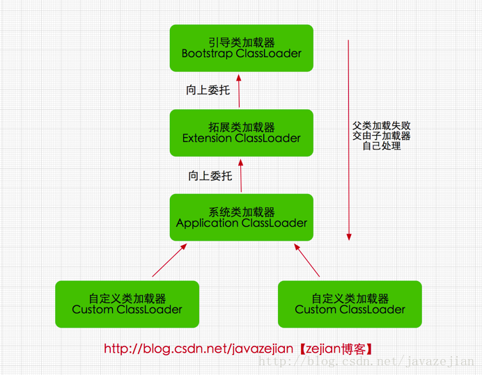

* [类加载机制](#类加载机制)
  * [有哪些类加载器](#有哪些类加载器)
  * [1.引导类加载器 bootstrap classloader](#1引导类加载器-bootstrap-classloader)
  * [2.扩展类加载器 extensions classloader](#2扩展类加载器-extensions-classloader)
  * [3.应用程序类加载器 application classloader](#3应用程序类加载器-application-classloader)
  * [4.自定义类加载器 java.lang.classloder](#4自定义类加载器-javalangclassloder)
* [生命周期](#生命周期)
  * [1. 加载](#1-加载)
  * [2. 验证](#2-验证)
  * [3. 准备](#3-准备)
  * [4. 解析](#4-解析)
  * [5. 初始化](#5-初始化)
  * [双亲委派模型](#双亲委派模型)
    * [工作过程](#工作过程)
    * [好处](#好处)
    * [ClassLoader用过吗？用在哪些方面](#classloader用过吗用在哪些方面)
      * [1、依赖冲突](#1依赖冲突)
      * [2、热加载](#2热加载)
      * [3、加密保护](#3加密保护)

# 类加载机制
### 有哪些类加载器

#### 1.引导类加载器 `bootstrap classloader`
启动类加载器主要加载的是JVM自身需要的类，这个类加载使用C++语言实现的
#### 2.扩展类加载器 `extensions classloader`
它负责加载`JAVA_HOME/lib/ext`目录下或者由系统变量`-Djava.ext.dir`指定位路径中的类库，开发者可以直接使用标准扩展类加载器
#### 3.应用程序类加载器 `application classloader`
应用程序加载器是指 Sun公司实现的`sun.misc.Launcher$AppClassLoader`。它负责加载系统类路径`java -classpath`或`-D java.class.path` 指定路径下的类库，也就是我们经常用到的classpath路径
#### 4.自定义类加载器 `java.lang.classloder`
继承java.lang.ClassLoader类的方式
# 生命周期
### 1. 加载
通过类的完全限定名称获取定义该类的二进制字节流。
- 其中二进制字节流可以从以下方式中获取
  - 从 ZIP 包读取，成为 JAR、EAR、WAR 格式的基础。
  - 从网络中获取，最典型的应用是 Applet。
  - 运行时计算生成，例如动态代理技术，在 java.lang.reflect.Proxy 使用 ProxyGenerator.generateProxyClass的代理类的二进制字节流。
  - 由其他文件生成，例如由 JSP 文件生成对应的 Class 类。
- 将该字节流表示的静态存储结构转换为方法区的运行时存储结构。
- 在内存中生成一个代表该类的 Class 对象，作为方法区中该类各种数据的访问入口
### 2. 验证
确保 Class 文件的字节流中包含的信息符合当前虚拟机的要求，并且不会危害虚拟机自身的安全
### 3. 准备
准备阶段是正式为类中定义的变量（即静态变量，被static修饰的变量）分配内存并设置类变量初 始值的阶段
- 类变量是被 static 修饰的变量，准备阶段为类变量分配内存并设置初始值，使用的是方法区的内存
  - 初始值一般为 0 值，例如下面的类变量 value 被初始化为 0 而不是 123。 `public static int value = 123;`
  - 如果类变量是常量，那么它将初始化为表达式所定义的值而不是 0。例如下面的常量 value 被初始化为 123 而不是0。 `public static final int value = 123;`
- 实例变量不会在这阶段分配内存，它会在对象实例化时随着对象一起被分配在堆中。应该注意到，实例化不是类加载的一个过程，类加载发生在所有实例化操作之前，并且类加载只进行一次，实例化可以进行多次。
### 4. 解析
将常量池的符号引用替换为直接引用的过程
- 符号引用（Symbolic References）：符号引用以一组符号来描述所引用的目标，符号可以是任何 形式的字面量，只要使用时能无歧义地定位到目标即可
- 直接引用（Direct References）：直接引用是可以直接指向目标的指针、相对偏移量或者是一个能 间接定位到目标的句柄
### 5. 初始化
初始化阶段才真正开始执行类中定义的 Java 程序代码。初始化阶段是虚拟机执行类构造器 `<clinit>() `方法的过程。在准备阶段，类变量已经赋过一次系统要求的初始值，而在初始化阶段，根据程序员通过程序制定的主观计划去初始类变量和其它资源化

## 双亲委派模型
该模型要求除了顶层的启动类加载器外，其它的类加载器都要有自己的父类加载器

#### 工作过程
一个类加载器首先将类加载请求转发到父类加载器，只有当父类加载器无法完成时才尝试自己加载
#### 好处
保证了基础类是唯一的
- 它使得类有了层次的划分。就拿`java.lang.Object`来说，你加载它经过一层层委托最终是由Bootstrap ClassLoader来加载的，也就是最终都是由Bootstrap ClassLoader去找`<JAVA_HOME>\lib`中`rt.jar`里面的`java.lang.Object`加载到JVM中。
- 这样如果有不法分子自己造了个`java.lang.Object`,里面嵌了不好的代码，如果我们是按照双亲委派模型来实现的话，最终加载到JVM中的只会是我们`rt.jar`里面的东西，也就是这些核心的基础类代码得到了保护。因为这个机制使得系统中只会出现一个`java.lang.Object`。不会乱套了。你想想如果我们JVM里面有两个Object,那岂不是天下大乱了
### ClassLoader用过吗？用在哪些方面
#### 1、依赖冲突
实际项目中如果出现需要同时依赖多个版本的jar包，可以自定义类加载器分别加载各自的依赖jar即可
#### 2、热加载
可以让RestartClassLoader为自定义的类加载器，其核心是loadClass的加载方式，我们发现其通过修改了双亲委托机制，默认优先从自己加载，如果自己没有加载到，从从parent进行加载。这样保证了业务代码可以优先被RestartClassLoader加载。进而通过重新加载RestartClassLoader即可完成应用代码部分的重新加载。
#### 3、加密保护
- 打包时加密class文件
- 加载时使用实现解密的classloader

