* [文件io](#文件io)
  * [磁盘操作](#磁盘操作)
  * [字节流](#字节流)
  * [字符流](#字符流)
* [序列化](#序列化)
  * [什么是序列化](#什么是序列化)
  * [序列化的实现](#序列化的实现)
  * [案例](#案例)
  * [transient](#transient)
* [网络io](#网络io)
  * [InetAddress](#inetaddress)
  * [URL](#url)
  * [socket](#socket)
  * [特点](#特点)
* [NIO](#nio)
  * [什么是NIO](#什么是nio)
  * [流与块](#流与块)
  * [通道 Channel](#通道-channel)
  * [缓冲区Buffer](#缓冲区buffer)
  * [选择器 Selector](#选择器-selector)
    * [选择器](#选择器)
      * [什么是选择器](#什么是选择器)
    * [流程](#流程)
  * [NIO的bug](#nio的bug)
# 文件io
## 磁盘操作
file
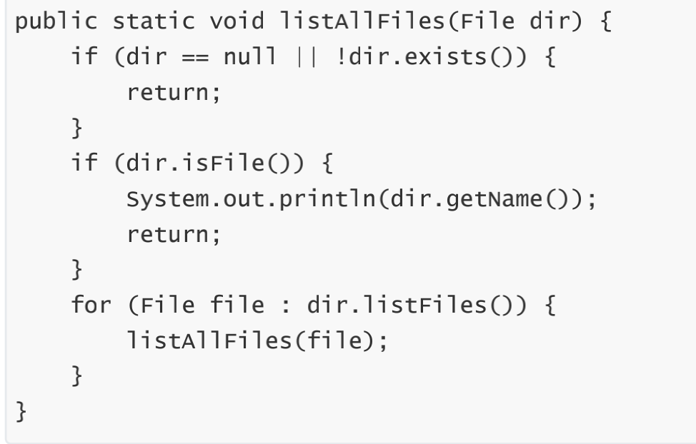
## 字节流
- 可以处理任意类型的数据
  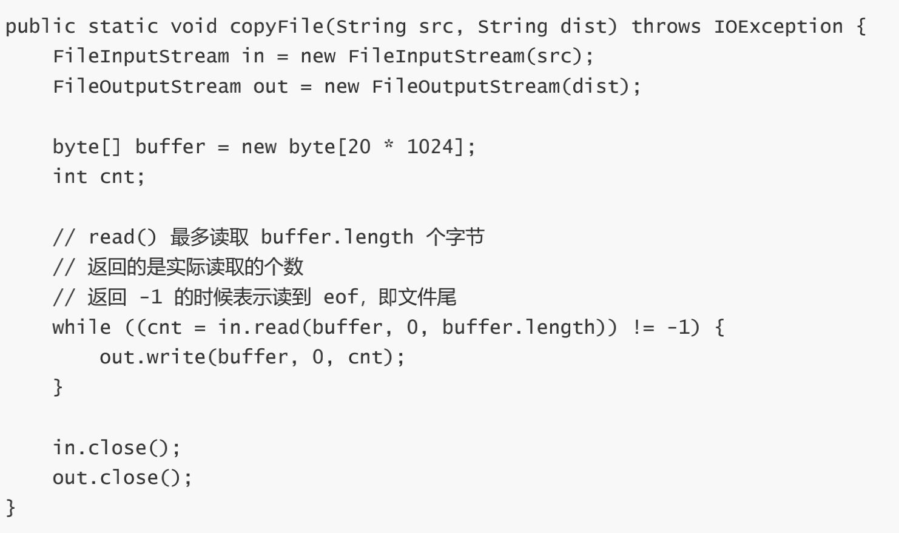
- inputStream
  - FileInputStream
- outputStream
  - FileOutputStream
## 字符流
- 只能处理字符类型的数据
  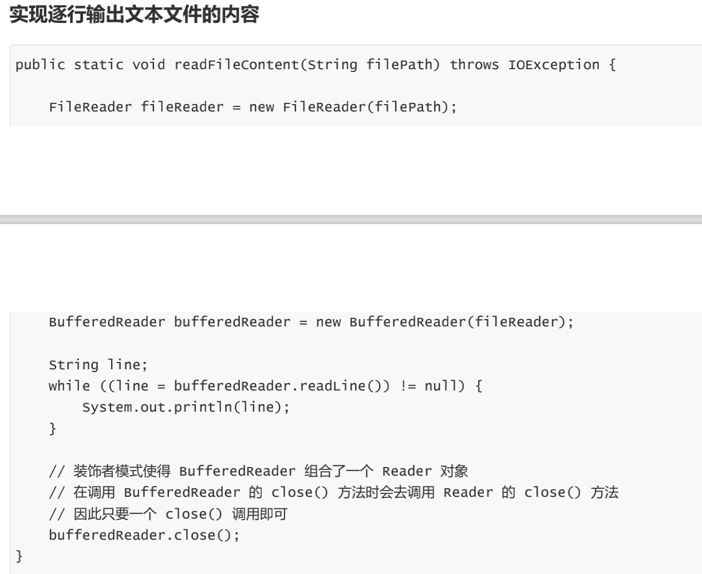
- 编码与解码
  - 编码就是把字符转换为字节，而解码是把字节重新组合成字符。
- Reader
- InputStreamReader
实现从字节流解码成字符流
- Write
- InputStreamWriter
实现字符流编码成为字节流

# 序列化
## 什么是序列化
- 序列化就是一种用来处理对象流的机制，将对象的内容进行流化。可以对流化后的对象进行读写操作，可以将流化后的对象传输于网络之间。序列化是为了解决在对象流读写操作时所引发的问题
- 方便存储和传输
- 序列化：`ObjectOutputStream.writeObject()`
- 反序列化：`ObjectInputStream.readObject()`
## 序列化的实现
将需要被序列化的类实现Serialize接口
## 案例
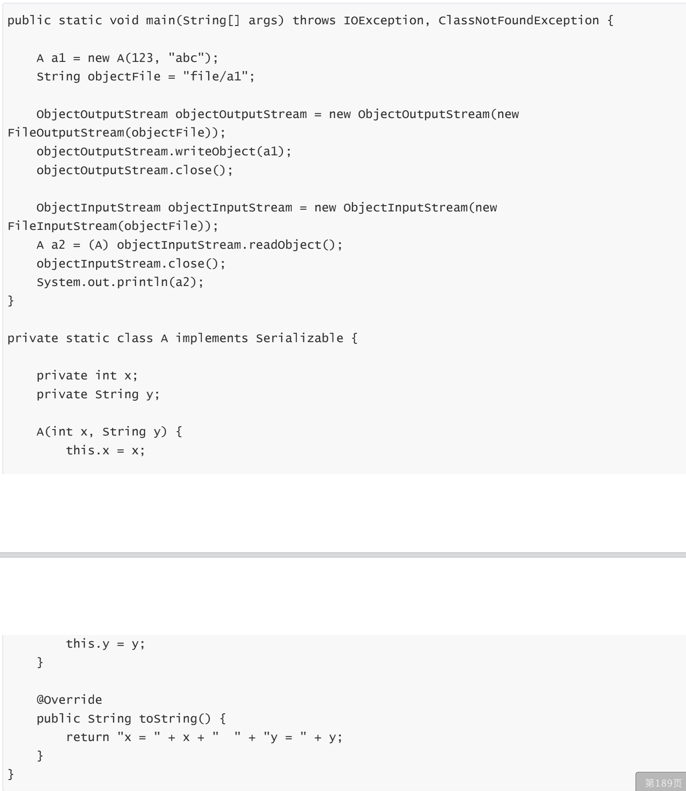
## transient
- transient 关键字可以使一些属性不会被序列化
- ArrayList 中存储数据的数组 elementData 是用 transient 修饰的，因为这个数组是动态扩展的，并不是所有的空间都被使用，因此就不需要所有的内容都被序列化。通过重写序列化和反序列化方法，使得可以只序列化数组中有内容的那部分数据。
  - `private transient Object[] elementData;`

# 网络io
## InetAddress
用于表示网络上的硬件资源，即 IP 地址；
- InetAddress.getByName(String host);
- InetAddress.getByAddress(byte[] address);
## URL
案例
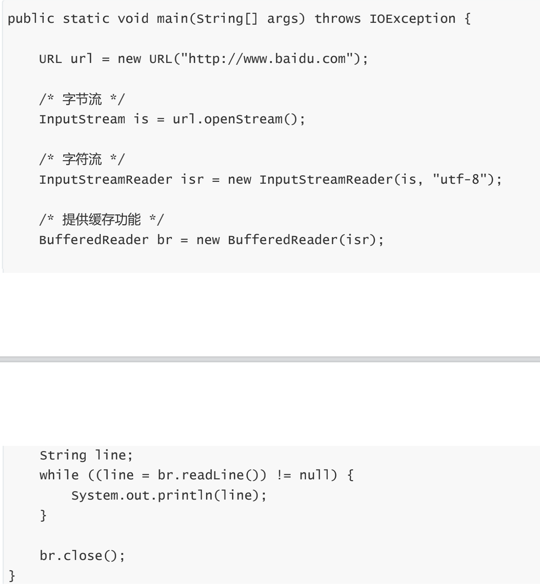
## socket
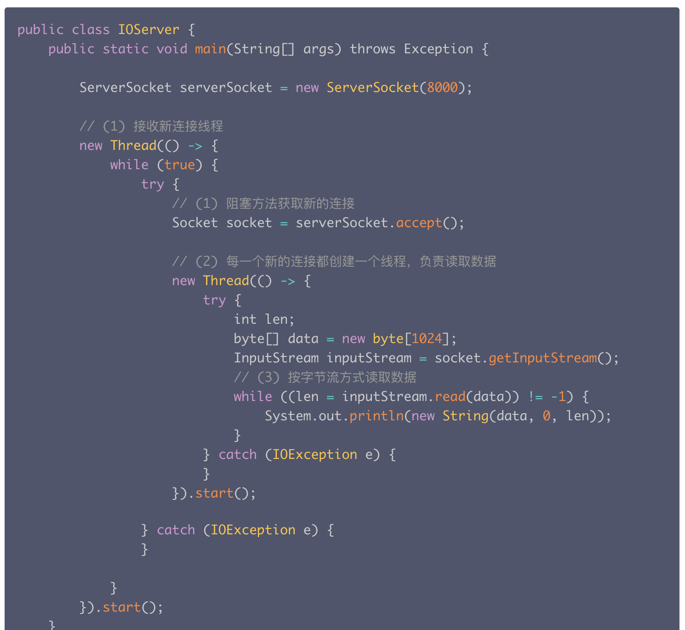
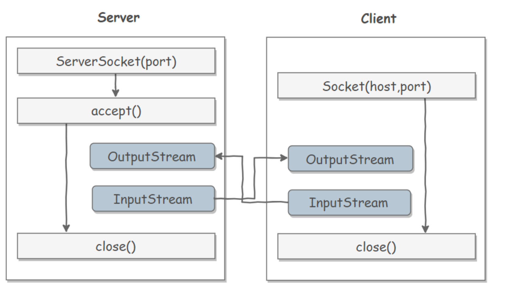
## 特点
同步阻塞，一个线程只能处理一个请求，如果要处理多个请求需要开启多个线程

# NIO
## 什么是NIO
新的输入/输出 (NIO) 库是在 JDK 1.4 中引入的，弥补了原来的 I/O 的不足，提供了高速的、面向块的 I/O
## 流与块
I/O 与 NIO 最重要的区别是数据打包和传输的方式，I/O 以流的方式处理数据，而 NIO 以块的方式处理数据。
## 通道 Channel
- 是对原 I/O 包中的流的模拟，可以通过它读取和写入数据
- 特点
  - 通道与流的不同之处在于，流只能在一个方向上移动(一个流必须是 InputStream 或者 OutputStream 的子类)，而通道是双向的，可以用于读、写或者同时用于读写。
- 类型
  - FileChannel：从文件中读写数据；
  - DatagramChannel：通过 UDP 读写网络中数据；
  - SocketChannel：通过 TCP 读写网络中数据；
  - ServerSocketChannel：可以监听新进来的 TCP 连接，对每一个新进来的连接都会创建一个 SocketChannel。
## 缓冲区Buffer
- 发送给一个通道的所有数据都必须首先放到缓冲区中，同样地，从通道中读取的任何数据都要先读到缓冲区中。也就是说，不会直接对通道进行读写数据，而是要先经过缓冲区。
- 缓冲区实质上是一个数组，但它不仅仅是一个数组。缓冲区提供了对数据的结构化访问，而且还可以跟踪系统的读/写进程。
- 类型
  - ByteBuffer
  - CharBuffer
  - ShortBuffer
  - IntBuffer
  - LongBuffer
  - FloatBuffer
  - DoubleBuffer
- 缓冲区状态变量
  - capacity：最大容量；
  - position：当前已经读写的字节数；
    - 下一个要被读取或者写入的元素的索引
  - limit：还可以读写的字节数。
    - 缓冲区中第一个不能被读或者写的位置
- 状态变量的改变过程
  1. 新建一个大小为 8 个字节的缓冲区，此时 position 为 0，而 limit = capacity = 8。capacity 变量不会改变
     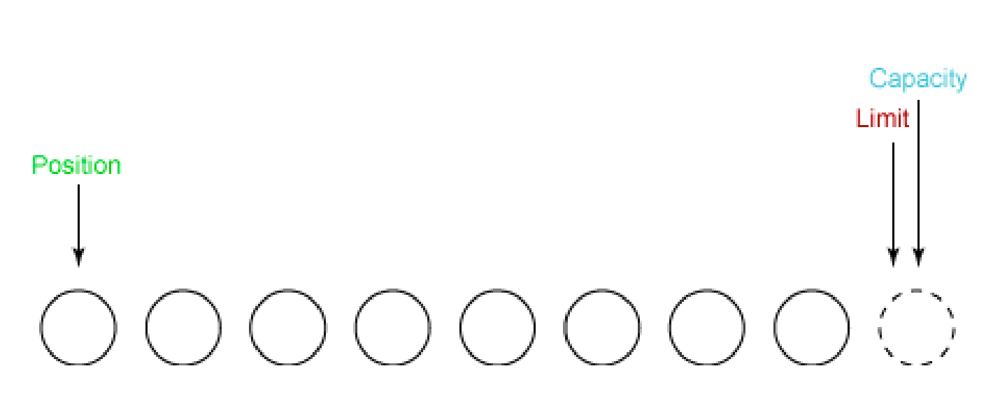
  2. 从输入通道中读取 5 个字节数据写入缓冲区中，此时 position 为 5，limit 保持不变。
     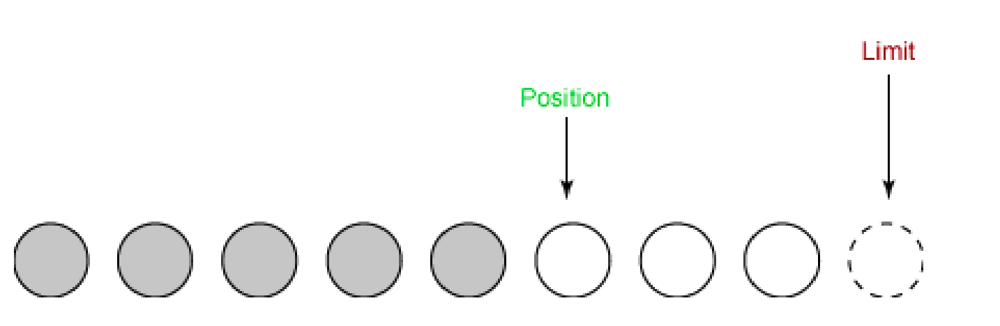
  3. 在将缓冲区的数据写到输出通道之前，需要先调用 flip() 方法，这个方法将 limit 设置为当前 position，并将position 设置为 0。
     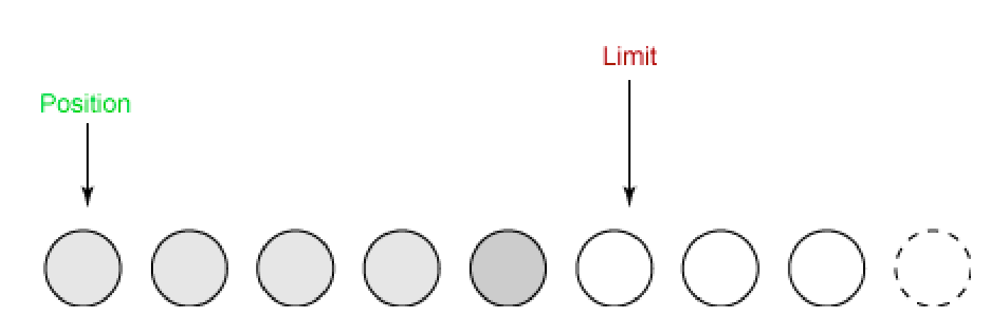
  4. 从缓冲区中取 4 个字节到输出缓冲中，此时 position 设为 4。
     
  5. 最后需要调用 clear() 方法来清空缓冲区，此时 position 和 limit 都被设置为最初位置。
     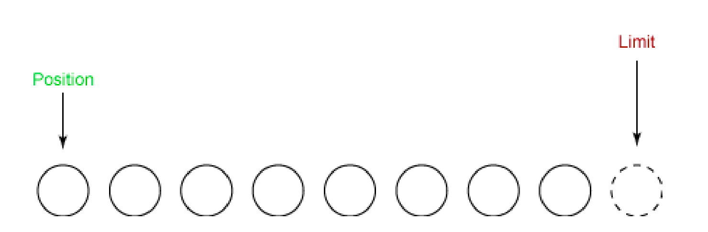
- 文件 NIO 实例
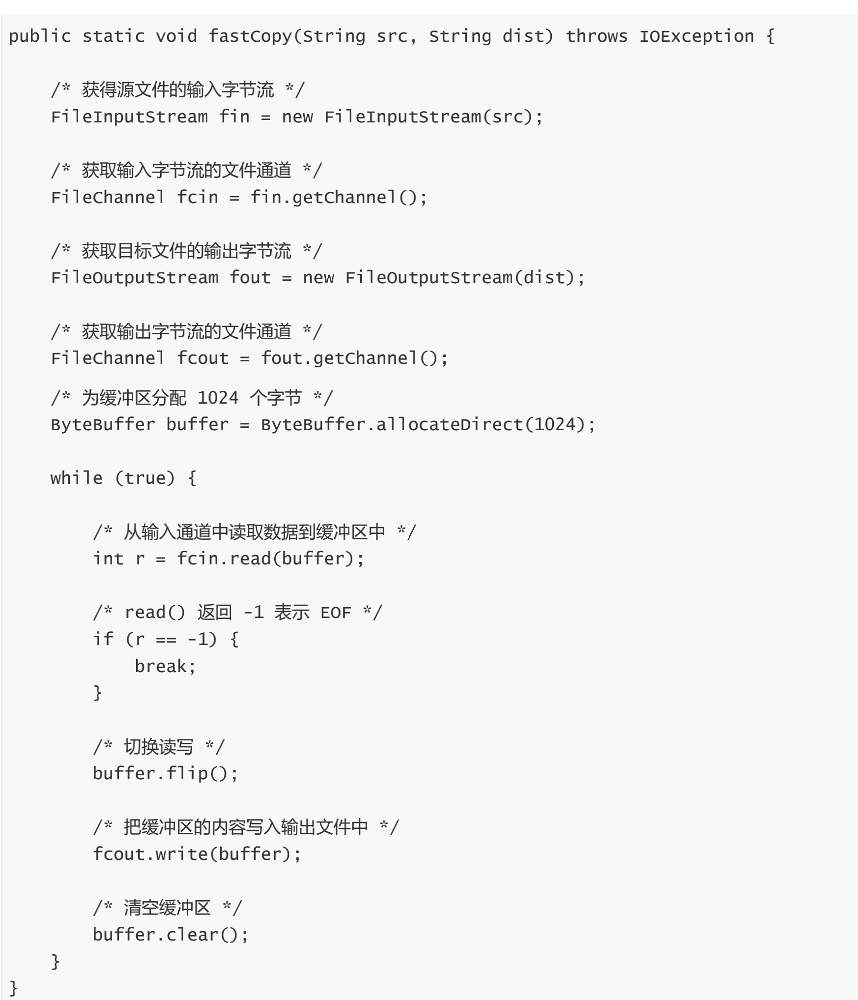
## 选择器 Selector
### 选择器
#### 什么是选择器
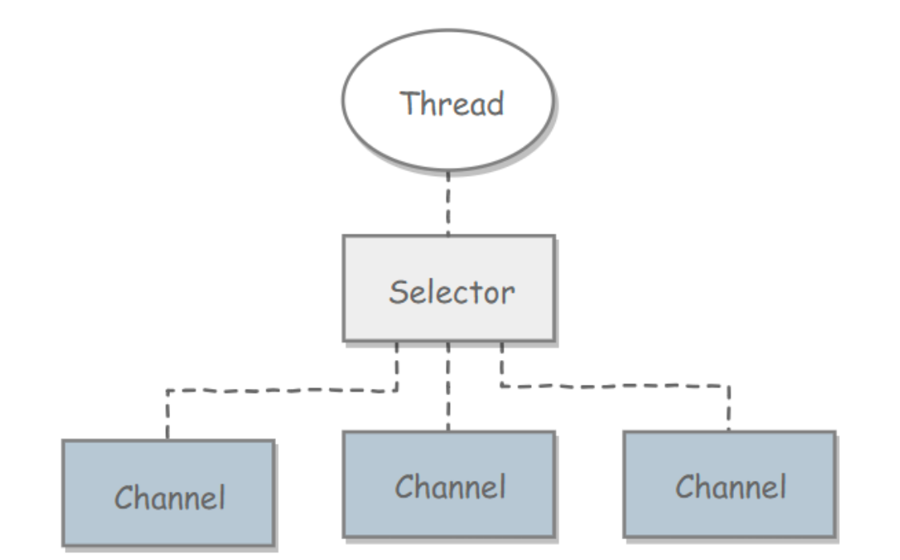
- NIO 常常被叫做非阻塞 IO，主要是因为 NIO 在网络通信中的非阻塞特性被广泛使用。
- NIO 实现了 IO 多路复用中的 Reactor 模型，一个线程 Thread 使用一个选择器 Selector 通过轮询的方式去监听多个通道 Channel 上的事件，从而让一个线程就可以处理多个事件。
- 通过配置监听的通道 Channel 为非阻塞，那么当 Channel 上的 IO 事件还未到达时，就不会进入阻塞状态一直等待，而是继续轮询其它 Channel，找到 IO 事件已经到达的 Channel 执行。
- 因为创建和切换线程的开销很大，因此使用一个线程来处理多个事件而不是一个线程处理一个事件，对于 IO 密集型的应用具有很好地性能。
- 应该注意的是，只有套接字 Channel 才能配置为非阻塞，而 FileChannel 不能，为 FileChannel 配置非阻塞也没有意义。
### 流程
- 创建选择器
`Selector selector = Selector.open();`
- 将通道注册到选择器上
  ```
  ServerSocketChannel ssChannel = ServerSocketChannel.open();
  ssChannel.configureBlocking(false);
  ssChannel.register(selector, SelectionKey.OP_ACCEPT);
  ```
  - 事件
    - `SelectionKey.OP_CONNECT`
    - `SelectionKey.OP_ACCEPT`
    - `SelectionKey.OP_READ`
    - `SelectionKey.OP_WRITE`
- 监听事件
  `int num = selector.select();`
  - 它会一直阻塞直到有至少一个事件到达。
- 获取到达的事件
             
- 事件循环
  因为一次 select() 调用不能处理完所有的事件，并且服务器端有可能需要一直监听事件，因此服务器端处理事件的代码一般会放在一个死循环内。
  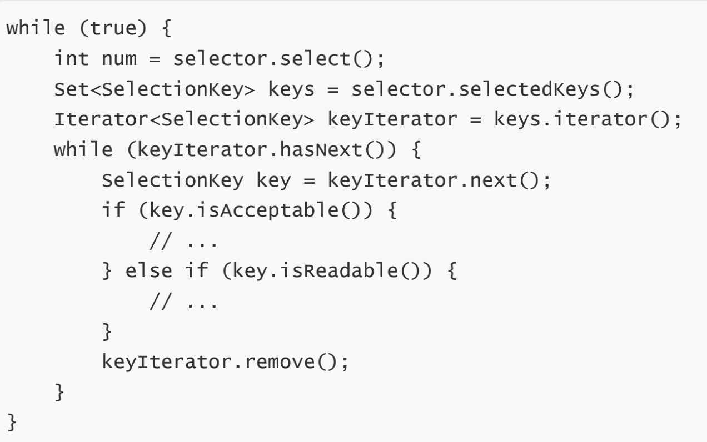
- nio示例
  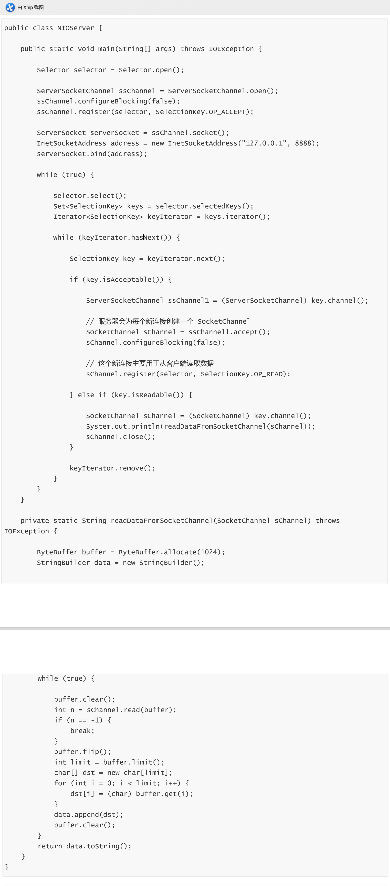
  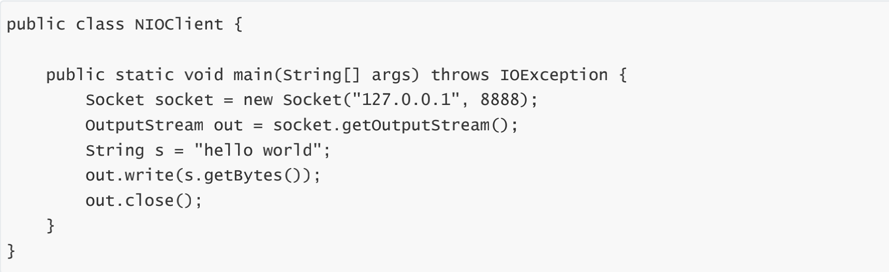
## NIO的bug