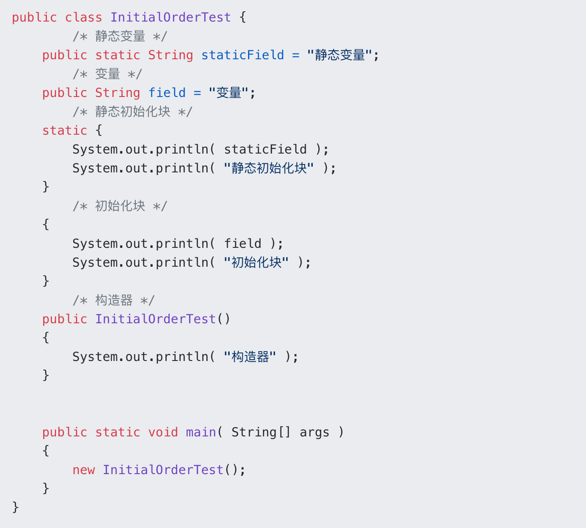

# final
## 修饰变量
- 声明数据为常量，可以是编译时常量，也可以是在运行时被初始化后不能被改变的常量
  - 对于基本类型，final 使数值不变；
  - 对于引用类型，final 使引用不变，也就不能引用其它对象，但是被引用的对象本身是可以修改的。
- 修饰成员变量需要显示初始化
  - 声明时初始化
  - 构造时对其赋值
## 修饰方法
- 声明方法不能被子类重写。
- private 方法隐式地被指定为 final，如果在子类中定义的方法和基类中的一个 private 方法签名相同，此时子类的方法不是重写基类方法，而是在子类中定义了一个新的方法。
## 修饰类
声明类不允许被继承
## 底层原理
- 写final域的重排序规则
  - 在构造函数内对一个final域的写入，与随后把这个被构造对象的引用赋值给一个引用变量，这两个操作之间不能重排序。
  - （先写入final变量，后调用该对象引用）
  - 原因：编译器会在final域的写之后，插入一个StoreStore屏障
- 读final域的重排序规则
  - 初次读一个包含final域的对象的引用，与随后初次读这个final域，这两个操作之间不能重排序
  - （先读对象的引用，后读final变量）
  - 编译器会在读final域操作的前面插入一个LoadLoad屏障
## final关键字的好处
1. final关键字提高了性能。JVM和Java应用都会缓存final变量。
2. final变量可以安全的在多线程环境下进行共享，而不需要额外的同步开销。
3. 使用final关键字，JVM会对方法、变量及类进行优化。
## 为什么匿名内部类引用外部类的变脸必须是final
- 匿名内部类在编译的时候会编译为一个单独的类，并且匿名内部类引用的外部类的变量会作为构造函数的参数传入，如果匿名内部类能访问非final的变量就表明如果修修改了这个非final的变量会影响 匿名内部类，匿名内部类感知不到数据已修改造成数据不同步
- 就好比说你创建了我，并且给了我一个你的东西使用但是你又不让我能直接拿到(引用传递)非要我copy一个一模一样的（值传递），但是运行的时候你把这点东西改了，而我又感知不了，就造成数据不一致，所以和Java8 lambda表达式需要变量为final一样，如果把值传递改为引用传递就不会报错了
# static
## 静态变量
又称为类变量，也就是说这个变量属于类的，类所有的实例都共享静态变量，可以直接通过类名来访问它。静态变量在内存中只存在一份
## 静态方法
静态方法在类加载的时候就存在了，它不依赖于任何实例。所以静态方法必须有实现，也就是说它不能是抽象方法。
## 静态语句块
静态语句块在类初始化时运行一次。
## 静态内部类
非静态内部类依赖于外部类的实例，而静态内部类不需要
## 初始化顺序
- 静态变量和静态语句块优先于实例变量和普通语句块，静态变量和静态语句块的初始化顺序取决于它们在代码中的顺序。
- 静态代码块<>静态变量>实例变量>普通语句块>构造函数的初始化
  - 存在继承的情况下，初始化顺序为：
    1. 父类（静态变量、静态语句块）
    2. 子类（静态变量、静态语句块）
    3. 父类（实例变量、普通语句块）
    4. 父类（构造函数）
    5. 子类（实例变量、普通语句块）
    6. 子类（构造函数）
- 
  - 输出结果
    ```
    静态变量
    静态初始化块
    变量
    初始化块
    构造器
    ``` 
- 
  - 输出结果
  ```
       父类--静态变量
       父类--静态初始化块
       子类--静态变量
       子类--静态初始化块
       子类main方法
       父类--变量
       父类--初始化块
       父类--构造器
       i=9, j=0
       子类--变量
       子类--初始化块
       子类--构造器
       i=9,j=20
    ```
## 底层原理
static修饰的变量加载时存放在方法区，而所有的对象实例创建在堆中，这些实例都有引用指向这个方法区的静态变量，但是对象会会随对象的消亡而消亡，方法区的静态变量则不会 