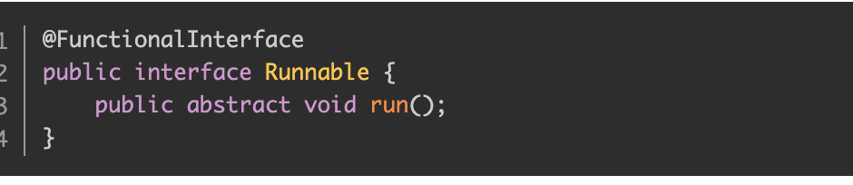
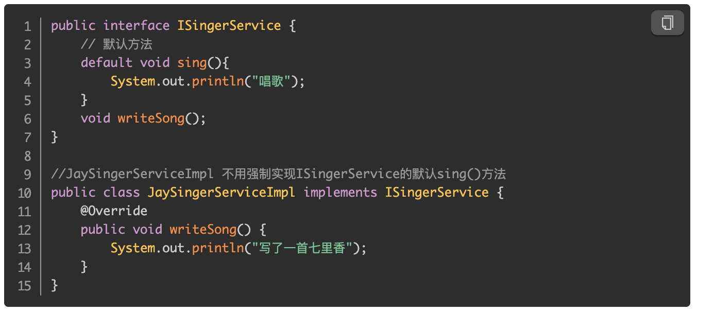
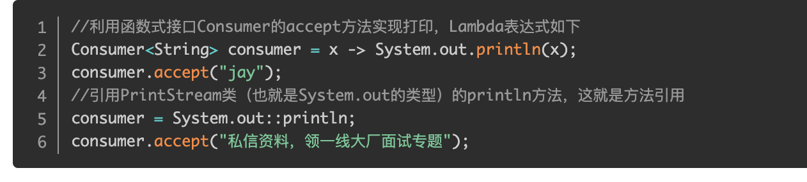
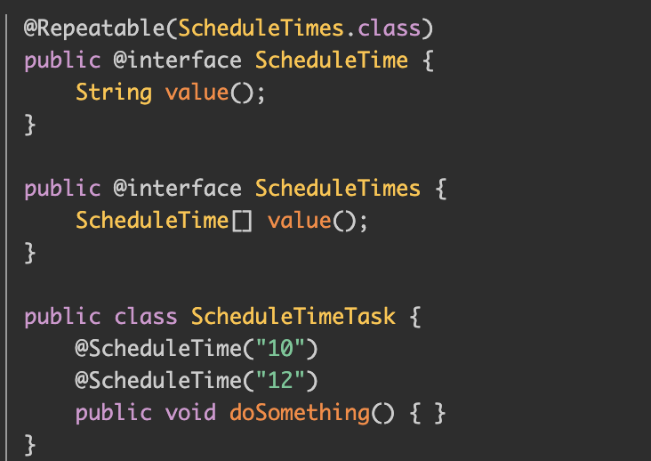
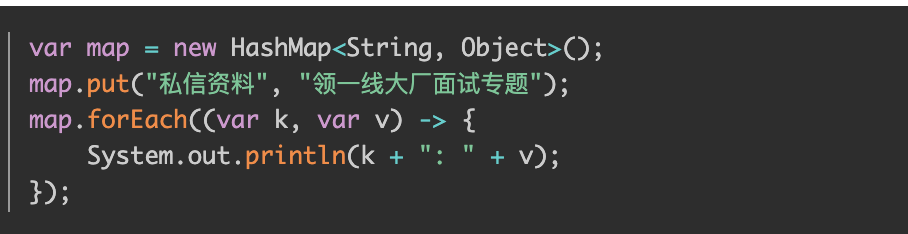

# Java8
## Lambda表达式
  
允许把函数作为一个方法的参数（函数作为参数传递到方法中）
## 函数式接口
- @FunctionalInterface
  
- 只有一个函数
## 默认方法
默认方法就是一个在接口里面有了一个实现的方法。它允许将新方法添加到接口，但不强制实现了该接口的类必须实现新的方法。

## 方法引用 
可以直接引用已有Java类或对象（实例）的方法或构造器。

## Stream API 
### Collections
- filter 筛选
- map流映射
- reduce 将流中的元素组合起来
- collect 返回集合
- sorted 排序
- flatMap 流转换
- limit返回指定流个数
- distinct去除重复元素
## Optional
用来解决NullPointerException。Optional代替if...else解决空指针问题，使代码更加简洁。
## Date Time API
LocalDate /LocalDateTime
## 重复注解
重复注解，即一个注解可以在一个类、属性或者方法上同时使用多次；用@Repeatable定义重复注解

## Base64
Java 8把Base64编码的支持加入到官方库中~
- `String encoded = Base64.getEncoder().encodeToString(str.getBytes( StandardCharsets.UTF_8));`
- `String decoded = new String(Base64.getDecoder().decode(encoded), StandardCharsets.UTF_8);`
## JVM的新特性
使用元空间Metaspace代替持久代（PermGen space），JVM参数使用-XX:MetaSpaceSize和-XX:MaxMetaspaceSize设置大小。
# Java11
## 增加了一系列好用的字符串处理方法
- isBlank() 判空。
- strip() 去除首尾空格
- stripLeading() 去除字符串首部空格
- stripTrailing() 去除字符串尾部空格
- lines() 分割获取字符串流。
- repeat() 复制字符串
## 用于 Lambda 参数的局部变量语法

## 标准化HTTP Client
Java 9 引入Http Client API,Java 10对它更新，Java 11 对它进行标准化。这几个版本后，Http Client几乎被完全重写，支持HTTP/1.1和HTTP/2 ，也支持 websockets。
## 单个命令编译运行源代码
- Java 11之前
  - // 编译 `javac Jay.java`
  - // 运行 `java Jay`
- Java 11之后 `java Jay.java`
## ZGC
可伸缩低延迟垃圾收集器
- GC 停顿时间不超过 10ms
- 既能处理几百 MB 的小堆，也能处理几个 TB 的大堆
- 应用吞吐能力不会下降超过 15%（与 G1 回收算法相比）
- 方便在此基础上引入新的 GC 特性和利用 colord
- 针以及 Load barriers 优化奠定基础
- 当前只支持 Linux/x64 位平台