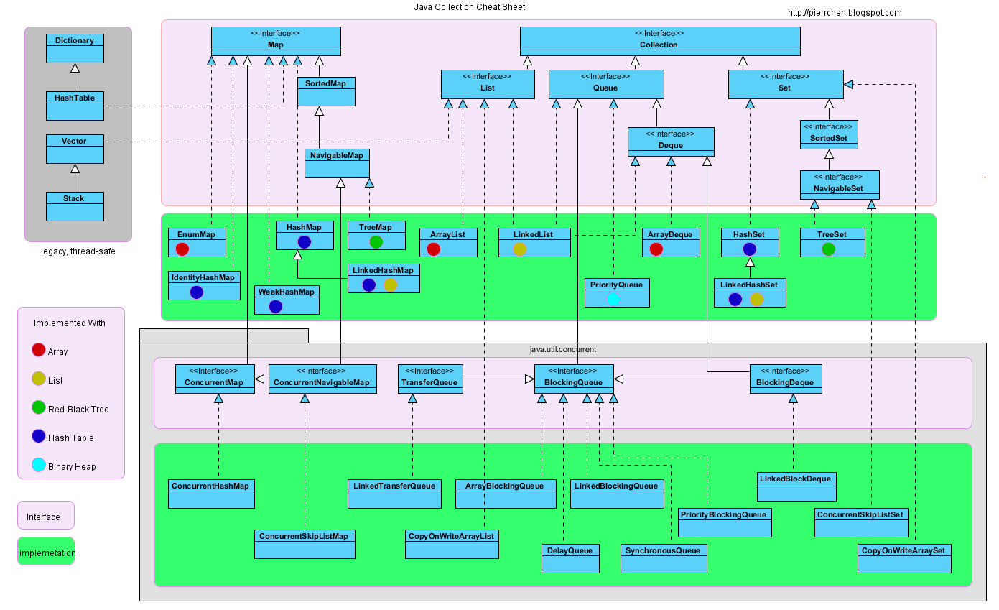

* [Collection](#collection)
* [List](#list)
* [常用的子类](#常用的子类)
  * [Vector](#vector)
  * [LinkedList](#linkedlist)
  * [ArrayList](#arraylist)
  * [CopyOnWriteArrayList](#copyonwritearraylist)
  * [集合对比](#集合对比)
* [Set](#set)
  * [HashSet](#hashset)
  * [LinkedHashSet](#linkedhashset)
  * [TreeSet](#treeset)
* [queue](#queue)
  * [添加](#添加)
  * [删除](#删除)
  * [获取](#获取)
  * [BlockingQueue](#blockingqueue)
    * [插入](#插入)
    * [移除](#移除)
    * [获取数据](#获取数据)
    * [常见的实现Queue queue = new LinkedList&lt;&gt;();](#常见的实现queue-queue--new-linkedlist)
* [参考文章](#参考文章)

# Collection

# List
- 实现了Collection接口
- List接口特性：是有序的，元素是可重复的
- 允许元素为null
# 常用的子类
## Vector
- 底层结构是数组，初始容量为10，每次增长2倍
- 它是线程同步的，已被ArrayList替代
- Vector 也是一个动态数组结构，一个元老级别的类，早在 jdk1.1 就引入进来了，之后在 jdk1.2 里引进 ArrayList，ArrayList 可以说是 Vector 的一个迷你版，ArrayList 大部分的方法和 Vector 比较相似！
- 两者不同的是，Vector 中的方法都加了synchronized，保证操作是线程安全的，但是效率低，而 ArrayList 所有的操作都是非线程安全的，执行效率高，但不安全！
- 对于 Vector，虽然可以在多线程环境下使用，但是在迭代遍历元素的时候依然会报错，抛ConcurrentModificationException异常！
- 在 JDK 中 Vector 已经属于过时的类，官方不建议在程序中采用，如果想要在多线程环境下使用 Vector，建议直接使用并发包中的CopyOnWriteArrayList！
- Stack
  - Stack 是 Vector 的一个子类，本质也是一个动态数组结构，不同的是，它的数据结构是先进后出，取名叫栈！
  - 不过，关于 Java 中 Stack 类，有很多的质疑声，栈更适合用队列结构来实现，这使得 Stack 在设计上不严谨，因此，官方推荐使用 Deque 下的类来是实现栈！
## LinkedList
- 底层结构是双向链表
- 实现了Deque接口，因此我们可以像操作栈和队列一样操作它
- 线程非同步
- LinkedList 是一个双向链表结构，在任意位置插入、删除都很方便，但是不支持随机取值，每次都只能从一端开始遍历，直到找到查询的对象，然后返回；不过，它不像 ArrayList 那样需要进行内存拷贝，因此相对来说效率较高，但是因为存在额外的前驱和后继节点指针，因此占用的内存比 ArrayList 多一些。
## ArrayList
- 底层结构是数组，初始容量为10，每次增长1.5倍
  - ArrayList的扩容
    - 原理
      - 调用系统函数的copy方法
      - 一个数组，可以不断地添加元素，而不出现数组下标越界异常。怎么实现？
- 在增删时候，需要数组的拷贝复制(navite 方法由C/C++实现)，性能还是不差的！
- 线程非同步
- ArrayList 是一个动态数组结构，支持随机存取，在指定的位置插入、删除效率低（因为要移动数组元素）；如果内部数组容量不足则自动扩容，扩容系数为原来的1.5倍，因此当数组很大时，效率较低。
- 当然，插入删除也不是效率非常低，在某些场景下，比如尾部插入、删除，因为不需要移动数组元素，所以效率也很高哦！
- ArrayList 是一个非线程安全的类，在多线程环境下使用迭代器遍历元素时，会报错，抛ConcurrentModificationException异常！
  - 迭代器
    - 迭代器删除原始
    - 单线程和多线程的区别
- addAll方法
  - 底层使用native arraycopy方法，内存拷贝数组速度会更快
  - 大数据量时推荐使用，小数据量时与for循环对比不明显
- 如果要从列表的中间添加元素是怎么实现的?
  - 将当前在该位置的元素index（如果有）和任何后续元素向右移动,也是直接使用System.arraycopy
  - arr[index] = data
  - size+1

## CopyOnWriteArrayList
- 原理：在修改时，复制出一个新数组，修改的操作在新数组中完成，最后将新数组交由array变量指向。
- 写加锁，读不加锁 ReentrantLock
- 缺点：CopyOnWrite容器只能保证数据的最终一致性，不能保证数据的实时一致性。
- 适合在读多写少的场景下使用
- iterator
  - 返回一个拷贝数据的对象COWIterator
## 集合对比
- ArrayList（动态数组结构），查询快（随意访问或顺序访问），增删慢，但在末尾插入删除，速度与LinkedList相差无几，但是是非线程安全的！
- LinkedList（双向链表结构），查询慢，增删快，也是非线程安全的！
- Vector（动态数组结构），因为方法加了同步锁，相比 ArrayList 执行都慢，基本不在使用，如果需要在多线程下使用，推荐使用并发容器中的CopyOnWriteArrayList来操作，效率高！
- Stack（栈结构）继承于Vector，数据是先进后出，基本不在使用，如果要实现栈，推荐使用 Deque 下的 ArrayDeque，效率比 Stack 高！
`https://juejin.im/post/6844903728324018189`
# Set
- 实现了Collection接口
- Set接口特性：无序的，元素不可重复
- 底层大多数是Map结构的实现
- 常用的三个子类都是非同步的
## HashSet
- 底层数据结构是哈希表(是一个元素为链表的数组) + 红黑树
- 实际上就是封装了HashMap
- 元素无序，可以为null
## LinkedHashSet
- 底层数据结构由哈希表(是一个元素为链表的数组)和双向链表组成。
- 父类是HashSet
- 实际上就是LinkHashMap
- 元素可以为null
## TreeSet
- 底层实际上是一个TreeMap实例(红黑树)
- 可以实现排序的功能
- 元素不能为null
# queue
## 添加
offer，add 区别：
- 一些队列有大小限制，因此如果想在一个满的队列中加入一个新项，多出的项就会被拒绝。
- 这时新的 offer 方法就可以起作用了。它不是对调用 add() 方法抛出一个 unchecked 异常，而只是得到由 offer() 返回的 false。
## 删除
poll，remove 区别：
- remove() 和 poll() 方法都是从队列中删除第一个元素。remove() 的行为与 Collection 接口的版本相似， 但是新的 poll() 方法在用空集合调用时不是抛出异常，只是返回 null。因此新的方法更适合容易出现异常条件的情况。
## 获取
peek，element区别：
- element() 和 peek() 用于在队列的头部查询元素。与 remove() 方法类似，在队列为空时， element() 抛出一个异常，而 peek() 返回 null。
## BlockingQueue
### 插入
- add(e) 抛出异常
- offer(e) 特殊值
- put(e) 阻塞
- offer(e, time, unit) 超时
### 移除
- remove() 抛出异常
- poll() 特殊值
- take() 阻塞
- poll(time, unit) 超时
### 获取数据
- element() 抛出异常
- peek() 特殊值

### 常见的实现Queue<T> queue = new LinkedList<>();
  

# 参考文章
- https://segmentfault.com/a/1190000021237438
- https://mp.weixin.qq.com/s/H6lxTfpedzzDz2QXihhdmw
- https://segmentfault.com/a/1190000023308658
- https://blog.csdn.net/weixin_39797532/article/details/112337531

