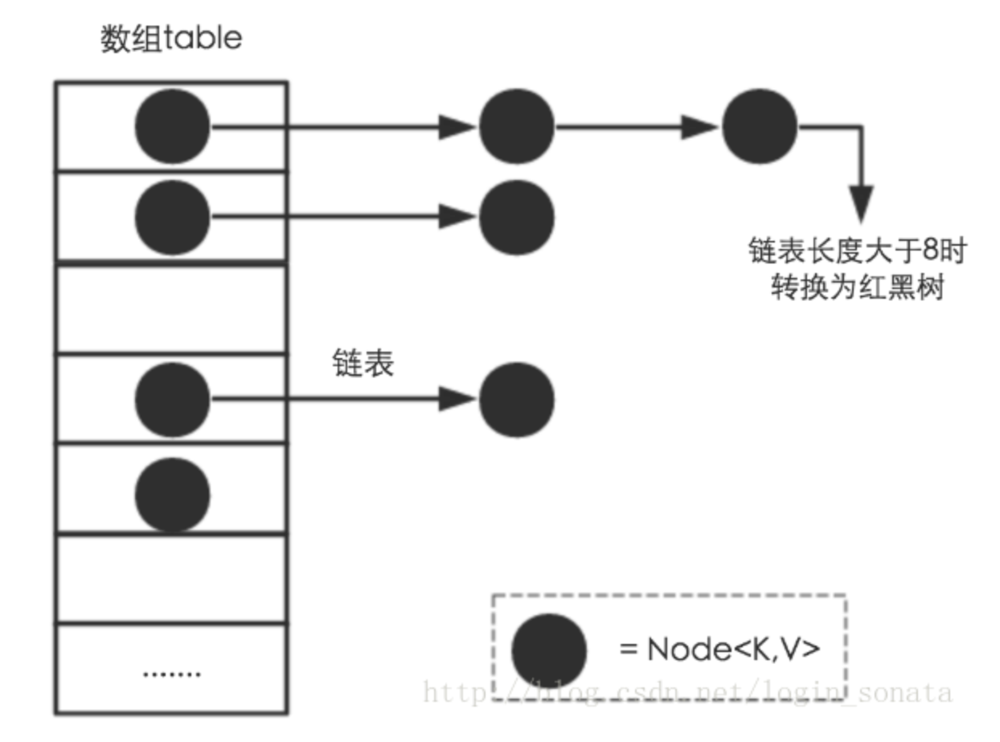
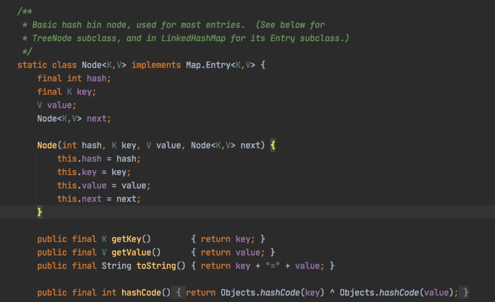
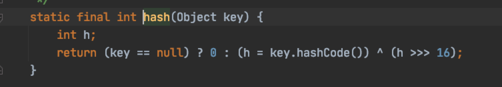
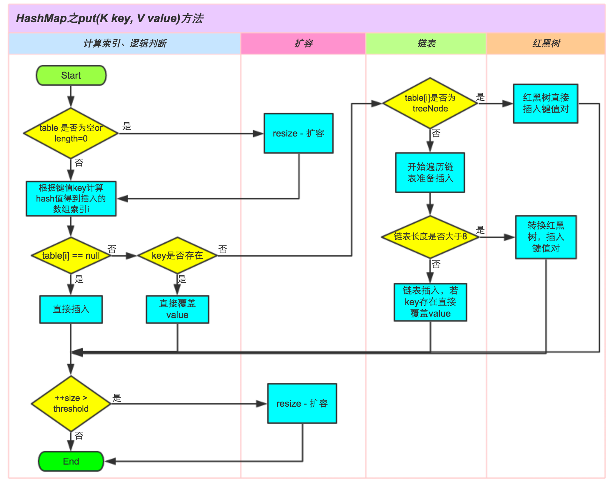
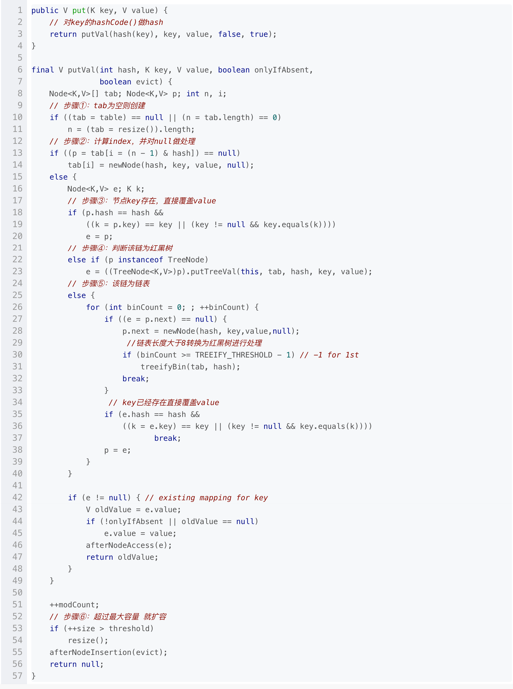
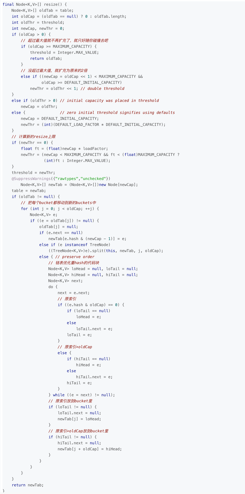
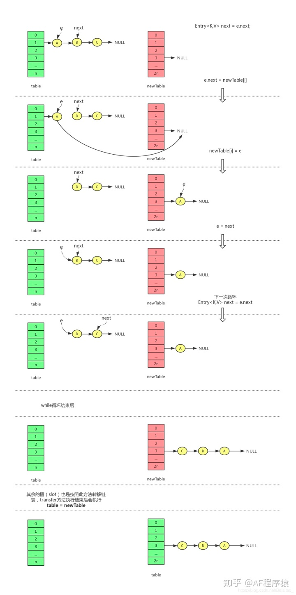
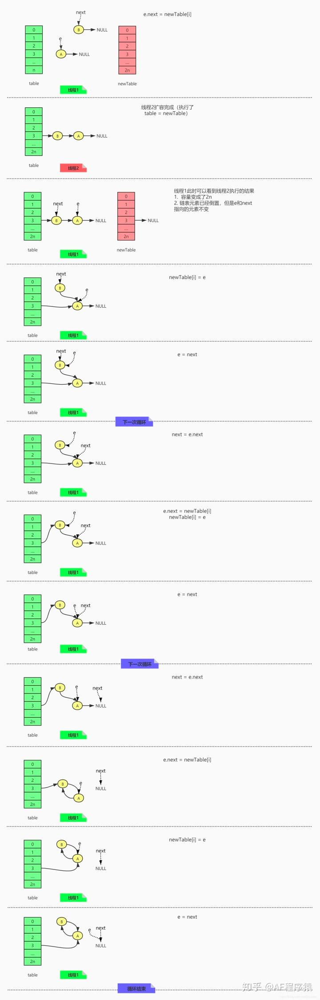
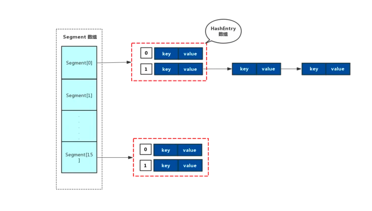
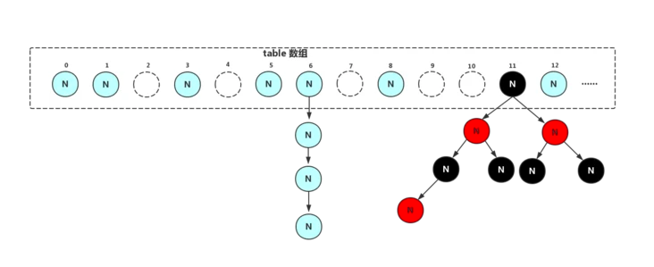

# Collection
## List
### List集合基础
- 实现了Collection接口
- List接口特性：是有序的，元素是可重复的
- 允许元素为null
### 常用的子类
#### Vector
- 底层结构是数组，初始容量为10，每次增长2倍
- 它是线程同步的，已被ArrayList替代
- Vector 也是一个动态数组结构，一个元老级别的类，早在 jdk1.1 就引入进来了，之后在 jdk1.2 里引进 ArrayList，ArrayList 可以说是 Vector 的一个迷你版，ArrayList 大部分的方法和 Vector 比较相似！
- 两者不同的是，Vector 中的方法都加了synchronized，保证操作是线程安全的，但是效率低，而 ArrayList 所有的操作都是非线程安全的，执行效率高，但不安全！
- 对于 Vector，虽然可以在多线程环境下使用，但是在迭代遍历元素的时候依然会报错，抛ConcurrentModificationException异常！
- 在 JDK 中 Vector 已经属于过时的类，官方不建议在程序中采用，如果想要在多线程环境下使用 Vector，建议直接使用并发包中的CopyOnWriteArrayList！
- Stack
  - Stack 是 Vector 的一个子类，本质也是一个动态数组结构，不同的是，它的数据结构是先进后出，取名叫栈！
  - 不过，关于 Java 中 Stack 类，有很多的质疑声，栈更适合用队列结构来实现，这使得 Stack 在设计上不严谨，因此，官方推荐使用 Deque 下的类来是实现栈！
#### LinkedList
- 底层结构是双向链表
- 实现了Deque接口，因此我们可以像操作栈和队列一样操作它
- 线程非同步
- LinkedList 是一个双向链表结构，在任意位置插入、删除都很方便，但是不支持随机取值，每次都只能从一端开始遍历，直到找到查询的对象，然后返回；不过，它不像 ArrayList 那样需要进行内存拷贝，因此相对来说效率较高，但是因为存在额外的前驱和后继节点指针，因此占用的内存比 ArrayList 多一些。
#### ArrayList
- 底层结构是数组，初始容量为10，每次增长1.5倍
  - ArrayList的扩容
    - 原理
      - 调用系统函数的copy方法
      - 一个数组，可以不断地添加元素，而不出现数组下标越界异常。怎么实现？
- 在增删时候，需要数组的拷贝复制(navite 方法由C/C++实现)，性能还是不差的！
- 线程非同步
- ArrayList 是一个动态数组结构，支持随机存取，在指定的位置插入、删除效率低（因为要移动数组元素）；如果内部数组容量不足则自动扩容，扩容系数为原来的1.5倍，因此当数组很大时，效率较低。
- 当然，插入删除也不是效率非常低，在某些场景下，比如尾部插入、删除，因为不需要移动数组元素，所以效率也很高哦！
- ArrayList 是一个非线程安全的类，在多线程环境下使用迭代器遍历元素时，会报错，抛ConcurrentModificationException异常！
  - 迭代器
    - 迭代器删除原始
    - 单线程和多线程的区别
- addAll方法
  - 底层使用native arraycopy方法，内存拷贝数组速度会更快
  - 大数据量时推荐使用，小数据量时与for循环对比不明显
- 如果要从列表的中间添加元素是怎么实现的?
  - 将当前在该位置的元素index（如果有）和任何后续元素向右移动,也是直接使用System.arraycopy
  - arr[index] = data
  - size+1

#### CopyOnWriteArrayList
- 原理：在修改时，复制出一个新数组，修改的操作在新数组中完成，最后将新数组交由array变量指向。
- 写加锁，读不加锁 ReentrantLock
- 缺点：CopyOnWrite容器只能保证数据的最终一致性，不能保证数据的实时一致性。
- 适合在读多写少的场景下使用
- iterator
  - 返回一个拷贝数据的对象COWIterator
#### 对比
- ArrayList（动态数组结构），查询快（随意访问或顺序访问），增删慢，但在末尾插入删除，速度与LinkedList相差无几，但是是非线程安全的！
- LinkedList（双向链表结构），查询慢，增删快，也是非线程安全的！
- Vector（动态数组结构），因为方法加了同步锁，相比 ArrayList 执行都慢，基本不在使用，如果需要在多线程下使用，推荐使用并发容器中的CopyOnWriteArrayList来操作，效率高！
- Stack（栈结构）继承于Vector，数据是先进后出，基本不在使用，如果要实现栈，推荐使用 Deque 下的 ArrayDeque，效率比 Stack 高！
`https://juejin.im/post/6844903728324018189`
## Set
### Set集合基础
- 实现了Collection接口
- Set接口特性：无序的，元素不可重复
- 底层大多数是Map结构的实现
- 常用的三个子类都是非同步的
### 常用子类
#### HashSet
- 底层数据结构是哈希表(是一个元素为链表的数组) + 红黑树
- 实际上就是封装了HashMap
- 元素无序，可以为null
#### LinkedHashSet
- 底层数据结构由哈希表(是一个元素为链表的数组)和双向链表组成。
- 父类是HashSet
- 实际上就是LinkHashMap
- 元素可以为null
#### TreeSet
- 底层实际上是一个TreeMap实例(红黑树)
- 可以实现排序的功能
- 元素不能为null
## queue
### 添加
offer，add 区别：
- 一些队列有大小限制，因此如果想在一个满的队列中加入一个新项，多出的项就会被拒绝。
- 这时新的 offer 方法就可以起作用了。它不是对调用 add() 方法抛出一个 unchecked 异常，而只是得到由 offer() 返回的 false。
### 删除
poll，remove 区别：
- remove() 和 poll() 方法都是从队列中删除第一个元素。remove() 的行为与 Collection 接口的版本相似， 但是新的 poll() 方法在用空集合调用时不是抛出异常，只是返回 null。因此新的方法更适合容易出现异常条件的情况。
### 获取
peek，element区别：
- element() 和 peek() 用于在队列的头部查询元素。与 remove() 方法类似，在队列为空时， element() 抛出一个异常，而 peek() 返回 null。
### BlockingQueue
- 插入
  - add(e) 抛出异常
  - offer(e) 特殊值
  - put(e) 阻塞
  - offer(e, time, unit) 超时
- 移除
  - remove() 抛出异常
  - poll() 特殊值
  - take() 阻塞
  - poll(time, unit) 超时
- 获取数据
  - element() 抛出异常
  - peek() 特殊值
### 常见的实现Queue<T> queue = new LinkedList<>();
  
# Map
## Map基础知识
- 存储的结构是key-value键值对，不像Collection是单列集合
- 阅读Map前最好知道什么是散列表和红黑树
## Map常用子类
### HashMap
#### 特点
- k和v允许为null，存储无序
- 非同步
  - HashMap 虽然很强大，但是它是非线程安全的，也就是说，如果在多线程环境下使用，可能因为程序自动扩容操作将单向链表转变成了循环链表，在查询遍历元素的时候，造成程序死循环！此时 CPU 直接会飙到 100%！
    - 如果我们想在多线程环境下使用 HashMap，其中一个推荐的解决办法就是使用 java 并发包下的 ConcurrentHashMap 类！
- 散列表容量大于64且链表大于8时，转成红黑树
  - 为什么是8
    - 源码的注释，根据泊松分布原理发生冲突 并且链表长度为8的概率已经非常小了不到千万分之一
- 底层是散列表+红黑树。初始容量为16，装载因子为0.75，每次扩容2倍
  - `https://mp.weixin.qq.com/s/H6lxTfpedzzDz2QXihhdmw`
  - 

#### 结构
- Node[] table，即哈希桶数组

- hash冲突使用链地址法
- 参数
  - `int threshold; `            // 扩容阈值
    - `threshold`就是在此Load factor和length(数组长度)对应下允许的最大元素数目，超过这个数目就重新resize(扩容)，扩容后的HashMap容量是之前容量的两倍
  - `final float loadFactor;`    // 负载因子
    - 0.75
  - `transient int modCount;`  // 出现线程问题时，负责及时抛异常
  - `transient int size;`     // HashMap中实际存在的Node数量
- HashMap的容量为什么要初始化为2的n次幂
  ```java
  static final int tableSizeFor(int cap) {
          int n = cap - 1;
          n |= n >>> 1;
          n |= n >>> 2;
          n |= n >>> 4;
          n |= n >>> 8;
          n |= n >>> 16;
          return (n < 0) ? 1 : (n >= MAXIMUM_CAPACITY) ? MAXIMUM_CAPACITY : n + 1;
      }
  ```
  - 向集合中添加元素时，会使用(n - 1) & hash的计算方法来得出该元素在集合中的位置
  - 扩容时调用resize()方法中的部分源码，可以看出会新建一个tab，然后遍历旧的tab，将旧的元素经过e.hash & (newCap - 1)的计算添加进新的tab中，还是用(n - 1) & hash的计算方法

可见这个(n - 1) & hash的计算方法有着千丝万缕的关系，符号&是按位与的计算，这是位运算，特别高效，按位与&的计算方法是，只有当对应位置的数据都为1时，运算结果也为1，当HashMap的容量是2的n次幂时，(n-1)的2进制也就是1111111***111这样形式的，这样与添加元素的hash值进行位运算时，能够充分的散列，使得添加的元素均匀分布在HashMap的每个位置上，减少hash碰撞

#### 初始化
#### 插入
- Key的哈希值会与该值的高16位做异或操作，进一步增加随机性
  
  - 按位与运算符（&）
    - 两位同时为“1”，结果才为“1”，否则为0
  - 按位或运算符（|）
    - 参加运算的两个对象只要有一个为1，其值为1。
  - 异或运算符（^）
    - 参加运算的两个对象，如果两个相应位为“异”（值不同），则该位结果为1，否则为0。
- 插入流程
  
- 插入代码
  
#### 查找
```java
public V get(Object key) {
        Node<K,V> e;
        return (e = getNode(hash(key), key)) == null ? null : e.value;
    }
    
final Node<K,V> getNode(int hash, Object key) {
        Node<K,V>[] tab; Node<K,V> first, e; int n; K k;
        if ((tab = table) != null && (n = tab.length) > 0 &&
            (first = tab[(n - 1) & hash]) != null) {
            //检查首节点
            if (first.hash == hash && // always check first node
                ((k = first.key) == key || (key != null && key.equals(k))))
                return first;
            if ((e = first.next) != null) {
                //判断是否为红黑树
                if (first instanceof TreeNode)
                    //红黑树的查找方式
                    return ((TreeNode<K,V>)first).getTreeNode(hash, key);
                //否则遍历桶
                do {
                    if (e.hash == hash &&
                        ((k = e.key) == key || (key != null && key.equals(k))))
                        return e;
                } while ((e = e.next) != null);
            }
        }
        return null;
    }
```
#### 扩容

- jdk1.7多线程扩容死循环问题 https://blog.csdn.net/weixin_39797532/article/details/112337531
  ```java
     void transfer(Entry[] newTable, boolean rehash) {
         int newCapacity = newTable.length;
         // 外层循环遍历数组槽（slot）
         for (Entry<K,V> e : table) {
             // 内层循环遍历单链表
             while(null != e) {
                 // 记录当前节点的next节点
                 Entry<K,V> next = e.next;
                 if (rehash) {
                     e.hash = null == e.key ? 0 : hash(e.key);
                 }
                 // 找到元素在新数组中的槽（slot）
                 int i = indexFor(e.hash, newCapacity);
                 // 用头插法将元素插入新的数组
                 e.next = newTable[i];
                 newTable[i] = e;
                 // 遍历下一个节点
                 e = next;
             }
         }
     }
  ```
  - 在单线程情况下，假设A、B、C三个节点处在一个链表上，扩容后依然处在一个链表上，代码执行过程如下：
    
    - 需要注意的几点是
      - 单链表在转移的过程中会被反转
      - table是线程共享的，而newTable是不共享的
      - 执行table = newTable后，其他线程就可以看到转移线程转移后的结果了
  - 多线程下扩容
    - 其实主要结合这4步，然后结合图示就明白了
      ```java
        Entry<K,V> next = e.next;
        e.next = newTable[i];
        newTable[i] = e;
        e = next;
      ```
    
- jdk1.8的扩容
  ```java
    // 低位链表头节点，尾结点
    // 低位链表就是扩容前后，所处的槽（slot）的下标不变
    // 如果扩容前处于table[n]，扩容后还是处于table[n]
    Node<K,V> loHead = null, loTail = null;
    // 高位链表头节点，尾结点
    // 高位链表就是扩容后所处槽（slot）的下标 = 原来的下标 + 新容量的一半
    // 如果扩容前处于table[n]，扩容后处于table[n + newCapacity / 2]
    Node<K,V> hiHead = null, hiTail = null;
  ```
  ```java
    Node<K,V> next;
    do {
        next = e.next;
        //当前槽上的链表在扩容前和扩容后，所在的槽（slot）下标是否一致
        if ((e.hash & oldCap) == 0) {
            if (loTail == null)
                loHead = e;
            else
                loTail.next = e;
            loTail = e;
        }
        else {
            if (hiTail == null)
                hiHead = e;
            else
                hiTail.next = e;
            hiTail = e;
        }
    } while ((e = next) != null);
    if (loTail != null) {
        loTail.next = null;
        // 低位链表在扩容后，所处槽的下标不变
        newTab[j] = loHead;
    }
    if (hiTail != null) {
        hiTail.next = null;
        // 高位链表在扩容后，所处槽的下标 = 原来的下标 + 扩容前的容量（也就是扩容后容量的一半）
        newTab[j + oldCap] = hiHead;
    }
  ```
  - 等到链表被分成高位链表和低位链表后，再一次性转移到新的table。这样就完成了单链表在扩容过程中的转移，使用两条链表的好处就是转移前后的链表不会倒置，顺序一致则不会因为多线程扩容而导致死循环
- 为什么要使用红黑树而不是AVL
  - 1、为什么不直接使用树
    - 大部分情况hashmap的数据量发生hash冲突的概率其实是很小的，此时使用链表是最佳选择
  - 2、为什么是红黑树？
    - AVL树是完全平衡二叉树，在节点插入时、删除时都会调整树结构来平衡，因此会消耗更多的时间
    - 虽然AVL的查找时间由于树高度更低而更快，但是插入和删除花费时间比红黑树更长，在hashmap这种情况下更适用红黑树
### LinkedHashMap
- 底层是散列表+红黑树+双向链表，父类是HashMap
- 允许为null，插入有序
- 非同步
- 提供插入顺序和访问顺序两种，访问顺序是符合LRU算法的，一般用于扩展(默认是插入顺序)
- 迭代与初始容量无关(迭代的是维护的双向链表)
- 大多使用HashMap的API，只不过在内部重写了某些方法，维护了双向链表

### TreeMap
- 底层是红黑树，保证了时间复杂度为log(n)
- 可以对其进行排序，使用Comparator或者Comparable
- 只要compare或者CompareTo认定该元素相等，那就相等
- 非同步
- 自然排序(手动排序)，元素不能为null
### ConcurrentHashMap
- 底层是散列表+红黑树，支持高并发操作
- key和value都不能为null
- 线程是安全的，利用CAS算法和部分操作上锁实现
- get方法是非阻塞，无锁的。重写Node类，通过volatile修饰next来实现每次获取都是最新设置的值
  ```java
  volatile V val;
  volatile Node<K,V> next;
  ```
- 在高并发环境下，统计数据(计算size…等等)其实是无意义的，因为在下一时刻size值就变化了。
- 在 JDK1.7 中，ConcurrentHashMap 类采用了分段锁的思想，将 HashMap 进行切割，把 HashMap 中的哈希数组切分成小数组（Segment），每个小数组有 n 个 HashEntry 组成，其中 Segment 继承自ReentrantLock（可重入锁），从而实现并发控制！
- 从 jdk1.8 开始，ConcurrentHashMap 类取消了 Segment 分段锁，采用 CAS + synchronized来保证并发安全，数据结构跟 jdk1.8 中 HashMap 结构保持一致，都是 数组 + 链表（当链表长度大于8时，链表结构转为红黑树）结构。
- jdk1.8 中的 ConcurrentHashMap 中 synchronized 只锁定当前链表或红黑树的首节点，只要节点 hash 不冲突，就不会产生并发，相比 JDK1.7 的 ConcurrentHashMap 效率又提升了 N 倍！
#### ConcurrentHashMap扩容机制
##### 1、ConcurrentHashMap 在 JDK 1.7 中的实现

在 JDK 1.7 版本及之前的版本中，ConcurrentHashMap 为了解决 HashTable 会锁住整个 hash 表的问题，提出了分段锁的解决方案，分段锁就是将一个大的 hash 表分解成若干份小的 hash 表，需要加锁时就针对小的 hash 表进行加锁，从而来提升 hash 表的性能。JDK1.7 中的 ConcurrentHashMap 引入了 Segment 对象，将整个 hash 表分解成一个一个的 Segment 对象，每个 Segment 对象呢可以看作是一个细粒度的 HashMap。

Segment 对象继承了 ReentrantLock 类，因为 Segment 对象它就变成了一把锁，这样就可以保证数据的安全。 在 Segment 对象中通过 HashEntry 数组来维护其内部的 hash 表。每个 HashEntry 就代表了 map 中的一个 K-V，如果发生 hash 冲突时，在该位置就会形成链表。

JDK1.7 中，ConcurrentHashMap 的整体结构可以描述为下图的样子：


- put 方法
  ```java
   public V put(K key, V value) {
          Segment<K,V> s;
          if (value == null)
              throw new NullPointerException();
          // 二次哈希，以保证数据的分散性，避免哈希冲突
          int hash = hash(key.hashCode());
          int j = (hash >>> segmentShift) & segmentMask;
          // Unsafe 调用方式，直接获取相应的 Segment
          if ((s = (Segment<K,V>)UNSAFE.getObject          // nonvolatile; recheck
               (segments, (j << SSHIFT) + SBASE)) == null) //  in ensureSegment
              s = ensureSegment(j);
          return s.put(key, hash, value, false);
      }
  ```
  在 put 方法中，首先是通过二次哈希减小哈希冲突的可能行，根据 hash 值以 Unsafe 调用方式，直接获取相应的 Segment，最终将数据添加到容器中是由 segment对象的 put 方法来完成。Segment对象的 put 方法源代码如下：
  ```java
  final V put(K key, int hash, V value, boolean onlyIfAbsent) {
      // 无论如何，确保获取锁 scanAndLockForPut会去查找是否有key相同Node
      ConcurrentHashMap.HashEntry<K,V> node = tryLock() ? null :
              scanAndLockForPut(key, hash, value);
      V oldValue;
      try {
          ConcurrentHashMap.HashEntry<K,V>[] tab = table;
          int index = (tab.length - 1) & hash;
          ConcurrentHashMap.HashEntry<K,V> first = entryAt(tab, index);
          for (ConcurrentHashMap.HashEntry<K,V> e = first;;) {
              // 更新已存在的key
              if (e != null) {
                  K k;
                  if ((k = e.key) == key ||
                          (e.hash == hash && key.equals(k))) {
                      oldValue = e.value;
                      if (!onlyIfAbsent) {
                          e.value = value;
                          ++modCount;
                      }
                      break;
                  }
                  e = e.next;
              }
              else {
                  if (node != null)
                      node.setNext(first);
                  else
                      node = new ConcurrentHashMap.HashEntry<K,V>(hash, key, value, first);
                  int c = count + 1;
                  // 判断是否需要扩容
                  if (c > threshold && tab.length < MAXIMUM_CAPACITY)
                      rehash(node);
                  else
                      setEntryAt(tab, index, node);
                  ++modCount;
                  count = c;
                  oldValue = null;
                  break;
              }
          }
      } finally {
          unlock();
      }
      return oldValue;
  }
  ```
  由于 Segment 对象本身就是一把锁，所以在新增数据的时候，相应的 Segment对象块是被锁住的，其他线程并不能操作这个 Segment 对象，这样就保证了数据的安全性，在扩容时也是这样的，在 JDK1.7 中的 ConcurrentHashMap扩容只是针对 Segment 对象中的 HashEntry 数组进行扩容，还是因为 Segment 对象是一把锁，所以在 rehash 的过程中，其他线程无法对 segment 的 hash 表做操作，这就解决了 HashMap 中 put 数据引起的闭环问题
##### 2、ConcurrentHashMap 在 JDK 1.8 中的实现
先从容器安全说起，在容器安全上，1.8 中的 ConcurrentHashMap 放弃了 JDK1.7 中的分段技术，而是采用了 CAS 机制 + synchronized 来保证并发安全性，但是在 ConcurrentHashMap 实现里保留了 Segment 定义，这仅仅是为了保证序列化时的兼容性而已，并没有任何结构上的用处

在存储结构上，JDK1.8 中 ConcurrentHashMap 放弃了 HashEntry 结构而是采用了跟 HashMap 结构非常相似，采用 Node 数组加链表（链表长度大于8时转成红黑树）的形式，Node 节点设计如下：

```java
static class Node<K,V> implements Map.Entry<K,V> {
        final int hash;
        final K key;
        volatile V val;
        volatile Node<K,V> next;
        ...省略...
 }       
```
跟 HashMap 一样 Key 字段被 final 修饰，说明在生命周期内，key 是不可变的， val 字段被 volatile 修饰了，这就保证了 val 字段的可见性。

JDK1.8 中的 ConcurrentHashMap 结构如下图所示：



###### putVal 方法
  ```java
      final V putVal(K key, V value, boolean onlyIfAbsent) {
          // 如果 key 为空，直接返回
          if (key == null || value == null) throw new NullPointerException();
          // 两次 hash ，减少碰撞次数
          int hash = spread(key.hashCode());
          // 记录链表节点得个数
          int binCount = 0;
          // 无条件得循环遍历整个 node 数组，直到成功
          for (ConcurrentHashMap.Node<K,V>[] tab = table;;) {
              ConcurrentHashMap.Node<K,V> f; int n, i, fh;
              // lazy-load 懒加载的方式，如果当前 tab 容器为空，则初始化 tab 容器
              if (tab == null || (n = tab.length) == 0)
                  tab = initTable();
  
              // 通过Unsafe.getObjectVolatile()的方式获取数组对应index上的元素，如果元素为空，则直接无所插入
              else if ((f = tabAt(tab, i = (n - 1) & hash)) == null) {
                  //// 利用CAS去进行无锁线程安全操作
                  if (casTabAt(tab, i, null,
                          new ConcurrentHashMap.Node<K,V>(hash, key, value, null)))
                      break;                   // no lock when adding to empty bin
              }
              // 如果 fh == -1 ，说明正在扩容，那么该线程也去帮扩容
              else if ((fh = f.hash) == MOVED)
                  // 协作扩容操作
                  tab = helpTransfer(tab, f);
              else {
                  // 如果上面都不满足，说明存在 hash 冲突，则使用 synchronized 加锁。锁住链表或者红黑树的头结点，来保证操作安全
                  V oldVal = null;
                  synchronized (f) {
                      if (tabAt(tab, i) == f) {
  
                          if (fh >= 0) {// 表示该节点是链表
                              binCount = 1;
                              // 遍历该节点上的链表
                              for (ConcurrentHashMap.Node<K,V> e = f;; ++binCount) {
                                  K ek;
                                  //这里涉及到相同的key进行put就会覆盖原先的value
                                  if (e.hash == hash &&
                                          ((ek = e.key) == key ||
                                                  (ek != null && key.equals(ek)))) {
                                      oldVal = e.val;
                                      if (!onlyIfAbsent)
                                          e.val = value;
                                      break;
                                  }
                                  ConcurrentHashMap.Node<K,V> pred = e;
                                  if ((e = e.next) == null) {//插入链表尾部
                                      pred.next = new ConcurrentHashMap.Node<K,V>(hash, key,
                                              value, null);
                                      break;
                                  }
                              }
                          }
                          else if (f instanceof ConcurrentHashMap.TreeBin) {// 该节点是红黑树节点
                              ConcurrentHashMap.Node<K,V> p;
                              binCount = 2;
                              if ((p = ((ConcurrentHashMap.TreeBin<K,V>)f).putTreeVal(hash, key,
                                      value)) != null) {
                                  oldVal = p.val;
                                  if (!onlyIfAbsent)
                                      p.val = value;
                              }
                          }
                      }
                  }
                  // 插入完之后，判断链表长度是否大于8，大于8就需要转换为红黑树
                  if (binCount != 0) {
                      if (binCount >= TREEIFY_THRESHOLD)
                          treeifyBin(tab, i);
                      // 如果存在相同的key ，返回原来的值
                      if (oldVal != null)
                          return oldVal;
                      break;
                  }
              }
          }
          //统计 size，并且检测是否需要扩容
          addCount(1L, binCount);
          return null;
      }
  ```
  putVal 方法主要做了以下几件事：
    - 第一步、在 ConcurrentHashMap 中不允许 key val 字段为空，所以第一步先校验key value 值，key、val 两个字段都不能是 null 才继续往下走，否则直接返回一个 NullPointerException 错误，这点跟 HashMap 有区别，HashMap 是可以允许为空的。
    - 第二步、判断容器是否初始化，如果容器没有初始化，则调用 initTable 方法初始化，initTable 方法如下：
###### initTable方法 
  ```java
      /**
       * Initializes table, using the size recorded in sizeCtl.
       */
      private final Node<K,V>[] initTable() {
          Node<K,V>[] tab; int sc;
          while ((tab = table) == null || tab.length == 0) {
              // 负数表示正在初始化或扩容，等待
              if ((sc = sizeCtl) < 0)
                  // 自旋等待
                  Thread.yield(); // lost initialization race; just spin
              // 执行 CAS 操作，期望将 sizeCtl 设置为 -1，-1 是正在初始化的标识
              else if (U.compareAndSwapInt(this, SIZECTL, sc, -1)) {
              // CAS 抢到了锁
                  try {
                  // 对 table 进行初始化，初始化长度为指定值，或者默认值 16
                      if ((tab = table) == null || tab.length == 0) {
                          // sc 在初始化的时候用户可能会自定义，如果没有自定义，则是默认的
                          int n = (sc > 0) ? sc : DEFAULT_CAPACITY;
                          // 创建数组
                          Node<K,V>[] nt = (Node<K,V>[])new Node<?,?>[n];
                          table = tab = nt;
                          // 指定下次扩容的大小，相当于 0.75 × n
                          sc = n - (n >>> 2);
                      }
                  } finally {
                      sizeCtl = sc;
                  }
                  break;
              }
          }
          return tab;
      }
  ```
Table 本质上就是一个 Node 数组，其初始化过程也就是对 Node 数组的初始化过程，方法中使用了 CAS 策略执行初始化操作。初始化流程为：
1. 判断 sizeCtl 值是否小于 0，如果小于 0 则表示 ConcurrentHashMap 正在执行初始化操作，所以需要先等待一会，如果其它线程初始化失败还可以顶替上去
2. 如果 sizeCtl 值大于等于 0，则基于 CAS 策略抢占标记 sizeCtl 为 -1，表示 ConcurrentHashMap 正在执行初始化，然后构造 table，并更新 sizeCtl 的值
3. 根据双哈希之后的 hash 值找到数组对应的下标位置，如果该位置未存放节点，也就是说不存在 hash 冲突，则使用 CAS 无锁的方式将数据添加到容器中，并且结束循环。
4. 如果并未满足第三步，则会判断容器是否正在被其他线程进行扩容操作，如果正在被其他线程扩容，则放弃添加操作，加入到扩容大军中（ConcurrentHashMap 扩容操作采用的是多线程的方式，后面我们会讲到），扩容时并未跳出死循环，这一点就保证了容器在扩容时并不会有其他线程进行数据添加操作，这也保证了容器的安全性。
5. 如果 hash 冲突，则进行链表操作或者红黑树操作（如果链表树超过8，则修改链表为红黑树），在进行链表或者红黑树操作时，会使用 synchronized 锁把头节点被锁住了，保证了同时只有一个线程修改链表，防止出现链表成环。
6. 进行 addCount(1L, binCount) 操作，该操作会更新 size 大小，判断是否需要扩容，addCount 方法源码如下：

###### addCount方法
```java
    // X传入的是1，check 传入的是 putVal 方法里的 binCount，没有hash冲突的话为0，冲突就会大于1
    private final void addCount(long x, int check) {
        ConcurrentHashMap.CounterCell[] as; long b, s;
        // 统计ConcurrentHashMap里面节点个数
        if ((as = counterCells) != null ||
                !U.compareAndSwapLong(this, BASECOUNT, b = baseCount, s = b + x)) {
            ConcurrentHashMap.CounterCell a; long v; int m;
            boolean uncontended = true;
            if (as == null || (m = as.length - 1) < 0 ||
                    (a = as[ThreadLocalRandom.getProbe() & m]) == null ||
                    !(uncontended =
                            U.compareAndSwapLong(a, CELLVALUE, v = a.value, v + x))) {
                fullAddCount(x, uncontended);
                return;
            }
            if (check <= 1)
                return;
            s = sumCount();
        }
        // check就是binCount，binCount 最小都为0，所以这个条件一定会为true
        if (check >= 0) {
            ConcurrentHashMap.Node<K,V>[] tab, nt; int n, sc;
            // 这儿是自旋，需同时满足下面的条件
            // 1. 第一个条件是map.size 大于 sizeCtl，也就是说需要扩容
            // 2. 第二个条件是`table`不为null
            // 3. 第三个条件是`table`的长度不能超过最大容量
            while (s >= (long)(sc = sizeCtl) && (tab = table) != null &&
                    (n = tab.length) < MAXIMUM_CAPACITY) {
                int rs = resizeStamp(n);
                // 该判断表示已经有线程在进行扩容操作了
                if (sc < 0) {
                    if ((sc >>> RESIZE_STAMP_SHIFT) != rs || sc == rs + 1 ||
                            sc == rs + MAX_RESIZERS || (nt = nextTable) == null ||
                            transferIndex <= 0)
                        break;
                    // 如果可以帮助扩容，那么将 sc 加 1. 表示多了一个线程在帮助扩容
                    if (U.compareAndSwapInt(this, SIZECTL, sc, sc + 1))
                        transfer(tab, nt);
                }
                // 如果不在扩容，将 sc 更新：标识符左移 16 位 然后 + 2. 也就是变成一个负数。高 16 位是标识符，低 16 位初始是 2
                else if (U.compareAndSwapInt(this, SIZECTL, sc,
                        (rs << RESIZE_STAMP_SHIFT) + 2))
                    transfer(tab, null);
                s = sumCount();
            }
        }
```
addCount 方法做了两个工作：
1. 对 map 的 size 加一
2. 检查是否需要扩容，或者是否正在扩容。如果需要扩容，就调用扩容方法，如果正在扩容，就帮助其扩容。

###### transfer 扩容方法
以下两种情况下可能触发扩容操作

- 调用 put 方法新增元素之后，会调用 addCount 方法来更新 size 大小，并检查是否需要进行扩容，当数组元素个数达到阈值时，会触发transfer方法
- 触发了 tryPresize 操作， tryPresize 操作会触发扩容操作，有两种情况会触发 tryPresize 操作：
  - 第一种情况：当某节点的链表元素个数达到阈值 8 时，这时候需要将链表转成红黑树，在结构转换之前会，会先判断数组长度 n 是否小于阈值MIN_TREEIFY_CAPACITY，默认是64，如果小于则会调用tryPresize方法把数组长度扩大到原来的两倍，并触发transfer方法，重新调整节点的位置。
  - 第二种情况：在 putAll 操作时会先触发 tryPresize 操作。

```java
    private final void transfer(ConcurrentHashMap.Node<K,V>[] tab, ConcurrentHashMap.Node<K,V>[] nextTab) {
        int n = tab.length, stride;
        // 多线程扩容，每核处理的量小于16，则强制赋值16
        if ((stride = (NCPU > 1) ? (n >>> 3) / NCPU : n) < MIN_TRANSFER_STRIDE)
            stride = MIN_TRANSFER_STRIDE; // subdivide range
        // nextTab 为空，先实例化一个新的数组
        if (nextTab == null) {            // initiating
            try {
                @SuppressWarnings("unchecked")
                // 新数组的大小是原来的两倍
                ConcurrentHashMap.Node<K,V>[] nt = (ConcurrentHashMap.Node<K,V>[])new ConcurrentHashMap.Node<?,?>[n << 1];
                nextTab = nt;
            } catch (Throwable ex) {      // try to cope with OOME
                sizeCtl = Integer.MAX_VALUE;
                return;
            }
            // 更新成员变量
            nextTable = nextTab;
            // 更新转移下标，就是 老的 tab 的 length
            transferIndex = n;
        }
        // bound ：该线程此次可以处理的区间的最小下标，超过这个下标，就需要重新领取区间或者结束扩容
        // advance： 该参数
        int nextn = nextTab.length;
        // 创建一个 fwd 节点，用于占位。当别的线程发现这个槽位中是 fwd 类型的节点，则跳过这个节点。
        ConcurrentHashMap.ForwardingNode<K,V> fwd = new ConcurrentHashMap.ForwardingNode<K,V>(nextTab);
        // advance 变量指的是是否继续递减转移下一个桶，如果为 true，表示可以继续向后推进，反之，说明还没有处理好当前桶，不能推进
        boolean advance = true;
        // 完成状态，如果是 true，表示扩容结束
        boolean finishing = false; // to ensure sweep before committing nextTab
        // 死循环,i 表示下标，bound 表示当前线程可以处理的当前桶区间最小下标
        for (int i = 0, bound = 0;;) {
            ConcurrentHashMap.Node<K,V> f; int fh;
            while (advance) {
                int nextIndex, nextBound;
                if (--i >= bound || finishing)
                    advance = false;
                else if ((nextIndex = transferIndex) <= 0) {
                    i = -1;
                    advance = false;
                }
                else if (U.compareAndSwapInt
                        (this, TRANSFERINDEX, nextIndex,
                                nextBound = (nextIndex > stride ?
                                        nextIndex - stride : 0))) {
                    bound = nextBound;
                    i = nextIndex - 1;
                    advance = false;
                }
            }
            if (i < 0 || i >= n || i + n >= nextn) {
                int sc;
                if (finishing) {
                    nextTable = null;
                    table = nextTab;
                    sizeCtl = (n << 1) - (n >>> 1);
                    return;
                }
                if (U.compareAndSwapInt(this, SIZECTL, sc = sizeCtl, sc - 1)) {
                    if ((sc - 2) != resizeStamp(n) << RESIZE_STAMP_SHIFT)
                        return;
                    finishing = advance = true;
                    i = n; // recheck before commit
                }
            }
            else if ((f = tabAt(tab, i)) == null)
                advance = casTabAt(tab, i, null, fwd);
            else if ((fh = f.hash) == MOVED)
                advance = true; // already processed
            else {
                synchronized (f) {
                // 这儿多判断一次，是否为了防止可能出现的remove()操作
                    if (tabAt(tab, i) == f) {
                        // 旧链表上该节点的数据，会被分成低位和高位，低位就是在新链表上的位置跟旧链表上一样，
                        // 高位就是在新链表的位置是旧链表位置加上旧链表的长度
                        ConcurrentHashMap.Node<K,V> ln, hn;
                        if (fh >= 0) {
                            int runBit = fh & n;
                            ConcurrentHashMap.Node<K,V> lastRun = f;
                            for (ConcurrentHashMap.Node<K,V> p = f.next; p != null; p = p.next) {
                                int b = p.hash & n;
                                if (b != runBit) {
                                    runBit = b;
                                    lastRun = p;
                                }
                            }
                            if (runBit == 0) {
                                ln = lastRun;
                                hn = null;
                            }
                            else {
                                hn = lastRun;
                                ln = null;
                            }
                            for (ConcurrentHashMap.Node<K,V> p = f; p != lastRun; p = p.next) {
                                int ph = p.hash; K pk = p.key; V pv = p.val;
                                // 该节点哈希值与旧链表长度与运算，结果为0，则在低位节点上，反之，在高位节点上
                                if ((ph & n) == 0)
                                    ln = new ConcurrentHashMap.Node<K,V>(ph, pk, pv, ln);
                                else
                                    hn = new ConcurrentHashMap.Node<K,V>(ph, pk, pv, hn);
                            }
                            setTabAt(nextTab, i, ln);
                            // 在nextTable i + n 位置处插上链表
                            setTabAt(nextTab, i + n, hn);
                            // 在table i 位置处插上ForwardingNode 表示该节点已经处理过了
                            setTabAt(tab, i, fwd);
                            advance = true;
                        }
                        else if (f instanceof ConcurrentHashMap.TreeBin) {
                            // 如果是TreeBin，则按照红黑树进行处理，处理逻辑与上面一致
                            // 红黑树的逻辑跟节点一模一样，最后也会分高位和低位
                            ConcurrentHashMap.TreeBin<K,V> t = (ConcurrentHashMap.TreeBin<K,V>)f;
                            ConcurrentHashMap.TreeNode<K,V> lo = null, loTail = null;
                            ConcurrentHashMap.TreeNode<K,V> hi = null, hiTail = null;
                            int lc = 0, hc = 0;
                            for (ConcurrentHashMap.Node<K,V> e = t.first; e != null; e = e.next) {
                                int h = e.hash;
                                ConcurrentHashMap.TreeNode<K,V> p = new ConcurrentHashMap.TreeNode<K,V>
                                        (h, e.key, e.val, null, null);
                                if ((h & n) == 0) {
                                    if ((p.prev = loTail) == null)
                                        lo = p;
                                    else
                                        loTail.next = p;
                                    loTail = p;
                                    ++lc;
                                }
                                else {
                                    if ((p.prev = hiTail) == null)
                                        hi = p;
                                    else
                                        hiTail.next = p;
                                    hiTail = p;
                                    ++hc;
                                }
                            }
                            // 如果树的节点数小于等于 6，那么转成链表，反之，创建一个新的树
                            ln = (lc <= UNTREEIFY_THRESHOLD) ? untreeify(lo) :
                                    (hc != 0) ? new ConcurrentHashMap.TreeBin<K,V>(lo) : t;
                            hn = (hc <= UNTREEIFY_THRESHOLD) ? untreeify(hi) :
                                    (lc != 0) ? new ConcurrentHashMap.TreeBin<K,V>(hi) : t;
                            setTabAt(nextTab, i, ln);
                            setTabAt(nextTab, i + n, hn);
                            setTabAt(tab, i, fwd);
                            advance = true;
                        }
                    }
                }
            }
        }
    }
```
transfer 大致做了以下几件事件:
1. 计算出每个线程每次可以处理的个数，根据 Map 的长度，计算出每个线程（CPU）需要处理的桶（table数组的个数），默认每个线程每次处理 16 个桶，如果小于 16 个，则强制变成 16 个桶。
2. 对 nextTab 初始化，如果传入的新 table nextTab 为空，则对 nextTab 初始化，默认是原 table 的两倍
3. 引入 ForwardingNode、advance、finishing 变量来辅助扩容，ForwardingNode 表示该节点已经处理过，不需要在处理，advance 表示该线程是否可以下移到下一个桶（true：表示可以下移），finishing 表示是否结束扩容（true：结束扩容，false：未结束扩容） ，具体的逻辑就不说了
4. 跳过一些其他细节，直接到数据迁移这一块，在数据转移的过程中会加 synchronized 锁，锁住头节点，同步化操作，防止 putVal 的时候向链表插入数据
5. 进行数据迁移，如果这个桶上的节点是链表或者红黑树，则会将节点数据分为低位和高位，计算的规则是通过该节点的 hash 值跟为扩容之前的 table 容器长度进行位运算（&），如果结果为 0 ，则将数据放在新表的低位（当前 table 中为 第 i 个位置，在新表中还是第 i 个位置），结果不为 0 ，则放在新表的高位（当前 table 中为第 i 个位置，在新表中的位置为 i + 当前 table 容器的长度）。
6. 如果桶挂载的是红黑树，不仅需要分离出低位节点和高位节点，还需要判断低位和高位节点在新表以链表还是红黑树的形式存放。

### IdentityHashMap
- IdentityHashMap 从名字上看，感觉表示唯一的 HashMap，然后并不是，别被它的名称所欺骗哦。
- IdentityHashMap 的数据结构很简单，底层实际就是一个 Object 数组，在存储上并没有使用链表来存储，而是将 K 和 V 都存放在 Object 数组上。
- 当添加元素的时候，会根据 Key 计算得到散列位置，如果发现该位置上已经有改元素，直接进行新值替换；如果没有，直接进行存放。当元素个数达到一定阈值时，Object 数组会自动进行扩容处理。
- IdentityHashMap 的实现也不同于 HashMap，虽然也是数组，不过 IdentityHashMap 中没有用到链表，解决冲突的方式是计算下一个有效索引，并且将数据 key 和 value 紧挨着存入 map 中，即table[i]=key、table[i+1]=value；
- IdentityHashMap 允许key、value都为null，当key为null的时候，默认会初始化一个Object对象作为key；
### WeakHashMap
- WeakHashMap 是 Map 体系中一个很特殊的成员，它的特殊之处在于 WeakHashMap 里的元素可能会被 GC 自动删除，即使程序员没有显示调用 remove() 或者 clear() 方法。
- 换言之，当向 WeakHashMap 中添加元素的时候，再次遍历获取元素，可能发现它已经不见了
- WeakHashMap 的 key 使用了弱引用类型，在垃圾回收器线程扫描它所管辖的内存区域的过程中，一旦发现了只具有弱引用的对象，不管当前内存空间足够与否，都会回收它的内存。
- 不过，由于垃圾回收器是一个优先级很低的线程，因此不一定会很快发现那些只具有弱引用的对象。
- WeakHashMap 跟普通的 HashMap 不同，在存储数据时，key 被设置为弱引用类型，而弱引用类型在 java 中，可能随时被 jvm 的 gc 回收，所以再次通过获取对象时，可能得到空值，而 value 是在访问数组内容的时候，进行清除。
- 可能很多人觉得这样做很奇葩，其实不然，WeekHashMap 的这个特点特别适用于需要缓存的场景。
- 在缓存场景下，由于系统内存是有限的，不能缓存所有对象，可以使用 WeekHashMap 进行缓存对象，即使缓存丢失，也可以通过重新计算得到，不会造成系统错误。
- 比较典型的例子，Tomcat 中的 ConcurrentCache 类就使用了 WeekHashMap 来实现数据缓存。

### 参考文章
- https://segmentfault.com/a/1190000021237438


