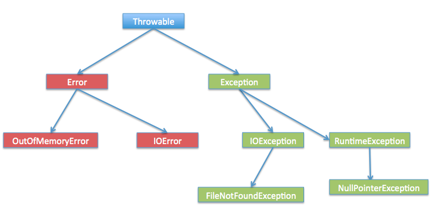

* [Throwable](#throwable)
  * [Error](#error)
  * [Exception](#exception)
* [try catch finally机制](#try-catch-finally机制)
* [OOM &amp;&amp; SOF](#oom--sof)
  * [发生了内存泄露或溢出怎么办](#发生了内存泄露或溢出怎么办)
  * [内存泄漏的场景](#内存泄漏的场景)
  * [内存溢出的场景](#内存溢出的场景)
    * [Java Heap 溢出](#java-heap-溢出)
    * [虚拟机栈和本地方法栈溢出](#虚拟机栈和本地方法栈溢出)
    * [运行时常量池溢出](#运行时常量池溢出)
    * [方法区溢出](#方法区溢出)
    * [java.lang.OutOfMemoryError: GC overhead limit exceeded](#javalangoutofmemoryerror-gc-overhead-limit-exceeded)
  * [SOF （堆栈溢出 StackOverflow）](#sof-堆栈溢出-stackoverflow)
  * [如何避免发生内存泄露和溢出](#如何避免发生内存泄露和溢出)
* [参考文章](#参考文章)

## Throwable

### Error
表示 JVM 无法处理的错误
- OutOfMemoryError
- StackOverflowError
### Exception
- 受检异常
  - 需要用 try...catch... 语句捕获并进行处理，并且可以从异常中恢复；
    - IOException
      - ClassNotFoundException
- 非受检异常
  - 是程序运行时错误，例如除 0 会引发 Arithmetic Exception，此时程序崩溃并且无法恢复
    - RuntimeException
      - NullPointerException
      - IllegalArgumentException
## try catch finally机制
- 有当try代码块发生异常的时候，才会执行到catch代码块
- 不管try中是否发生异常，finally都会执行。
  - 以下两种情况例外：
    - 一：try中不发生异常时，try块中有System.exit(0);
    - 二：try中发生异常时，catch中有System.exit(0);
    - 说明：System.exit(0) 代码的作用的退出虚拟机;
- 若finally块内有return语句，则以finally块内的return为准
   - 如果try 或者 catch内也有return 其实是先执行了try 或者 catch代码块中的return语句的，
   - 但是由于finally的机制，执行完try或者catch内的代码以后并不会立刻结束函数，还会执行finally块代码，
   - 若finally也有return语句，则会覆盖try块或者catch块中的return语句
- 若finally代码块中有return语句，则屏蔽catch代码块中抛出的异常

## OOM && SOF
OutOfMemoryError异常: 除了程序计数器外，虚拟机内存的其他几个运行时区域都有发生OutOfMemoryError(OOM)异常的可能，

内存泄露：指程序中动态分配内存给一些临时对象，但是对象不会被GC所回收，它始终占用内存。即被分配的对象可达但已无用。

内存溢出：指程序运行过程中无法申请到足够的内存而导致的一种错误。内存溢出通常发生于OLD段或Perm段垃圾回收后，仍然无内存空间容纳新的Java对象的情况。

从定义上可以看出内存泄露是内存溢出的一种诱因，不是唯一因素。

栈溢出：当应用程序递归太深而发生堆栈溢出时，抛出该错误。
### 发生了内存泄露或溢出怎么办
一般的异常信息：java.lang.OutOfMemoryError:Java heap spacess
java堆用于存储对象实例，我们只要不断的创建对象，并且保证GC Roots到对象之间有可达路径来避免垃圾回收机制清除这些对象，就会在对象数量达到最大堆容量限制后产生内存溢出异常。

（1）通过参数 -XX:+HeapDumpOnOutOfMemoryError 让虚拟机在出现OOM异常的时候Dump出内存映像以便于分析。

（2）一般手段是先通过内存映像分析工具(如Eclipse Memory Analyzer)对dump出来的堆转存快照进行分析，重点是确认内存中的对象是否是必要的，先分清是因为内存泄漏(Memory Leak)还是内存溢出(Memory Overflow)。（到底是出现了内存泄漏还是内存溢出）

哪些对象被怀疑为内存泄漏，哪些对象占的空间最大及对象的调用关系，还可以分析线程状态，可以观察到线程被阻塞在哪个对象上，从而判断系统的瓶颈。

（3）如果是内存泄漏，可进一步通过工具查看泄漏对象到GC Roots的引用链。于是就能找到泄漏对象时通过怎样的路径与GC Roots相关联并导致垃圾收集器无法自动回收。 找到引用信息，可以准确的定位出内存泄漏的代码位置。（HashMap中的元素的某些属性改变了，影响了hashcode的值会发生内存泄漏）

（4）如果不存在内存泄漏，就应当检查虚拟机的参数(-Xmx与-Xms)的设置是否适当，是否可以调大；修改代码逻辑，把某些对象生命周期过长，持有状态时间过长等情况的代码修改。

### 内存泄漏的场景
   （1）使用静态的集合类

静态的集合类的生命周期和应用程序的生命周期一样长，所以在程序结束前容器中的对象不能被释放，会造成内存泄露。

解决办法是最好不使用静态的集合类，如果使用的话，在不需要容器时要将其赋值为null。

修改hashset中对象的参数值，且参数是计算哈希值的字段

（2）单例模式可能会造成内存泄露（长生命周期的对象持有短生命周期对象的引用）

单例模式只允许应用程序存在一个实例对象，并且这个实例对象的生命周期和应用程序的生命周期一样长，如果单例对象中拥有另一个对象的引用的话，这个被引用的对象就不能被及时回收。

解决办法是单例对象中持有的其他对象使用弱引用，弱引用对象在GC线程工作时，其占用的内存会被回收掉。

（3）数据库、网络、输入输出流，这些资源没有显示的关闭

垃圾回收只负责内存回收，如果对象正在使用资源的话，Java虚拟机不能判断这些对象是不是正在进行操作，比如输入输出，也就不能回收这些对象占用的内存，所以在资源使用完后要调用close()方法关闭。

### 内存溢出的场景
#### Java Heap 溢出

在jvm规范中，堆中的内存是用来生成对象实例和数组的。 

如果细分，堆内存还可以分为年轻代和年老代，年轻代包括一个eden区和两个survivor区。
   
当生成新对象时，内存的申请过程如下：

- jvm先尝试在eden区分配新建对象所需的内存；
- 如果内存大小足够，申请结束，否则下一步；
- jvm启动youngGC，试图将eden区中不活跃的对象释放掉，释放后若Eden空间仍然不足以放入新对象，则试图将部分Eden中活跃对象放入Survivor区；
- Survivor区被用来作为Eden及old的中间交换区域，当OLD区空间足够时，Survivor区的对象会被移到Old区，否则会被保留在Survivor区；
- 当OLD区空间不够时，JVM会在OLD区进行full GC；
- full GC后，若Survivor及OLD区仍然无法存放从Eden复制过来的部分对象，导致JVM无法在Eden区为新对象创建内存区域，则出现”out of memory错误”： outOfMemoryError：java heap space

#### 虚拟机栈和本地方法栈溢出
如果线程请求的栈深度大于虚拟机所允许的最大深度，将抛出StackOverflowError异常。
不断创建线程，如果虚拟机在扩展栈时无法申请到足够的内存空间，则抛出OutOfMemoryError异常
这里需要注意当栈的大小越大可分配的线程数就越少。
用Xss设置

#### 运行时常量池溢出
异常信息：java.lang.OutOfMemoryError:PermGen space
如果要向运行时常量池中添加内容，最简单的做法就是使用String.intern()这个Native方法。
该方法的作用是：如果池中已经包含一个等于此String的字符串，则返回代表池中这个字符串的String对象；否则，将此String对象包含的字符串添加到常量池中，并且返回此String对象的引用。
由于常量池分配在方法区内，我们可以通过-XX:PermSize和-XX:MaxPermSize限制方法区的大小，从而间接限制其中常量池的容量。

#### 方法区溢出
异常信息：java.lang.OutOfMemoryError: PermGen space

方法区用于存放Class的相关信息，如类名、访问修饰符、常量池、字段描述、方法描述等。

所以如果程序加载的类过多，或者使用反射、gclib等这种动态代理生成类的技术，就可能导致该区发生内存溢出

方法区溢出也是一种常见的内存溢出异常，一个类如果要被垃圾收集器回收，判定条件是很苛刻的。在经常动态生成大量Class的应用中，要特别注意这点。

我们可以通过-XX:PermSize和-XX:MaxPermSize限制方法区的大小

#### java.lang.OutOfMemoryError: GC overhead limit exceeded
原因：执行垃圾收集的时间比例太大, 有效的运算量太小. 默认情况下, 如果GC花费的时间超过 98%, 并且GC回收的内存少于 2%, JVM就会抛出这个错误。

目的是为了让应用终止，给开发者机会去诊断问题。一般是应用程序在有限的内存上创建了大量的临时对象或者弱引用对象，从而导致该异常。

解决方法：
1. 大对象在使用之后指向null。
2. 增加参数，-XX:-UseGCOverheadLimit，关闭这个特性；
3. 增加heap大小，-Xmx1024m

### SOF （堆栈溢出 StackOverflow）
StackOverflowError 的定义：当应用程序递归太深而发生堆栈溢出时，抛出该错误。 因为栈一般默认为1-2M，一旦出现死循环或者是大量的递归调用，在不断的压栈过程中，造成栈容量超过1M而导致溢出。

栈溢出的原因：
- 递归调用
- 大量循环或死循环
- 全局变量是否过多
- 数组、List、map数据过大

### 如何避免发生内存泄露和溢出
1. 尽早释放无用对象的引用
2. 使用字符串处理，避免使用String，应大量使用StringBuffer，每一个String对象都得独立占用内存一块区域
3. 尽量少用静态变量，因为静态变量存放在永久代（方法区），永久代基本不参与垃圾回收
4. 避免在循环中创建对象
5. 开启大型文件或从数据库一次拿了太多的数据很容易造成内存溢出，所以在这些地方要大概计算一下数据量的最大值是多少，并且设定所需最小及最大的内存空间值。

# 参考文章
- https://www.cnblogs.com/haimishasha/p/11329510.html