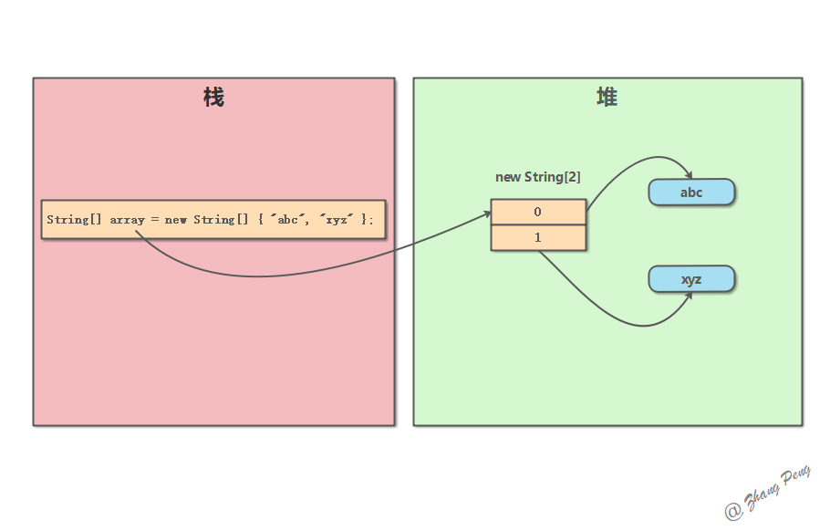

* [初始化](#初始化)
  * [静态初始化](#静态初始化)
  * [动态初始化](#动态初始化)
* [Java 数组和内存](#java-数组和内存)
* [参考文章](#参考文章)

# 初始化
## 静态初始化
int[] a = {1,2,3};
## 动态初始化
int[] a = new int[3];

# Java 数组和内存
Java 数组在内存中的存储是这样的：

数组对象（这里可以看成一个指针）存储在栈中。

数组元素存储在堆中。

如下图所示：只有当 JVM 执行 new String[] 时，才会在堆中开辟相应的内存区域。数组对象 array 可以视为一个指针，指向这块内存的存储地址。

# 参考文章
- https://dunwu.github.io/javacore/basics/java-array.html#_1-4-java-%E6%95%B0%E7%BB%84%E5%92%8C%E5%86%85%E5%AD%98