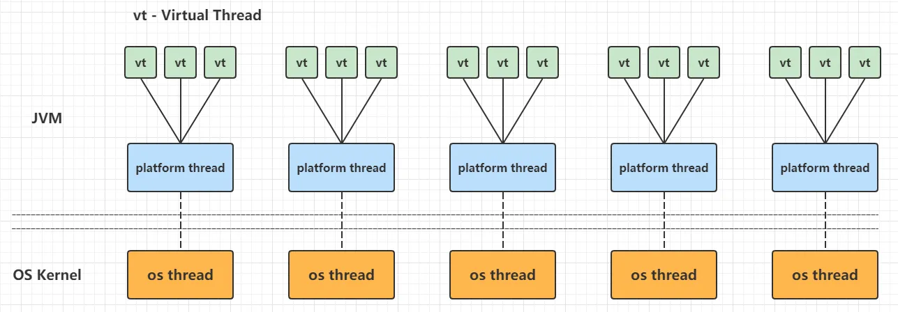
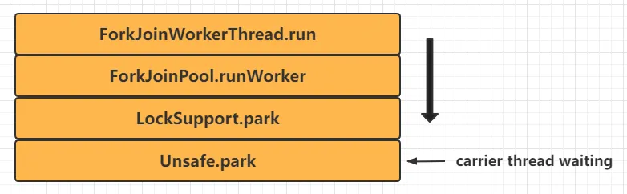
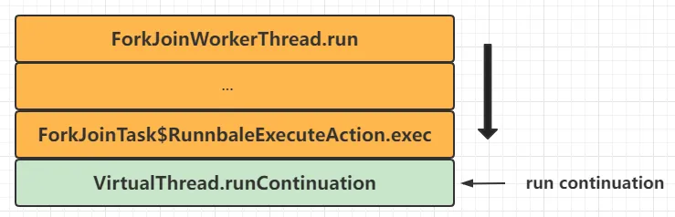
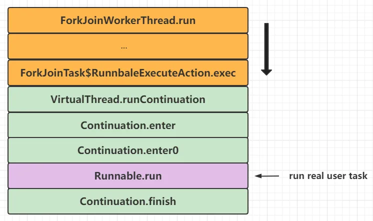
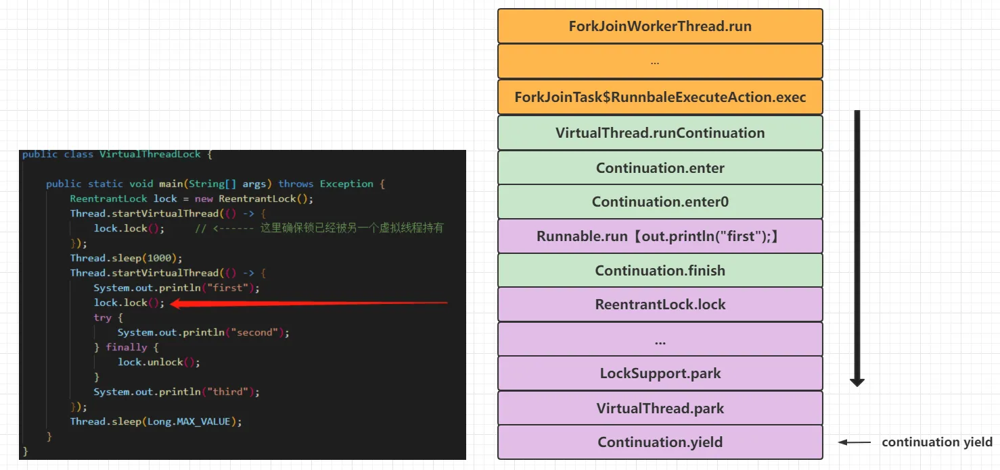
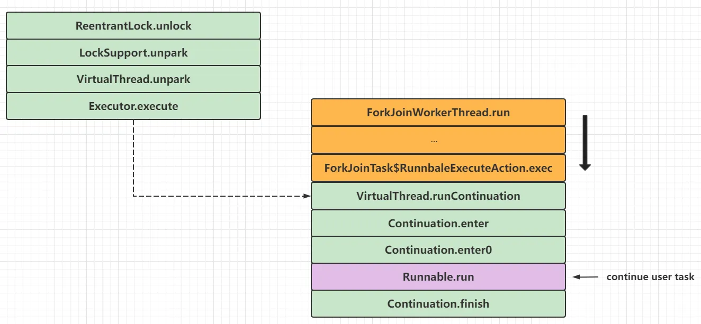
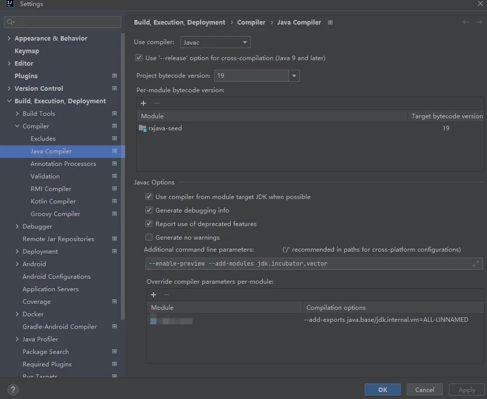

# jdk21虚拟线程
jdk21已经正式发布了虚拟线程

虚拟线程和系统线程的绑定关系


## 虚拟线程实现原理
虚拟线程是一种轻量级（用户模式）线程，这种线程是由Java虚拟机调度，而不是操作系统。虚拟线程占用空间小，任务切换开销几乎可以忽略不计，因此可以极大量地创建和使用。总体来看，虚拟线程实现如下：

```java
virtual thread = continuation + scheduler
```

虚拟线程会把任务（一般是java.lang.Runnable）包装到一个Continuation实例中：

- 当任务需要阻塞挂起的时候，会调用Continuation的yield操作进行阻塞
- 当任务需要解除阻塞继续执行的时候，Continuation会被继续执行

Scheduler也就是执行器，会把任务提交到一个载体线程池中执行：

- 执行器是java.util.concurrent.Executor的子类
- 虚拟线程框架提供了一个默认的ForkJoinPool用于执行虚拟线程任务

下文会把carrier thread称为"载体线程"，指的是负责执行虚拟线程中任务的平台线程，或者说运行虚拟线程的平台线程称为它的载体线程

操作系统调度系统线程，而Java平台线程与系统线程一一映射，所以平台线程被操作系统调度，但是虚拟线程是由JVM调度。JVM把虚拟线程分配给平台线程的操作称为mount（挂载），反过来取消分配平台线程的操作称为unmount（卸载）：

- mount操作：虚拟线程挂载到平台线程，虚拟线程中包装的Continuation栈数据帧或者引用栈数据会被拷贝到平台线程的线程栈，这是一个从堆复制到栈的过程
- unmount操作：虚拟线程从平台线程卸载，大多数虚拟线程中包装的Continuation栈数据帧会留在堆内存中

这个mount -> run -> unmount过程用伪代码表示如下：

```java
mount();
try {
    Continuation.run();
} finally {
    unmount();
}
```

从Java代码的角度来看，虚拟线程和它的载体线程暂时共享一个OS线程实例这个事实是不可见，因为虚拟线程的堆栈跟踪和线程本地变量与平台线程是完全隔离的。JDK中专门是用了一个FIFO模式的ForkJoinPool作为虚拟线程的调度程序，从这个调度程序看虚拟线程任务的执行流程大致如下：

- 调度器（线程池）中的平台线程等待处理任务

)

- 一个虚拟线程被分配平台线程，该平台线程作为运载线程执行虚拟线程中的任务

)

- 虚拟线程运行其Continuation，从而执行基于Runnable包装的用户任务

)

- 虚拟线程任务执行完成，标记Continuation终结，标记虚拟线程为终结状态，清空一些上下文变量，运载线程"返还"到调度器（线程池）中作为平台线程等待处理下一个任务

获取锁（ReentrantLock）的时候会触发Continuation的yield操作让出控制权，等待虚拟线程重新分配运载线程并且执行，见下面的代码：

```java
public class VirtualThreadLock {

    public static void main(String[] args) throws Exception {
        ReentrantLock lock = new ReentrantLock();
        Thread.startVirtualThread(() -> {
            lock.lock();     // <------ 这里确保锁已经被另一个虚拟线程持有
        });
        Thread.sleep(1000);
        Thread.startVirtualThread(() -> {
            System.out.println("first");
            lock.lock();
            try {
                System.out.println("second");
            } finally {
                lock.unlock();
            }
            System.out.println("third");
        });
        Thread.sleep(Long.MAX_VALUE);
    }
}
```

- 虚拟线程中任务执行时候首次调用Continuation#run()执行了部分任务代码，然后尝试获取锁，会导致Continuation的yield操作让出控制权（任务切换），也就是unmount，运载线程栈数据会移动到Continuation栈的数据帧中，保存在堆内存，虚拟线程任务完成（但是虚拟线程没有终结，同时其Continuation也没有终结和释放），运载线程被释放到执行器中等待新的任务；如果Continuation的yield操作失败，则会对运载线程进行park调用，阻塞在运载线程上



- 当锁持有者释放锁之后，会唤醒虚拟线程获取锁（成功后），虚拟线程会重新进行mount，让虚拟线程任务再次执行，有可能是分配到另一个运载线程中执行，Continuation栈会的数据帧会被恢复到运载线程栈中，然后再次调用Continuation#run()恢复任务执行：



- 最终虚拟线程任务执行完成，标记Continuation终结，标记虚拟线程为终结状态，清空一些上下文变量，运载线程"返还"到调度器（线程池）中作为平台线程等待处理下一个任务

Continuation组件十分重要，它既是用户真实任务的包装器，也是任务切换虚拟线程与平台线程之间数据转移的一个句柄，它提供的yield操作可以实现任务上下文的中断和恢复。由于Continuation被封闭在java.base/jdk.internal.vm下，可以通过增加编译参数--add-exports java.base/jdk.internal.vm=ALL-UNNAMED暴露对应的功能，从而编写实验性案例，IDEA中可以按下图进行编译参数添加：



然后编写和运行下面的例子：

```java
import jdk.internal.vm.Continuation;
import jdk.internal.vm.ContinuationScope;

public class ContinuationDemo {

    public static void main(String[] args) {
        ContinuationScope scope = new ContinuationScope("scope");
        Continuation continuation = new Continuation(scope, () -> {
            System.out.println("Running before yield");
            Continuation.yield(scope);
            System.out.println("Running after yield");
        });
        System.out.println("First run");
        // 第一次执行Continuation.run
        continuation.run();
        System.out.println("Second run");
        // 第二次执行Continuation.run
        continuation.run();
        System.out.println("Done");
    }
}

// 运行代码，神奇的结果出现了
First run
Running before yield
Second run
Running after yield
Done

```
这里可以看出Continuation的奇妙之处，Continuation实例进行yield调用后，再次调用其run方法就可以从yield的调用之处往下执行，从而实现了程序的中断和恢复。

## 源码分析


# 文章参考
- https://www.cnblogs.com/throwable/p/16758997.html