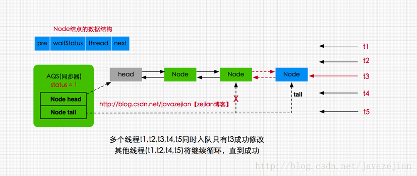
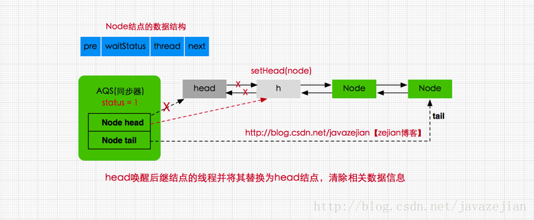
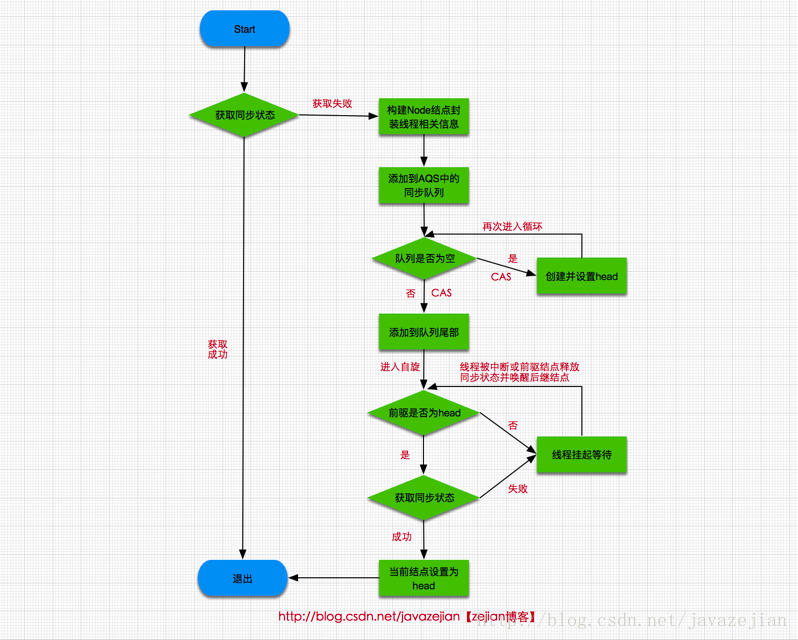
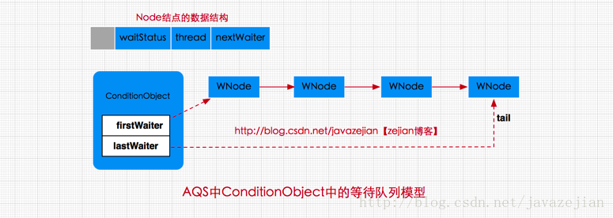
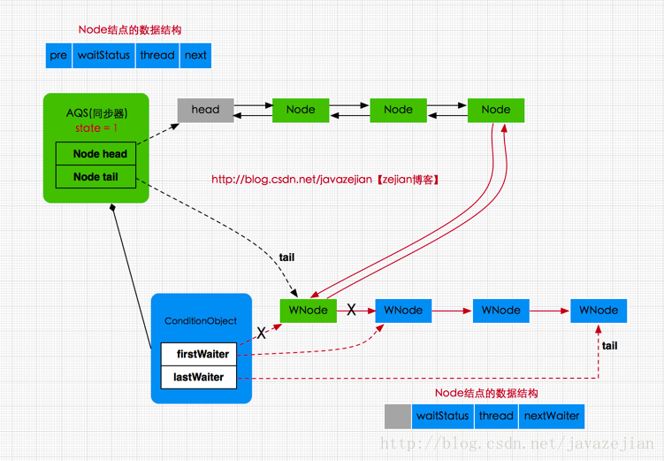

# AQS（AbstractQueuedSynchronizer）
## 工作原理概要
AbstractQueuedSynchronizer又称为队列同步器(后面简称AQS)，它是用来构建锁或其他同步组件的基础框架，内部通过一个int类型的成员变量state来控制同步状态

当state=0时，则说明没有任何线程占有共享资源的锁，当state=1时，则说明有线程目前正在使用共享变量，其他线程必须加入同步队列进行等待

AQS内部通过内部类Node构成FIFO的同步队列来完成线程获取锁的排队工作，同时利用内部类ConditionObject构建等待队列

当Condition调用wait()方法后，线程将会加入等待队列中

而当Condition调用signal()方法后，线程将从等待队列转移动同步队列中进行锁竞争。

注意这里涉及到两种队列，一种的同步队列，当线程请求锁而等待的后将加入同步队列等待，而另一种则是等待队列(可有多个)，通过Condition调用await()方法释放锁后，将加入等待队列
## 同步队列模型
### 属性
- `private transient volatile Node head;` //指向同步队列队头
- `private transient volatile Node tail;` //指向同步的队尾
- `private volatile int state;` //同步状态，0代表锁未被占用，1代表锁已被占用
### 示意图

- head指向同步队列的头部，注意head为空结点，不存储信息
- tail则是同步队列的队尾
- 同步队列采用的是双向链表的结构这样可方便队列进行结点增删操作
- state变量则是代表同步状态，执行当线程调用lock方法进行加锁后，如果此时state的值为0，则说明当前线程可以获取到锁(在本篇文章中，锁和同步状态代表同一个意思)，同时将state设置为1，表示获取成功。如果state已为1，也就是当前锁已被其他线程持有，那么当前执行线程将被封装为Node结点加入同步队列等待
### Node
属性
```java
static final class Node {
    //共享模式
    static final Node SHARED = new Node();
    //独占模式
    static final Node EXCLUSIVE = null;

    //标识线程已处于结束状态
    static final int CANCELLED =  1;
    //等待被唤醒状态
    static final int SIGNAL    = -1;
    //条件状态，
    static final int CONDITION = -2;
    //在共享模式中使用表示获得的同步状态会被传播
    static final int PROPAGATE = -3;

    //等待状态,存在CANCELLED、SIGNAL、CONDITION、PROPAGATE 4种
    volatile int waitStatus;

    //同步队列中前驱结点
    volatile Node prev;

    //同步队列中后继结点
    volatile Node next;

    //请求锁的线程
    volatile Thread thread;

    //等待队列中的后继结点，这个与Condition有关，稍后会分析
    Node nextWaiter;

    //判断是否为共享模式
    final boolean isShared() {
        return nextWaiter == SHARED;
    }

    //获取前驱结点
    final Node predecessor() throws NullPointerException {
        Node p = prev;
        if (p == null)
            throw new NullPointerException();
        else
            return p;
    }

    //.....
}
```
- `SHARED`和`EXCLUSIVE`常量分别代表共享模式和独占模式
  - 共享模式是一个锁允许多条线程同时操作，如信号量Semaphore采用的就是基于AQS的共享模式实现的
  - 独占模式则是同一个时间段只能有一个线程对共享资源进行操作，多余的请求线程需要排队等待，如ReentranLock
- `waitStatus`  则表示当前被封装成Node结点的等待状态
  - `CANCELLED`
  值为1，在同步队列中等待的线程等待超时或被中断，需要从同步队列中取消该Node的结点，其结点的waitStatus为CANCELLED，即结束状态，进入该状态后的结点将不会再变化
  - `SIGNAL`
  值为-1，被标识为该等待唤醒状态的后继结点，当其前继结点的线程释放了同步锁或被取消，将会通知该后继结点的线程执行。说白了，就是处于唤醒状态，只要前继结点释放锁，就会通知标识为SIGNAL状态的后继结点的线程执行
  - `CONDITION`
  值为-2，与Condition相关，该标识的结点处于等待队列中，结点的线程等待在Condition上，当其他线程调用了Condition的signal()方法后，CONDITION状态的结点将从等待队列转移到同步队列中，等待获取同步锁
  - `PROPAGATE`
  值为-3，与共享模式相关，在共享模式中，该状态标识结点的线程处于可运行状态
  - `0状态`
  值为0，代表初始化状态
- `pre` 指向当前Node结点的前驱结点
- `next` 指向当前Node结点的后继结点
- `thread` 存储的请求锁的线程
- `nextWaiter` 与Condition相关，代表等待队列中的后继结点

# ReentrantLock
ReentrantLock内部存在3个实现类，分别是Sync、NonfairSync、FairSync
## Sync (extends AbstractQueuedSynchronizer)
Sync继承自AQS实现了解锁tryRelease()方法
## NonfairSync (extends Sync) 非公平锁
### lock
```java
/**
 * 非公平锁实现
 */
static final class NonfairSync extends Sync {
    //加锁
    final void lock() {
        //执行CAS操作，获取同步状态
        if (compareAndSetState(0, 1))
       //成功则将独占锁线程设置为当前线程  
          setExclusiveOwnerThread(Thread.currentThread());
        else
            //否则再次请求同步状态
            acquire(1);
    }
}
```
这里获取锁时，首先对同步状态执行CAS操作，尝试把state的状态从0设置为1，如果返回true则代表获取同步状态成功，也就是当前线程获取锁成，可操作临界资源，如果返回false，则表示已有线程持有该同步状态(其值为1)，获取锁失败，注意这里存在并发的情景，也就是可能同时存在多个线程设置state变量，因此是CAS操作保证了state变量操作的原子性。返回false后，执行 acquire(1)方法，该方法是AQS中的方法，它对中断不敏感，即使线程获取同步状态失败，进入同步队列，后续对该线程执行中断操作也不会从同步队列中移出，方法如下

```java
public final void acquire(int arg) {
    //再次尝试获取同步状态
    if (!tryAcquire(arg) &&
        acquireQueued(addWaiter(Node.EXCLUSIVE), arg))
        selfInterrupt();
}
```
这里传入参数arg表示要获取同步状态后设置的值(即要设置state的值)，因为要获取锁，而status为0时是释放锁，1则是获取锁，所以这里一般传递参数为1，进入方法后首先会执行tryAcquire(arg)方法，在前面分析过该方法在AQS中并没有具体实现，而是交由子类实现，因此该方法是由ReetrantLock类内部实现的

```java
//NonfairSync类
static final class NonfairSync extends Sync {

    protected final boolean tryAcquire(int acquires) {
         return nonfairTryAcquire(acquires);
     }
 }

//Sync类
abstract static class Sync extends AbstractQueuedSynchronizer {

  //nonfairTryAcquire方法
  final boolean nonfairTryAcquire(int acquires) {
      final Thread current = Thread.currentThread();
      int c = getState();
      //判断同步状态是否为0，并尝试再次获取同步状态
      if (c == 0) {
          //执行CAS操作
          if (compareAndSetState(0, acquires)) {
              setExclusiveOwnerThread(current);
              return true;
          }
      }
      //如果当前线程已获取锁，属于重入锁，再次获取锁后将status值加1
      else if (current == getExclusiveOwnerThread()) {
          int nextc = c + acquires;
          if (nextc < 0) // overflow
              throw new Error("Maximum lock count exceeded");
          //设置当前同步状态，当前只有一个线程持有锁，因为不会发生线程安全问题，可以直接执行 setState(nextc);
          setState(nextc);
          return true;
      }
      return false;
  }
  //省略其他代码
}
```
从代码执行流程可以看出，这里做了两件事

1. 一是尝试再次获取同步状态，如果获取成功则将当前线程设置为OwnerThread，否则失败，
2. 二是判断当前线程current是否为OwnerThread，如果是则属于重入锁，state自增1，并获取锁成功，返回true，反之失败，返回false，也就是tryAcquire(arg)执行失败，返回false。

需要注意的是nonfairTryAcquire(int acquires)内部使用的是CAS原子性操作设置state值，可以保证state的更改是线程安全的，因此只要任意一个线程调用nonfairTryAcquire(int acquires)方法并设置成功即可获取锁，不管该线程是新到来的还是已在同步队列的线程，毕竟这是非公平锁，并不保证同步队列中的线程一定比新到来线程请求(可能是head结点刚释放同步状态然后新到来的线程恰好获取到同步状态)先获取到锁，这点跟后面还会讲到的公平锁不同。ok~，接着看之前的方法acquire(int arg)

```java
public final void acquire(int arg) {
    //再次尝试获取同步状态
    if (!tryAcquire(arg) &&
        acquireQueued(addWaiter(Node.EXCLUSIVE), arg))
        selfInterrupt();
}
```

如果tryAcquire(arg)返回true，acquireQueued自然不会执行，这是最理想的，因为毕竟当前线程已获取到锁，如果tryAcquire(arg)返回false，则会执行addWaiter(Node.EXCLUSIVE)进行入队操作,由于ReentrantLock属于独占锁，因此结点类型为Node.EXCLUSIVE，下面看看addWaiter方法具体实现

```java
private Node addWaiter(Node mode) {
    //将请求同步状态失败的线程封装成结点
    Node node = new Node(Thread.currentThread(), mode);

    Node pred = tail;
    //如果是第一个结点加入肯定为空，跳过。
    //如果非第一个结点则直接执行CAS入队操作，尝试在尾部快速添加
    if (pred != null) {
        node.prev = pred;
        //使用CAS执行尾部结点替换，尝试在尾部快速添加
        if (compareAndSetTail(pred, node)) {
            pred.next = node;
            return node;
        }
    }
    //如果第一次加入或者CAS操作没有成功执行enq入队操作
    enq(node);
    return node;
}
```

创建了一个Node.EXCLUSIVE类型Node结点用于封装线程及其相关信息，其中tail是AQS的成员变量，指向队尾(这点前面的我们分析过AQS维持的是一个双向的链表结构同步队列)，如果是第一个结点，则为tail肯定为空，那么将执行enq(node)操作，如果非第一个结点即tail指向不为null，直接尝试执行CAS操作加入队尾，如果CAS操作失败还是会执行enq(node)，继续看enq(node)：

```java
private Node enq(final Node node) {
    //死循环
    for (;;) {
         Node t = tail;
         //如果队列为null，即没有头结点
         if (t == null) { // Must initialize
             //创建并使用CAS设置头结点
             if (compareAndSetHead(new Node()))
                 tail = head;
         } else {//队尾添加新结点
             node.prev = t;
             if (compareAndSetTail(t, node)) {
                 t.next = node;
                 return t;
             }
         }
     }
    }
```
这个方法使用一个死循环进行CAS操作，可以解决多线程并发问题。这里做了两件事，一是如果还没有初始同步队列则创建新结点并使用compareAndSetHead设置头结点，tail也指向head，二是队列已存在，则将新结点node添加到队尾。注意这两个步骤都存在同一时间多个线程操作的可能，如果有一个线程修改head和tail成功，那么其他线程将继续循环，直到修改成功，这里使用CAS原子操作进行头结点设置和尾结点tail替换可以保证线程安全，从这里也可以看出head结点本身不存在任何数据，它只是作为一个牵头结点，而tail永远指向尾部结点(前提是队列不为null)。


添加到同步队列后，结点就会进入一个自旋过程，即每个结点都在观察时机待条件满足获取同步状态，然后从同步队列退出并结束自旋，回到之前的acquire()方法，自旋过程是在acquireQueued(addWaiter(Node.EXCLUSIVE), arg))方法中执行的，代码如下

```java
final boolean acquireQueued(final Node node, int arg) {
    boolean failed = true;
    try {
        boolean interrupted = false;
        //自旋，死循环
        for (;;) {
            //获取前驱结点
            final Node p = node.predecessor();
            当且仅当p为头结点才尝试获取同步状态
            if (p == head && tryAcquire(arg)) {
                //将node设置为头结点
                setHead(node);
                //清空原来头结点的引用便于GC
                p.next = null; // help GC
                failed = false;
                return interrupted;
            }
            //如果前驱结点不是head，判断是否挂起线程
            if (shouldParkAfterFailedAcquire(p, node) &&
                parkAndCheckInterrupt())
                interrupted = true;
        }
    } finally {
        if (failed)
            //最终都没能获取同步状态，结束该线程的请求
            cancelAcquire(node);
    }
}

```
当前线程在自旋(死循环)中获取同步状态，当且仅当前驱结点为头结点才尝试获取同步状态，这符合FIFO的规则，即先进先出，其次head是当前获取同步状态的线程结点，只有当head释放同步状态唤醒后继结点，后继结点才有可能获取到同步状态，因此后继结点在其前继结点为head时，才进行尝试获取同步状态，其他时刻将被挂起。进入if语句后调用setHead(node)方法，将当前线程结点设置为head

```java
//设置为头结点
private void setHead(Node node) {
        head = node;
        //清空结点数据
        node.thread = null;
        node.prev = null;
}
```
设置为node结点被设置为head后，其thread信息和前驱结点将被清空，因为该线程已获取到同步状态(锁)，正在执行了，也就没有必要存储相关信息了，head只有保存指向后继结点的指针即可，便于head结点释放同步状态后唤醒后继结点，执行结果如下图


从图可知更新head结点的指向，将后继结点的线程唤醒并获取同步状态，调用setHead(node)将其替换为head结点，清除相关无用数据。当然如果前驱结点不是head，那么执行如下

```java
//如果前驱结点不是head，判断是否挂起线程
if (shouldParkAfterFailedAcquire(p, node) &&parkAndCheckInterrupt())

      interrupted = true;
}

private static boolean shouldParkAfterFailedAcquire(Node pred, Node node) {
        //获取当前结点的等待状态
        int ws = pred.waitStatus;
        //如果为等待唤醒（SIGNAL）状态则返回true
        if (ws == Node.SIGNAL)
            return true;
        //如果ws>0 则说明是结束状态，
        //遍历前驱结点直到找到没有结束状态的结点
        if (ws > 0) {
            do {
                node.prev = pred = pred.prev;
            } while (pred.waitStatus > 0);
            pred.next = node;
        } else {
            //如果ws小于0又不是SIGNAL状态，
            //则将其设置为SIGNAL状态，代表该结点的线程正在等待唤醒。
            compareAndSetWaitStatus(pred, ws, Node.SIGNAL);
        }
        return false;
    }

private final boolean parkAndCheckInterrupt() {
        //将当前线程挂起
        LockSupport.park(this);
        //获取线程中断状态,interrupted()是判断当前中断状态，
        //并非中断线程，因此可能true也可能false,并返回
        return Thread.interrupted();
}
```
shouldParkAfterFailedAcquire()方法的作用是判断当前结点的前驱结点是否为SIGNAL状态(即等待唤醒状态)，如果是则返回true。如果结点的ws为CANCELLED状态(值为1>0),即结束状态，则说明该前驱结点已没有用应该从同步队列移除，执行while循环，直到寻找到非CANCELLED状态的结点。倘若前驱结点的ws值不为CANCELLED，也不为SIGNAL(当从Condition的条件等待队列转移到同步队列时，结点状态为CONDITION因此需要转换为SIGNAL)，那么将其转换为SIGNAL状态，等待被唤醒。

若shouldParkAfterFailedAcquire()方法返回true，即前驱结点为SIGNAL状态同时又不是head结点，那么使用parkAndCheckInterrupt()方法挂起当前线程，称为WAITING状态，需要等待一个unpark()操作来唤醒它，到此ReetrantLock内部间接通过AQS的FIFO的同步队列就完成了lock()操作，这里我们总结成逻辑流程图


关于获取锁的操作，这里看看另外一种可中断的获取方式，即调用ReentrantLock类的lockInterruptibly()或者tryLock()方法，最终它们都间接调用到doAcquireInterruptibly()
```java
 private void doAcquireInterruptibly(int arg)
        throws InterruptedException {
        final Node node = addWaiter(Node.EXCLUSIVE);
        boolean failed = true;
        try {
            for (;;) {
                final Node p = node.predecessor();
                if (p == head && tryAcquire(arg)) {
                    setHead(node);
                    p.next = null; // help GC
                    failed = false;
                    return;
                }
                if (shouldParkAfterFailedAcquire(p, node) &&
                    parkAndCheckInterrupt())
                    //直接抛异常，中断线程的同步状态请求
                    throw new InterruptedException();
            }
        } finally {
            if (failed)
                cancelAcquire(node);
        }
    }
```
最大的不同是
```java
if (shouldParkAfterFailedAcquire(p, node) &&
                    parkAndCheckInterrupt())
     //直接抛异常，中断线程的同步状态请求
       throw new InterruptedException();
```
检测到线程的中断操作后，直接抛出异常，从而中断线程的同步状态请求，移除同步队列，ok~,加锁流程到此
### unlock
```java
//ReentrantLock类的unlock
public void unlock() {
    sync.release(1);
}

//AQS类的release()方法
public final boolean release(int arg) {
    //尝试释放锁
    if (tryRelease(arg)) {

        Node h = head;
        if (h != null && h.waitStatus != 0)
            //唤醒后继结点的线程
            unparkSuccessor(h);
        return true;
    }
    return false;
}

//ReentrantLock类中的内部类Sync实现的tryRelease(int releases) 
protected final boolean tryRelease(int releases) {

      int c = getState() - releases;
      if (Thread.currentThread() != getExclusiveOwnerThread())
          throw new IllegalMonitorStateException();
      boolean free = false;
      //判断状态是否为0，如果是则说明已释放同步状态
      if (c == 0) {
          free = true;
          //设置Owner为null
          setExclusiveOwnerThread(null);
      }
      //设置更新同步状态
      setState(c);
      return free;
  }
```
释放同步状态的操作相对简单些，tryRelease(int releases)方法是ReentrantLock类中内部类自己实现的，因为AQS对于释放锁并没有提供具体实现，必须由子类自己实现。释放同步状态后会使用unparkSuccessor(h)唤醒后继结点的线程，这里看看unparkSuccessor(h)

```java
private void unparkSuccessor(Node node) {
    //这里，node一般为当前线程所在的结点。
    int ws = node.waitStatus;
    if (ws < 0)//置零当前线程所在的结点状态，允许失败。
        compareAndSetWaitStatus(node, ws, 0);

    Node s = node.next;//找到下一个需要唤醒的结点s
    if (s == null || s.waitStatus > 0) {//如果为空或已取消
        s = null;
        for (Node t = tail; t != null && t != node; t = t.prev)
            if (t.waitStatus <= 0)//从这里可以看出，<=0的结点，都是还有效的结点。
                s = t;
    }
    if (s != null)
        LockSupport.unpark(s.thread);//唤醒
}
```
从代码执行操作来看，这里主要作用是用unpark()唤醒同步队列中最前边未放弃线程(也就是状态为CANCELLED的线程结点s)。此时，回忆前面分析进入自旋的函数acquireQueued()，s结点的线程被唤醒后，会进入acquireQueued()函数的if (p == head && tryAcquire(arg))的判断，如果p!=head也不会有影响，因为它会执行shouldParkAfterFailedAcquire()，由于s通过unparkSuccessor()操作后已是同步队列中最前边未放弃的线程结点，那么通过shouldParkAfterFailedAcquire()内部对结点状态的调整，s也必然会成为head的next结点，因此再次自旋时p==head就成立了，然后s把自己设置成head结点，表示自己已经获取到资源了，最终acquire()也返回了，这就是独占锁释放的过程。
ok~，关于独占模式的加锁和释放锁的过程到这就分析完，总之呢，在AQS同步器中维护着一个同步队列，当线程获取同步状态失败后，将会被封装成Node结点，加入到同步队列中并进行自旋操作，当当前线程结点的前驱结点为head时，将尝试获取同步状态，获取成功将自己设置为head结点。在释放同步状态时，则通过调用子类(ReetrantLock中的Sync内部类)的tryRelease(int releases)方法释放同步状态，释放成功则唤醒后继结点的线程。

## FairSync (extends Sync) 公平锁

### lock
与非公平锁不同的是，在获取锁的时，公平锁的获取顺序是完全遵循时间上的FIFO规则，也就是说先请求的线程一定会先获取锁，后来的线程肯定需要排队，这点与前面我们分析非公平锁的nonfairTryAcquire(int acquires)方法实现有锁不同，下面是公平锁中tryAcquire()方法的实现
```java
//公平锁FairSync类中的实现
protected final boolean tryAcquire(int acquires) {
            final Thread current = Thread.currentThread();
            int c = getState();
            if (c == 0) {
            //注意！！这里先判断同步队列是否存在结点
                if (!hasQueuedPredecessors() &&
                    compareAndSetState(0, acquires)) {
                    setExclusiveOwnerThread(current);
                    return true;
                }
            }
            else if (current == getExclusiveOwnerThread()) {
                int nextc = c + acquires;
                if (nextc < 0)
                    throw new Error("Maximum lock count exceeded");
                setState(nextc);
                return true;
            }
            return false;
        }
```
该方法与nonfairTryAcquire(int acquires)方法唯一的不同是在使用CAS设置尝试设置state值前，调用了hasQueuedPredecessors()判断同步队列是否存在结点，如果存在必须先执行完同步队列中结点的线程，当前线程进入等待状态。这就是非公平锁与公平锁最大的区别，即公平锁在线程请求到来时先会判断同步队列是否存在结点，如果存在先执行同步队列中的结点线程，当前线程将封装成node加入同步队列等待。而非公平锁呢，当线程请求到来时，不管同步队列是否存在线程结点，直接尝试获取同步状态，获取成功直接访问共享资源，但请注意在绝大多数情况下，非公平锁才是我们理想的选择，毕竟从效率上来说非公平锁总是胜于公平锁。

## Condition
在并发编程中，每个Java对象都存在一组监视器方法，如wait()、notify()以及notifyAll()方法，通过这些方法，我们可以实现线程间通信与协作（也称为等待唤醒机制），如生产者-消费者模式，而且这些方法必须配合着synchronized关键字使用，关于这点，如果想有更深入的理解，可观看博主另外一篇博文【 深入理解Java并发之synchronized实现原理】，与synchronized的等待唤醒机制相比Condition具有更多的灵活性以及精确性，这是因为notify()在唤醒线程时是随机(同一个锁)，而Condition则可通过多个Condition实例对象建立更加精细的线程控制，也就带来了更多灵活性了，我们可以简单理解为以下两点
- 通过Condition能够精细的控制多线程的休眠与唤醒。
- 对于一个锁，我们可以为多个线程间建立不同的Condition。

### 主要方法
```java
public interface Condition {

 /**
  * 使当前线程进入等待状态直到被通知(signal)或中断
  * 当其他线程调用singal()或singalAll()方法时，该线程将被唤醒
  * 当其他线程调用interrupt()方法中断当前线程
  * await()相当于synchronized等待唤醒机制中的wait()方法
  */
 void await() throws InterruptedException;

 //当前线程进入等待状态，直到被唤醒，该方法不响应中断要求
 void awaitUninterruptibly();

 //调用该方法，当前线程进入等待状态，直到被唤醒或被中断或超时
 //其中nanosTimeout指的等待超时时间，单位纳秒
 long awaitNanos(long nanosTimeout) throws InterruptedException;

  //同awaitNanos，但可以指明时间单位
  boolean await(long time, TimeUnit unit) throws InterruptedException;

 //调用该方法当前线程进入等待状态，直到被唤醒、中断或到达某个时
 //间期限(deadline),如果没到指定时间就被唤醒，返回true，其他情况返回false
  boolean awaitUntil(Date deadline) throws InterruptedException;

 //唤醒一个等待在Condition上的线程，该线程从等待方法返回前必须
 //获取与Condition相关联的锁，功能与notify()相同
  void signal();

 //唤醒所有等待在Condition上的线程，该线程从等待方法返回前必须
 //获取与Condition相关联的锁，功能与notifyAll()相同
  void signalAll();
}
```
### Condition的使用案例-生产者消费者模式
这里我们通过一个卖烤鸭的案例来演示多生产多消费者的案例，该场景中存在两条生产线程t1和t2，用于生产烤鸭，也存在两条消费线程t3，t4用于消费烤鸭，4条线程同时执行，需要保证只有在生产线程产生烤鸭后，消费线程才能消费，否则只能等待，直到生产线程产生烤鸭后唤醒消费线程，注意烤鸭不能重复消费。ResourceByCondition类中定义product()和consume()两个方法，分别用于生产烤鸭和消费烤鸭，并且定义ReentrantLock锁，用于控制product()和consume()的并发，由于必须在烤鸭生成完成后消费线程才能消费烤鸭，否则只能等待，因此这里定义两组Condition对象，分别是producer_con和consumer_con，前者拥有控制生产线程，后者拥有控制消费线程，这里我们使用一个标志flag来控制是否有烤鸭，当flag为true时，代表烤鸭生成完毕，生产线程必须进入等待状态同时唤醒消费线程进行消费，消费线程消费完毕后将flag设置为false，代表烤鸭消费完成，进入等待状态，同时唤醒生产线程生产烤鸭，具体代码如下
```java
package com.zejian.concurrencys;

import java.util.concurrent.locks.Condition;
import java.util.concurrent.locks.Lock;
import java.util.concurrent.locks.ReentrantLock;

/**
 * Created by zejian on 2017/7/22.
 * Blog : http://blog.csdn.net/javazejian [原文地址,请尊重原创]
 */
public class ResourceByCondition {
    private String name;
    private int count = 1;
    private boolean flag = false;

    //创建一个锁对象。
    Lock lock = new ReentrantLock();

    //通过已有的锁获取两组监视器，一组监视生产者，一组监视消费者。
    Condition producer_con = lock.newCondition();
    Condition consumer_con = lock.newCondition();

    /**
     * 生产
     * @param name
     */
    public  void product(String name)
    {
        lock.lock();
        try
        {
            while(flag){
                try{
                    producer_con.await();
                }catch(InterruptedException e){
                    
                }
            }
            this.name = name + count;
            count++;
            System.out.println(Thread.currentThread().getName()+"...生产者5.0..."+this.name);
            flag = true;
            consumer_con.signal();//直接唤醒消费线程
        }
        finally
        {
            lock.unlock();
        }
    }

    /**
     * 消费
     */
    public  void consume()
    {
        lock.lock();
        try
        {
            while(!flag){
                try{
                    consumer_con.await();
                }catch(InterruptedException e)
                {}
            }
            System.out.println(Thread.currentThread().getName()+"...消费者.5.0......."+this.name);//消费烤鸭1
            flag = false;
            producer_con.signal();//直接唤醒生产线程
        }
        finally
        {
            lock.unlock();
        }
    }
}

```
执行代码
```java
package com.zejian.concurrencys;
/**
 * Created by zejian on 2017/7/22.
 * Blog : http://blog.csdn.net/javazejian [原文地址,请尊重原创]
 */
public class Mutil_Producer_ConsumerByCondition {

    public static void main(String[] args) {
        ResourceByCondition r = new ResourceByCondition();
        Mutil_Producer pro = new Mutil_Producer(r);
        Mutil_Consumer con = new Mutil_Consumer(r);
        //生产者线程
        Thread t0 = new Thread(pro);
        Thread t1 = new Thread(pro);
        //消费者线程
        Thread t2 = new Thread(con);
        Thread t3 = new Thread(con);
        //启动线程
        t0.start();
        t1.start();
        t2.start();
        t3.start();
    }
}

/**
 * @decrition 生产者线程
 */
class Mutil_Producer implements Runnable {
    private ResourceByCondition r;

    Mutil_Producer(ResourceByCondition r) {
        this.r = r;
    }

    public void run() {
        while (true) {
            r.product("北京烤鸭");
        }
    }
}

/**
 * @decrition 消费者线程
 */
class Mutil_Consumer implements Runnable {
    private ResourceByCondition r;

    Mutil_Consumer(ResourceByCondition r) {
        this.r = r;
    }

    public void run() {
        while (true) {
            r.consume();
        }
    }
}
```
正如代码所示，我们通过两者Condition对象单独控制消费线程与生产消费，这样可以避免消费线程在唤醒线程时唤醒的还是消费线程，如果是通过synchronized的等待唤醒机制实现的话，就可能无法避免这种情况，毕竟同一个锁，对于synchronized关键字来说只能有一组等待唤醒队列，而不能像Condition一样，同一个锁拥有多个等待队列。synchronized的实现方案如下，
```java
public class KaoYaResource {

    private String name;
    private int count = 1;//烤鸭的初始数量
    private boolean flag = false;//判断是否有需要线程等待的标志
    /**
     * 生产烤鸭
     */
    public synchronized void product(String name){
        while(flag){
            //此时有烤鸭，等待
            try {
                this.wait();
            } catch (InterruptedException e) {
                e.printStackTrace();
            }
        }
        this.name=name+count;//设置烤鸭的名称
        count++;
        System.out.println(Thread.currentThread().getName()+"...生产者..."+this.name);
        flag=true;//有烤鸭后改变标志
        notifyAll();//通知消费线程可以消费了
    }

    /**
     * 消费烤鸭
     */
    public synchronized void consume(){
        while(!flag){//如果没有烤鸭就等待
            try{this.wait();}catch(InterruptedException e){}
        }
        System.out.println(Thread.currentThread().getName()+"...消费者........"+this.name);//消费烤鸭1
        flag = false;
        notifyAll();//通知生产者生产烤鸭
    }
}
```
如上代码，在调用notify()或者 notifyAll()方法时，由于等待队列中同时存在生产者线程和消费者线程，所以我们并不能保证被唤醒的到底是消费者线程还是生产者线程，而Codition则可以避免这种情况。嗯，了解完Condition的使用方式后，下面我们将进一步探讨Condition背后的实现机制

### Condition的实现原理
Condition的具体实现类是AQS的内部类`ConditionObject`，前面我们分析过AQS中存在两种队列，一种是`同步队列`，一种是`等待队列`，而等待队列就相对于Condition而言的。注意在使用Condition前必须获得锁，同时在Condition的等待队列上的结点与前面同步队列的结点是同一个类即Node，其结点的waitStatus的值为CONDITION。在实现类ConditionObject中有两个结点分别是firstWaiter和lastWaiter，firstWaiter代表等待队列第一个等待结点，lastWaiter代表等待队列最后一个等待结点，如下
```java
 public class ConditionObject implements Condition, java.io.Serializable {
    //等待队列第一个等待结点
    private transient Node firstWaiter;
    //等待队列最后一个等待结点
    private transient Node lastWaiter;
    //省略其他代码.......
}
```

每个Condition都对应着一个等待队列，也就是说如果一个锁上创建了多个Condition对象，那么也就存在多个等待队列。等待队列是一个FIFO的队列，在队列中每一个节点都包含了一个线程的引用，而该线程就是Condition对象上等待的线程。

当一个线程调用了await()相关的方法，那么该线程将会释放锁，并构建一个Node节点封装当前线程的相关信息加入到等待队列中进行等待，直到被唤醒、中断、超时才从队列中移出。Condition中的等待队列模型如下



正如图所示，Node节点的数据结构，在等待队列中使用的变量与同步队列是不同的，Condtion中等待队列的结点只有直接指向的后继结点并没有指明前驱结点，而且使用的变量是nextWaiter而不是next，这点我们在前面分析结点Node的数据结构时讲过。

`firstWaiter`指向等待队列的头结点，`lastWaiter`指向等待队列的尾结点，等待队列中结点的状态只有两种即`CANCELLED`和`CONDITION`，前者表示线程已结束需要从等待队列中移除，后者表示条件结点等待被唤醒。

再次强调每个Codition对象对于一个等待队列，也就是说AQS中只能存在`一个同步队列`，但可拥有`多个等待队列`。下面从代码层面看看被调用await()方法(其他await()实现原理类似)的线程是如何加入等待队列的，而又是如何从等待队列中被唤醒的

```java
public final void await() throws InterruptedException {
      //判断线程是否被中断
      if (Thread.interrupted())
          throw new InterruptedException();
      //创建新结点加入等待队列并返回
      Node node = addConditionWaiter();
      //释放当前线程锁即释放同步状态
      int savedState = fullyRelease(node);
      int interruptMode = 0;
      //判断结点是否同步队列(SyncQueue)中,即是否被唤醒
      while (!isOnSyncQueue(node)) {
          //挂起线程
          LockSupport.park(this);
          //判断是否被中断唤醒，如果是退出循环。
          if ((interruptMode = checkInterruptWhileWaiting(node)) != 0)
              break;
      }
      //被唤醒后执行自旋操作争取获得锁，同时判断线程是否被中断
      if (acquireQueued(node, savedState) && interruptMode != THROW_IE)
          interruptMode = REINTERRUPT;
       // clean up if cancelled
      if (node.nextWaiter != null) 
          //清理等待队列中不为CONDITION状态的结点
          unlinkCancelledWaiters();
      if (interruptMode != 0)
          reportInterruptAfterWait(interruptMode);
  }
```
执行addConditionWaiter()添加到等待队列。

```java
 private Node addConditionWaiter() {
    Node t = lastWaiter;
      // 判断是否为结束状态的结点并移除
      if (t != null && t.waitStatus != Node.CONDITION) {
          unlinkCancelledWaiters();
          t = lastWaiter;
      }
      //创建新结点状态为CONDITION
      Node node = new Node(Thread.currentThread(), Node.CONDITION);
      //加入等待队列
      if (t == null)
          firstWaiter = node;
      else
          t.nextWaiter = node;
      lastWaiter = node;
      return node;
}
```

await()方法主要做了3件事

- 一是调用addConditionWaiter()方法将当前线程封装成node结点加入等待队列
- 二是调用fullyRelease(node)方法释放同步状态并唤醒后继结点的线程。
- 三是调用isOnSyncQueue(node)方法判断结点是否在同步队列中

注意是个while循环，如果同步队列中没有该结点就直接挂起该线程，需要明白的是如果线程被唤醒后就调用`acquireQueued(node, savedState)`执行自旋操作争取锁，即当前线程结点从等待队列转移到同步队列并开始努力获取锁。

接着看看唤醒操作singal()方法
```java
 public final void signal() {
     //判断是否持有独占锁，如果不是抛出异常
   if (!isHeldExclusively())
          throw new IllegalMonitorStateException();
      Node first = firstWaiter;
      //唤醒等待队列第一个结点的线程
      if (first != null)
          doSignal(first);
 }
```

这里signal()方法做了两件事，一是判断当前线程是否持有独占锁，没有就抛出异常，从这点也可以看出只有独占模式先采用等待队列，而共享模式下是没有等待队列的，也就没法使用Condition。二是唤醒等待队列的第一个结点，即执行doSignal(first)

```java
 private void doSignal(Node first) {
     do {
             //移除条件等待队列中的第一个结点，
             //如果后继结点为null，那么说没有其他结点将尾结点也设置为null
            if ( (firstWaiter = first.nextWaiter) == null)
                 lastWaiter = null;
             first.nextWaiter = null;
          //如果被通知节点没有进入到同步队列并且条件等待队列还有不为空的节点，则继续循环通知后续结点
         } while (!transferForSignal(first) &&
                  (first = firstWaiter) != null);
        }

//transferForSignal方法
final boolean transferForSignal(Node node) {
    //尝试设置唤醒结点的waitStatus为0，即初始化状态
    //如果设置失败，说明当期结点node的waitStatus已不为
    //CONDITION状态，那么只能是结束状态了，因此返回false
    //返回doSignal()方法中继续唤醒其他结点的线程，注意这里并
    //不涉及并发问题，所以CAS操作失败只可能是预期值不为CONDITION，
    //而不是多线程设置导致预期值变化，毕竟操作该方法的线程是持有锁的。
    if (!compareAndSetWaitStatus(node, Node.CONDITION, 0))
         return false;

        //加入同步队列并返回前驱结点p
        Node p = enq(node);
        int ws = p.waitStatus;
        //判断前驱结点是否为结束结点(CANCELLED=1)或者在设置
        //前驱节点状态为Node.SIGNAL状态失败时，唤醒被通知节点代表的线程
        if (ws > 0 || !compareAndSetWaitStatus(p, ws, Node.SIGNAL))
            //唤醒node结点的线程
            LockSupport.unpark(node.thread);
        return true;
    }
```

注释说得很明白了，这里我们简单整体说明一下，doSignal(first)方法中做了两件事

- 从条件等待队列移除被唤醒的节点，然后重新维护条件等待队列的firstWaiter和lastWaiter的指向。
- 二是将从等待队列移除的结点加入同步队列(在transferForSignal()方法中完成的)，如果进入到同步队列失败并且条件等待队列还有不为空的节点，则继续循环唤醒后续其他结点的线程。

到此整个signal()的唤醒过程就很清晰了，即signal()被调用后，先判断当前线程是否持有独占锁，如果有，那么唤醒当前Condition对象中等待队列的第一个结点的线程，并从等待队列中移除该结点，移动到同步队列中，

如果加入同步队列失败，那么继续循环唤醒等待队列中的其他结点的线程，如果成功加入同步队列，那么如果其前驱结点是否已结束或者设置前驱节点状态为Node.SIGNAL状态失败，则通过LockSupport.unpark()唤醒被通知节点代表的线程，到此signal()任务完成，

注意被唤醒后的线程，将从前面的await()方法中的while循环中退出，因为此时该线程的结点已在同步队列中，那么while (!isOnSyncQueue(node))将不在符合循环条件，进而调用AQS的acquireQueued()方法加入获取同步状态的竞争中，这就是等待唤醒机制的整个流程实现原理，

流程如下图所示（注意无论是同步队列还是等待队列使用的Node数据结构都是同一个，不过是使用的内部变量不同罢了）



## 同步工具类
### CountDownLatch
用来控制一个线程等待多个线程。维护了一个计数器 cnt，每次调用 countDown() 方法会让计数器的值减 1，减到 0 的时候，那些因为调用 await() 方法而在等待的线程就会被唤醒
```java
public class MyCountDownLatch {

    public static void main(String[] args) throws InterruptedException {
        int totalThread = 10;
        CountDownLatch countDownLatch = new CountDownLatch(totalThread);
        ExecutorService executorService = Executors.newCachedThreadPool();
        for (int i = 0; i < totalThread; i++) {
            executorService.execute(()->{
                System.out.println("run...");
                countDownLatch.countDown();
            });
        }
        countDownLatch.await();
        System.out.println("end...");
        executorService.shutdown();
    }
}
```
```text
run...
run...
run...
run...
run...
run...
run...
run...
run...
run...
end...
```
#### 源码分析
CountDownLatch也是依赖于AQS的state来实现

```java
 public CountDownLatch(int count) {
    if (count < 0) throw new IllegalArgumentException("count < 0");
    this.sync = new Sync(count);
}

Sync(int count) {
    setState(count);
}

protected final void setState(int newState) {
    state = newState;
}
```

countDown()
```java
public void countDown() {
    sync.releaseShared(1);
}

public final boolean releaseShared(int arg) {
    //只有当 state 减为 0 的时候，tryReleaseShared 才返回 true
    if (tryReleaseShared(arg)) {
        doReleaseShared();
        return true;
    }
    return false;
}
```
```java
//自旋-1
protected boolean tryReleaseShared(int releases) {
    // Decrement count; signal when transition to zero
    for (;;) {
        int c = getState();
        if (c == 0)
            return false;
        int nextc = c-1;
        if (compareAndSetState(c, nextc))
            return nextc == 0;
    }
}
```
```java
//调用这个方法的时候，state == 0,那么就调用下面的方法进行唤醒阻塞队列中的线程
private void doReleaseShared() {
    for (;;) {
        Node h = head;
        if (h != null && h != tail) {
            int ws = h.waitStatus;
            if (ws == Node.SIGNAL) {
                if (!compareAndSetWaitStatus(h, Node.SIGNAL, 0))
                    continue;            // loop to recheck cases
                unparkSuccessor(h);
            }
            else if (ws == 0 &&
                     !compareAndSetWaitStatus(h, 0, Node.PROPAGATE))
                continue;                // loop on failed CAS
        }
        if (h == head)                   // loop if head changed
            break;
    }
}
```
await()
```java
public void await() throws InterruptedException {
    sync.acquireSharedInterruptibly(1);
}
    
public final void acquireSharedInterruptibly(int arg)
        throws InterruptedException {
        if (Thread.interrupted())
            throw new InterruptedException();
        if (tryAcquireShared(arg) < 0)
            doAcquireSharedInterruptibly(arg);
}
//tryAcquireShared()的作用是尝试获取共享锁。如果"锁计数器=0"，即锁是可获取状态，则返回1；否则，锁是不可获取状态，则返回-1
protected int tryAcquireShared(int acquires) {
    return (getState() == 0) ? 1 : -1;
}
```
```java
private void doAcquireSharedInterruptibly(int arg)
    throws InterruptedException {
    // 创建"当前线程"的Node节点，且Node中记录的锁是"共享锁"类型；并将该节点添加到CLH队列末尾。
    final Node node = addWaiter(Node.SHARED);
    boolean failed = true;
    try {
        for (;;) {
            // 获取上一个节点。
            // 如果上一节点是CLH队列的表头，则"尝试获取共享锁"。
            final Node p = node.predecessor();
            if (p == head) {
                //一直判断state是否为0
                int r = tryAcquireShared(arg);
                if (r >= 0) {
                    setHeadAndPropagate(node, r);
                    p.next = null; // help GC
                    failed = false;
                    return;
                }
            }
        // (上一节点不是CLH队列的表头) 当前线程一直等待，直到获取到共享锁。
        // 如果线程在等待过程中被中断过，则再次中断该线程(还原之前的中断状态)。
        if (shouldParkAfterFailedAcquire(p, node) &&
                parkAndCheckInterrupt())
                throw new InterruptedException();
        }
    } finally {
        if (failed)
            cancelAcquire(node);
    }
}
```
await()方法是怎么“阻塞”当前线程的，已经非常明白了。其实说白了，就是当你调用了countDownLatch.await()方法后，你当前线程就会进入了一个死循环当中，在这个死循环里面，会不断的进行判断，通过调用tryAcquireShared方法，不断判断我们上面说的那个计数器，看看它的值是否为0了（为0的时候，其实就是我们调用了足够多次数的countDownLatch.countDown（）方法的时候），如果是为0的话，tryAcquireShared就会返回1，然后跳出了循环，也就不再“阻塞”当前线程了。

### CyclicBarrier
用来控制多个线程互相等待，只有当多个线程都到达时，这些线程才会继续执行
```java
public class MyCyclicBarrier {

    public static void main(String[] args) {
        int totalThread = 10;
        CyclicBarrier cyclicBarrier = new CyclicBarrier(totalThread);
        ExecutorService executorService = Executors.newCachedThreadPool();
        for (int i = 0; i < totalThread; i++) {
            executorService.execute(()->{
                System.out.println("before...");
                try {
                    cyclicBarrier.await();
                } catch (InterruptedException | BrokenBarrierException e) {
                    e.printStackTrace();
                }
                System.out.println("after...");
            });
        }
        executorService.shutdown();
    }
}
```
```text
before...
before...
before...
before...
before...
before...
before...
before...
before...
before...
after...
after...
after...
after...
after...
after...
after...
after...
after...
after...
```
#### 源码分析
```java
public CyclicBarrier(int parties) {
    this(parties, null);
}

public CyclicBarrier(int parties, Runnable barrierAction) {
    if (parties <= 0) 
        throw new IllegalArgumentException();
    this.parties = parties;
    this.count = parties;
    this.barrierCommand = barrierAction;
}
```
await()

调用await方法的线程告诉CyclicBarrier自己已经到达同步点，然后当前线程被阻塞。直到parties个参与线程调用了await方法
```java
public int await() throws InterruptedException, BrokenBarrierException {
    try {
        return dowait(false, 0L);
    } catch (TimeoutException toe) {
        throw new Error(toe);
    }
}
```
```java
private int dowait(boolean timed, long nanos) throws InterruptedException, BrokenBarrierException, TimeoutException {
    final ReentrantLock lock = this.lock;
    // 抢锁
    lock.lock();
    try {
        // 获取 Generation
        final Generation g = generation;

        // 如果这代损坏了，抛出异常
        if (g.broken)
            throw new BrokenBarrierException();

        // 当前线程被中断过，
        if (Thread.interrupted()) {
            // 将损坏状态设置为true
            // 并通知其他阻塞在此栅栏上的线程
            breakBarrier();
            throw new InterruptedException();
        }

        // 线程数减 1
        int index = --count;
        // index = 0 表示公共屏障点被触发
        if (index == 0) {
            boolean ranAction = false;
            try {
                // 执行栅栏任务
                final Runnable command = barrierCommand;
                if (command != null)
                    command.run();
                // 开始执行
                ranAction = true;
                // 唤醒之前等待的线程
                nextGeneration();
                return 0;
            } finally {
                // 如果执行栅栏任务的时候失败了，就将损坏状态设置为true
                if (!ranAction)
                    breakBarrier();
            }
        }

        // loop until tripped, broken, interrupted, or timed out
        for (;;) {
            try {
                // 没有时间限制，则无期限等待
                if (!timed)
                    trip.await();
                // 有时间限制，则等待一定时间
                else if (nanos > 0L)
                    nanos = trip.awaitNanos(nanos);
            } catch (InterruptedException ie) {
                // 当前代没有损坏
                if (g == generation && ! g.broken) {
                    // 让栅栏失效
                    breakBarrier();
                    throw ie;
                } else {
                   // 上面条件不满足，说明这个线程不是这代的
                   // 就不会影响当前这代栅栏的执行，所以，就打个中断标记 Thread.currentThread().interrupt();
                }
            }

            // 当有任何一个线程中断了，就会调用breakBarrier方法
            // 就会唤醒其他的线程，其他线程醒来后，也要抛出异常
            if (g.broken)
                throw new BrokenBarrierException();

            // g != generation表示正常换代了，返回当前线程所在栅栏的下标
            // 如果 g == generation，说明还没有换代，那为什么会醒了？
            // 因为一个线程可以使用多个栅栏，当别的栅栏唤醒了这个线程，就会走到这里，所以需要判断是否是当前代。
            // 正是因为这个原因，才需要generation来保证正确。
            if (g != generation)
                return index;

            // 如果有时间限制，且时间小于等于0，销毁栅栏并抛出异常
            if (timed && nanos <= 0L) {
                breakBarrier();
                throw new TimeoutException();
            }
        }
    } finally {
        lock.unlock();
    }
}
```
### Semaphore
Semaphore 类似于操作系统中的信号量，可以控制对互斥资源的访问线程数。
```java
public class MySemaphore {

    public static void main(String[] args) {
        //最大并发量为3
        int clientCount= 3;
        //一共有10个线程去竞争
        int totalRequestCount = 10;
        Semaphore semaphore = new Semaphore(clientCount);
        ExecutorService executorService = Executors.newCachedThreadPool();
        for (int i = 0; i < totalRequestCount; i++) {
            executorService.execute(()->{
                try {
                    semaphore.acquire();
                    System.out.println("当前线程:"+Thread.currentThread().getName()+"获取了一个许可，还剩:"+semaphore.availablePermits());
                    TimeUnit.SECONDS.sleep(2);
                } catch (InterruptedException e) {
                    e.printStackTrace();
                }finally {
                    semaphore.release();
                    System.out.println("当前线程:"+Thread.currentThread().getName()+"释放了一个许可，还剩:"+semaphore.availablePermits());
                }
            });
        }
        executorService.shutdown();
    }
}
```
```text
当前线程:pool-1-thread-1获取了一个许可，还剩:1
当前线程:pool-1-thread-3获取了一个许可，还剩:0
当前线程:pool-1-thread-2获取了一个许可，还剩:1
当前线程:pool-1-thread-3释放了一个许可，还剩:3
当前线程:pool-1-thread-4获取了一个许可，还剩:2
当前线程:pool-1-thread-2释放了一个许可，还剩:3
当前线程:pool-1-thread-6获取了一个许可，还剩:0
当前线程:pool-1-thread-1释放了一个许可，还剩:3
当前线程:pool-1-thread-5获取了一个许可，还剩:1
当前线程:pool-1-thread-6释放了一个许可，还剩:3
当前线程:pool-1-thread-8获取了一个许可，还剩:1
当前线程:pool-1-thread-7获取了一个许可，还剩:2
当前线程:pool-1-thread-4释放了一个许可，还剩:3
当前线程:pool-1-thread-5释放了一个许可，还剩:3
当前线程:pool-1-thread-9获取了一个许可，还剩:0
当前线程:pool-1-thread-7释放了一个许可，还剩:3
当前线程:pool-1-thread-10获取了一个许可，还剩:2
当前线程:pool-1-thread-9释放了一个许可，还剩:3
当前线程:pool-1-thread-8释放了一个许可，还剩:3
当前线程:pool-1-thread-10释放了一个许可，还剩:3
```
#### 源码分析
底层还是依赖AQS，基本的源码看上文就不详细解析了，初始化如下默认使用非公平锁构造并设置state的值
```java
Semaphore semaphore = new Semaphore(2);

public Semaphore(int permits) {
    sync = new NonfairSync(permits);
}

```
```java
Sync(int permits) {
    setState(permits);
}

protected final void setState(int newState) {
    state = newState;
}
```

**acquire()**

```java
public void acquire() throws InterruptedException {
    sync.acquireSharedInterruptibly(1);
}

public final void acquireSharedInterruptibly(int arg)
        throws InterruptedException {
        if (Thread.interrupted())
            throw new InterruptedException();
        //如果返回值 < 0 表示获取状态失败，需要被加入同步队列等待
        if (tryAcquireShared(arg) < 0)
            doAcquireSharedInterruptibly(arg);
}

protected int tryAcquireShared(int acquires) {
        return nonfairTryAcquireShared(acquires);
}

final int nonfairTryAcquireShared(int acquires) {
        //循环获取可用的state值，用总的-1，并CAS修改值
        for (;;) {
            int available = getState();
            int remaining = available - acquires;
            if (remaining < 0 ||
                compareAndSetState(available, remaining))
                return remaining;
        }
}
```
失败则封装节点加入等待队列竞争锁
```java
private void doAcquireSharedInterruptibly(int arg)
        throws InterruptedException {
    final Node node = addWaiter(Node.SHARED);
    boolean failed = true;
    try {
        for (;;) {
            //获得当前节点pre节点
            final Node p = node.predecessor();
            if (p == head) {
                int r = tryAcquireShared(arg);
                if (r >= 0) {
                    setHeadAndPropagate(node, r);
                    p.next = null; // help GC
                    failed = false;
                    return;
                }
            }
            //重组双向链表，清空无效节点，挂起当前线程
            if (shouldParkAfterFailedAcquire(p, node) &&
                parkAndCheckInterrupt())
                throw new InterruptedException();
        }
    } finally {
        if (failed)
            cancelAcquire(node);
    }
}
```
release()
```java
public void release() {
    sync.releaseShared(1);
}
```
```java
public final boolean releaseShared(int arg) {
    //释放共享锁
    if (tryReleaseShared(arg)) {
        //唤醒所有共享节点线程
        doReleaseShared();
        return true;
    }
    return false;
}
```
```java
private void doReleaseShared() {
    for (;;) {
        Node h = head;
        if (h != null && h != tail) {
            int ws = h.waitStatus;
            if (ws == Node.SIGNAL) {//是否需要唤醒后继节点
                if (!compareAndSetWaitStatus(h, Node.SIGNAL, 0))//修改状态为初始0
                    continue;
                unparkSuccessor(h);//唤醒h.nex节点线程
            }
            else if (ws == 0 &&
                     !compareAndSetWaitStatus(h, 0, Node.PROPAGATE));
        }
        if (h == head)                   // loop if head changed
            break;
    }
}
```
# 参考文章
- https://blog.csdn.net/javazejian/article/details/75043422
- https://www.jianshu.com/p/3fe5e41dc46f
- https://blog.csdn.net/BThinker/article/details/104417813