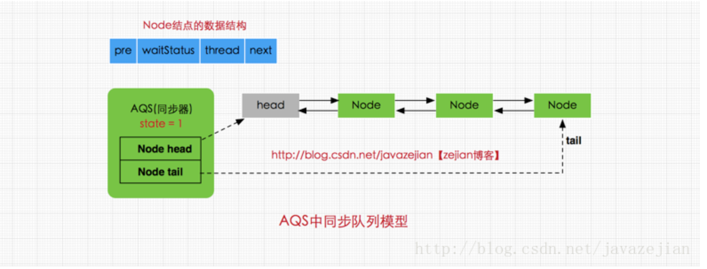
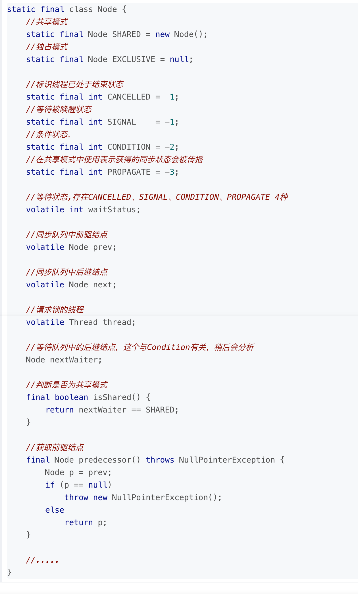
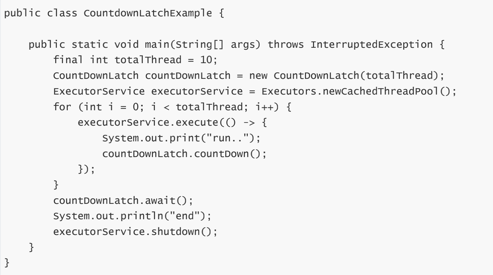
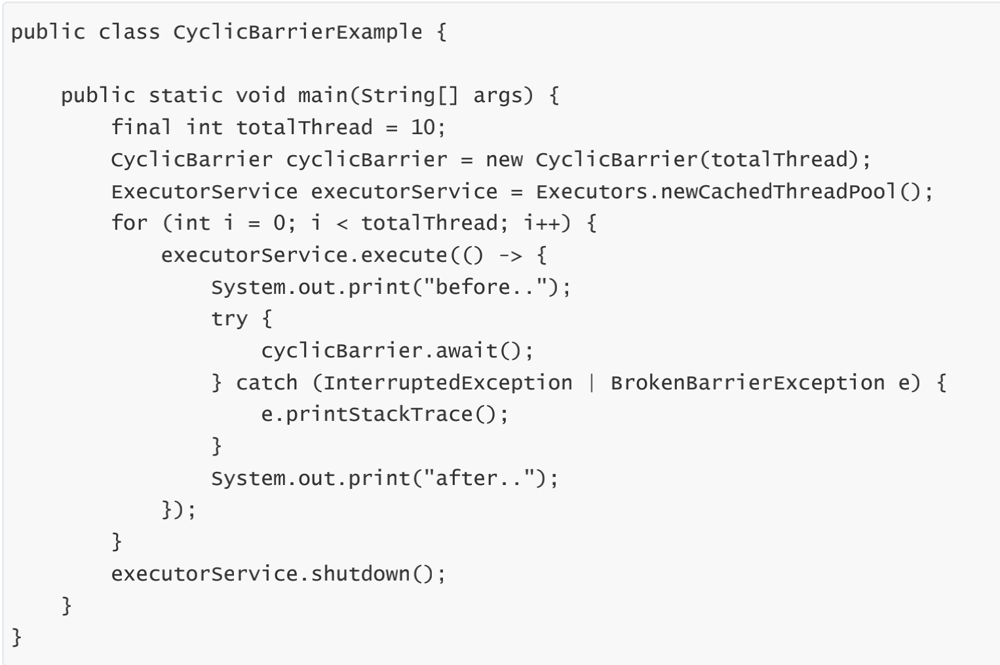

# AQS（AbstractQueuedSynchronizer）
## 工作原理概要
AbstractQueuedSynchronizer又称为队列同步器(后面简称AQS)，它是用来构建锁或其他同步组件的基础框架，内部通过一个int类型的成员变量state来控制同步状态,当state=0时，则说明没有任何线程占有共享资源的锁，当state=1时，则说明有线程目前正在使用共享变量，其他线程必须加入同步队列进行等待，AQS内部通过内部类Node构成FIFO的同步队列来完成线程获取锁的排队工作，同时利用内部类ConditionObject构建等待队列，当Condition调用wait()方法后，线程将会加入等待队列中，而当Condition调用signal()方法后，线程将从等待队列转移动同步队列中进行锁竞争。注意这里涉及到两种队列，一种的同步队列，当线程请求锁而等待的后将加入同步队列等待，而另一种则是等待队列(可有多个)，通过Condition调用await()方法释放锁后，将加入等待队列
## 同步队列模型
### 属性
- `private transient volatile Node head;` //指向同步队列队头
- `private transient volatile Node tail;` //指向同步的队尾
- `private volatile int state;` //同步状态，0代表锁未被占用，1代表锁已被占用
### 示意图

- head指向同步队列的头部，注意head为空结点，不存储信息
- tail则是同步队列的队尾
- 同步队列采用的是双向链表的结构这样可方便队列进行结点增删操作
- state变量则是代表同步状态，执行当线程调用lock方法进行加锁后，如果此时state的值为0，则说明当前线程可以获取到锁(在本篇文章中，锁和同步状态代表同一个意思)，同时将state设置为1，表示获取成功。如果state已为1，也就是当前锁已被其他线程持有，那么当前执行线程将被封装为Node结点加入同步队列等待
### Node
属性

解读
#### SHARED和EXCLUSIVE常量分别代表共享模式和独占模式
- 共享模式是一个锁允许多条线程同时操作，如信号量Semaphore采用的就是基于AQS的共享模式实现的
- 独占模式则是同一个时间段只能有一个线程对共享资源进行操作，多余的请求线程需要排队等待，如ReentranLock
#### waitStatus则表示当前被封装成Node结点的等待状态
- `CANCELLED`
值为1，在同步队列中等待的线程等待超时或被中断，需要从同步队列中取消该Node的结点，其结点的waitStatus为CANCELLED，即结束状态，进入该状态后的结点将不会再变化
- `SIGNAL`
值为-1，被标识为该等待唤醒状态的后继结点，当其前继结点的线程释放了同步锁或被取消，将会通知该后继结点的线程执行。说白了，就是处于唤醒状态，只要前继结点释放锁，就会通知标识为SIGNAL状态的后继结点的线程执行
- `CONDITION`
值为-2，与Condition相关，该标识的结点处于等待队列中，结点的线程等待在Condition上，当其他线程调用了Condition的signal()方法后，CONDITION状态的结点将从等待队列转移到同步队列中，等待获取同步锁
- `PROPAGATE`
值为-3，与共享模式相关，在共享模式中，该状态标识结点的线程处于可运行状态
- `0状态`
值为0，代表初始化状态
#### pre
指向当前Node结点的前驱结点
#### next
指向当前Node结点的后继结点
#### thread
存储的请求锁的线程
#### nextWaiter
与Condition相关，代表等待队列中的后继结点
## 同步工具类
### CountDownLatch
用来控制一个线程等待多个线程。维护了一个计数器 cnt，每次调用 countDown() 方法会让计数器的值减 1，减到 0 的时候，那些因为调用 await() 方法而在等待的线程就会被唤醒

### CyclicBarrier
用来控制多个线程互相等待，只有当多个线程都到达时，这些线程才会继续执行

### Semaphore
Semaphore 类似于操作系统中的信号量，可以控制对互斥资源的访问线程数。
			