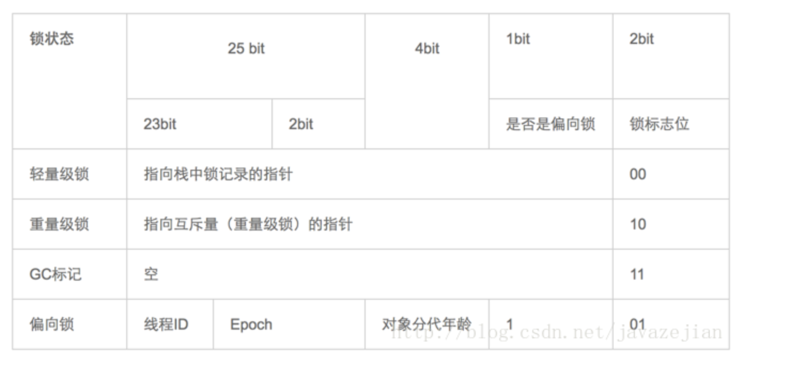
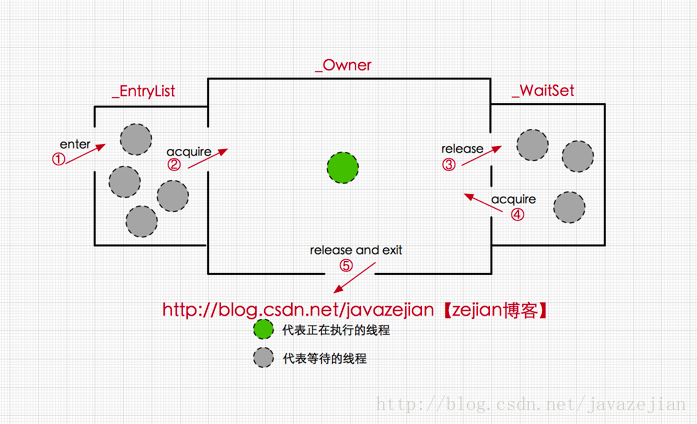

* [Java对象头](#java对象头)
  * [对象在内存中的布局](#对象在内存中的布局)
    * [Mark Word（标记字段）](#mark-word标记字段)
      * [默认存储结构](#默认存储结构)
      * [变化的结构](#变化的结构)
    * [Class Pointer（类型指针）](#class-pointer类型指针)

# Java对象头
## 对象在内存中的布局
在JVM中，对象在内存中的布局分为三块区域：对象头、实例数据和对齐填充。如下

- 实例变量：存放类的属性数据信息，包括父类的属性信息，如果是数组的实例部分还包括数组的长度，这部分内存按4字节对齐。
- 填充数据：由于虚拟机要求对象起始地址必须是8字节的整数倍。填充数据不是必须存在的，仅仅是为了字节对齐，这点了解即可。

Java对象头一般占有2个机器码（在32位虚拟机中，1个机器码等于4字节，也就是32bit，在64位虚拟机中，1个机器码是8个字节，也就是64bit），但是 如果对象是数组类型，则需要3个机器码，因为JVM虚拟机可以通过Java对象的元数据信息确定Java对象的大小，但是无法从数组的元数据来确认数组的大小，所以用一块来记录数组长度

### Mark Word（标记字段）
#### 默认存储结构

- 锁状态
- 哈希码（HashCode）
- GC分代年龄
- 是否为偏向锁
- 锁标志位
#### 变化的结构

- 锁状态标志
  - 轻量级锁
  - 重量级锁
    - 重量级锁也就是通常说synchronized的对象锁，锁标识位为10，其中指针指向的是monitor对象（也称为管程或监视器锁）的起始地址
    - 在Java虚拟机(HotSpot)中，monitor是由ObjectMonitor实现的
      
      1. _WaitSet 和 _EntryList，用来保存ObjectWaiter对象列表( 每个等待锁的线程都会被封装成ObjectWaiter对象)，
      2. _owner指向持有ObjectMonitor对象的线程
      3. 当多个线程同时访问一段同步代码时，首先会进入 _EntryList 集合
      4. 当线程获取到对象的monitor 后进入 _Owner 区域并把monitor中的owner变量设置为当前线程同时monitor中的计数器count加1，若线程调用 wait() 方法，将释放当前持有的monitor，owner变量恢复为null，count自减1
      5. 同时该线程进入 WaitSe t集合中等待被唤醒
      6. 若当前线程执行完毕也将释放monitor(锁)并复位变量的值，以便其他线程进入获取monitor(锁)
- GC标记
- 偏向锁
### Class Pointer（类型指针）