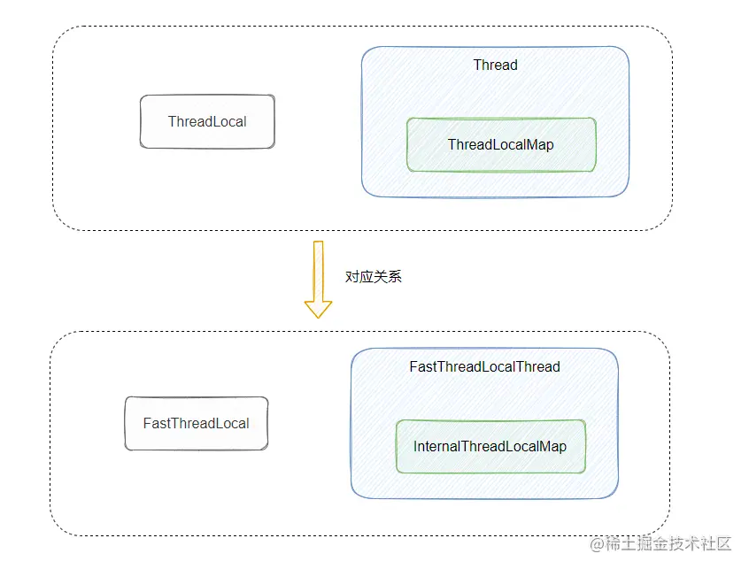
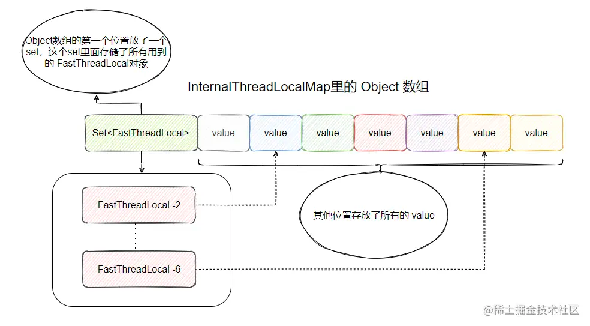

# ThreadLocal
## 原理
- 线程局部变量
- 只在当前线程拥有，绝对的线程安全
- 一个线程内可以存在多个 ThreadLocal 对象，所以其实是 ThreadLocal 内部维护了一个 Map

## ThreadLocalMap
- ThreadLocalMap 解决 hash 冲突的方式采用的是线性探测法，如果发生冲突会继续寻找下一个空的位置
- 内存泄漏
  - Entry为弱引用实际上 ThreadLocalMap 中使用的 key 为 ThreadLocal 的弱引用，弱引用的特点是，如果这个对象只存在弱引用，那么在下一次垃圾回收的时候必然会被清理掉。
  - 所以如果 ThreadLocal 没有被外部强引用的情况下，在垃圾回收的时候会被清理掉的，这样一来 ThreadLocalMap中使用这个 ThreadLocal 的 key 也会被清理掉。但是，value 是强引用，不会被清理，这样一来就会出现 key 为 null 的 value
  - 一定要remove

## 源码分析
```java
public class ThreadLocal<T> {
    private final int threadLocalHashCode = nextHashCode();
    private static AtomicInteger nextHashCode = new AtomicInteger();
    
    private static final int HASH_INCREMENT = 0x61c88647;
    
    private static int nextHashCode() {
      return nextHashCode.getAndAdd(HASH_INCREMENT);
    }
    
    static class ThreadLocalMap {
        static class Entry extends WeakReference<ThreadLocal<?>> {
          /** The value associated with this ThreadLocal. */
          Object value;
          //Entry 数组，然后 Entry 里面弱引用了 ThreadLocal 作为 Key。
          Entry(ThreadLocal<?> k, Object v) {
            super(k);
            value = v;
          }
        }
        private Entry[] table;
    }
}
```

### get
先获取当前线程，然后获取当前线程中的ThreadLocalMap，然后以当前的ThreadLocal为key，到ThreadLocalMap中获取value
```java
public T get() {
    //获取当前线程
    Thread t = Thread.currentThread();
    ThreadLocalMap map = getMap(t);
    if (map != null) {
        ThreadLocalMap.Entry e = map.getEntry(this);
        if (e != null) {
            @SuppressWarnings("unchecked")
            T result = (T)e.value;
            return result;
        }
    }
    return setInitialValue();
}

//获取当前线程中的ThreadLocalMap
ThreadLocalMap getMap(Thread t) {
    //ThreadLocalMap是存在于Thread类里的
    return t.threadLocals;
}
```
通过取模获取数组下标，如果没有冲突直接返回数据，否则同样出现遍历的情况
```java
private Entry getEntry(ThreadLocal<?> key) {
    //用key的hash值与数组长度 得到index
    int i = key.threadLocalHashCode & (table.length - 1);
    Entry e = table[i];
    //线性探测，如果值为空找下一个
    if (e != null && e.get() == key)
        return e;
    else
        return getEntryAfterMiss(key, i, e);
}
```
```java
private Entry getEntryAfterMiss(ThreadLocal<?> key, int i, Entry e) {
    Entry[] tab = table;
    int len = tab.length;

    while (e != null) {
        ThreadLocal<?> k = e.get();
        if (k == key)
            return e;
        if (k == null)
            //或主动清理无用的内存，但是如果清理的太多，自然慢了
            expungeStaleEntry(i);
        else
            i = nextIndex(i, len);
        e = tab[i];
    }
    return null;
}
```
### set
首先获取当前线程，然后获取当前线程中存储的threadLocals变量，此变量其实就是ThreadLocalMap，最后看此ThreadLocalMap是否为空，为空就创建一个新的Map，不为空则以当前的ThreadLocal为key，存储当前value
```java
public void set(T value) {
    Thread t = Thread.currentThread();
    ThreadLocalMap map = getMap(t);
    if (map != null)
        map.set(this, value);
    else
        createMap(t, value);
}
```
ThreadLocalMap内部使用一个数组来保存数据，类似HashMap；每个ThreadLocal在初始化的时候会分配一个threadLocalHashCode，然后和数组的长度进行取模操作，所以就会出现hash冲突的情况，在HashMap中处理冲突是使用数组+链表的方式，而在ThreadLocalMap中，可以看到直接使用nextIndex，进行遍历操作，明显性能更差
```java
private void set(ThreadLocal<?> key, Object value) {

    // We don't use a fast path as with get() because it is at
    // least as common to use set() to create new entries as
    // it is to replace existing ones, in which case, a fast
    // path would fail more often than not.

    Entry[] tab = table;
    int len = tab.length;
    int i = key.threadLocalHashCode & (len-1);

    for (Entry e = tab[i];
         e != null;
         e = tab[i = nextIndex(i, len)]) {
        ThreadLocal<?> k = e.get();

        if (k == key) {
            e.value = value;
            return;
        }

        if (k == null) {
            replaceStaleEntry(key, value, i);
            return;
        }
    }

    tab[i] = new Entry(key, value);
    int sz = ++size;
    if (!cleanSomeSlots(i, sz) && sz >= threshold)
        rehash();
}
```

```java
void createMap(Thread t, T firstValue) {
    t.threadLocals = new ThreadLocalMap(this, firstValue);
}
```

所以通过分析可以大致知道以下几个问题
1. ThreadLocalMap在解决冲突时，通过线性遍历法的方式，非常影响性能；
2. key是弱引用，如果忘记remove会造成内存泄露


## 使用场景
1. 线程间数据隔离，各线程的 ThreadLocal 互不影响
2. 方便同一个线程使用某一对象，避免不必要的参数传递
3. 全链路追踪中的 traceId 或者流程引擎中上下文的传递一般采用 ThreadLocal
4. Spring 事务管理器采用了 ThreadLocal
5. Spring MVC 的 RequestContextHolder 的实现使用了 ThreadLocal

### 每个线程维护了一个“序列号”
```java
public class SerialNum {
  // The next serial number to be assigned
  private static int nextSerialNum = 0;

  private static ThreadLocal serialNum = new ThreadLocal() {
    protected synchronized Object initialValue() {
      return new Integer(nextSerialNum++);
    }
  };

  public static int get() {
    return ((Integer) (serialNum.get())).intValue();
  }
}
```
### Session的管理
```java
private static final ThreadLocal threadSession = new ThreadLocal();  
  
public static Session getSession() throws InfrastructureException {  
    Session s = (Session) threadSession.get();  
    try {  
        if (s == null) {  
            s = getSessionFactory().openSession();  
            threadSession.set(s);  
        }  
    } catch (HibernateException ex) {  
        throw new InfrastructureException(ex);  
    }  
    return s;  
}  

```
### SimpleDateFormat
```java
import java.text.DateFormat;
import java.text.SimpleDateFormat;
 
public class DateUtils {
    public static final ThreadLocal<DateFormat> threadLocal = new ThreadLocal<DateFormat>(){
        @Override
        protected DateFormat initialValue() {
            return new SimpleDateFormat("yyyy-MM-dd");
        }
    };
}

DateUtils.df.get().format(new Date());
```

## 手动释放ThreadLocal遗留存储?你怎么去设计/实现？
包装其父类remove方法为静态方法，如果是spring项目， 可以借助于bean的声明周期， 在拦截器的afterCompletion阶段进行调用。

## 弱引用导致内存泄漏，那为什么key不设置为强引用

如果key设置为强引用， 当threadLocal实例释放后， threadLocal=null， 但是threadLocal会有强引用指向threadLocalMap，threadLocalMap.Entry又强引用threadLocal， 这样会导致threadLocal不能正常被GC回收。

弱引用虽然会引起内存泄漏， 但是也有set、get、remove方法操作对null key进行擦除的补救措施， 方案上略胜一筹。

## 线程执行结束后会不会自动清空Entry的value
事实上，当currentThread执行结束后， threadLocalMap变得不可达从而被回收，Entry等也就都被回收了，但这个环境就要求不对Thread进行复用，但是我们项目中经常会复用线程来提高性能， 所以currentThread一般不会处于终止状态。

## threadlocal如果不remove，出问题了怎么补救？
threadLocal和thread是绑定的，生命周期相同，那么，kill掉这个线程可以释放ThreadLocalMap

## FastThreadLocal

所以怎么改呢？

前面提到 ThreadLocal hash 冲突的线性探测法不好，还有 Entry 的弱引用可能会发生内存泄漏，这些都和 ThreadLocalMap 有关，所以需要搞个新的 map 来替换 ThreadLocalMap。

而这个 ThreadLocalMap 又是 Thread 里面的一个成员变量，这么一看 Thread 也得动一动，但是我们又无法修改 Thread 的代码，所以配套的还得弄个新的 Thread。

所以我们不仅得弄个新的 ThreadLocal、ThreadLocalMap 还得弄个配套的 Thread 来用上新的 ThreadLocalMap 。

所以如果想改进 ThreadLocal ，就需要动这三个类。

对应到 Netty 的实现就是 FastThreadLocal、InternalThreadLocalMap、FastThreadLocalThread



### 源码分析

FastThreadLocal
```java
public class FastThreadLocal<V> {
  //可以看到有个叫 variablesToRemoveIndex 的类成员，并且用 final 修饰的，所以等于每个 FastThreadLocal 都有个共同的不可变 int 值  
  private static final int variablesToRemoveIndex = InternalThreadLocalMap.nextVariableIndex();
  //在 FastThreadLocal 构造的时候就被赋值了，且也被 final 修饰，所以也不可变，这个 index 就是我上面说的给每个新 FastThreadLocal 都发个唯一的下标，这样每个 index 就都知道自己的位置了
  private final int index;

  public FastThreadLocal() {
    index = InternalThreadLocalMap.nextVariableIndex();
  }
}
```
在 InternalThreadLocalMap 也定义了一个静态原子类，每次调用 nextVariableIndex 就返回且递增，没有什么别的赋值操作，从这里也可以得知 variablesToRemoveIndex 的值为 0，因为它属于常量赋值，第一次调用时 nextIndex 的值为 0
```java
static final AtomicInteger nextIndex = new AtomicInteger();
public static int nextVariableIndex() {
    int index = nextIndex.getAndIncrement();
    if (index < 0) {
        nextIndex.decrementAndGet();
        throw new IllegalStateException("too many thread-local indexed variables");
    }
    return index;
}
```
上文ThreadLocalMap保存数据是使用entry数组，然后 Entry 里面弱引用了 ThreadLocal 作为 Key

而 InternalThreadLocalMap 有点不太一样

```java
public final class InternalThreadLocalMap extends UnpaddedInternalThreadLocalMap {
    //通过object数组来实现
    public static final Object UNSET = new Object();
    private InternalThreadLocalMap() {
      super(newIndexedVariableTable());
    }
    //默认生成32长度的数组，并且填充默认值
    private static Object[] newIndexedVariableTable() {
      Object[] array = new Object[32];
      Arrays.fill(array, UNSET);
      return array;
    }
}
```

可以看到， InternalThreadLocalMap 好像放弃了 map 的形式，没用定义 key 和 value，而是一个 Object 数组？

那它是如何通过 Object 来存储  FastThreadLocal 和对应的 value 的呢？我们从 FastThreadLocal#set 开始分析：

```java
public final void set(V value) {
    //如果塞入的不是默认值
    if (value != InternalThreadLocalMap.UNSET) {
      InternalThreadLocalMap threadLocalMap = InternalThreadLocalMap.get();
      if (setKnownNotUnset(threadLocalMap, value)) {
        registerCleaner(threadLocalMap);
      }
    } else {
      remove();
    }
}

private boolean setKnownNotUnset(InternalThreadLocalMap threadLocalMap, V value) {
    //index就是构造时被分配得到的下标
    if (threadLocalMap.setIndexedVariable(index, value)) {
        addToVariablesToRemove(threadLocalMap, this);
        return true;
    }
    return false;
}

public boolean setIndexedVariable(int index, Object value) {
    Object[] lookup = indexedVariables;
    if (index < lookup.length) {
        //直接通过索引找到位置，进行替换
        Object oldValue = lookup[index];
        lookup[index] = value;
        return oldValue == UNSET;
    } else {
        //如果index大于数组size，进行扩容
        expandIndexedVariableTableAndSet(index, value);
        return true;
    }
}
```
可以看到，根据传入构造 FastThreadLocal 生成的唯一 index 可以直接从 Object 数组里面找到下标并且进行替换，这样一来压根就不会产生冲突，逻辑很简单，完美。

那如果塞入的 value 不是 UNSET(默认值)，则执行 addToVariablesToRemove 方法，这个方法又有什么用呢？
```java
private static void addToVariablesToRemove(InternalThreadLocalMap threadLocalMap, FastThreadLocal<?> variable) {
    Object v = threadLocalMap.indexedVariable(variablesToRemoveIndex);
    Set<FastThreadLocal<?>> variablesToRemove;
    //如果v不是默认值，且v == null
    if (v == InternalThreadLocalMap.UNSET || v == null) {
        //构建一个set
        variablesToRemove = Collections.newSetFromMap(new IdentityHashMap<FastThreadLocal<?>, Boolean>());
        //将这个set放入object数组的第0个位置
        threadLocalMap.setIndexedVariable(variablesToRemoveIndex, variablesToRemove);
    } else {
        //反之将v转为set
        variablesToRemove = (Set<FastThreadLocal<?>>) v;
    }
    //将传入的FastThreadLocal存入set
    variablesToRemove.add(variable);
}
```
是不是看着有点奇怪？这是啥操作？别急，看我画个图来解释解释：


这就是 Object 数组的核心关系图了，第一个位置放了一个 set ，set 里面存储了所有使用的 FastThreadLocal 对象，然后数组后面的位置都放 value。

那为什么要放一个 set 保存所有使用的 FastThreadLocal 对象？

用于删除，你想想看，假设现在要清空线程里面的所有 FastThreadLocal ，那必然得有一个地方来存放这些 FastThreadLocal 对象，这样才能找到这些家伙，然后干掉。

所以刚好就把数组的第一个位置腾出来放一个 set 来保存这些 FastThreadLocal 对象，如果要删除全部 FastThreadLocal 对象的时候，只需要遍历这个 set ，得到 FastThreadLocal 的 index 找到数组对应的 位置将 value 置空，然后把 FastThreadLocal 从 set 中移除即可。

刚好 FastThreadLocal 里面实现了这个方法，我们来看下：
```java
public static void removeAll() {
        InternalThreadLocalMap threadLocalMap = InternalThreadLocalMap.getIfSet();
        if (threadLocalMap == null) {
            return;
        }

        try {
            //得到v,v就是那个set
            Object v = threadLocalMap.indexedVariable(variablesToRemoveIndex);
            if (v != null && v != InternalThreadLocalMap.UNSET) {
                @SuppressWarnings("unchecked")
                Set<FastThreadLocal<?>> variablesToRemove = (Set<FastThreadLocal<?>>) v;
                //将set转成数组遍历
                FastThreadLocal<?>[] variablesToRemoveArray =
                        variablesToRemove.toArray(new FastThreadLocal[0]);
                for (FastThreadLocal<?> tlv: variablesToRemoveArray) {
                    //分别调用remove
                    tlv.remove(threadLocalMap);
                }
            }
        } finally {
            //这个是将线程里的map置空，完成整体的移出
            InternalThreadLocalMap.remove();
        }
    }
```
内容可能有点多了，我们做下小结，理一理上面说的：

首先 InternalThreadLocalMap 没有采用 ThreadLocalMap k-v形式的存储方式，而是用 Object 数组来存储 FastThreadLocal 对象和其 value，具体是在第一个位置存放了一个包含所使用的 FastThreadLocal 对象的 set，然后后面存储所有的 value。

之所以需要个 set 是为了存储所有使用的 FastThreadLocal 对象，这样就能找到这些对象，便于后面的删除工作。

之所以数组其他位置可以直接存储 value ，是因为每个 FastThreadLocal 构造的时候已经被分配了一个唯一的下标，这个下标对应的就是 value 所处的下标。

下面再来看下get方法
```java
public final V get() {
        InternalThreadLocalMap threadLocalMap = InternalThreadLocalMap.get();
        Object v = threadLocalMap.indexedVariable(index);
        if (v != InternalThreadLocalMap.UNSET) {
            return (V) v;
        }

        V value = initialize(threadLocalMap);
        registerCleaner(threadLocalMap);
        return value;
}

public Object indexedVariable(int index) {
    //直接进行数组的下标的获取
    Object[] lookup = indexedVariables;
    return index < lookup.length? lookup[index] : UNSET;
}
```
看一下InternalThreadLocalMap.get()
```java
public static InternalThreadLocalMap get() {
      Thread thread = Thread.currentThread();
      if (thread instanceof FastThreadLocalThread) {
          return fastGet((FastThreadLocalThread) thread);
      } else {
          return slowGet();
      }
}
private static InternalThreadLocalMap fastGet(FastThreadLocalThread thread) {
      InternalThreadLocalMap threadLocalMap = thread.threadLocalMap();
      if (threadLocalMap == null) {
          thread.setThreadLocalMap(threadLocalMap = new InternalThreadLocalMap());
      }
      return threadLocalMap;
}

private static InternalThreadLocalMap slowGet() {
      ThreadLocal<InternalThreadLocalMap> slowThreadLocalMap = UnpaddedInternalThreadLocalMap.slowThreadLocalMap;
      InternalThreadLocalMap ret = slowThreadLocalMap.get();
      if (ret == null) {
          ret = new InternalThreadLocalMap();
          slowThreadLocalMap.set(ret);
      }
      return ret;
}
```

这里之所以分了 fastGet 和 slowGet 是为了做一个兼容，假设有个不熟悉的人，他用了 FastThreadLocal 但是没有配套使用 FastThreadLocalThread ，然后调用 FastThreadLocal#get 的时候去 Thread 里面找 InternalThreadLocalMap 那不就傻了吗，会报错的。

所以就再弄了个 slowThreadLocalMap ，它是个 ThreadLocal ，里面保存 InternalThreadLocalMap 来兼容一下这个情况。

从这里我们也能得知，FastThreadLocal 最好和 FastThreadLocalThread 配套使用，不然就隔了一层了。
```java
FastThreadLocal<String> threadLocal = new FastThreadLocal<String>();
Thread t = new FastThreadLocalThread(new Runnable() { //记得要 new FastThreadLocalThread
     public void run() {
	     threadLocal.get()；
	     ....
     }
 });
```
最后看下remove
```java
public final void remove() {
    remove(InternalThreadLocalMap.getIfSet());
}

public final void remove(InternalThreadLocalMap threadLocalMap) {
    if (threadLocalMap == null) {
        return;
    }

    Object v = threadLocalMap.removeIndexedVariable(index);
    //通过删除数组对应下标的value
    removeFromVariablesToRemove(threadLocalMap, this);

    if (v != InternalThreadLocalMap.UNSET) {
        try {
            onRemoval((V) v);
        } catch (Exception e) {
            PlatformDependent.throwException(e);
        }
    }
}

public Object removeIndexedVariable(int index) {
    Object[] lookup = indexedVariables;
    if (index < lookup.length) {
        Object v = lookup[index];
        //找到位置，覆盖成初始值
        lookup[index] = UNSET;
        return v;
    } else {
        return UNSET;
    }
}
//找到set，调用set的remove方法
private static void removeFromVariablesToRemove(
    InternalThreadLocalMap threadLocalMap, FastThreadLocal<?> variable) {

    Object v = threadLocalMap.indexedVariable(variablesToRemoveIndex);

    if (v == InternalThreadLocalMap.UNSET || v == null) {
        return;
    }

    @SuppressWarnings("unchecked")
    Set<FastThreadLocal<?>> variablesToRemove = (Set<FastThreadLocal<?>>) v;
    variablesToRemove.remove(variable);
}
```

很简单对吧，把数组里的 value 给覆盖了，然后再到  set  里把对应的 FastThreadLocal 对象给删了。

不过看到这里，可能有人会发出疑惑，内存泄漏相关的点呢？

其实吧，可以看到 FastThreadLocal 就没用弱引用，所以它把无用 FastThreadLocal 的清理就寄托到规范使用上，即没用了就主动调用 remove 方法。

你可以这样写
```java
@Override
public void run() {
    try {
        //...
    } finally {
        FastThreadLocal.removeAll();
    }
}
```

我们再来总结一下：

- FastThreadLocal 通过分配下标直接定位 value ，不会有 hash 冲突，效率较高。
- FastThreadLocal 采用空间换时间的方式来提高效率。
- FastThreadLocal 需要配套 FastThreadLocalThread 使用，不然还不如原生 ThreadLocal。
- FastThreadLocal 使用最好配套 FastThreadLocalRunnable，这样执行完任务后会主动调用 removeAll 来移除所有 FastThreadLocal ，防止内存泄漏。
- FastThreadLocal 的使用也是推荐用完之后，主动调用 remove。

# 参考文章：
- https://www.pdai.tech/md/java/thread/java-thread-x-threadlocal.html#java-%E5%BC%80%E5%8F%91%E6%89%8B%E5%86%8C%E4%B8%AD%E6%8E%A8%E8%8D%90%E7%9A%84-threadlocal
- https://www.cnblogs.com/javazhiyin/p/11834121.html
- https://juejin.cn/post/6844903966363353101
- https://juejin.cn/post/7005084861975232549?utm_source=gold_browser_extension
