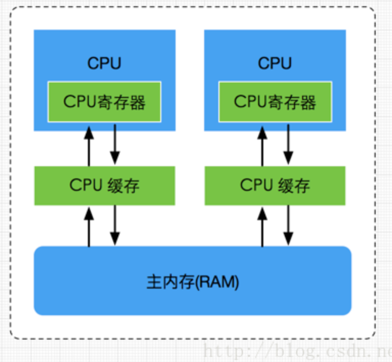
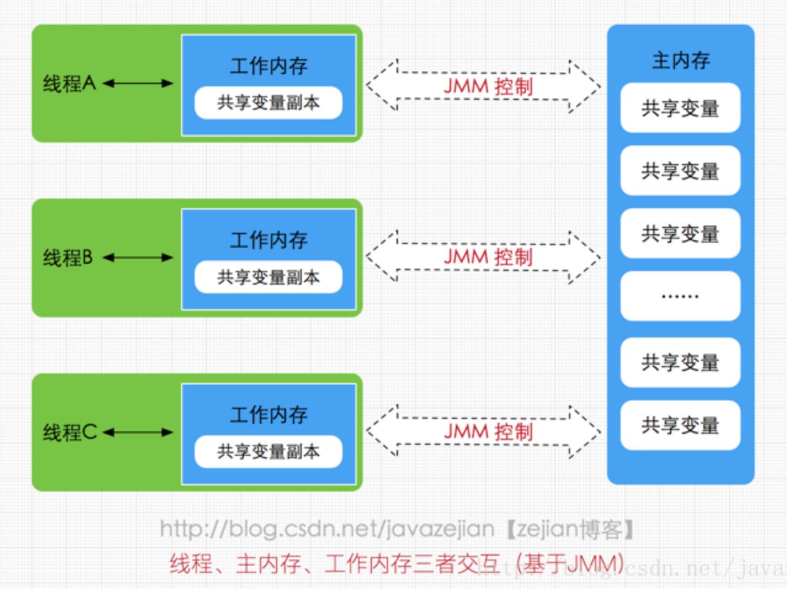

# 前提了解
### 机器内存模型

由于CPU和内存的速度差异（内存的处理速度远低于CPU）所以引入了CPU缓存，一般都有几级缓存，处理数据时先从CPU缓存读到寄存器，如果没有才会访问主内存以提高速度，CPU处理完也会先刷新值到寄存器->CPU缓存->主内存
#### 多核下的缓存一致性问题
- 问题
  - `核0`读取了一个字节，根据局部性原理，它相邻的字节同样被被读入`核0`的缓存，`核3`做了上面同样的工作，这样`核0`与`核3`的缓存拥有同样的数据，`核0`修改了那个字节，被修改后，那个字节被写回`核0`的缓存，但是该信息并没有写回`主存`，`核3`访问该字节，由于`核0`并未将数据写回`主存`，数据不同步。
- 方案
  - 锁总线
    - 前端总线(也叫CPU总线)是所有CPU与芯片组连接的主干道，负责CPU与外界所有部件的通信，包括高速缓存、内存、北桥，其控制总线向各个部件发送控制信号、通过地址总线发送地址信号指定其要访问的部件、通过数据总线双向传输
    - 总线上发出一个LOCK#信号，其他CPU不能操作该变量，相当于阻塞其他CPU
    - 开销大
  - 多核CPU多级缓存一致性协议MESI
    - MESI 是指4中状态的首字母。每个Cache line有4个状态
     
      | 状态  | 描述 | 监听任务 | 
      | ------------- | ------------- | ------------- |
      | M 修改 (Modified)  | 该Cache line有效，数据被修改了，和内存中的数据不一致，数据只存在于本Cache中。  | 缓存行必须时刻监听所有试图读该缓存行相对就主存的操作，这种操作必须在缓存将该缓存行写回主存并将状态变成S（共享）状态之前被延迟执行。|
      | E 独享、互斥 (Exclusive)  | 该Cache line有效，数据和内存中的数据一致，数据只存在于本Cache中。  | 缓存行也必须监听其它缓存读主存中该缓存行的操作，一旦有这种操作，该缓存行需要变成S（共享）状态。 |
      | S 共享 (Shared)  | 该Cache line有效，数据和内存中的数据一致，数据存在于很多Cache中。  | 缓存行也必须监听其它缓存使该缓存行无效或者独享该缓存行的请求，并将该缓存行变成无效（Invalid）。 |
      | I 无效 (Invalid)  | 该Cache line无效。  | 无 |
                                
### 指令重排
为了使得处理器内部的运算单元能尽量被充分利用，处理器可能会对输入代码进行乱序执行（Out-Of-Order Execution）优化

- 编译器优化的重排
  - 编译器在不改变单线程程序语义的前提下，可以重新安排语句的执行顺序
- 指令并行的重排
  - 现代处理器采用了指令级并行技术来将多条指令重叠执行。如果不存在数据依赖性(即后一个执行的语句无需依赖前面执行的语句的结果)，处理器可以改变语句对应的机器指令的执行顺序
- 内存系统的重排
  - 由于处理器使用缓存和读写缓存冲区，这使得加载(load)和存储(store)操作看上去可能是在乱序执行，因为三级缓存的存在，导致内存与缓存的数据同步存在时间差

### JMM
#### 模型

JMM是一种抽象概念并不存在，他描述是一种规则，JMM中所有的变量都储存在主内存中，主内存是共享区域，所有线程都可以访问，但是对变量的操作需要在工作内存中进行，所以需要线程把变量拷贝到工作内存操作完后写回主内存
#### 要保证的三个特性
- 原子性
  - 原子性指的是一个操作是不可中断的，即使是在多线程环境下，一个操作一旦开始就不会被其他线程影响
  - 比如对于一个静态变量int x，两条线程同时对他赋值，线程A赋值为1，而线程B赋值为2，不管线程如何运行，最终x的值要么是1，要么是2，线程A和线程B间的操作是没有干扰的，这就是原子性操作，不可被中断的特点
- 可见性
  - 可见性指的是当一个线程修改了某个共享变量的值，其他线程是否能够马上得知这个修改的值
- 有序性
  - 有序性是指对于单线程的执行代码，我们总是认为代码的执行是按顺序依次执行的，这样的理解并没有毛病，毕竟对于单线程而言确实如此，但对于多线程环境，则可能出现乱序现象，因为程序编译成机器码指令后可能会出现指令重排现象，重排后的指令与原指令的顺序未必一致
#### happens-before 原则
上述特性如何保证，可以使用synchronized和volatile来保证，但是编写可能会显得十分麻烦，所以有happens-before 原则来辅助
##### 内容
- 程序顺序原则，即在一个线程内必须保证语义串行性，也就是说按照代码顺序执行。
- 锁规则 解锁(unlock)操作必然发生在后续的同一个锁的加锁(lock)之前，也就是说，如果对于一个锁解锁后，再加锁，那么加锁的动作必须在解锁动作之后(同一个锁)。
- volatile规则 volatile变量的写，先发生于读，这保证了volatile变量的可见性，简单的理解就是，volatile变量在每次被线程访问时，都强迫从主内存中读该变量的值，而当该变量发生变化时，又会强迫将最新的值刷新到主内存，任何时刻，不同的线程总是能够看到该变量的最新值。
- 线程启动规则 线程的start()方法先于它的每一个动作，即如果线程A在执行线程B的start方法之前修改了共享变量的值，那么当线程B执行start方法时，线程A对共享变量的修改对线程B可见
- 传递性 A先于B ，B先于C 那么A必然先于C
- 线程终止规则 线程的所有操作先于线程的终结，Thread.join()方法的作用是等待当前执行的线程终止。假设在线程B终止之前，修改了共享变量，线程A从线程B的join方法成功返回后，线程B对共享变量的修改将对线程A可见。
- 线程中断规则 对线程 interrupt()方法的调用先行发生于被中断线程的代码检测到中断事件的发生，可以通过Thread.interrupted()方法检测线程是否中断。
- 对象终结规则 对象的构造函数执行，结束先于finalize()方法

# 作用
### 可见性
#### 如何实现
- 加上lock指令
  - lock指令确保在该声明期间，处理器可以独占任何共享内存
  - 而如何实现看CPU选择的是锁总线还是使用缓存一致性
### 禁止指令重排
#### 如何实现
**内存屏障** 在指令间插入一条Memory Barrier则会告诉编译器和CPU，不管什么指令都不能和这条Memory Barrier指令重排序，也就是说 通过插入内存屏障禁止在内存屏障前后的指令执行重排序优化

| 屏障类型 | 指令示例 | 说明|
| ------ | ------ | ------ |
| LoadLoad | Load1;LoadLoad;Load2 | 保证Load1的读取操作在Load2及后续读取操作之前执行 |
| StoreStore | Store1;StoreStore;Store2 | 在Store2及其后的写操作执行前，保证Store1的写操作已刷新到主内存 |
| LoadStore | Load1;LoadStore;Store2 | 在Store2及其后的写操作执行前，保证Load1的读操作已读取结束 |
| StoreLoad | Store1;StoreLoad;Load2 | 保证store1的写操作已刷新到主内存之后，load2及其后的读操作才能执行 |
                        
                            
                                