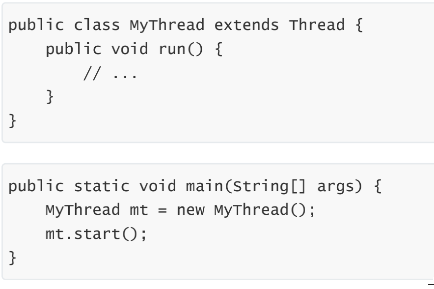
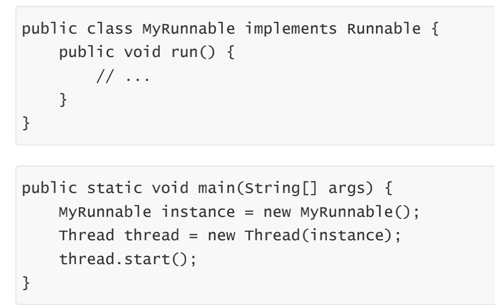
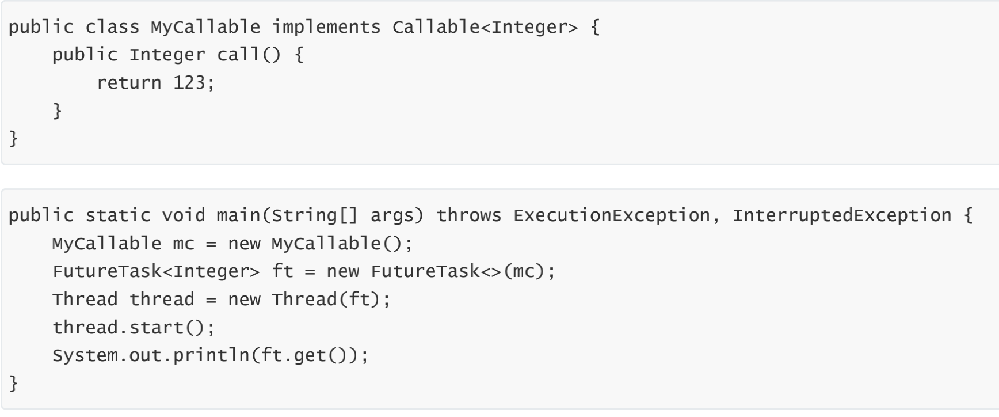
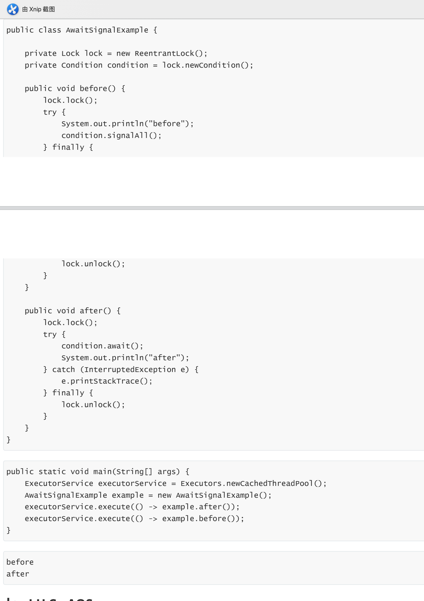

# 线程的生命状态

### 新建new
创建后尚未启动。
### 可运行runnable
- 可能正在运行，也可能正在等待 CPU 时间片。
- 包含了操作系统线程状态中的 Running 和 Ready。
### 阻塞blocked
等待获取一个排它锁，如果其线程释放了锁就会结束此状态。
### 等待waiting
等待其它线程显式地唤醒，否则不会被分配 CPU 时间片。
- 进入和退出方法
  - 没有设置 Timeout 参数的 Object.wait() 方法
    - Object.notify() / Object.notifyAll()
- 没有设置 Timeout 参数的 Thread.join() 方法
  - 被调用的线程执行完毕
- LockSupport.park() 方法
  - LockSupport.unpark(Thread)
### 期限等待timed waiting
无需等待其它线程显式地唤醒，在一定时间之后会被系统自动唤醒。
- 进入退出方法
  - Thread.sleep() 方法
    - 时间结束
  - 设置了 Timeout 参数的 Object.wait() 方法
    - 时间结束 / Object.notify() / Object.notifyAll()
  - 设置了 Timeout 参数的 Thread.join() 方法
    - 时间结束 / 被调用的线程执行完毕
  - LockSupport.parkNanos() 方法
    - LockSupport.unpark(Thread)
  - LockSupport.parkUntil() 方法
    - LockSupport.unpark(Thread)
### 死亡terminated
可以是线程结束任务之后自己结束，或者产生了异常而结束。
# 使用线程
### 继承Thread

同样也是需要实现 run() 方法，因为 Thread 类也实现了 Runable 接口。
### 实现Runnable接口

需要实现 run() 方法。通过 Thread 调用 start() 方法来启动线程。
### 实现Callable接口

与 Runnable 相比，Callable 可以有返回值，返回值通过 FutureTask 进行封装。
# 线程基本方法
### wait
- 调用 wait() 使得线程等待某个条件满足，线程在等待时会被挂起，当其他线程的运行使得这个条件满足时，其它线程
  - 它们都属于 Object 的一部分，而不属于 Thread
- 会调用 notify() 或者 notifyAll() 来唤醒挂起的线程。
- 只能用在同步方法或者同步控制块中使用，否则会在运行时抛出 IllegalMonitorStateException。
- 使用 wait() 挂起期间，线程会释放锁。这是因为，如果没有释放锁，那么其它线程就无法进入对象的同步方法或者同步控制块中，那么就无法执行 notify() 或者 notifyAll() 来唤醒挂起的线程，造成死锁。
### sleep
Thread.sleep(millisec) 方法会休眠当前正在执行的线程，millisec 单位为毫秒。
### yield
对静态方法 Thread.yield() 的调用声明了当前线程已经完成了生命周期中最重要的部分，可以切换给其它线程来执行。该方法只是对线程调度器的一个建议，而且也只是建议具有相同优先级的其它线程可以运行。
### interrupt
通过调用一个线程的 interrupt() 来中断该线程，如果该线程处于阻塞、限期等待或者无限期等待状态，那么就会抛出 InterruptedException，从而提前结束该线程。但是不能中断 I/O 阻塞和 synchronized 锁阻塞
### join
在线程中调用另一个线程的 join() 方法，会将当前线程挂起，而不是忙等待，直到目标线程结束。
### notify
调用 notify() 或者 notifyAll() 来唤醒挂起的线程
### await() signal() signalAll()
java.util.concurrent 类库中提供了 Condition 类来实现线程之间的协调，可以在 Condition 上调用 await() 方法使线程等待，其它线程调用 signal() 或 signalAll() 方法唤醒等待的线程。相比于 wait() 这种等待方式，await() 可以指定等待的条件，因此更加灵活

# Java里怎么保证多个线程的互斥性
### 什么是互斥
为了解决竞争条件带来的问题，我们可以对资源上锁。多个线程共同读写的资源称为共享资源，也叫 临界资源。涉及操作临界资源的代码区域称为 临界区（Critical Section）。同一时刻，只能有一个线程进入临界区。我们把这种情况称为互斥，即不允许多个线程同时对共享资源进行操作。
- 所以问答这个问题其实就是回答加锁，而Java的锁有lock、synchronized
### 衍生出来就是线程怎么同步的问题
#### 什么是同步
多个线程通过协作的方式，对相同资源进行操作，这种行为称为同步。同步实际上就是线程间的合作，只不过合作时需要操作同一资源。
- 著名的例子就是生产者-消费者问题
  - 现在有一个生产者和一个消费者，生产者负责生产资源，并放在盒子中，盒子的容量无限大；消费者从盒子中取走资源，如果盒子中没有资源，则需要等待。
     ```java
     //伪代码
     private static Box box = new Box();
     private static int boxSize = 0;
     
     public static void producer() {
         wait(box);
         //往 box 中放入资源，boxSize++
         signal(box);
     }
     
     public static void consumer() {
         while (boxSize == 0); //资源为零时阻塞
         wait(box);
         //从 box 中取出资源，boxSize--
         signal(box);
     }
     
     public static void main(String[] args) {
         parbegin(producer, consumer); //两个函数由两个线程并发执行
     }
     ```
