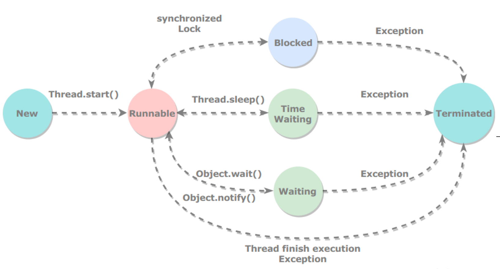
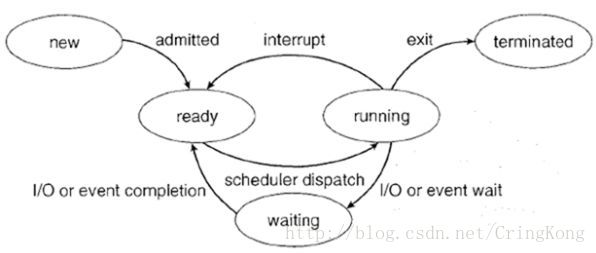

* [线程的生命状态](#线程的生命状态)
  * [新建new](#新建new)
  * [可运行runnable](#可运行runnable)
  * [阻塞blocked](#阻塞blocked)
  * [等待waiting](#等待waiting)
  * [期限等待timed waiting](#期限等待timed-waiting)
  * [死亡terminated](#死亡terminated)
* [使用线程](#使用线程)
  * [继承Thread](#继承thread)
  * [实现Runnable接口](#实现runnable接口)
  * [实现Callable接口](#实现callable接口)
  * [Callable如何返回值的](#callable如何返回值的)
  * [FutureTask](#futuretask)
* [线程基本方法](#线程基本方法)
  * [wait](#wait)
  * [sleep](#sleep)
  * [yield](#yield)
  * [interrupt](#interrupt)
  * [join](#join)
  * [notify](#notify)
  * [await() signal() signalAll()](#await-signal-signalall)
* [Java里怎么保证多个线程的互斥性](#java里怎么保证多个线程的互斥性)
  * [什么是互斥](#什么是互斥)
  * [衍生出来就是线程怎么同步的问题](#衍生出来就是线程怎么同步的问题)
  * [什么是同步](#什么是同步)
* [线程和进程的区别](#线程和进程的区别)
  * [进程](#进程)
  * [线程](#线程)
  * [总结](#总结)
* [怎么让多个线程有序执行](#怎么让多个线程有序执行)
  * [join方法](#join方法)
  * [线程池](#线程池)
  * [lock-condition](#lock-condition)
* [Java线程和操作系统的线程区别](#java线程和操作系统的线程区别)
  * [Java线程在操作系统上本质](#java线程在操作系统上本质)
  * [操作系统中的进程（线程）状态](#操作系统中的进程线程状态)
  * [操作系统中线程和Java线程状态的关系](#操作系统中线程和java线程状态的关系)
* [参考文章](#参考文章)

# 线程的生命状态

### 新建new
创建后尚未启动。
### 可运行runnable
- 可能正在运行，也可能正在等待 CPU 时间片。
- 包含了操作系统线程状态中的 Running 和 Ready。
### 阻塞blocked
等待获取一个排它锁，如果其线程释放了锁就会结束此状态。
### 等待waiting
等待其它线程显式地唤醒，否则不会被分配 CPU 时间片。
- 进入和退出方法
  - 没有设置 Timeout 参数的 Object.wait() 方法
    - Object.notify() / Object.notifyAll()
- 没有设置 Timeout 参数的 Thread.join() 方法
  - 被调用的线程执行完毕
- LockSupport.park() 方法
  - LockSupport.unpark(Thread)
### 期限等待timed waiting
无需等待其它线程显式地唤醒，在一定时间之后会被系统自动唤醒。
- 进入退出方法
  - Thread.sleep() 方法
    - 时间结束
  - 设置了 Timeout 参数的 Object.wait() 方法
    - 时间结束 / Object.notify() / Object.notifyAll()
  - 设置了 Timeout 参数的 Thread.join() 方法
    - 时间结束 / 被调用的线程执行完毕
  - LockSupport.parkNanos() 方法
    - LockSupport.unpark(Thread)
  - LockSupport.parkUntil() 方法
    - LockSupport.unpark(Thread)
### 死亡terminated
可以是线程结束任务之后自己结束，或者产生了异常而结束。
# 使用线程
### 继承Thread
```java
public class MyThread extends Thread {
  @Override
  public void run() {

  }

  public static void main(String[] args) {
    MyThread myThread = new MyThread();
    myThread.start();
  }
}
```
- 同样也是需要实现 run() 方法，因为 Thread 类也实现了 Runnable 接口。
- 适用于无返回值，不需要继承父类
### 实现Runnable接口
```java
public class MyRunnable implements Runnable{
    @Override
    public void run() {
        
    }

    public static void main(String[] args) {
        MyRunnable runnable = new MyRunnable();
        Thread thread = new Thread(runnable);
        thread.start();
    }
}
```
- 需要实现 run() 方法。通过 Thread 调用 start() 方法来启动线程。
- 适用于需要继承父类，无返回值
### 实现Callable接口
```java
public class MyCallable implements Callable<Integer> {
    @Override
    public Integer call() throws Exception {
        return 0;
    }

    public static void main(String[] args) throws ExecutionException, InterruptedException {
        MyCallable callable = new MyCallable();
        FutureTask<Integer> futureTask = new FutureTask<>(callable);
        Thread thread = new Thread(futureTask);
        thread.start();
        System.out.println(futureTask.get());
    }
}
```
- 与 Runnable 相比，Callable 可以有返回值，返回值通过 FutureTask 进行封装。
- 适用于需要继承父类，且有返回值
#### Callable如何返回值的
Callable实现返回的本质是FutureTask实现类 `public FutureTask(Callable<V> callable)`我们传入Callable构造FutureTask
##### FutureTask
- 变量
```java
//线程执行的状态变量
private volatile int state;
//新建
private static final int NEW          = 0;
//正在设置任务结果
private static final int COMPLETING   = 1;
//正常执行完成
private static final int NORMAL       = 2;
//异常
private static final int EXCEPTIONAL  = 3;
//取消
private static final int CANCELLED    = 4;
//中断中
private static final int INTERRUPTING = 5;
//中断
private static final int INTERRUPTED  = 6;

//传入的Callable对象
/** The underlying callable; nulled out after running */
private Callable<V> callable;
//返回值
/** The result to return or exception to throw from get() */
private Object outcome; // non-volatile, protected by state reads/writes
/** The thread running the callable; CASed during run() */
private volatile Thread runner;
/** Treiber stack of waiting threads */
private volatile WaitNode waiters;
```
- 构造器
```java
public FutureTask(Callable<V> callable) {
    if (callable == null)
        throw new NullPointerException();
    this.callable = callable;
    //初始时状态为0
    this.state = NEW;       // ensure visibility of callable
}
```
- run
```java
public void run() {
    if (state != NEW ||!UNSAFE.compareAndSwapObject(this, runnerOffset,null, Thread.currentThread()))
        return;
    try {
        Callable<V> c = callable;
        if (c != null && state == NEW) {
            V result;
            boolean ran;
            try {
                //调用执行返回值
                result = c.call();
                ran = true;
            } catch (Throwable ex) {
                result = null;
                ran = false;
                setException(ex);
            }
            //正常走set方法
            if (ran)
                set(result);
        }
    } finally {
        // runner must be non-null until state is settled to
        // prevent concurrent calls to run()
        runner = null;
        // state must be re-read after nulling runner to prevent
        // leaked interrupts
        int s = state;
        if (s >= INTERRUPTING)
            handlePossibleCancellationInterrupt(s);
    }
}
```
```java
protected void set(V v) {
    //CAS设置状态值为1 
    if (UNSAFE.compareAndSwapInt(this, stateOffset, NEW, COMPLETING)) {
        //赋值返回值给outcome
        outcome = v;
        //CAS设置状态值为2 
        UNSAFE.putOrderedInt(this, stateOffset, NORMAL); // final state
        //从队列移除，唤醒其他等待node
        finishCompletion();
    }
}
```
- get方法
```java
public V get() throws InterruptedException, ExecutionException {
    int s = state;
    //如果没有执行完则等待
    if (s <= COMPLETING)
        s = awaitDone(false, 0L);
    return report(s);
}
    
private int awaitDone(boolean timed, long nanos) throws InterruptedException {
    final long deadline = timed ? System.nanoTime() + nanos : 0L;
    WaitNode q = null;
    boolean queued = false;
    for (;;) {
        //线程中断了，移除等待节点
        if (Thread.interrupted()) {
            removeWaiter(q);
            throw new InterruptedException();
        }
        //获取任务状态
        int s = state;
        //是正在执行的其他状态，直接返回状态值
        if (s > COMPLETING) {
            if (q != null)
                q.thread = null;
            return s;
        }
        //如果任务正在设置执行结果，则挂起当前get线程
        else if (s == COMPLETING) // cannot time out yet
            Thread.yield();
        //如果任务还未执行，或正在执行的过程 将当前get线程封装为等待节点
        else if (q == null)
            q = new WaitNode();
        //如果q不为空，但是q没有加入到等待队列，则CAS将等待节点添加到waiters链表的头节点
        else if (!queued)
            queued = UNSAFE.compareAndSwapObject(this, waitersOffset,
                                                 q.next = waiters, q);
        //如果是期限等待，需要根据时间来移除等待节点或者挂起线程（有时间的挂起）
        else if (timed) {
            nanos = deadline - System.nanoTime();
            if (nanos <= 0L) {
                removeWaiter(q);
                return state;
            }
            LockSupport.parkNanos(this, nanos);
        }
        //否则挂起线程,这里unpark可以有下面2种情况
          //1.任务执行完毕了，在finishCompletion方法中会唤醒所有在等待的线程
          //2.等待的线程自身因为被中断等原因而被唤醒。
        else
            LockSupport.park(this);
    }
}

private V report(int s) throws ExecutionException {
    Object x = outcome;
    //正常结束返回结果
    if (s == NORMAL)
        return (V)x;
    if (s >= CANCELLED)
        throw new CancellationException();
    throw new ExecutionException((Throwable)x);
}
```
# 线程基本方法
### wait
- 调用 wait() 使得线程等待某个条件满足，线程在等待时会被挂起，当其他线程的运行使得这个条件满足时，其它线程会调用 notify() 或者 notifyAll() 来唤醒挂起的线程。
  - 它们都属于 Object 的一部分，而不属于 Thread
- 只能用在同步方法或者同步控制块中使用，否则会在运行时抛出 IllegalMonitorStateException。
- 使用 wait() 挂起期间，线程会释放锁。这是因为，如果没有释放锁，那么其它线程就无法进入对象的同步方法或者同步控制块中，那么就无法执行 notify() 或者 notifyAll() 来唤醒挂起的线程，造成死锁。
### sleep
Thread.sleep(millisec) 方法会休眠当前正在执行的线程，millisec 单位为毫秒。
### yield
对静态方法 Thread.yield() 的调用声明了当前线程已经完成了生命周期中最重要的部分，可以切换给其它线程来执行。该方法只是对线程调度器的一个建议，而且也只是建议具有相同优先级的其它线程可以运行。
### interrupt
通过调用一个线程的 interrupt() 来中断该线程，如果该线程处于阻塞、限期等待或者无限期等待状态，那么就会抛出 InterruptedException，从而提前结束该线程。但是不能中断 I/O 阻塞和 synchronized 锁阻塞
### join
在线程中调用另一个线程的 join() 方法，会将当前线程挂起，而不是忙等待，直到目标线程结束。
### notify
调用 notify() 或者 notifyAll() 来唤醒挂起的线程
### await() signal() signalAll()
java.util.concurrent 类库中提供了 Condition 类来实现线程之间的协调，可以在 Condition 上调用 await() 方法使线程等待，其它线程调用 signal() 或 signalAll() 方法唤醒等待的线程。相比于 wait() 这种等待方式，await() 可以指定等待的条件，因此更加灵活
```java
public class AwaitSignalExample {
  private final Lock lock = new ReentrantLock();
  private final Condition condition = lock.newCondition();

  public void before(){
    lock.lock();
    try {
      System.out.println("before");
      condition.signalAll();
    }finally {
      lock.unlock();
    }
  }

  public void after(){
    lock.lock();
    try {
      condition.await();
      System.out.println("after");
    }catch (InterruptedException e){
      e.printStackTrace();
    }finally {
      lock.unlock();
    }
  }

  public static void main(String[] args) {
    ExecutorService executorService = Executors.newCachedThreadPool();
    AwaitSignalExample example = new AwaitSignalExample();
    executorService.execute(example::after);
    executorService.execute(example::before);
  }
}
```
```text
before
after
```
# Java里怎么保证多个线程的互斥性
### 什么是互斥
为了解决竞争条件带来的问题，我们可以对资源上锁。多个线程共同读写的资源称为共享资源，也叫 临界资源。涉及操作临界资源的代码区域称为 临界区（Critical Section）。同一时刻，只能有一个线程进入临界区。我们把这种情况称为互斥，即不允许多个线程同时对共享资源进行操作。
- 所以问答这个问题其实就是回答加锁，而Java的锁有lock、synchronized
### 衍生出来就是线程怎么同步的问题
#### 什么是同步
多个线程通过协作的方式，对相同资源进行操作，这种行为称为同步。同步实际上就是线程间的合作，只不过合作时需要操作同一资源。
- 著名的例子就是生产者-消费者问题
  - 现在有一个生产者和一个消费者，生产者负责生产资源，并放在盒子中，盒子的容量无限大；消费者从盒子中取走资源，如果盒子中没有资源，则需要等待。
     ```java
     //伪代码
     private static Box box = new Box();
     private static int boxSize = 0;
     
     public static void producer() {
         wait(box);
         //往 box 中放入资源，boxSize++
         signal(box);
     }
     
     public static void consumer() {
         while (boxSize == 0); //资源为零时阻塞
         wait(box);
         //从 box 中取出资源，boxSize--
         signal(box);
     }
     
     public static void main(String[] args) {
         parbegin(producer, consumer); //两个函数由两个线程并发执行
     }
     ```
# 线程和进程的区别
## 进程
比如Linux上我们输入一个top命令，展示出来的的就是一个个进程，比如我们运行的一个鉴权服务就是一个进程
## 线程
进程中的一个执行任务（控制单元），负责当前进程中程序的执行。一个进程至少有一个线程，一个进程可以运行多个线程，多个线程可共享数据。
## 总结
- `根本区别：`进程是操作系统资源分配的基本单位，而线程是处理器任务调度和执行的基本单位
- `资源开销：`每个进程都有独立的代码和数据空间（程序上下文），程序之间的切换会有较大的开销；线程可以看做轻量级的进程，同一类线程共享代码和数据空间，每个线程都有自己独立的运行栈和程序计数器（PC），线程之间切换的开销小。
- `包含关系：`如果一个进程内有多个线程，则执行过程不是一条线的，而是多条线（线程）共同完成的；线程是进程的一部分，所以线程也被称为轻权进程或者轻量级进程。
- `内存分配：`同一进程的线程共享本进程的地址空间和资源，而进程之间的地址空间和资源是相互独立的
- `影响关系：`一个进程崩溃后，在保护模式下不会对其他进程产生影响，但是一个线程崩溃整个进程都死掉。所以多进程要比多线程健壮。
- `执行过程：`每个独立的进程有程序运行的入口、顺序执行序列和程序出口。但是线程不能独立执行，必须依存在应用程序中，由应用程序提供多个线程执行控制，两者均可并发执行

# 怎么让多个线程有序执行
## join方法
```java
public class ThreadTest1 {
    public static void main(String[] args) {
        Thread t1 = new Thread(new Work(null));
        Thread t2 = new Thread(new Work(t1));
        Thread t3 = new Thread(new Work(t2));
        t1.setName("第一个");
        t2.setName("第二个");
        t3.setName("第三个");
        t1.start();
        t2.start();
        t3.start();
    }
    static class Work implements Runnable {
        private Thread thread;
        public Work(Thread thread) {
            this.thread = thread;
        }
        @Override
        public void run() {
            if (thread != null) {
                try {
                    thread.join();
                } catch (InterruptedException e) {
                    e.printStackTrace();
                }
                execute();
            } else {
                execute();
            }
        }
        private void execute() {
            System.out.println("线程" + Thread.currentThread().getName() + "执行");
        }
    }
}

```
## 线程池
```java
public class ThreadTest2 {
    private static ExecutorService es = Executors.newFixedThreadPool(1);
    public static void main(String[] args) {
        Work t1 = new Work("t1");
        Work t2 = new Work("t2");
        Work t3 = new Work("t3");
        es.submit(t1);
        es.submit(t2);
        es.submit(t3);
    }
    static class Work implements Runnable {
        private String key;
        public Work(String key) {
            this.key = key;
        }
        @Override
        public void run() {
            execute();
        }
        private void execute() {
            try {
                TimeUnit.MILLISECONDS.sleep(500);
            } catch (InterruptedException e) {
                e.printStackTrace();
            }
            System.out.println("线程：" + Thread.currentThread().getName() + "执行" + key);
        }
    }
}
```
## lock-condition
```java
public class Test {
    Lock lock = new ReentrantLock();
    Condition condition1 = lock.newCondition();
    Condition condition2 = lock.newCondition();
    Condition condition3 = lock.newCondition();

    private int flag = 1;

    public void printA() throws InterruptedException {
        lock.lock();
        try {
            while (flag != 1) {
                condition1.await();
            }
            System.out.println("A working");
            flag = 2;
            condition2.signal();
        } finally {
            lock.unlock();
        }

    }

    public void printB() throws InterruptedException {
        lock.lock();
        try {
            while (flag != 2) {
                condition2.await();
            }
            System.out.println("B working");
            flag = 3;
            condition3.signal();
        } finally {
            lock.unlock();
        }

    }

    public void printC() throws InterruptedException {
        lock.lock();
        try {
            while (flag != 3) {
                condition3.await();
            }
            System.out.println("C working");
            flag = 1;
            condition1.signal();
        } finally {
            lock.unlock();
        }

    }

    public static void main(String[] args) {
        Test test = new Test();

        new Thread(() -> {
            try {
                test.printA();
            } catch (InterruptedException e) {
                e.printStackTrace();
            }
        }).start();

        new Thread(() -> {
            try {
                test.printB();
            } catch (InterruptedException e) {
                e.printStackTrace();
            }
        }).start();

        new Thread(() -> {
            try {
                test.printC();
            } catch (InterruptedException e) {
                e.printStackTrace();
            }
        }).start();
    }
}
```
# Java线程和操作系统的线程区别
## Java线程在操作系统上本质
JDK1.2之前，**程序员们为JVM开发了自己的一个线程调度内核，而到操作系统层面就是用户空间内的线程实现**。而到了JDK1.2及以后，JVM选择了更加稳健且方便使用的操作系统原生的线程模型，通过系统调用，将程序的线程交给了操作系统内核进行调度

也就是说，**现在的Java中线程的本质，其实就是操作系统中的线程**，Linux下是基于pthread库实现的轻量级进程，Windows下是原生的系统Win32 API提供系统调用从而实现多线程

## 操作系统中的进程（线程）状态


这里需要着重解释一点，在现在的操作系统中，因为线程依旧被视为轻量级进程，所以操作系统中线程的状态实际上和进程状态是一致的模型。
## 操作系统中线程和Java线程状态的关系
从实际意义上来讲，操作系统中的线程除去new和terminated状态，一个线程真实存在的状态，只有：

- ready：表示线程已经被创建，正在等待系统调度分配CPU使用权。
- running：表示线程获得了CPU使用权，正在进行运算
- waiting：表示线程等待（或者说挂起），让出CPU资源给其他线程使用

为什么除去new和terminated状态？是因为这两种状态实际上并不存在于线程运行中，所以也没什么实际讨论的意义。

对于Java中的线程状态：

无论是Timed Waiting ，Waiting还是Blocked，对应的都是操作系统线程的**waiting（等待**）状态。 而Runnable状态，则对应了操作系统中的ready和running状态。
# 参考文章
- https://blog.csdn.net/CringKong/article/details/79994511