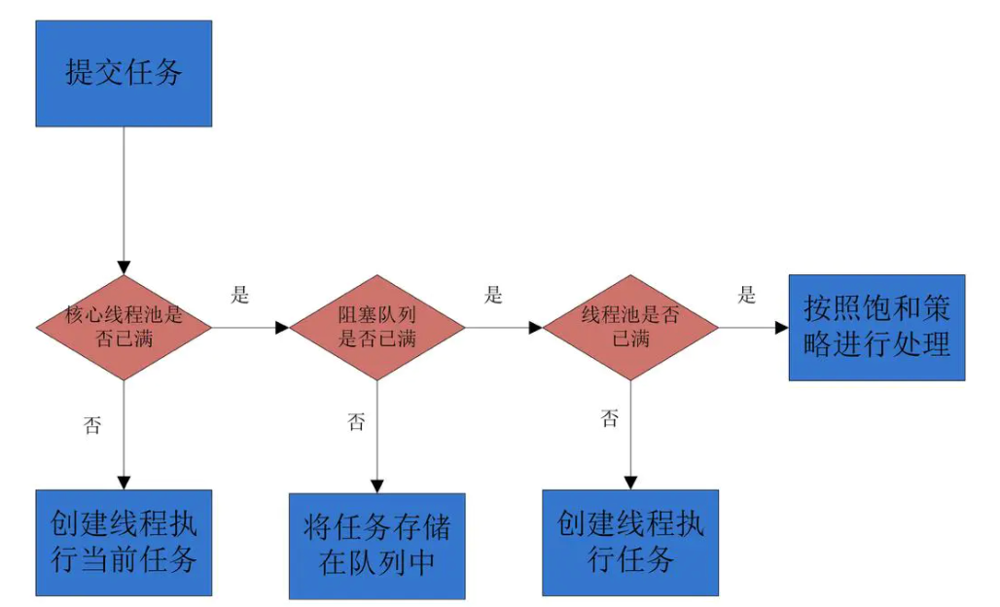
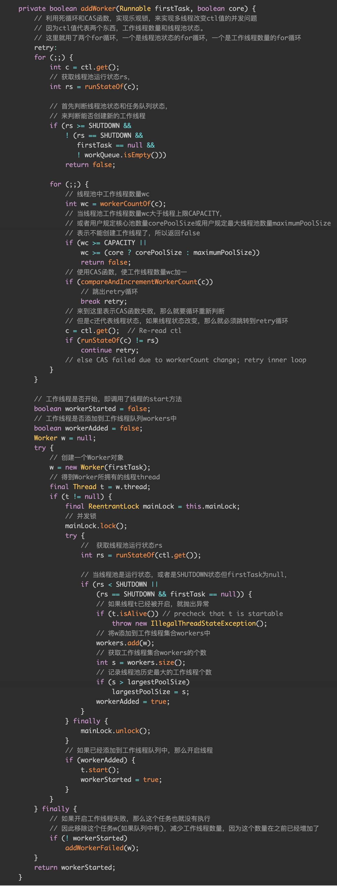

* [创建线程池的方式](#创建线程池的方式)
  * [1、Executors](#1executors)
    * [newCachedThreadPool](#newcachedthreadpool)
    * [newFixedThreadPool](#newfixedthreadpool)
    * [newScheduledThreadPool](#newscheduledthreadpool)
    * [newSingleThreadExecutor](#newsinglethreadexecutor)
  * [2、ThreadPoolExecutor](#2threadpoolexecutor)
* [ThreadPoolExecutor](#threadpoolexecutor)
  * [参数含义](#参数含义)
    * [1、corePoolSize](#1corepoolsize)
    * [2、maximumPoolSize](#2maximumpoolsize)
    * [3、keepAliveTime](#3keepalivetime)
    * [4、unit](#4unit)
    * [5、workQueue](#5workqueue)
    * [6、threadFactory](#6threadfactory)
    * [7、handler](#7handler)
* [ThreadPoolExecutor原理流程](#threadpoolexecutor原理流程)
  * [private final AtomicInteger ctl = new AtomicInteger(ctlOf(RUNNING, 0));](#private-final-atomicinteger-ctl--new-atomicintegerctlofrunning-0)
  * [addWorker方法](#addworker方法)
* [如何释放线程](#如何释放线程)
* [如何设置线程数](#如何设置线程数)
  * [没有固定的计算方式，需要以业务来衡量](#没有固定的计算方式需要以业务来衡量)
  * [市面上说的其实都不太准确](#市面上说的其实都不太准确)
  * [（（线程等待时间+线程CPU时间）/线程CPU时间 ）* CPU数目](#线程等待时间线程cpu时间线程cpu时间--cpu数目)
  * [线程池被创建后里面有线程吗？如果没有的话，你知道有什么方法对线程池进行预热吗？](#线程池被创建后里面有线程吗如果没有的话你知道有什么方法对线程池进行预热吗)
  * [线上机器突然重启/宕机，线程池里的阻塞队列中任务怎么办？](#线上机器突然重启宕机线程池里的阻塞队列中任务怎么办)
  * [运行时能修改线程数么？](#运行时能修改线程数么)
* [参考文章](#参考文章)

# 创建线程池的方式
### 1、Executors
#### newCachedThreadPool
创建一个可缓存的线程池，若线程数超过处理所需，缓存一段时间后会回收，若线程数不够，则新建线程
`Executors.newCachedThreadPool();`
#### newFixedThreadPool
创建一个固定大小的线程池，可控制并发的线程数，超出的线程会在队列中等待
`Executors.newFixedThreadPool(3)`
#### newScheduledThreadPool
创建一个周期性的线程池，支持定时及周期性执行任务
`Executors.newScheduledThreadPool(3);`
#### newSingleThreadExecutor
创建一个单线程的线程池，可保证所有任务按照指定顺序(FIFO, LIFO, 优先级)执行
`Executors.newSingleThreadExecutor();`
### 2、ThreadPoolExecutor
# ThreadPoolExecutor
## 参数含义
#### 1、corePoolSize
核心线程数，线程池中始终存活的线程数
#### 2、maximumPoolSize
最大线程数，线程池中允许的最大线程数
#### 3、keepAliveTime
存活时间，线程没有任务执行时最多保持多久时间会终止
#### 4、unit
单位，参数keepAliveTime的时间单位
#### 5、workQueue
一个阻塞队列，用来存储等待执行的任务
- `ArrayBlockingQueue`	一个由数组结构组成的有界阻塞队列。
- `LinkedBlockingQueue`	一个由链表结构组成的有界阻塞队列。
- `SynchronousQueue`	一个不存储元素的阻塞队列，即直接提交给线程不保持它们。
- `PriorityBlockingQueue`	一个支持优先级排序的无界阻塞队列。
- `DelayQueue`	一个使用优先级队列实现的无界阻塞队列，只有在延迟期满时才能从中提取元素。
- `LinkedTransferQueue`	一个由链表结构组成的无界阻塞队列。与SynchronousQueue类似，还含有非阻塞方法。
- `LinkedBlockingDeque`	一个由链表结构组成的双向阻塞队列。
#### 6、threadFactory
线程工厂，主要用来创建线程，默及正常优先级、非守护线程
#### 7、handler
拒绝策略，拒绝处理任务时的策略，4种可选，默认为AbortPolicy
- `AbortPolicy`	`中止策略` 拒绝并抛出异常。
  - 默认
- `CallerRunsPolicy`	`调用者运行策略` 当触发拒绝策略时，只要线程池没有关闭，就由提交任务的当前线程处理。 
  - 一般在不允许失败的、对性能要求不高、并发量较小的场景下使用，因为线程池一般情况下不会关闭，也就是提交的任务一定会被运行，但是由于是调用者线程自己执行的，当多次提交任务时，就会阻塞后续任务执行，性能和效率自然就慢了
- `DiscardOldestPolicy`	`弃老策略` 抛弃队列头部（最旧）的一个任务，并执行当前任务。
  - 这个策略还是会丢弃任务，丢弃时也是毫无声息，但是特点是丢弃的是老的未执行的任务，而且是待执行优先级较高的任务。基于这个特性，我能想到的场景就是，发布消息，和修改消息，当消息发布出去后，还未执行，此时更新的消息又来了，这个时候未执行的消息的版本比现在提交的消息版本要低就可以被丢弃了。因为队列中还有可能存在消息版本更低的消息会排队执行，所以在真正处理消息的时候一定要做好消息的版本比较。
- `DiscardPolicy`	`丢弃策略`。 如果你提交的任务无关紧要，你就可以使用它 。因为它就是个空实现，会悄无声息的吞噬你的的任务。所以这个策略基本上不用了
# ThreadPoolExecutor原理流程

- 如果当前运行的线程少于 corePoolSize，则会创建新的线程来执行新的任务；
- 如果运行的线程个数等于或者大于 corePoolSize，则会将提交的任务存放到阻塞队列 workQueue 中；
- 如果当前 workQueue 队列已满的话，则会创建新的线程来执行任务；
- 如果线程个数已经超过了 maximumPoolSize，则会使用饱和策略 RejectedExecutionHandler 来进行处理
### private final AtomicInteger ctl = new AtomicInteger(ctlOf(RUNNING, 0));
记录线程池中Worker工作线程数量和线程池的状态 int类型是32位，它的高3位，表示线程池的状态，低29位表示Worker的数量
### addWorker方法
			
首先for循环判断线程池状态，非SHUTDOWN才可以添加线程，不能大于最大线程数，CAS增加线程数量，添加后传递runnable对象新建worker，加锁判断线程池状态，添加worker到hashset workers集合里，添加成功后启动线程start方法
# 如何释放线程
Worker里定义了释放线程的方法，线程池封装线程为Worker，在Worker里定义了run方法
```java
public void run() {
    runWorker(this);
}
```
```java
final void runWorker(Worker w) {
    Thread wt = Thread.currentThread();
    Runnable task = w.firstTask;
    w.firstTask = null;
    w.unlock(); // allow interrupts
    boolean completedAbruptly = true;
    try {
        while (task != null || (task = getTask()) != null) {
            w.lock();
            // If pool is stopping, ensure thread is interrupted;
            // if not, ensure thread is not interrupted.  This
            // requires a recheck in second case to deal with
            // shutdownNow race while clearing interrupt
            if ((runStateAtLeast(ctl.get(), STOP) ||
                 (Thread.interrupted() &&
                  runStateAtLeast(ctl.get(), STOP))) &&
                !wt.isInterrupted())
                wt.interrupt();
            try {
                beforeExecute(wt, task);
                Throwable thrown = null;
                try {
                    task.run();
                } catch (RuntimeException x) {
                    thrown = x; throw x;
                } catch (Error x) {
                    thrown = x; throw x;
                } catch (Throwable x) {
                    thrown = x; throw new Error(x);
                } finally {
                    afterExecute(task, thrown);
                }
            } finally {
                task = null;
                w.completedTasks++;
                w.unlock();
            }
        }
        completedAbruptly = false;
    } finally {
        processWorkerExit(w, completedAbruptly);
    }
}
```
一旦跳出while循环，即进入到processWorkExit方法，这就是回收Worker,在这里先看下getTask()方法，该方法可以避免移除核心线程
```java
private Runnable getTask() {
    boolean timedOut = false; // Did the last poll() time out?

    for (;;) {
        int c = ctl.get();
        int rs = runStateOf(c);

        // 判断线程池的运行状态
        // 如果线程池已经开始关闭或者已经处于关闭，任务队列为空时 worker 数 -1
        if (rs >= SHUTDOWN && (rs >= STOP || workQueue.isEmpty())) {
            // 循环 + CAS
            decrementWorkerCount();
            return null;
        }

        int wc = workerCountOf(c);

        // 判断是否需要超时限制
        boolean timed = allowCoreThreadTimeOut || wc > corePoolSize;

        // 当线程获取任务超时，修改 worker 数
        if ((wc > maximumPoolSize || (timed && timedOut))
            && (wc > 1 || workQueue.isEmpty())) {
            // CAS 修改
            if (compareAndDecrementWorkerCount(c))
                return null;
            // CAS 修改失败后循环重试
            continue;
        }

        try {
            // 超时时间为设置的 keepAliveTime 值
            Runnable r = timed ?
                workQueue.poll(keepAliveTime, TimeUnit.NANOSECONDS) :
                workQueue.take();
            if (r != null)
                return r;
            timedOut = true;
        } catch (InterruptedException retry) {
            timedOut = false;
        }
    }
}

```
```java
private void processWorkerExit(Worker w, boolean completedAbruptly) {
    // 如果是意外退出任务处理流程 将 worker 数 -1  
  if (completedAbruptly) // If abrupt, then workerCount wasn't adjusted
      decrementWorkerCount();

  final ReentrantLock mainLock = this.mainLock;
  mainLock.lock();
  try {
      // 加锁实现完成任务数的统计及队列移除
      completedTaskCount += w.completedTasks;
      //从workers-hashset 里remove工作线程
      workers.remove(w);
  } finally {
      mainLock.unlock();
  }

  tryTerminate();

  int c = ctl.get();
  if (runStateLessThan(c, STOP)) {
      if (!completedAbruptly) {
          // 如果线程池还处于运行中，并且线程是正常退出 则判断是否需要补充新 worker
          int min = allowCoreThreadTimeOut ? 0 : corePoolSize;
          if (min == 0 && ! workQueue.isEmpty())
              min = 1;
          if (workerCountOf(c) >= min)
              return; // replacement not needed
      }
      addWorker(null, false);
  }
}
```
# 如何设置线程数
#### 没有固定的计算方式，需要以业务来衡量
#### 市面上说的其实都不太准确
- CPU 密集型任务  Ncpu+1
- IO 密集型任务   2*Ncpu
#### （（线程等待时间+线程CPU时间）/线程CPU时间 ）* CPU数目
线程等待时间所占比例越高，需要越多线程。线程CPU时间所占比例越高，需要越少线程。
## 线程池被创建后里面有线程吗？如果没有的话，你知道有什么方法对线程池进行预热吗？
线程池被创建后如果没有任务过来，里面是不会有线程的。如果需要预热的话可以调用下面的两个方法
- 全部启动： `prestartAllCoreThreads()`
- 仅启动一个 `prestartCoreThread()`

## 线上机器突然重启/宕机，线程池里的阻塞队列中任务怎么办？
- 这种情况内存中的任务肯定会丢失
- 关键在于保存任务的执行状态：未提交、已提交、已完成，将状态持久化到db中，服务恢复后通过判断任务的状态来继续执行任务

## 运行时能修改线程数么？
`setCorePoolSize`

JDK允许线程池使用方通过ThreadPoolExecutor的实例来动态设置线程池的核心策略，以setCorePoolSize为方法例，在运行期线程池使用方调用此方法设置corePoolSize之后，线程池会直接覆盖原来的corePoolSize值，并且基于当前值和原始值的比较结果采取不同的处理策略。对于当前值小于当前工作线程数的情况，说明有多余的worker线程，此时会向当前idle的worker线程发起中断请求以实现回收，多余的worker在下次idel的时候也会被回收；对于当前值大于原始值且当前队列中有待执行任务，则线程池会创建新的worker线程来执行队列任务

# 参考文章

- https://blog.csdn.net/ksws01/article/details/110845897