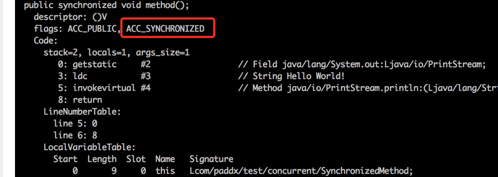
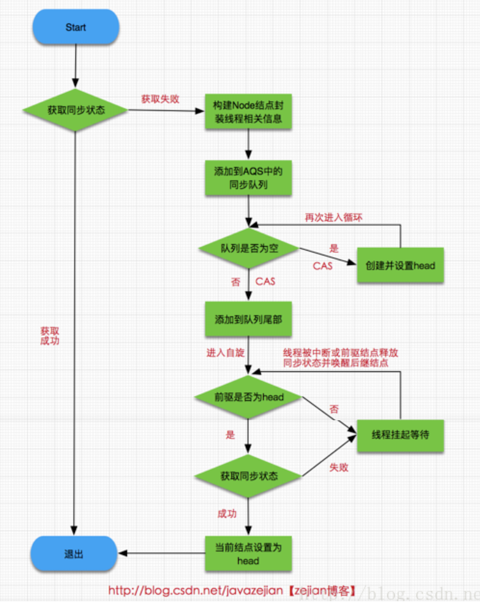
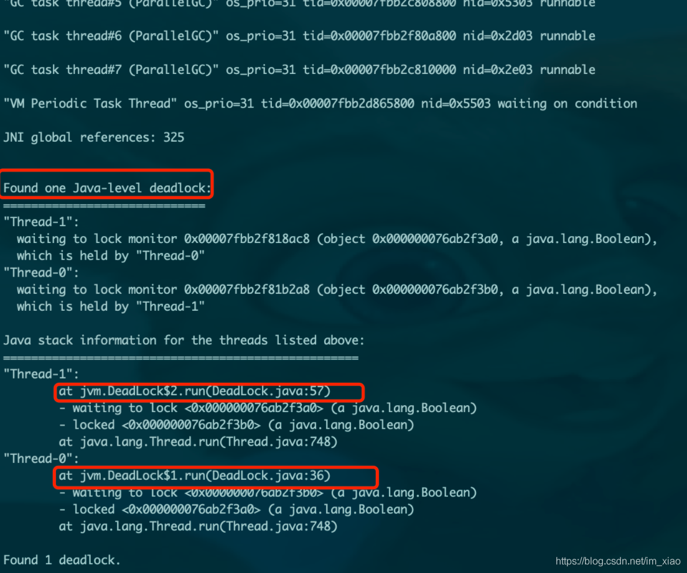

* [Synchronized](#synchronized)
  * [原理](#原理)
  * [Synchronized的语义底层是通过一个monitor的对象来完成](#synchronized的语义底层是通过一个monitor的对象来完成)
  * [同步一个代码块](#同步一个代码块)
  * [同步一个方法](#同步一个方法)
  * [同步一个类](#同步一个类)
  * [同步一个静态方法](#同步一个静态方法)
  * [可重入锁](#可重入锁)
* [Lock](#lock)
  * [ReentrantLock](#reentrantlock)
    * [可重入锁](#可重入锁-1)
    * [组件](#组件)
      * [Sync](#sync)
      * [NonfairSync](#nonfairsync)
        * [默认是非公平锁](#默认是非公平锁)
        * [lock](#lock-1)
        * [unlock](#unlock)
      * [FairSync](#fairsync)
* [锁优化](#锁优化)
  * [自旋锁](#自旋锁)
  * [循环](#循环)
  * [在 JDK 1.6 中引入了自适应的自旋锁。自适应意味着自旋的次数不再固定了，而是由前一次在同一个锁上的自旋次数及锁的拥有者的状态来决定。](#在-jdk-16-中引入了自适应的自旋锁自适应意味着自旋的次数不再固定了而是由前一次在同一个锁上的自旋次数及锁的拥有者的状态来决定)
  * [锁消除](#锁消除)
  * [锁粗化](#锁粗化)
  * [锁升级](#锁升级)
* [死锁](#死锁)
  * [什么是死锁](#什么是死锁)
  * [产生死锁的原因](#产生死锁的原因)
  * [死锁的必要条件](#死锁的必要条件)
  * [死锁代码举例](#死锁代码举例)
  * [如何预防线程死锁](#如何预防线程死锁)
  * [预防](#预防)
  * [避免](#避免)
  * [怎么判断JVM里是否出现死锁](#怎么判断jvm里是否出现死锁)
* [synchronized锁和lock锁的区别](#synchronized锁和lock锁的区别)
* [参考文章](#参考文章)


# Synchronized
### 原理
### Synchronized的语义底层是通过一个monitor的对象来完成
### 同步一个代码块
- 它只作用于同一个对象，如果调用两个对象上的同步代码块，就不会进行同步
- 同步代码块原理
  - 具体实现是在编译之后在同步方法调用前加入一个 monitorenter 指令，在退出方法和异常处插入 monitorexit 的指令
    - `monitorenter` 每个对象都是一个监视器锁（monitor）。当monitor被占用时就会处于锁定状态，线程执行monitorenter指令时尝试获取monitor的所有权，过程如下
      - 如果monitor的进入数为0，则该线程进入monitor，然后将进入数设置为1，该线程即为monitor的所有者；
      - 如果线程已经占有该monitor，只是重新进入，则进入monitor的进入数加1；
      - 如果其他线程已经占用了monitor，则该线程进入阻塞状态，直到monitor的进入数为0，再重新尝试获取monitor的所有权；
    - `monitorexit` 执行monitorexit的线程必须是objecterf所对应的monitor的所有者。指令执行时，monitor的进入数减1，如果减1后进入数为0，那线程退出monitor，不再是这个monitor的所有者。其他被这个monitor阻塞的线程可以尝试去获取这个 monitor 的所有权。
### 同步一个方法
它和同步代码块一样，作用于同一个对象。

- 方法的同步并没有通过指令 monitorenter 和 monitorexit 来完成（理论上其实也可以通过这两条指令来实现），不过相对于普通方法，其常量池中多了 ACC_SYNCHRONIZED 标示符
- 当方法调用时，调用指令将会检查方法的 ACC_SYNCHRONIZED 访问标志是否被设置，如果设置了，执行线程将先获取monitor，获取成功之后才能执行方法体，方法执行完后再释放monitor。在方法执行期间，其他任何线程都无法再获得同一个monitor对象。
### 同步一个类
作用于整个类，也就是说两个线程调用同一个类的不同对象上的这种同步语句，也会进行同步。
### 同步一个静态方法
作用于整个类。

Synchronized是可重入锁
# Lock
## ReentrantLock
可重入锁

默认是非公平锁
### 组件
- `Sync` Sync继承自AQS实现了解锁tryRelease()方法
- `NonfairSync` 继承自Sync，实现了获取锁的tryAcquire()方法

# NonfairSync代码分析

## lock()
代码
```java
/**
 * 非公平锁的实现
 */
static final class NonfairSync extends Sync {
        /**
         * 加锁 首先CAS尝试把state的状态从0置为1，成功则获得锁，否则执行 acquire(1)方法，为AQS中的方法
         */
        final void lock() {
            //执行CAS操作，获取同步状态
            if (compareAndSetState(0, 1))
                //成功则将独占锁线程设置为当前线程
                setExclusiveOwnerThread(Thread.currentThread());
            else
                //否则再次请求同步状态
                acquire(1);
        }
    }
```
### acquire()
```java
public final void acquire(int arg) {
    //再次尝试获取同步状态
    if (!tryAcquire(arg) &&
        acquireQueued(addWaiter(Node.EXCLUSIVE), arg))
        selfInterrupt();
}
```
- 这里传入参数arg表示要获取同步状态后设置的值(即要设置state的值)，因为要获取锁，而status为0时是释放锁，1则是获取锁，所以这里一般传递参数为1，进入方法后首先会执行tryAcquire(arg)方法，在前面分析过该方法在AQS中并没有具体实现，而是交由子类实现，因此该方法是由ReentrantLock类内部实现的

### tryAcquire() & nonfairTryAcquire()
```java
//NonfairSync
protected final boolean tryAcquire(int acquires) {
    return nonfairTryAcquire(acquires);
}
```
```java
abstract static class Sync extends AbstractQueuedSynchronizer {
    final boolean nonfairTryAcquire(int acquires) {
        final Thread current = Thread.currentThread();
        int c = getState();
        //判断同步状态是否为0，并尝试再次获取同步状态
        if (c == 0) {
            //执行CAS操作
            if (compareAndSetState(0, acquires)) {
                setExclusiveOwnerThread(current);
                return true;
            }
        }
        //如果当前线程已获取锁，属于重入锁，再次获取锁后将status值加1
        else if (current == getExclusiveOwnerThread()) {
            int nextc = c + acquires;
            if (nextc < 0) // overflow
                throw new Error("Maximum lock count exceeded");
            //设置当前同步状态，当前只有一个线程持有锁，因为不会发生线程安全问题，可以直接执行setState(nextc);
            setState(nextc);
            return true;
        }
        return false;
    }
}
```
从代码执行流程可以看出，这里做了两件事，一是尝试再次获取同步状态，如果获取成功则将当前线程设置为OwnerThread，否则失败，二是判断当前线程current是否为OwnerThread，如果是则属于重入锁，state自增1，并获取锁成功，返回true，反之失败，返回false，也就是tryAcquire(arg)执行失败，返回false。需要注意的是nonfairTryAcquire(int acquires)内部使用的是CAS原子性操作设置state值，可以保证state的更改是线程安全的，因此只要任意一个线程调用nonfairTryAcquire(int acquires)方法并设置成功即可获取锁，不管该线程是新到来的还是已在同步队列的线程，毕竟这是非公平锁，并不保证同步队列中的线程一定比新到来线程请求(可能是head结点刚释放同步状态然后新到来的线程恰好获取到同步状态)先获取到锁，这点跟后面还会讲到的公平锁不同

### addWaiter() & enq()
在acquire中，如果tryAcquire(arg)返回true，acquireQueued自然不会执行，这是最理想的，因为毕竟当前线程已获取到锁，如果tryAcquire(arg)返回false，则会执行addWaiter(Node.EXCLUSIVE)进行入队操作,由于ReentrantLock属于独占锁，因此结点类型为Node.EXCLUSIVE

addWaiter
```java
private Node addWaiter(Node mode) {
    //将请求同步状态失败的线程封装成结点
    Node node = new Node(Thread.currentThread(), mode);
    // Try the fast path of enq; backup to full enq on failure
    Node pred = tail;
    //如果是第一个结点加入肯定为空，跳过。
    //如果非第一个结点则直接执行CAS入队操作，尝试在尾部快速添加
    if (pred != null) {
        node.prev = pred;
        //使用CAS执行尾部结点替换，尝试在尾部快速添加
        if (compareAndSetTail(pred, node)) {
            pred.next = node;
            return node;
        }
    }
    //如果第一-次加入或者CAS操作没有成功执行enq入队操作
    enq(node);
    return node;
}
```
如果是第一个结点，则为tail肯定为空，那么将执行enq(node)操作

enq
```java
private Node enq(final Node node) {
    //死循环
    for (;;) {
        Node t = tail;
        //如果队列为null，即没有头结点
        if (t == null) { // Must initialize
            //创建并使用CAS设置头结点
            if (compareAndSetHead(new Node()))
                tail = head;
        } else {
            //队尾添加新结点
            node.prev = t;
            if (compareAndSetTail(t, node)) {
                t.next = node;
                return t;
            }
        }
    }
}
```
这里做了两件事，一是如果还没有初始同步队列则创建新结点并使用compareAndSetHead设置头结点，tail也指向head，二是队列已存在，则将新结点node添加到队尾

### acquireQueued() & setHead() & shouldParkAfterFailedAcquire()
添加到同步队列后，结点就会进入一个自旋过程，即每个结点都在观察时机待条件满足获取同步状态，然后从同步队列退出并结束自旋，回到之前的acquire()方法，自旋过程是在acquireQueued(addWaiter(Node.EXCLUSIVE), arg))方法中执行的

acquireQueued
```java
final boolean acquireQueued(final Node node, int arg) {
    boolean failed = true;
    try {
        boolean interrupted = false;
        //自旋，死循环
        for (;;) {
            //获取前驱结点
            final Node p = node.predecessor();
            //当且仅当p为头结点才尝试获取同步状态
            if (p == head && tryAcquire(arg)) {
                //将node设置为头结点
                setHead(node);
                //清空原来头结点的引用便于GC
                p.next = null; // help GC
                failed = false;
                return interrupted;
            }
            //如果前驱结点不是head,判断是否挂起线程
            if (shouldParkAfterFailedAcquire(p, node) &&
                parkAndCheckInterrupt())
                interrupted = true;
        }
    } finally {
        if (failed)
            //最终都没能获取同步状态，结束该线程的请求
            cancelAcquire(node);
    }
}
```
当前线程在自旋(死循环)中获取同步状态，当且仅当前驱结点为头结点才尝试获取同步状态，这符合FIFO的规则，即先进先出，其次head是当前获取同步状态的线程结点，只有当head释放同步状态唤醒后继结点，后继结点才有可能获取到同步状态，因此后继结点在其前继结点为head时，才进行尝试获取同步状态，其他时刻将被挂起

setHead
```java
//设置头结点
private void setHead(Node node) {
    head = node;
    //清空节点数据
    node.thread = null;
    node.prev = null;
}
```
设置为node结点被设置为head后，其thread信息和前驱结点将被清空，因为该线程已获取到同步状态(锁)，正在执行了，也就没有必要存储相关信息了，head只有保存指向后继结点的指针即可，便于head结点释放同步状态后唤醒后继结点

如果前驱结点不是head

shouldParkAfterFailedAcquire
```java
private static boolean shouldParkAfterFailedAcquire(Node pred, Node node) {
    //获取当前结点的等待状态
    int ws = pred.waitStatus;
    //如果为等待唤醒(SIGNAL) 状态则返回true
    if (ws == Node.SIGNAL)
        return true;
    //如果ws>0则说明是结束状态，
    //遍历前驱结点直到找到没有结束状态的结点
    if (ws > 0) {
        do {
            node.prev = pred = pred.prev;
        } while (pred.waitStatus > 0);
        pred.next = node;
    } else {
        //如果ws小于0又不是SIGNAL状态，
        //则将其设置为SIGNAL状态，代表该结点的线程正在等待唤醒。
        compareAndSetWaitStatus(pred, ws, Node.SIGNAL);
    }
    return false;
}
```
shouldParkAfterFailedAcquire()方法的作用是判断当前结点的前驱结点是否为SIGNAL状态(即等待唤醒状态)，如果是则返回true

如果结点的ws为CANCELLED状态(值为1>0),即结束状态，则说明该前驱结点已没有用应该从同步队列移除，执行while循环，直到寻找到非CANCELLED状态的结点

倘若前驱结点的ws值不为CANCELLED，也不为SIGNAL(当从Condition的条件等待队列转移到同步队列时，结点状态为CONDITION因此需要转换为SIGNAL)，那么将其转换为SIGNAL状态，等待被唤醒

若shouldParkAfterFailedAcquire()方法返回true，即前驱结点为SIGNAL状态同时又不是head结点，那么使用parkAndCheckInterrupt()方法挂起当前线程，称为WAITING状态，需要等待一个unpark()操作来唤醒它

### lock流程


## unlock()
```java
public void unlock() {
    sync.release(1);
}
```
### release() & tryRelease()
```java
//AQS类的release()方法
public final boolean release(int arg) {
    //尝试释放锁
    if (tryRelease(arg)) {
        Node h = head;
        if (h != null && h.waitStatus != 0)
            //唤醒后继结点的线程
            unparkSuccessor(h);
        return true;
    }
    return false;
}
```
```java
//ReentrantLock类中的内部类Sync实现的tryRelease
protected final boolean tryRelease(int releases) {
    int c = getState() - releases;
    if (Thread.currentThread() != getExclusiveOwnerThread())
        throw new IllegalMonitorStateException();
    boolean free = false;
    //判断状态是否为0，如果是则说明已释放同步状态
    if (c == 0) {
        free = true;
        //设置Owner为null
        setExclusiveOwnerThread(null);
    }
    //设置更新同步状态
    setState(c);
    return free;
}
```
### unparkSuccessor()
```java
private void unparkSuccessor(Node node) {
    //这里，node一般为当前线程所在的结点
    int ws = node.waitStatus;
    if (ws < 0)
        //置零当前线程所在的结点状态，允许失败
        compareAndSetWaitStatus(node, ws, 0);

    //找到下一个需要唤醒的结点s
    Node s = node.next;
    //如果为空或已取消
    if (s == null || s.waitStatus > 0) {
        s = null;
        for (Node t = tail; t != null && t != node; t = t.prev)
            //从这里可以看出，<=0的结点，都还是有效的结点
            if (t.waitStatus <= 0)
                s = t;
    }
    if (s != null)
        //唤醒
        LockSupport.unpark(s.thread);
}
``` 

## FairSync
继承自Sync，实现了获取锁的tryAcquire()方法

### tryAcquire()
不同点
```java
//公平锁FairSync
protected final boolean tryAcquire(int acquires) {
    final Thread current = Thread.currentThread();
    int c = getState();
    if (c == 0) {
        //主要，这里先判断同步队列是否存在结点
        if (!hasQueuedPredecessors() &&
            compareAndSetState(0, acquires)) {
            setExclusiveOwnerThread(current);
            return true;
        }
    }
    else if (current == getExclusiveOwnerThread()) {
        int nextc = c + acquires;
        if (nextc < 0)
            throw new Error("Maximum lock count exceeded");
        setState(nextc);
        return true;
    }
    return false;
}
```
### hasQueuedPredecessors()
该方法与nonfairTryAcquire(int acquires)方法唯一的不同是在使用CAS设置尝试设置state值前，调用了hasQueuedPredecessors()判断同步队列是否存在结点，如果存在必须先执行完同步队列中结点的线程，当前线程进入等待状态。这就是非公平锁与公平锁最大的区别，即公平锁在线程请求到来时先会判断同步队列是否存在结点，如果存在先执行同步队列中的结点线程，当前线程将封装成node加入同步队列等待。而非公平锁呢，当线程请求到来时，不管同步队列是否存在线程结点，直接尝试获取同步状态，获取成功直接访问共享资源，但请注意在绝大多数情况下，非公平锁才是我们理想的选择，毕竟从效率上来说非公平锁总是胜于公平锁。

# 锁优化
### 自旋锁
#### 循环
- 循环（自旋）一段时间，如果在这段时间内能获得锁，就可以避免进入阻塞状态
- 需要进行忙循环操作占用 CPU 时间，它只适用于共享数据的锁定状态很短的场景。
#### 在 JDK 1.6 中引入了自适应的自旋锁。自适应意味着自旋的次数不再固定了，而是由前一次在同一个锁上的自旋次数及锁的拥有者的状态来决定。
### 锁消除
为了保证数据的完整性，在进行操作时需要对这部分操作进行同步控制，但是在有些情况下，JVM检测到不可能存在共享数据竞争，这是JVM会对这些同步锁进行锁消除
- 用vector举例
- StringBuffer
### 锁粗化
- 如果一系列的连续操作都对同一个对象反复加锁和解锁，频繁的加锁操作就会导致性能损耗。
- 上一节的示例代码中连续的 append() 方法就属于这类情况。如果虚拟机探测到由这样的一串零碎的操作都对同一个对象加锁，将会把加锁的范围扩展（粗化）到整个操作序列的外部。对于上一节的示例代码就是扩展到第一个append() 操作之前直至最后一个 append() 操作之后，这样只需要加锁一次就可以了。
  - vector每次add的时候都需要加锁操作，JVM检测到对同一个对象（vector）连续加锁、解锁操作，会合并一个更大范围的加锁、解锁操作，即加锁解锁操作会移到for循环之外。
### 锁升级
- 偏向锁
  - 在大多数情况下，锁不仅不存在多线程竞争，而且总是由同一线程多次获得，为了让线程获得锁的代价更低，引进了偏向锁
    - 当一个线程访问同步块并获取锁时，会在对象头和栈帧中的锁记录里储存锁偏向的线程ID，再次进入和退出同步块时不需要CAS来加锁或解锁，只需简单测试下对象头里是否储存着锁偏向的线程ID，如果成功则获得锁，失败则查看是否是偏向锁，是，尝试把偏向的线程ID改为自己，否，CAS竞争锁
  - 偏向锁是在单线程执行代码块时使用的机制，如果在多线程并发的环境下（即线程A尚未执行完同步代码块，线程B发起了申请锁的申请），则一定会转化为轻量级锁或者重量级锁
    - 锁的撤销
    - 出现多线程竞争
- 轻量级锁
  - 首先会在当前线程的栈帧中创建用于储存锁记录的空间Lock Record，并把对象头里的mark word复制到锁记录中，然后线程尝试用CAS把对象头里的mark word替换为指向锁记录Lock Record的指针，并将Lock Record里的owner指针指向对象的Mark Word，成功，则获取锁，否则自旋来获取锁，若自旋超过一定次数，或者一个线程在持有锁，一个在自旋，又有第三个来访时，轻量级锁膨胀为重量级锁
- 重量级锁
  - 所有未获取到锁的线程都阻塞而不是自旋
# 死锁
### 什么是死锁
是指两个或两个以上的进程在执行过程中,因争夺资源而造成的一种互相等待的现象,若无外力作用,它们都将无法推进下去
#### 产生死锁的原因
1. 因为系统资源不足。
2. 进程运行推进顺序不合适。
3. 资源分配不当等。
如果系统资源充足，进程的资源请求都能够得到满足，死锁出现的可能性就很低，否则就会因争夺有限的资源而陷入死锁。其次，进程运行推进顺序与速度不同，也可能产生死锁。
#### 死锁的必要条件
1. 互斥条件：一个资源每次只能被一个进程使用。
2. 请求与保持条件：一个进程因请求资源而阻塞时，对已获得的资源保持不放。
3. 不剥夺条件:进程已获得的资源，在末使用完之前，不能强行剥夺。
4. 循环等待条件:若干进程之间形成一种头尾相接的循环等待资源关系。

### 死锁代码举例
```java
public class DeadLock {
    //创建两个对象，用两个线程分别先后独占
    private Boolean flag1 = true;
    private Boolean flag2 = false;

    public static void main(String[] args) {
        DeadLock deadLock = new DeadLock();

        new Thread(new Runnable() {
            @Override
            public void run() {
                System.out.println("线程1开始，作用是当flag1 = true 时，将flag2也改为 true");
                synchronized (deadLock.flag1){
                    if(deadLock.flag1){
                        try{
                            //睡眠1s ,模拟业务执行耗时，并保证两个线程进入死锁状态
                            Thread.sleep(1000);
                        }catch (InterruptedException e){
                            e.printStackTrace();
                        }
                        System.out.println("flag1 = true,准备锁住flag2...");
                        synchronized (deadLock.flag2){
                            deadLock.flag2 = true;
                        }
                    }
                }
            }
        }).start();

        new Thread(new Runnable() {
            @Override
            public void run() {
                System.out.println("线程2开始，作用是当flag2 = false 时，将flag1也改为 false");
                synchronized (deadLock.flag2){
                    if(!deadLock.flag2){
                        try{
                            //睡眠1s ,模拟业务执行耗时，并保证两个线程进入死锁状态
                            Thread.sleep(1000);
                        }catch (InterruptedException e){
                            e.printStackTrace();
                        }
                        System.out.println("flag2 = false,准备锁住flag1...");
                        synchronized (deadLock.flag1){
                            deadLock.flag1 = false;
                        }

                    }
                }
            }
        }).start();
    }
}
```
以上代码，可以用一个死锁的图解释。线程1独占对象1，想要访问对象2，而对象2此时已经独占对象2，在等待对象1的资源释放，此时线程1因无法获取到对象2而无法向下执行，因此没法释放对象1，线程2同理，造成了死锁状态，两个线程都阻塞在等待资源处

### 如何预防线程死锁
#### 预防
死锁的预防基本思想打破产生死锁的四个必要条件中的一个或几个，保证系统不会进入死锁状态。
- 比如
  - 打破互斥条件：允许进程同时访问某些资源
  - 打破不剥夺条件：允许进程从占有者占有的资源中强行剥夺一些资源
  - 打破请求与保持条件：进程在运行前一次性地向系统申请它所需要的全部资源
  - 打破循环等待条件：实行资源有序分配策略
#### 避免
- 加锁顺序（线程按照一定的顺序加锁）
- 加锁时限（线程尝试获取锁的时候加上一定的时限，超过时限则放弃对该锁的请求，并释放自己占有的锁）
- 死锁检测

### 怎么判断JVM里是否出现死锁

- jps+jstack方式排查
  - 查找程序运行端口
    ```shell
       > jps -l
       18714 sun.tools.jps.Jps
       18703 jvm.DeadLock
    ```

  - jstack打印堆栈信息，发现死锁存在的位置，进行排查
    ```shell
    > jstack -l 18703
    ```
    
- jconsole方式排查
  - 选择线程，监测死锁。会将死锁的线程信息都展示出来
- jvisualvm
  - 选择对应进程即可直观看到死锁的存在

# synchronized锁和lock锁的区别
- Lock是一个接口而synchronized是java中的关键字，synchronized是内置的语言实现，synchronized是在JVM层面上是实现的，出异常时JVM会自动释放锁定，但是Lock不行，Lock是通过代码实现的，要保证锁定一定会被释放，就必须将unLock()放到finally{}中；
- synchronized在发生异常时，会自动释放线程占有的锁，因此不会导致死锁现象发生。
- Lock可以让等待锁的线程响应中断，线程可以中断去干别的事务，而synchronized却不行，使用synchronized时，等待的线程会一直等待下去，不能够响应中断
- 通过Lock可以知道有没有成功获取锁，而synchronized却无法办到
- Lock可以提高多个线程进行读操作的效率
总结：当资源竞争激烈时，Lock的性能要远远优于synchronized

# 参考文章
- https://www.cnblogs.com/valjeanshaw/p/13124689.html