# Linux

## 文件和目录的操作

- `ls` 显示文件和目录列表
- `cd` 切换目录
- `pwd` 显示当前工作目录
- `mkdir` 创建目录
- `rmdir` 删除空目录
- `touch` 生成一个空文件或更改文件的时间
- `cp` 复制文件或目录
- `mv` 移动文件或目录、文件或目录改名
- `rm` 删除文件或目录
- `ln` 建立链接文件
- `find` 查找文件
- `file/stat` 查看文件类型或文件属性信息
- `echo` 把内容重定向到指定的文件中 ，有则打开，无则创建
- `管道命令 |` 将前面的结果给后面的命令，例如：`ls -la | wc `，将ls的结果加油wc命令来统计字数
- 重定向 `>` 是覆盖模式，`>>` 是追加模式
  - 例如：`echo "Java3y,zhen de hen xihuan ni" > qingshu.txt `把左边的输出放到右边的文件里去
    
    ## 查看文件
- `cat` 查看文本文件内容
- `more` 可以分页看
- `less` 不仅可以分页，还可以方便地搜索，回翻等操作
- `tail -10` 查看文件的尾部的10行
- `head -20` 查看文件的头部20行
  
  ## 管理用户
  
  ### 用户管理
- `useradd` 添加用户
- `usermod` 修改用户
- `userdel` 删除用户
  
  ### 组管理
- `groupadd` 添加组 
- `groupmod` 修改组 
- `groupdel` 删除组
  
  ### 批量管理用户：
- 成批添加/更新一组账户：`newusers`
- 成批更新用户的口令：`chpasswd`
  
  ### 组成员管理：
- 向标准组中添加用户
  - `gpasswd -a <用户账号名> <组账号名>`
  - `usermod -G <组账号名> <用户账号名>`
- 从标准组中删除用户
  - `gpasswd -d <用户账号名> <组账号名>`
    
    ### 口令管理
- 口令时效设置： 修改 /etc/login.defs 的相关配置参数
- 口令维护(禁用、恢复和删除用户口令)： `passwd`
- 设置已存在用户的口令时效： `change`
  
  ### 切换用户
- `su`
- `sudo`
  
  ### 用户相关的命令：
- `id`：显示用户当前的uid、gid和用户所属的组列表
- `groups`：显示指定用户所属的组列表
- `whoami`：显示当前用户的名称
- `w/who`：显示登录用户及相关信息
- `newgrp`：用于转换用户的当前组到指定的组账号，用户必须属于该组才可以正确执行该命令
  
  ## 进程管理
- `ps`：查找出进程的信息 查看自己的进程
  - `ps -l` 查看系统所有进程
  - `ps aux` 查看特定的进程
  - `ps aux | grep threadx` 
- `nice`和`renice`：调整进程的优先级
- `kill`：杀死进程
- `free`：查看内存使用状况
- `top` ：查看实时刷新的系统进程信息
- `netstat` 查看占用端口的进程
  - `netstat -anp | grep port`
- 进程状态
  - `R` running or runnable (on run queue)正在执行或者可执行，此时进程位于执行队列中。
  - `D` uninterruptible sleep (usually I/O)不可中断阻塞，通常为 IO 阻塞。
  - `S` interruptible sleep (waiting for an event to complete)可中断阻塞，此时进程正在等待某个事件完成。
  - `Z` zombie (terminated but not reaped by its parent)僵死，进程已经终止但是尚未被其父进程获取信息。
  - `T` stopped (either by a job control signal or because it is being traced)结束，进程既可以被作业控制信号结束，也可能是正在被追踪。
- `SIGCHLD` 当一个子进程改变了它的状态时（停止运行，继续运行或者退出），有两件事会发生在父进程中
  - 得到 SIGCHLD 信号；
  - waitpid() 或者 wait() 调用会返回。
    - wait() 父进程调用 wait() 会一直阻塞，直到收到一个子进程退出的 SIGCHLD 信号，之后 wait() 函数会销毁子进程并返回。 如果成功，返回被收集的子进程的进程 ID；如果调用进程没有子进程，调用就会失败，此时返回 -1，同时 errno 被置为 ECHILD。 参数 status 用来保存被收集的子进程退出时的一些状态，如果对这个子进程是如何死掉的毫不在意，只想把这个子进程消灭掉，可以设置这个参数为 NULL。
    - waitpid() 作用和 wait() 完全相同，但是多了两个可由用户控制的参数 pid 和 options。 pid 参数指示一个子进程的 ID，表示只关心这个子进程退出的 SIGCHLD 信号。如果 pid=-1 时，那么和 wait() 作用相同，都是关心所有子进程退出的 SIGCHLD 信号。 options 参数主要有 WNOHANG 和 WUNTRACED 两个选项，WNOHANG 可以使 waitpid() 调用变成非阻塞的，也就是说它会立即返回，父进程可以继续执行其它任务。
  - 其中子进程发送的 SIGCHLD 信号包含了子进程的信息，比如进程 ID、进程状态、进程使用 CPU 的时间等。
  - 在子进程退出时，它的进程描述符不会立即释放，这是为了让父进程得到子进程信息，父进程通过 wait() 和
  - waitpid() 来获得一个已经退出的子进程的信息。
- 僵尸进程孤儿进程什么原因导致的，哪个危害大，怎么解决
  - `孤儿进程` 一个父进程退出，而它的一个或多个子进程还在运行，那么这些子进程将成为孤儿进程。 孤儿进程将被 init 进程（进程号为 1）所收养，并由 init 进程对它们完成状态收集工作。 由于孤儿进程会被 init 进程收养，所以孤儿进程不会对系统造成危害。
  - `僵尸进程` 一个子进程的进程描述符在子进程退出时不会释放，只有当父进程通过 wait() 或 waitpid() 获取了子进程信息后才会释放。如果子进程退出，而父进程并没有调用 wait() 或 waitpid()，那么子进程的进程描述符仍然保存在系统中，这 种进程称之为僵尸进程。 僵尸进程通过 ps 命令显示出来的状态为 Z（zombie）。
    - 系统所能使用的进程号是有限的，如果产生大量僵尸进程，将因为没有可用的进程号而导致系统不能产生新的进程。
    - 要消灭系统中大量的僵尸进程，只需要将其父进程杀死，此时僵尸进程就会变成孤儿进程，从而被 init 进程所收养，
    - 这样 init 进程就会释放所有的僵尸进程所占有的资源，从而结束僵尸进程。
- 作业管理
  - jobs：列举作业号码和名称
  - bg: 在后台恢复运行
  - fg：在前台恢复运行
  - ctrl+z：暂时停止某个进程
- 自动化任务
  - at
  - cron
- 管理守护进程
  - chkconfig
  - service
  - ntsysv
    
    ## 打包和压缩文件
    
    ### 压缩
- `gzip filename`
- `bzip2 filename`
- `tar -czvf filename`
  
  ### 解压
- `gzip -d filename.gz`
- `bzip2 -d filename.bz2`
- `tar -xzvf filename.tar.gz`
  
  ## grep+正则表达式
- `grep -n mystr myfile` 在文件 myfile 中查找包含字符串 mystr的行
- `grep  '^[a-zA-Z]'  myfile `显示 myfile 中第一个字符为字母的所有行
  
  ## Vi编辑器
  
  ### 普通模式
- `G`用于直接跳转到文件尾
- `ZZ`用于存盘退出Vi
- `ZQ`用于不存盘退出Vi
- `/`和`？`用于查找字符串
- `n`继续查找下一个
- `yy`复制一行
- `p`粘帖在下一行，P粘贴在前一行
- `dd` 删除一行文本
- `u` 取消上一次编辑操作（undo）
  
  ### 插入模式
- 使用i或a或o进去插入模式
- 使用esc返回普通模式
  
  ### 命令行模式
- `w`保存当前编辑文件，但并不退出
- `w newfile`  存为另外一个名为 “newfile” 的文件
- `wq` 用于存盘退出Vi
- `q!`用于不存盘退出Vi
- `q`用于直接退出Vi （未做修改)
  
  ### 设置Vi环境
- `set autoindent`  缩进,常用于程序的编写
- `set noautoindent` 取消缩进
- `set number` 在编辑文件时显示行号
- `set tabstop=value` 设置显示制表符的空格字符个数
- `set` 显示设置的所有选项
  
  ## 权限管理
- 改变文件或目录的权限：chmod
- 改变文件或目录的属主（所有者）：chown
- 改变文件或目录所属的组：chgrp
- 设置文件的缺省生成掩码：umask
- 文件扩展属性
  - 显示扩展属性：`lsattr [-adR] [文件|目录]`
  - 修改扩展属性：`chattr [-R] [[-+=][属性]] <文件|目录>`
    
    ## 网络管理
    
    ### 网络接口相关
- `ifconfig`：查看网络接口信息
- `ifup/ifdown`：开启或关闭接口
  
  ### 临时配置相关
- `route`命令：可以临时地设置内核路由表
- `hostname`命令：可以临时地修改主机名
- `sysctl`命令：可以临时地开启内核的包转发
- `ifconfig`命令：可以临时地设置网络接口的IP参数
  
  ### 网络检测的常用工具：
- `ifconfig` 检测网络接口配置
- `route` 检测路由配置
- `ping` 检测网络连通性
- `netstat` 查看网络状态
- `lsof` 查看指定IP 和/或 端口的进程的当前运行情况
- `host/dig/nslookup` 检测DNS解析
- `traceroute` 检测到目的主机所经过的路由器
- `tcpdump` 显示本机网络流量的状态
  
  ### 安装软件
- `yum`
- `rpm`
- `wget`
  
  ## cpu100%怎么排查
  
  ### 1、问题复现
  
  ### 2、第一查看程序运行日志
  
  ### 3、排查
- 执行“`top`”命令 查看CPU最高的进程pid
- 执行“`top -Hp 进程号`”命令 查看java进程下的所有线程占CPU的情况。
- 执行“`printf "%x\n 10`"命令 把进程号转为16进制，方便在堆栈中查找线程号
- 执行 “`jstack 进程号 | grep 线程ID`”
  - 可以查看线程的状态判断问题
    - NEW,未启动的。不会出现在Dump中。
    - RUNNABLE,在虚拟机内执行的。运行中状态，可能里面还能看到locked字样，表明它获得了某把锁。
    - BLOCKED,受阻塞并等待监视器锁。被某个锁(synchronizers)給block住了。
    - WATING,无限期等待另一个线程执行特定操作。等待某个condition或monitor发生，一般停留在park(), wait(), sleep(),join() 等语句里。
    - TIMED_WATING,有时限的等待另一个线程的特定操作。和WAITING的区别是wait() 等语句加上了时间限制 wait(timeout)。
    - TERMINATED,已退出的。
  - 注意deadlock
- `jmap -dump pid` 导出dump文件供一些分析工具分析

## 用户态和内核态

- 为了区分不同的程序的不同权限，人们发明了内核态和用户态的概念。
- 用户态和内核态是操作系统的两种运行级别，两者最大的区别就是特权级不同。用户态拥有最低的特权级，内核态拥有较高的特权级。 运行在用户态的程序不能直接访问操作系统内核数据结构和程序。
- 内核态和用户态之间的转换方式主要包括：系统调用，异常和中断。
  
  ### 用户态和内核态的转换
  
  #### 系统调用
  
  这是用户进程主动要求切换到内核态的一种方式，用户进程通过系统调用申请操作系统提供的服务程序完成工作。而系统调用的机制其核心还是使用了操作系统为用户特别开放的一个中断来实现，例如Linux的ine 80h中断。
  
  #### 异常
  
  当CPU在执行运行在用户态的程序时，发现了某些事件不可知的异常，这是会触发由当前运行进程切换到处理此。异常的内核相关程序中，也就到了内核态，比如缺页异常。
  
  #### 外围设备的中断
  
  当外围设备完成用户请求的操作之后，会向CPU发出相应的中断信号，这时CPU会暂停执行下一条将要执行的指令，转而去执行中断信号的处理程序，如果先执行的指令是用户态下的程序，那么这个转换的过程自然也就发生了有用户态到内核态的切换。比如硬盘读写操作完成，系统会切换到硬盘读写的中断处理程序中执行后续操作等。

### 切换操作

从出发方式看，可以在认为存在前述3种不同的类型，但是从最终实际完成由用户态到内核态的切换操作上来说，涉及的关键步骤是完全一样的，没有任何区别，都相当于执行了一个中断响应的过程，因为系统调用实际上最终是中断机制实现的，而异常和中断处理机制基本上是一样的，用户态切换到内核态的步骤主要包括：

1. 从当前进程的描述符中提取其内核栈的ss0及esp0信息。
2. 使用ss0和esp0指向的内核栈将当前进程的cs,eip，eflags，ss,esp信息保存起来，这个过程也完成了由用户栈找到内核栈的切换过程，同时保存了被暂停执行的程序的下一条指令。
3. 将先前由中断向量检索得到的中断处理程序的cs，eip信息装入相应的寄存器，开始执行中断处理程序，这时就转到了内核态的程序执行了。

# Linux 的进程、线程、文件描述符是什么

## 一、进程是什么

首先，抽象地来说，我们的计算机就是这个东西：

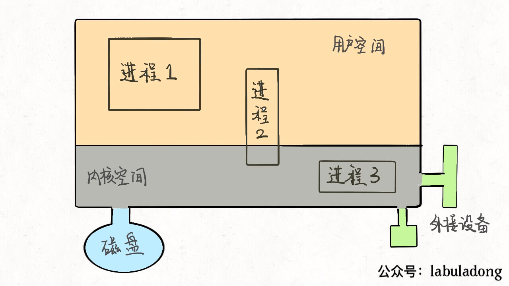

这个大的矩形表示计算机的内存空间，其中的小矩形代表进程，左下角的圆形表示磁盘，右下角的图形表示一些输入输出设备，比如鼠标键盘显示器等等。另外，注意到内存空间被划分为了两块，上半部分表示用户空间，下半部分表示内核空间。

用户空间装着用户进程需要使用的资源，比如你在程序代码里开一个数组，这个数组肯定存在用户空间；内核空间存放内核进程需要加载的系统资源，这一些资源一般是不允许用户访问的。但是注意有的用户进程会共享一些内核空间的资源，比如一些动态链接库等等。

我们用 C 语言写一个 hello 程序，编译后得到一个可执行文件，在命令行运行就可以打印出一句 hello world，然后程序退出。在操作系统层面，就是新建了一个进程，这个进程将我们编译出来的可执行文件读入内存空间，然后执行，最后退出。

你编译好的那个可执行程序只是一个文件，不是进程，可执行文件必须要载入内存，包装成一个进程才能真正跑起来。进程是要依靠操作系统创建的，每个进程都有它的固有属性，比如进程号（PID）、进程状态、打开的文件等等，进程创建好之后，读入你的程序，你的程序才被系统执行。

那么，操作系统是如何创建进程的呢？对于操作系统，进程就是一个数据结构，我们直接来看 Linux 的源码：

```cpp
struct task_struct {
    // 进程状态
    long              state;
    // 虚拟内存结构体
    struct mm_struct  *mm;
    // 进程号
    pid_t              pid;
    // 指向父进程的指针
    struct task_struct __rcu  *parent;
    // 子进程列表
    struct list_head        children;
    // 存放文件系统信息的指针
    struct fs_struct        *fs;
    // 一个数组，包含该进程打开的文件指针
    struct files_struct        *files;
};
```

task_struct 就是 Linux 内核对于一个进程的描述，也可以称为「进程描述符」。源码比较复杂，我这里就截取了一小部分比较常见的。

其中比较有意思的是 mm 指针和 files 指针。mm 指向的是进程的虚拟内存，也就是载入资源和可执行文件的地方；files 指针指向一个数组，这个数组里装着所有该进程打开的文件的指针。

## 二、文件描述符是什么

先说 files，它是一个文件指针数组。一般来说，一个进程会从 files[0] 读取输入，将输出写入 files[1]，将错误信息写入 files[2]。

举个例子，以我们的角度 C 语言的 printf 函数是向命令行打印字符，但是从进程的角度来看，就是向 files[1] 写入数据；同理，scanf 函数就是进程试图从 files[0] 这个文件中读取数据。

每个进程被创建时，files 的前三位被填入默认值，分别指向标准输入流、标准输出流、标准错误流。我们常说的「文件描述符」就是指这个文件指针数组的索引，所以程序的文件描述符默认情况下 0 是输入，1 是输出，2 是错误。

我们可以重新画一幅图：

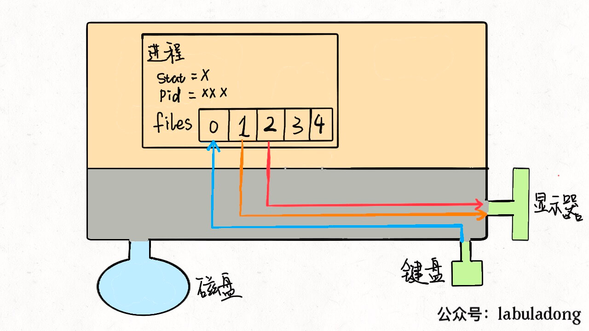

对于一般的计算机，输入流是键盘，输出流是显示器，错误流也是显示器，所以现在这个进程和内核连了三根线。因为硬件都是由内核管理的，我们的进程需要通过「系统调用」让内核进程访问硬件资源。

> PS：不要忘了，Linux 中一切都被抽象成文件，设备也是文件，可以进行读和写。

如果我们写的程序需要其他资源，比如打开一个文件进行读写，这也很简单，进行系统调用，让内核把文件打开，这个文件就会被放到 files 的第 4 个位置：

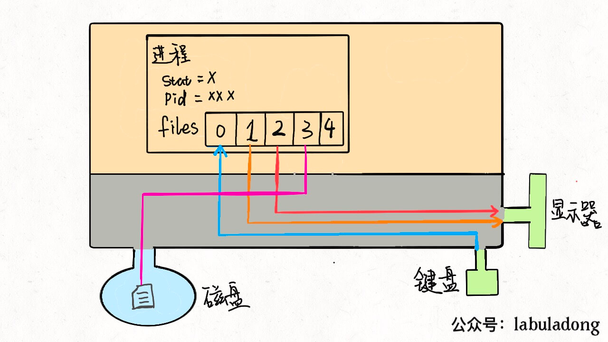

明白了这个原理，输入重定向就很好理解了，程序想读取数据的时候就会去 files[0] 读取，所以我们只要把 files[0] 指向一个文件，那么程序就会从这个文件中读取数据，而不是从键盘：

```shell
command < file.txt
```

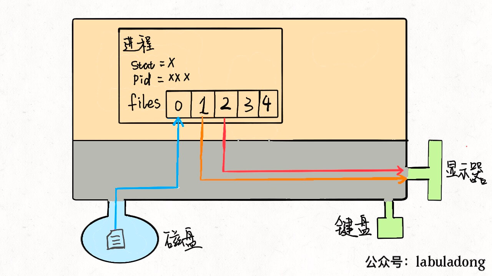

同理，输出重定向就是把 files[1] 指向一个文件，那么程序的输出就不会写入到显示器，而是写入到这个文件中：

```shell
command > file.txt
```

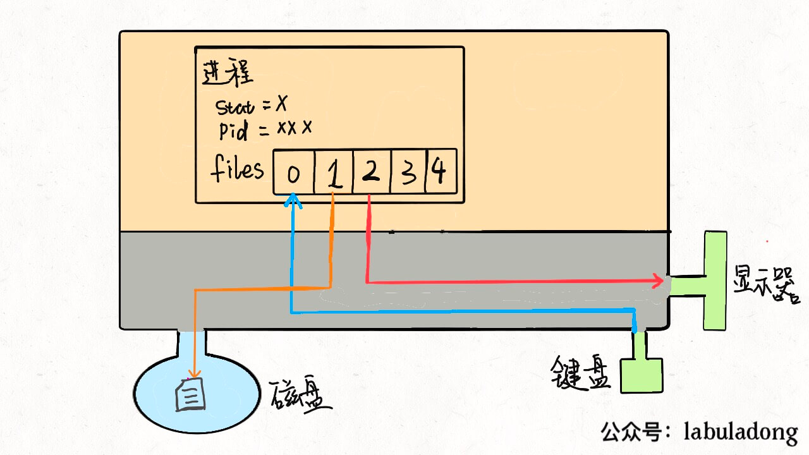

错误重定向也是一样的，就不再赘述。

管道符其实也是异曲同工，把一个进程的输出流和另一个进程的输入流接起一条「管道」，数据就在其中传递，不得不说这种设计思想真的很优美：

```shell
cmd1 | cmd2 | cmd3
```

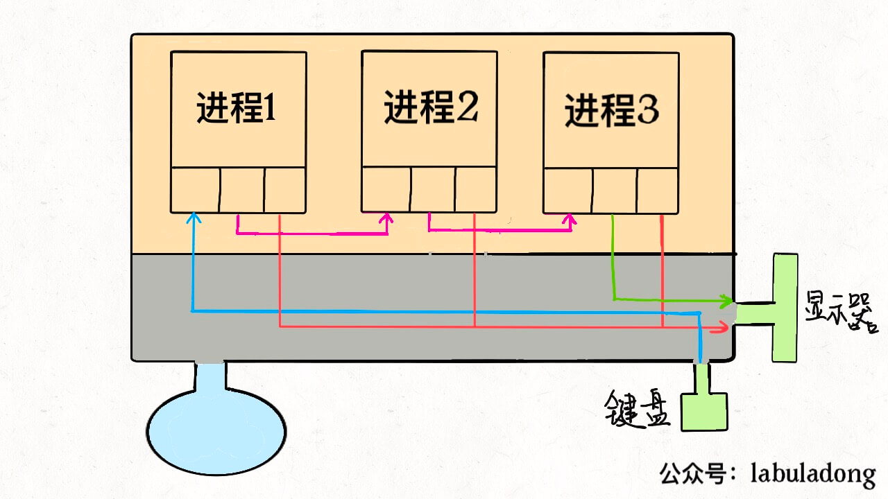

到这里，你可能也看出「Linux 中一切皆文件」设计思路的高明了，不管是设备、另一个进程、socket 套接字还是真正的文件，全部都可以读写，统一装进一个简单的 files 数组，进程通过简单的文件描述符访问相应资源，具体细节交于操作系统，有效解耦，优美高效。

## 三、线程是什么

首先要明确的是，多进程和多线程都是并发，都可以提高处理器的利用效率，所以现在的关键是，多线程和多进程有啥区别。

为什么说 Linux 中线程和进程基本没有区别呢，因为从 Linux 内核的角度来看，并没有把线程和进程区别对待。

我们知道系统调用 fork() 可以新建一个子进程，函数 pthread() 可以新建一个线程。但无论线程还是进程，都是用 task_struct 结构表示的，唯一的区别就是共享的数据区域不同。

换句话说，线程看起来跟进程没有区别，只是线程的某些数据区域和其父进程是共享的，而子进程是拷贝副本，而不是共享。就比如说，mm 结构和 files 结构在线程中都是共享的，我画两张图你就明白了：

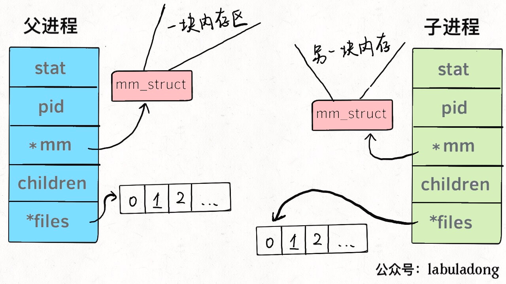

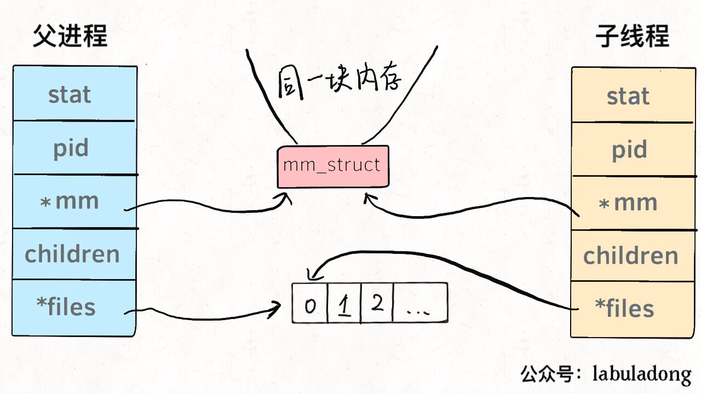

所以说，我们的多线程程序要利用锁机制，避免多个线程同时往同一区域写入数据，否则可能造成数据错乱。

那么你可能问，既然进程和线程差不多，而且多进程数据不共享，即不存在数据错乱的问题，为什么多线程的使用比多进程普遍得多呢？

因为现实中数据共享的并发更普遍呀，比如十个人同时从一个账户取十元，我们希望的是这个共享账户的余额正确减少一百元，而不是希望每人获得一个账户的拷贝，每个拷贝账户减少十元。

当然，必须要说明的是，只有 Linux 系统将线程看做共享数据的进程，不对其做特殊看待，其他的很多操作系统是对线程和进程区别对待的，线程有其特有的数据结构，我个人认为不如 Linux 的这种设计简洁，增加了系统的复杂度。

在 Linux 中新建线程和进程的效率都是很高的，对于新建进程时内存区域拷贝的问题，Linux 采用了 copy-on-write 的策略优化，也就是并不真正复制父进程的内存空间，而是等到需要写操作时才去复制。所以 Linux 中新建进程和新建线程都是很迅速的。

## 创建进程的方式

在Linux中主要提供了fork、vfork、clone三个进程创建方法。
在linux源码中这三个调用的执行过程是执行fork(),vfork(),clone()时，通过一个系统调用表映射到sys_fork(),sys_vfork(),sys_clone(),再在这三个函数中去调用do_fork()去做具体的创建进程工作。

### fork

fork创建一个进程时，子进程只是完全复制父进程的资源，复制出来的子进程有自己的task_struct结构和pid,但却复制父进程其它所有的资源

### vfork

vfork系统调用不同于fork，用vfork创建的子进程与父进程共享地址空间，也就是说子进程完全运行在父进程的地址空间上，如果这时子进程修改了某个变量，这将影响到父进程

### clone

系统调用fork()和vfork()是无参数的，而clone()则带有参数。fork()是全部复制，vfork()是共享内存，而clone() 是则可以将父进程资源有选择地复制给子进程，而没有复制的数据结构则通过指针的复制让子进程共享，具体要复制哪些资源给子进程，由参数列表中的 clone_flags来决定

## 进程切换

为了控制进程的执行，内核必须有能力挂起正在CPU上运行的进程，并恢复以前挂起的某个进程的执行。这种行为被称为进程切换。因此可以说，任何进程都是在操作系统内核的支持下运行的，是与内核紧密相关的。

从一个进程的运行转到另一个进程上运行，这个过程中经过下面这些变化：

1. 保存处理机上下文，包括程序计数器和其他寄存器。
2. 更新PCB信息。
3. 把进程的PCB移入相应的队列，如就绪、在某事件阻塞等队列。
4. 选择另一个进程执行，并更新其PCB。
5. 更新内存管理的数据结构。
6. 恢复处理机上下文。

## 进程的阻塞

正在执行的进程，由于期待的某些事件未发生，如请求系统资源失败、等待某种操作的完成、新数据尚未到达或无新工作做等，则由系统自动执行阻塞原语(Block)，使自己由运行状态变为阻塞状态。可见，进程的阻塞是进程自身的一种主动行为，也因此只有处于运行态的进程（获得CPU），才可能将其转为阻塞状态。当进程进入阻塞状态，是不占用CPU资源的。

## 线程、进程、协程

### 进程

一个进程好比是一个程序，它是 资源分配的最小单位 。同一时刻执行的进程数不会超过核心数。不过如果问单核CPU能否运行多进程？答案又是肯定的。单核CPU也可以运行多进程，只不过不是同时的，而是极快地在进程间来回切换实现的多进程。举个简单的例子，就算是十年前的单核CPU的电脑，也可以聊QQ的同时看视频。

### 线程

如果说进程和进程之间相当于程序与程序之间的关系，那么线程与线程之间就相当于程序内的任务和任务之间的关系。所以线程是依赖于进程的，也称为 「微进程」 。它是 程序执行过程中的最小单元 。

一个程序内包含了多种任务。打个比方，用播放器看视频的时候，视频输出的画面和声音可以认为是两种任务。当你拖动进度条的时候又触发了另外一种任务

### 进程与线程的区别

- 进程是CPU资源分配的基本单位，线程是独立运行和独立调度的基本单位（CPU上真正运行的是线程）。
- 进程拥有自己的资源空间，一个进程包含若干个线程，线程与CPU资源分配无关，多个线程共享同一进程内的资源。
- 线程的调度与切换比进程快很多。

### 进程上下文切换和线程上下文切换

首先是进程上下文切换。在切换内容方面，进程上下文切换涉及的内容较为广泛。由于进程是操作系统中进行资源分配和调度的基本单位，它拥有自己的独立内存空间和系统资源，因此进程上下文切换不仅包含了虚拟内存、栈、全局变量等用户空间的资源，还包括了内核堆栈、寄存器等内核空间的资源。这些资源在切换时都需要被保存和恢复，以确保新进程能够在切换后顺利执行。

在发生场景上，进程上下文切换主要发生在以下几种情况：一是进程主动调用某些系统调用时，如等待IO完成或者获取锁，这时进程无法继续运行，操作系统会触发上下文切换；二是进程分配到的时间片用完，或者有更高优先级的进程需要抢占CPU时，也会发生上下文切换。

接下来是线程上下文切换。在切换内容方面，线程上下文切换主要涉及线程在执行过程中的运行条件和状态，如程序计数器、栈信息、寄存器的值等。由于线程共享进程的内存空间，因此线程上下文切换不需要像进程上下文切换那样涉及大量的内存和资源管理。

线程上下文切换发生场景主要包括：线程主动让出CPU，例如调用了Thread.sleep()或Object.wait()等方法；当一个线程的时间片用完，需要切换到另一个线程继续执行；或者线程因为阻塞或等待某个事件而无法继续执行时，调度器会切换到另一个线程继续执行。

### 协程

协程，又称微线程，纤程。英文名Coroutine。一句话说明什么是线程：协程是一种用户态的轻量级线程。

协程拥有自己的寄存器上下文和栈。协程调度切换时，将寄存器上下文和栈保存到其他地方，在切回来的时候，恢复先前保存的寄存器上下文和栈。因此：

协程能保留上一次调用时的状态（即所有局部状态的一个特定组合），每次过程重入时，就相当于进入上一次调用的状态，换种说法：进入上一次离开时所处逻辑流的位置。

协程的好处：

- 无需线程上下文切换的开销
- 无需原子操作锁定及同步的开销
- 方便切换控制流，简化编程模型
- 高并发+高扩展性+低成本：一个CPU支持上万的协程都不是问题。所以很适合用于高并发处理。

缺点：

- 无法利用多核资源：协程的本质是个单线程,它不能同时将 单个CPU 的多个核用上,协程需要和进程配合才能运行在多CPU上.当然我们日常所编写的绝大部分应用都没有这个必要，除非是cpu密集型应用。
- 进行阻塞（Blocking）操作（如IO时）会阻塞掉整个程序
  
  ## 文件描述符fd
  
  文件描述符（File descriptor）是计算机科学中的一个术语，是一个用于表述指向文件的引用的抽象化概念。

文件描述符在形式上是一个非负整数。实际上，它是一个索引值，指向内核为每一个进程所维护的该进程打开文件的记录表。当程序打开一个现有文件或者创建一个新文件时，内核向进程返回一个文件描述符。在程序设计中，一些涉及底层的程序编写往往会围绕着文件描述符展开。但是文件描述符这一概念往往只适用于UNIX、Linux这样的操作系统。

## 缓存 I/O

缓存 I/O 又被称作标准 I/O，大多数文件系统的默认 I/O 操作都是缓存 I/O。在 Linux 的缓存 I/O 机制中，操作系统会将 I/O 的数据缓存在文件系统的页缓存（ page cache ）中，也就是说，数据会先被拷贝到操作系统内核的缓冲区中，然后才会从操作系统内核的缓冲区拷贝到应用程序的地址空间。

缓存 I/O 的缺点：

- 数据在传输过程中需要在应用程序地址空间和内核进行多次数据拷贝操作，这些数据拷贝操作所带来的 CPU 以及内存开销是非常大的。

## IO模型

### 一个IO操作通常包括两个阶段：

等待数据准备好；

从内核向进程复制数据；

- 对于一个套接字上的输入操作，第一步通常涉及等待数据从网络中到达。当所等待分组到达时，它被复制到内核中的某个缓冲区。第二步就是把数据从内核缓冲区复制到应用进程缓冲区。
  
  ### Linux/Unix五种IO模型
  
  #### 阻塞式 IO (Blocking IO)

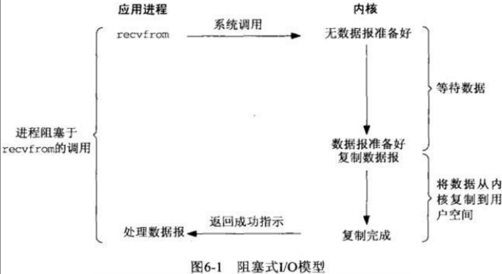

过程

- 使用系统调用，并一直阻塞直到内核将数据准备好，之后再由内核缓冲区复制到用户态，在等待内核准备的这段时间什么也干不了
- 如图函数调用期间，一直被阻塞，直到数据准备好且从内核复制到用户程序才返回，这种IO模型为阻塞式IO。

优缺点

- 优点：程序简单，在阻塞等待数据期间进程/线程挂起，基本不会占用 CPU 资源。
- 缺点：每个连接需要独立的进程/线程单独处理，当并发请求量大时为了维护程序，内存、线程切换开销较大，这种模型在实际生产中很少使用。
  
  #### 非阻塞式 IO (Non-blocking IO)

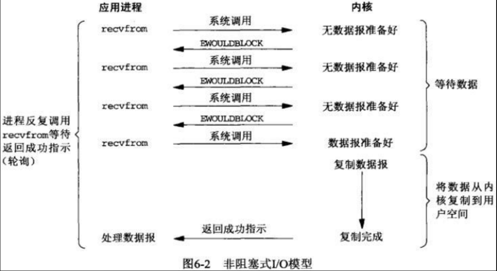

过程描述

- 内核在没有准备好数据的时候会返回错误码，而调用程序不会休眠，而是不断轮询询问内核数据是否准备好
- 下图函数调用时，如果数据没有准备好，不像阻塞式IO那样一直被阻塞，而是返回一个错误码。数据准备好时，函数成功返回。
- 应用程序对这样一个非阻塞描述符循环调用成为轮询。
- 非阻塞式IO的轮询会耗费大量cpu，通常在专门提供某一功能的系统中才会使用。通过为套接字的描述符属性设置非阻塞式，可使用该功能

优缺点

- 优点 不会阻塞在内核的等待数据过程，每次发起的 I/O 请求可以立即返回，不用阻塞等待，实时性较好。
- 缺点 轮询将会不断地询问内核，这将占用大量的 CPU 时间，系统资源利用率较低，所以一般 Web 服务器不使用这种 I/O 模型。
  
  #### IO 复用 (I/O multiplexing)


过程描述

- 类似与非阻塞，只不过轮询不是由用户线程去执行，而是由内核去轮询，内核监听程序监听到数据准备好后，调用内核函数复制数据到用户态
- 下图中select这个系统调用，充当代理类的角色，不断轮询注册到它这里的所有需要IO的文件描述符，有结果时，把结果告诉被代理的recvfrom函数，它本尊再亲自出马去拿数据
- IO多路复用至少有两次系统调用，如果只有一个代理对象，性能上是不如前面的IO模型的，但是由于它可以同时监听很多套接字，所以性能比前两者高
- 主要是select和epoll。一个线程可以对多个IO端口进行监听，当socket有读写事件时分发到具体的线程进行处理

优缺点

- 优点 可以基于一个阻塞对象，同时在多个描述符上等待就绪，而不是使用多个线程(每个文件描述符一个线程)，这样可以大大节省系统资源。
- 缺点 当连接数较少时效率相比多线程+阻塞 I/O 模型效率较低，可能延迟更大，因为单个连接处理需要 2 次系统调用，占用时间会有增加
  
  #### 信号驱动式 IO (signal driven I/O (SIGIO))

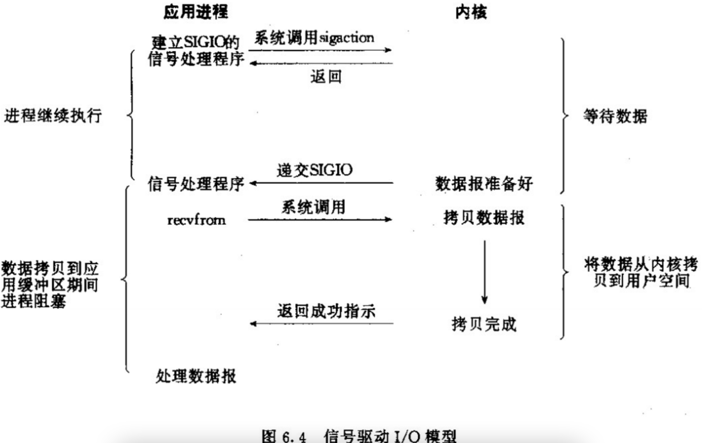

过程描述

- 信号驱动式I/O：首先我们允许Socket进行信号驱动IO,并安装一个信号处理函数，进程继续运行并不阻塞。
- 使用信号，内核在数据准备就绪时通过信号来进行通知
- 首先开启信号驱动io套接字，并使用sigaction系统调用来安装信号处理程序，内核直接返回，不会阻塞用户态
- 数据准备好时，内核会发送SIGIO信号，收到信号后开始进行io操作

优缺点

- 优点 线程并没有在等待数据时被阻塞，可以提高资源的利用率。
- 缺点
  - 信号 I/O 在大量 IO 操作时可能会因为信号队列溢出导致没法通知。
  - 信号驱动 I/O 尽管对于处理 UDP 套接字来说有用，即这种信号通知意味着到达一个数据报，或者返回一个异步错误。
  - 但是，对于 TCP 而言，信号驱动的 I/O 方式近乎无用，因为导致这种通知的条件为数众多，每一个来进行判别会消耗很大资源，与前几种方式相比优势尽失。
    
    #### 异步 IO (asynchronous I/O)
    
    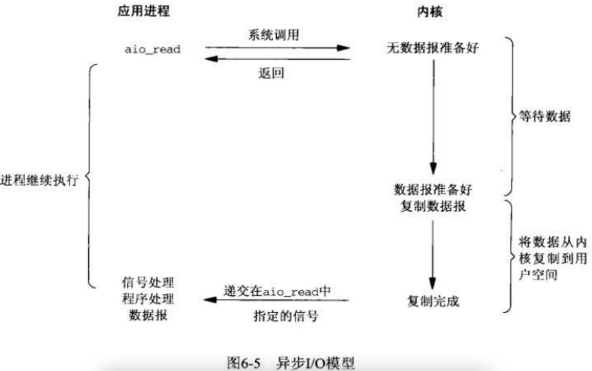

过程描述

- 异步IO依赖信号处理程序来进行通知
- 不过异步IO与前面IO模型不同的是：前面的都是数据准备阶段的阻塞与非阻塞，异步IO模型通知的是IO操作已经完成，而不是数据准备完成
- 异步IO才是真正的非阻塞，主进程只负责做自己的事情，等IO操作完成(数据成功从内核缓存区复制到应用程序缓冲区)时通过回调函数对数据进行处理
- 相对于同步IO，异步IO不是顺序执行。用户进程进行aio_read系统调用之后，无论内核数据是否准备好，都会直接返回给用户进程，然后用户态进程可以去做别的事情。等到socket数据准备好了，内核直接复制数据给进程，然后从内核向进程发送通知。IO两个阶段，进程都是非阻塞的。

优缺点

- 优点 异步 I/O 能够充分利用 DMA 特性，让 I/O 操作与计算重叠。
- 缺点 要实现真正的异步 I/O，操作系统需要做大量的工作。目前 Windows 下通过 IOCP 实现了真正的异步 I/O。
  
  # select、poll、epoll
  
  ## select
  
  ```shell
  int select (int n, fd_set *readfds, fd_set *writefds, fd_set *exceptfds, struct timeval *timeout);
  ```
  
  select 函数监视的文件描述符分3类，分别是writefds、readfds、和exceptfds。调用后select函数会阻塞，直到有描述符就绪（有数据 可读、可写、或者有except），或者超时（timeout指定等待时间，如果立即返回设为null即可），函数返回。当select函数返回后，可以通过遍历fdset，来找到就绪的描述符。

select目前几乎在所有的平台上支持，其良好跨平台支持也是它的一个优点。select的一 个缺点在于单个进程能够监视的文件描述符的数量存在最大限制，在Linux上一般为1024，可以通过修改宏定义甚至重新编译内核的方式提升这一限制，但 是这样也会造成效率的降低。

## poll

```shell
int poll (struct pollfd *fds, unsigned int nfds, int timeout);
```

不同与select使用三个位图来表示三个fdset的方式，poll使用一个 pollfd的指针实现。

```shell
struct pollfd {
    int fd; /* file descriptor */
    short events; /* requested events to watch */
    short revents; /* returned events witnessed */
};
```

pollfd结构包含了要监视的event和发生的event，不再使用select“参数-值”传递的方式。同时，pollfd并没有最大数量限制（但是数量过大后性能也是会下降）。 和select函数一样，poll返回后，需要轮询pollfd来获取就绪的描述符。

从上面看，select和poll都需要在返回后，通过遍历文件描述符来获取已经就绪的socket。事实上，同时连接的大量客户端在一时刻可能只有很少的处于就绪状态，因此随着监视的描述符数量的增长，其效率也会线性下降。

poll本质上和select没有区别，它将用户传入的数组拷贝到内核空间，然后查询每个fd对应的设备状态，如果设备就绪则在设备等待队列中加入一项并继续遍历，如果遍历完所有fd后没有发现就绪设备，则挂起当前进程，直到设备就绪或者主动超时，被唤醒后它又要再次遍历fd。这个过程经历了多次无谓的遍历。

## epoll

epoll是在2.6内核中提出的，是之前的select和poll的增强版本。相对于select和poll来说，epoll更加灵活，没有描述符限制。epoll使用一个文件描述符管理多个描述符，将用户关系的文件描述符的事件存放到内核的一个事件表中，这样在用户空间和内核空间的copy只需一次。

### epoll操作过程

epoll操作过程需要三个接口，分别如下：

```shell
int epoll_create(int size)；//创建一个epoll的句柄，size用来告诉内核这个监听的数目一共有多大
int epoll_ctl(int epfd, int op, int fd, struct epoll_event *event)；
int epoll_wait(int epfd, struct epoll_event * events, int maxevents, int timeout);
```

#### int epoll_create(int size);

- 创建一个epoll的句柄，size用来告诉内核这个监听的数目一共有多大，这个参数不同于select()中的第一个参数，给出最大监听的fd+1的值，参数size并不是限制了epoll所能监听的描述符最大个数，只是对内核初始分配内部数据结构的一个建议。
- 当创建好epoll句柄后，它就会占用一个fd值，在linux下如果查看/proc/进程id/fd/，是能够看到这个fd的，所以在使用完epoll后，必须调用close()关闭，否则可能导致fd被耗尽。
  
#### int epoll_ctl(int epfd, int op, int fd, struct epoll_event *event)；
  
函数是对指定描述符fd执行op操作。
- epfd：是epoll_create()的返回值。
- op：表示op操作，用三个宏来表示：添加EPOLL_CTL_ADD，删除EPOLL_CTL_DEL，修改EPOLL_CTL_MOD。分别添加、删除和修改对fd的监听事件。
- fd：是需要监听的fd（文件描述符）
- epoll_event：是告诉内核需要监听什么事，struct epoll_event结构如下：
  
  ```shell
  struct epoll_event {
  __uint32_t events;  /* Epoll events */
  epoll_data_t data;  /* User data variable */
  };

  //events可以是以下几个宏的集合：
  EPOLLIN ：表示对应的文件描述符可以读（包括对端SOCKET正常关闭）；
  EPOLLOUT：表示对应的文件描述符可以写；
  EPOLLPRI：表示对应的文件描述符有紧急的数据可读（这里应该表示有带外数据到来）；
  EPOLLERR：表示对应的文件描述符发生错误；
  EPOLLHUP：表示对应的文件描述符被挂断；
  EPOLLET： 将EPOLL设为边缘触发(Edge Triggered)模式，这是相对于水平触发(Level Triggered)来说的。
  EPOLLONESHOT：只监听一次事件，当监听完这次事件之后，如果还需要继续监听这个socket的话，需要再次把这个socket加入到EPOLL队列里

  ```
#### int epoll_wait(int epfd, struct epoll_event * events, int maxevents, int timeout);
- 等待epfd上的io事件，最多返回maxevents个事件。
- 参数events用来从内核得到事件的集合，maxevents告之内核这个events有多大，这个maxevents的值不能大于创建epoll_create()时的size，参数timeout是超时时间（毫秒，0会立即返回，-1将不确定，也有说法说是永久阻塞）。该函数返回需要处理的事件数目，如返回0表示已超时。

### 工作模式
epoll对文件描述符的操作有两种模式：LT（level trigger）和ET（edge trigger）。LT模式是默认模式，LT模式与ET模式的区别如下：

LT模式：当epoll_wait检测到描述符事件发生并将此事件通知应用程序，应用程序可以不立即处理该事件。下次调用epoll_wait时，会再次响应应用程序并通知此事件。
- LT(level triggered)是缺省的工作方式，并且同时支持block和no-block socket.在这种做法中，内核告诉你一个文件描述符是否就绪了，然后你可以对这个就绪的fd进行IO操作。如果你不作任何操作，内核还是会继续通知你的。


ET模式：当epoll_wait检测到描述符事件发生并将此事件通知应用程序，应用程序必须立即处理该事件。如果不处理，下次调用epoll_wait时，不会再次响应应用程序并通知此事件。
- ET(edge-triggered)是高速工作方式，只支持no-block socket。在这种模式下，当描述符从未就绪变为就绪时，内核通过epoll告诉你。然后它会假设你知道文件描述符已经就绪，并且不会再为那个文件描述符发送更多的就绪通知，直到你做了某些操作导致那个文件描述符不再为就绪状态了(比如，你在发送，接收或者接收请求，或者发送接收的数据少于一定量时导致了一个EWOULDBLOCK 错误）。但是请注意，如果一直不对这个fd作IO操作(从而导致它再次变成未就绪)，内核不会发送更多的通知(only once)
- ET模式在很大程度上减少了epoll事件被重复触发的次数，因此效率要比LT模式高。epoll工作在ET模式的时候，必须使用非阻塞套接口，以避免由于一个文件句柄的阻塞读/阻塞写操作把处理多个文件描述符的任务饿死。

### epoll总结
在 select/poll中，进程只有在调用一定的方法后，内核才对所有监视的文件描述符进行扫描，而epoll事先通过epoll_ctl()来注册一 个文件描述符，一旦基于某个文件描述符就绪时，内核会采用类似callback的回调机制，迅速激活这个文件描述符，当进程调用epoll_wait() 时便得到通知。(此处去掉了遍历文件描述符，而是通过监听回调的的机制。这正是epoll的魅力所在。)

epoll的优点主要是一下几个方面：
- 监视的描述符数量不受限制，它所支持的FD上限是最大可以打开文件的数目，这个数字一般远大于2048,举个例子,在1GB内存的机器上大约是10万左 右，具体数目可以cat /proc/sys/fs/file-max察看,一般来说这个数目和系统内存关系很大。select的最大缺点就是进程打开的fd是有数量限制的。这对 于连接数量比较大的服务器来说根本不能满足。虽然也可以选择多进程的解决方案( Apache就是这样实现的)，不过虽然linux上面创建进程的代价比较小，但仍旧是不可忽视的，加上进程间数据同步远比不上线程间同步的高效，所以也不是一种完美的方案。
- IO的效率不会随着监视fd的数量的增长而下降。epoll不同于select和poll轮询的方式，而是通过每个fd定义的回调函数来实现的。只有就绪的fd才会执行回调函数。
- 如果没有大量的idle -connection或者dead-connection，epoll的效率并不会比select/poll高很多，但是当遇到大量的idle- connection，就会发现epoll的效率大大高于select/poll。

# 进程间通信方式
进程间通信（Inter-Process Communication, IPC）是指在操作系统中，不同进程之间为了数据共享或协作，进行数据交换的方式。不同的操作系统提供了多种进程间通信的机制，常见的进程间通信方式包括以下几种：

## 1. `管道（Pipes）`

  - `无名管道（Anonymous Pipe）`
    特点：无名管道是一种半双工通信机制，即数据只能在一个方向上传递（单向），适用于父子进程之间的通信。
    
    使用场景：无名管道常用于 Unix 系统中的简单进程间通信，如父子进程间的消息传递。
    
    局限性：只能在具有亲缘关系的进程之间使用，数据只能单向传输。
  
  - `命名管道（Named Pipe，FIFO）`

    特点：命名管道支持双向通信，且允许不相关的进程之间通信。命名管道在文件系统中有一个名字，可以被多个进程打开进行读写。

    使用场景：用于具有无亲缘关系的进程间通信，且适用于跨不同终端或网络的进程间通信。

    局限性：在某些系统中，命名管道的性能可能不如其他 IPC 方式。

## 2. `信号（Signals）`

特点：信号是一种异步通信方式，用于通知进程发生了某种事件。信号只能传递非常简单的信息，通常只表示某种事件的发生，而不能携带复杂的数据。

使用场景：信号通常用于进程之间的通知，比如让一个进程中断或终止某个操作。

局限性：信号传递的信息有限，且如果没有处理好信号可能会导致进程中断。

## 3. `消息队列（Message Queues）`

特点：消息队列允许进程以消息的形式发送和接收数据。消息队列在内核中维护，多个进程可以通过向消息队列中添加消息或从中读取消息来进行通信。消息可以是任意类型的数据。

使用场景：适用于复杂的多进程通信，尤其是需要携带多种类型数据或结构化数据的场景。

局限性：需要进程配合内核进行管理，队列大小有限制，可能会有阻塞和等待的问题。

## 4. `共享内存（Shared Memory）`

特点：共享内存是进程间通信最快的方式之一。多个进程可以直接访问相同的内存区域，从而实现数据共享。共享内存允许不同进程直接读写公共内存区，但需要同步机制来防止竞争条件。

使用场景：适用于需要快速、大量数据共享的场景，如图像处理、大量数据的实时传递等。

局限性：需要额外的同步机制（如信号量或互斥锁）来避免同时访问共享内存时的数据竞争问题。

## 5. `信号量（Semaphores）`

特点：信号量主要用于解决并发进程的同步和互斥问题。信号量本质上是一个计数器，用于控制多个进程对共享资源的访问，常与共享内存结合使用。

使用场景：在进程间需要同步或互斥访问共享资源时使用，如进程锁定共享内存的读写操作。

局限性：信号量不能直接传递数据，仅用于协调对共享资源的访问。

## 6. `套接字（Sockets）`

特点：套接字不仅用于网络通信，还可以用于本地进程间通信。通过本地的 UNIX 套接字（Unix Domain Sockets），进程可以通过类似网络通信的方式进行数据传输。

使用场景：套接字适用于网络和本地进程间通信，特别是在需要进程之间跨计算机通信的分布式系统中。

局限性：与其他本地通信方式相比，套接字通信的开销相对较大，适合大规模、跨主机的进程间通信。

## 7. `文件映射（Memory-Mapped Files, MMF）`

特点：文件映射是一种将文件内容映射到进程的地址空间的通信方式。多个进程可以通过将同一个文件映射到它们的地址空间来实现共享数据。

使用场景：用于多个进程之间共享文件中的数据，且适合大文件的共享访问，如操作系统中的虚拟内存管理。

局限性：进程间需要同步访问文件映射的内存区域，并且映射的内容受限于文件系统。

## 8. `管道符重定向`

特点：这是基于 Shell 的一种通信方式，将一个进程的输出作为另一个进程的输入，常见的形式是使用 | 管道符。通过这种方式，一个进程可以将其标准输出传递给另一个进程的标准输入。

使用场景：常用于命令行程序的组合，如将一个命令的输出通过管道符传递给另一个命令。

局限性：仅限于进程标准输入和输出的简单重定向，不能用于复杂的数据共享。

## 9. `远程过程调用（RPC, Remote Procedure Call）`

特点：RPC 允许进程调用另一个进程的函数，就像在本地进程中调用函数一样。RPC 隐藏了进程间通信的细节，使得进程之间的通信像本地调用一样简单。

使用场景：适用于分布式系统中进程之间的通信，如微服务架构中的服务间调用。

局限性：RPC 需要序列化和反序列化数据，网络延迟可能影响性能。

## 10. `DBus`

特点：DBus 是 Linux 环境中的进程间通信系统，允许多个进程通过总线进行通信。DBus 支持一对一和一对多通信，适合桌面应用程序之间的通信。

使用场景：常用于桌面系统和嵌入式系统中进程间的消息传递和服务调用。

局限性：与共享内存等方式相比，DBus 的传输性能较低，适用于消息级别的通信。

## `总结`

- 简单数据传递：信号、管道、消息队列等适合简单数据或控制信号的传递。
- 大规模数据共享：共享内存、文件映射适合高效的大数据传输，但需要额外的同步机制。
- 分布式或远程通信：套接字、RPC 适合分布式系统中的进程通信。
- 同步与互斥：信号量适合用于进程间同步，常与共享内存结合使用。
- 不同的进程间通信机制各有优缺点，具体使用哪种方式，取决于通信的数据量、速度、进程间的关系以及系统的整体架构。

# Linux物理内存和虚拟内存
`物理内存`： 真实的内存，就是我们常说的那个4G、8G、16G的内存条。

`虚拟内存`： 是一个概念，并不是实际的内存，对于4G内存的Linux系统来说，虚拟内存也为4G，其中1G为系统的内存，剩下的3G为应用程序的内存。

## 内存映射
Linux 内核给每个进程都提供了一个独立的虚拟地址空间，并且这个地址空间是连续的，进程就可以很方便地访问内存，也就是我们常说的虚拟内存虚拟内存

这里会有一种错觉，我们每个进程都占有了这么多的空间，那么多个进程怎么办？事实上并没有那么多的空间，其实这个本质是就是一种“自欺欺人”的做法，每个进程都以为自己占据了全部的地址空间；其实只有在实际使用虚拟内存的时候，才会分配物理内存；

通过内存映射将虚拟内存地址映射到物理内存地址，对实际使用虚拟内存并分配的物理内存进行管理；

作用就是：只会将某一进程此刻需要的内存大小映射到物理内存，其它暂时不需要的内容交换到硬盘存储即可。当进程需要使用在硬盘中的内容或者需要动态申请内存时，操作系统会利用缺页操作，触发一次内存映射，将另外的物理内存映射进虚拟内存，供程序使用，这样对于进程而言，则认为内存总是够用的。

各个进程均拥有3G虚拟内存，那么操作系统是如何做到各进程所使用的实际物理内存不会互相占用呢？实际上，各个进程均有自己的内存映射表。任意一个时刻，在一个CPU上只有一个进程在运行。所以对于此CPU来讲，在这一时刻，整个系统只存在一个4GB的虚拟地址空间，这个虚拟地址空间是面向此进程的。当进程发生切换的时候，虚拟地址空间也随着切换。由此可以看出，每个进程都有自己的虚拟地址空间，只有此进程运行的时候，其虚拟地址空间才被运行它的CPU所知。在其它时刻，其虚拟地址空间对于CPU来说，是不可知的。所以尽管每个进程都可以有4 GB的虚拟地址空间，但在CPU眼中，只有一个虚拟地址空间存在。虚拟地址空间的变化，随着进程切换而变化。
## 内存映射原理

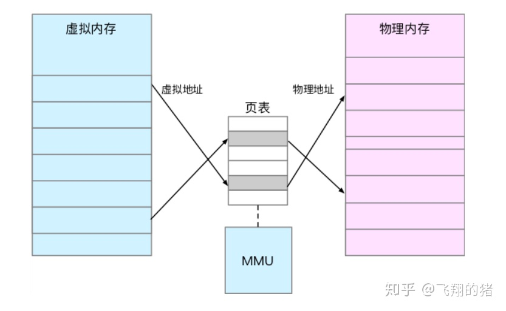

虚拟内存映射到物理内存地址，内核为每一个进程维护了一张表，记录了他们对应的映射关系；

而当进程访问的虚拟地址在页表中查不到时，系统会产生一个**缺页异常**，进入内核空间分配物理内存、更新进程页表，最后再返回用户空间，恢复进程的运行。

Linux采用了四级页表来管理内存页，多级页表就是把内存分成区块来管理，将原来的映射关系改成区块索引和区块内的偏移。由于虚拟内存空间通常只用了很少一部分，那么，多级页表就只保存这些使用中的区块，这样就可以大大地减少页表的项数。

# 页面置换算法
页面置换算法是一种用于解决虚拟内存中页面置换问题的算法，主要目的是选择一个页面被置换出去以腾出空间，以便将更紧急的页面调入内存。常见的页面置换算法有：

1. 最优页面置换算法（OPT）：选择在未来最长时间内不再被访问的页面进行置换，是理论上最优的页面置换算法。
2. 先进先出页面置换算法（FIFO）：选择最早被调入内存的页面进行置换。
3. 最近最少使用页面置换算法（LRU）：选择最近一段时间内最少被访问的页面进行置换。
4. 时钟页面置换算法（Clock）：基于FIFO算法，使用一个时钟指针指向当前扫描的页面，如果页面的访问位为0，则置换该页面，如果为1，则将该页面的访问位设置为0，并继续扫描下一个页面，直到找到需要置换的页面。
5. 最不经常使用页面置换算法（NFU）：根据页面被访问的次数来选择最不经常使用的页面进行置换。

这些算法的实现方式和效率各有不同，可以根据具体的应用场景选择适合的算法。

# 进程调度算法
进程调度算法是用于选择下一个要执行的进程的算法，常见的进程调度算法有：

1. 先来先服务调度算法（FCFS）：按照进程到达的顺序进行调度，先到达的进程先执行，简单易实现，但无法充分利用CPU。
2. 最短进程优先调度算法（SJF）：按照进程执行时间的长度进行调度，执行时间短的进程先执行，可最大限度地减少平均等待时间和周转时间，但需要预先知道进程的执行时间，实现复杂。
3. 时间片轮转调度算法（RR）：将CPU的执行时间分为若干个时间片，每个进程在一个时间片内执行，时间片用完后，将进程放入就绪队列的末尾，再轮到下一个进程执行，简单易实现，但进程的响应时间和周转时间长。
4. 最高优先级调度算法（HPF）：按照进程优先级进行调度，优先级高的进程先执行，可充分利用CPU，但可能出现低优先级进程长时间等待的情况，造成饥饿现象。
5. 多级反馈队列调度算法（MFQ）：将就绪队列分为若干个队列，每个队列拥有不同的时间片大小，进程优先级高的进入低时间片的队列，优先级低的进入高时间片的队列，可兼顾短进程和长进程的需求，但实现较为复杂。

# 操作系统里的轮询和中断
在操作系统中，轮询（Polling）和中断（Interrupt）是两种不同的处理方式。

轮询是一种主动的查询方式，它通过循环检查某个状态是否发生变化来获取信息。例如，在读取键盘输入时，程序会不断地检查键盘输入缓冲区是否有数据可读，如果有则读取数据，否则就继续等待。轮询的优点是简单易懂，但它会占用大量的CPU时间，效率较低。

中断是一种被动的处理方式，它在外部事件发生时被触发，通常是硬件设备或其他程序向操作系统发出请求。例如，在读取键盘输入时，程序可以注册一个中断处理函数，在键盘输入缓冲区有数据可读时，硬件会触发中断，操作系统会调用中断处理函数来处理输入。中断的优点是可以减少CPU的占用时间，提高效率。

在实际应用中，操作系统往往采用轮询和中断相结合的方式来处理输入输出事件。例如，可以使用中断处理键盘输入事件，但是当CPU空闲时可以使用轮询方式来检查其他设备是否有数据可读。这样可以充分利用CPU时间，提高系统的效率。

# 参考文章
- https://segmentfault.com/a/1190000003063859
- https://blog.csdn.net/qq_34170700/article/details/106996450
- https://zhuanlan.zhihu.com/p/70256971
- https://labuladong.gitee.io/algo/5/35/
- https://www.nowcoder.com/interview/center?entranceType=%E5%AF%BC%E8%88%AA%E6%A0%8F
```
