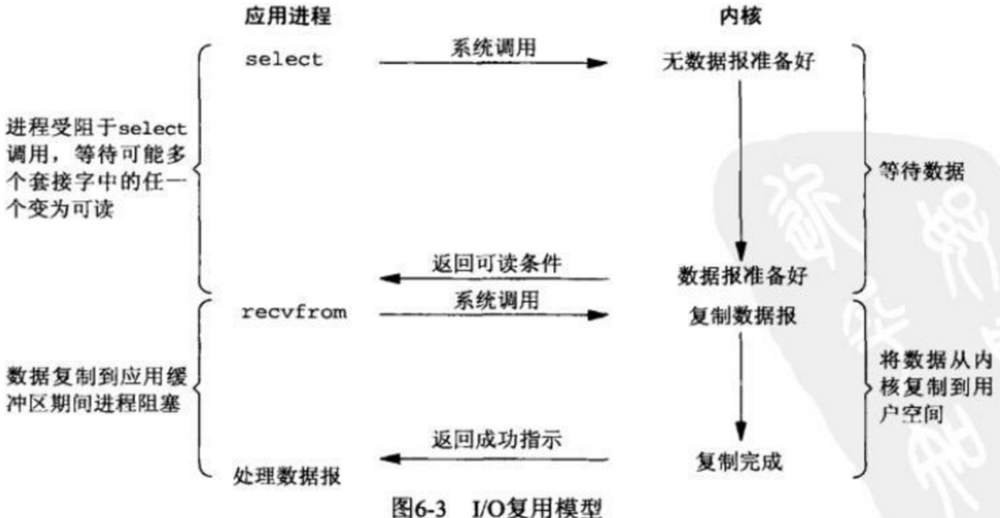

* [Linux](#linux)
  * [文件和目录的操作](#文件和目录的操作)
  * [查看文件](#查看文件)
  * [管理用户](#管理用户)
    * [用户管理](#用户管理)
    * [组管理](#组管理)
    * [批量管理用户：](#批量管理用户)
    * [组成员管理：](#组成员管理)
    * [口令管理](#口令管理)
    * [切换用户](#切换用户)
    * [用户相关的命令：](#用户相关的命令)
  * [进程管理](#进程管理)
  * [打包和压缩文件](#打包和压缩文件)
    * [压缩](#压缩)
    * [解压](#解压)
  * [grep+正则表达式](#grep正则表达式)
  * [Vi编辑器](#vi编辑器)
    * [普通模式](#普通模式)
    * [插入模式](#插入模式)
    * [命令行模式](#命令行模式)
    * [设置Vi环境](#设置vi环境)
  * [权限管理](#权限管理)
  * [网络管理](#网络管理)
    * [网络接口相关](#网络接口相关)
    * [临时配置相关](#临时配置相关)
    * [网络检测的常用工具：](#网络检测的常用工具)
    * [安装软件](#安装软件)
  * [cpu100%怎么排查](#cpu100怎么排查)
    * [1、问题复现](#1问题复现)
    * [2、第一查看程序运行日志](#2第一查看程序运行日志)
    * [3、排查](#3排查)
  * [用户空间与内核空间](#用户空间与内核空间)
  * [进程切换](#进程切换)
  * [进程的阻塞](#进程的阻塞)
  * [进程的阻塞](#文件描述符fd)
  * [缓存 I/O](#缓存-io)
  * [IO模型](#io模型)
    * [一个IO操作通常包括两个阶段：](#一个io操作通常包括两个阶段)
    * [Linux/Unix五种IO模型](#linuxunix五种io模型)
      * [阻塞式 IO (Blocking IO)](#阻塞式-io-blocking-io)
      * [非阻塞式 IO (Non-blocking IO)](#非阻塞式-io-non-blocking-io)
      * [IO 复用 (I/O multiplexing)](#io-复用-io-multiplexing)
      * [信号驱动式 IO (signal driven I/O (SIGIO))](#信号驱动式-io-signal-driven-io-sigio)
      * [异步 IO (asynchronous I/O)](#异步-io-asynchronous-io)
* [select、poll、epoll](#selectpollepoll)
  * [select](#select)
  * [poll](#poll)
  * [epoll](#epoll)
    * [epoll操作过程](#epoll操作过程)
      * [int epoll_create(int size);](#int-epoll_createint-size)
      * [int epoll_ctl(int epfd, int op, int fd, struct epoll_event *event)；](#int-epoll_ctlint-epfd-int-op-int-fd-struct-epoll_event-event)
      * [int epoll_wait(int epfd, struct epoll_event * events, int maxevents, int timeout);](#int-epoll_waitint-epfd-struct-epoll_event--events-int-maxevents-int-timeout)
    * [工作模式](#工作模式)
    * [epoll总结](#epoll总结)
* [参考文章](#参考文章)


# Linux
## 文件和目录的操作
- `ls` 显示文件和目录列表
- `cd` 切换目录
- `pwd` 显示当前工作目录
- `mkdir` 创建目录
- `rmdir` 删除空目录
- `touch` 生成一个空文件或更改文件的时间
- `cp` 复制文件或目录
- `mv` 移动文件或目录、文件或目录改名
- `rm` 删除文件或目录
- `ln` 建立链接文件
- `find` 查找文件
- `file/stat` 查看文件类型或文件属性信息
- `echo` 把内容重定向到指定的文件中 ，有则打开，无则创建
- `管道命令 |` 将前面的结果给后面的命令，例如：`ls -la | wc `，将ls的结果加油wc命令来统计字数
- 重定向 `>` 是覆盖模式，`>>` 是追加模式
  - 例如：`echo "Java3y,zhen de hen xihuan ni" > qingshu.txt `把左边的输出放到右边的文件里去
## 查看文件	  
- `cat` 查看文本文件内容
- `more` 可以分页看
- `less` 不仅可以分页，还可以方便地搜索，回翻等操作
- `tail -10` 查看文件的尾部的10行
- `head -20` 查看文件的头部20行
## 管理用户
### 用户管理
- `useradd` 添加用户
- `usermod` 修改用户
- `userdel` 删除用户
### 组管理
- `groupadd` 添加组 
- `groupmod` 修改组 
- `groupdel` 删除组
### 批量管理用户：
- 成批添加/更新一组账户：`newusers`
- 成批更新用户的口令：`chpasswd`
### 组成员管理：
- 向标准组中添加用户
  - `gpasswd -a <用户账号名> <组账号名>`
  - `usermod -G <组账号名> <用户账号名>`
- 从标准组中删除用户
  - `gpasswd -d <用户账号名> <组账号名>`
### 口令管理
- 口令时效设置： 修改 /etc/login.defs 的相关配置参数
- 口令维护(禁用、恢复和删除用户口令)： `passwd`
- 设置已存在用户的口令时效： `change`
### 切换用户
- `su`
- `sudo`
### 用户相关的命令：
- `id`：显示用户当前的uid、gid和用户所属的组列表
- `groups`：显示指定用户所属的组列表
- `whoami`：显示当前用户的名称
- `w/who`：显示登录用户及相关信息
- `newgrp`：用于转换用户的当前组到指定的组账号，用户必须属于该组才可以正确执行该命令
## 进程管理
- `ps`：查找出进程的信息 查看自己的进程
  - `ps -l` 查看系统所有进程
  - `ps aux` 查看特定的进程
  - `ps aux | grep threadx` 
- `nice`和`renice`：调整进程的优先级
- `kill`：杀死进程
- `free`：查看内存使用状况
- `top` ：查看实时刷新的系统进程信息
- `netstat` 查看占用端口的进程
  - `netstat -anp | grep port`
- 进程状态
  - `R` running or runnable (on run queue)正在执行或者可执行，此时进程位于执行队列中。
  - `D` uninterruptible sleep (usually I/O)不可中断阻塞，通常为 IO 阻塞。
  - `S` interruptible sleep (waiting for an event to complete)可中断阻塞，此时进程正在等待某个事件完成。
  - `Z` zombie (terminated but not reaped by its parent)僵死，进程已经终止但是尚未被其父进程获取信息。
  - `T` stopped (either by a job control signal or because it is being traced)结束，进程既可以被作业控制信号结束，也可能是正在被追踪。
- `SIGCHLD` 当一个子进程改变了它的状态时（停止运行，继续运行或者退出），有两件事会发生在父进程中
  - 得到 SIGCHLD 信号；
  - waitpid() 或者 wait() 调用会返回。
    - wait() 父进程调用 wait() 会一直阻塞，直到收到一个子进程退出的 SIGCHLD 信号，之后 wait() 函数会销毁子进程并返回。 如果成功，返回被收集的子进程的进程 ID；如果调用进程没有子进程，调用就会失败，此时返回 -1，同时 errno 被置为 ECHILD。 参数 status 用来保存被收集的子进程退出时的一些状态，如果对这个子进程是如何死掉的毫不在意，只想把这个子进程消灭掉，可以设置这个参数为 NULL。
    - waitpid() 作用和 wait() 完全相同，但是多了两个可由用户控制的参数 pid 和 options。 pid 参数指示一个子进程的 ID，表示只关心这个子进程退出的 SIGCHLD 信号。如果 pid=-1 时，那么和 wait() 作用相同，都是关心所有子进程退出的 SIGCHLD 信号。 options 参数主要有 WNOHANG 和 WUNTRACED 两个选项，WNOHANG 可以使 waitpid() 调用变成非阻塞的，也就是说它会立即返回，父进程可以继续执行其它任务。
  - 其中子进程发送的 SIGCHLD 信号包含了子进程的信息，比如进程 ID、进程状态、进程使用 CPU 的时间等。
  - 在子进程退出时，它的进程描述符不会立即释放，这是为了让父进程得到子进程信息，父进程通过 wait() 和
  - waitpid() 来获得一个已经退出的子进程的信息。
- 僵尸进程孤儿进程什么原因导致的，哪个危害大，怎么解决
  - `孤儿进程` 一个父进程退出，而它的一个或多个子进程还在运行，那么这些子进程将成为孤儿进程。 孤儿进程将被 init 进程（进程号为 1）所收养，并由 init 进程对它们完成状态收集工作。 由于孤儿进程会被 init 进程收养，所以孤儿进程不会对系统造成危害。
  - `僵尸进程` 一个子进程的进程描述符在子进程退出时不会释放，只有当父进程通过 wait() 或 waitpid() 获取了子进程信息后才会释放。如果子进程退出，而父进程并没有调用 wait() 或 waitpid()，那么子进程的进程描述符仍然保存在系统中，这 种进程称之为僵尸进程。 僵尸进程通过 ps 命令显示出来的状态为 Z（zombie）。
    - 系统所能使用的进程号是有限的，如果产生大量僵尸进程，将因为没有可用的进程号而导致系统不能产生新的进程。
    - 要消灭系统中大量的僵尸进程，只需要将其父进程杀死，此时僵尸进程就会变成孤儿进程，从而被 init 进程所收养，
    - 这样 init 进程就会释放所有的僵尸进程所占有的资源，从而结束僵尸进程。
- 作业管理
  - jobs：列举作业号码和名称
  - bg: 在后台恢复运行
  - fg：在前台恢复运行
  - ctrl+z：暂时停止某个进程
- 自动化任务
  - at
  - cron
- 管理守护进程
  - chkconfig
  - service
  - ntsysv
## 打包和压缩文件
### 压缩
- `gzip filename`
- `bzip2 filename`
- `tar -czvf filename`
### 解压
- `gzip -d filename.gz`
- `bzip2 -d filename.bz2`
- `tar -xzvf filename.tar.gz`
## grep+正则表达式
- `grep -n mystr myfile` 在文件 myfile 中查找包含字符串 mystr的行
- `grep  '^[a-zA-Z]'  myfile `显示 myfile 中第一个字符为字母的所有行
## Vi编辑器
### 普通模式
- `G`用于直接跳转到文件尾
- `ZZ`用于存盘退出Vi
- `ZQ`用于不存盘退出Vi
- `/`和`？`用于查找字符串
- `n`继续查找下一个
- `yy`复制一行
- `p`粘帖在下一行，P粘贴在前一行
- `dd` 删除一行文本
- `u` 取消上一次编辑操作（undo）
### 插入模式
- 使用i或a或o进去插入模式
- 使用esc返回普通模式
### 命令行模式
- `w`保存当前编辑文件，但并不退出
- `w newfile`  存为另外一个名为 “newfile” 的文件
- `wq` 用于存盘退出Vi
- `q!`用于不存盘退出Vi
- `q`用于直接退出Vi （未做修改)
### 设置Vi环境
- `set autoindent`  缩进,常用于程序的编写
- `set noautoindent` 取消缩进
- `set number` 在编辑文件时显示行号
- `set tabstop=value` 设置显示制表符的空格字符个数
- `set` 显示设置的所有选项
## 权限管理
- 改变文件或目录的权限：chmod
- 改变文件或目录的属主（所有者）：chown
- 改变文件或目录所属的组：chgrp
- 设置文件的缺省生成掩码：umask
- 文件扩展属性
  - 显示扩展属性：`lsattr [-adR] [文件|目录]`
  - 修改扩展属性：`chattr [-R] [[-+=][属性]] <文件|目录>`
## 网络管理
### 网络接口相关
- `ifconfig`：查看网络接口信息
- `ifup/ifdown`：开启或关闭接口
### 临时配置相关
- `route`命令：可以临时地设置内核路由表
- `hostname`命令：可以临时地修改主机名
- `sysctl`命令：可以临时地开启内核的包转发
- `ifconfig`命令：可以临时地设置网络接口的IP参数
### 网络检测的常用工具：
- `ifconfig` 检测网络接口配置
- `route` 检测路由配置
- `ping` 检测网络连通性
- `netstat` 查看网络状态
- `lsof` 查看指定IP 和/或 端口的进程的当前运行情况
- `host/dig/nslookup` 检测DNS解析
- `traceroute` 检测到目的主机所经过的路由器
- `tcpdump` 显示本机网络流量的状态
### 安装软件
- `yum`
- `rpm`
- `wget`
## cpu100%怎么排查
### 1、问题复现
### 2、第一查看程序运行日志
### 3、排查
- 执行“`top`”命令 查看CPU最高的进程pid
- 执行“`top -Hp 进程号`”命令 查看java进程下的所有线程占CPU的情况。
- 执行“`printf "%x\n 10`"命令 把进程号转为16进制，方便在堆栈中查找线程号
- 执行 “`jstack 进程号 | grep 线程ID`”
  - 可以查看线程的状态判断问题
    - NEW,未启动的。不会出现在Dump中。
    - RUNNABLE,在虚拟机内执行的。运行中状态，可能里面还能看到locked字样，表明它获得了某把锁。
    - BLOCKED,受阻塞并等待监视器锁。被某个锁(synchronizers)給block住了。
    - WATING,无限期等待另一个线程执行特定操作。等待某个condition或monitor发生，一般停留在park(), wait(), sleep(),join() 等语句里。
    - TIMED_WATING,有时限的等待另一个线程的特定操作。和WAITING的区别是wait() 等语句加上了时间限制 wait(timeout)。
    - TERMINATED,已退出的。
  - 注意deadlock
- `jmap -dump pid` 导出dump文件供一些分析工具分析

## 用户空间与内核空间
现在操作系统都是采用虚拟存储器，那么对32位操作系统而言，它的寻址空间（虚拟存储空间）为4G（2的32次方）。操作系统的核心是内核，独立于普通的应用程序，可以访问受保护的内存空间，也有访问底层硬件设备的所有权限。为了保证用户进程不能直接操作内核（kernel），保证内核的安全，操心系统将虚拟空间划分为两部分，一部分为内核空间，一部分为用户空间。针对linux操作系统而言，将最高的1G字节（从虚拟地址0xC0000000到0xFFFFFFFF），供内核使用，称为内核空间，而将较低的3G字节（从虚拟地址0x00000000到0xBFFFFFFF），供各个进程使用，称为用户空间。

## 进程切换
为了控制进程的执行，内核必须有能力挂起正在CPU上运行的进程，并恢复以前挂起的某个进程的执行。这种行为被称为进程切换。因此可以说，任何进程都是在操作系统内核的支持下运行的，是与内核紧密相关的。

从一个进程的运行转到另一个进程上运行，这个过程中经过下面这些变化：
1. 保存处理机上下文，包括程序计数器和其他寄存器。
2. 更新PCB信息。
3. 把进程的PCB移入相应的队列，如就绪、在某事件阻塞等队列。
4. 选择另一个进程执行，并更新其PCB。
5. 更新内存管理的数据结构。
6. 恢复处理机上下文。

## 进程的阻塞
正在执行的进程，由于期待的某些事件未发生，如请求系统资源失败、等待某种操作的完成、新数据尚未到达或无新工作做等，则由系统自动执行阻塞原语(Block)，使自己由运行状态变为阻塞状态。可见，进程的阻塞是进程自身的一种主动行为，也因此只有处于运行态的进程（获得CPU），才可能将其转为阻塞状态。当进程进入阻塞状态，是不占用CPU资源的。

## 文件描述符fd
文件描述符（File descriptor）是计算机科学中的一个术语，是一个用于表述指向文件的引用的抽象化概念。

文件描述符在形式上是一个非负整数。实际上，它是一个索引值，指向内核为每一个进程所维护的该进程打开文件的记录表。当程序打开一个现有文件或者创建一个新文件时，内核向进程返回一个文件描述符。在程序设计中，一些涉及底层的程序编写往往会围绕着文件描述符展开。但是文件描述符这一概念往往只适用于UNIX、Linux这样的操作系统。

## 缓存 I/O
缓存 I/O 又被称作标准 I/O，大多数文件系统的默认 I/O 操作都是缓存 I/O。在 Linux 的缓存 I/O 机制中，操作系统会将 I/O 的数据缓存在文件系统的页缓存（ page cache ）中，也就是说，数据会先被拷贝到操作系统内核的缓冲区中，然后才会从操作系统内核的缓冲区拷贝到应用程序的地址空间。

缓存 I/O 的缺点：
- 数据在传输过程中需要在应用程序地址空间和内核进行多次数据拷贝操作，这些数据拷贝操作所带来的 CPU 以及内存开销是非常大的。


## IO模型
### 一个IO操作通常包括两个阶段：
等待数据准备好；

从内核向进程复制数据；
- 对于一个套接字上的输入操作，第一步通常涉及等待数据从网络中到达。当所等待分组到达时，它被复制到内核中的某个缓冲区。第二步就是把数据从内核缓冲区复制到应用进程缓冲区。
### Linux/Unix五种IO模型
#### 阻塞式 IO (Blocking IO)


过程
- 使用系统调用，并一直阻塞直到内核将数据准备好，之后再由内核缓冲区复制到用户态，在等待内核准备的这段时间什么也干不了
- 如图函数调用期间，一直被阻塞，直到数据准备好且从内核复制到用户程序才返回，这种IO模型为阻塞式IO。

优缺点
- 优点：程序简单，在阻塞等待数据期间进程/线程挂起，基本不会占用 CPU 资源。
- 缺点：每个连接需要独立的进程/线程单独处理，当并发请求量大时为了维护程序，内存、线程切换开销较大，这种模型在实际生产中很少使用。
#### 非阻塞式 IO (Non-blocking IO)


过程描述
- 内核在没有准备好数据的时候会返回错误码，而调用程序不会休眠，而是不断轮询询问内核数据是否准备好
- 下图函数调用时，如果数据没有准备好，不像阻塞式IO那样一直被阻塞，而是返回一个错误码。数据准备好时，函数成功返回。
- 应用程序对这样一个非阻塞描述符循环调用成为轮询。
- 非阻塞式IO的轮询会耗费大量cpu，通常在专门提供某一功能的系统中才会使用。通过为套接字的描述符属性设置非阻塞式，可使用该功能

优缺点
- 优点 不会阻塞在内核的等待数据过程，每次发起的 I/O 请求可以立即返回，不用阻塞等待，实时性较好。
- 缺点 轮询将会不断地询问内核，这将占用大量的 CPU 时间，系统资源利用率较低，所以一般 Web 服务器不使用这种 I/O 模型。
#### IO 复用 (I/O multiplexing)


过程描述
- 类似与非阻塞，只不过轮询不是由用户线程去执行，而是由内核去轮询，内核监听程序监听到数据准备好后，调用内核函数复制数据到用户态
- 下图中select这个系统调用，充当代理类的角色，不断轮询注册到它这里的所有需要IO的文件描述符，有结果时，把结果告诉被代理的recvfrom函数，它本尊再亲自出马去拿数据
- IO多路复用至少有两次系统调用，如果只有一个代理对象，性能上是不如前面的IO模型的，但是由于它可以同时监听很多套接字，所以性能比前两者高
- 主要是select和epoll。一个线程可以对多个IO端口进行监听，当socket有读写事件时分发到具体的线程进行处理

优缺点
- 优点 可以基于一个阻塞对象，同时在多个描述符上等待就绪，而不是使用多个线程(每个文件描述符一个线程)，这样可以大大节省系统资源。
- 缺点 当连接数较少时效率相比多线程+阻塞 I/O 模型效率较低，可能延迟更大，因为单个连接处理需要 2 次系统调用，占用时间会有增加
#### 信号驱动式 IO (signal driven I/O (SIGIO))


过程描述
- 信号驱动式I/O：首先我们允许Socket进行信号驱动IO,并安装一个信号处理函数，进程继续运行并不阻塞。
- 使用信号，内核在数据准备就绪时通过信号来进行通知
- 首先开启信号驱动io套接字，并使用sigaction系统调用来安装信号处理程序，内核直接返回，不会阻塞用户态
- 数据准备好时，内核会发送SIGIO信号，收到信号后开始进行io操作

优缺点
- 优点 线程并没有在等待数据时被阻塞，可以提高资源的利用率。
- 缺点
  - 信号 I/O 在大量 IO 操作时可能会因为信号队列溢出导致没法通知。
  - 信号驱动 I/O 尽管对于处理 UDP 套接字来说有用，即这种信号通知意味着到达一个数据报，或者返回一个异步错误。
  - 但是，对于 TCP 而言，信号驱动的 I/O 方式近乎无用，因为导致这种通知的条件为数众多，每一个来进行判别会消耗很大资源，与前几种方式相比优势尽失。
#### 异步 IO (asynchronous I/O)


过程描述
- 异步IO依赖信号处理程序来进行通知
- 不过异步IO与前面IO模型不同的是：前面的都是数据准备阶段的阻塞与非阻塞，异步IO模型通知的是IO操作已经完成，而不是数据准备完成
- 异步IO才是真正的非阻塞，主进程只负责做自己的事情，等IO操作完成(数据成功从内核缓存区复制到应用程序缓冲区)时通过回调函数对数据进行处理
- 相对于同步IO，异步IO不是顺序执行。用户进程进行aio_read系统调用之后，无论内核数据是否准备好，都会直接返回给用户进程，然后用户态进程可以去做别的事情。等到socket数据准备好了，内核直接复制数据给进程，然后从内核向进程发送通知。IO两个阶段，进程都是非阻塞的。

优缺点
- 优点 异步 I/O 能够充分利用 DMA 特性，让 I/O 操作与计算重叠。
- 缺点 要实现真正的异步 I/O，操作系统需要做大量的工作。目前 Windows 下通过 IOCP 实现了真正的异步 I/O。
# select、poll、epoll
## select
```shell
int select (int n, fd_set *readfds, fd_set *writefds, fd_set *exceptfds, struct timeval *timeout);
```
select 函数监视的文件描述符分3类，分别是writefds、readfds、和exceptfds。调用后select函数会阻塞，直到有描述符就绪（有数据 可读、可写、或者有except），或者超时（timeout指定等待时间，如果立即返回设为null即可），函数返回。当select函数返回后，可以通过遍历fdset，来找到就绪的描述符。

select目前几乎在所有的平台上支持，其良好跨平台支持也是它的一个优点。select的一 个缺点在于单个进程能够监视的文件描述符的数量存在最大限制，在Linux上一般为1024，可以通过修改宏定义甚至重新编译内核的方式提升这一限制，但 是这样也会造成效率的降低。

## poll
```shell
int poll (struct pollfd *fds, unsigned int nfds, int timeout);
```
不同与select使用三个位图来表示三个fdset的方式，poll使用一个 pollfd的指针实现。
```shell
struct pollfd {
    int fd; /* file descriptor */
    short events; /* requested events to watch */
    short revents; /* returned events witnessed */
};

```
pollfd结构包含了要监视的event和发生的event，不再使用select“参数-值”传递的方式。同时，pollfd并没有最大数量限制（但是数量过大后性能也是会下降）。 和select函数一样，poll返回后，需要轮询pollfd来获取就绪的描述符。

从上面看，select和poll都需要在返回后，通过遍历文件描述符来获取已经就绪的socket。事实上，同时连接的大量客户端在一时刻可能只有很少的处于就绪状态，因此随着监视的描述符数量的增长，其效率也会线性下降。

poll本质上和select没有区别，它将用户传入的数组拷贝到内核空间，然后查询每个fd对应的设备状态，如果设备就绪则在设备等待队列中加入一项并继续遍历，如果遍历完所有fd后没有发现就绪设备，则挂起当前进程，直到设备就绪或者主动超时，被唤醒后它又要再次遍历fd。这个过程经历了多次无谓的遍历。
## epoll
epoll是在2.6内核中提出的，是之前的select和poll的增强版本。相对于select和poll来说，epoll更加灵活，没有描述符限制。epoll使用一个文件描述符管理多个描述符，将用户关系的文件描述符的事件存放到内核的一个事件表中，这样在用户空间和内核空间的copy只需一次。
### epoll操作过程
epoll操作过程需要三个接口，分别如下：
```shell
int epoll_create(int size)；//创建一个epoll的句柄，size用来告诉内核这个监听的数目一共有多大
int epoll_ctl(int epfd, int op, int fd, struct epoll_event *event)；
int epoll_wait(int epfd, struct epoll_event * events, int maxevents, int timeout);

```
#### int epoll_create(int size);
- 创建一个epoll的句柄，size用来告诉内核这个监听的数目一共有多大，这个参数不同于select()中的第一个参数，给出最大监听的fd+1的值，参数size并不是限制了epoll所能监听的描述符最大个数，只是对内核初始分配内部数据结构的一个建议。
- 当创建好epoll句柄后，它就会占用一个fd值，在linux下如果查看/proc/进程id/fd/，是能够看到这个fd的，所以在使用完epoll后，必须调用close()关闭，否则可能导致fd被耗尽。
#### int epoll_ctl(int epfd, int op, int fd, struct epoll_event *event)；
函数是对指定描述符fd执行op操作。
- epfd：是epoll_create()的返回值。
- op：表示op操作，用三个宏来表示：添加EPOLL_CTL_ADD，删除EPOLL_CTL_DEL，修改EPOLL_CTL_MOD。分别添加、删除和修改对fd的监听事件。
- fd：是需要监听的fd（文件描述符）
- epoll_event：是告诉内核需要监听什么事，struct epoll_event结构如下：
```shell
struct epoll_event {
  __uint32_t events;  /* Epoll events */
  epoll_data_t data;  /* User data variable */
};

//events可以是以下几个宏的集合：
EPOLLIN ：表示对应的文件描述符可以读（包括对端SOCKET正常关闭）；
EPOLLOUT：表示对应的文件描述符可以写；
EPOLLPRI：表示对应的文件描述符有紧急的数据可读（这里应该表示有带外数据到来）；
EPOLLERR：表示对应的文件描述符发生错误；
EPOLLHUP：表示对应的文件描述符被挂断；
EPOLLET： 将EPOLL设为边缘触发(Edge Triggered)模式，这是相对于水平触发(Level Triggered)来说的。
EPOLLONESHOT：只监听一次事件，当监听完这次事件之后，如果还需要继续监听这个socket的话，需要再次把这个socket加入到EPOLL队列里

```
#### int epoll_wait(int epfd, struct epoll_event * events, int maxevents, int timeout);
- 等待epfd上的io事件，最多返回maxevents个事件。
- 参数events用来从内核得到事件的集合，maxevents告之内核这个events有多大，这个maxevents的值不能大于创建epoll_create()时的size，参数timeout是超时时间（毫秒，0会立即返回，-1将不确定，也有说法说是永久阻塞）。该函数返回需要处理的事件数目，如返回0表示已超时。

### 工作模式
epoll对文件描述符的操作有两种模式：LT（level trigger）和ET（edge trigger）。LT模式是默认模式，LT模式与ET模式的区别如下：

LT模式：当epoll_wait检测到描述符事件发生并将此事件通知应用程序，应用程序可以不立即处理该事件。下次调用epoll_wait时，会再次响应应用程序并通知此事件。
- LT(level triggered)是缺省的工作方式，并且同时支持block和no-block socket.在这种做法中，内核告诉你一个文件描述符是否就绪了，然后你可以对这个就绪的fd进行IO操作。如果你不作任何操作，内核还是会继续通知你的。


ET模式：当epoll_wait检测到描述符事件发生并将此事件通知应用程序，应用程序必须立即处理该事件。如果不处理，下次调用epoll_wait时，不会再次响应应用程序并通知此事件。
- ET(edge-triggered)是高速工作方式，只支持no-block socket。在这种模式下，当描述符从未就绪变为就绪时，内核通过epoll告诉你。然后它会假设你知道文件描述符已经就绪，并且不会再为那个文件描述符发送更多的就绪通知，直到你做了某些操作导致那个文件描述符不再为就绪状态了(比如，你在发送，接收或者接收请求，或者发送接收的数据少于一定量时导致了一个EWOULDBLOCK 错误）。但是请注意，如果一直不对这个fd作IO操作(从而导致它再次变成未就绪)，内核不会发送更多的通知(only once)
- ET模式在很大程度上减少了epoll事件被重复触发的次数，因此效率要比LT模式高。epoll工作在ET模式的时候，必须使用非阻塞套接口，以避免由于一个文件句柄的阻塞读/阻塞写操作把处理多个文件描述符的任务饿死。

### epoll总结
在 select/poll中，进程只有在调用一定的方法后，内核才对所有监视的文件描述符进行扫描，而epoll事先通过epoll_ctl()来注册一 个文件描述符，一旦基于某个文件描述符就绪时，内核会采用类似callback的回调机制，迅速激活这个文件描述符，当进程调用epoll_wait() 时便得到通知。(此处去掉了遍历文件描述符，而是通过监听回调的的机制。这正是epoll的魅力所在。)

epoll的优点主要是一下几个方面：
- 监视的描述符数量不受限制，它所支持的FD上限是最大可以打开文件的数目，这个数字一般远大于2048,举个例子,在1GB内存的机器上大约是10万左 右，具体数目可以cat /proc/sys/fs/file-max察看,一般来说这个数目和系统内存关系很大。select的最大缺点就是进程打开的fd是有数量限制的。这对 于连接数量比较大的服务器来说根本不能满足。虽然也可以选择多进程的解决方案( Apache就是这样实现的)，不过虽然linux上面创建进程的代价比较小，但仍旧是不可忽视的，加上进程间数据同步远比不上线程间同步的高效，所以也不是一种完美的方案。
- IO的效率不会随着监视fd的数量的增长而下降。epoll不同于select和poll轮询的方式，而是通过每个fd定义的回调函数来实现的。只有就绪的fd才会执行回调函数。
- 如果没有大量的idle -connection或者dead-connection，epoll的效率并不会比select/poll高很多，但是当遇到大量的idle- connection，就会发现epoll的效率大大高于select/poll。

## 进程间8种通信方式详解
每个进程各自有不同的用户地址空间,任何一个进程的全局变量在另一个进程中都看不到，所以进程之间要交换数据必须通过内核,在内核中开辟一块缓冲区,进程A把数据从用户空间拷到内核缓冲区,进程B再从内核缓冲区把数据读走,内核提供的这种机制称为进程间通信。
### 匿名管道通信
匿名管道( pipe )：管道是一种半双工的通信方式，数据只能单向流动，而且只能在具有亲缘关系的进程间使用。进程的亲缘关系通常是指父子进程关系。

通过匿名管道实现进程间通信的步骤如下：
- 父进程创建管道，得到两个⽂件描述符指向管道的两端
- 父进程fork出子进程，⼦进程也有两个⽂件描述符指向同⼀管道。
- 父进程关闭fd[0],子进程关闭fd[1]，即⽗进程关闭管道读端,⼦进程关闭管道写端（因为管道只支持单向通信）。⽗进程可以往管道⾥写,⼦进程可以从管道⾥读,管道是⽤环形队列实现的,数据从写端流⼊从读端流出,这样就实现了进程间通信。
### 高级管道通信
高级管道(popen)：将另一个程序当做一个新的进程在当前程序进程中启动，则它算是当前程序的子进程，这种方式我们成为高级管道方式。
### 有名管道通信
有名管道 (named pipe) ： 有名管道也是半双工的通信方式，但是它允许无亲缘关系进程间的通信。
### 消息队列通信
消息队列( message queue ) ： 消息队列是由消息的链表，存放在内核中并由消息队列标识符标识。消息队列克服了信号传递信息少、管道只能承载无格式字节流以及缓冲区大小受限等缺点。
### 信号量通信
信号量( semophore ) ： 信号量是一个计数器，可以用来控制多个进程对共享资源的访问。它常作为一种锁机制，防止某进程正在访问共享资源时，其他进程也访问该资源。因此，主要作为进程间以及同一进程内不同线程之间的同步手段。
### 信号
信号 ( sinal ) ： 信号是一种比较复杂的通信方式，用于通知接收进程某个事件已经发生。
### 共享内存通信
共享内存( shared memory ) ：共享内存就是映射一段能被其他进程所访问的内存，这段共享内存由一个进程创建，但多个进程都可以访问。共享内存是最快的 IPC 方式，它是针对其他进程间通信方式运行效率低而专门设计的。它往往与其他通信机制，如信号两，配合使用，来实现进程间的同步和通信。
### 套接字通信
套接字( socket ) ： 套接口也是一种进程间通信机制，与其他通信机制不同的是，它可用于不同机器间的进程通信。

# 参考文章
- https://segmentfault.com/a/1190000003063859
