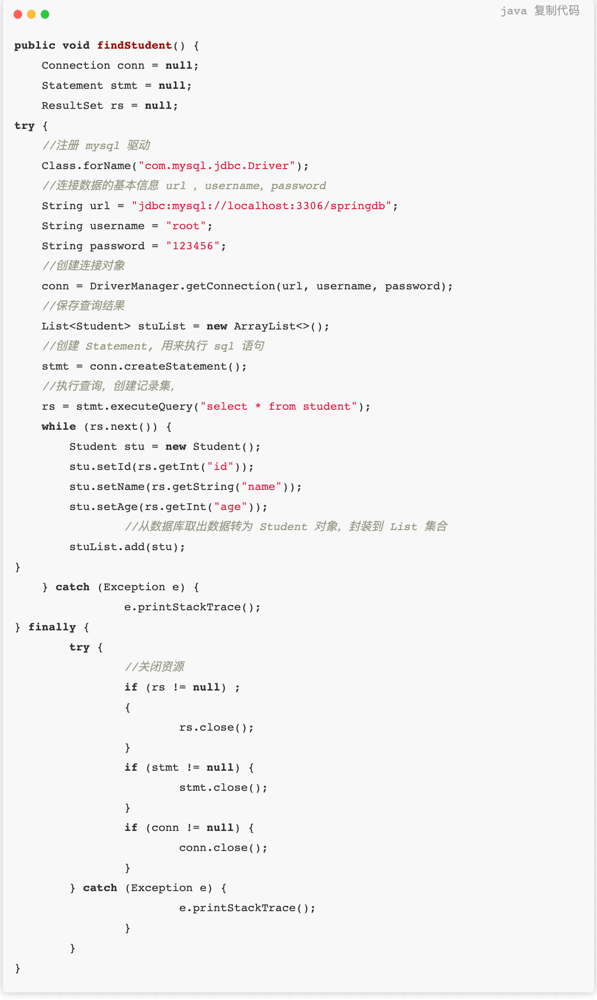
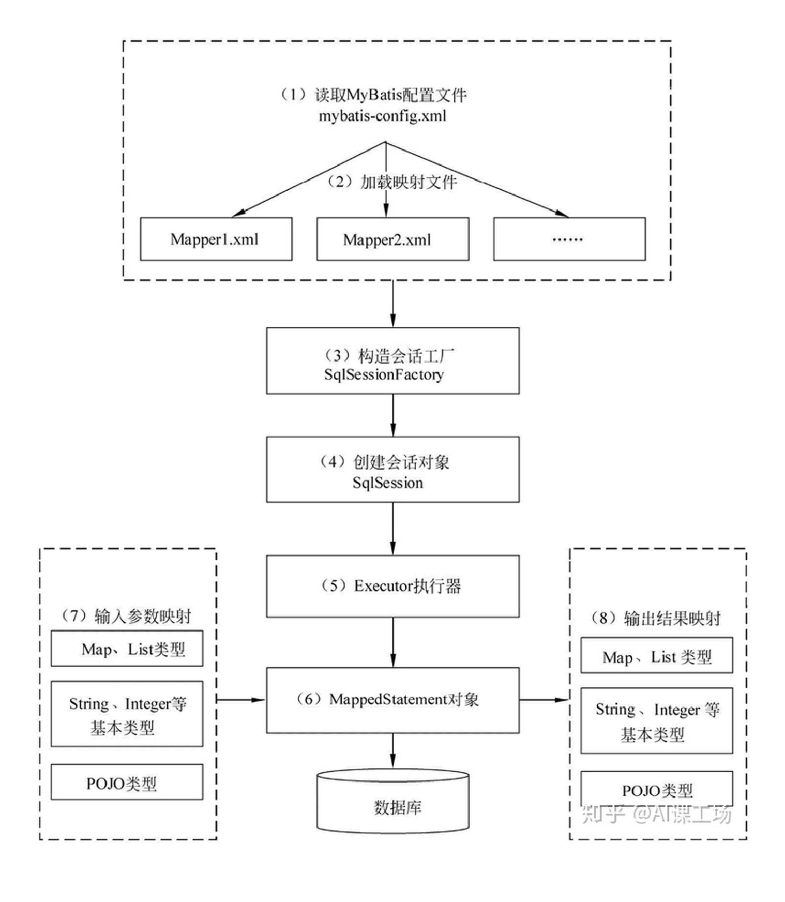
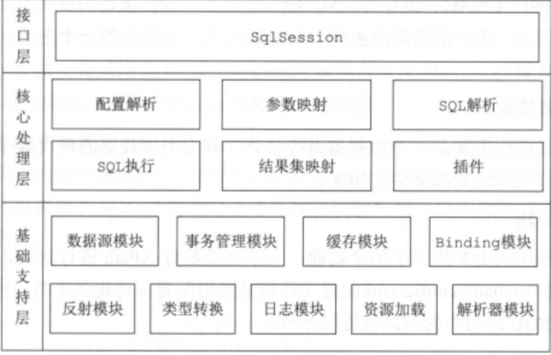
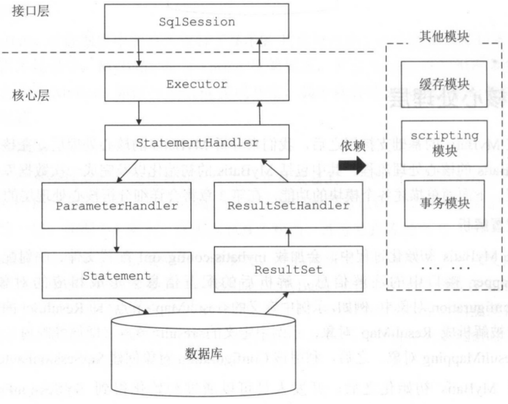

# mybatis
## 什么是mybatis
MyBatis 是一款旨在帮助开发人员屏蔽底层重复性原生 JDBC 代码的持久化框架，其支持通过映射文件配置或注解将 ResultSet 映射为 Java 对象。相对于其它 ORM 框架，MyBatis 更为轻量级，支持定制化 SQL 和动态 SQL，方便优化查询性能，同时包含了良好的缓存机制
## JDBC执行六步走
- 注册驱动
- 获取Connection连接
- 执行预编译
- 执行SQL
- 封装结果集
- 释放资源

## mybatis执行8步

			
### 步骤
1. 读取MyBatis的核心配置文件。mybatis-config.xml为MyBatis的全局配置文件，用于配置数据库连接、属性、类型别名、类型处理器、插件、环境配置、映射器（mapper.xml）等信息，这个过程中有一个比较重要的部分就是映射文件其实是配在这里的；这个核心配置文件最终会被封装成一个Configuration对象
2. 加载映射文件。映射文件即SQL映射文件，该文件中配置了操作数据库的SQL语句，映射文件是在mybatis-config.xml中加载；可以加载多个映射文件。常见的配置的方式有两种，一种是package扫描包，一种是mapper找到配置文件的位置。
3. 构造会话工厂获取SqlSessionFactory。这个过程其实是用建造者设计模式使用SqlSessionFactoryBuilder对象构建的，SqlSessionFactory的最佳作用域是应用作用域。
4. 创建会话对象SqlSession。由会话工厂创建SqlSession对象，对象中包含了执行SQL语句的所有方法，每个线程都应该有它自己的 SqlSession 实例。SqlSession的实例不是线程安全的，因此是不能被共享的，所以它的最佳的作用域是请求或方法作用域。
   1. SqlSession： 对外提供了用户和数据库之间交互需要的所有方法，隐藏了底层的细节。默认实现类是DefaultSqlSession。 
5. Executor执行器。是MyBatis的核心，负责SQL语句的生成和查询缓存的维护，它将根据SqlSession传递的参数动态地生成需要执行的SQL语句，同时负责查询缓存的维护
   1. Executor： SqlSession向用户提供操作数据库的方法，但和数据库操作有关的职责都会委托给Executor。下面是不同的实现类赋予了不同的能力
      1. SimpleExecutor -- SIMPLE 就是普通的执行器。
      2. ReuseExecutor-执行器会重用预处理语句（PreparedStatements）
      3. BatchExecutor --它是批处理执行器 
6. MappedStatement对象。MappedStatement是对解析的SQL的语句封装，一个MappedStatement代表了一个sql语句标签，如下：
   ```xml
   <!--一个动态sql标签就是一个`MappedStatement`对象-->
   <select	id="selectUserList"	resultType="com.mybatis.User"> 
   select * from t_user
   </select>
   ```
7. 输入参数映射。输入参数类型可以是基本数据类型，也可以是Map、List、POJO类型复杂数据类型，这个过程类似于JDBC的预编译处理参数的过程，有两个属性 parameterType和parameterMap
8. 封装结果集。可以封装成多种类型可以是基本数据类型，也可以是Map、List、POJO类型复杂数据类型。封装结果集的过程就和JDBC封装结果集是一样的。也有两个常用的属性resultType和resultMap。
## MyBatis 整体架构

### 基础支持层
- 反射模块：提供封装的反射 API，方便上层调用。
- 类型转换：为简化配置文件提供了别名机制，并且实现了 Java 类型和 JDBC 类型的互转。
- 日志模块：能够集成多种第三方日志框架。
- 资源加载模块：对类加载器进行封装，提供加载类文件和其它资源文件的功能。
- 数据源模块：提供数据源实现并能够集成第三方数据源模块。
- 事务管理：可以和 Spring 集成开发，对事务进行管理。
- 缓存模块：提供一级缓存和二级缓存，将部分请求拦截在缓存层。
- Binding 模块：在调用 SqlSession 相应方法执行数据库操作时，需要指定映射文件中的 SQL 节点，MyBatis 通过 Binding 模块将自定义 Mapper 接口与映射文件关联，避免拼写等错误导致在运行时才发现相应异常。
### 核心处理层

- SqlSession 接口定义了暴露给应用程序调用的 API，接口层在收到请求时会调用核心处理层的相应模块完成具体的数据库操作
- 配置解析：MyBatis 初始化时会加载配置文件、映射文件和 Mapper 接口的注解信息，解析后会以对象的形式保存到 Configuration 对象中
- SQL 解析与 scripting 模块：MyBatis 支持通过配置实现动态 SQL，即根据不同入参生成 SQL
- SQL 执行与结果解析：Executor 负责维护缓存和事务管理，并将数据库相关操作委托给 StatementHandler，ParmeterHadler 负责完成 SQL 语句的实参绑定并通过 Statement 对象执行 SQL，通过 ResultSet 返回结果，交由 ResultSetHandler 处理
## mybatis缓存
### 一级缓存（Local Cache）
在应用运行过程中，我们有可能在一次数据库会话中，执行多次查询条件完全相同的SQL，MyBatis提供了一级缓存的方案优化这部分场景，如果是相同的SQL语句，会优先命中一级缓存，避免直接对数据库进行查询，提高性能
- 每个SqlSession中持有了Executor，每个Executor中有一个LocalCache。当用户发起查询时，MyBatis根据当前执行的语句生成MappedStatement，在Local Cache进行查询，如果缓存命中的话，直接返回结果给用户，如果缓存没有命中的话，查询数据库，结果写入Local Cache，最后返回结果给用户
- 一级缓存配置
  - 开发者只需在MyBatis的配置文件中，添加如下语句，就可以使用一级缓存。共有两个选项，SESSION或者STATEMENT，默认是SESSION级别，即在一个MyBatis会话中执行的所有语句，都会共享这一个缓存。一种是STATEMENT级别，可以理解为缓存只对当前执行的这一个Statement有效
  - `<setting name="localCacheScope" value="SESSION"/>`
- 特点
  - MyBatis一级缓存的生命周期和SqlSession一致。
  - MyBatis一级缓存内部设计简单，只是一个没有容量限定的HashMap，在缓存的功能性上有所欠缺。
  - MyBatis的一级缓存最大范围是SqlSession内部，有多个SqlSession或者分布式的环境下，数据库写操作会引起脏数据，建议设定缓存级别为Statement。
  - 同一个sqlsession里update\delete都会使缓存实现
### 二级缓存
在上文中提到的一级缓存中，其最大的共享范围就是一个SqlSession内部，如果多个SqlSession之间需要共享缓存，则需要使用到二级缓存。开启二级缓存后，会使用CachingExecutor装饰Executor，进入一级缓存的查询流程前，先在CachingExecutor进行二级缓存的查询
- 二级缓存开启后，同一个namespace下的所有操作语句，都影响着同一个Cache，即二级缓存被多个SqlSession共享，是一个全局的变量。
- 当开启缓存后，数据的查询执行的流程就是 二级缓存 -> 一级缓存 -> 数据库
- 二级缓存配置
  - 在MyBatis的配置文件中开启二级缓存。`<setting name="cacheEnabled" value="true"/>`
  - 在MyBatis的映射XML中配置cache或者 cache-ref 。 cache-ref代表引用别的命名空间的Cache配置，两个命名空间的操作使用的是同一个Cache。`<cache-ref namespace="mapper.StudentMapper"/>`
- 特点
  - 当sqlsession没有调用commit()方法时，二级缓存并没有起到作用。
  - update操作会刷新该namespace下的二级缓存。
  - 二级缓存不适应用于映射文件中存在多表查询
  - 在分布式环境下，由于默认的MyBatis Cache实现都是基于本地的，分布式环境下必然会出现读取到脏数据，需要使用集中式缓存将MyBatis的Cache接口实现，有一定的开发成本，直接使用Redis、Memcached等分布式缓存可能成本更低，安全性也更高
- 建议在生产中关闭缓存，单纯作为ORM框架使用即可