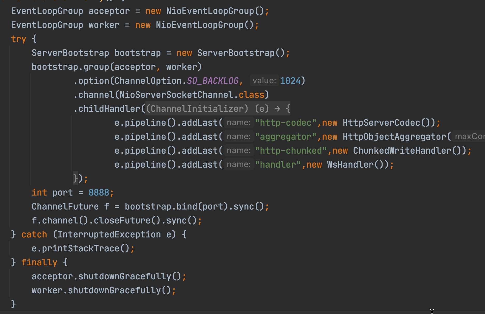
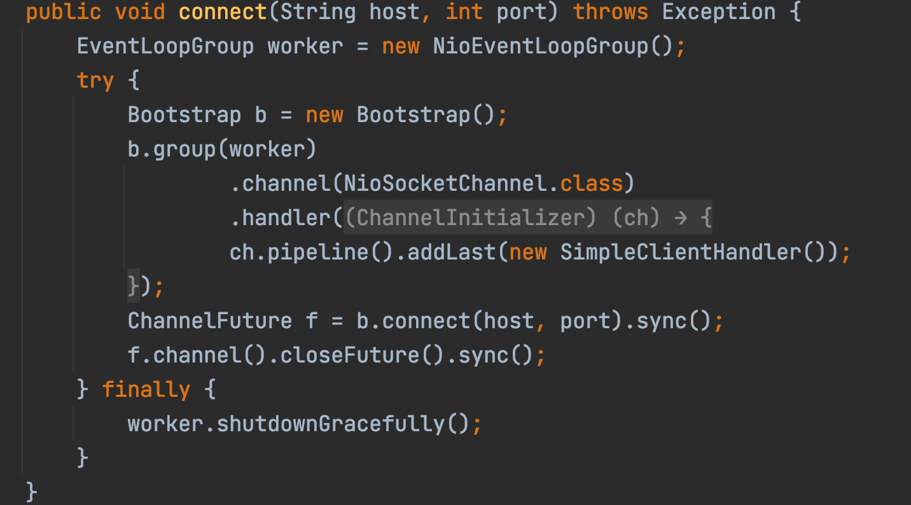

* [netty](#netty)
    * [IO模型](#io模型)
        * [一个IO操作通常包括两个阶段：](#一个io操作通常包括两个阶段)
        * [Linux/Unix五种IO模型](#linuxunix五种io模型)
            * [阻塞式 IO (Blocking IO)](#阻塞式-io-blocking-io)
            * [非阻塞式 IO (Non-blocking IO)](#非阻塞式-io-non-blocking-io)
            * [IO 复用 (I/O multiplexing)](#io-复用-io-multiplexing)
            * [信号驱动式 IO (signal driven I/O (SIGIO))](#信号驱动式-io-signal-driven-io-sigio)
            * [异步 IO (asynchronous I/O)](#异步-io-asynchronous-io)
        * [IO 复用更多介绍](#io-复用更多介绍)
    * [重要的组件](#重要的组件)
        * [Channel](#channel)
        * [ChannelFuture](#channelfuture)
        * [EventLoop](#eventloop)
        * [ChannelHandler](#channelhandler)
        * [ChannelPipeline](#channelpipeline)
    * [netty的使用示例](#netty的使用示例)
        * [服务端](#服务端)
        * [客户端](#客户端)
    * [TCP粘包/拆包问题](#tcp粘包拆包问题)
        * [什么是粘包拆包](#什么是粘包拆包)
        * [发生的原因](#发生的原因)
        * [粘包解决策略](#粘包解决策略)
        * [netty粘包问题解决方案](#netty粘包问题解决方案)
    * [解编码技术](#解编码技术)
        * [Java序列化的缺点](#java序列化的缺点)
        * [Google的protobuf](#google的protobuf)
        * [Facebook的Thrift](#facebook的thrift)
        * [JBoss的Marshalling](#jboss的marshalling)
        * [MessagePack](#messagepack)
    * [高性能的原因](#高性能的原因)
        * [非阻塞io](#非阻塞io)
        * [零拷贝](#零拷贝)
        * [内存池](#内存池)
        * [高效的Reactor线程模型](#高效的reactor线程模型)
            * [Reactor 单线程模型](#reactor-单线程模型)
            * [Reactor 多线程模型](#reactor-多线程模型)
            * [（采用）主从 Reactor 多线程模型](#采用主从-reactor-多线程模型)
        * [无锁化串行设计](#无锁化串行设计)
        * [高性能的序列化框架](#高性能的序列化框架)
        * [灵活的TCP 参数配置能力](#灵活的tcp-参数配置能力)
* [参考文章](#参考文章)

# netty
## IO模型
### 一个IO操作通常包括两个阶段：
等待数据准备好；

从内核向进程复制数据；
- 对于一个套接字上的输入操作，第一步通常涉及等待数据从网络中到达。当所等待分组到达时，它被复制到内核中的某个缓冲区。第二步就是把数据从内核缓冲区复制到应用进程缓冲区。
### Linux/Unix五种IO模型
#### 阻塞式 IO (Blocking IO)

过程
- 使用系统调用，并一直阻塞直到内核将数据准备好，之后再由内核缓冲区复制到用户态，在等待内核准备的这段时间什么也干不了
- 如图函数调用期间，一直被阻塞，直到数据准备好且从内核复制到用户程序才返回，这种IO模型为阻塞式IO。
                
优缺点
- 优点：程序简单，在阻塞等待数据期间进程/线程挂起，基本不会占用 CPU 资源。
- 缺点：每个连接需要独立的进程/线程单独处理，当并发请求量大时为了维护程序，内存、线程切换开销较大，这种模型在实际生产中很少使用。
#### 非阻塞式 IO (Non-blocking IO)
					
				
过程描述
- 内核在没有准备好数据的时候会返回错误码，而调用程序不会休眠，而是不断轮询询问内核数据是否准备好
- 下图函数调用时，如果数据没有准备好，不像阻塞式IO那样一直被阻塞，而是返回一个错误码。数据准备好时，函数成功返回。
- 应用程序对这样一个非阻塞描述符循环调用成为轮询。
- 非阻塞式IO的轮询会耗费大量cpu，通常在专门提供某一功能的系统中才会使用。通过为套接字的描述符属性设置非阻塞式，可使用该功能
                
优缺点
- 优点 不会阻塞在内核的等待数据过程，每次发起的 I/O 请求可以立即返回，不用阻塞等待，实时性较好。
- 缺点 轮询将会不断地询问内核，这将占用大量的 CPU 时间，系统资源利用率较低，所以一般 Web 服务器不使用这种 I/O 模型。
#### IO 复用 (I/O multiplexing)
					

过程描述
- 类似与非阻塞，只不过轮询不是由用户线程去执行，而是由内核去轮询，内核监听程序监听到数据准备好后，调用内核函数复制数据到用户态
- 下图中select这个系统调用，充当代理类的角色，不断轮询注册到它这里的所有需要IO的文件描述符，有结果时，把结果告诉被代理的recvfrom函数，它本尊再亲自出马去拿数据
- IO多路复用至少有两次系统调用，如果只有一个代理对象，性能上是不如前面的IO模型的，但是由于它可以同时监听很多套接字，所以性能比前两者高
- 主要是select和epoll。一个线程可以对多个IO端口进行监听，当socket有读写事件时分发到具体的线程进行处理
                
优缺点
- 优点 可以基于一个阻塞对象，同时在多个描述符上等待就绪，而不是使用多个线程(每个文件描述符一个线程)，这样可以大大节省系统资源。
- 缺点 当连接数较少时效率相比多线程+阻塞 I/O 模型效率较低，可能延迟更大，因为单个连接处理需要 2 次系统调用，占用时间会有增加
#### 信号驱动式 IO (signal driven I/O (SIGIO))
				
				
过程描述
- 信号驱动式I/O：首先我们允许Socket进行信号驱动IO,并安装一个信号处理函数，进程继续运行并不阻塞。
- 使用信号，内核在数据准备就绪时通过信号来进行通知
- 首先开启信号驱动io套接字，并使用sigaction系统调用来安装信号处理程序，内核直接返回，不会阻塞用户态
- 数据准备好时，内核会发送SIGIO信号，收到信号后开始进行io操作
                
优缺点
- 优点 线程并没有在等待数据时被阻塞，可以提高资源的利用率。
- 缺点
  - 信号 I/O 在大量 IO 操作时可能会因为信号队列溢出导致没法通知。
  - 信号驱动 I/O 尽管对于处理 UDP 套接字来说有用，即这种信号通知意味着到达一个数据报，或者返回一个异步错误。
  - 但是，对于 TCP 而言，信号驱动的 I/O 方式近乎无用，因为导致这种通知的条件为数众多，每一个来进行判别会消耗很大资源，与前几种方式相比优势尽失。
#### 异步 IO (asynchronous I/O)
					
				
过程描述
- 异步IO依赖信号处理程序来进行通知
- 不过异步IO与前面IO模型不同的是：前面的都是数据准备阶段的阻塞与非阻塞，异步IO模型通知的是IO操作已经完成，而不是数据准备完成
- 异步IO才是真正的非阻塞，主进程只负责做自己的事情，等IO操作完成(数据成功从内核缓存区复制到应用程序缓冲区)时通过回调函数对数据进行处理
- 相对于同步IO，异步IO不是顺序执行。用户进程进行aio_read系统调用之后，无论内核数据是否准备好，都会直接返回给用户进程，然后用户态进程可以去做别的事情。等到socket数据准备好了，内核直接复制数据给进程，然后从内核向进程发送通知。IO两个阶段，进程都是非阻塞的。
                
优缺点
- 优点 异步 I/O 能够充分利用 DMA 特性，让 I/O 操作与计算重叠。
- 缺点 要实现真正的异步 I/O，操作系统需要做大量的工作。目前 Windows 下通过 IOCP 实现了真正的异步 I/O。
### IO 复用更多介绍
`select`

select 函数监视的文件描述符分3类，分别是writefds、readfds、和exceptfds。调用后select函数会阻塞，直到有描述符就绪（有数据 可读、可写、或者有except），或者超时（timeout指定等待时间，如果立即返回设为null即可），函数返回。当select函数返回后，可以通过遍历fdset，来找到就绪的描述符。

`poll`

poll本质上和select没有区别，它将用户传入的数组拷贝到内核空间，然后查询每个fd对应的设备状态，如果设备就绪则在设备等待队列中加入一项并继续遍历，如果遍历完所有fd后没有发现就绪设备，则挂起当前进程，直到设备就绪或者主动超时，被唤醒后它又要再次遍历fd。这个过程经历了多次无谓的遍历。

`epoll`

epoll支持水平触发和边缘触发，最大的特点在于边缘触发，它只告诉进程哪些fd刚刚变为就绪态，并且只会通知一次。还有一个特点是，epoll使用“事件”的就绪通知方式，通过epoll_ctl注册fd，一旦该fd就绪，内核就会采用类似callback的回调机制来激活该fd，epoll_wait便可以收到通知。
## 重要的组件
### Channel
Channel 是 Netty 网络操作抽象类，它除了包括基本的 I/O 操作，如 bind、connect、read、write 之外，还包括了 Netty 框架相关的一些功能，如获取该 Channe l的 EventLoop
### ChannelFuture
Netty 为异步非阻塞，即所有的 I/O 操作都为异步的，因此，我们不能立刻得知消息是否已经被处理了。Netty 提供了 ChannelFuture 接口，通过该接口的 addListener() 方法注册一个 ChannelFutureListener，当操作执行成功或者失败时，监听就会自动触发返回结果
### EventLoop
- Netty 基于事件驱动模型，使用不同的事件来通知我们状态的改变或者操作状态的改变。它定义了在整个连接的生命周期里当有事件发生的时候处理的核心抽象
- Channel 为Netty 网络操作抽象类，EventLoop 主要是为Channel 处理 I/O 操作，两者配合参与 I/O 操作
- 当一个连接到达时，Netty 就会注册一个 Channel，然后从 EventLoopGroup 中分配一个 EventLoop 绑定到这个Channel上，在该Channel的整个生命周期中都是有这个绑定的 EventLoop 来服务的
### ChannelHandler
- ChannelHandler 为 Netty 中最核心的组件，它充当了所有处理入站和出站数据的应用程序逻辑的容器。ChannelHandler 主要用来处理各种事件，这里的事件很广泛，比如可以是连接、数据接收、异常、数据转换等。
- ChannelHandler 有两个核心子类 ChannelInboundHandler 和 ChannelOutboundHandler，其中 ChannelInboundHandler 用于接收、处理入站数据和事件，而 ChannelOutboundHandler 则相反
### ChannelPipeline
ChannelPipeline 为 ChannelHandler 链提供了一个容器并定义了用于沿着链传播入站和出站事件流的 API

一个数据或者事件可能会被多个 Handler 处理，在这个过程中，数据或者事件经流 ChannelPipeline，由 ChannelHandler 处理。在这个处理过程中，一个 ChannelHandler 接收数据后处理完成后交给下一个 ChannelHandler，或者什么都不做直接交给下一个 ChannelHandler
 
图示
			

当一个数据流进入 ChannlePipeline 时，它会从 ChannelPipeline 头部开始传给第一个 ChannelInboundHandler ，当第一个处理完后再传给下一个，一直传递到管道的尾部。与之相对应的是，当数据被写出时，它会从管道的尾部开始，先经过管道尾部的 “最后” 一个ChannelOutboundHandler，当它处理完成后会传递给前一个 ChannelOutboundHandler 。
## netty的使用示例
### 服务端
			
### 客户端

## TCP粘包/拆包问题
### 什么是粘包拆包
一个完整的包在发送过程中可能会被拆成多个包进行发送
- 启用Nagle算法（可配置是否启用）对较小的数据包进行合并
            
也可能把很多个小的包封装成一个大的包发送
### 发生的原因
应用程序write写入的字节大小大于套接口发送缓冲区的大小

进行MSS(最大报文长度)大小的TCP分段
- 当TCP报文长度-TCP头部长度>MSS的时候将发生拆包。
- MSS常常使用1460，是因为MTU最大为1500，减去IP头(20字节)和TCP头(20字节)后为1460。
            
以太网帧的payload大于MTU进行IP分片
- MTU是指IP层在一个数据包内最大能传输的字节数
- MTU= MSS+TCP层头部长度+IP层头部长度
            
服务器在接收到数据库后，放到缓冲区中，如果消息没有被及时从缓存区取走，下次在取数据的时候可能就会出现一次取出多个数据包的情况，造成粘包现象
### 粘包解决策略
- 消息定长，每个报文的大小固定为200字节不够空位补空格
- 在包尾增加回车换行符进行分割，如FTP协议
- 将消息分为消息头和消息体，消息头包含消息总长度
### netty粘包问题解决方案
- LineBasedFrameDecoder和StringDecoder解码器（按行切换的文本解码器）
  - LineBasedFrameDecoder 依次遍历ByteBuf中的可读字节，判断是否有\n或者\r\n，如果有就以此为结束位置，从可读索引到结束位置区间的字节就组成了一行
  - StringDecoder 将接受到的对象转换为字符串，然后继续调用后的Handler
  - 添加到ChannelPipeline中
- DelimiterBasedFrameDecoder以分隔符作为结束标识的解码器
- FixedLengthFrameDecoder固定长度解码器
## 解编码技术
### Java序列化的缺点
- 性能太低
- 码流太大
- 不跨语言
### Google的protobuf
### Facebook的Thrift
### JBoss的Marshalling
### MessagePack
## 高性能的原因
### 非阻塞io
采用IO多路复用技术，让多个IO的阻塞复用到一个select线程阻塞上，能有效的应对大量的并发请求
### 零拷贝
- Netty 的接收和发送 ByteBuffer 采用 DIRECT BUFFERS，使用堆外直接内存进行 Socket 读写，不需要进行字节缓冲区的二次拷贝。如果使用传统的堆内存（HEAP BUFFERS）进行 Socket 读写，JVM 会将堆内存 Buffer 拷贝一份到直接内存中，然后才写入 Socket 中。相比于堆外直接内存，消息在发送过程中多了一次缓冲区的内存拷贝。
- Netty 提供了组合 Buffer 对象，可以聚合多个 ByteBuffer 对象，用户可以像操作一个 Buffer 那样方便的对组合 Buffer 进行操作，避免了传统通过内存拷贝的方式将几个小 Buffer 合并成一个大的Buffer。
- Netty的文件传输采用了transferTo方法，它可以直接将文件缓冲区的数据发送到目标Channel，避免了传统通过循环 write 方式导致的内存拷贝问题
### 内存池
基于对象池的 ByteBuf可以重用 ByteBuf对象，内部维护了一个内存池，可以循环利用已创建的 ByteBuf，提升内存的使用效率，降低由于高负载导致的频繁GC。测试表明使用内存池后的Nety在高负载、大并发的冲击下内存和GC更加平稳
### 高效的Reactor线程模型
#### Reactor 单线程模型

流程
- Reactor内部通过 selector 监听连接事件，收到事件后通过dispatch进行分发
- 如果是连接建立的事件，通过accept接受连接，并创建一个Handler来处理连接后续的各种事件
- 如果是读写事件，直接调用连接对应的Handler来处理，Handler完成 read => (decode => compute => encode) => send 的全部流程
- 这个过程中，无论是事件监听、事件分发、还是事件处理，都始终只有 一个线程 执行所有的事情
                
缺点
- 在请求过多时，会无法支撑。因为只有一个线程，无法发挥多核CPU性能。
- 而且一旦某个Handler发生阻塞，服务端就完全无法处理其他连接事件
#### Reactor 多线程模型
					
流程
- 这种模型和第一种模型的主要区别是把业务处理从之前的单一线程脱离出来，换成线程池处理。
- Reactor线程 通过select监听客户请求，如果是连接建立的事件，通过accept接受连接，并创建一个Handler来处理连接后续的读写事件。这里的Handler只负责响应事件、read和write事件，会将具体的业务处理交由Worker线程池处理
  - 只处理连接事件、读写事件
- Worker线程池 处理所有业务事件，包括(decode => compute => encode) 过程
充分利用多核机器的资源，提高性能

缺点
- 在极个别特殊场景中，一个Reactor线程负责监听和处理所有的客户端连接可能会存在性能问题。例如并发百万客户端连接(双十一、春运抢票)
#### （采用）主从 Reactor 多线程模型

流程
- 服务端用于接收客户端连接的不再是1个单独的NIO线程，而是一个独立的NIO线程池
- 比起第二种模型，它是将Reactor分成两部分
  - mainReactor负责监听server socket，用来处理网络IO连接建立操作，将建立的socketChannel指定注册给subReactor。
  - subReactor主要做和建立起来的socket做数据交互和事件业务处理操作。通常，subReactor个数上可与CPU个数等同。
- 消息处理流程
  - 从主线程池中随机选择一个Reactor线程作为acceptor线程，用于绑定监听端口，接收客户端连接
  - acceptor线程接收客户端连接请求之后创建新的SocketChannel，将其注册到主线程池的其它Reactor线程上，由其负责接入认证、IP黑白名单过滤、握手等操作
  - 步骤2完成之后，业务层的链路正式建立，将SocketChannel从主线程池的Reactor线程的多路复用器上摘除，重新注册到Sub线程池的线程上，并创建一个Handler用于处理各种连接事件
  - 当有新的事件发生时，SubReactor会调用连接对应的Handler进行响应
  - Handler通过Read读取数据后，会分发给后面的Worker线程池进行业务处理
  - Worker线程池会分配独立的线程完成真正的业务处理，如何将响应结果发给Handler进行处理
  - Handler收到响应结果后通过Send将响应结果返回给Client
### 无锁化串行设计
消息的处理尽可能在一个线程内完成，期间不进行线程切换，避免了多线程竞争和同步锁的使用
### 高性能的序列化框架
Netty 默认提供了对Google Protobuf 的支持，通过扩展Netty 的编解码接口，可以实现其它的高性能序列化框架
### 灵活的TCP 参数配置能力
合理设置TCP 参数在某些场景下对于性能的提升可以起到显著的效果，例如SO_RCVBUF 和SO_SNDBUF。如果设置不当，对性能的影响是非常大的
- SO_RCVBUF 和SO_SNDBUF：通常建议值为128K 或者256K；
- SO_TCPNODELAY：NAGLE 算法通过将缓冲区内的小封包自动相连，组成较大的封包，阻止大量小封包的发送阻塞网络，从而提高网络应用效率。但是对于时延敏感的应用场景需要关闭该优化算法；
- 软中断：如果Linux 内核版本支持RPS（2.6.35 以上版本），开启RPS 后可以实现软中断，提升网络吞吐量。RPS根据数据包的源地址，目的地址以及目的和源端口，计算出一个hash 值，然后根据这个hash 值来选择软中断运行的cpu，从上层来看，也就是说将每个连接和cpu 绑定，并通过这个hash 值，来均衡软中断在多个cpu 上，提升网络并行处理性能

# 参考文章
- https://blog.csdn.net/chenssy/article/details/78703551