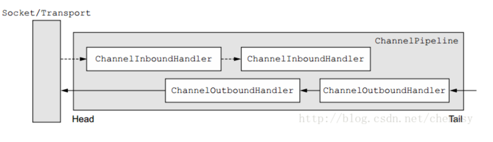

* [netty](#netty)
    * [重要的组件](#重要的组件)
        * [Channel](#channel)
        * [ChannelFuture](#channelfuture)
        * [EventLoop](#eventloop)
        * [ChannelHandler](#channelhandler)
        * [ChannelPipeline](#channelpipeline)
    * [netty的使用示例](#netty的使用示例)
        * [服务端](#服务端)
        * [客户端](#客户端)
    * [TCP粘包/拆包问题](#tcp粘包拆包问题)
        * [什么是粘包拆包](#什么是粘包拆包)
        * [发生的原因](#发生的原因)
        * [粘包解决策略](#粘包解决策略)
        * [netty粘包问题解决方案](#netty粘包问题解决方案)
    * [解编码技术](#解编码技术)
        * [Java序列化的缺点](#java序列化的缺点)
        * [Google的protobuf](#google的protobuf)
        * [Facebook的Thrift](#facebook的thrift)
        * [JBoss的Marshalling](#jboss的marshalling)
        * [MessagePack](#messagepack)
    * [高性能的原因](#高性能的原因)
        * [非阻塞io](#非阻塞io)
        * [零拷贝](#零拷贝)
        * [内存池](#内存池)
        * [高效的Reactor线程模型](#高效的reactor线程模型)
            * [Reactor 单线程模型](#reactor-单线程模型)
            * [Reactor 多线程模型](#reactor-多线程模型)
            * [（采用）主从 Reactor 多线程模型](#采用主从-reactor-多线程模型)
        * [无锁化串行设计](#无锁化串行设计)
        * [高性能的序列化框架](#高性能的序列化框架)
        * [灵活的TCP 参数配置能力](#灵活的tcp-参数配置能力)
* [参考文章](#参考文章)


# netty
## 重要的组件
### Channel
Channel 是 Netty 网络操作抽象类，它除了包括基本的 I/O 操作，如 bind、connect、read、write 之外，还包括了 Netty 框架相关的一些功能，如获取该 Channe l的 EventLoop
### ChannelFuture
Netty 为异步非阻塞，即所有的 I/O 操作都为异步的，因此，我们不能立刻得知消息是否已经被处理了。Netty 提供了 ChannelFuture 接口，通过该接口的 addListener() 方法注册一个 ChannelFutureListener，当操作执行成功或者失败时，监听就会自动触发返回结果
### EventLoop
- Netty 基于事件驱动模型，使用不同的事件来通知我们状态的改变或者操作状态的改变。它定义了在整个连接的生命周期里当有事件发生的时候处理的核心抽象
- Channel 为Netty 网络操作抽象类，EventLoop 主要是为Channel 处理 I/O 操作，两者配合参与 I/O 操作
- 当一个连接到达时，Netty 就会注册一个 Channel，然后从 EventLoopGroup 中分配一个 EventLoop 绑定到这个Channel上，在该Channel的整个生命周期中都是有这个绑定的 EventLoop 来服务的
### ChannelHandler
- ChannelHandler 为 Netty 中最核心的组件，它充当了所有处理入站和出站数据的应用程序逻辑的容器。ChannelHandler 主要用来处理各种事件，这里的事件很广泛，比如可以是连接、数据接收、异常、数据转换等。
- ChannelHandler 有两个核心子类 ChannelInboundHandler 和 ChannelOutboundHandler，其中 ChannelInboundHandler 用于接收、处理入站数据和事件，而 ChannelOutboundHandler 则相反
### ChannelPipeline
ChannelPipeline 为 ChannelHandler 链提供了一个容器并定义了用于沿着链传播入站和出站事件流的 API

一个数据或者事件可能会被多个 Handler 处理，在这个过程中，数据或者事件经流 ChannelPipeline，由 ChannelHandler 处理。在这个处理过程中，一个 ChannelHandler 接收数据后处理完成后交给下一个 ChannelHandler，或者什么都不做直接交给下一个 ChannelHandler
 
图示
			

当一个数据流进入 ChannlePipeline 时，它会从 ChannelPipeline 头部开始传给第一个 ChannelInboundHandler ，当第一个处理完后再传给下一个，一直传递到管道的尾部。与之相对应的是，当数据被写出时，它会从管道的尾部开始，先经过管道尾部的 “最后” 一个ChannelOutboundHandler，当它处理完成后会传递给前一个 ChannelOutboundHandler 。
## netty的使用示例
### 服务端
```java
public void startNetty() {
    EventLoopGroup acceptor = new NioEventLoopGroup();
    EventLoopGroup worker = new NioEventLoopGroup();
    try {
        ServerBootstrap bootstrap = new ServerBootstrap();
        bootstrap.group(acceptor, worker)
                .option(ChannelOption.SO_BACKLOG, 1024)
                .channel(NioServerSocketChannel.class)
                .childHandler(new ChannelInitializer<SocketChannel>() {
                    @Override
                    public void initChannel(SocketChannel e) throws Exception {
                        e.pipeline().addLast("http-codec",new HttpServerCodec());
                        e.pipeline().addLast("aggregator",new HttpObjectAggregator(65536));
                        e.pipeline().addLast("http-chunked",new ChunkedWriteHandler());
                        e.pipeline().addLast("handler",new WsHandler());
                    }
                });
        int port = 8888;
        ChannelFuture f = bootstrap.bind(port).sync();
        f.channel().closeFuture().sync();
    } catch (InterruptedException e) {
        e.printStackTrace();
    } finally {
        acceptor.shutdownGracefully();
        worker.shutdownGracefully();
    }

}
```
### 客户端
```java
public void connect(String host, int port) throws Exception {
    EventLoopGroup worker = new NioEventLoopGroup();
    try {
        Bootstrap b = new Bootstrap();
        b.group(worker)
                .channel(NioSocketChannel.class)
                .handler(new ChannelInitializer<SocketChannel>() {
                    @Override
                    public void initChannel(SocketChannel ch) throws Exception {
                        ch.pipeline().addLast(new SimpleClientHandler());
                    }
                });
        ChannelFuture f = b.connect(host, port).sync();
        f.channel().closeFuture().sync();
    } finally {
        worker.shutdownGracefully();
    }
}
```
## TCP粘包/拆包问题
### 什么是粘包拆包
一个完整的包在发送过程中可能会被拆成多个包进行发送
- 启用Nagle算法（可配置是否启用）对较小的数据包进行合并
            
也可能把很多个小的包封装成一个大的包发送
### 发生的原因
应用程序write写入的字节大小大于套接口发送缓冲区的大小

进行MSS(最大报文长度)大小的TCP分段
- 当TCP报文长度-TCP头部长度>MSS的时候将发生拆包。
- MSS常常使用1460，是因为MTU最大为1500，减去IP头(20字节)和TCP头(20字节)后为1460。
            
以太网帧的payload大于MTU进行IP分片
- MTU是指IP层在一个数据包内最大能传输的字节数
- MTU= MSS+TCP层头部长度+IP层头部长度
            
服务器在接收到数据后，放到缓冲区中，如果消息没有被及时从缓存区取走，下次在取数据的时候可能就会出现一次取出多个数据包的情况，造成粘包现象
### 粘包解决策略
- 消息定长，每个报文的大小固定为200字节不够空位补空格
- 在包尾增加回车换行符进行分割，如FTP协议
- 将消息分为消息头和消息体，消息头包含消息总长度
### netty粘包问题解决方案
- LineBasedFrameDecoder和StringDecoder解码器（按行切换的文本解码器）
  - LineBasedFrameDecoder 依次遍历ByteBuf中的可读字节，判断是否有\n或者\r\n，如果有就以此为结束位置，从可读索引到结束位置区间的字节就组成了一行
  - StringDecoder 将接收到的对象转换为字符串，然后继续调用后的Handler
  - 添加到ChannelPipeline中
- DelimiterBasedFrameDecoder以分隔符作为结束标识的解码器
- FixedLengthFrameDecoder固定长度解码器
## 解编码技术
### Java序列化的缺点
- 性能太低
- 码流太大
- 不跨语言
### Google的protobuf
### Facebook的Thrift
### JBoss的Marshalling
### MessagePack
## 高性能的原因
### 非阻塞io
采用IO多路复用技术，让多个IO的阻塞复用到一个select线程阻塞上，能有效的应对大量的并发请求
### 零拷贝
- Netty 的接收和发送 ByteBuffer 采用 DIRECT BUFFERS，使用堆外直接内存进行 Socket 读写，不需要进行字节缓冲区的二次拷贝。如果使用传统的堆内存（HEAP BUFFERS）进行 Socket 读写，JVM 会将堆内存 Buffer 拷贝一份到直接内存中，然后才写入 Socket 中。相比于堆外直接内存，消息在发送过程中多了一次缓冲区的内存拷贝。
- Netty 提供了组合 Buffer 对象，可以聚合多个 ByteBuffer 对象，用户可以像操作一个 Buffer 那样方便的对组合 Buffer 进行操作，避免了传统通过内存拷贝的方式将几个小 Buffer 合并成一个大的Buffer。
- Netty的文件传输采用了transferTo方法，它可以直接将文件缓冲区的数据发送到目标Channel，避免了传统通过循环 write 方式导致的内存拷贝问题
### 内存池
基于对象池的 ByteBuf可以重用 ByteBuf对象，内部维护了一个内存池，可以循环利用已创建的 ByteBuf，提升内存的使用效率，降低由于高负载导致的频繁GC。测试表明使用内存池后的Nety在高负载、大并发的冲击下内存和GC更加平稳
### 高效的Reactor线程模型
#### Reactor 单线程模型


流程
- Reactor 对象通过 Select 监控客户端请求事件，收到事件后通过 Dispatch 进行分发。
- 如果是建立连接请求事件，则由 Acceptor 通过 Accept 处理连接请求，然后创建一个 Handler 对象处理连接完成后的后续业务处理。
- 如果不是建立连接事件，则 Reactor 会分发调用连接对应的 Handler 来响应。
- Handler 会完成 Read→业务处理→Send 的完整业务流程。这个过程中，无论是事件监听、事件分发、还是事件处理，都始终只有 一个线程 执行所有的事情

优点：模型简单，没有多线程、进程通信、竞争的问题，全部都在一个线程中完成。

缺点：性能问题，只有一个线程，无法完全发挥多核 CPU 的性能。Handler 在处理某个连接上的业务时，整个进程无法处理其他连接事件，很容易导致性能瓶颈。

可靠性问题，线程意外跑飞，或者进入死循环，会导致整个系统通信模块不可用，不能接收和处理外部消息，造成节点故障。

使用场景：客户端的数量有限，业务处理非常快速，比如 Redis，业务处理的时间复杂度 O(1)。
#### Reactor 多线程模型
					
流程
- Reactor 对象通过 Select 监控客户端请求事件，收到事件后通过 Dispatch 进行分发。
- 如果是建立连接请求事件，则由 Acceptor 通过 Accept 处理连接请求，然后创建一个 Handler 对象处理连接完成后续的各种事件。
- 如果不是建立连接事件，则 Reactor 会分发调用连接对应的 Handler 来响应。
- Handler 只负责响应事件，不做具体业务处理，通过 Read 读取数据后，会分发给后面的 Worker 线程池进行业务处理。
- Worker 线程池会分配独立的线程完成真正的业务处理，如何将响应结果发给 Handler 进行处理。
- Handler 收到响应结果后通过 Send 将响应结果返回给 Client。

优点：可以充分利用多核 CPU 的处理能力。

缺点：多线程数据共享和访问比较复杂；Reactor 承担所有事件的监听和响应，在单线程中运行，高并发场景下容易成为性能瓶颈。

#### （采用）主从 Reactor 多线程模型


流程
- Reactor 主线程 MainReactor 对象通过 Select 监控建立连接事件，收到事件后通过 Acceptor 接收，处理建立连接事件。
- Acceptor 处理建立连接事件后，MainReactor 将连接分配 Reactor 子线程给 SubReactor 进行处理。
- SubReactor 将连接加入连接队列进行监听，并创建一个 Handler 用于处理各种连接事件。
- 当有新的事件发生时，SubReactor 会调用连接对应的 Handler 进行响应。
- Handler 通过 Read 读取数据后，会分发给后面的 Worker 线程池进行业务处理。
- Worker 线程池会分配独立的线程完成真正的业务处理，如何将响应结果发给 Handler 进行处理。
- Handler 收到响应结果后通过 Send 将响应结果返回给 Client。

优点：父线程与子线程的数据交互简单职责明确，父线程只需要接收新连接，子线程完成后续的业务处理。

父线程与子线程的数据交互简单，Reactor 主线程只需要把新连接传给子线程，子线程无需返回数据。

这种模型在许多项目中广泛使用，包括 Nginx 主从 Reactor 多进程模型，Memcached 主从多线程，Netty 主从多线程模型的支持。
### 无锁化串行设计
消息的处理尽可能在一个线程内完成，期间不进行线程切换，避免了多线程竞争和同步锁的使用
### 高性能的序列化框架
Netty 默认提供了对Google Protobuf 的支持，通过扩展Netty 的编解码接口，可以实现其它的高性能序列化框架
### 灵活的TCP 参数配置能力
合理设置TCP 参数在某些场景下对于性能的提升可以起到显著的效果，例如SO_RCVBUF 和SO_SNDBUF。如果设置不当，对性能的影响是非常大的
- SO_RCVBUF 和SO_SNDBUF：通常建议值为128K 或者256K；
- SO_TCPNODELAY：NAGLE 算法通过将缓冲区内的小封包自动相连，组成较大的封包，阻止大量小封包的发送阻塞网络，从而提高网络应用效率。但是对于时延敏感的应用场景需要关闭该优化算法；
- 软中断：如果Linux 内核版本支持RPS（2.6.35 以上版本），开启RPS 后可以实现软中断，提升网络吞吐量。RPS根据数据包的源地址，目的地址以及目的和源端口，计算出一个hash 值，然后根据这个hash 值来选择软中断运行的cpu，从上层来看，也就是说将每个连接和cpu 绑定，并通过这个hash 值，来均衡软中断在多个cpu 上，提升网络并行处理性能

# 参考文章
- https://blog.csdn.net/chenssy/article/details/78703551
- https://www.baiyp.ren/Linux%E7%BA%BF%E7%A8%8B%E6%A8%A1%E5%9E%8B.html