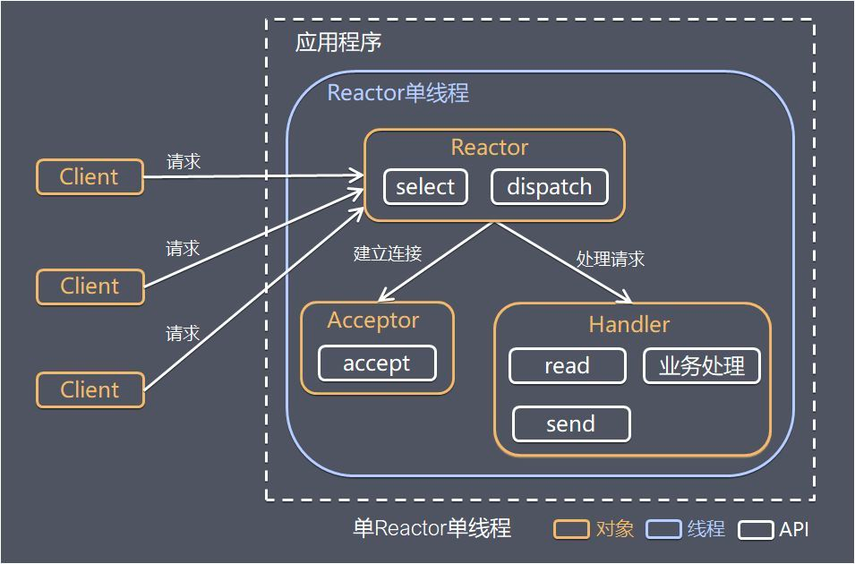

* [netty](#netty)
    * [重要的组件](#重要的组件)
        * [Channel](#channel)
        * [ChannelFuture](#channelfuture)
        * [EventLoop](#eventloop)
        * [ChannelHandler](#channelhandler)
        * [ChannelPipeline](#channelpipeline)
    * [netty的使用示例](#netty的使用示例)
        * [服务端](#服务端)
        * [客户端](#客户端)
    * [TCP粘包/拆包问题](#tcp粘包拆包问题)
        * [什么是粘包拆包](#什么是粘包拆包)
        * [发生的原因](#发生的原因)
        * [粘包解决策略](#粘包解决策略)
        * [netty粘包问题解决方案](#netty粘包问题解决方案)
    * [解编码技术](#解编码技术)
        * [Java序列化的缺点](#java序列化的缺点)
        * [Google的protobuf](#google的protobuf)
        * [Facebook的Thrift](#facebook的thrift)
        * [JBoss的Marshalling](#jboss的marshalling)
        * [MessagePack](#messagepack)
    * [高性能的原因](#高性能的原因)
        * [非阻塞io](#非阻塞io)
        * [零拷贝](#零拷贝)
        * [内存池](#内存池)
        * [高效的Reactor线程模型](#高效的reactor线程模型)
            * [Reactor 单线程模型](#reactor-单线程模型)
            * [Reactor 多线程模型](#reactor-多线程模型)
            * [（采用）主从 Reactor 多线程模型](#采用主从-reactor-多线程模型)
        * [无锁化串行设计](#无锁化串行设计)
        * [高性能的序列化框架](#高性能的序列化框架)
        * [灵活的TCP 参数配置能力](#灵活的tcp-参数配置能力)
* [参考文章](#参考文章)


# netty
## 重要的组件
### Channel
Channel 是 Netty 网络操作抽象类，它除了包括基本的 I/O 操作，如 bind、connect、read、write 之外，还包括了 Netty 框架相关的一些功能，如获取该 Channe l的 EventLoop
### ChannelFuture
Netty 为异步非阻塞，即所有的 I/O 操作都为异步的，因此，我们不能立刻得知消息是否已经被处理了。Netty 提供了 ChannelFuture 接口，通过该接口的 addListener() 方法注册一个 ChannelFutureListener，当操作执行成功或者失败时，监听就会自动触发返回结果
### EventLoop
- Netty 基于事件驱动模型，使用不同的事件来通知我们状态的改变或者操作状态的改变。它定义了在整个连接的生命周期里当有事件发生的时候处理的核心抽象
- Channel 为Netty 网络操作抽象类，EventLoop 主要是为Channel 处理 I/O 操作，两者配合参与 I/O 操作
- 当一个连接到达时，Netty 就会注册一个 Channel，然后从 EventLoopGroup 中分配一个 EventLoop 绑定到这个Channel上，在该Channel的整个生命周期中都是有这个绑定的 EventLoop 来服务的
### ChannelHandler
- ChannelHandler 为 Netty 中最核心的组件，它充当了所有处理入站和出站数据的应用程序逻辑的容器。ChannelHandler 主要用来处理各种事件，这里的事件很广泛，比如可以是连接、数据接收、异常、数据转换等。
- ChannelHandler 有两个核心子类 ChannelInboundHandler 和 ChannelOutboundHandler，其中 ChannelInboundHandler 用于接收、处理入站数据和事件，而 ChannelOutboundHandler 则相反
### ChannelPipeline
Netty 的 ChannelPipeline，它维护了一个 ChannelHandler 责任链，负责拦截或者处理 inbound（入站）和 outbound（出站）的事件和操作。这一节给出更深层次的描述。

ChannelPipeline 实现了一种高级形式的拦截过滤器模式，使用户可以完全控制事件的处理方式，以及 Channel 中各个 ChannelHandler 如何相互交互。

每个 Netty Channel 包含了一个 ChannelPipeline（其实 Channel 和 ChannelPipeline 互相引用），而 ChannelPipeline 又维护了一个由 ChannelHandlerContext 构成的双向循环列表，其中的每一个 ChannelHandlerContext 都包含一个 ChannelHandler。（前文描述的时候为了简便，直接说 ChannelPipeline 包含了一个 ChannelHandler 责任链，这里给出完整的细节。）


rContext、ChannelHandler、Channel、ChannelPipeline 这几个组件之间互相引用，互为各自的属性，你中有我、我中有你。

在处理入站事件的时候，入站事件及数据会从 Pipeline 中的双向链表的头 ChannelHandlerContext 流向尾 ChannelHandlerContext，并依次在其中每个 ChannelInboundHandler（例如解码 Handler）中得到处理；出站事件及数据会从 Pipeline 中的双向链表的尾 ChannelHandlerContext 流向头 ChannelHandlerContext，并依次在其中每个 ChannelOutboundHandler（例如编码 Handler）中得到处理。


### Netty 的 TaskQueue
在 Netty 的每一个 NioEventLoop 中都有一个 TaskQueue，设计它的目的是在任务提交的速度大于线程的处理速度的时候起到缓冲作用。或者用于异步地处理 Selector 监听到的 IO 事件


Netty 中的任务队列有三种使用场景：

1. 处理用户程序的自定义普通任务的时候
2. 处理用户程序的自定义定时任务的时候
3. 非当前 Reactor 线程调用当前 Channel 的各种方法的时候。

## netty的使用示例
### 服务端
```java
public void startNetty() {
    EventLoopGroup acceptor = new NioEventLoopGroup();
    EventLoopGroup worker = new NioEventLoopGroup();
    try {
        ServerBootstrap bootstrap = new ServerBootstrap();
        bootstrap.group(acceptor, worker)
                .option(ChannelOption.SO_BACKLOG, 1024)
                .channel(NioServerSocketChannel.class)
                .childHandler(new ChannelInitializer<SocketChannel>() {
                    @Override
                    public void initChannel(SocketChannel e) throws Exception {
                        e.pipeline().addLast("http-codec",new HttpServerCodec());
                        e.pipeline().addLast("aggregator",new HttpObjectAggregator(65536));
                        e.pipeline().addLast("http-chunked",new ChunkedWriteHandler());
                        e.pipeline().addLast("handler",new WsHandler());
                    }
                });
        int port = 8888;
        ChannelFuture f = bootstrap.bind(port).sync();
        f.channel().closeFuture().sync();
    } catch (InterruptedException e) {
        e.printStackTrace();
    } finally {
        acceptor.shutdownGracefully();
        worker.shutdownGracefully();
    }

}
```
### 客户端
```java
public void connect(String host, int port) throws Exception {
    EventLoopGroup worker = new NioEventLoopGroup();
    try {
        Bootstrap b = new Bootstrap();
        b.group(worker)
                .channel(NioSocketChannel.class)
                .handler(new ChannelInitializer<SocketChannel>() {
                    @Override
                    public void initChannel(SocketChannel ch) throws Exception {
                        ch.pipeline().addLast(new SimpleClientHandler());
                    }
                });
        ChannelFuture f = b.connect(host, port).sync();
        f.channel().closeFuture().sync();
    } finally {
        worker.shutdownGracefully();
    }
}
```
## 服务端 Netty 的工作架构图


关于这张图，作以下几点说明：

1. Netty 抽象出两组线程池：BossGroup 和 WorkerGroup，也可以叫做 BossNioEventLoopGroup 和 WorkerNioEventLoopGroup。每个线程池中都有 NioEventLoop 线程。BossGroup 中的线程专门负责和客户端建立连接，WorkerGroup 中的线程专门负责处理连接上的读写。BossGroup 和 WorkerGroup 的类型都是 NioEventLoopGroup。
2. NioEventLoopGroup 相当于一个事件循环组，这个组中含有多个事件循环，每个事件循环就是一个 NioEventLoop。
3. NioEventLoop 表示一个不断循环的执行事件处理的线程，每个 NioEventLoop 都包含一个 Selector，用于监听注册在其上的 Socket 网络连接（Channel）。
4. NioEventLoopGroup 可以含有多个线程，即可以含有多个 NioEventLoop。
5. 每个 BossNioEventLoop 中循环执行以下三个步骤：
   1. select：轮训注册在其上的 ServerSocketChannel 的 accept 事件（OP_ACCEPT 事件）
   2. processSelectedKeys：处理 accept 事件，与客户端建立连接，生成一个 NioSocketChannel，并将其注册到某个 WorkerNioEventLoop 上的 Selector 上
   3. runAllTasks：再去以此循环处理任务队列中的其他任务
6. 每个 WorkerNioEventLoop 中循环执行以下三个步骤：
   1. select：轮训注册在其上的 NioSocketChannel 的 read/write 事件（OP_READ/OP_WRITE 事件）
   2. processSelectedKeys：在对应的 NioSocketChannel 上处理 read/write 事件
   3. runAllTasks：再去以此循环处理任务队列中的其他任务
7. 在以上两个processSelectedKeys步骤中，会使用 Pipeline（管道），Pipeline 中引用了 Channel，即通过 Pipeline 可以获取到对应的 Channel，Pipeline 中维护了很多的处理器（拦截处理器、过滤处理器、自定义处理器等）。这里暂时不详细展开讲解 Pipeline。

## TCP粘包/拆包问题
### 什么是粘包拆包
一个完整的包在发送过程中可能会被拆成多个包进行发送
- 启用Nagle算法（可配置是否启用）对较小的数据包进行合并
            
也可能把很多个小的包封装成一个大的包发送
### 发生的原因
应用程序write写入的字节大小大于套接口发送缓冲区的大小

进行MSS(最大报文长度)大小的TCP分段
- 当TCP报文长度-TCP头部长度>MSS的时候将发生拆包。
- MSS常常使用1460，是因为MTU最大为1500，减去IP头(20字节)和TCP头(20字节)后为1460。
            
以太网帧的payload大于MTU进行IP分片
- MTU是指IP层在一个数据包内最大能传输的字节数
- MTU= MSS+TCP层头部长度+IP层头部长度
            
服务器在接收到数据后，放到缓冲区中，如果消息没有被及时从缓存区取走，下次在取数据的时候可能就会出现一次取出多个数据包的情况，造成粘包现象
### 粘包解决策略
- 消息定长，每个报文的大小固定为200字节不够空位补空格
- 在包尾增加回车换行符进行分割，如FTP协议
- 将消息分为消息头和消息体，消息头包含消息总长度
### netty粘包问题解决方案
- LineBasedFrameDecoder和StringDecoder解码器（按行切换的文本解码器）
  - LineBasedFrameDecoder 依次遍历ByteBuf中的可读字节，判断是否有\n或者\r\n，如果有就以此为结束位置，从可读索引到结束位置区间的字节就组成了一行
  - StringDecoder 将接收到的对象转换为字符串，然后继续调用后的Handler
  - 添加到ChannelPipeline中
- DelimiterBasedFrameDecoder以分隔符作为结束标识的解码器
- FixedLengthFrameDecoder固定长度解码器
## 解编码技术
### Java序列化的缺点
- 性能太低
- 码流太大
- 不跨语言
### Google的protobuf
### Facebook的Thrift
### JBoss的Marshalling
### MessagePack
## 高性能的原因
### 非阻塞io
采用IO多路复用技术，让多个IO的阻塞复用到一个select线程阻塞上，能有效的应对大量的并发请求
### 零拷贝
- Netty 的接收和发送 ByteBuffer 采用 DIRECT BUFFERS，使用堆外直接内存进行 Socket 读写，不需要进行字节缓冲区的二次拷贝。如果使用传统的堆内存（HEAP BUFFERS）进行 Socket 读写，JVM 会将堆内存 Buffer 拷贝一份到直接内存中，然后才写入 Socket 中。相比于堆外直接内存，消息在发送过程中多了一次缓冲区的内存拷贝。
- Netty 提供了组合 Buffer 对象，可以聚合多个 ByteBuffer 对象，用户可以像操作一个 Buffer 那样方便的对组合 Buffer 进行操作，避免了传统通过内存拷贝的方式将几个小 Buffer 合并成一个大的Buffer。
- Netty的文件传输采用了transferTo方法，它可以直接将文件缓冲区的数据发送到目标Channel，避免了传统通过循环 write 方式导致的内存拷贝问题
### 内存池
基于对象池的 ByteBuf可以重用 ByteBuf对象，内部维护了一个内存池，可以循环利用已创建的 ByteBuf，提升内存的使用效率，降低由于高负载导致的频繁GC。测试表明使用内存池后的Nety在高负载、大并发的冲击下内存和GC更加平稳
### 高效的Reactor线程模型
#### Reactor 单线程模型


流程
- Reactor 对象通过 Select 监控客户端请求事件，收到事件后通过 Dispatch 进行分发。
- 如果是建立连接请求事件，则由 Acceptor 通过 Accept 处理连接请求，然后创建一个 Handler 对象处理连接完成后的后续业务处理。
- 如果不是建立连接事件，则 Reactor 会分发调用连接对应的 Handler 来响应。
- Handler 会完成 Read→业务处理→Send 的完整业务流程。这个过程中，无论是事件监听、事件分发、还是事件处理，都始终只有 一个线程 执行所有的事情

优点：模型简单，没有多线程、进程通信、竞争的问题，全部都在一个线程中完成。

缺点：性能问题，只有一个线程，无法完全发挥多核 CPU 的性能。Handler 在处理某个连接上的业务时，整个进程无法处理其他连接事件，很容易导致性能瓶颈。

可靠性问题，线程意外跑飞，或者进入死循环，会导致整个系统通信模块不可用，不能接收和处理外部消息，造成节点故障。

使用场景：客户端的数量有限，业务处理非常快速，比如 Redis，业务处理的时间复杂度 O(1)。
#### Reactor 多线程模型


流程
- Reactor 对象通过 Select 监控客户端请求事件，收到事件后通过 Dispatch 进行分发。
- 如果是建立连接请求事件，则由 Acceptor 通过 Accept 处理连接请求，然后创建一个 Handler 对象处理连接完成后续的各种事件。
- 如果不是建立连接事件，则 Reactor 会分发调用连接对应的 Handler 来响应。
- Handler 只负责响应事件，不做具体业务处理，通过 Read 读取数据后，会分发给后面的 Worker 线程池进行业务处理。
- Worker 线程池会分配独立的线程完成真正的业务处理，如何将响应结果发给 Handler 进行处理。
- Handler 收到响应结果后通过 Send 将响应结果返回给 Client。

优点：可以充分利用多核 CPU 的处理能力。

缺点：多线程数据共享和访问比较复杂；Reactor 承担所有事件的监听和响应，在单线程中运行，高并发场景下容易成为性能瓶颈。

#### （采用）主从 Reactor 多线程模型


流程
- Reactor 主线程 MainReactor 对象通过 Select 监控建立连接事件，收到事件后通过 Acceptor 接收，处理建立连接事件。
- Acceptor 处理建立连接事件后，MainReactor 将连接分配 Reactor 子线程给 SubReactor 进行处理。
- SubReactor 将连接加入连接队列进行监听，并创建一个 Handler 用于处理各种连接事件。
- 当有新的事件发生时，SubReactor 会调用连接对应的 Handler 进行响应。
- Handler 通过 Read 读取数据后，会分发给后面的 Worker 线程池进行业务处理。
- Worker 线程池会分配独立的线程完成真正的业务处理，如何将响应结果发给 Handler 进行处理。
- Handler 收到响应结果后通过 Send 将响应结果返回给 Client。

优点：父线程与子线程的数据交互简单职责明确，父线程只需要接收新连接，子线程完成后续的业务处理。

父线程与子线程的数据交互简单，Reactor 主线程只需要把新连接传给子线程，子线程无需返回数据。

这种模型在许多项目中广泛使用，包括 Nginx 主从 Reactor 多进程模型，Memcached 主从多线程，Netty 主从多线程模型的支持。
### 无锁化串行设计
消息的处理尽可能在一个线程内完成，期间不进行线程切换，避免了多线程竞争和同步锁的使用
### 高性能的序列化框架
Netty 默认提供了对Google Protobuf 的支持，通过扩展Netty 的编解码接口，可以实现其它的高性能序列化框架
### 灵活的TCP 参数配置能力
合理设置TCP 参数在某些场景下对于性能的提升可以起到显著的效果，例如SO_RCVBUF 和SO_SNDBUF。如果设置不当，对性能的影响是非常大的
- SO_RCVBUF 和SO_SNDBUF：通常建议值为128K 或者256K；
- SO_TCPNODELAY：NAGLE 算法通过将缓冲区内的小封包自动相连，组成较大的封包，阻止大量小封包的发送阻塞网络，从而提高网络应用效率。但是对于时延敏感的应用场景需要关闭该优化算法；
- 软中断：如果Linux 内核版本支持RPS（2.6.35 以上版本），开启RPS 后可以实现软中断，提升网络吞吐量。RPS根据数据包的源地址，目的地址以及目的和源端口，计算出一个hash 值，然后根据这个hash 值来选择软中断运行的cpu，从上层来看，也就是说将每个连接和cpu 绑定，并通过这个hash 值，来均衡软中断在多个cpu 上，提升网络并行处理性能


## JUC线程池和Netty线程池在架构设计上有什么区别？
JUC线程池（Java Util Concurrent线程池）和Netty线程池都是用于管理和复用线程的工具，但它们的架构设计有一些区别：

1. 任务执行方式：JUC线程池是基于阻塞队列的方式执行任务，即将任务放入队列中，然后等待线程来取出并执行任务。而Netty线程池则是基于事件循环的方式执行任务，即通过事件的触发来执行相应的任务。
2. 线程数量的管理：JUC线程池中线程的数量是固定的，由程序员手动设置。而Netty线程池中线程的数量是动态的，可以根据负载情况自动调整。
3. 线程池的结构：JUC线程池是一个单一的线程池，所有的任务都是由同一个线程池管理。而Netty线程池采用了多级线程池的结构，即将线程池分成多个层级，不同的层级负责不同的任务，从而提高了性能和效率。
4. 线程池的作用范围：JUC线程池是一个通用的线程池，可以用于任何类型的应用程序。而Netty线程池是专门为网络应用程序设计的，它使用了一些专门的技术来提高网络通信的效率和性能。

总的来说，JUC线程池更加通用，适用于各种类型的应用程序，而Netty线程池则专门针对网络应用程序进行了优化，能够更好地提高网络通信的效率和性能。


## netty的线程池设计中，是如何实现线程懒加载的
在Netty的线程池设计中，实现线程懒加载主要是通过ChannelPipeline的设计来实现的。

在Netty中，每个Channel都有一个ChannelPipeline，ChannelPipeline由一系列的ChannelHandler组成，每个ChannelHandler都会处理ChannelPipeline中的事件。当一个Channel被创建时，其对应的ChannelPipeline并不会立即创建并初始化所有的ChannelHandler，而是等到第一次有事件触发时才进行初始化。

当有事件发生时，Netty会从线程池中获取一个空闲的线程来执行ChannelPipeline中的ChannelHandler，如果线程池中没有空闲线程，则会根据需要创建新的线程。在这个过程中，线程池会根据负载情况动态调整线程的数量。

由于ChannelPipeline的设计，Netty能够实现线程懒加载，即只有在有事件发生时才会创建和初始化ChannelHandler和对应的线程。这样能够有效地减少线程的创建和销毁，提高了线程的利用率，同时也能够节省系统资源。

## netty的选择器策略设定的目的是什么
Netty是一个基于NIO（非阻塞I/O）的网络框架，它使用Java的选择器（Selector）来实现事件驱动的网络编程。在Netty中，选择器策略的设定是为了实现更好的网络性能和可靠性。

选择器策略指定了Netty如何处理网络事件，包括连接、读、写和异常等。它的目的是通过调整选择器策略来提高网络的吞吐量和响应速度，并减少网络故障的风险。

具体来说，选择器策略的设定会影响以下方面：

1. 网络吞吐量：选择器策略决定了Netty如何处理网络事件，它可以影响事件处理的效率和网络吞吐量。例如，如果选择的策略是轮询（Round Robin）方式，那么Netty将按照连接的顺序依次处理事件，这种方式可能会导致某些连接被阻塞，从而降低整个网络的吞吐量。
2. 响应速度：选择器策略也会影响Netty的响应速度。如果选择的策略是优先级（Priority）方式，那么Netty将优先处理重要的事件，这种方式可以提高网络的响应速度。
3. 网络故障：选择器策略还可以影响网络故障的风险。例如，如果选择的策略是故障转移（Failover）方式，那么Netty将在一个连接失败时自动切换到另一个可用的连接，从而提高网络的可靠性。

因此，选择器策略的设定对于Netty的性能和可靠性都非常重要，需要根据实际的应用场景来选择最适合的策略。

## nioeventloop可以处理普通任务、定时任务以及IO事件，具体的流程是什么
NioEventLoop是Netty中的一个关键组件，它负责处理所有的I/O事件、定时任务和普通任务。下面是NioEventLoop处理这些任务的具体流程：

1. 初始化：当NioEventLoop创建时，它会初始化一些必要的变量和数据结构，包括选择器（Selector）和任务队列（Task Queue）等。
2. 运行循环：NioEventLoop会进入一个无限循环中，不断地处理I/O事件、定时任务和普通任务。在循环的每个周期内，NioEventLoop会执行以下步骤：
   1. 处理I/O事件：NioEventLoop会从选择器中获取已经就绪的I/O事件，并将其分发到相应的ChannelHandler中进行处理。具体来说，NioEventLoop会调用ChannelHandler的相应方法（如channelRead()）来处理读取事件、写入事件和连接事件等。
   2. 处理定时任务：NioEventLoop会检查当前是否有定时任务需要执行。如果有，它会从定时任务队列中获取任务，并执行相应的操作。例如，如果定时任务是定时发送心跳包，则NioEventLoop会将心跳包发送到相应的服务器。
   3. 处理普通任务：NioEventLoop还可以处理普通任务，包括用户自定义的任务和Netty内部的任务。当有普通任务需要执行时，NioEventLoop会将其加入到任务队列中，并在下一个周期中执行。
   4. 处理关闭事件：如果NioEventLoop被关闭，则循环会停止并退出。
3. 优化：NioEventLoop还会执行一些优化操作，例如调整I/O事件的顺序、批量处理任务、调整定时任务的延迟等，以提高系统的性能和响应速度。

总体来说，NioEventLoop采用一个高效的事件循环模型，通过不断地处理I/O事件、定时任务和普通任务，实现了高性能、低延迟的网络通信。

## eventloop可以对于多个channel，两者之间是如何绑定的
在Netty中，一个EventLoop对象可以被多个Channel对象共享，而一个Channel对象也只会绑定到一个EventLoop对象上。这种关系是通过EventLoopGroup来建立的。

在Netty中，每个EventLoopGroup对象都包含一个或多个EventLoop对象，而每个EventLoop对象则维护着一个选择器（Selector）以及一个任务队列（TaskQueue）。当一个Channel对象被创建时，它会被绑定到一个EventLoop对象上，而EventLoop对象则负责处理该Channel上的所有事件。

多个Channel对象可以共享一个EventLoop对象，因为EventLoop对象内部使用的是事件循环机制。EventLoop对象会维护一个任务队列，以此来处理Channel对象的所有事件。当多个Channel对象共享一个EventLoop对象时，它们的事件会被加入到同一个任务队列中，并由同一个EventLoop对象来处理。

在Netty中，Channel对象和EventLoop对象之间的绑定关系是通过EventLoopGroup对象来实现的，EventLoopGroup对象会根据一定的算法选择一个EventLoop对象来绑定Channel对象，这种绑定关系是动态的，可以随着系统负载的变化而自动调整。这样做的目的是为了最大化地利用系统资源，提高系统的性能和稳定性。

## 什么是水平触发，什么是边缘触发
水平触发（Level-Triggered）和边缘触发（Edge-Triggered）是两种不同的IO事件触发模式，常用于IO多路复用中。

水平触发是指在IO事件未被处理的情况下，只要该IO事件的状态处于“可读”或“可写”状态，系统就会不断地通知该IO事件的处理程序去处理该事件。也就是说，水平触发是在IO事件状态未变化的情况下，不断地通知事件处理程序去处理事件。通常情况下，IO事件的状态变化比较频繁，因此水平触发的方式会不断地触发事件处理程序，导致系统资源的浪费。

边缘触发是指只有在IO事件状态发生变化时才会通知事件处理程序去处理该事件。也就是说，边缘触发是在IO事件状态发生变化时，才触发事件处理程序去处理事件。由于边缘触发只在事件状态变化时触发事件处理程序，因此可以避免不必要的事件处理，减少系统资源的浪费，提高系统性能。

在Netty中，默认情况下采用的是水平触发的方式，但也提供了边缘触发的选项。边缘触发需要调用ChannelOption.TCP_NODELAY方法来设置，一旦设置了边缘触发模式，Netty就会在事件状态变化时触发事件处理程序去处理事件。

Java NIO（New IO）使用的是水平触发（Level-Triggered）的方式，也就是说，只要IO事件的状态处于“可读”或“可写”状态，系统就会不断地通知该IO事件的处理程序去处理该事件，直到该事件被处理完成。Java NIO是通过Selector来实现多路复用，Selector会不断地轮询已经注册的Channel，当Channel有就绪事件时，Selector就会通知事件处理程序去处理该事件。因此，Java NIO使用的是水平触发的方式，而非边缘触发。

## netty的AttributeKey、AttributeMap和Attribute
在Netty中，AttributeKey、AttributeMap和Attribute都是用于在Channel和ChannelHandlerContext之间共享数据的机制。

AttributeKey是一个类似于Map中的键值对，可以被用于在Channel和ChannelHandlerContext之间存储和共享数据。每个AttributeKey对象都对应一个唯一的key值。

AttributeMap是一个接口，表示一个存储Attribute对象的容器。它是一个可扩展的接口，定义了一些常用的方法，如添加、获取和删除Attribute对象等。在Netty中，Channel和ChannelHandlerContext都实现了AttributeMap接口，因此都可以用于存储和共享数据。

Attribute是一个类，它是AttributeMap中的一个元素。每个Attribute对象都与一个唯一的AttributeKey相关联，可以用于在Channel和ChannelHandlerContext之间存储和共享数据。在Netty中，Attribute对象通过AttributeMap接口的方法进行添加、获取和删除等操作。

通过使用AttributeKey、AttributeMap和Attribute，Netty提供了一种方便的机制，可以在不同的Channel和ChannelHandlerContext之间共享数据，实现了数据在不同组件之间的传递和共享。

## netty的fastThreadLocal fast在什么地方
在Netty中，FastThreadLocal是一个高性能的ThreadLocal实现，其中的Fast表示其具有较高的性能。

与JDK提供的ThreadLocal相比，FastThreadLocal具有更快的访问速度和更低的内存占用，这是由于它的底层实现方式不同。JDK的ThreadLocal底层使用的是Map数据结构，而FastThreadLocal则使用的是数组，通过使用数组可以避免Map的开销。

在FastThreadLocal的底层实现中，每个线程都有自己的数组，这些数组中存储了该线程对应的FastThreadLocal变量的值。这样，在访问线程局部变量时，不需要进行同步操作，从而提高了访问的性能。

因此，FastThreadLocal在Netty中被称为“Fast”，因为它能够提供更快的线程局部变量的访问速度和更低的内存占用，从而提高了Netty的性能表现。

## guava和netty的异步回调模式
Guava和Netty都提供了异步回调模式的支持。

在Guava中，异步回调模式的核心是ListenableFuture接口，它表示一个异步操作的结果，并且可以通过注册回调函数的方式获取异步操作的结果。ListenableFuture是一个可监听的Future，可以在异步操作完成后触发回调函数，从而实现异步回调的功能。

在Netty中，异步回调模式的核心是ChannelFuture接口，它表示一个I/O操作的结果，并且可以通过注册回调函数的方式获取I/O操作的结果。ChannelFuture也是一个可监听的Future，可以在I/O操作完成后触发回调函数，从而实现异步回调的功能。

虽然Guava和Netty都提供了异步回调模式的支持，但它们在实现上有一些不同。Guava的异步回调模式更加通用，可以应用于任何异步操作，而Netty的异步回调模式则是针对I/O操作的，因此更加专业化。

此外，在使用上，Guava的异步回调模式可以通过Futures.addCallback()方法注册回调函数，而Netty的异步回调模式则可以通过ChannelFuture.addListener()方法注册回调函数。

## handler是怎么连接起来的
在Netty中，Handler是事件处理器，用于处理与Channel相关的事件。多个Handler被组成一个ChannelPipeline，构成事件处理器链。ChannelPipeline是Netty中处理事件的核心组件之一，通过它将多个Handler串联在一起，形成一个处理事件的链条。每个Channel都有一个ChannelPipeline。

当一个Channel的I/O事件发生时，事件将被传递到ChannelPipeline中，从而被事件处理器链中的某个Handler进行处理。事件处理器链中的每个Handler都可以决定将事件传递到下一个Handler，或者将事件截止在当前Handler。这个过程类似于Java中的责任链模式，每个Handler负责处理一部分事件，然后将其传递给下一个Handler。

在Netty中，ChannelPipeline中的Handler是有序的，每个Handler都有自己的名字（name），通过名字可以唯一标识一个Handler。当一个新的Handler被加入到ChannelPipeline中时，它会被插入到ChannelPipeline的指定位置。ChannelPipeline会维护Handler的顺序，并保证事件按照顺序依次被处理。

在创建ChannelPipeline时，可以通过addFirst()、addLast()、addBefore()、addAfter()等方法来添加Handler，这些方法会根据不同的位置要求将Handler插入到事件处理器链的不同位置。

在ChannelPipeline中，Handler之间的连接是通过ChannelHandlerContext实现的。ChannelHandlerContext是ChannelPipeline中的一个上下文对象，它维护了ChannelPipeline中的一些状态信息，以及当前Handler在ChannelPipeline中的位置。当一个Handler需要将事件传递给下一个Handler时，它会通过ChannelHandlerContext来获得下一个Handler的引用，从而完成事件的传递。因此，ChannelHandlerContext在事件处理器链中扮演了一个关键的角色，它将不同的Handler连接起来，形成一个处理事件的链条。

# 参考文章
- https://blog.csdn.net/chenssy/article/details/78703551
- https://www.baiyp.ren/Linux%E7%BA%BF%E7%A8%8B%E6%A8%A1%E5%9E%8B.html
- https://cloud.tencent.com/developer/article/1754078