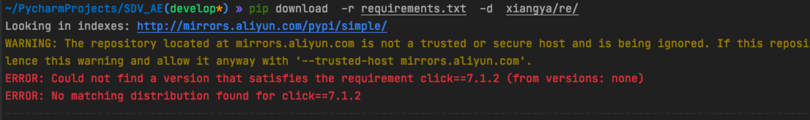

* [Python](#python)
    * [如何离线移植依赖包](#如何离线移植依赖包)
        * [现有环境导出](#现有环境导出)
            * [导出依赖目录到文件](#导出依赖目录到文件)
            * [下载requirements.txt中的包到本地](#下载requirementstxt中的包到本地)
        * [导入新环境](#导入新环境)
            * [将本地下载的paks文件的依赖拷贝到服务器](#将本地下载的paks文件的依赖拷贝到服务器)
            * [安装](#安装)

# Python

## 如何离线移植依赖包

### 现有环境导出
#### 导出依赖目录到文件
```shell
pip freeze > requirements.txt
```
#### 下载requirements.txt中的包到本地
```shell
pip download --platform linux_x86_64 --no-deps -r requirements.txt -d /tmp/paks/

# --platform linux_x86_64 指定下载的是Linux环境的包 因为本地可能是windows、MAC OS 但是服务器是Linux
# -d 指定下载保存的目录
```

如果出现下面错误：

在后面加上参数 --trusted-host mirrors.aliyun.com
```shell
pip download --platform linux_x86_64 --no-deps -r requirements.txt -d /tmp/paks/ --trusted-host mirrors.aliyun.com 
```
### 导入新环境

#### 将本地下载的paks文件的依赖拷贝到服务器
#### 安装
#### 
```shell
pip install --no-index --find-links=/home/pyenv/paks -r requirements.txt
# /home/pyenv是拷贝到的文件夹
```