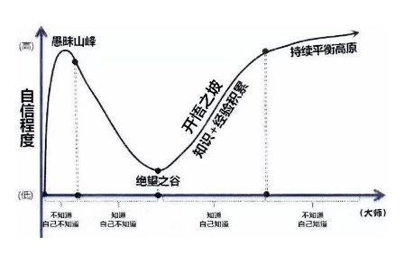

<h1 align="center">JavaDeveloperBrain:mortar_board:</h1>

[comment]: <> ([![GitHub issues]&#40;https://img.shields.io/github/issues/Swayingleaves/JavaDeveloperBrain?style=for-the-badge&#41;]&#40;https://github.com/Swayingleaves/JavaDeveloperBrain/issues&#41;)

Java工程师必备：包含计算机网络知识、JavaSE、JVM、Spring、Springboot、SpringCloud、Mybatis、多线程并发、netty、MySQL、MongoDB、Elasticsearch、Redis、HBASE、RabbitMQ、RocketMQ、Pulsar、Kafka、Zookeeper、Linux、设计模式、智力题、项目架构、分布式相关、算法、面试题

---
<h3 align="center">不白嫖，来个star:star2::star2::star2:</h3>

# Features

- [x] 将目录里的xMind文件转为md文件 
- [ ] 将一些难以文字描述的东东画图
- [ ] 添加新知识点 :man_technologist:
- [ ] 添加新模块:收集面试题和解答他们:man_technologist:
- [ ] 优化知识点描述，现在有些知识点真的只是记下来了，但是没有整理导致别人看起来很乱不知所云 :man_technologist:

# 内容概览

[comment]: <> (

)
[comment]: <> (
)
## <a>Java-基础部分</a>
 - [基本类型](Java-基础/Java类型.md)
 - [包装类型](Java-基础/Java类型.md)
 - [关键字](Java-基础/Java关键字.md)
 - [Object](Java-基础/Object.md)
 - [String](Java-基础/String.md)
 - [数组](Java-基础/数组.md)
 - [继承](Java-基础/继承.md)
 - [反射](Java-基础/反射.md)
 - [异常](Java-基础/异常.md)
 - [泛型](Java-基础/泛型.md)
 - [容器](#)
   - [List](Java-基础/容器-collection.md#list)
     - [Vector](Java-基础/容器-collection.md#vector)
     - [LinkedList](Java-基础/容器-collection.md#linkedlist)
     - [ArrayList](Java-基础/容器-collection.md#arraylist)
     - [CopyOnWriteArrayList](Java-基础/容器-collection.md#copyonwritearraylist)
   - [Set](Java-基础/容器-collection.md#set)
     - [HashSet](Java-基础/容器-collection.md#hashset)
     - [LinkedHashSet](Java-基础/容器-collection.md#linkedhashset)
     - [TreeSet](Java-基础/容器-collection.md#treeset)
   - [queue](Java-基础/容器-collection.md#queue)
   - [Map](Java-基础/容器-map.md#map)
     - [HashMap](Java-基础/容器-map.md#hashmap)
     - [LinkedHashMap](Java-基础/容器-map.md#linkedhashmap)
     - [TreeMap](Java-基础/容器-map.md#treemap)
     - [ConcurrentHashMap](Java-基础/容器-map.md#concurrenthashmap)
     - [IdentityHashMap](Java-基础/容器-map.md#identityhashmap)
     - [WeakHashMap](Java-基础/容器-map.md#weakhashmap)
 - [Java-IO](Java-基础/JavaIO.md)
   - [文件io](Java-基础/JavaIO.md#文件io)
   - [网络io](Java-基础/JavaIO.md#网络io)
   - [NIO](Java-基础/JavaIO.md#nio)
 - [Java长期支持版本新特性](Java-基础/Java长期支持版本.md)

## <a>Java-JVM</a>

- [内存结构](Java-JVM/内存结构.md)
  - [程序计数器](Java-JVM/内存结构.md#程序计数器)
  - [Java虚拟机栈](Java-JVM/内存结构.md#java虚拟机栈)
  - [本地方法栈](Java-JVM/内存结构.md#本地方法栈)
  - [堆](Java-JVM/内存结构.md#堆)
  - [方法区](Java-JVM/内存结构.md#方法区)
  - [运行时常量池](Java-JVM/内存结构.md#运行时常量池)
  - [直接内存](Java-JVM/内存结构.md#直接内存)
- [垃圾回收](Java-JVM/垃圾回收.md)
  - [判断一个对象能否被回收](Java-JVM/垃圾回收.md#判断一个对象能否被回收)
    - [引用计数法](Java-JVM/垃圾回收.md#引用计数法)
    - [可达性算法](Java-JVM/垃圾回收.md#可达性算法)
  - [哪些可以作为是根节点](Java-JVM/垃圾回收.md#哪些可以作为是根节点)
  - [分代收集理论](Java-JVM/垃圾回收.md#分代收集理论)
  - [GC定义](Java-JVM/垃圾回收.md#gc定义)
    - [新生代收集（Minor GC/Young GC）](Java-JVM/垃圾回收.md#新生代收集minor-gcyoung-gc)
    - [老年代收集（Major GC/Old GC）](Java-JVM/垃圾回收.md#老年代收集major-gcold-gc)
    - [混合收集（Mixed GC）](Java-JVM/垃圾回收.md#混合收集mixed-gc)
    - [整堆收集（Full GC）](Java-JVM/垃圾回收.md#整堆收集full-gc)
  - [回收算法](Java-JVM/垃圾回收.md#回收算法)
    - [标记-清除](Java-JVM/垃圾回收.md#标记-清除)
    - [标记-复制](Java-JVM/垃圾回收.md#标记-复制)
    - [标记-整理](Java-JVM/垃圾回收.md#标记-整理)
  - [Hotspot算法实现细节](Java-JVM/垃圾回收.md#hotspot算法实现细节)
    - [根节点枚举GC Roots](Java-JVM/垃圾回收.md#根节点枚举gc-roots)
    - [安全点Safe Point](Java-JVM/垃圾回收.md#安全点safe-point)
    - [安全区域Safe Region](Java-JVM/垃圾回收.md#安全区域safe-region)
    - [记忆集Remembered Set与卡表Card Table](Java-JVM/垃圾回收.md#记忆集remembered-set与卡表card-table)
    - [写屏障Write Barrier](Java-JVM/垃圾回收.md#写屏障write-barrier)
  - [并发的可达性分析](Java-JVM/垃圾回收.md#并发的可达性分析)
    - [为什么需要并发标记](Java-JVM/垃圾回收.md#为什么需要并发标记)
    - [三色标记Tri-color Marking](Java-JVM/垃圾回收.md#三色标记tri-color-marking)
      - [什么是三色标记](Java-JVM/垃圾回收.md#什么是三色标记)
  - [垃圾回收器](Java-JVM/垃圾回收.md#垃圾回收器)
    - [Serial收集器](Java-JVM/垃圾回收.md#serial收集器)
    - [ParNew收集器](Java-JVM/垃圾回收.md#parnew收集器)
    - [ParallelScavenge收集器](Java-JVM/垃圾回收.md#parallelscavenge收集器)
    - [SerialOld收集器](Java-JVM/垃圾回收.md#serialold收集器)
    - [ParallelOld收集器](Java-JVM/垃圾回收.md#parallelold收集器)
    - [CMS收集器](Java-JVM/垃圾回收.md#cms收集器)
    - [G1收集器](Java-JVM/垃圾回收.md#g1收集器)
    - [ZGC收集器](Java-JVM/垃圾回收.md#zgc收集器)
- [内存分配与回收策略](Java-JVM/内存分配与回收策略.md)
  - [对象优先在 Eden 分配](Java-JVM/内存分配与回收策略.md#对象优先在-eden-分配)
  - [大对象直接进入老年代](Java-JVM/内存分配与回收策略.md#大对象直接进入老年代)
  - [长期存活的对象进入老年代](Java-JVM/内存分配与回收策略.md#长期存活的对象进入老年代)
  - [动态对象年龄判定](Java-JVM/内存分配与回收策略.md#动态对象年龄判定)
  - [空间分配担保](Java-JVM/内存分配与回收策略.md#空间分配担保)
- [类加载机制](Java-JVM/类加载机制.md)
  - [有哪些类加载器](Java-JVM/类加载机制.md#有哪些类加载器)
    - [1.引导类加载器 bootstrap classloader](Java-JVM/类加载机制.md#1引导类加载器-bootstrap-classloader)
    - [2.扩展类加载器 extensions classloader](Java-JVM/类加载机制.md#2扩展类加载器-extensions-classloader)
    - [3.应用程序类加载器 application classloader](Java-JVM/类加载机制.md#3应用程序类加载器-application-classloader)
    - [4.自定义类加载器 java.lang.classloder](Java-JVM/类加载机制.md#4自定义类加载器-javalangclassloder)
  - [生命周期](Java-JVM/类加载机制.md#生命周期)
    - [1. 加载](Java-JVM/类加载机制.md#1-加载)
    - [2. 验证](Java-JVM/类加载机制.md#2-验证)
    - [3. 准备](Java-JVM/类加载机制.md#3-准备)
    - [4. 解析](Java-JVM/类加载机制.md#4-解析)
    - [5. 初始化](Java-JVM/类加载机制.md#5-初始化)
  - [双亲委派模型](Java-JVM/类加载机制.md#双亲委派模型)
    - [怎么打破双亲委派模型？](Java-JVM/类加载机制.md#怎么打破双亲委派模型)
- [JVM调优](Java-JVM/JVM调优.md)
  - [原则](Java-JVM/JVM调优.md#原则)
  - [jvm调优](Java-JVM/JVM调优.md#jvm调优)
  - [JVM调优目标](Java-JVM/JVM调优.md#jvm调优目标)
  - [JVM调优的步骤](Java-JVM/JVM调优.md#jvm调优的步骤)
  - [JVM参数解析及调优](Java-JVM/JVM调优.md#jvm参数解析及调优)
- [Java即时编译](Java-JVM/Java即时编译.md)
  - [什么是](Java-JVM/Java即时编译.md#什么是)
  - [Java的执行过程](Java-JVM/Java即时编译.md#java的执行过程)
  - [1.JVM中的编译器](Java-JVM/Java即时编译.md#1jvm中的编译器)
    - [Client Compiler](Java-JVM/Java即时编译.md#client-compiler)
    - [Server Compiler](Java-JVM/Java即时编译.md#server-compiler)
  - [2.分层编译](Java-JVM/Java即时编译.md#2分层编译)
  - [3.即时编译的触发](Java-JVM/Java即时编译.md#3即时编译的触发)
  - [编译优化](Java-JVM/Java即时编译.md#编译优化)
    - [1. 中间表达形式（Intermediate Representation）](Java-JVM/Java即时编译.md#1-中间表达形式intermediate-representation)
    - [2.方法内联](Java-JVM/Java即时编译.md#2方法内联)
    - [3. 逃逸分析](Java-JVM/Java即时编译.md#3-逃逸分析)
      - [1、锁消除](Java-JVM/Java即时编译.md#1锁消除)
      - [2、栈上分配](Java-JVM/Java即时编译.md#2栈上分配)
      - [3、标量替换](Java-JVM/Java即时编译.md#3标量替换)
      - [4、部分逃逸分析](Java-JVM/Java即时编译.md#4部分逃逸分析)
    - [4. Loop Transformations](Java-JVM/Java即时编译.md#4-loop-transformations)
      - [1、循环展开](Java-JVM/Java即时编译.md#1循环展开)
      - [2、循环分离](Java-JVM/Java即时编译.md#2循环分离)
    - [5. 窥孔优化与寄存器分配](Java-JVM/Java即时编译.md#5-窥孔优化与寄存器分配)
 
## <a>Java-多线程</a>

- [线程](Java-多线程/线程.md)
  - [线程的生命状态](Java-多线程/线程.md#线程的生命状态)
    - [新建new](Java-多线程/线程.md#新建new)
    - [可运行runnable](Java-多线程/线程.md#可运行runnable)
    - [阻塞blocked](Java-多线程/线程.md#阻塞blocked)
    - [等待waiting](Java-多线程/线程.md#等待waiting)
    - [期限等待timed waiting](Java-多线程/线程.md#期限等待timed-waiting)
    - [死亡terminated](Java-多线程/线程.md#死亡terminated)
  - [使用线程](Java-多线程/线程.md#使用线程)
      * [继承Thread](Java-多线程/线程.md#继承thread)
      * [实现Runnable接口](Java-多线程/线程.md#实现runnable接口)
      * [实现Callable接口](Java-多线程/线程.md#实现callable接口)
      * [Callable如何返回值的](Java-多线程/线程.md#callable如何返回值的)
      * [FutureTask](Java-多线程/线程.md#futuretask)
  * [线程基本方法](Java-多线程/线程.md#线程基本方法)
      * [wait](Java-多线程/线程.md#wait)
      * [sleep](Java-多线程/线程.md#sleep)
      * [yield](Java-多线程/线程.md#yield)
      * [interrupt](Java-多线程/线程.md#interrupt)
      * [join](Java-多线程/线程.md#join)
      * [notify](Java-多线程/线程.md#notify)
      * [await() signal() signalAll()](Java-多线程/线程.md#await-signal-signalall)
  * [Java里怎么保证多个线程的互斥性](Java-多线程/线程.md#java里怎么保证多个线程的互斥性)
      * [什么是互斥](Java-多线程/线程.md#什么是互斥)
      * [衍生出来就是线程怎么同步的问题](Java-多线程/线程.md#衍生出来就是线程怎么同步的问题)
      * [什么是同步](Java-多线程/线程.md#什么是同步)
  * [线程和进程的区别](Java-多线程/线程.md#线程和进程的区别)
  * [怎么让多个线程有序执行](Java-多线程/线程.md#怎么让多个线程有序执行)
      * [join方法](Java-多线程/线程.md#join方法)
      * [线程池](Java-多线程/线程.md#线程池)
      * [lock-condition](Java-多线程/线程.md#lock-condition)
  * [Java线程和操作系统的线程区别](Java-多线程/线程.md#java线程和操作系统的线程区别)
      * [Java线程在操作系统上本质](Java-多线程/线程.md#java线程在操作系统上本质)
      * [操作系统中的进程（线程）状态](Java-多线程/线程.md#操作系统中的进程线程状态)
      * [操作系统中线程和Java线程状态的关系](Java-多线程/线程.md#操作系统中线程和java线程状态的关系)
- [volatile](Java-多线程/volatile.md)
  * [机器内存模型](Java-多线程/volatile.md#机器内存模型)
    * [多核下的缓存一致性问题](Java-多线程/volatile.md#多核下的缓存一致性问题)
    * [指令重排](Java-多线程/volatile.md#指令重排)
  * [JMM](Java-多线程/volatile.md#jmm)
      * [模型](Java-多线程/volatile.md#模型)
      * [要保证的三个特性](Java-多线程/volatile.md#要保证的三个特性)
      * [happens-before 原则](Java-多线程/volatile.md#happens-before-原则)
  * [作用](Java-多线程/volatile.md#作用)
      * [可见性](Java-多线程/volatile.md#可见性)
      * [禁止指令重排](Java-多线程/volatile.md#禁止指令重排)
  * [volatile解决可见性的代码](Java-多线程/volatile.md#volatile解决可见性的代码)
  * [验证volatile不具备原子性](Java-多线程/volatile.md#验证volatile不具备原子性)
- [Java对象头](Java-多线程/Java对象头.md)
- [锁机制](Java-多线程/锁机制.md)
  * [Synchronized](Java-多线程/锁机制.md#synchronized)
    * [原理](Java-多线程/锁机制.md#原理)
    * [Synchronized的语义底层是通过一个monitor的对象来完成](Java-多线程/锁机制.md#synchronized的语义底层是通过一个monitor的对象来完成)
    * [同步一个代码块](Java-多线程/锁机制.md#同步一个代码块)
    * [同步一个方法](Java-多线程/锁机制.md#同步一个方法)
    * [同步一个类](Java-多线程/锁机制.md#同步一个类)
    * [同步一个静态方法](Java-多线程/锁机制.md#同步一个静态方法)
    * [可重入锁](Java-多线程/锁机制.md#可重入锁)
  * [Lock](Java-多线程/锁机制.md#lock)
      * [ReentrantLock](Java-多线程/锁机制.md#reentrantlock)
          * [可重入锁](Java-多线程/锁机制.md#可重入锁-1)
          * [组件](Java-多线程/锁机制.md#组件)
              * [Sync](Java-多线程/锁机制.md#sync)
              * [NonfairSync](Java-多线程/锁机制.md#nonfairsync)
                  * [默认是非公平锁](Java-多线程/锁机制.md#默认是非公平锁)
                  * [lock](Java-多线程/锁机制.md#lock-1)
                  * [unlock](Java-多线程/锁机制.md#unlock)
              * [FairSync](Java-多线程/锁机制.md#fairsync)
  * [锁优化](Java-多线程/锁机制.md#锁优化)
      * [自旋锁](Java-多线程/锁机制.md#自旋锁)
      * [循环](Java-多线程/锁机制.md#循环)
      * [在 JDK 1.6 中引入了自适应的自旋锁。自适应意味着自旋的次数不再固定了，而是由前一次在同一个锁上的自旋次数及锁的拥有者的状态来决定。](Java-多线程/锁机制.md#在-jdk-16-中引入了自适应的自旋锁自适应意味着自旋的次数不再固定了而是由前一次在同一个锁上的自旋次数及锁的拥有者的状态来决定)
      * [锁消除](Java-多线程/锁机制.md#锁消除)
      * [锁粗化](Java-多线程/锁机制.md#锁粗化)
      * [锁升级](Java-多线程/锁机制.md#锁升级)
  * [死锁](Java-多线程/锁机制.md#死锁)
      * [什么是死锁](Java-多线程/锁机制.md#什么是死锁)
      * [产生死锁的原因](Java-多线程/锁机制.md#产生死锁的原因)
      * [死锁的必要条件](Java-多线程/锁机制.md#死锁的必要条件)
      * [死锁代码举例](Java-多线程/锁机制.md#死锁代码举例)
      * [如何预防线程死锁](Java-多线程/锁机制.md#如何预防线程死锁)
        * [预防](Java-多线程/锁机制.md#预防)
        * [避免](Java-多线程/锁机制.md#避免)
      * [怎么判断JVM里是否出现死锁](Java-多线程/锁机制.md#怎么判断jvm里是否出现死锁)
  * [synchronized锁和lock锁的区别](Java-多线程/锁机制.md#synchronized锁和lock锁的区别)
- [线程池](Java-多线程/线程池.md)
  * [创建线程池的方式](Java-多线程/线程池.md#创建线程池的方式)
    * [Executors](Java-多线程/线程池.md#executors)
      * [newCachedThreadPool](Java-多线程/线程池.md#newcachedthreadpool)
      * [newFixedThreadPool](Java-多线程/线程池.md#newfixedthreadpool)
      * [newScheduledThreadPool](Java-多线程/线程池.md#newscheduledthreadpool)
      * [newSingleThreadExecutor](Java-多线程/线程池.md#newsinglethreadexecutor)
    * [ThreadPoolExecutor](Java-多线程/线程池.md#threadpoolexecutor)
  * [ThreadPoolExecutor](Java-多线程/线程池.md#threadpoolexecutor-1)
      * [参数含义](Java-多线程/线程池.md#参数含义)
          * [corePoolSize](Java-多线程/线程池.md#corepoolsize)
          * [maximumPoolSize](Java-多线程/线程池.md#maximumpoolsize)
          * [keepAliveTime](Java-多线程/线程池.md#keepalivetime)
          * [unit](Java-多线程/线程池.md#unit)
          * [workQueue](Java-多线程/线程池.md#workqueue)
          * [threadFactory](Java-多线程/线程池.md#threadfactory)
          * [handler](Java-多线程/线程池.md#handler)
  * [ThreadPoolExecutor原理流程](Java-多线程/线程池.md#threadpoolexecutor原理流程)
  * [如何释放线程](Java-多线程/线程池.md#如何释放线程)
  * [如何设置线程数](Java-多线程/线程池.md#如何设置线程数)
- [CAS](Java-多线程/CAS.md)
  * [原理](Java-多线程/CAS.md#原理)
  * [参数](Java-多线程/CAS.md#参数)
  * [ABA问题](Java-多线程/CAS.md#aba问题)
      * [什么是ABA](Java-多线程/CAS.md#什么是aba)
      * [怎么解决](Java-多线程/CAS.md#怎么解决)
- [AQS](Java-多线程/AQS.md)
  * [AQS（AbstractQueuedSynchronizer）](Java-多线程/AQS.md#aqsabstractqueuedsynchronizer)
    * [工作原理概要](Java-多线程/AQS.md#工作原理概要)
    * [同步队列模型](Java-多线程/AQS.md#同步队列模型)
        * [属性](Java-多线程/AQS.md#属性)
        * [示意图](Java-多线程/AQS.md#示意图)
        * [Node](Java-多线程/AQS.md#node)
  * [ReentrantLock](Java-多线程/AQS.md#reentrantlock)
      * [Sync (extends AbstractQueuedSynchronizer)](Java-多线程/AQS.md#sync-extends-abstractqueuedsynchronizer)
      * [NonfairSync (extends Sync) 非公平锁](Java-多线程/AQS.md#nonfairsync-extends-sync-非公平锁)
          * [lock](Java-多线程/AQS.md#lock)
          * [unlock](Java-多线程/AQS.md#unlock)
      * [FairSync (extends Sync) 公平锁](Java-多线程/AQS.md#fairsync-extends-sync-公平锁)
          * [lock](Java-多线程/AQS.md#lock-1)
      * [Condition](Java-多线程/AQS.md#condition)
          * [主要方法](Java-多线程/AQS.md#主要方法)
          * [Condition的使用案例-生产者消费者模式](Java-多线程/AQS.md#condition的使用案例-生产者消费者模式)
          * [Condition的实现原理](Java-多线程/AQS.md#condition的实现原理)
      * [同步工具类](Java-多线程/AQS.md#同步工具类)
          * [CountDownLatch](Java-多线程/AQS.md#countdownlatch)
          * [CyclicBarrier](Java-多线程/AQS.md#cyclicbarrier)
          * [Semaphore](Java-多线程/AQS.md#semaphore)
- [ThreadLocal](Java-多线程/ThreadLocal.md)
  * [原理](Java-多线程/ThreadLocal.md#原理)
    * [线程局部变量](Java-多线程/ThreadLocal.md#线程局部变量)
    * [只在当前线程拥有，绝对的线程安全](Java-多线程/ThreadLocal.md#只在当前线程拥有绝对的线程安全)
    * [一个线程内可以存在多个 ThreadLocal 对象，所以其实是 ThreadLocal 内部维护了一个 Map](Java-多线程/ThreadLocal.md#一个线程内可以存在多个-threadlocal-对象所以其实是-threadlocal-内部维护了一个-map)
  * [源码分析](Java-多线程/ThreadLocal.md#源码分析)
      * [get](Java-多线程/ThreadLocal.md#get)
      * [set](Java-多线程/ThreadLocal.md#set)
  * [使用场景](Java-多线程/ThreadLocal.md#使用场景)
  * [手动释放ThreadLocal遗留存储?你怎么去设计/实现？](Java-多线程/ThreadLocal.md#手动释放threadlocal遗留存储你怎么去设计实现)
  * [弱引用导致内存泄漏，那为什么key不设置为强引用](Java-多线程/ThreadLocal.md#弱引用导致内存泄漏那为什么key不设置为强引用)
  * [线程执行结束后会不会自动清空Entry的value](Java-多线程/ThreadLocal.md#线程执行结束后会不会自动清空entry的value)
  * [threadlocal如果不remove，出问题了怎么补救？](Java-多线程/ThreadLocal.md#threadlocal如果不remove出问题了怎么补救)
  * [FastThreadLocal](Java-多线程/ThreadLocal.md#fastthreadlocal)

## <a>计算机网络</a>

- [网络协议分层](计算机网络/网络协议分层.md)
  * [OSI 7层](计算机网络/网络协议分层.md#osi-7层)
  * [5层](计算机网络/网络协议分层.md#5层)
    * [应用层](计算机网络/网络协议分层.md#应用层)
      * [常见的协议](计算机网络/网络协议分层.md#常见的协议)
          * [域名系统](计算机网络/网络协议分层.md#域名系统)
          * [文件传送协议](计算机网络/网络协议分层.md#文件传送协议)
          * [SMTP电子邮件协议](计算机网络/网络协议分层.md#smtp电子邮件协议)
          * [远程登录协议](计算机网络/网络协议分层.md#远程登录协议)
    * [传输层](计算机网络/网络协议分层.md#传输层)
        * [常见的协议](计算机网络/网络协议分层.md#常见的协议-1)
            * [TCP](计算机网络/网络协议分层.md#tcp)
            * [UDP](计算机网络/网络协议分层.md#udp)
    * [网络层](计算机网络/网络协议分层.md#网络层)
    * [数据链路层](计算机网络/网络协议分层.md#数据链路层)
        * [封装成帧](计算机网络/网络协议分层.md#封装成帧)
        * [透明传输](计算机网络/网络协议分层.md#透明传输)
        * [差错检测](计算机网络/网络协议分层.md#差错检测)
    * [物理层](计算机网络/网络协议分层.md#物理层)
- [TCP报文](计算机网络/TCP报文.md)
  * [<a href="#">组成</a>](计算机网络/TCP报文.md#组成)
      * [<a href="#">首部</a>](计算机网络/TCP报文.md#首部)
          * [<a href="#">源端口</a>](计算机网络/TCP报文.md#源端口)
          * [<a href="#">目的端口</a>](计算机网络/TCP报文.md#目的端口)
          * [<a href="#">序号(seq)</a>](计算机网络/TCP报文.md#序号seq)
          * [<a href="#">确认号(ack)</a>](计算机网络/TCP报文.md#确认号ack)
          * [<a href="#">数据偏移</a>](计算机网络/TCP报文.md#数据偏移)
          * [<a href="#">保留</a>](计算机网络/TCP报文.md#保留)
          * [<a href="#">紧急URG</a>](计算机网络/TCP报文.md#紧急urg)
          * [<a href="#">确认ACK</a>](计算机网络/TCP报文.md#确认ack)
          * [<a href="#">推送 PSH</a>](#推送计算机网络/TCP报文.md-psh)
          * [<a href="#">复位RST</a>](计算机网络/TCP报文.md#复位rst)
          * [<a href="#">同步SYN</a>](计算机网络/TCP报文.md#同步syn)
          * [<a href="#">终止FIN</a>](计算机网络/TCP报文.md#终止fin)
          * [<a href="#">窗口</a>](计算机网络/TCP报文.md#窗口)
          * [<a href="#">检验和</a>](计算机网络/TCP报文.md#检验和)
          * [<a href="#">紧急指针</a>](计算机网络/TCP报文.md#紧急指针)
          * [<a href="#">选项</a>](计算机网络/TCP报文.md#选项)
      * [<a href="#">数据部分</a>](计算机网络/TCP报文.md#数据部分)
- [UDP报文](计算机网络/UDP报文.md)
  * [<a href="#">组成</a>](计算机网络/UDP报文.md#组成)
      * [<a href="#">首部</a>](计算机网络/UDP报文.md#首部)
          * [<a href="#">伪首部</a>](计算机网络/UDP报文.md#伪首部)
          * [<a href="#">源端口</a>](计算机网络/UDP报文.md#源端口)
          * [<a href="#">目标端口</a>](计算机网络/UDP报文.md#目标端口)
          * [<a href="#">长度</a>](计算机网络/UDP报文.md#长度)
          * [<a href="#">校验和</a>](计算机网络/UDP报文.md#校验和)
      * [<a href="#">数据部分</a>](计算机网络/UDP报文.md#数据部分)
- [IP报文](计算机网络/IP报文.md)  
  * [<a href="#">组成</a>](计算机网络/IP报文.md#组成)
      * [<a href="#">首部</a>](计算机网络/IP报文.md#首部)
          * [<a href="#">版本号</a>](计算机网络/IP报文.md#版本号)
          * [<a href="#">IP首部长度</a>](计算机网络/IP报文.md#ip首部长度)
          * [<a href="#">区分服务</a>](计算机网络/IP报文.md#区分服务)
          * [<a href="#">总长度</a>](计算机网络/IP报文.md#总长度)
          * [<a href="#">标识</a>](计算机网络/IP报文.md#标识)
          * [<a href="#">标志</a>](计算机网络/IP报文.md#标志)
          * [<a href="#">片位移</a>](计算机网络/IP报文.md#片位移)
          * [<a href="#">生存时间</a>](计算机网络/IP报文.md#生存时间)
          * [<a href="#">协议</a>](计算机网络/IP报文.md#协议)
          * [<a href="#">首部校验和</a>](计算机网络/IP报文.md#首部校验和)
          * [<a href="#">源地址</a>](计算机网络/IP报文.md#源地址)
          * [<a href="#">目标地址</a>](计算机网络/IP报文.md#目标地址)
          * [<a href="#">可选字段</a>](计算机网络/IP报文.md#可选字段)
      * [<a href="#">数据部分</a>](计算机网络/IP报文.md#数据部分)
- [TCP/IP](计算机网络/TCP_IP.md)
  * [UDP 和 TCP 的特点](计算机网络/TCP_IP.md#udp-和-tcp-的特点)
      * [UDP](计算机网络/TCP_IP.md#udp)
      * [TCP](计算机网络/TCP_IP.md#tcp)
  * [三次握手](计算机网络/TCP_IP.md#三次握手)
      * [流程](计算机网络/TCP_IP.md#流程)
      * [为什么需要三次握手](计算机网络/TCP_IP.md#为什么需要三次握手)
  * [四次挥手](计算机网络/TCP_IP.md#四次挥手)
      * [流程](计算机网络/TCP_IP.md#流程-1)
  * [TCP怎么保障可靠传输](计算机网络/TCP_IP.md#tcp怎么保障可靠传输)
      * [数据合理分片和排序](计算机网络/TCP_IP.md#数据合理分片和排序)
      * [数据校验：校验和](计算机网络/TCP_IP.md#数据校验校验和)
      * [TCP 的接收端会丢弃重复的数据](计算机网络/TCP_IP.md#tcp-的接收端会丢弃重复的数据)
      * [超时重传](计算机网络/TCP_IP.md#超时重传)
      * [流量控制](计算机网络/TCP_IP.md#流量控制)
      * [拥塞控制](计算机网络/TCP_IP.md#拥塞控制)
      * [ARQ协议](计算机网络/TCP_IP.md#arq协议)
  * [如何实现可靠UDP传输](计算机网络/TCP_IP.md#如何实现可靠udp传输)
  * [HTTP长连接还是短连接？](计算机网络/TCP_IP.md#http长连接还是短连接)
- [HTTP](计算机网络/HTTP.md)
  * [特点](计算机网络/HTTP.md#特点)
  * [方法](计算机网络/HTTP.md#方法)
      * [get](计算机网络/HTTP.md#get)
      * [head](计算机网络/HTTP.md#head)
      * [post](计算机网络/HTTP.md#post)
      * [put](计算机网络/HTTP.md#put)
      * [patch](计算机网络/HTTP.md#patch)
      * [delete](计算机网络/HTTP.md#delete)
      * [options](计算机网络/HTTP.md#options)
      * [connect](计算机网络/HTTP.md#connect)
      * [trace](计算机网络/HTTP.md#trace)
  * [状态码](计算机网络/HTTP.md#状态码)
      * [1XX](计算机网络/HTTP.md#1xx)
      * [2XX](计算机网络/HTTP.md#2xx)
      * [3XX](计算机网络/HTTP.md#3xx)
      * [4XX](计算机网络/HTTP.md#4xx)
      * [5XX](计算机网络/HTTP.md#5xx)
  * [HTTPS](计算机网络/HTTP.md#https)
      * [什么是HTTPS](计算机网络/HTTP.md#什么是https)
      * [端口](计算机网络/HTTP.md#端口)
      * [https解决的问题](计算机网络/HTTP.md#https解决的问题)
      * [HTTPS加密过程](计算机网络/HTTP.md#https加密过程)
  * [Https的CA证书放了什么，公钥放在CA里吗？](计算机网络/HTTP.md#https的ca证书放了什么公钥放在ca里吗)
  * [CA证书是在客户端还是服务器](计算机网络/HTTP.md#ca证书是在客户端还是服务器)
  * [HTTP1.1和HTTP1.0的主要区别](计算机网络/HTTP.md#http11和http10的主要区别)
  * [HTTP2.0和HTTP1.x的区别](计算机网络/HTTP.md#http20和http1x的区别)
  * [http的request和response格式](计算机网络/HTTP.md#http的request和response格式)
      * [request](计算机网络/HTTP.md#request)
      * [response](计算机网络/HTTP.md#response)
- [cookie](计算机网络/cookie和session.md)
- [session](计算机网络/cookie和session.md)
- [JWT](计算机网络/JWT.md)
  * [<a href="#">json web token</a>](计算机网络/JWT.md#json-web-token)
  * [<a href="#">格式</a>](计算机网络/JWT.md#格式)
      * [<a href="#">header</a>](计算机网络/JWT.md#header)
      * [<a href="#">payload</a>](计算机网络/JWT.md#payload)
      * [<a href="#">signature</a>](计算机网络/JWT.md#signature)
      * [<a href="#">header.payload.signature</a>](计算机网络/JWT.md#headerpayloadsignature)
  * [<a href="#">特点</a>](计算机网络/JWT.md#特点)
- [跨域](计算机网络/跨域.md)
  * [<a href="#">什么是跨域？</a>](计算机网络/跨域.md#什么是跨域)
  * [<a href="#">同源策略</a>](计算机网络/跨域.md#同源策略)
  * [<a href="#">解决方案</a>](计算机网络/跨域.md#解决方案)
      * [<a href="#">JSONP</a>](计算机网络/跨域.md#jsonp)
      * [<a href="#">CORS</a>](计算机网络/跨域.md#cors)
- [网络攻击行为](计算机网络/网络攻击行为.md)
  * [CSRF攻击](计算机网络/网络攻击行为.md#csrf攻击)
      * [什么是CSRF攻击](计算机网络/网络攻击行为.md#什么是csrf攻击)
      * [场景](计算机网络/网络攻击行为.md#场景)
      * [怎么预防](计算机网络/网络攻击行为.md#怎么预防)
          * [阻止不明外域的访问](计算机网络/网络攻击行为.md#阻止不明外域的访问)
          * [提交时要求附加本域才能获取的信息](计算机网络/网络攻击行为.md#提交时要求附加本域才能获取的信息)
  * [XSS](计算机网络/网络攻击行为.md#xss)
      * [什么是XSS](计算机网络/网络攻击行为.md#什么是xss)
      * [分类](计算机网络/网络攻击行为.md#分类)
      * [如何预防XSS](计算机网络/网络攻击行为.md#如何预防xss)
  * [SQL注入](计算机网络/网络攻击行为.md#sql注入)
      * [什么是SQL注入](计算机网络/网络攻击行为.md#什么是sql注入)
      * [怎么预防](计算机网络/网络攻击行为.md#怎么预防-1)
  * [DDOS](计算机网络/网络攻击行为.md#ddos)
      * [什么是DDOS](计算机网络/网络攻击行为.md#什么是ddos)
      * [怎么预防](计算机网络/网络攻击行为.md#怎么预防-2)
  * [SYN Flood攻击](计算机网络/网络攻击行为.md#syn-flood攻击)
      * [SYN Flood攻击如何工作？](计算机网络/网络攻击行为.md#syn-flood攻击如何工作)
      * [防范](计算机网络/网络攻击行为.md#防范)
          * [连接限制技术：](计算机网络/网络攻击行为.md#连接限制技术)
          * [连接代理技术：](计算机网络/网络攻击行为.md#连接代理技术)
              * [SYN Cookie](计算机网络/网络攻击行为.md#syn-cookie)
              * [Safe Reset](计算机网络/网络攻击行为.md#safe-reset)
          * [半开连接数检测](计算机网络/网络攻击行为.md#半开连接数检测)
- [CDN](计算机网络/CDN.md)
  * [<a href="#">什么是CDN</a>](计算机网络/CDN.md#什么是cdn)
  * [<a href="#">好处</a>](计算机网络/CDN.md#好处)
- [HTTP面试题](计算机网络/HTTP面试题.md)
  * [在浏览器中输入url地址显示主页的过程](计算机网络/HTTP面试题.md#在浏览器中输入url地址显示主页的过程)
  * [QPS和TPS的区别](计算机网络/HTTP面试题.md#qps和tps的区别)
  * [有哪些编码格式(GBK,UTF-8,ISO-)有没有想过为什么会有这么多的编码格式](计算机网络/HTTP面试题.md#有哪些编码格式gbkutf-8iso-有没有想过为什么会有这么多的编码格式)
  * [实现一个长URL转短URL](计算机网络/HTTP面试题.md#实现一个长url转短url)

## <a>数据库</a>

### MySQL
- [MySQL](数据库/MySQL.md)
  - [架构](数据库/MySQL.md#架构)
  - [SQL优化](数据库/MySQL.md#sql优化)
  - [储存引擎](数据库/MySQL.md#储存引擎-1)
    - [InnoDB](数据库/MySQL.md#innodb)
    - [MyISAM](数据库/MySQL.md#myisam)
  - [索引](数据库/MySQL.md#索引)
  - [事务](数据库/MySQL.md#事务)
    - [ACID](数据库/MySQL.md#acid)
        - [原子性（Atomicity，或称不可分割性）](数据库/MySQL.md#原子性atomicity或称不可分割性)
        - [一致性（Consistency）](数据库/MySQL.md#一致性consistency)
        - [隔离性（Isolation）](数据库/MySQL.md#隔离性isolation)
          - [隔离级别](数据库/MySQL.md#隔离级别)
            - [读未提交：read uncommitted](数据库/MySQL.md#读未提交read-uncommitted)
            - [读已提交：read committed](数据库/MySQL.md#读已提交read-committed)
            - [可重复读：repeatable read](数据库/MySQL.md#可重复读repeatable-read)
        - [串行化：serializable](数据库/MySQL.md#串行化serializable)
        - [持久性（Durability）](数据库/MySQL.md#持久性durability)
  - [事务日志](数据库/MySQL.md#事务日志)
    - [redo log（重做日志）](数据库/MySQL.md#redo-log重做日志)
    - [undo log（回滚日志）](数据库/MySQL.md#undo-log回滚日志)
  - [二进制日志( binlog )](数据库/MySQL.md#二进制日志-binlog-)
  - [锁](数据库/MySQL.md#锁)
    - [行级锁](数据库/MySQL.md#行级锁)
    - [表级锁](数据库/MySQL.md#表级锁)
    - [页锁](数据库/MySQL.md#页锁)
  - [切分](数据库/MySQL.md#切分)
     - [水平切分](数据库/MySQL.md#水平切分)
     - [垂直切分](数据库/MySQL.md#垂直切分)
  - [复制](数据库/MySQL.md#复制)
    - [主从复制](数据库/MySQL.md#主从复制)
  - [中间件](数据库/MySQL.md#中间件)
    - [mycat](数据库/MySQL.md#mycat)
    - [ShardingSphere](数据库/MySQL.md#shardingsphere)
### MongoDB
* [MongoDB](数据库/MongoDB.md#mongodb)
* [特点](数据库/MongoDB.md#特点)
* [关键组件](数据库/MongoDB.md#关键组件)
  * [_id](#数据库/MongoDB.md_id)
  * [集合](数据库/MongoDB.md#集合)
  * [游标](数据库/MongoDB.md#游标)
  * [数据库](数据库/MongoDB.md#数据库)
  * [文档](数据库/MongoDB.md#文档)
  * [字段](数据库/MongoDB.md#字段)
* [单机mongo架构](数据库/MongoDB.md#单机mongo架构)
* [集群模式1-MongoDB 复制（副本集）Replica set(主从关系)](数据库/MongoDB.md#集群模式1-mongodb-复制副本集replica-set主从关系)
  * [什么是](数据库/MongoDB.md#什么是)
  * [复制结构图](数据库/MongoDB.md#复制结构图)
  * [复制原理](数据库/MongoDB.md#复制原理)
* [集群模式2-MongoDB 分片](数据库/MongoDB.md#集群模式2-mongodb-分片)
  * [什么是](数据库/MongoDB.md#什么是-1)
  * [分片集群结构](数据库/MongoDB.md#分片集群结构)
  * [三个主要组件](数据库/MongoDB.md#三个主要组件)
    * [Routers mongos](数据库/MongoDB.md#routers-mongos)
    * [Config Server](数据库/MongoDB.md#config-server)
    * [Shard](数据库/MongoDB.md#shard)
  * [Shard Keys 分片键](数据库/MongoDB.md#shard-keys-分片键)
    * [关于collection（类似mysql中的table）分片](数据库/MongoDB.md#关于collection类似mysql中的table分片)
      * [按范围（range） 切分chunk](数据库/MongoDB.md#按范围range-切分chunk)
      * [按hash 切分chunk](数据库/MongoDB.md#按hash-切分chunk)
  * [Chunks 块](数据库/MongoDB.md#chunks-块)
    * [块大小](数据库/MongoDB.md#块大小)
    * [块拆分](数据库/MongoDB.md#块拆分)
    * [块迁移](数据库/MongoDB.md#块迁移)
    * [块平衡](数据库/MongoDB.md#块平衡)
    * [不可分割/巨型块](数据库/MongoDB.md#不可分割巨型块)
* [WiredTiger存储引擎](数据库/MongoDB.md#wiredtiger存储引擎)
  * [文档级别的并发 Document Level Concurrency](数据库/MongoDB.md#文档级别的并发-document-level-concurrency)
  * [快照与检查点 Snapshots and Checkpoints](数据库/MongoDB.md#快照与检查点-snapshots-and-checkpoints)
  * [日志 Journal](数据库/MongoDB.md#日志-journal)
  * [压缩 Compression](数据库/MongoDB.md#压缩-compression)
  * [内存使用](数据库/MongoDB.md#内存使用)
### HBASE
- [HBASE](数据库/Hbase.md)
  - [什么是？](数据库/Hbase.md#什么是)
  - [列式存储](数据库/Hbase.md#列式存储)
    - [储存图](数据库/Hbase.md#储存图)
    - [Row Key](数据库/Hbase.md#row-key)
    - [列族ColumnFamily](数据库/Hbase.md#列族columnfamily)
    - [列](数据库/Hbase.md#列属于某一个列簇在-hbase-中可以进行动态的添加)
    - [Cell](数据库/Hbase.md#cell--是指具体的-value)
    - [TimeStamp](数据库/Hbase.md#timestamp-在这张图里面没有显示出来这个是指版本号用时间戳timestamp-来表示)
  - [架构](数据库/Hbase.md#架构)
    - [架构图](数据库/Hbase.md#架构图)
    - [Client](数据库/Hbase.md#client)
    - [Zookeeper](数据库/Hbase.md#zookeeper)
    - [HMaster](数据库/Hbase.md#hmaster)
    - [HRegionServer](数据库/Hbase.md#hregionserver)
  - [Region 寻址方式](数据库/Hbase.md#region-寻址方式)
  - [Hbase 的写逻辑](数据库/Hbase.md#hbase-的写逻辑)
### Elasticsearch
* [Elasticsearch](数据库/Elasticsearch.md#elasticsearch)
  * [es的特点](数据库/Elasticsearch.md#es的特点)
  * [应用场景](数据库/Elasticsearch.md#应用场景)
  * [Elasticsearch基本概念](数据库/Elasticsearch.md#elasticsearch基本概念)
    * [索引(index)](数据库/Elasticsearch.md#索引index)
    * [类型(type)](数据库/Elasticsearch.md#类型type)
    * [文档(document)](数据库/Elasticsearch.md#文档document)
    * [映射(mapping)](数据库/Elasticsearch.md#映射mapping)
    * [倒排索引](数据库/Elasticsearch.md#倒排索引)
      * [Posting List](数据库/Elasticsearch.md#posting-list)
      * [Term Dictionary](数据库/Elasticsearch.md#term-dictionary)
      * [Term Index](数据库/Elasticsearch.md#term-index)
      * [FST(finite-state transducer有限状态转换器)](数据库/Elasticsearch.md#fstfinite-state-transducer有限状态转换器)
* [集群](数据库/Elasticsearch.md#集群)
  * [基本概念](数据库/Elasticsearch.md#基本概念)
    * [节点(Node)](数据库/Elasticsearch.md#节点node)
    * [集群(Cluster)](数据库/Elasticsearch.md#集群cluster)
    * [分片索引(Shard)](数据库/Elasticsearch.md#分片索引shard)
    * [索引副本(Replica)](数据库/Elasticsearch.md#索引副本replica)
  * [集群简单原理](数据库/Elasticsearch.md#集群简单原理)
  * [集群详解](数据库/Elasticsearch.md#集群详解)
    * [集群节点](数据库/Elasticsearch.md#集群节点)
    * [节点发现](数据库/Elasticsearch.md#节点发现)
    * [Master选举](数据库/Elasticsearch.md#master选举)
      * [master选举谁发起，什么时候发起？](数据库/Elasticsearch.md#master选举谁发起什么时候发起)
      * [当需要选举master时，选举谁？](数据库/Elasticsearch.md#当需要选举master时选举谁)
      * [什么时候选举成功？](数据库/Elasticsearch.md#什么时候选举成功)
      * [选举怎么保证不脑裂？](数据库/Elasticsearch.md#选举怎么保证不脑裂)
  * [插入数据流程](数据库/Elasticsearch.md#插入数据流程)
    * [储存](数据库/Elasticsearch.md#储存)
  * [查询数据流程](数据库/Elasticsearch.md#查询数据流程)
  * [es性能优化](数据库/Elasticsearch.md#es性能优化)
    * [加大filesystem cache大小](数据库/Elasticsearch.md#加大filesystem-cache大小)
    * [数据预热](数据库/Elasticsearch.md#数据预热)
    * [冷热分离](数据库/Elasticsearch.md#冷热分离)
    * [document设计](数据库/Elasticsearch.md#document设计)
    * [禁止直接分页](数据库/Elasticsearch.md#禁止直接分页)
  * [es的分词器有哪些](数据库/Elasticsearch.md#es的分词器有哪些)
  * [es为什么这么快](数据库/Elasticsearch.md#es为什么这么快)
## <a>消息队列</a>

- [Redis](消息队列/Redis.md)
    * [Redis实现mq主要是依赖数据结构list](消息队列/Redis.md#redis实现mq主要是依赖数据结构list)
    * [不足](消息队列/Redis.md#不足)
- [RabbitMQ](消息队列/RabbitMQ.md)
    * [概念介绍](消息队列/RabbitMQ.md#概念介绍)
    * [架构图](消息队列/RabbitMQ.md#架构图)
    * [exchange类型](消息队列/RabbitMQ.md#exchange类型)
        * [Direct](消息队列/RabbitMQ.md#direct)
        * [Fanout](消息队列/RabbitMQ.md#fanout)
        * [Topic](消息队列/RabbitMQ.md#topic)
    * [RabbitMQ 消息持久化](消息队列/RabbitMQ.md#rabbitmq-消息持久化)
    * [集群](消息队列/RabbitMQ.md#集群)
    * [交换器无法根据自身类型和路由键找到符合条件队列时，会如何处理？](消息队列/RabbitMQ.md#交换器无法根据自身类型和路由键找到符合条件队列时会如何处理)
    * [RabbitMQ 的六种模式](消息队列/RabbitMQ.md#rabbitmq-的六种模式)
- [RocketMQ](消息队列/RocketMQ.md)
    * [架构图](消息队列/RocketMQ.md#架构图)
    * [组件](消息队列/RocketMQ.md#组件)
    * [rocket的事务实现机制](消息队列/RocketMQ.md#rocket的事务实现机制)
        * [概览](消息队列/RocketMQ.md#概览)
        * [交互流程](消息队列/RocketMQ.md#交互流程)
- [Kafka](消息队列/Kafka.md)
    * [架构图](消息队列/Kafka.md#架构图)
    * [概念](消息队列/Kafka.md#概念)
        * [topic](消息队列/Kafka.md#topic)
        * [partition](消息队列/Kafka.md#partition)
            * [partiton命名规则](消息队列/Kafka.md#partiton命名规则)
            * [kafka 为什么要将 Topic 进行分区？](消息队列/Kafka.md#kafka-为什么要将-topic-进行分区)
        * [segment](消息队列/Kafka.md#segment)
            * [index对应log关系](消息队列/Kafka.md#index对应log关系)
        * [offset](消息队列/Kafka.md#offset)
        * [broker](消息队列/Kafka.md#broker)
        * [producer](消息队列/Kafka.md#producer)
        * [consumer](消息队列/Kafka.md#consumer)
    * [Kafka零拷贝](消息队列/Kafka.md#kafka零拷贝)
    * [常见问题](消息队列/Kafka.md#常见问题)
    * [kafka中zookeeper的作用](消息队列/Kafka.md#kafka中zookeeper的作用)
- [Zookeeper](消息队列/Zookeeper.md)
  * [概念](消息队列/Zookeeper.md#概念)
  * [数据结构](消息队列/Zookeeper.md#数据结构)
      * [ZNode](消息队列/Zookeeper.md#znode)
          * [ZNode的类型](消息队列/Zookeeper.md#znode的类型)
          * [ZNode的状态信息](消息队列/Zookeeper.md#znode的状态信息)
  * [监听机制](消息队列/Zookeeper.md#监听机制)
      * [Watcher注册监听器实例：基于Zookeeper实现简易版配置中心](消息队列/Zookeeper.md#watcher注册监听器实例基于zookeeper实现简易版配置中心)
  * [角色](消息队列/Zookeeper.md#角色)
      * [leader](消息队列/Zookeeper.md#leader)
      * [follower](消息队列/Zookeeper.md#follower)
      * [Observer](消息队列/Zookeeper.md#observer)
  * [zab协议](消息队列/Zookeeper.md#zab协议)
      * [Zxid](消息队列/Zookeeper.md#zxid)
      * [模式](消息队列/Zookeeper.md#模式)
      * [4阶段](消息队列/Zookeeper.md#4阶段)
          * [选举阶段](消息队列/Zookeeper.md#选举阶段)
          * [发现阶段](消息队列/Zookeeper.md#发现阶段)
          * [同步阶段](消息队列/Zookeeper.md#同步阶段)
          * [广播阶段](消息队列/Zookeeper.md#广播阶段)
- [pulsar](消息队列/Pulsar.md)
    * [broker](消息队列/Pulsar.md#broker)
    * [Apache BookKeeper](消息队列/Pulsar.md#apache-bookkeeper)
        * [组成](消息队列/Pulsar.md#组成)
    * [Apache ZooKeeper](消息队列/Pulsar.md#apache-zookeeper)
    * [特点](消息队列/Pulsar.md#特点)
        * [无限制的主题分区存储](消息队列/Pulsar.md#无限制的主题分区存储)
        * [即时扩展，无需数据迁移](消息队列/Pulsar.md#即时扩展无需数据迁移)
        * [跨机房复制](消息队列/Pulsar.md#跨机房复制)
        * [多租户](消息队列/Pulsar.md#多租户)
        * [计算-储存分离](消息队列/Pulsar.md#计算-储存分离)
- [常见面试题](消息队列/mq常见面试题.md)
    * [什么是消息队列](消息队列/mq常见面试题.md#什么是消息队列)
    * [为什么要使用消息队列](消息队列/mq常见面试题.md#为什么要使用消息队列)
    * [如何保证消息队列高可用](消息队列/mq常见面试题.md#如何保证消息队列高可用)
    * [如何保证消息队列不被重复消费（幂等性）](消息队列/mq常见面试题.md#如何保证消息队列不被重复消费幂等性)
    * [如何保证消息的可靠传输](消息队列/mq常见面试题.md#如何保证消息的可靠传输)
        * [生产者丢数据](消息队列/mq常见面试题.md#生产者丢数据)
        * [MQ丢数据](消息队列/mq常见面试题.md#mq丢数据)
        * [消费者丢数据](消息队列/mq常见面试题.md#消费者丢数据)
    * [如何保证消息的顺序性](消息队列/mq常见面试题.md#如何保证消息的顺序性)
    * [如何处理消息堆积](消息队列/mq常见面试题.md#如何处理消息堆积)
        * [方法1](消息队列/mq常见面试题.md#方法1)
        * [方法2](消息队列/mq常见面试题.md#方法2)
    * [mq 中的消息过期失效了](消息队列/mq常见面试题.md#mq-中的消息过期失效了)

## <a>Redis</a>

* [特点](Redis/redis.md#特点)
* [Redis为什么这么快](Redis/redis.md#redis为什么这么快)
* [常见使用场景](Redis/redis.md#常见使用场景)
    * [缓存](Redis/redis.md#缓存)
    * [排行榜](Redis/redis.md#排行榜)
    * [计数器](Redis/redis.md#计数器)
    * [分布式会话](Redis/redis.md#分布式会话)
    * [分布式锁](Redis/redis.md#分布式锁)
    * [社交网络](Redis/redis.md#社交网络)
    * [最新列表](Redis/redis.md#最新列表)
    * [消息系统](Redis/redis.md#消息系统)
* [数据类型](Redis/redis.md#数据类型)
    * [redisObject](Redis/redis.md#redisobject)
    * [string](Redis/redis.md#string)
        * [int整数](Redis/redis.md#int整数)
        * [SDS（raw简单动态字符串）](Redis/redis.md#sdsraw简单动态字符串)
        * [embstr编码的简单动态字符串](Redis/redis.md#embstr编码的简单动态字符串)
        * [string的操作](Redis/redis.md#string的操作)
    * [list](Redis/redis.md#list)
        * [list的操作](Redis/redis.md#list的操作)
        * [应用场景](Redis/redis.md#应用场景)
    * [hash](Redis/redis.md#hash)
        * [hashtable字典](Redis/redis.md#hashtable字典)
        * [hash的操作](Redis/redis.md#hash的操作)
        * [应用场景](Redis/redis.md#应用场景-1)
    * [set](Redis/redis.md#set)
        * [intset整数集合](Redis/redis.md#intset整数集合)
        * [hashtable字典](Redis/redis.md#hashtable字典-1)
        * [set的操作](Redis/redis.md#set的操作)
        * [应用场景](Redis/redis.md#应用场景-2)
    * [zset（sorted set）](Redis/redis.md#zsetsorted-set)
        * [ziplist压缩列表](Redis/redis.md#ziplist压缩列表)
        * [skiplist跳跃表](Redis/redis.md#skiplist跳跃表)
        * [Redis中的跳跃表的实现](Redis/redis.md#redis中的跳跃表的实现)
            * [一般情况下维持平衡跳跃表的实现](Redis/redis.md#一般情况下维持平衡跳跃表的实现)
            * [Redis维持平衡跳跃表的实现](Redis/redis.md#redis维持平衡跳跃表的实现)
        * [zset的操作](Redis/redis.md#zset的操作)
        * [应用场景](Redis/redis.md#应用场景-3)
    * [bitmap](Redis/redis.md#bitmap)
        * [常用命令](Redis/redis.md#常用命令)
        * [应用场景](Redis/redis.md#应用场景-4)
        * [如何在大数据量里实时判断用户名是否存在](Redis/redis.md#如何在大数据量里实时判断用户名是否存在)
* [内存回收策略](Redis/redis.md#内存回收策略)
    * [Redis过期策略:删除过期时间的key值](Redis/redis.md#redis过期策略删除过期时间的key值)
    * [Redis淘汰策略:内存使用到达maxmemory上限时触发内存淘汰数据](Redis/redis.md#redis淘汰策略内存使用到达maxmemory上限时触发内存淘汰数据)
    * [redis的设置过期时间底层原理](Redis/redis.md#redis的设置过期时间底层原理)
* [持久化方式](Redis/redis.md#持久化方式)
    * [RDB快照](Redis/redis.md#rdb快照)
    * [AOF追加](Redis/redis.md#aof追加)
* [Redis 中的事务](Redis/redis.md#redis-中的事务)
    * [命令](Redis/redis.md#命令)
        * [Redis 是不支持 roll back 的，因而不满足原子性的（而且不满足持久性）](Redis/redis.md#redis-是不支持-roll-back-的因而不满足原子性的而且不满足持久性)
        * [Redis 事务提供了一种将多个命令请求打包的功能。然后，再按顺序执行打包的所有命令，并且不会被中途打断。](Redis/redis.md#redis-事务提供了一种将多个命令请求打包的功能然后再按顺序执行打包的所有命令并且不会被中途打断)
* [常问故障场景](Redis/redis.md#常问故障场景)
    * [缓存雪崩](Redis/redis.md#缓存雪崩)
        * [解决方案](Redis/redis.md#解决方案)
    * [缓存穿透](Redis/redis.md#缓存穿透)
        * [解决方案](Redis/redis.md#解决方案-1)
* [集群](Redis/redis.md#集群)
    * [主从复制模式](Redis/redis.md#主从复制模式)
        * [主从复制原理](Redis/redis.md#主从复制原理)
        * [主从复制优缺点](Redis/redis.md#主从复制优缺点)
    * [Sentinel（哨兵）模式](Redis/redis.md#sentinel哨兵模式)
        * [原理图](Redis/redis.md#原理图)
        * [哨兵模式的作用](Redis/redis.md#哨兵模式的作用)
        * [多哨兵模式](Redis/redis.md#多哨兵模式)
        * [故障切换的过程](Redis/redis.md#故障切换的过程)
        * [哨兵的选举算法](Redis/redis.md#哨兵的选举算法)
        * [哨兵模式的工作方式](Redis/redis.md#哨兵模式的工作方式)
        * [哨兵模式的优缺点](Redis/redis.md#哨兵模式的优缺点)
    * [Cluster 集群模式](Redis/redis.md#cluster-集群模式)
        * [主从复制模型](Redis/redis.md#主从复制模型)
            * [数据分区方式](Redis/redis.md#数据分区方式)
        * [Redis Cluster虚拟槽分区](Redis/redis.md#redis-cluster虚拟槽分区)
* [Redis Cluster 节点通信原理：Gossip 算法](Redis/redis.md#redis-cluster-节点通信原理gossip-算法)
    * [Gossip 简介](Redis/redis.md#gossip-简介)
    * [节点状态和消息类型](Redis/redis.md#节点状态和消息类型)
        * [定时 PING/PONG 消息](Redis/redis.md#定时-pingpong-消息)
        * [新节点上线](Redis/redis.md#新节点上线)
        * [节点疑似下线和真正下线](Redis/redis.md#节点疑似下线和真正下线)
* [Redis cluster伸缩的原理](Redis/redis.md#redis-cluster伸缩的原理)
    * [集群扩容](Redis/redis.md#集群扩容)
    * [集群收缩](Redis/redis.md#集群收缩)
* [redis cluster为什么没有使用一致性hash算法，而是使用了哈希槽预分片？](Redis/redis.md#redis-cluster为什么没有使用一致性hash算法而是使用了哈希槽预分片)
* [redis的hash槽为什么是16384(2^14)个卡槽，而不是65536(2^16)个？](Redis/redis.md#redis的hash槽为什么是16384214个卡槽而不是65536216个)
* [redis索引](Redis/redis.md#redis索引)

## <a>Spring</a>

- [Spring](Spring/Spring.md)
  * [架构图](Spring/Spring.md#架构图)
  * [模块](Spring/Spring.md#模块)
      * [Core Container](Spring/Spring.md#core-container)
      * [Data Access/Integration](Spring/Spring.md#data-accessintegration)
      * [Web](Spring/Spring.md#web)
      * [面向切面编程(AOP和Aspects)](Spring/Spring.md#面向切面编程aop和aspects)
      * [设备(Instrumentation)](Spring/Spring.md#设备instrumentation)
      * [消息(Messaging)](Spring/Spring.md#消息messaging)
      * [测试(Test)](Spring/Spring.md#测试test)
  * [IOC](Spring/Spring.md#ioc)
      * [IOC和DI的概念](Spring/Spring.md#ioc和di的概念)
          * [IOC (控制反转)](Spring/Spring.md#ioc-控制反转)
          * [DI (依赖注入)](Spring/Spring.md#di-依赖注入)
      * [使用IOC的好处](Spring/Spring.md#使用ioc的好处)
      * [Spring IoC的初始化过程](Spring/Spring.md#spring-ioc的初始化过程)
          * [IOC粗略总结](Spring/Spring.md#ioc粗略总结)
          * [重要的组件](Spring/Spring.md#重要的组件)
          * [源码解析](Spring/Spring.md#源码解析)
      * [Spring bean的生命周期](Spring/Spring.md#spring-bean的生命周期)
      * [bean的作用域](Spring/Spring.md#bean的作用域)
      * [循环依赖问题](Spring/Spring.md#循环依赖问题)
  * [AOP](Spring/Spring.md#aop)
      * [AOP原理](Spring/Spring.md#aop原理)
      * [AOP术语](Spring/Spring.md#aop术语)
          * [连接点(Join point)](Spring/Spring.md#连接点join-point)
          * [切点(Poincut)](Spring/Spring.md#切点poincut)
          * [增强/通知(Advice)](Spring/Spring.md#增强通知advice)
          * [织入(Weaving)](Spring/Spring.md#织入weaving)
          * [引入/引介(Introduction)](Spring/Spring.md#引入引介introduction)
          * [切面(Aspect)](Spring/Spring.md#切面aspect)
      * [Spring对AOP的支持](Spring/Spring.md#spring对aop的支持)
  * [怎么定义一个注解](Spring/Spring.md#怎么定义一个注解)
      * [引入依赖](Spring/Spring.md#引入依赖)
      * [定义注解](Spring/Spring.md#定义注解)
          * [元注解](Spring/Spring.md#元注解)
              * [@Retention – 定义该注解的生命周期](Spring/Spring.md#retention--定义该注解的生命周期)
              * [@Target – 表示该注解用于什么地方。默认值为任何元素，表示该注解用于什么地方。可用的ElementType 参数包括](Spring/Spring.md#target--表示该注解用于什么地方默认值为任何元素表示该注解用于什么地括)
              * [@Documented – 一个简单的Annotations 标记注解，表示是否将注解信息添加在java文档中。](Spring/Spring.md#documented--一个简单的annotations-标记注解表示是否将注解信息添加在java文档中)
              * [@Inherited – 定义该注释和子类的关系](Spring/Spring.md#inherited--定义该注释和子类的关系)
      * [示例](Spring/Spring.md#示例)
  * [事务](Spring/Spring.md#事务)
      * [Spring 支持两种方式的事务管理](Spring/Spring.md#spring-支持两种方式的事务管理)
      * [事务的传播性 Propagation](Spring/Spring.md#事务的传播性-propagation)
- [SpringMVC](Spring/SpringMVC.md)
    * [流程](Spring/SpringMVC.md#流程)
    * [执行流程](Spring/SpringMVC.md#执行流程)
- [SpringBoot](Spring/Springboot.md)
    * [springboot启动流程](Spring/Springboot.md#springboot启动流程)
        * [启动类上注解：@SpringBootApplication](Spring/Springboot.md#启动类上注解springbootapplication)
            * [@SpringBootConfiguration](Spring/Springboot.md#springbootconfiguration)
            * [@EnableAutoConfiguration](Spring/Springboot.md#enableautoconfiguration)
            * [@ComponentScan](Spring/Springboot.md#componentscan)
        * [启动类中的main方法：org.springframework.boot.SpringApplication#run(java.lang.Class&lt;?&gt;, java.lang.String...)](Spring/Springboot.md#启动类中的main方法orgspringframeworkbootspringapplicationrunavalangstring)
    * [怎么让Spring把Body变成一个对象](Spring/Springboot.md#怎么让spring把body变成一个对象)
    * [SpringBoot的starter实现原理是什么？](Spring/Springboot.md#springboot的starter实现原理是什么)

## <a>Springcloud</a>
* [服务注册与发现](SpringCloud/springcloud.md#服务注册与发现)
    * [eureka](SpringCloud/springcloud.md#eureka)
    * [consul](SpringCloud/springcloud.md#consul)
      * [服务负载与调用](SpringCloud/springcloud.md#服务负载与调用)
    * [ribbon](SpringCloud/springcloud.md#ribbon)
    * [loadbalancer](SpringCloud/springcloud.md#loadbalancer)
      * [服务负载与调用](SpringCloud/springcloud.md#服务负载与调用-1)
    * [feign](SpringCloud/springcloud.md#feign)
    * [openFeign](SpringCloud/springcloud.md#openfeign)
      * [服务熔断与降级](SpringCloud/springcloud.md#服务熔断与降级)
    * [hystrix](SpringCloud/springcloud.md#hystrix)
    * [resilience4j](SpringCloud/springcloud.md#resilience4j)
      * [服务网关](SpringCloud/springcloud.md#服务网关)
    * [zuul](SpringCloud/springcloud.md#zuul)
    * [zuul2](SpringCloud/springcloud.md#zuul2)
    * [getway](SpringCloud/springcloud.md#getway)
      * [服务分布式配置](SpringCloud/springcloud.md#服务分布式配置)
    * [springcloud config](SpringCloud/springcloud.md#springcloud-config)
    * [Nacos](SpringCloud/springcloud.md#nacos)
* [springcloudAlibaba](SpringCloud/springcloud.md#springcloudalibaba)
    * [Nacos](SpringCloud/springcloud.md#nacos-1)
        * [服务注册中心](SpringCloud/springcloud.md#服务注册中心)
        * [服务配置](SpringCloud/springcloud.md#服务配置)
        * [服务总线](SpringCloud/springcloud.md#服务总线)
    * [sentienl](SpringCloud/springcloud.md#sentienl)

## <a>Linux</a>

- [文件和目录的操作](Linux/linux.md#文件和目录的操作)
- [查看文件](Linux/linux.md#查看文件)
- [管理用户](Linux/linux.md#管理用户)
- [进程管理](Linux/linux.md#进程管理)
- [打包和压缩文件](Linux/linux.md#打包和压缩文件)
- [grep+正则表达式](Linux/linux.md#grep)
- [Vi编辑器](Linux/linux.md#Vi编辑器)
- [权限管理](Linux/linux.md#权限管理)
- [网络管理](Linux/linux.md#网络管理)
- [cpu100%怎么排查](Linux/linux.md#cpu100怎么排查)
- [用户空间与内核空间](Linux/linux.md#用户空间与内核空间)
- [进程切换](Linux/linux.md#进程切换)
- [进程的阻塞](Linux/linux.md#进程的阻塞)
- [文件描述符fd](Linux/linux.md#文件描述符fd)
- [缓存 I/O](Linux/linux.md#缓存-io)
- [IO模型](Linux/linux.md#io模型)
- [select、poll、epoll](Linux/linux.md#selectpollepoll)

## <a>Mybatis</a>

- [什么是mybatis](Mybatis/mybatis.md)
- [JDBC执行六步骤](Mybatis/mybatis.md)
- [mybatis执行8步骤](Mybatis/mybatis.md)
- [MyBatis整体架构](Mybatis/mybatis.md)
- [mybatis缓存](Mybatis/mybatis.md)

## <a>Netty</a>
* [重要的组件](Netty/netty.md#重要的组件)
    * [Channel](Netty/netty.md#channel)
    * [ChannelFuture](Netty/netty.md#channelfuture)
    * [EventLoop](Netty/netty.md#eventloop)
    * [ChannelHandler](Netty/netty.md#channelhandler)
    * [ChannelPipeline](Netty/netty.md#channelpipeline)
* [netty的使用示例](Netty/netty.md#netty的使用示例)
    * [服务端](Netty/netty.md#服务端)
    * [客户端](Netty/netty.md#客户端)
* [TCP粘包/拆包问题](Netty/netty.md#tcp粘包拆包问题)
    * [什么是粘包拆包](Netty/netty.md#什么是粘包拆包)
    * [发生的原因](Netty/netty.md#发生的原因)
    * [粘包解决策略](Netty/netty.md#粘包解决策略)
    * [netty粘包问题解决方案](Netty/netty.md#netty粘包问题解决方案)
* [解编码技术](Netty/netty.md#解编码技术)
    * [Java序列化的缺点](Netty/netty.md#java序列化的缺点)
    * [Google的protobuf](Netty/netty.md#google的protobuf)
    * [Facebook的Thrift](Netty/netty.md#facebook的thrift)
    * [JBoss的Marshalling](Netty/netty.md#jboss的marshalling)
    * [MessagePack](Netty/netty.md#messagepack)
* [高性能的原因](Netty/netty.md#高性能的原因)
    * [非阻塞io](Netty/netty.md#非阻塞io)
    * [零拷贝](Netty/netty.md#零拷贝)
    * [内存池](Netty/netty.md#内存池)
    * [高效的Reactor线程模型](Netty/netty.md#高效的reactor线程模型)
        * [Reactor 单线程模型](Netty/netty.md#reactor-单线程模型)
        * [Reactor 多线程模型](Netty/netty.md#reactor-多线程模型)
        * [（采用）主从 Reactor 多线程模型](Netty/netty.md#采用主从-reactor-多线程模型)
    * [无锁化串行设计](Netty/netty.md#无锁化串行设计)
    * [高性能的序列化框架](Netty/netty.md#高性能的序列化框架)
    * [灵活的TCP 参数配置能力](Netty/netty.md#灵活的tcp-参数配置能力)

## <a>分布式相关</a>
- [分布式锁](分布式相关/分布式锁.md)
    * [基于数据库](分布式相关/分布式锁.md#基于数据库)
        * [怎么实现](分布式相关/分布式锁.md#怎么实现)
            * [创建一张锁表](分布式相关/分布式锁.md#创建一张锁表)
            * [添加锁](分布式相关/分布式锁.md#添加锁)
            * [释放锁](分布式相关/分布式锁.md#释放锁)
            * [重入锁判断](分布式相关/分布式锁.md#重入锁判断)
            * [加锁以及释放锁的代码示例](分布式相关/分布式锁.md#加锁以及释放锁的代码示例)
            * [完整流程](分布式相关/分布式锁.md#完整流程)
    * [以上代码还存在一些问题:](分布式相关/分布式锁.md#以上代码还存在一些问题)
    * [Redis](分布式相关/分布式锁.md#redis)
        * [使用SETNX 命令](分布式相关/分布式锁.md#使用setnx-命令)
            * [使用redis 的set(String key, String value, String nxxx, String expx, int time)命令](分布式相关/分布式锁.md#使用redis-的setstring-key-string-value-string-nxxx-string-expx-int-time命令)
            * [代码示例](分布式相关/分布式锁.md代码示例)
            * [完整流程](分布式相关/分布式锁.md#完整流程-1)
            * [Redis 分布式锁真的安全吗？](分布式相关/分布式锁.md#redis-分布式锁真的安全吗)
            * [锁过期时间不好评估怎么办？](分布式相关/分布式锁.md#锁过期时间不好评估怎么办)
            * [那当「主从发生切换」时，这个分布锁会依旧安全吗？](分布式相关/分布式锁.md#那当主从发生切换时这个分布锁会依旧安全吗)
            * [Redlock（红锁）](分布式相关/分布式锁.md#redlock红锁)
            * [Redis 的 Redlock 有什么问题？一定安全吗？](分布式相关/分布式锁.md#redis-的-redlock-有什么问题一定安全吗)
            * [业界争论 Redlock，到底在争论什么？哪种观点是对的？](分布式相关/分布式锁.md#业界争论-redlock到底在争论什么哪种观点是对的)
            * [分布式锁到底用 Redis 还是 Zookeeper？](分布式相关/分布式锁.md#分布式锁到底用-redis-还是-zookeeper)
    * [zookeeper](分布式相关/分布式锁.md#zookeeper)
        * [可以直接使用zookeeper第三方库Curator客户端，这个客户端中封装了一个可重入的锁服务。](分布式相关/分布式锁.md#可以直接使用zookeeper第三方库curator客户端这个客户端中封装了一个可重入的锁服务)
- [分布式事务](分布式相关/分布式事务.md)
    * [两阶段提交](分布式相关/分布式事务.md#两阶段提交)
        * [原理](分布式相关/分布式事务.md#原理)
        * [大致的流程](分布式相关/分布式事务.md#大致的流程)
        * [问题](分布式相关/分布式事务.md#问题)
    * [TCC（Try-Confirm-Cancel）](分布式相关/分布式事务.md#tcctry-confirm-cancel)
        * [原理](分布式相关/分布式事务.md#原理-1)
            * [Try 阶段](分布式相关/分布式事务.md#try-阶段)
            * [Confirm 阶段](分布式相关/分布式事务.md#confirm-阶段)
            * [Cancel 阶段](分布式相关/分布式事务.md#cancel-阶段)
        * [特点](分布式相关/分布式事务.md#特点)
    * [本地消息表](分布式相关/分布式事务.md#本地消息表)
        * [原理](分布式相关/分布式事务.md#原理-2)
        * [本地消息表实现的条件](分布式相关/分布式事务.md#本地消息表实现的条件)
        * [容错机制](分布式相关/分布式事务.md#容错机制)
    * [可靠消息最终一致性](分布式相关/分布式事务.md#可靠消息最终一致性)
    * [尽最大努力通知](分布式相关/分布式事务.md#尽最大努力通知)
        * [大致流程](分布式相关/分布式事务.md#大致流程)

- [CAP理论](分布式相关/CAP.md)
    * [一致性 Consistency](分布式相关/CAP.md#一致性-consistency)
    * [可用性 Availability](分布式相关/CAP.md#可用性-availability)
    * [分区容错性 Partition Tolerance](分布式相关/CAP.md#分区容错性-partition-tolerance)
- [BASE](分布式相关/BASE.md)
    * [基本可以  Basically Available](分布式相关/BASE.md#基本可以--basically-available)
    * [软状态  Soft-state](分布式相关/BASE.md#软状态--soft-state)
    * [最终一致性  Eventually Consistent](分布式相关/BASE.md#最终一致性--eventually-consistent)
- [一致性算法](分布式相关/一致性算法.md)
    * [Paxos](分布式相关/一致性算法.md#paxos)
    * [Raft](分布式相关/一致性算法.md#raft)

## <a>容器技术</a>

- [docker](容器技术/docker.md)
    * [Docker简介](容器技术/docker.md#docker简介)
        * [是什么](容器技术/docker.md#是什么)
        * [能干嘛](容器技术/docker.md#能干嘛)
    * [Docker常用命令](容器技术/docker.md#docker常用命令)
        * [帮助命令](容器技术/docker.md#帮助命令)
        * [镜像命令](容器技术/docker.md#镜像命令)
        * [容器命令](容器技术/docker.md#容器命令)
- k8s

## <a>数据结构和算法</a>

- [排序算法](数据结构和算法/排序算法.md)
- 树相关
- BFS
- DFS
- 回溯算法
- 二分法
- 贪心算法
- 动态规划
- 分治思想
- [LRU](数据结构和算法/LFU.md)
- [LFU](数据结构和算法/LRU.md)
- [加减乘除](数据结构和算法/加减乘除.md)

## <a>设计模式</a>

- [工厂模式](设计模式/工厂模式.md)
- [单例模式](设计模式/单例模式.md)
- 建造者模式
- 原型模式
- 适配器模式
- [装饰器模式](设计模式/装饰者模式.md)
- 代理模式
- 外观模式
- 桥接模式
- 组合模式
- 享元模式
- [策略模式](设计模式/策略模式.md)
- 模板方法模式
- 观察者模式
- 迭代子模式
- 责任链模式
- 备忘录模式
- 状态模式
- 访问者模式
- 中介者模式
- 解释器模式

## <a>职业规划和学习习惯</a>

- [项目中遇到的问题](职业规划和学习习惯/职业规划和学习习惯.md#项目中遇到的问题)
- [职业规划](职业规划和学习习惯/职业规划和学习习惯.md#职业规划)
- [平时规则](职业规划和学习习惯/职业规划和学习习惯.md#平时规则)

## <a>场景设计</a>

- [有A、B两个大文件，每个文件几十G,而内存只有4G,其中A文件存放学号+姓名，而B文件存放学号+分数，要求生成文件C，存放姓名和分数。怎么实现?](场景设计/场景设计.md)
- [秒杀系统怎么设计](场景设计/场景设计.md#秒杀系统怎么设计)
- [唯一ID设计](场景设计/场景设计.md#唯一ID设计)
- [产品上线出问题怎么定位错误](场景设计/场景设计.md#产品上线出问题怎么定位错误)
- [大量并发查询用户商品信息，MySQL压力大查询慢，保证速度怎么优化方案](场景设计/场景设计.md#大量并发查询用户商品信息，MySQL压力大查询慢，保证速度怎么优化方案)
- [海量日志数据，提取出某日访问百度次数最多的那个IP。给定a、b两个文件，各存放50亿个url,每个url各 占64字节，内存限制是4G,让你找出a、b文件共同的url?](场景设计/场景设计.md)
- [一般内存不足而需要分析的数据又很大的问题都可以使用分治的思想，将数据hash(x)%1000分为小文件再分别加载小文件到内存中处理即可](场景设计/场景设计.md#一般内存不足而需要分析的数据又很大的问题都可以使用分治的思想将数据hashx1000分为小文件再分别加载小文件到内存中处理即可)
- [如何保证接口的幂等性](场景设计/场景设计.md#如何保证接口的幂等性)
- [什么是延迟双删](场景设计/场景设计.md#什么是延迟双删)
- [什么是SPI](场景设计/场景设计.md#什么是SPI)
- [什么是RPC？](场景设计/场景设计.md#什么是rpc)
- [gRPC](场景设计/场景设计.md#gRPC)
- [一个优秀的RPC框架需要考虑的问题](场景设计/场景设计.md#一个优秀的RPC框架需要考虑的问题)
- [什么是DDD](场景设计/场景设计.md#什么是ddd)
- [Java实现生产者消费者](场景设计/场景设计.md#java实现生产者消费者)
- [Java实现BlockQueue](场景设计/场景设计.md#java实现blockqueue)
- [解决哈希冲突的方法](场景设计/场景设计.md#解决哈希冲突的方法)
- [排行榜设计](场景设计/场景设计.md#排行榜设计)

## <a>智力题</a>

- [100只试管里有-只是有毒的，现在有10个小白鼠，如何最快速地判断出那只试管有毒](智力题/智力题.md)
- [共1000瓶药水，其中I瓶有毒药。已知小白鼠喝毒药一天内死若想在一天内找到毒药，最少需要几只小白鼠?](智力题/智力题.md)
- [只有两个无刻度的水桶，-个可以装6L水，-一个可以装5L水，如何在桶里装入3L的水](智力题/智力题.md)
- [25匹马，5个赛道， 每次只能同时有5匹马跑，最少比赛几次选出前三名?家里有两个孩子,一个是女孩，另一个也是女孩的概率是多少?](智力题/智力题.md)
- [烧一根不均匀的绳，从头烧到尾总共需要1个小时。现在有若干条材质相同的绳子，问如何用烧绳的方法来计时一个小时十五分钟呢?](智力题/智力题.md)
- [共12个一样的小球，其中只有一个重量与其它不一一样(未知轻重)，给你一个天平，找出那个不同重量的球?](智力题/智力题.md)
- [有10瓶药，每瓶有10粒药，其中有一瓶是变质的。好药每颗重1克，变质的药每颗比好药重0.1克。问怎样用天秤称一次找出变质的那瓶药？](智力题/智力题.md)
- [你有两个罐子，50个红色弹球，50个蓝色弹球，如何将这100个球放入到两个罐子，随机选出一个罐子取出的球为红球的概率最大?](智力题/智力题.md)
- [抢30是双人游戏，游戏规则是:第一个人喊"1"或"2"，第二个人要接着往下喊一个或两个数，然后再轮到第一个人。 两人轮流进行下去。最后喊30的人获胜。问喊数字的最佳策略。](智力题/智力题.md)
- [某人进行10次打靶，每次打靶可能的得分为0到10分，10次打靶共得90分的可能性有多少种](智力题/智力题.md)

## <a>项目架构</a>
- TODO
## <a>面试解答</a>

- [面试解答6月牛客](面试解答/面试解答2021-06.md)
- [面试解答7月牛客](面试解答/面试解答2021-07.md)
- [面试解答9月牛客](面试解答/面试解答2021-09.md)
- [面试解答10月牛客](面试解答/面试解答2021-10.md)

## <a>商城类问题</a>

- [秒杀](商城类问题/商城类问题.md#秒杀)
- [超卖](商城类问题/商城类问题.md#如何解决超卖问题)
- [订单延迟](商城类问题/商城类问题.md#订单延时取消怎么做)

## <a>python</a>

- [如何离线移植依赖包](Python/Python.md)

# 知识点梳理
点击查看：[知识点大图](img/Java.png)

# 免责声明
> **:bangbang:某些知识点、观点、图片是从各种优秀博主、作者、大佬们的文章里或文献里提取的，我只是搬运工，如果觉得有侵犯到您的权益，请联系我，我将根据您的要求修改（添加您的出处链接、删除、修改....），谢谢大佬！**

# 彩蛋

[md code]

[comment]: <> (如果你发现了这行字：快转行吧！！！Java不仅卷，学的东西真的T多了，呜呜呜呜~~~~)

# 最后

`remind` 不积跬步无以至千里

邓宁克鲁格效应

