* [redis](#redis)
  * [特点](#特点)
  * [Redis为什么这么快](#redis为什么这么快)
  * [常见使用场景](#常见使用场景)
    * [缓存](#缓存)
    * [排行榜](#排行榜)
    * [计数器](#计数器)
    * [分布式会话](#分布式会话)
    * [分布式锁](#分布式锁)
    * [社交网络](#社交网络)
    * [最新列表](#最新列表)
    * [消息系统](#消息系统)
  * [数据类型](#数据类型)
    * [redisObject](#redisobject)
    * [string](#string)
      * [int整数](#int整数)
      * [SDS（raw简单动态字符串）](#sdsraw简单动态字符串)
      * [embstr编码的简单动态字符串](#embstr编码的简单动态字符串)
      * [string的操作](#string的操作)
    * [list](#list)
      * [list的操作](#list的操作)
      * [应用场景](#应用场景)
    * [hash](#hash)
      * [hashtable字典](#hashtable字典)
      * [hash的操作](#hash的操作)
      * [应用场景](#应用场景-1)
    * [set](#set)
      * [intset整数集合](#intset整数集合)
      * [hashtable字典](#hashtable字典-1)
      * [set的操作](#set的操作)
      * [应用场景](#应用场景-2)
    * [zset（sorted set）](#zsetsorted-set)
      * [ziplist压缩列表](#ziplist压缩列表)
      * [skiplist跳跃表](#skiplist跳跃表)
      * [Redis中的跳跃表的实现](#redis中的跳跃表的实现)
        * [一般情况下维持平衡跳跃表的实现](#一般情况下维持平衡跳跃表的实现)
        * [Redis维持平衡跳跃表的实现](#redis维持平衡跳跃表的实现)
      * [zset的操作](#zset的操作)
      * [应用场景](#应用场景-3)
    * [bitmap](#bitmap)
      * [常用命令](#常用命令)
      * [应用场景](#应用场景-4)
      * [如何在大数据量里实时判断用户名是否存在](#如何在大数据量里实时判断用户名是否存在)
    * [HyperLogLog](#hyperloglog)
    * [HyperLogLog的原理](#hyperloglog的原理)
  * [内存回收策略](#内存回收策略)
    * [Redis过期策略:删除过期时间的key值](#redis过期策略删除过期时间的key值)
    * [Redis淘汰策略:内存使用到达maxmemory上限时触发内存淘汰数据](#redis淘汰策略内存使用到达maxmemory上限时触发内存淘汰数据)
    * [redis的设置过期时间底层原理](#redis的设置过期时间底层原理)
  * [持久化方式](#持久化方式)
    * [RDB快照](#rdb快照)
    * [AOF追加](#aof追加)
  * [Redis 中的事务](#redis-中的事务)
    * [命令](#命令)
      * [Redis 是不支持 roll back 的，因而不满足原子性的（而且不满足持久性）](#redis-是不支持-roll-back-的因而不满足原子性的而且不满足持久性)
      * [Redis 事务提供了一种将多个命令请求打包的功能。然后，再按顺序执行打包的所有命令，并且不会被中途打断。](#redis-事务提供了一种将多个命令请求打包的功能然后再按顺序执行打包的所有命令并且不会被中途打断)
  * [常问故障场景](#常问故障场景)
    * [缓存雪崩](#缓存雪崩)
      * [解决方案](#解决方案)
    * [缓存穿透](#缓存穿透)
      * [解决方案](#解决方案-1)
  * [集群](#集群)
    * [主从复制模式](#主从复制模式)
      * [主从复制原理](#主从复制原理)
      * [主从复制优缺点](#主从复制优缺点)
    * [Sentinel（哨兵）模式](#sentinel哨兵模式)
      * [原理图](#原理图)
      * [哨兵模式的作用](#哨兵模式的作用)
      * [多哨兵模式](#多哨兵模式)
      * [故障切换的过程](#故障切换的过程)
      * [哨兵的选举算法](#哨兵的选举算法)
      * [哨兵模式的工作方式](#哨兵模式的工作方式)
      * [哨兵模式的优缺点](#哨兵模式的优缺点)
    * [Cluster 集群模式](#cluster-集群模式)
      * [主从复制模型](#主从复制模型)
        * [数据分区方式](#数据分区方式)
      * [Redis Cluster虚拟槽分区](#redis-cluster虚拟槽分区)
* [Redis Cluster 节点通信原理：Gossip 算法](#redis-cluster-节点通信原理gossip-算法)
  * [Gossip 简介](#gossip-简介)
  * [节点状态和消息类型](#节点状态和消息类型)
    * [定时 PING/PONG 消息](#定时-pingpong-消息)
    * [新节点上线](#新节点上线)
    * [节点疑似下线和真正下线](#节点疑似下线和真正下线)
* [Redis cluster伸缩的原理](#redis-cluster伸缩的原理)
  * [集群扩容](#集群扩容)
  * [集群收缩](#集群收缩)
* [redis cluster为什么没有使用一致性hash算法，而是使用了哈希槽预分片？](#redis-cluster为什么没有使用一致性hash算法而是使用了哈希槽预分片)
* [redis的hash槽为什么是16384(2^14)个卡槽，而不是65536(2^16)个？](#redis的hash槽为什么是16384214个卡槽而不是65536216个)
* [redis索引](#redis索引)
* [参考文章](#参考文章)


# redis
## 特点
- Key-Value健值类型存储
- 支持数据可靠存储及落地
- 单进程单线程高性能服务器
- 单机qps(每秒查询率)可以达到10w.
- 适合小数据量高速读写访问
## Redis为什么这么快
- 完全基于内存 没有磁盘IO上的开销
- 优化的数据结构
- 采用单线程
  - 避免了不必要的上下文切换和竞争条件，也不存在多进程或者多线程导致的切换而消耗 CPU，不用去考虑各种锁的问题，不存在加锁释放锁操作，没有因为可能出现死锁而导致的性能消耗
  - Redis 没有使用多线程？为什么不使用多线程？
    - 虽然说 Redis 是单线程模型，但是， 实际上，Redis 在 4.0 之后的版本中就已经加入了对多线程的支持。
    - 引入多线程主要是为了提高网络 IO 读写性能
    - 对比
      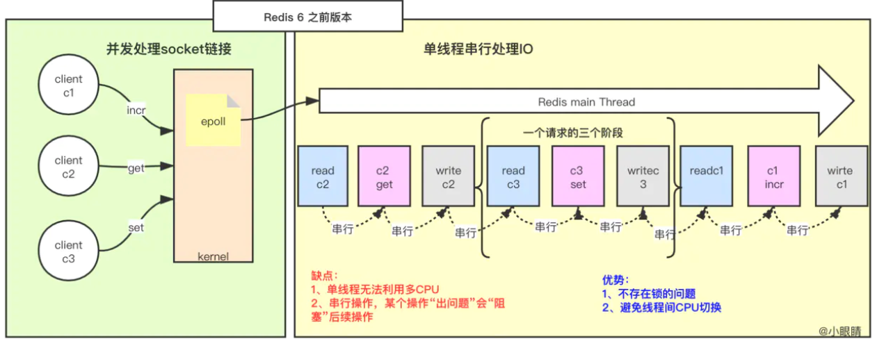
      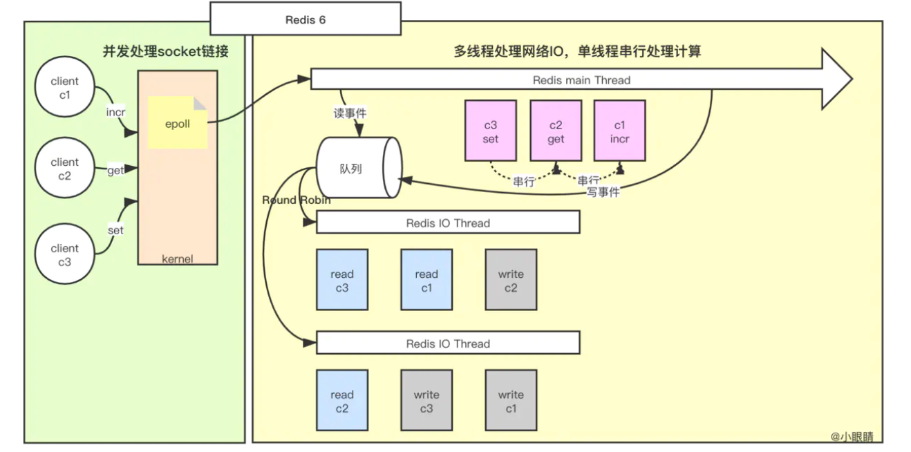
        - 主要负责接受客户端连接并且分发到各个Io线程，而io线程负责读取客户端命令，命令读取完由主线程执行命令，主线程执行完命令后再由Io线程把回复数据返回给客户端
        - 不把处理命令交给各个io线程去执行，这里就涉及到了竞争问题，因为数据库是共享的，多个线程必要加锁，而锁是一个耗时的操作还会涉及多线程之间的上下文切换
- 使用多路I/O复用模型，非阻塞IO
## 常见使用场景
#### 缓存
缓存现在几乎是所有中大型网站都在用的必杀技，合理的利用缓存不仅能够提升网站访问速度，还能大大降低数据库的压力。Redis提供了键过期功能，也提供了灵活的键淘汰策略，所以，现在Redis用在缓存的场合非常多。Redis作为缓存使用可能涉及缓存雪崩、缓存穿透、缓存击穿等问题
#### 排行榜 
很多网站都有排行榜应用的，如京东的月度销量榜单、商品按时间的上新排行榜等。Redis提供的有序集合数据类构能实现各种复杂的排行榜应用
#### 计数器
什么是计数器，如电商网站商品的浏览量、视频网站视频的播放数等。为了保证数据实时效，每次浏览都得给+1，并发量高时如果每次都请求数据库操作无疑是种挑战和压力。Redis提供的incr命令来实现计数器功能，内存操作，性能非常好，非常适用于这些计数场景。
#### 分布式会话
集群模式下，在应用不多的情况下一般使用容器自带的session复制功能就能满足，当应用增多相对复杂的系统中，一般都会搭建以Redis等内存数据库为中心的session服务，session不再由容器管理，而是由session服务及内存数据库管理
#### 分布式锁
在很多互联网公司中都使用了分布式技术，分布式技术带来的技术挑战是对同一个资源的并发访问，如全局ID、减库存、秒杀等场景，并发量不大的场景可以使用数据库的悲观锁、乐观锁来实现，但在并发量高的场合中，利用数据库锁来控制资源的并发访问是不太理想的，大大影响了数据库的性能。可以利用Redis的setnx功能来编写分布式的锁，如果设置返回1说明获取锁成功，否则获取锁失败，实际应用中要考虑的细节要更多
#### 社交网络
点赞、踩、关注/被关注、共同好友等是社交网站的基本功能，社交网站的访问量通常来说比较大，而且传统的关系数据库类型不适合存储这种类型的数据，Redis提供的哈希、集合等数据结构能很方便的的实现这些功能
#### 最新列表
Redis列表结构，LPUSH可以在列表头部插入一个内容ID作为关键字，LTRIM可用来限制列表的数量，这样列表永远为N个ID，无需查询最新的列表，直接根据ID去到对应的内容页即可
#### 消息系统
消息队列是大型网站必用中间件，如ActiveMQ、RabbitMQ、Kafka等流行的消息队列中间件，主要用于业务解耦、流量削峰及异步处理实时性低的业务。Redis提供了发布/订阅及阻塞队列功能，能实现一个简单的消息队列系统。另外，这个不能和专业的消息中间件相比
## 数据类型
### redisObject
redisObject 的定义位于 redis.h ,Redis的每种数据类型都是套用该对象
```cpp
typedef struct redisObject {
    // 类型
    unsigned type:4;
    // 对齐位
    unsigned notused:2;
    // 编码方式
    unsigned encoding:4;
    // LRU 时间（相对于 server.lruclock）
    unsigned lru:22;
    // 引用计数
    int refcount;
    // 指向对象的值
    void *ptr;
} robj;
```
type 、 encoding 和 ptr 是最重要的三个属性。

type 记录了对象所保存的值的类型，它的值可能是以下常量的其中一个（定义位于 redis.h）：
```cpp
/*
 * 对象类型
 */
#define REDIS_STRING 0  // 字符串
#define REDIS_LIST 1    // 列表
#define REDIS_SET 2     // 集合
#define REDIS_ZSET 3    // 有序集
#define REDIS_HASH 4    // 哈希表
```
encoding 记录了对象所保存的值的编码，它的值可能是以下常量的其中一个（定义位于 redis.h）：
```cpp
/*
 * 对象编码
 */
#define REDIS_ENCODING_RAW 0            // 编码为字符串
#define REDIS_ENCODING_INT 1            // 编码为整数
#define REDIS_ENCODING_HT 2             // 编码为哈希表
#define REDIS_ENCODING_ZIPMAP 3         // 编码为 zipmap
#define REDIS_ENCODING_LINKEDLIST 4     // 编码为双端链表
#define REDIS_ENCODING_ZIPLIST 5        // 编码为压缩列表
#define REDIS_ENCODING_INTSET 6         // 编码为整数集合
#define REDIS_ENCODING_SKIPLIST 7       // 编码为跳跃表
```
ptr 是一个指针，指向实际保存值的数据结构，这个数据结构由 type 属性和 encoding 属性决定。

举个例子，如果一个 redisObject 的 type 属性为 REDIS_LIST ， encoding 属性为 REDIS_ENCODING_LINKEDLIST ，那么这个对象就是一个 Redis 列表，它的值保存在一个双端链表内，而 ptr 指针就指向这个双端链表；

每个类型都会有两种或以上的实现

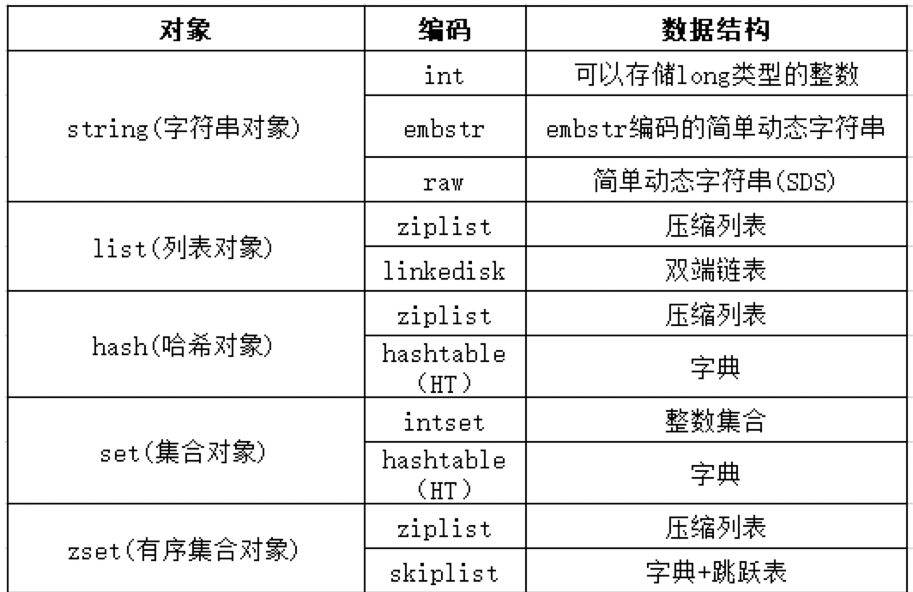

### string
#### int整数
如果保存的字符串是整数值，并且这个整数值可以用long类型来表示，那么ptr指针的void*则转化为C语言源生的long类型
			
#### SDS（raw简单动态字符串）
- sds实现 > 39字节

结构图

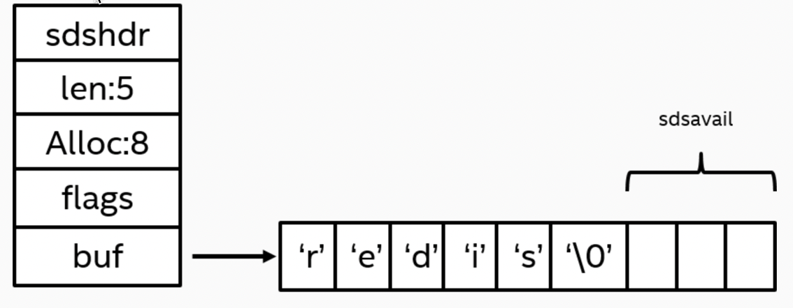

我们把上图中非char数组（变量名为buf）的部分都统称为header

`len` 为buf分配的内存空间已使用的长度，即我们看见的，有效的字符串

`alloc` buf分配的内存空间的总长度，alloc – len 就是未使用的空间，当然这长度不包括SDS字符串头和结尾NULL

`flags` 只使用了低三位表示类型，值为0-4，分别表示sdshdr5到sdshdr64这五种类型。高五位没有用处，目的是根据字符串的长度的不同选择不同的sds结构体

```cpp
/* 因为生的跟别人不一样（内部结构不一样），老五（sdshdr5）从来不被使用 */
  struct __attribute__ ((__packed__)) sdshdr5 {
      unsigned char flags; /* 低三位表示类型, 高五位表示字符串长度 */
      char buf[];
  };
  
  struct __attribute__ ((__packed__)) sdshdr8 {
      uint8_t len; /* 字符串长度*/
      uint8_t alloc; /* 分配长度 */
      unsigned char flags; /* 低三位表示类型，高五位未使用 */
      char buf[];
  };
  
  struct __attribute__ ((__packed__)) sdshdr16 {
      uint16_t len; /* 字符串长度*/
      uint16_t alloc; /* 分配长度 */
      unsigned char flags; /* 低三位表示类型，高五位未使用 */
      char buf[];
  };
  
  struct __attribute__ ((__packed__)) sdshdr32 {
      uint32_t len; /* 字符串长度*/
      uint32_t alloc; /* 分配长度 */
      unsigned char flags; /* 低三位表示类型，高五位未使用 */
      char buf[];
  };
  
  struct __attribute__ ((__packed__)) sdshdr64 {
      uint64_t len; /* 字符串长度*/
      uint64_t alloc; /* 分配长度 */
      unsigned char flags; /* 低三位表示类型，高五位未使用 */
      char buf[];
  };
```
- 为何要定义不同的结构体
  - 结构体的主要区别是len和alloc的类型（uint8，uint16等等），定义不同的结构体是为了存储不同长度的字符串，根据不同长度定义不同的类型是为了节省一部分空间大小，毕竟在Redis字符串非常多，哪怕一点点优化积累起来都很可观
  - 与其他的结构体不同，sdshdr5没有定义char数组和alloc字段，他的值存储在flag没有被使用的高五位中，所以sdshdr5对应的SDS_TYPE_5类型字符串只能保存原串长度小于等于2^5 = 32，因此，它不能为字符串分配空余空间。如果字符串需要动态增长，那么它就必然要重新分配内存才行。所以说，这种类型的sds字符串更适合存储静态的短字符串

`buf` 这是一个没有指明长度的字符数组，这是C语言中定义字符数组的一种特殊写法，称为柔性数组（flexible array member），只能定义在一个结构体的最后一个字段上
- 这个字符数组的长度等于最大容量+1
- 之所以字符数组的长度比最大容量多1个字节，就是为了在字符串长度达到最大容量时仍然有1个字节NULL结束符，即ASCII码为0的’\0’字符，这样字符串可以和c语言源生的字符串兼容

使用sds结构的优点
- `有利于减少内存碎片`，提高存储效率
- `常数复杂度获取字符串长度` len
- `杜绝缓冲区溢出` C语言字符串不记录自身长度，也容易造成缓冲区溢出。而当SDS对自身字符串进行修改时，API会先检查SDS的剩余空间是否满足需要（获取alloc减len），如果不满足，则会先拓展空间，再执行API
- `空间预分配`
  - SDS在重新分配空间的时候，会预分配一些空间来作为冗余。当SDS的len属性长度小于1MB时，Redis会分配和len相同长度的free空间。至于为什么这样分配呢，上次用了len长度的空间，那么下次程序可能也会用len长度的空间，所以Redis就为你预分配这么多的空间
  - 但是当SDS的len属性长度大于1MB时，程序将多分配1M的未使用空间。这个时候再根据这种惯性预测来分配的话就有点得不偿失了。所以Redis是将1MB设为一个风险值，没过风险值你用多少我就给你多少，过了的话那这个风险值就是我能给你临界值。
- `惰性空间释放` Redis的内存回收采用惰性回收，即你把字符串变短了，那么多余的内存空间也不会立刻还给操作系统，先留着，用header的字段将其记录下来，以防接下来又要被使用呢
- `二进制安全` 因为`\0`字符串在SDS中没有意义，他作为结束符的任务已经被header字段给替代了，所以与c语言不一样的，SDS是二进制安全的
  - 使用len字段而不是以\0来判断是否结束，使用`\0`只是为了兼容C的字符串而使用原生的api

#### embstr编码的简单动态字符串
- sds实现 <=39 字节 版本不同不一样，现在好像是44
  - 具体原因就是因为各个结构体定义的字节数加起来+字符串的大小是否超过64来判断
- embstr编码是专门用来保存短字符串的一种优化编码方式
- raw会调用两次内存分配函数来创建redisObject结构和sdshdr结构，而embstr编码则通过调用一次内存分配函数来分配一块连续的空间，空间内一次包含了redisObject和sdshdr两个结构

#### string的操作
- `set hello world` 添加
- `get hello` 获取
- `del hello` 删除
- `SETNX key value` 只有在 key 不存在时设置 key 的值。
- `INCR key` 将 key 中储存的数字值增一。
- `DECR key` 将 key 中储存的数字值减一。

--- 

### list
list压缩列表
			
linkedlist双端列表
- 结构
```cpp
typedef struct listNode {
    // 前置节点
    struct listNode *prev;
    // 后置节点
    struct listNode *next;
    // 节点的值
    void *value;
} listNode;

```
- 列表的节点（注意不是列表的定义）定义如上，除了双向链表必须的前后指针外，为了实现通用性，支持不同类型数据的存储，Redis将节点类型的数据域定义为void *类型，从而模拟了“泛型”

#### list的操作
- rpush 
```shell
> rpush list-key item
(integer) 1
> rpush list-key item
(integer) 3
> rpush list-key item2
(integer) 2
```
- lrange
```shell
lrange list-key 0 -1
> "item" 2)
> "item2" 3
> "item"
```
- lindex
```shell
lindex list-key 1
> "item2"
```
- lpop
```shell
lpop list-key
> "item"
```

#### 应用场景
发布与订阅或者说消息队列、慢查询

--- 

### hash

Redis的哈希类型是一个字符串字段和字符串值之间的映射表，这种数据类型可以用来表示对象。Redis中存储的每个哈希可以存储232 - 1键值对（字段和值）。

内部来看，Redis使用两种不同的编码方式来存储哈希：

- ziplist（压缩列表）: 当哈希类型的元素数量较小，并且每个元素的大小也较小时，Redis会使用ziplist作为哈希的内部存储结构。ziplist是一个特别设计的紧凑数据结构，它将所有的字段和值紧密排列在一起以节省空间。zziplist是一个字节数组，允许快速的访问，对小的元素数量非常有效率。

- hashtable（哈希表）: 当哈希类型的元素数量增加或者元素的大小增加，达到一定的阈值时，Redis会改用一个真正的哈希表来存储这些字段和值。这时，每个字段会被散列（通过哈希函数）到哈希表中的不同槽位。每个槽位保存了指向字段和值对应节点的指针。

转换之间的具体阈值是可以配置的，通过hash-max-ziplist-entries和hash-max-ziplist-value配置可以定义什么时候将ziplist升级为哈希表。

在两种数据结构中：

- Ziplist 编码的哈希表是一系列的连续内存块，其中包含了节点的编码长度，前一个节点的长度（以便可以向前或向后遍历），以及节点的内容。
- Hashtable 编码的哈希中，每个节点存储一个指向下一个节点的指针（因为它使用链表来处理散列冲突），字段本身，以及字段对应的值。
Redis使用渐进式rehash机制，新的或更新的元素总是添加到新哈希表中，而读取操作会查看新旧表。旧哈希表的元素会逐渐移动到新哈希表中，直到旧表为空。这使得Redis可以继续服务请求，同时完成rehash操作。


#### hashtable字典
结构体

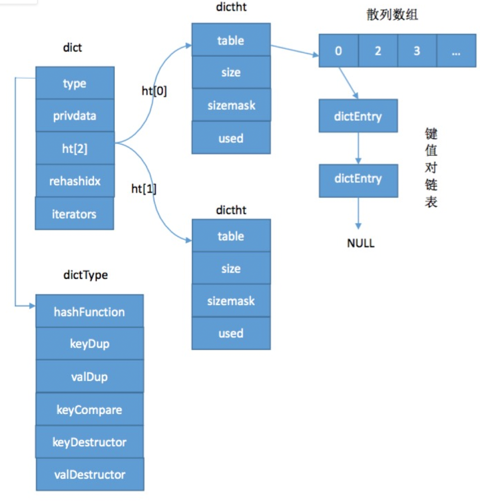

- dict是字典的包装对象，居于最外层
- ht[2]是包含两个项的哈希表的数组，一般情况下，只使用h[0]，h[1]只有在rehash的时候才会使用
  - 字典通过“拉链法”来解决冲突问题的，dictEntry结构体的*next指针指向了其拉链列表的下一个节点。
- dictht是哈希表的结构，他除了一个数组table用来存放键值对以外，还有used字段表示目前已有键值对，size表示数组大小，sizemark=size-1，用来hash索引
- dictType是类型特定函数
  - HashFunction 计算哈希值的函数
  - KeyDup 复制键的函数
  - ValDup 复制值的函数
  - KeyCompare 对比键的函数
  - KeyDestructor 销毁键的函数
  - ValDestructor 销毁值的函数

dict的rehash
- 3步骤
  - 扩展备用的ht[1]，将它的容量扩张到第一个大于ht[0].used*2的 2的n次方
  - 将ht[0]的值重新经过hash索引之后迁移到ht[1]上。
  - 释放ht[0]，将ht[1]设为ht[0]，创建新的空表ht[1]。
- Rehash是渐进式的
  - Rehash不是一步完成的，而是在操作过程中渐进式的。字典维持一个索引计数器rehashidx用来记录当前正在操作的索引，从ht[0]的0号索引上开始，一个项一个项的迁移到ht[1]，直到完成所有迁移，rehashidx变成-1。
  - 在rehash期间，所有新增字段添加在ht[1]中，而删除，更新操作会在两个表上同时进行。查找时先找ht[0]，再找ht[1]。


负载因子（load factor）是用来决定是否需要进行rehash的一个指标。Redis 的哈希表有以下两个负载因子相关的阈值：

- 负载增加的阈值: 当哈希表的负载因子超过 1（即，已存储的元素数量等于哈希表的大小时），如果我们继续向哈希表添加新的元素，Redis 将会初始化一个新的哈希表，其大小大约是原来的两倍，并开始渐进式地将旧表中的元素迁移到新表中。

- 渐进式rehashing: 在rehash操作进行的同时，Redis 仍然可以响应命令请求。当一个新的写入命令被执行，Redis 会将该键值对存入新的哈希表。同时，在执行读取操作时，Redis 会同时检查新旧两个哈希表。最重要的是，在处理每个命令后，Redis 会花费一点时间（由hresize命令配置的数量指定）将旧哈希表的几项元素迁移到新表中。

- 负载减少的阈值: 当哈希表在rehash后的负载因子小于 0.1（即，表中元素数为桶数的十分之一）时，Redis 会减小哈希表的大小，以节省内存空间。

Redis 中哈希表的扩张和收缩是为了保持效率和节省内存。随着数据的增加，避免哈希碰撞变得更重要；同样的，当数据删除后，减少内存的使用也同等重要。通过负载因子的动态调整，Redis 的哈希表可以平衡性能和资源消耗。

#### hash的操作

```shell
# 添加
hset hash-key sub-key1 value1
hset hash-key sub-key2 value2

# 获取全部
hgetall hash-key 

# 删除
hdel hash-key sub-key2 

# 获取
hget hash-key sub-key1 
```
#### 应用场景
特别适合存储对象

--- 

### set
#### intset整数集合
- 结构
  ```cpp
  typedef struct intset {
    uint32_t encoding;
    uint32_t length;
    int8_t contents[];
  } intset;
  ```
  - Encoding 存储编码方式
  - Length inset的长度，即元素数量
  - Content Int数组，用来保存元素，各个项在数组中按数值从小到大排序，不包含重复项
- 当一个集合中只包含整数值，并且元素数量不多时，redis使用整数集合作为set的底层实现
- 当在一个int16类型的整数集合中插入一个int32类型的值，整个集合的所有元素都会转换成32类型
- 整数集合只支持升级操作，不支持降级操作

#### hashtable字典
同上
#### set的操作

- sadd 添加
```shell
> sadd set-key item
(integer) 1
> sadd set-key item2
(integer) 1
> sadd set-key item3
(integer) 1
> sadd set-key item
(integer) 0
```
- smembers 返回集合中的所有成员
```shell
> smembers set-key
"item" 
"item2" 
"item3"
```    
- sismember set-key item4 判断 member 元素是否是集合 key 的成员

```shell
> sismember set-key item4
(integer) 0
> sismember set-key item
(integer) 1
```
- SREM 移除集合中一个或多个成员
```shell
SREM key member1 [member2]
```
- SDIFF 返回第一个集合与其他集合之间的差异。
```shell
SDIFF key1 [key2]
```
- SINTER 返回给定所有集合的交集
```shell
SINTER key1 [key2]
```
- SUNION 返回所有给定集合的并集
```shell
SUNION key1 [key2]
```
#### 应用场景
需要存放的数据不能重复以及需要获取多个数据源交集和并集等场景

--- 
### zset（sorted set）
#### ziplist压缩列表
当一个列表只包含少量元素，并且每个元素要么就是小整数值，要么就是长度比较短的字符串，那么Redis使用ziplist作为列表实现
- 压缩表是为了节约内存而开发的，压缩表可以包含任意个节点，每个节点保存一个字节数组（字符串）或一个整数值
#### skiplist跳跃表
- 当元素数量比较多，或者元素成员是比较长的字符串时，底层实现采用跳跃表
- 跳跃表是一种有序数据结构，他在一个节点中维持多个指向其他节点的指针
- 跳跃表的平均复杂度为O(logN)，最坏为O(N)，其效率可以和平衡树相媲美，而且跟平衡树相比，实现简单
- 示意图

  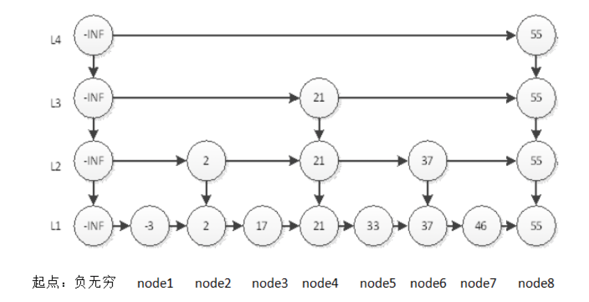					
  - 每一个竖列其实是一个节点。如果能通过在节点中维持多个指向不同节点的指针（比如node4（值为21）就有三个指针，分别指向node5（33），node6（37），node8（55）），那么就会得到一个平衡的跳跃表
  - 跳跃表最难的，就是保持平衡，维持平衡的跳跃表难度要大于维持平衡的二叉树。故而易于实现的，是实现概率平衡，而不是强制平衡
- 跳跃表的查询
  - 示例
  
  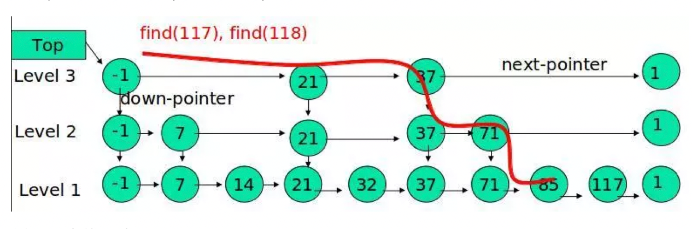
						
  - 跳跃表的查询是从顶层往下找，那么会先从第顶层开始找，方式就是循环比较，如过顶层节点的下一个节点为空说明到达末尾，会跳到第二层，继续遍历，直到找到对应节点
    - 查找元素 117
    - 比较 21， 比 21 大，且21有后继，向后面找
    - 比较 37, 比 37大，且37节点同层没有后继了，则从 37 的下面一层开始找
    - 比较 71, 比 71 大，且71节点同层没有后继了，则从 71 的下面一层开始找
    - 比较 85， 比 85 大，且85有后继，向后面找
    - 比较 117， 等于 117， 找到了节点

#### Redis中的跳跃表的实现
结构
```cpp
#define ZSKIPLIST_MAXLEVEL 32
#define ZSKIPLIST_P 0.25

typedef struct zskiplistNode {
    //成员对象
    robj *obj;
    //分值
    double score;
    //后向指针
    struct zskiplistNode *backward;
    struct zskiplistLevel {
        //前向指针
        struct zskiplistNode *forward;
        //跨度
        unsigned int span;
    } level[];
} zskiplistNode;

typedef struct zskiplist {
    //跳跃表的表头节点和表尾节点
    struct zskiplistNode *header, *tail;
    // 表中节点的数量
    unsigned long length;
    // 表中层数最大的节点层数
    int level;
} zskiplist;

typedef struct zset {
    dict *dict;
    zskiplist *zsl;
} zset;
```

zskiplistNode 表示跳跃表节点结构
- obj 存放着该节点对于的成员对象，一般指向一个sds结构
- score是double结构，存储分数值。
- backward，后退指针，指向列表前一个node
- level [ ]数组，表示一个节点可以有多个层
  - 数组里面的项是zskiplistLevel结构，可以看到，每一层都有一个跳跃指针forward
  - 跨度span，顾名思义，就是用来记录跨度的，相邻的节点跨度为1。
  - 注意：跨度的用处是用来计算某个节点在跳跃表中的排位的，zset的排序按score从小到大排序。比如我查找到node7，通过将沿途的所有跨度累加，我们可以得到其排在列表中的序列

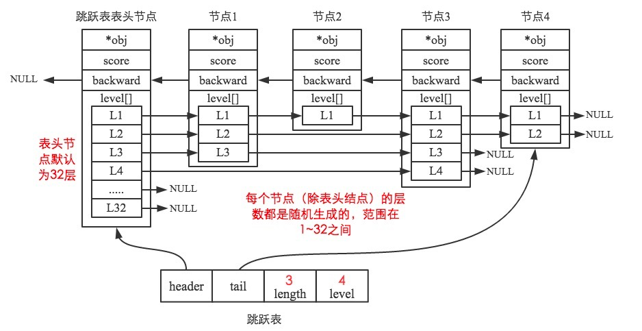

zskiplist 表示跳跃表结构
- zskiplist中有指向整个跳跃表两端的head指针和tail指针
- 记录跳跃表长度的leng字段。
- Int型的level用来记录目前整个跳跃表中最高的层数。

##### 一般情况下维持平衡跳跃表的实现
- 在跳跃表中插入一个新的节点时，程序需要确定两个要素：该节点的位置，以及层数
- 因为有序集合按照score排序，故而位置可以按照score比出，确定位置。
- 确定了位置后，再确定node的层数，可以采用抛硬币的方式，一次正面，层数+1，直到反面出现为止。因为抛硬币会使层数L的值满足参数为 p = 1/2 的几何分布，在数量足够大时，可以近似平衡。
- 用抛硬币的方式，可以使level+1的概率为2分之一，也就是说，k层节点的数量是k+1层的1/2 ，你可以把它看成是一个二叉树。

##### Redis维持平衡跳跃表的实现
幂次定律
- 含义是：如果某件事的发生频率和它的某个属性成幂关系，那么这个频率就可以称之为符合幂次定律。
- 表现是：少数几个事件的发生频率占了整个发生频率的大部分， 而其余的大多数事件只占整个发生频率的一个小部分。
- 说人话版：越大的数，出现的概率越小。

实现算法
- 当Redis在跳跃表中插入一个新的节点时，程序需要确定两个要素：该节点的位置，以及层数
- Redis的实现与一般维持平衡跳跃表的实现大同小异，Redis中跳跃表的层数也是在插入的时候确定，按照分数找好位置后，Redis会生成一个1-32的数作为层数。
- Redis的level+1的概率是1/4,所以Redis的跳跃表是一个四叉树
  
  ```cpp
  /* Returns a random level for the new skiplist node we are going to create.
  * The return value of this function is between 1 and ZSKIPLIST_MAXLEVEL
  * (both inclusive), with a powerlaw-alike distribution where higher
  * levels are less likely to be returned.
  * 
  * 返回一个介于 1 和 ZSKIPLIST_MAXLEVEL 之间的随机值，作为节点的层数。
  * 
  * 根据幂次定律(power law)，数值越大，函数生成它的几率就越小
  * 
  * T = O(N)
  */
  #define ZSKIPLIST_MAXLEVEL 32 /* Should be enough for 2^32 elements */
  #define ZSKIPLIST_P 0.25      /* Skiplist P = 1/4 */
  int zslRandomLevel(void) {
      int level = 1;
      while ((random()&0xFFFF) < (ZSKIPLIST_P * 0xFFFF))
          level += 1;
      return (level<ZSKIPLIST_MAXLEVEL) ? level : ZSKIPLIST_MAXLEVEL;
  }
  ```
  - 指定节点最大层数 MaxLevel，指定概率 p， 默认层数 lvl 为1
  - 生成一个0~1的随机数r，若r<p，且lvl<MaxLevel ，则lvl ++
  - 重复第 2 步，直至生成的r >p 为止，此时的 lvl 就是要插入的层数。
  - 总结 高层概率总是越小的，底层的概率总是最大的

#### zset的操作
- ZADD 添加
```shell
ZADD key score1 member1 [score2 member2]
```
- ZRNAK 查看排名
```shell
ZRNAK key member
```
- ZREVRNAK 查看排名(倒序) 最大的返回是0
```shell
ZREVRNAK key member
```
- ZRANGE 通过索引区间返回有序集合指定区间内的成员
```shell
ZRANGE key start stop [WITHSCORES]

## 查看前10名，sorce排序
127.0.0.1:6379> zrange test 0 10
1) "xiaoming"
2) "xiaohong"
3) "xiaogang"
4) "xinxin"
5) "ghg"
6) "dahua"
```
- ZREVRANGE 通过索引区间返回有序集合指定区间内的成员(倒序)
```shell
ZREVRANGE key start stop [WITHSCORES]

## 查看前10名，sorce倒序
127.0.0.1:6379> zrevrange test 0 10
1) "dahua"
2) "ghg"
3) "xinxin"
4) "xiaogang"
5) "xiaohong"
6) "xiaoming"
```
- ZREVRANGE 获取所有member的排名
```shell
ZREVRANGE key 0 -1

127.0.0.1:6379> zrevrange test 0 -1
1) "dahua"
2) "ghg"
3) "xinxin"
4) "xiaogang"
5) "xiaohong"
6) "xiaoming"
```
- ZSCORE 获取member的分数
```shell
ZSCORE key member

127.0.0.1:6379> ZSCORE test dahua
"104"
```
- ZCRAD 获取zset key的大小
```shell
ZCRAD key

127.0.0.1:6379> zcard test
(integer) 6
```
- ZREM 移除有序集合中的一个或多个成员
```shell
ZREM key member [member ...]
```
#### 应用场景
需要对数据根据某个权重进行排序的场景。比如在直播系统中，实时排行信息包含直播间在线用户列表，各种礼物排行榜，弹幕消息（可以理解为按消息维度的消息排行榜）等信息

#### 为什么使用跳表不使用别的数据结构？
1. **不需要复杂的平衡**，平衡树的插入和删除操作可能引发子树的调整，逻辑复杂，而skiplist的插入和删除只需要修改相邻节点的指针，操作简单又快速
2. **适合范围查找**，在做范围查找的时候，平衡树比skiplist操作要复杂。在平衡树上，我们找到指定范围的小值之后，还需要以中序遍历的顺序继续寻找其它不超过大值的节点。如果不对平衡树进行一定的改造，这里的中序遍历并不容易实现。而在skiplist上进行范围查找就非常简单，只需要在找到小值之后，对第1层链表进行若干步的遍历就可以实现
3. **算法实现上更简单**

--- 

### bitmap
bitmap 存储的是连续的二进制数字（0 和 1），通过 bitmap, 只需要一个 bit 位来表示某个元素对应的值或者状态，key 就是对应元素本身 。我们知道 8 个 bit 可以组成一个 byte，所以 bitmap 本身会极大的节省储存空间
#### 常用命令
setbit 、getbit 、bitcount、bitop
#### 应用场景
1、适合需要保存状态信息（比如是否签到、是否登录...）并需要进一步对这些信息进行分析的场景。比如用户签到情况、活跃用户情况、用户行为统计（比如是否点赞过某个视频）
- 使用场景一：用户行为分析 很多网站为了分析你的喜好，需要研究你点赞过的内容
  - 记录你喜欢过 001 号小姐姐
  ```shell
   127.0.0.1:6379> setbit beauty_girl_001 uid 1
  ```
  - 使用场景二：统计活跃用户
    - 使用时间作为 key，然后用户 ID 为 offset，如果当日活跃过就设置为 1
    - 对一个或多个保存二进制位的字符串 key 进行位元操作，并将结果保存到 destkey 上。
    - BITOP 命令支持 AND 、 OR 、 NOT 、 XOR 这四种操作中的任意一种参数
    ```shell
    BITOP operation destkey key [key ...]
    ```
    ```shell
    # 初始化数据: 
    127.0.0.1:6379> setbit 20210308 1 1
    (integer) 0
    127.0.0.1:6379> setbit 20210308 2 1
    (integer) 0
    127.0.0.1:6379> setbit 20210309 1 1
    (integer) 0
    # 统计20210308~20210309总活跃用户数: 1
    127.0.0.1:6379> bitop and desk1 20210308 20210309
    (integer) 1
    127.0.0.1:6379> bitcount desk1
    (integer) 1
    # 统计20210308~20210309在线活跃用户数: 2
    127.0.0.1:6379> bitop or desk2 20210308 20210309
    (integer) 1
    127.0.0.1:6379> bitcount desk2
    (integer) 2
    ```
  - 使用场景三：用户在线状态
    - 取或者统计用户在线状态，使用 bitmap 是一个节约空间效率又高的一种方法。
    - 一个 key，然后用户 ID 为 offset，如果在线就设置为 1，不在线就设置为 0。

2、布隆过滤器

布隆过滤器使用场景
- 原本有10亿个号码，现在又来了10万个号码，要快速准确判断这10万个号码是否在10亿个号码库中？
- 接触过爬虫的，应该有这么一个需求，需要爬虫的网站千千万万，对于一个新的网站url，我们如何判断这个url我们是否已经爬过了？
- 垃圾邮箱的过滤。

图示

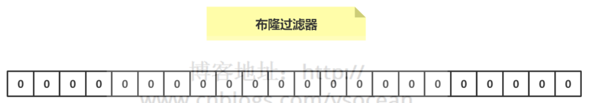		

一种数据结构，是由一串很长的二进制向量组成，可以将其看成一个二进制数组。既然是二进制，那么里面存放的不是0，就是1，但是初始默认值都是0

原理

添加数据
- 当要向布隆过滤器中添加一个元素key时，我们通过多个hash函数，算出一个值，然后将这个值所在的方格置为1。
- 比如，下图hash1(key)=1，那么在第2个格子将0变为1（数组是从0开始计数的），hash2(key)=7，那么将第8个格子置位1，依次类推
- 图示
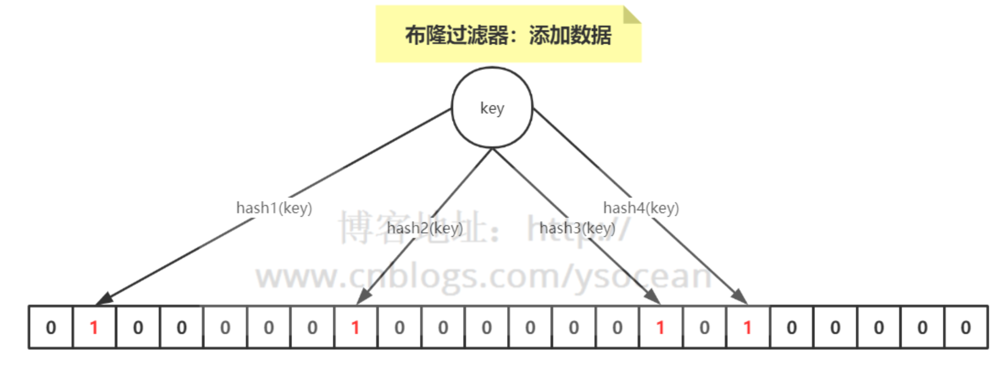								

判断数据是否存在
- 通过hash计算出来的位置只要都是1，这个数据一定存在？否，因为其他的key也很有可能通过相同的hash计算出相同的位置，所以，只能判断某个key一定不存在，不能判断一定存在

优缺点
- 优点 二进制组成的数组，占用内存极少，并且插入和查询速度都足够快
- 缺点 随着数据的增加，误判率会增加；还有无法判断数据一定存在；另外还有一个重要缺点，无法删除数据

#### 如何在大数据量里实时判断用户名是否存在
- 首先可以使用布隆，如果判断不存在则直接返回可使用
- 如果存在，如果允许误判则返回，如果100%确认，则可以通过名字长度去查不同的缓存

--- 

### HyperLogLog
Redis HyperLogLog 是用来做基数统计的算法，HyperLogLog 的优点是，在输入元素的数量或者体积非常非常大时，计算基数所需的空间总是固定 的、并且是很小的。

基数计算（cardinality counting）指的是统计一批数据中的不重复元素的个数，常见于计算独立用户数（UV）、维度的独立取值数等等

比如 1,2,3,4,7,4,7   不重复的数据是 1,2,3,4,7 基数为5
#### HyperLogLog的原理
HyperLogLog（简称 HLL）是一种基数（cardinality）算法，用于估计一个集合中的元素数量。它的主要思想是利用概率统计的方法，以极小的空间复杂度来实现高精度的基数统计。

HyperLogLog 的核心是哈希函数和桶。它使用哈希函数将每个元素映射到一个固定大小的二进制字符串（一般为 64 位），然后将这个字符串划分为若干个组（一般为 2^b 个），每个组对应一个桶。对于每个桶，使用特定的算法计算其中元素的基数估计值，并将所有桶的估计值进行组合，得到最终的基数估计值。

具体来说，HyperLogLog 使用了一种特殊的哈希函数，称为 MurmurHash。它可以将任意长度的输入值哈希为一个固定长度的输出值，具有较低的冲突率和较高的随机性。在将元素哈希到二进制字符串时，使用了一种特殊的技巧，称为“前缀零计数法”。它的基本思想是，在二进制字符串中找到第一个 1 的位置，将其前面的所有 0 计数，并将计数值作为该元素所属的桶的索引。

对于每个桶，HyperLogLog 使用了一种特殊的算法，称为“基数估计算法”。它的基本思想是，将桶中所有元素哈希后的二进制字符串中最长的前缀零的长度（即“前导零数”）作为该桶的基数估计值。然后，将所有桶的基数估计值进行组合，得到最终的基数估计值。为了提高估计值的精度，HyperLogLog 还使用了多个哈希函数和多个桶，并对不同的哈希函数和桶进行加权。

需要注意的是，HyperLogLog 是一种概率算法，它的估计值可能存在一定的误差，但是可以通过适当地调整桶的数量和哈希函数的数量来控制误差的大小。另外，HyperLogLog 也具有一定的局限性，比如不能对元素进行添加和删除操作。因此，在使用 HyperLogLog 时需要根据具体应用场景进行选择和权衡。

---

## 内存回收策略
### Redis过期策略:删除过期时间的key值
- `定时过期` 每个设置过期时间的key都需要创建一个定时器，到过期时间就会立即清除。该策略可以立即清除过期的数据，对内存很友好；但是会占用大量的CPU资源去处理过期的数据，从而影响缓存的响应时间和吞吐量
- `惰性过期` 只有当访问一个key时，才会判断该key是否已过期，过期则清除。该策略可以最大化地节省CPU资源，却对内存非常不友好。极端情况可能出现大量的过期key没有再次被访问，从而不会被清除，占用大量内存
- `定期过期` 每隔一定的时间，会扫描一定数量的数据库的expires字典中一定数量的key，并清除其中已过期的key。该策略是前两者的一个折中方案。通过调整定时扫描的时间间隔和每次扫描的限定耗时，可以在不同情况下使得CPU和内存资源达到最优的平衡效果
### Redis淘汰策略:内存使用到达maxmemory上限时触发内存淘汰数据
- LRU算法 最近最少使用算法,也就是说默认删除最近最少使用的键
- 淘汰策略
  1. `noeviction`：当内存不足以容纳新写入数据时，新写入操作会报错。
  2. `allkeys-lru`：当内存不足以容纳新写入数据时，在键空间中，移除最近最少使用的key。
  3. `allkeys-random`：当内存不足以容纳新写入数据时，在键空间中，随机移除某个key。
  4. `volatile-lru`：当内存不足以容纳新写入数据时，在设置了过期时间的键空间中，移除最近最少使用的key。
  5. `volatile-random`：当内存不足以容纳新写入数据时，在设置了过期时间的键空间中，随机移除某个key。
  6. `volatile-ttl`：当内存不足以容纳新写入数据时，在设置了过期时间的键空间中，有更早过期时间的key优先移除。
### redis的设置过期时间底层原理
redis针对TTL时间有专门的dict进行存储，就是redisDb当中的dict *expires字段，dict顾名思义就是一个hashtable，key为对应的rediskey，value为对应的TTL时间。
```
typedef struct redisDb {
    dict *dict;                 /* The keyspace for this DB */
    dict *expires;              /* Timeout of keys with a timeout set */
    ...
}
```
过期键的判断

通过查询过期字典，检查下面的条件判断是否过期

- 检查给定的键是否在过期字典中，如果存在就获取键的过期时间
- 检查当前 UNIX 时间戳是否大于键的过期时间，是就过期，否则未过期

## 持久化方式
### RDB快照
- 当条件满足时 Redis会将某个时间点的数据集保存到一个 RDB文件中，数据的读取和恢复都可以直接通过该文件
- 什么情况下会触发 RDB操作持久化我们的数据？
  - 使用 save命令手动持久化数据 需要注意的是，save命令会造成阻塞，在 RDB文件生成期间 Redis不会处理其他的请求
  - 手动或者自动执行 bgsave命令（bgsave即 background save
    - 该命令执行时 Redis会调用一个 fork();函数，继而创建一条子线程，rdb文件的生成 就会交给该子线程来处理
      - 父进程继续接收并处理客户端发来的命令，而子进程开始将内存中的数据写入硬盘中的临时文件
    - 当子进程写入完所有数据后，会用该临时文件替换旧的RDB文件，至此 一次快照操作完成；子进程退出
    - 这种方式的优劣已经显而易见了，优点是不会出现阻塞问题 且基本上不会影响到主线程；缺点是子线程会占用一定的 CPU性能
    - 虽有小弊病但不致命，所以这种方式使用的会更多一些（所有的自动执行默认都使用的是该命令）
- 在 Redis.conf 配置文件中
  - `save 900 1`           #在900秒(15分钟)之后，如果至少有1个key发生变化，Redis就会自动触发BGSAVE命令创建快照。
  - `save 300 10`          #在300秒(5分钟)之后，如果至少有10个key发生变化，Redis就会自动触发BGSAVE命令创建快照。
  - `save 60 10000`        #在60秒(1分钟)之后，如果至少有10000个key发生变化，Redis就会自动触发BGSAVE命令创建快照。
### AOF追加
与快照持久化相比，AOF 持久化 的实时性更好，因此已成为主流的持久化方案。默认情况下 Redis 没有开启 AOF（append only file）方式的持久化，可以通过 appendonly 参数开启：
- appendonly yes

开启 AOF 持久化后每执行一条会更改 Redis 中的数据的命令，Redis 就会将该命令写入硬盘中的 AOF 文件。AOF 文件的保存位置和 RDB 文件的位置相同，都是通过 dir 参数设置的，默认的文件名是 appendonly.aof。

在 Redis 的配置文件中存在三种不同的 AOF 持久化方式，它们分别是：
- appendfsync always    #每次有数据修改发生时都会写入AOF文件,这样会严重降低Redis的速度
- appendfsync everysec  #每秒钟同步一次，显示地将多个写命令同步到硬盘
- appendfsync no        #让操作系统决定何时进行同步

aof文件的自动重写
- 该功能可以最大程度的对 aof文件进行瘦身 同时保证数据的完整性
  - 将重复或者无效的命令从新文件中剔除
  - 将过期的数据从新文件中剔除
  - 将可以进行合并的命令进行合并操作，并记录在新文件中
- 具体实现
  - 在重写开始之前 Redis会先确认有没有 bgsave（RDB持久化）或者bgrewriteaof（AOF重写）在执行
  - 主进程 fork出一条子进程，在 fork期间 Redis是阻塞的
  - 子进程 fork完毕后，主进程会继续处理客户端的请求，所有写命令依然写入缓冲区并根据策略同步到磁盘，保证原有 AOF文件完整和正确
    - 但需要注意的是，子进程在完成 fork后就不再共享主进程的内存了
    - 所以在子进程重写 aof文件这段时间内 为了防止丢失数据，主进程不仅要将 数据写入 aof_buf还要写入 aof_rewrite_buf
  - 子进程根据内存快照，按照命令重写规则写入到新的 AOF文件
  - 子进程写完新的 AOF文件后，会向主进程发信号，主进程更新统计信息
  - 主进程将 aof_rewrite_buf中的数据写入到新的 AOF文件中
  - 使用新的 AOF文件覆盖旧的 AOF文件，重写完成
## Redis 中的事务
### 命令
- `MULTI` 使用 MULTI命令后可以输入多个命令。Redis 不会立即执行这些命令，而是将它们放到队列，当调用了EXEC命令将执行所有命令
  - 开始事务（MULTI）。
  - 命令入队(批量操作 Redis 的命令，先进先出（FIFO）的顺序执行)。
  - 执行事务(EXEC)。
- `DISCARD` 取消一个事务，它会清空事务队列中保存的所有命令
- `WATCH` 用于监听指定的键，当调用 EXEC 命令执行事务时，如果一个被 WATCH 命令监视的键被修改的话，整个事务都不会执行，直接返回失败

- Redis 是不支持 roll back 的，因而不满足原子性的（而且不满足持久性）

- Redis 事务提供了一种将多个命令请求打包的功能。然后，再按顺序执行打包的所有命令，并且不会被中途打断。

### Java操作
```java
import org.springframework.beans.factory.annotation.Autowired;
import org.springframework.data.redis.core.StringRedisTemplate;
import org.springframework.data.redis.core.SessionCallback;
import org.springframework.stereotype.Service;

@Service
public class RedisService {

    @Autowired
    private StringRedisTemplate redisTemplate;

    public void executeTransaction() {
        redisTemplate.execute(new SessionCallback<Object>() {
            @Override
            public <K, V> Object execute(org.springframework.data.redis.core.RedisOperations<K, V> operations) throws DataAccessException {
                operations.multi(); // 开始事务
                operations.opsForValue().set("key1", "value1");
                operations.opsForValue().set("key2", "value2");
                return operations.exec(); // 执行事务
            }
        });
    }
}

```
## 常问故障场景
### 缓存雪崩
什么是 缓存在同一时间大面积的失效，后面的请求都直接落到了数据库上，造成数据库短时间内承受大量请求。 这就好比雪崩一样，摧枯拉朽之势，数据库的压力可想而知，可能直接就被这么多请求弄宕机了
#### 解决方案
- 针对 Redis 服务不可用的情况
  - 采用 Redis 集群，避免单机出现问题整个缓存服务都没办法使用。
  - 限流，避免同时处理大量的请求
- 针对热点缓存失效的情况
  - 设置不同的失效时间比如随机设置缓存的失效时间。
  - 缓存永不失效
### 缓存穿透
什么是 缓存穿透说简单点就是大量请求的 key 根本不存在于缓存中，导致请求直接到了数据库上，根本没有经过缓存这一层。举个例子：某个黑客故意制造我们缓存中不存在的 key 发起大量请求，导致大量请求落到数据库
#### 解决方案
- 缓存无效 key
- 布隆过滤器
## 集群
### 主从复制模式
Redis 提供了复制（replication）功能，可以实现当一台数据库中的数据更新后，自动将更新的数据同步到其他数据库上

在复制的概念中，数据库分为两类，一类是主数据库（master），另一类是从数据库(slave）。主数据库可以进行读写操作，当写操作导致数据变化时会自动将数据同步给从数据库。而从数据库一般是只读的，并接受主数据库同步过来的数据。一个主数据库可以拥有多个从数据库，而一个从数据库只能拥有一个主数据库

引入主从复制机制的目的有两个
- 一个是读写分离，分担 "master" 的读写压力
- 一个是方便做容灾恢复

#### 主从复制原理
- 从数据库启动成功后，连接主数据库，发送 SYNC 命令；
- 主数据库接收到 SYNC 命令后，开始执行 BGSAVE 命令生成 RDB 文件并使用缓冲区记录此后执行的所有写命令；
- 主数据库 BGSAVE 执行完后，向所有从数据库发送快照文件，并在发送期间继续记录被执行的写命令；
- 从数据库收到快照文件后丢弃所有旧数据，载入收到的快照；
- 主数据库快照发送完毕后开始向从数据库发送缓冲区中的写命令；
- 从数据库完成对快照的载入，开始接收命令请求，并执行来自主数据库缓冲区的写命令；（从数据库初始化完成）
- 主数据库每执行一个写命令就会向从数据库发送相同的写命令，从数据库接收并执行收到的写命令（从数据库初始化完成后的操作）
- 出现断开重连后，2.8之后的版本会将断线期间的命令传给重数据库，增量复制。
- 主从刚刚连接的时候，进行全量同步；全同步结束后，进行增量同步。当然，如果有需要，slave 在任何时候都可以发起全量同步。Redis 的策略是，无论如何，首先会尝试进行增量同步，如不成功，要求从机进行全量同步。
#### 主从复制优缺点
优点
- 支持主从复制，主机会自动将数据同步到从机，可以进行读写分离；
- 为了分载 Master 的读操作压力，Slave 服务器可以为客户端提供只读操作的服务，写服务仍然必须由Master来完成；
- Slave 同样可以接受其它 Slaves 的连接和同步请求，这样可以有效的分载 Master 的同步压力；
- Master Server 是以非阻塞的方式为 Slaves 提供服务。所以在 Master-Slave 同步期间，客户端仍然可以提交查询或修改请求；
- Slave Server 同样是以非阻塞的方式完成数据同步。在同步期间，如果有客户端提交查询请求，Redis则返回同步之前的数据；

缺点
- Redis不具备自动容错和恢复功能，主机从机的宕机都会导致前端部分读写请求失败，需要等待机器重启或者手动切换前端的IP才能恢复（也就是要人工介入）；
- 主机宕机，宕机前有部分数据未能及时同步到从机，切换IP后还会引入数据不一致的问题，降低了系统的可用性；
- 如果多个 Slave 断线了，需要重启的时候，尽量不要在同一时间段进行重启。因为只要 Slave 启动，就会发送sync 请求和主机全量同步，当多个 Slave 重启的时候，可能会导致 Master IO 剧增从而宕机。
- Redis 较难支持在线扩容，在集群容量达到上限时在线扩容会变得很复杂；
### Sentinel（哨兵）模式
哨兵模式是一种特殊的模式，首先 Redis 提供了哨兵的命令，哨兵是一个独立的进程，作为进程，它会独立运行。其原理是哨兵通过发送命令，等待Redis服务器响应，从而监控运行的多个 Redis 实例

#### 原理图
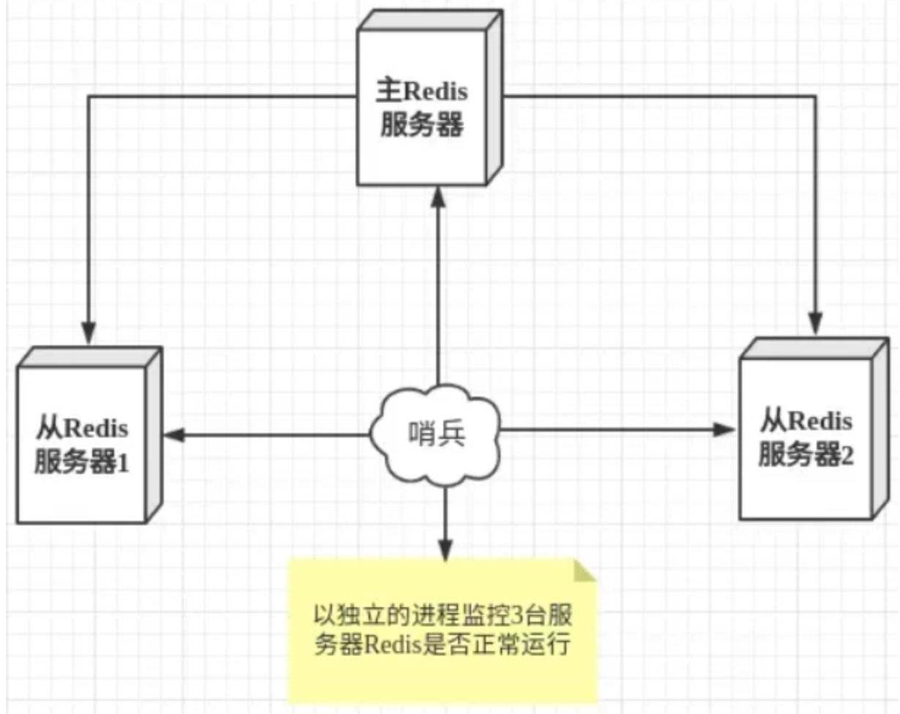

#### 哨兵模式的作用
- 通过发送命令，让 Redis 服务器返回监控其运行状态，包括主服务器和从服务器；
- 当哨兵监测到 master 宕机，会自动将 slave 切换成 master ，然后通过发布订阅模式通知其他的从服务器，修改配置文件，让它们切换主机；

#### 多哨兵模式


一个哨兵进程对Redis服务器进行监控，也可能会出现问题，为此，我们可以使用多个哨兵进行监控。各个哨兵之间还会进行监控，这样就形成了多哨兵模式

#### 故障切换的过程
- 假设主服务器宕机，哨兵1先检测到这个结果，系统并不会马上进行 failover 过程，仅仅是哨兵1主观的认为主服务器不可用，这个现象成为主观下线。当后面的哨兵也检测到主服务器不可用，并且数量达到一定值时，那么哨兵之间就会进行一次投票，投票的结果由一个哨兵发起，进行 failover 操作。切换成功后，就会通过发布订阅模式，让各个哨兵把自己监控的从服务器实现切换主机，这个过程称为客观下线。这样对于客户端而言，一切都是透明的。

#### 哨兵模式的工作方式
- 每个Sentinel（哨兵）进程以每秒钟一次的频率向整个集群中的 Master 主服务器，Slave 从服务器以及其他Sentinel（哨兵）进程发送一个 PING 命令。
- 如果一个实例（instance）距离最后一次有效回复 PING 命令的时间超过 down-after-milliseconds 选项所指定的值， 则这个实例会被 Sentinel（哨兵）进程标记为主观下线（SDOWN）
- 如果一个 Master 主服务器被标记为主观下线（SDOWN），则正在监视这个 Master 主服务器的所有 Sentinel（哨兵）进程要以每秒一次的频率确认 Master 主服务器的确进入了主观下线状态
- 当有足够数量的 Sentinel（哨兵）进程（大于等于配置文件指定的值）在指定的时间范围内确认 Master 主服务器进入了主观下线状态（SDOWN）， 则 Master 主服务器会被标记为客观下线（ODOWN）
- 在一般情况下， 每个 Sentinel（哨兵）进程会以每 10 秒一次的频率向集群中的所有 Master 主服务器、Slave 从服务器发送 INFO 命令。
- 当 Master 主服务器被 Sentinel（哨兵）进程标记为客观下线（ODOWN）时，Sentinel（哨兵）进程向下线的 Master 主服务器的所有 Slave 从服务器发送 INFO 命令的频率会从 10 秒一次改为每秒一次。
- 若没有足够数量的 Sentinel（哨兵）进程同意 Master主服务器下线， Master 主服务器的客观下线状态就会被移除。若 Master 主服务器重新向 Sentinel（哨兵）进程发送 PING 命令返回有效回复，Master主服务器的主观下线状态就会被移除
#### 哨兵模式的优缺点
优点
- 哨兵模式是基于主从模式的，所有主从的优点，哨兵模式都具有。
- 主从可以自动切换，系统更健壮，可用性更高(可以看作自动版的主从复制)。

缺点
- Redis较难支持在线扩容，在集群容量达到上限时在线扩容会变得很复杂。
### Cluster 集群模式
Redis Cluster是一种服务器 Sharding 技术，3.0版本开始正式提供。Redis 的哨兵模式基本已经可以实现高可用，读写分离 ，但是在这种模式下每台 Redis 服务器都存储相同的数据，很浪费内存，所以在 redis3.0上加入了 Cluster 集群模式，实现了 Redis 的分布式存储，也就是说每台 Redis 节点上存储不同的内容

#### 主从复制模型
- 为了保证高可用，redis-cluster集群引入了主从复制模型，一个主节点对应一个或者多个从节点，当主节点宕机的时候，就会启用从节点

##### 数据分区方式
###### 顺序分布

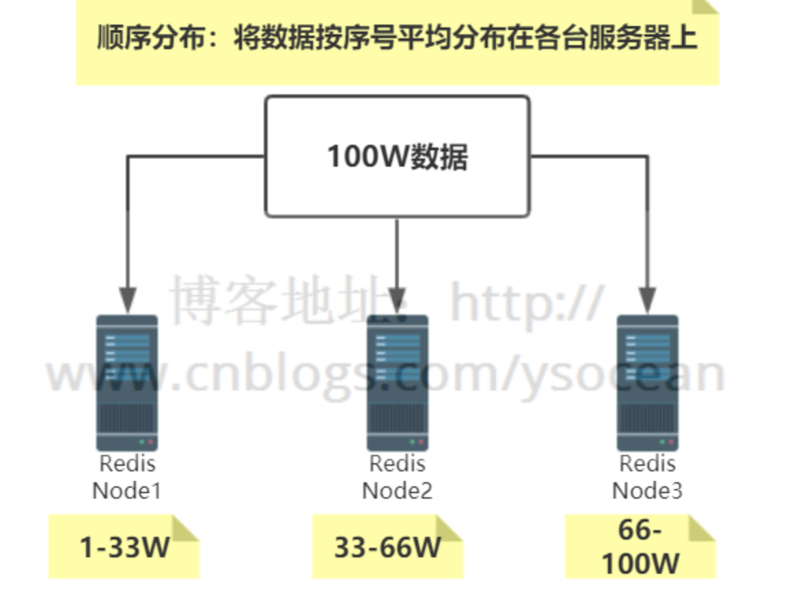
  
特点：键值业务相关；数据分散，但是容易造成访问倾斜；支持顺序访问；支持批量操作

###### 哈希分布

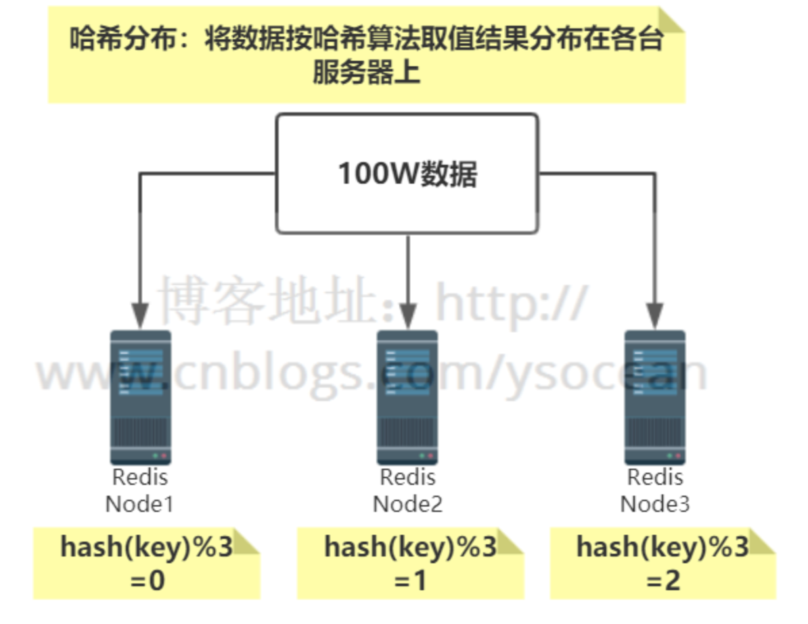

特点：数据分散度高；键值分布与业务无关；不支持顺序访问；支持批量操作。

###### 一致性哈希分布

问题：对于上面介绍的哈希分布，大家可以想一下，如果向集群中增加节点，或者集群中有节点宕机，这个时候应该怎么处理？

增加节点

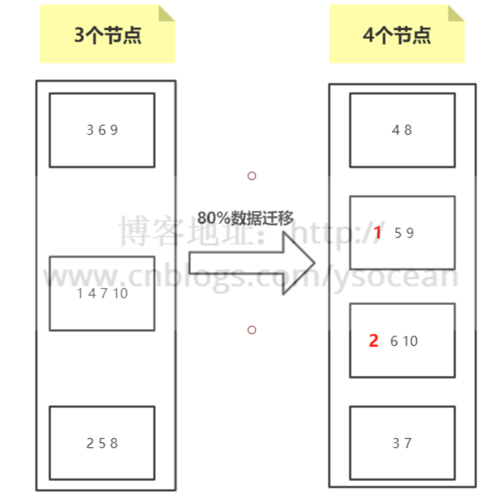
    
- 如上图所示，总共10个数据通过节点取余hash(key)%/3 的方式分布到3个节点，这时候由于访问量变大，要进行扩容，由 3 个节点变为 4 个节点。
- 我们发现，如图所示，数据除了标红的1 2 没有进行迁移，别的数据都要进行变动，达到了80%，如果这时候并发很高，80%的数据都要从下层节点（比如数据库）获取，会给下层节点造成很大的访问压力，这是不能接受的。
- 即使我们进行翻倍扩容，从3个节点增加到6个节点，其数据迁移也在50%左右
   
删除节点


上图其实不管是哪一个节点宕机，其数据迁移量都会超过50%。基本上也是我们所不能接受的 

那么如何使得集群中新增节点或者删除节点时，数据迁移量最少？——一致性哈希算法诞生。
      
- 原理图

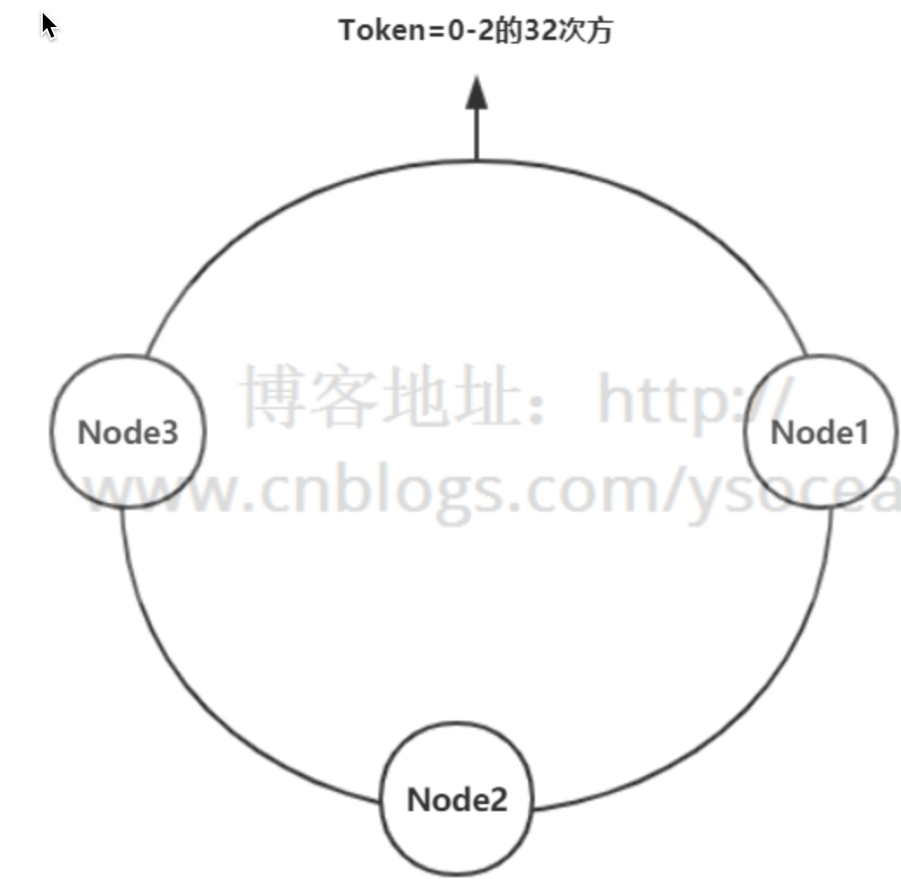

假设有一个哈希环，从0到2的32次方，均匀的分成三份，中间存放三个节点，沿着顺时针旋转，从Node1到Node2之间的数据，存放在Node2节点上；从Node2到Node3之间的数据，存放在Node3节点上，依次类推。

假设Node1节点宕机，那么原来Node3到Node1之间的数据这时候改为存放到Node2节点上，Node2到Node3之间数据保持不变，原来Node1到Node2之间的数据还是存放在Node2上，也就是只影响三分之一的数据，节点越多，影响数据越少

虚拟节点
- hash 算法并不是保证绝对的平衡，如果 cache 较少的话，对象并不能被均匀的映射到 cache 上，为了解决这种情况， consistent hashing 引入了“虚拟节点”的概念，它可以如下定义
  - 虚拟节点（ virtual node ）是实际节点在 hash 空间的复制品（ replica ），一实际个节点对应了若干个“虚拟节点”，这个对应个数也成为“复制个数”，“虚拟节点”在 hash 空间中以 hash 值排列
- 仍以仅部署 cache A 和 cache C 的情况为例。现在我们引入虚拟节点，并设置“复制个数”为 2 ，这就意味着一共会存在 4 个“虚拟节点”， cache A1, cache A2 代表了 cache A； cache C1, cache C2 代表了 cache C 。此时，对象到“虚拟节点”的映射关系为：
  - objec1->cache A2 ； objec2->cache A1 ； objec3->cache C1 ； objec4->cache C2 ；
- 因此对象 object1 和 object2 都被映射到了 cache A 上，而 object3 和 object4 映射到了 cache C 上；平衡性有了很大提高。 引入“虚拟节点”后，映射关系就从 { 对象 -> 节点 } 转换到了 { 对象 -> 虚拟节点 } 。查询物体所在 cache 时的映射关系如下图 所示

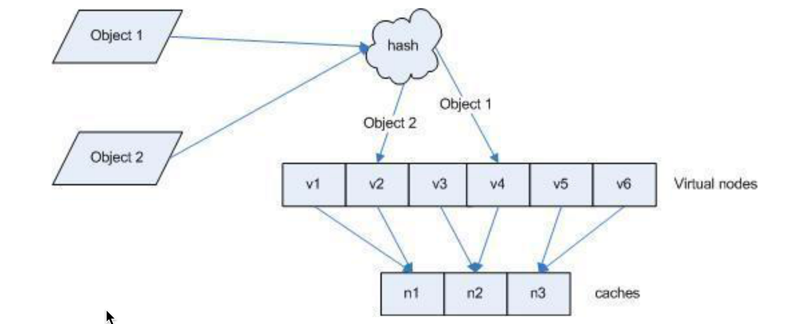

#### Redis Cluster虚拟槽分区
Redis集群数据分布没有使用一致性哈希分布，而是使用虚拟槽分区概念

Redis内部内置了序号 0-16383 个槽位，每个槽位可以用来存储一个数据集合，将这些槽位按顺序分配到集群中的各个节点。每次新的数据到来，会通过哈希函数 CRC16(key) 算出将要存储的槽位下标，然后通过该下标找到前面分配的Redis节点，最后将数据存储到该节点中

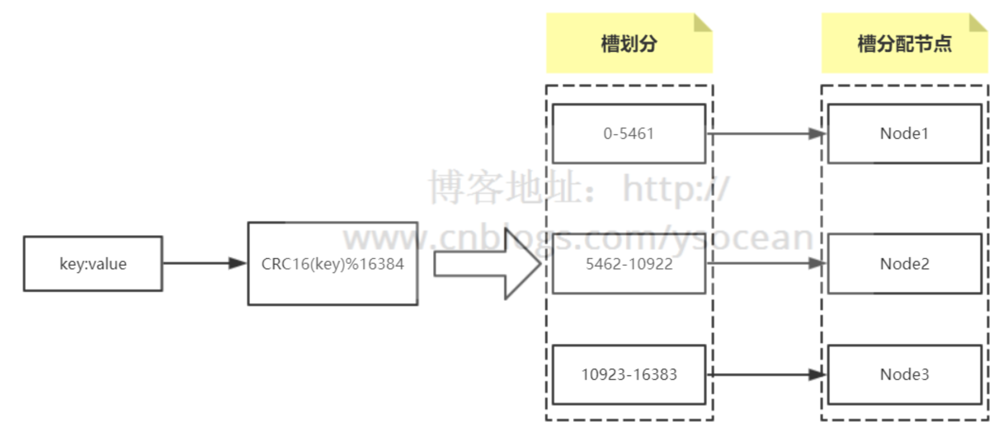

特点
- 解耦 数据 和 节点 之间的关系，简化了节点 扩容 和 收缩 难度。
- 节点自身 维护槽的 映射关系，不需要 客户端 或者 代理服务 维护 槽分区元数据。
- 支持 节点、槽、键 之间的 映射查询，用于 数据路由、在线伸缩 等场景
- 只有一个数据库db0

# Redis Cluster 节点通信原理：Gossip 算法

## Gossip 简介
Gossip 协议，顾名思义，就像流言蜚语一样，利用一种随机、带有传染性的方式，将信息传播到整个网络中，并在一定时间内，使得系统内的所有节点数据一致。对你来说，掌握这个协议不仅能很好地理解这种最常用的，实现最终一致性的算法，也能在后续工作中得心应手地实现数据的最终一致性。

Gossip 协议又称 epidemic 协议（epidemic protocol），是基于流行病传播方式的节点或者进程之间信息交换的协议，在P2P网络和分布式系统中应用广泛，它的方法论也特别简单：

在一个处于有界网络的集群里，如果每个节点都随机与其他节点交换特定信息，经过足够长的时间后，集群各个节点对该份信息的认知终将收敛到一致。
这里的“特定信息”一般就是指集群状态、各节点的状态以及其他元数据等。Gossip协议是完全符合 BASE 原则，可以用在任何要求最终一致性的领域，比如分布式存储和注册中心。另外，它可以很方便地实现弹性集群，允许节点随时上下线，提供快捷的失败检测和动态负载均衡等。

此外，Gossip 协议的最大的好处是，即使集群节点的数量增加，每个节点的负载也不会增加很多，几乎是恒定的。这就允许 Redis Cluster 或者 Consul 集群管理的节点规模能横向扩展到数千个。

## 节点状态和消息类型
Redis Cluster 中的每个节点都维护一份自己视角下的当前整个集群的状态，主要包括：
- 当前集群状态
- 集群中各节点所负责的 slots信息，及其migrate状态
- 集群中各节点的master-slave状态
- 集群中各节点的存活状态及怀疑Fail状态
  也就是说上面的信息，就是集群中Node相互八卦传播流言蜚语的内容主题，而且比较全面，既有自己的更有别人的，这么一来大家都相互传，最终信息就全面而且一致了。

Redis Cluster 的节点之间会相互发送多种消息，较为重要的如下所示：

- MEET：通过「cluster meet ip port」命令，已有集群的节点会向新的节点发送邀请，加入现有集群，然后新节点就会开始与其他节点进行通信；
- PING：节点按照配置的时间间隔向集群中其他节点发送 ping 消息，消息中带有自己的状态，还有自己维护的集群元数据，和部分其他节点的元数据；
- PONG: 节点用于回应 PING 和 MEET 的消息，结构和 PING 消息类似，也包含自己的状态和其他信息，也可以用于信息广播和更新；
- FAIL: 节点 PING 不通某节点后，会向集群所有节点广播该节点挂掉的消息。其他节点收到消息后标记已下线。

通过上述这些消息，集群中的每一个实例都能获得其它所有实例的状态信息。这样一来，即使有新节点加入、节点故障、Slot 变更等事件发生，实例间也可以通过 PING、PONG 消息的传递，完成集群状态在每个实例上的同步。下面，我们依次来看看几种常见的场景。

### 定时 PING/PONG 消息
Redis Cluster 中的节点都会定时地向其他节点发送 PING 消息，来交换各个节点状态信息，检查各个节点状态，包括在线状态、疑似下线状态 PFAIL 和已下线状态 FAIL。

Redis 集群的定时 PING/PONG 的工作原理可以概括成两点：

- 一是，每个实例之间会按照一定的频率，从集群中随机挑选一些实例，把 PING 消息发送给挑选出来的实例，用来检测这些实例是否在线，并交换彼此的状态信息。PING 消息中封装了发送消息的实例自身的状态信息、部分其它实例的状态信息，以及 Slot 映射表。
- 二是，一个实例在接收到 PING 消息后，会给发送 PING 消息的实例，发送一个 PONG 消息。PONG 消息包含的内容和 PING 消息一样。

下图显示了两个实例间进行 PING、PONG 消息传递的情况，其中实例一为发送节点，实例二是接收节点

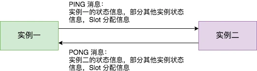

### 新节点上线
Redis Cluster 加入新节点时，客户端需要执行 CLUSTER MEET 命令，如下图所示。

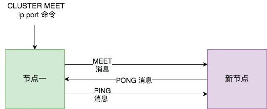

节点一在执行 CLUSTER MEET 命令时会首先为新节点创建一个 clusterNode 数据，并将其添加到自己维护的 clusterState 的 nodes 字典中。有关 clusterState 和 clusterNode 关系，我们在最后一节会有详尽的示意图和源码来讲解。

然后节点一会根据据 CLUSTER MEET 命令中的 IP 地址和端口号，向新节点发送一条 MEET 消息。新节点接收到节点一发送的MEET消息后，新节点也会为节点一创建一个 clusterNode 结构，并将该结构添加到自己维护的 clusterState 的 nodes 字典中。

接着，新节点向节点一返回一条PONG消息。节点一接收到节点B返回的PONG消息后，得知新节点已经成功的接收了自己发送的MEET消息。

最后，节点一还会向新节点发送一条 PING 消息。新节点接收到该条 PING 消息后，可以知道节点A已经成功的接收到了自己返回的P ONG消息，从而完成了新节点接入的握手操作。

MEET 操作成功之后，节点一会通过稍早时讲的定时 PING 机制将新节点的信息发送给集群中的其他节点，让其他节点也与新节点进行握手，最终，经过一段时间后，新节点会被集群中的所有节点认识。

### 节点疑似下线和真正下线
Redis Cluster 中的节点会定期检查已经发送 PING 消息的接收方节点是否在规定时间 ( cluster-node-timeout ) 内返回了 PONG 消息，如果没有则会将其标记为疑似下线状态，也就是 PFAIL 状态，如下图所示。

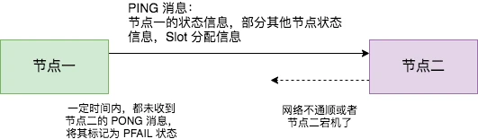

然后，节点一会通过 PING 消息，将节点二处于疑似下线状态的信息传递给其他节点，例如节点三。节点三接收到节点一的 PING 消息得知节点二进入 PFAIL 状态后，会在自己维护的 clusterState 的 nodes 字典中找到节点二所对应的 clusterNode 结构，并将主节点一的下线报告添加到 clusterNode 结构的 fail_reports 链表中。

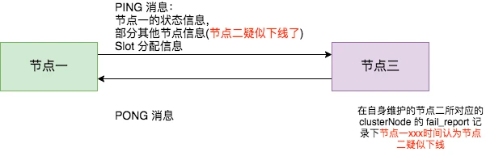

随着时间的推移，如果节点十 (举个例子) 也因为 PONG 超时而认为节点二疑似下线了，并且发现自己维护的节点二的 clusterNode 的 fail_reports 中有半数以上的主节点数量的未过时的将节点二标记为 PFAIL 状态报告日志，那么节点十将会把节点二将被标记为已下线 FAIL 状态，并且节点十会立刻向集群其他节点广播主节点二已经下线的 FAIL 消息，所有收到 FAIL 消息的节点都会立即将节点二状态标记为已下线。如下图所示。

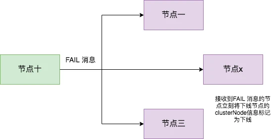

需要注意的是，报告疑似下线记录是由时效性的，如果超过 cluster-node-timeout *2 的时间，这个报告就会被忽略掉，让节点二又恢复成正常状态。


# Redis cluster伸缩的原理
## 集群扩容
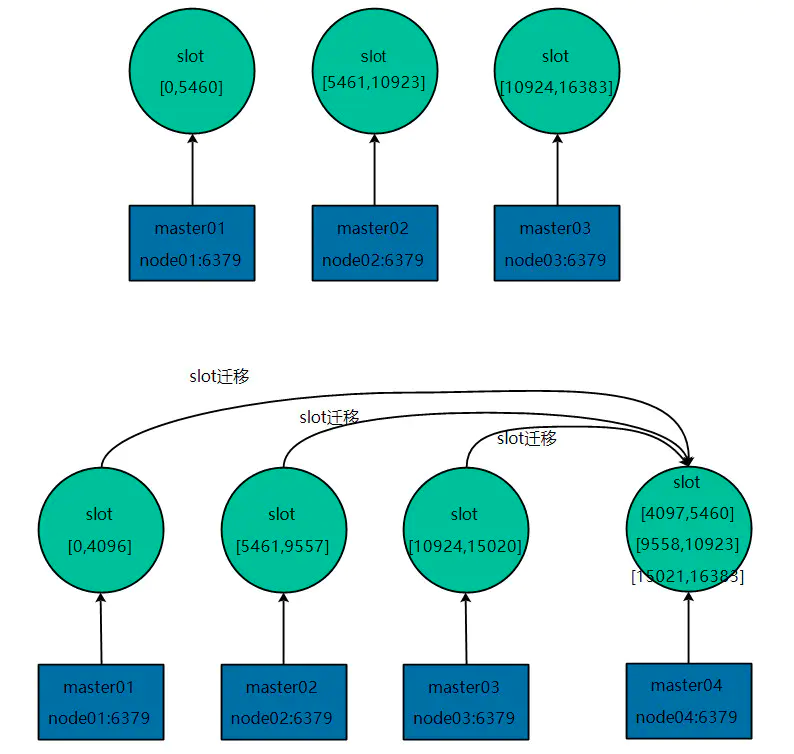

每个master把一部分槽和数据迁移到新的节点node04

## 集群收缩
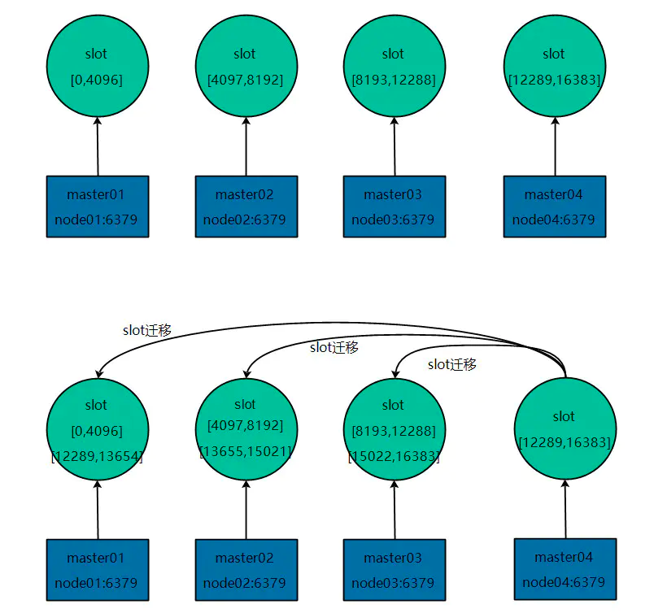

- 如果下线的是slave，那么通知其他节点忘记下线的节点
- 如果下线的是master，那么将此master的slot迁移到其他master之后，通知其他节点忘记此master节点
- 其他节点都忘记了下线的节点之后，此节点就可以正常停止服务了

## redis cluster为什么没有使用一致性hash算法，而是使用了哈希槽预分片？
缓存热点问题：一致性哈希算法在节点太少时，容易因为数据分布不均匀而造成缓存热点的问题。一致性哈希算法可能集中在某个hash区间内的值特别多，会导致大量的数据涌入同一个节点，造成master的热点问题(如同一时间20W的请求都在某个hash区间内)。

## redis的hash槽为什么是16384(2^14)个卡槽，而不是65536(2^16)个？
- 如果槽位为65536，发送心跳信息的消息头达8k，发送的心跳包过于庞大。
- redis的集群主节点数量基本不可能超过1000个。集群节点越多，心跳包的消息体内携带的数据越多。如果节点过1000个，也会导致网络拥堵。因此redis作者，不建议redis cluster节点数量超过1000个。 那么，对于节点数在1000以内的redis cluster集群，16384个槽位够用了。没有必要拓展到65536个。
- 槽位越小，节点少的情况下，压缩率高。

# redis索引
Redis并不支持索引，需要自己来维护

对于非范围唯一索引，我们可以简单的把索引存为k-v即可

对于范围索引或非唯一索引，则要使用redis 的 zset来实现。

举例一个传统的用户系统例子
```java
uid 用户id
name 用户名
credit 用户积分
type 类型
```
可以直接放到一个hashset中
```shell
hmset usr:1 uid 1 name aaa credit 10 type 0
hmset usr:2 uid 2 name bbb credit 20 type 1
```
通过uid检索很快，但是如果要查询type=1的用户，则只能全扫描！

在关系数据库中，我们可以简单在type上建立索引
```sql
select * from usr where type=1
```
这样的SQL就可以高效执行了。redis中需要我们自己再维护一个zset
```shell
zadd usr.index.type 0 0:1
zadd usr.index.type 0 1:2
```
注意,所有权重都设置成0,这样可以直接按值检索,然后可以通过
```shell
zrangebylex usr.index.type [1: (1;
```

# 参考文章
- https://www.jianshu.com/p/53083f5f2ddc
- https://cloud.tencent.com/developer/article/1608410
