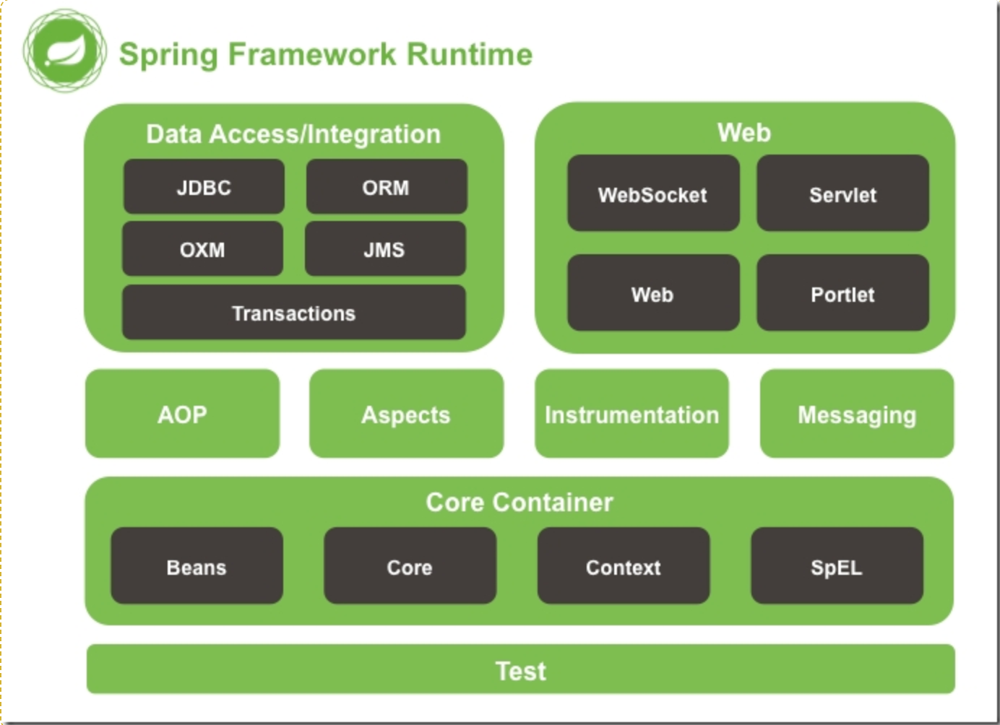
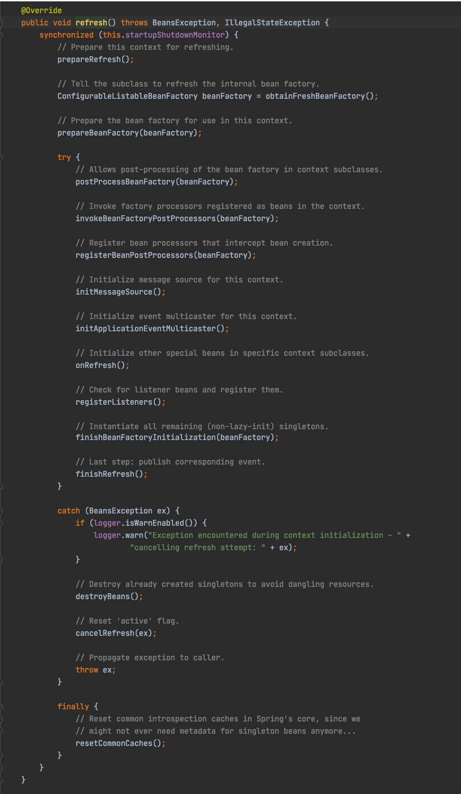
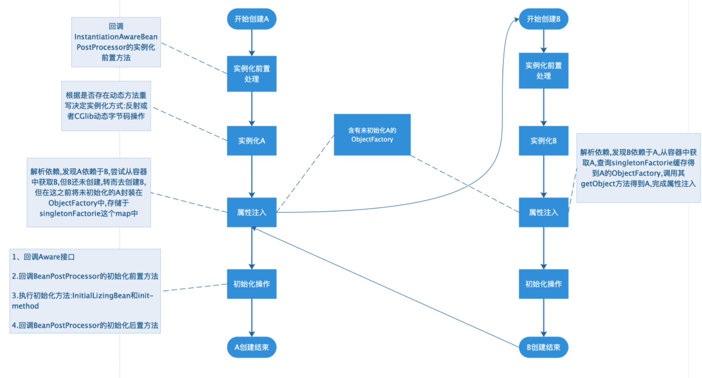
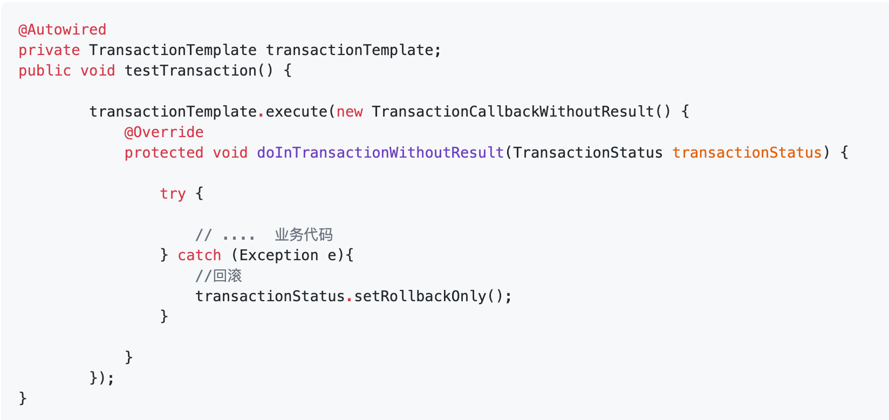
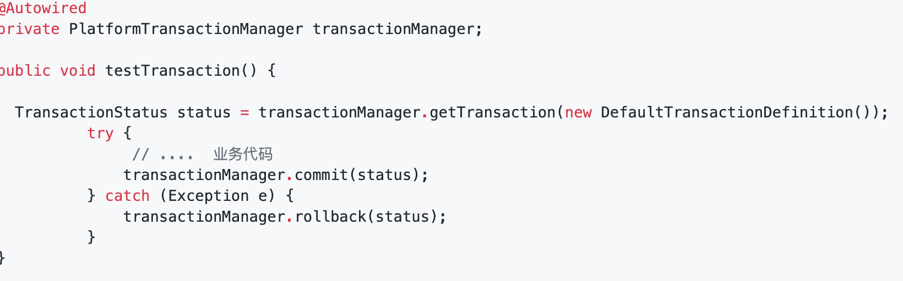

# spring
## 架构图

## 模块
### Core Container
核心容器(Core Container)
- `spring-beans` 该模块是依赖注入IoC与DI的最基本实现
- `spring-core` 该模块是Bean工厂与bean的装配
- `spring-context` 该模块构架于核心模块之上，它扩展了 BeanFactory，为它添加了 Bean 生命周期控制、框架事件体系以及资源加载透明化等功能。ApplicationContext 是该模块的核心接口，它的超类是 BeanFactory。与BeanFactory 不同，ApplicationContext 容器实例化后会自动对所有的单实例 Bean 进行实例化与依赖关系的装配，使之处于待用状态
- `spring-context-indexer` 该模块是 Spring 的类管理组件和 Classpath 扫描
- `spring-context-support` 该模块是对 Spring IOC 容器的扩展支持，以及 IOC 子容器
- `spring-expression` 该模块是Spring表达式语言块是统一表达式语言（EL）的扩展模块，可以查询、管理运行中的对象，同时也方便的可以调用对象方法、操作数组、集合等
### Data Access/Integration
数据访问/集成 
- `spring-jdbc` 该模块提供了 JDBC抽象层，它消除了冗长的 JDBC 编码和对数据库供应商特定错误代码的解析
- `spring-tx` 该模块支持编程式事务和声明式事务，可用于实现了特定接口的类和所有的 POJO 对象。编程式事务需要自己写beginTransaction()、commit()、rollback()等事务管理方法，声明式事务是通过注解或配置由 spring 自动处理，编程式事务粒度更细
- `spring-orm` 该模块提供了对流行的对象关系映射 API的集成，包括 JPA、JDO 和 Hibernate 等。通过此模块可以让这些 ORM 框架和 spring 的其它功能整合，比如前面提及的事务管理
- `spring-oxm` 该模块提供了对 OXM 实现的支持，比如JAXB、Castor、XML Beans、JiBX、XStream等
- `spring-jms` 该模块包含生产（produce）和消费（consume）消息的功能。从Spring 4.1开始，集成了 spring-messaging 模块
### Web
网络部分
- `spring-web` 该模块为 Spring 提供了最基础 Web 支持，主要建立于核心容器之上，通过 Servlet 或者 Listeners 来初始化 IOC 容器，也包含一些与 Web 相关的支持
- `spring-webmvc` 该模块众所周知是一个的 Web-Servlet 模块，实现了 Spring MVC（model-view-Controller）的 Web 应用
- `spring-websocket` 该模块主要是与 Web 前端的全双工通讯的协议
- `spring-webflux` 该模块是一个新的非堵塞函数式 Reactive Web 框架，可以用来建立异步的，非阻塞，事件驱动的服务，并且扩展性非常好。
### 面向切面编程(AOP和Aspects)
- `spring-aop` 该模块是Spring的另一个核心模块，是 AOP 主要的实现模块
- `spring-aspects` 该模块提供了对 AspectJ 的集成，主要是为 Spring AOP提供多种 AOP 实现方法，如前置方法后置方法等
### 设备(Instrumentation)
- `spring-instrument` 该模块是基于JAVA SE 中的"java.lang.instrument"进行设计的，应该算是 AOP的一个支援模块，主要作用是在 JVM 启用时，生成一个代理类，程序员通过代理类在运行时修改类的字节，从而改变一个类的功能，实现 AOP 的功能
### 消息(Messaging)
- `spring-messaging` 是从 Spring4 开始新加入的一个模块，主要职责是为 Spring 框架集成一些基础的报文传送应用
### 测试(Test)
- `spring-test` 主要为测试提供支持的，通过 JUnit 和 TestNG 组件支持单元测试和集成测试。它提供了一致性地加载和缓存 Spring 上下文，也提供了用于单独测试代码的模拟对象（mock object）
## IOC
### IOC和DI的概念
#### IOC (控制反转)
说简单点就是当我们使用对象调用一个方法或者类时，不再由我们主动去创建这个类的对象，控制权交给spring框架。说复杂点就是资源（组件）不再由使用资源双方进行管理，而是由不使用资源的第三方统一管理，这样带来的好处。第一，资源的集中管理，实现资源的可配置和易管理。第二，降低了使用资源双方的依赖程度，也就是我们说的耦合度
#### DI (依赖注入)
由spring框架主动创建被调用类的对象，然后把这个对象注入到我们自己的类中，使得我们可以直接使用它
### 使用IOC的好处
- 不用自己组装，拿来就用。
- 享受单例的好处，效率高，不浪费空间
- 便于单元测试，方便切换mock组件
- 便于进行AOP操作，对于使用者是透明的
- 统一配置，便于修改
### Spring IoC的初始化过程
#### IOC粗略总结
1. 首先入口是xml或者注解或者其他形式，要实现beanDefinationReader接口，然后 读取的时候，会将他们解析为bean的定义信息；
2. beanFactory在加载bean信息实例化（底层用的反射）之前，spring加了一个接口beanFactoryPostProcessor,用作扩展用。
3. beanFactory内部实例化bean之后，在要初始化bean对象之前，增加了一个一系列aware接口，将他的容器，以及工厂都暴露出来供使用者做扩展用。
4. 经过一些列容器以及容器对象的注入之后，在初始化之前，spring又增加了一个接口 beanPostProcessor,该接口是可以作用于所有创建的bean,在初始化前后，均能通过重写该接口获取bean对象进行定制操作。
5. 经过实现初始化接口完成初始化功能。
6. 经过实现销毁接口disposableBean结束其生命。
#### 重要的组件
- `BeanDefinition` 描述bean的属性的接口，例如bean的scope是单例还是多例，构造方法，有哪些property value，依赖等，相当于对这个bean的一份身份描述
  - Bean配置 --> BeanDefinition --> Bean对象
  - 懒加载情况下，refresh只是把BeanDefinition注册到BeanFactory中，而不是把Bean注册到BeanFactory中。在调用上下文的getBean的时候才会去根据BeanDefinition生成具体的bean对象
- `BeanDefinitionMap`
- `BeanFactory`
  - spring的基础bean容器
  - 相当于存放所有bean的容器
- `ApplicationContext`
  - BeanFactory 的子接口，在 BeanFactory 的基础上构建，是相对比较高级的 IoC 容器实现。包含 BeanFactory 的所有功能，还提供了其他高级的特性，比如：事件发布、国际化信息支持、统一资源加载策略等。正常情况下，我们都是使用的 ApplicationContext
  - 相当于丰富了beanfactory的功能，这里理解为上下文就好
- `FactoryBean`
#### 源码解析

AbstractApplicationContext 中的refresh()方法是启动加载整个容器的关键方法
1. 首先是一个synchronized加锁，当然要加锁，不然你先调一次refresh()然后这次还没处理完又调一次，就会乱套了；
2. 接着往下看prepareRefresh();这个方法是做准备工作的，记录容器的启动时间、标记“已启动”状态、处理配置文件中的占位符，可以点进去看看，这里就不多说了。
3. 下一步ConfigurableListableBeanFactory beanFactory = obtainFreshBeanFactory();这个就很重要了，这一步是把配置文件解析成一个个Bean，并且注册到BeanFactory中，注意这里只是注册进去，并没有初始化。先继续往下看，等会展开这个方法详细解读
4. 然后是prepareBeanFactory(beanFactory);这个方法的作用是：设置 BeanFactory 的类加载器，添加几个 BeanPostProcessor，手动注册几个特殊的 bean，这里都是spring里面的特殊处理，然后继续往下看
5. postProcessBeanFactory(beanFactory);方法是提供给子类的扩展点，到这里的时候，所有的 Bean 都加载、注册完成了，但是都还没有初始化，具体的子类可以在这步的时候添加一些特殊的 BeanFactoryPostProcessor 的实现类，来完成一些其他的操作。
6. 接下来是invokeBeanFactoryPostProcessors(beanFactory);这个方法是调用 BeanFactoryPostProcessor 各个实现类的 postProcessBeanFactory(factory) 方法；
7. 然后是registerBeanPostProcessors(beanFactory);这个方法注册 BeanPostProcessor 的实现类，和上面的BeanFactoryPostProcessor 是有区别的，这个方法调用的其实是PostProcessorRegistrationDelegate类的registerBeanPostProcessors方法；这个类里面有个内部类BeanPostProcessorChecker，BeanPostProcessorChecker里面有两个方法postProcessBeforeInitialization和postProcessAfterInitialization，这两个方法分别在 Bean 初始化之前和初始化之后得到执行。然后回到refresh()方法中继续往下看
8. initMessageSource();方法是初始化当前 ApplicationContext 的 MessageSource，国际化处理，继续往下
9. initApplicationEventMulticaster();方法初始化当前 ApplicationContext 的事件广播器继续往下
10. onRefresh();方法初始化一些特殊的 Bean（在初始化 singleton beans 之前）；继续往下
11. registerListeners();方法注册事件监听器，监听器需要实现 ApplicationListener 接口；继续往下
12. 重点到了：finishBeanFactoryInitialization(beanFactory);初始化所有的 singleton beans（单例bean），懒加载（non-lazy-init）的除外，这个方法也是等会细说
13. finishRefresh();方法是最后一步，广播事件，ApplicationContext 初始化完成
### Spring bean的生命周期
  - 实例化 Instantiation
  - 属性赋值 Populate
  - 初始化 Initialization
  - 销毁 Destruction
### bean的作用域
### 循环依赖问题

				
## AOP
### AOP原理
AOP实际上就是OOP的补充，将代码横向抽取成一个独立的模块，再织入到目标方法中
- 底层是动态代理技术
  - JDK动态代理(基于接口)
  - CBLib动态代理(基于类)
  - 在Spring AOP中，如果使用的是单例，推荐使用CGLib代理
### AOP术语
#### 连接点(Join point)
能够被拦截的地方
####        切点(Poincut)
具体定位的连接点
#### 增强/通知(Advice)
表示添加到切点的一段逻辑代码，并定位连接点的方位信息
#### 织入(Weaving)
将增强/通知添加到目标类的具体连接点上的过程。
#### 引入/引介(Introduction)
允许我们向现有的类添加新方法或属性。是一种特殊的增强！
#### 切面(Aspect)
切面由切点和增强/通知组成，它既包括了横切逻辑的定义、也包括了连接点的定义
### Spring对AOP的支持
- 基于代理的经典SpringAOP：需要实现接口，手动创建代理
- 纯POJO切面：使用XML配置，aop命名空间
- @AspectJ注解驱动的切面：使用注解的方式，这是最简洁和最方便的！
## 事务
### Spring 支持两种方式的事务管理
- 编程式事务管理
  - TransactionTemplate
    				
  - TransactionManager
    				
- 注解
  - @Transactional
### 事务的传播性 Propagation
- `REQUIRED` 这是默认的传播属性，如果外部调用方有事务，将会加入到事务，没有的话新建一个。
- `PROPAGATION_SUPPORTS` 如果当前存在事务，则加入到该事务；如果当前没有事务，则以非事务的方式继续运行。
- `PROPAGATION_NOT_SUPPORTED` 以非事务方式运行，如果当前存在事务，则把当前事务挂起。
- `PROPAGATION_NEVER` 以非事务方式运行，如果当前存在事务，则抛出异常。