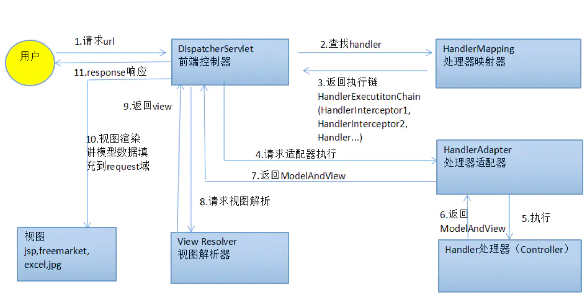

* [springMVC](#springmvc)
   * [流程](#流程)
   * [执行流程](#执行流程)

# springMVC
## 流程

## 执行流程
1. [用户发送请求至前端控制器DispatcherServlet](#)
   1. DispatcherServlet：前端控制器。用户请求到达前端控制器，它就相当于mvc模式中的c，dispatcherServlet是整个流程控制的中心，由它调用其它组件处理用户的请求，dispatcherServlet的存在降低了组件之间的耦合性,系统扩展性提高。由框架实现
   2. doService doDispatch(request, response);
2. [DispatcherServlet收到请求调用处理器映射器HandlerMapping](#)
   1. HandlerMapping：处理器映射器。HandlerMapping负责根据用户请求的url找到Handler即处理器，springmvc提供了不同的映射器实现不同的映射方式，根据一定的规则去查找,例如：xml配置方式，实现接口方式，注解方式等。由框架实现
3. [处理器映射器根据请求url找到具体的处理器，生成处理器执行链HandlerExecutionChain(包括处理器对象和处理器拦截器)一并返回给DispatcherServlet](#)
4. [DispatcherServlet根据处理器Handler获取处理器适配器HandlerAdapter执行HandlerAdapter处理一系列的操作，如：参数封装，数据格式转换，数据验证等操作](#)
   1. Handler：处理器。Handler 是继DispatcherServlet前端控制器的后端控制器，在DispatcherServlet的控制下Handler对具体的用户请求进行处理。由于Handler涉及到具体的用户业务请求，所以一般情况需要程序员根据业务需求开发Handler。
   2. 将http报文转换为对象
      1. HttpMessageConverter接口
         1. `canRead` http->object
         2. `canWrite` 对象的序列化输出
      2. HttpMessageConverter有很多的实现类，根据HTTP协议的Accept和Content-Type属性，以及参数数据类型来判别使用哪一种HttpMessageConverter
5. [执行处理器Handler(Controller，也叫页面控制器)](#)
6. [Handler执行完成返回ModelAndView](#)
7. [HandlerAdapter将Handler执行结果ModelAndView返回到DispatcherServlet](#)
   1. HandlAdapter：处理器适配器。通过HandlerAdapter对处理器进行执行，这是适配器模式的应用，通过扩展适配器可以对更多类型的处理器进行执行。由框架实现。
8. [DispatcherServlet将ModelAndView传给ViewReslover视图解析器](#)
   1. ModelAndView是springmvc的封装对象，将model和view封装在一起
9. [ViewReslover解析后返回具体View](#)
   1. ViewResolver：视图解析器。ViewResolver负责将处理结果生成View视图，ViewResolver首先根据逻辑视图名解析成物理视图名即具体的页面地址，再生成View视图对象，最后对View进行渲染将处理结果通过页面展示给用户
10. [DispatcherServlet对View进行渲染视图（即将模型数据model填充至视图中）](#)
    1. View:是springmvc的封装对象，是一个接口, springmvc框架提供了很多的View视图类型，包括：jspview，pdfview,jstlView、freemarkerView、pdfView等。一般情况下需要通过页面标签或页面模版技术将模型数据通过页面展示给用户，需要由程序员根据业务需求开发具体的页面。
11. [DispatcherServlet响应用户](#)