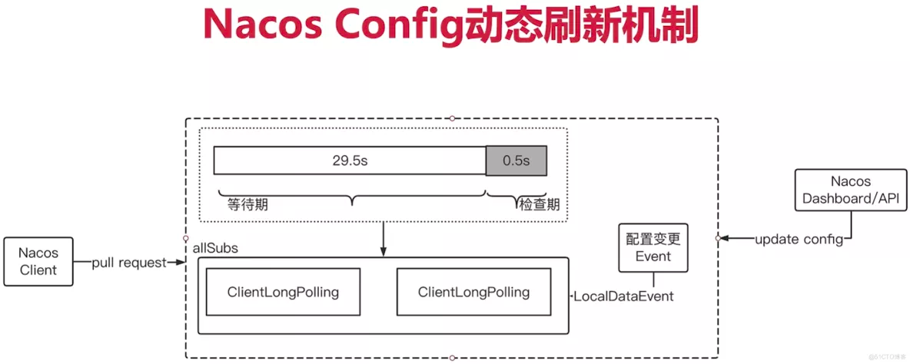
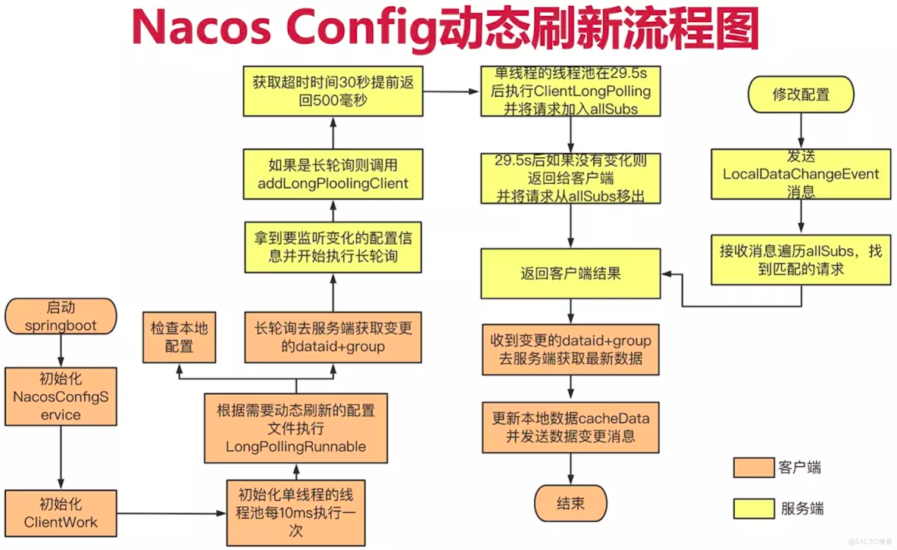

* [springcloud](#springcloud)
    * [服务注册与发现](#服务注册与发现)
        * [eureka](#eureka)
        * [consul](#consul)
    * [服务负载与调用](#服务负载与调用)
        * [ribbon](#ribbon)
        * [loadbalancer](#loadbalancer)
    * [服务负载与调用](#服务负载与调用-1)
        * [feign](#feign)
        * [openFeign](#openfeign)
    * [服务熔断与降级](#服务熔断与降级)
        * [hystrix](#hystrix)
        * [resilience4j](#resilience4j)
    * [服务网关](#服务网关)
        * [zuul](#zuul)
        * [zuul2](#zuul2)
        * [getway](#getway)
    * [服务分布式配置](#服务分布式配置)
        * [springcloud config](#springcloud-config)
        * [Nacos](#nacos)
* [springcloudAlibaba](#springcloudalibaba)
    * [Nacos](#nacos-1)
        * [服务注册中心](#服务注册中心)
        * [服务配置](#服务配置)
        * [服务总线](#服务总线)
    * [Sentienl](#sentienl)
# springcloud
Spring Cloud是一系列框架的有序集合。它利用Spring Boot的开发便利性巧妙地简化了分布式系统基础设施的开发，如服务发现注册、配置中心、智能路由、消息总线、负载均衡、断路器、数据监控等，都可以用Spring Boot的开发风格做到一键启动和部署。

Spring Cloud并没有重复制造轮子，它只是将各家公司开发的比较成熟、经得起实际考验的服务框架组合起来，通过Spring Boot风格进行再封装屏蔽掉了复杂的配置和实现原理，最终给开发者留出了一套简单易懂、易部署和易维护的分布式系统开发工具包。
## 服务注册与发现
### eureka
服务治理组件，包括服务端的注册中心和客户端的服务发现机制；
### consul
基于Hashicorp Consul的服务治理组件。
## 服务负载与均衡
### ribbon
负载均衡的服务调用组件，具有多种负载均衡调用策略；
### loadbalancer
## 服务负载与调用
### feign
基于Ribbon和Hystrix的声明式服务调用组件；
### openFeign
基于Ribbon和Hystrix的声明式服务调用组件，可以动态创建基于Spring MVC注解的接口实现用于服务调用，在Spring Cloud 2.0中已经取代Feign成为了一等公民。
## 服务熔断与降级
### hystrix
服务容错组件，实现了断路器模式，为依赖服务的出错和延迟提供了容错能力；
### resilience4j
## 服务网关
### zuul
API网关组件，对请求提供路由及过滤功能。
### zuul2
### getway
API网关组件，对请求提供路由及过滤功能。
## 服务分布式配置
### springcloud config
集中配置管理工具，分布式系统中统一的外部配置管理，默认使用Git来存储配置，可以支持客户端配置的刷新及加密、解密操作。
### Nacos
## 总线
### Spring Cloud Bus
用于传播集群状态变化的消息总线，使用轻量级消息代理链接分布式系统中的节点，可以用来动态刷新集群中的服务配置。
# springcloudAlibaba
## Nacos
Nacos 是一个开源的分布式系统服务发现、配置管理和服务管理平台。它主要包含以下功能：

服务发现与注册：Nacos 可以管理服务的注册和发现，支持 DNS 和 HTTP/RESTful 方式。
配置管理：Nacos 可以动态管理配置，支持多种数据类型和版本控制。
服务管理：Nacos 可以对服务进行健康检查、流量管理、负载均衡等。
### 服务发现与注册
Nacos 实现服务发现和注册的核心代码位于 nacos/naming 目录下，包括以下文件：

- naming-common/src/main/java/com/alibaba/nacos/api/naming: 定义了服务发现和注册的 API 接口和数据模型。
- naming-core/src/main/java/com/alibaba/nacos/naming: 实现了服务发现和注册的核心逻辑。
- naming-impl/src/main/java/com/alibaba/nacos/naming: 实现了服务发现和注册的具体实现。

下面简单介绍一下 Nacos 的服务发现和注册的实现流程。

#### 服务注册流程
服务提供者向 Nacos 注册服务时，会调用 NamingService.registerInstance() 方法，该方法会做以下几件事情：

1. 将服务实例的元数据封装为 Instance 对象，包括服务名、IP、端口号、健康状态、元数据等。
2. 将 Instance 对象转换为 InstanceEntity 对象，包含了实例 ID 和实例元数据的 JSON 字符串。
3. 将 InstanceEntity 对象存储到 Nacos 中，可以存储到内存中或者持久化到磁盘中。

#### 服务发现流程
服务消费者向 Nacos 发现服务时，会调用 NamingService.getAllInstances() 或 NamingService.selectInstances() 方法，该方法会做以下几件事情：

1. 从 Nacos 中获取服务实例的元数据，包括服务名、IP、端口号、健康状态、元数据等。
2. 将元数据封装为 Instance 对象，存储到本地缓存中。
3. 根据负载均衡算法选择一个服务实例处理请求，可以选择轮询、随机、权重等算法。

服务发现和注册的核心逻辑在 naming-core 目录下的 com.alibaba.nacos.naming 包中实现，主要包括以下类：

- com.alibaba.nacos.naming.core.InstancesManager: 维护服务实例的元数据和状态信息。
- com.alibaba.nacos.naming.core.Cluster: 维护一个服务的所有实例信息和负载均衡策略。
- com.alibaba.nacos.naming.core.InstanceOperator: 实现了服务实例的注册、注销和更新操作。
- com.alibaba.nacos.naming.core.DomainsManager: 维护多个服务的信息，包括服务名、集群名、命名空间等。

服务发现和注册的具体实现在 naming-impl 目录下的 com.alibaba.nacos.naming 包中，主要包括以下类：

- com.alibaba.nacos.naming.push.PushService: 实现了服务实例的推送功能。
- com.alibaba.nacos.naming.healthcheck.HealthCheckProcessor: 实现了服务实例的健康检查功能。
- com.alibaba.nacos.naming.misc.GlobalConfig: 存储了一些全局配置，例如默认权重值、心跳间隔

### 配置动态刷新

从远端服务器获取变更数据的主要模式有两种：推（push）和拉（pull）。Push 模式简单来说就是服务端主动将数据变更信息推送给客户端，这种模式优点是时效性好，服务端数据发生变更可以立马通知到客户端，但这种模式需要服务端维持与客户端的心跳连接，会增加服务端实现的复杂度，服务端也需要占用更多的资源来维持与客户端的连接。

而 Pull 模式则是客户端主动去服务器请求数据，例如，每间隔10ms就向服务端发起请求获取数据。显而易见pull模式存在时效性问题。请求的间隔也不太好设置，间隔太短，对服务器请求压力过大。间隔时间过长，那么必然会造成时效性很差。而且如果配置长时间不更新，并且存在大量的客户端就会产生大量无效的pull请求。

Nacos 没有采用上述的两种模式，而是采用了长轮询方式结合了推和拉的优点：



长轮询也是轮询，因此 Nacos 客户端会默认每10ms向服务端发起请求，当客户端请求服务端时会在请求头上携带长轮询的超时时间，默认是30s。而服务端接收到该请求时会hang住请求，为了防止客户端超时会在请求头携带的超时时间上减去500ms，因此默认会hang住请求29.5s。在这期间如果服务端发生了配置变更会产生相应的事件，监听到该事件后，会响应对应的客户端。这样一来客户端不会频繁发起轮询请求，而服务端也不需要维持与客户端的心跳，兼备了时效性和复杂度。



#### Nacos Config 长轮询源码剖析
首先，打开 com.alibaba.cloud.nacos.NacosConfigBootstrapConfiguration 这个类，从类名也可以看出该类是Nacos Config的启动配置类，是Nacos Config自动装配的入口。在该类中的 nacosConfigManager 方法实例化了一个 NacosConfigManager 对象，并注册到容器中：

```java
@Bean
@ConditionalOnMissingBean
public NacosConfigManager nacosConfigManager(
		NacosConfigProperties nacosConfigProperties) {
	return new NacosConfigManager(nacosConfigProperties);
}
```
在 NacosConfigManager 的构造器中调用了 createConfigService 方法，这是一个静态方法用来创建 ConfigService 对象的单例。
```java
/**
 * Compatible with old design,It will be perfected in the future.
 */
static ConfigService createConfigService(
		NacosConfigProperties nacosConfigProperties) {
    // 双重检查锁模式的单例
	if (Objects.isNull(service)) {
		synchronized (NacosConfigManager.class) {
			try {
				if (Objects.isNull(service)) {
					service = NacosFactory.createConfigService(
							nacosConfigProperties.assembleConfigServiceProperties());
				}
			}
			catch (NacosException e) {
				log.error(e.getMessage());
				throw new NacosConnectionFailureException(
						nacosConfigProperties.getServerAddr(), e.getMessage(), e);
			}
		}
	}
	return service;
}
```
ConfigService 的具体实现是 NacosConfigService，在该类的构造器中主要初始化了 HttpAgent 和 ClientWorker 对象。ClientWorker 的构造器中则初始化了几个线程池：

```java
public ClientWorker(final HttpAgent agent, final ConfigFilterChainManager configFilterChainManager,
        final Properties properties) {
    this.agent = agent;
    this.configFilterChainManager = configFilterChainManager;
    
    // Initialize the timeout parameter
    init(properties);
    
    // 创建具有定时执行功能的单线程池，用于定时执行 checkConfigInfo 方法
    this.executor = Executors.newScheduledThreadPool(1, new ThreadFactory() {
        @Override
        public Thread newThread(Runnable r) {
            Thread t = new Thread(r);
            t.setName("com.alibaba.nacos.client.Worker." + agent.getName());
            t.setDaemon(true);
            return t;
        }
    });
    
    // 创建具有定时执行功能的且线程数与cpu核数相对应的线程池，用于根据需要动态刷新的配置文件执行 LongPollingRunnable，因此长轮询任务是可以有多个并行的
    this.executorService = Executors
            .newScheduledThreadPool(Runtime.getRuntime().availableProcessors(), new ThreadFactory() {
                @Override
                public Thread newThread(Runnable r) {
                    Thread t = new Thread(r);
                    t.setName("com.alibaba.nacos.client.Worker.longPolling." + agent.getName());
                    t.setDaemon(true);
                    return t;
                }
            });
            
    // 每10ms执行一次 checkConfigInfo 方法
    this.executor.scheduleWithFixedDelay(new Runnable() {
        @Override
        public void run() {
            try {
                checkConfigInfo();
            } catch (Throwable e) {
                LOGGER.error("[" + agent.getName() + "] [sub-check] rotate check error", e);
            }
        }
    }, 1L, 10L, TimeUnit.MILLISECONDS);
}

private void init(Properties properties) {
    // 长轮询的超时时间，默认为30秒，此参数会被放到请求头中带到服务端，服务端会根据该参数去做长轮询的hold
    timeout = Math.max(ConvertUtils.toInt(properties.getProperty(PropertyKeyConst.CONFIG_LONG_POLL_TIMEOUT),
            Constants.CONFIG_LONG_POLL_TIMEOUT), Constants.MIN_CONFIG_LONG_POLL_TIMEOUT);
    
    taskPenaltyTime = ConvertUtils
            .toInt(properties.getProperty(PropertyKeyConst.CONFIG_RETRY_TIME), Constants.CONFIG_RETRY_TIME);
    
    this.enableRemoteSyncConfig = Boolean
            .parseBoolean(properties.getProperty(PropertyKeyConst.ENABLE_REMOTE_SYNC_CONFIG));
}

/**
 * Check config info.
 */
public void checkConfigInfo() {
    // Dispatch taskes.
    // 获取需要监听的文件数量
    int listenerSize = cacheMap.size();
    // Round up the longingTaskCount.
    // 默认一个 LongPollingRunnable 可以处理监听3k个配置文件的变化，超过3k个才会创建新的 LongPollingRunnable
    int longingTaskCount = (int) Math.ceil(listenerSize / ParamUtil.getPerTaskConfigSize());
    if (longingTaskCount > currentLongingTaskCount) {
        for (int i = (int) currentLongingTaskCount; i < longingTaskCount; i++) {
            // The task list is no order.So it maybe has issues when changing.
            executorService.execute(new LongPollingRunnable(i));
        }
        currentLongingTaskCount = longingTaskCount;
    }
}
```
LongPollingRunnable 类主要用于检查本地配置，以及长轮询地去服务端获取变更配置的 dataid 和 group，其代码位于 com.alibaba.nacos.client.config.impl.ClientWorker 类，代码如下：
```java
class LongPollingRunnable implements Runnable {
    
    private final int taskId;
    
    public LongPollingRunnable(int taskId) {
        this.taskId = taskId;
    }
    
    @Override
    public void run() {
        
        List<CacheData> cacheDatas = new ArrayList<CacheData>();
        List<String> inInitializingCacheList = new ArrayList<String>();
        try {
            // check failover config
            // 遍历本地缓存的配置
            for (CacheData cacheData : cacheMap.values()) {
                if (cacheData.getTaskId() == taskId) {
                    cacheDatas.add(cacheData);
                    try {
                        // 检查本地配置
                        checkLocalConfig(cacheData);
                        if (cacheData.isUseLocalConfigInfo()) {
                            cacheData.checkListenerMd5();
                        }
                    } catch (Exception e) {
                        LOGGER.error("get local config info error", e);
                    }
                }
            }
            
            // check server config
            // 通过长轮询检查服务端配置
            List<String> changedGroupKeys = checkUpdateDataIds(cacheDatas, inInitializingCacheList);
            if (!CollectionUtils.isEmpty(changedGroupKeys)) {
                LOGGER.info("get changedGroupKeys:" + changedGroupKeys);
            }
            
            for (String groupKey : changedGroupKeys) {
                String[] key = GroupKey.parseKey(groupKey);
                String dataId = key[0];
                String group = key[1];
                String tenant = null;
                if (key.length == 3) {
                    tenant = key[2];
                }
                try {
                    String[] ct = getServerConfig(dataId, group, tenant, 3000L);
                    CacheData cache = cacheMap.get(GroupKey.getKeyTenant(dataId, group, tenant));
                    cache.setContent(ct[0]);
                    if (null != ct[1]) {
                        cache.setType(ct[1]);
                    }
                    LOGGER.info("[{}] [data-received] dataId={}, group={}, tenant={}, md5={}, content={}, type={}",
                            agent.getName(), dataId, group, tenant, cache.getMd5(),
                            ContentUtils.truncateContent(ct[0]), ct[1]);
                } catch (NacosException ioe) {
                    String message = String
                            .format("[%s] [get-update] get changed config exception. dataId=%s, group=%s, tenant=%s",
                                    agent.getName(), dataId, group, tenant);
                    LOGGER.error(message, ioe);
                }
            }
            for (CacheData cacheData : cacheDatas) {
                if (!cacheData.isInitializing() || inInitializingCacheList
                        .contains(GroupKey.getKeyTenant(cacheData.dataId, cacheData.group, cacheData.tenant))) {
                    cacheData.checkListenerMd5();
                    cacheData.setInitializing(false);
                }
            }
            inInitializingCacheList.clear();
            
            executorService.execute(this);
            
        } catch (Throwable e) {
            
            // If the rotation training task is abnormal, the next execution time of the task will be punished
            LOGGER.error("longPolling error : ", e);
            executorService.schedule(this, taskPenaltyTime, TimeUnit.MILLISECONDS);
        }
    }
}
```
上面有个 checkUpdateDataIds 方法，用于获取发生变更了的配置文件的dataId列表，它同样位于 ClientWorker 内。如下：
```java
/**
 * Fetch the dataId list from server.
 *
 * @param cacheDatas              CacheDatas for config infomations.
 * @param inInitializingCacheList initial cache lists.
 * @return String include dataId and group (ps: it maybe null).
 * @throws Exception Exception.
 */
List<String> checkUpdateDataIds(List<CacheData> cacheDatas, List<String> inInitializingCacheList) throws Exception {
    // 拼接出配置文件的唯一标识
    StringBuilder sb = new StringBuilder();
    for (CacheData cacheData : cacheDatas) {
        if (!cacheData.isUseLocalConfigInfo()) {
            sb.append(cacheData.dataId).append(WORD_SEPARATOR);
            sb.append(cacheData.group).append(WORD_SEPARATOR);
            if (StringUtils.isBlank(cacheData.tenant)) {
                sb.append(cacheData.getMd5()).append(LINE_SEPARATOR);
            } else {
                sb.append(cacheData.getMd5()).append(WORD_SEPARATOR);
                sb.append(cacheData.getTenant()).append(LINE_SEPARATOR);
            }
            if (cacheData.isInitializing()) {
                // It updates when cacheData occours in cacheMap by first time.
                inInitializingCacheList
                        .add(GroupKey.getKeyTenant(cacheData.dataId, cacheData.group, cacheData.tenant));
            }
        }
    }
    boolean isInitializingCacheList = !inInitializingCacheList.isEmpty();
    return checkUpdateConfigStr(sb.toString(), isInitializingCacheList);
}

/**
 * Fetch the updated dataId list from server.
 *
 * @param probeUpdateString       updated attribute string value.
 * @param isInitializingCacheList initial cache lists.
 * @return The updated dataId list(ps: it maybe null).
 * @throws IOException Exception.
 */
List<String> checkUpdateConfigStr(String probeUpdateString, boolean isInitializingCacheList) throws Exception {
    
    Map<String, String> params = new HashMap<String, String>(2);
    params.put(Constants.PROBE_MODIFY_REQUEST, probeUpdateString);
    Map<String, String> headers = new HashMap<String, String>(2);
    // 长轮询的超时时间
    headers.put("Long-Pulling-Timeout", "" + timeout);
    
    // told server do not hang me up if new initializing cacheData added in
    if (isInitializingCacheList) {
        headers.put("Long-Pulling-Timeout-No-Hangup", "true");
    }
    
    if (StringUtils.isBlank(probeUpdateString)) {
        return Collections.emptyList();
    }
    
    try {
        // In order to prevent the server from handling the delay of the client's long task,
        // increase the client's read timeout to avoid this problem.
        
        long readTimeoutMs = timeout + (long) Math.round(timeout >> 1);
        // 向服务端发起一个http请求，该请求在服务端配置没有变更的情况下默认会hang住30s
        HttpRestResult<String> result = agent
                .httpPost(Constants.CONFIG_CONTROLLER_PATH + "/listener", headers, params, agent.getEncode(),
                        readTimeoutMs);
        
        if (result.ok()) {
            setHealthServer(true);
            // 响应状态是成功则解析响应体得到 dataId、group、tenant 等信息并返回
            return parseUpdateDataIdResponse(result.getData());
        } else {
            setHealthServer(false);
            LOGGER.error("[{}] [check-update] get changed dataId error, code: {}", agent.getName(),
                    result.getCode());
        }
    } catch (Exception e) {
        setHealthServer(false);
        LOGGER.error("[" + agent.getName() + "] [check-update] get changed dataId exception", e);
        throw e;
    }
    return Collections.emptyList();
}
```
客户端对 listener 接口的请求会进入到服务端的 com.alibaba.nacos.config.server.controller.ConfigController#listener 方法进行处理，该方法主要是调用了 com.alibaba.nacos.config.server.controller.ConfigServletInner#doPollingConfig 方法。代码如下：
```java
/**
 * 轮询接口
 */
public String doPollingConfig(HttpServletRequest request, HttpServletResponse response,
                              Map<String, String> clientMd5Map, int probeRequestSize)
    throws IOException, ServletException {

    // 如果支持长轮询则进入长轮询的流程
    if (LongPollingService.isSupportLongPolling(request)) {
        longPollingService.addLongPollingClient(request, response, clientMd5Map, probeRequestSize);
        return HttpServletResponse.SC_OK + "";
    }

    // else 兼容短轮询逻辑
    List<String> changedGroups = MD5Util.compareMd5(request, response, clientMd5Map);

    // 兼容短轮询result
    String oldResult = MD5Util.compareMd5OldResult(changedGroups);
    String newResult = MD5Util.compareMd5ResultString(changedGroups);

    String version = request.getHeader(Constants.CLIENT_VERSION_HEADER);
    if (version == null) {
        version = "2.0.0";
    }
    int versionNum = Protocol.getVersionNumber(version);

    /**
     * 2.0.4版本以前, 返回值放入header中
     */
    if (versionNum < START_LONGPOLLING_VERSION_NUM) {
        response.addHeader(Constants.PROBE_MODIFY_RESPONSE, oldResult);
        response.addHeader(Constants.PROBE_MODIFY_RESPONSE_NEW, newResult);
    } else {
        request.setAttribute("content", newResult);
    }

    // 禁用缓存
    response.setHeader("Pragma", "no-cache");
    response.setDateHeader("Expires", 0);
    response.setHeader("Cache-Control", "no-cache,no-store");
    response.setStatus(HttpServletResponse.SC_OK);
    return HttpServletResponse.SC_OK + "";
}
```
我们主要关注上面的 com.alibaba.nacos.config.server.service.LongPollingService#addLongPollingClient 长轮询流程的方法。代码如下：
```java
public void addLongPollingClient(HttpServletRequest req, HttpServletResponse rsp, Map<String, String> clientMd5Map,
                                 int probeRequestSize) {

    String str = req.getHeader(LongPollingService.LONG_POLLING_HEADER);
    String noHangUpFlag = req.getHeader(LongPollingService.LONG_POLLING_NO_HANG_UP_HEADER);
    String appName = req.getHeader(RequestUtil.CLIENT_APPNAME_HEADER);
    String tag = req.getHeader("Vipserver-Tag");
    int delayTime = SwitchService.getSwitchInteger(SwitchService.FIXED_DELAY_TIME, 500);
    /**
     * 提前500ms返回响应，为避免客户端超时 @qiaoyi.dingqy 2013.10.22改动  add delay time for LoadBalance
     */
    long timeout = Math.max(10000, Long.parseLong(str) - delayTime);
    if (isFixedPolling()) {
        timeout = Math.max(10000, getFixedPollingInterval());
        // do nothing but set fix polling timeout
    } else {
        long start = System.currentTimeMillis();
        List<String> changedGroups = MD5Util.compareMd5(req, rsp, clientMd5Map);
        if (changedGroups.size() > 0) {
            generateResponse(req, rsp, changedGroups);
            LogUtil.clientLog.info("{}|{}|{}|{}|{}|{}|{}",
                System.currentTimeMillis() - start, "instant", RequestUtil.getRemoteIp(req), "polling",
                clientMd5Map.size(), probeRequestSize, changedGroups.size());
            return;
        } else if (noHangUpFlag != null && noHangUpFlag.equalsIgnoreCase(TRUE_STR)) {
            LogUtil.clientLog.info("{}|{}|{}|{}|{}|{}|{}", System.currentTimeMillis() - start, "nohangup",
                RequestUtil.getRemoteIp(req), "polling", clientMd5Map.size(), probeRequestSize,
                changedGroups.size());
            return;
        }
    }
    String ip = RequestUtil.getRemoteIp(req);
    // 一定要由HTTP线程调用，否则离开后容器会立即发送响应
    final AsyncContext asyncContext = req.startAsync();
    // AsyncContext.setTimeout()的超时时间不准，所以只能自己控制
    asyncContext.setTimeout(0L);
	
	// 在 ClientLongPolling 的 run 方法会将 ClientLongPolling 实例（携带了本次请求的相关信息）放入 allSubs 中，然后会在29.5s后再执行另一个 Runnable，该 Runnable 用于等待29.5s后依旧没有相应的配置变更时对客户端进行响应，并将相应的 ClientLongPolling 实例从 allSubs 中移出
    scheduler.execute(
        new ClientLongPolling(asyncContext, clientMd5Map, ip, probeRequestSize, timeout, appName, tag));
}
```
而 LongPollingService 实现了 AbstractEventListener，也就是说能接收事件通知，在其 com.alibaba.nacos.config.server.service.LongPollingService#onEvent 方法中可以看到，它关注的是 LocalDataChangeEvent 事件：
```java
@Override
public void onEvent(Event event) {
    if (isFixedPolling()) {
        // ignore
    } else {
        if (event instanceof LocalDataChangeEvent) {
            LocalDataChangeEvent evt = (LocalDataChangeEvent)event;
            scheduler.execute(new DataChangeTask(evt.groupKey, evt.isBeta, evt.betaIps));
        }
    }
}
```
在nacos上修改配置后就会产生 LocalDataChangeEvent 事件，此时 LongPollingService 也就能监听到，当收到该事件时就会遍历 allSubs，找到匹配的请求并将 groupKey 返回给客户端。具体代码在 DataChangeTask 中：
```java
class DataChangeTask implements Runnable {
    @Override
    public void run() {
        try {
            ConfigService.getContentBetaMd5(groupKey);
            for (Iterator<ClientLongPolling> iter = allSubs.iterator(); iter.hasNext(); ) {
                ClientLongPolling clientSub = iter.next();
                if (clientSub.clientMd5Map.containsKey(groupKey)) {
                    // 如果beta发布且不在beta列表直接跳过
                    if (isBeta && !betaIps.contains(clientSub.ip)) {
                        continue;
                    }

                    // 如果tag发布且不在tag列表直接跳过
                    if (StringUtils.isNotBlank(tag) && !tag.equals(clientSub.tag)) {
                        continue;
                    }

                    getRetainIps().put(clientSub.ip, System.currentTimeMillis());
                    iter.remove(); // 删除订阅关系
                    LogUtil.clientLog.info("{}|{}|{}|{}|{}|{}|{}",
                        (System.currentTimeMillis() - changeTime),
                        "in-advance",
                        RequestUtil.getRemoteIp((HttpServletRequest)clientSub.asyncContext.getRequest()),
                        "polling",
                        clientSub.clientMd5Map.size(), clientSub.probeRequestSize, groupKey);
                    clientSub.sendResponse(Arrays.asList(groupKey));
                }
            }
        } catch (Throwable t) {
            LogUtil.defaultLog.error("data change error:" + t.getMessage(), t.getCause());
        }
    }

    DataChangeTask(String groupKey) {
        this(groupKey, false, null);
    }

    DataChangeTask(String groupKey, boolean isBeta, List<String> betaIps) {
        this(groupKey, isBeta, betaIps, null);
    }

    DataChangeTask(String groupKey, boolean isBeta, List<String> betaIps, String tag) {
        this.groupKey = groupKey;
        this.isBeta = isBeta;
        this.betaIps = betaIps;
        this.tag = tag;
    }

    final String groupKey;
    final long changeTime = System.currentTimeMillis();
    final boolean isBeta;
    final List<String> betaIps;
    final String tag;
}
```
当客户端收到变更的dataid+group后，就会去服务端获取最新的配置数据，并更新本地数据 cacheData，然后发送数据变更事件，整个流程结束。

- 获取服务端最新配置数据的方法：com.alibaba.nacos.client.config.impl.ClientWorker#getServerConfig
- 发送数据变更事件的方法：com.alibaba.nacos.client.config.impl.CacheData#checkListenerMd5

#### 2.0版本nacos用gRPC长连接代替了http短连接长轮询。配置同步采用推拉结合的方式。
2.0之后配置监听不再采用http短连接长轮询的方式，而是改用长连接。

ClientWorker构造时，创建了一个ConfigRpcTransportClient，注入一个线程服务，并执行了它的start方法。
```java
public ClientWorker(final ConfigFilterChainManager configFilterChainManager, ServerListManager serverListManager,
        final Properties properties) throws NacosException {
    this.configFilterChainManager = configFilterChainManager;
    init(properties);
    agent = new ConfigRpcTransportClient(properties, serverListManager);
    ScheduledExecutorService executorService = Executors
            .newScheduledThreadPool(Runtime.getRuntime().availableProcessors(), new ThreadFactory() {
                @Override
                public Thread newThread(Runnable r) {
                    Thread t = new Thread(r);
                    t.setName("com.alibaba.nacos.client.Worker");
                    t.setDaemon(true);
                    return t;
                }
            });
    agent.setExecutor(executorService);
    agent.start();
}
```
ConfigRpcTransportClient的start方法里利用外部传入的线程服务，无限循环跑一个配置同步任务。
```java
// **ConfigRpcTransportClient**
@Override
public void startInternal() throws NacosException {
    executor.schedule(new Runnable() {
        @Override
        public void run() {
            while (true) {
                try {
                    // 等待唤醒，或等待5s
                    listenExecutebell.poll(5L, TimeUnit.SECONDS);
                    // 配置监听
                    executeConfigListen();
                } catch (Exception e) {
                    LOGGER.error("[ rpc listen execute ] [rpc listen] exception", e);
                }
            }
        }
    }, 0L, TimeUnit.MILLISECONDS);
}
```

## Sentienl

# 参考文章
- https://blog.51cto.com/zero01/5367363