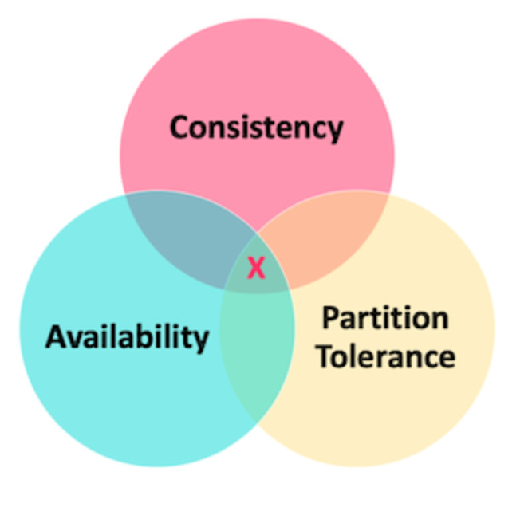

* [CAP理论](#cap理论)
  * [一致性 Consistency](#一致性-consistency)
  * [可用性 Availability](#可用性-availability)
  * [分区容错性 Partition Tolerance](#分区容错性-partition-tolerance)

# CAP理论
图

CAP 定理（CAP theorem）指出对于一个分布式系统来说，当设计读写操作时，只能能同时满足以下三点中的两个
- CAP 理论中分区容错性 P 是一定要满足的，在此基础上，只能满足可用性 A 或者一致性 C

### 一致性 Consistency
所有节点访问同一份最新的数据副本
### 可用性 Availability
非故障的节点在合理的时间内返回合理的响应（不是错误或者超时的响应）。
### 分区容错性 Partition Tolerance
分布式系统出现网络分区的时候，仍然能够对外提供服务。
- 分布式系统中，多个节点之前的网络本来是连通的，但是因为某些故障（比如部分节点网络出了问题）某些节点之间不连通了，整个网络就分成了几块区域，这就叫网络分区。