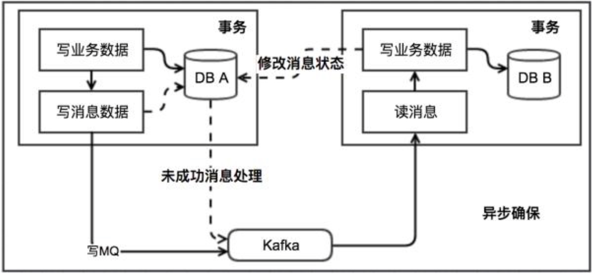
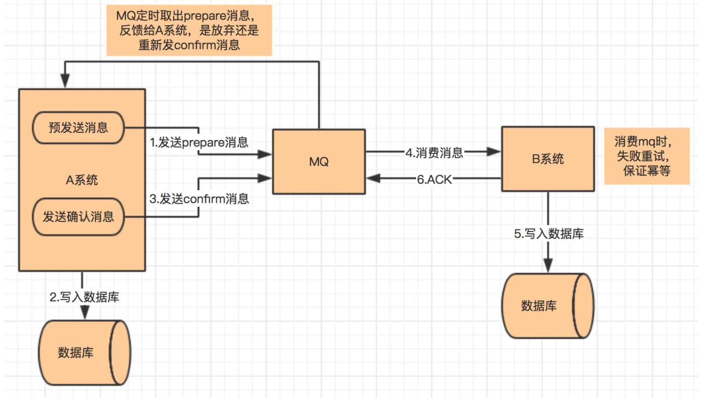

* [分布式事务](#分布式事务)
    * [两阶段提交](#两阶段提交)
        * [原理](#原理)
        * [大致的流程](#大致的流程)
        * [问题](#问题)
    * [TCC（Try-Confirm-Cancel）](#tcctry-confirm-cancel)
        * [原理](#原理-1)
            * [Try 阶段](#try-阶段)
            * [Confirm 阶段](#confirm-阶段)
            * [Cancel 阶段](#cancel-阶段)
        * [特点](#特点)
    * [本地消息表](#本地消息表)
        * [原理](#原理-2)
        * [本地消息表实现的条件](#本地消息表实现的条件)
        * [容错机制](#容错机制)
    * [可靠消息最终一致性](#可靠消息最终一致性)
    * [尽最大努力通知](#尽最大努力通知)
        * [大致流程](#大致流程)

# 分布式事务
## 两阶段提交
### 原理
两阶段提交，顾名思义就是要分两步提交。存在一个负责协调各个本地资源管理器的事务管理器，本地资源管理器一般是由数据库实现，事务管理器在第一阶段的时候询问各个资源管理器是否都就绪？如果收到每个资源的回复都是 yes，则在第二阶段提交事务，如果其中任意一个资源的回复是 no, 则回滚事务。
### 大致的流程
第一阶段（prepare）：事务管理器向所有本地资源管理器发起请求，询问是否是 ready 状态，所有参与者都将本事务能否成功的信息反馈发给协调者

第二阶段 (commit/rollback)：事务管理器根据所有本地资源管理器的反馈，通知所有本地资源管理器，步调一致地在所有分支上提交或者回滚
### 问题
同步阻塞
- 当参与事务者存在占用公共资源的情况，其中一个占用了资源，其他事务参与者就只能阻塞等待资源释放，处于阻塞状态。

单点问题
- 一旦事务管理器出现故障，整个系统不可用

数据不一致
- 在阶段二，如果事务管理器只发送了部分 commit 消息，此时网络发生异常，那么只有部分参与者接收到 commit 消息，也就是说只有部分参与者提交了事务，使得系统数据不一致。

无容错
- 失败一个节点即失败

不确定性
- 当协事务管理器发送 commit 之后，并且此时只有一个参与者收到了 commit，那么当该参与者与事务管理器同时宕机之后，重新选举的事务管理器无法确定该条消息是否提交成功。
## TCC（Try-Confirm-Cancel）
### 原理
#### Try 阶段
尝试执行，完成所有业务检查（一致性）, 预留必须业务资源（准隔离性）
#### Confirm 阶段
确认执行真正执行业务，不作任何业务检查，只使用 Try 阶段预留的业务资源，Confirm 操作满足幂等性。要求具备幂等设计，Confirm 失败后需要进行重试
#### Cancel 阶段
取消执行，释放 Try 阶段预留的业务资源 Cancel 操作满足幂等性 Cancel 阶段的异常和 Confirm 阶段异常处理方案基本上一致
### 特点
实现复杂度高

在 Try 阶段，是对业务系统进行检查及资源预览，比如订单和存储操作，需要检查库存剩余数量是否够用，并进行预留，预留操作的话就是新建一个可用库存数量字段，Try 阶段操作是对这个可用库存数量进行操作。
## 本地消息表
### 原理
该方案中会有消息生产者与消费者两个角色，假设系统 A 是消息生产者，系统 B 是消息消费者，其大致流程如下

图

1、当系统 A 被其他系统调用发生数据库表更操作，首先会更新数据库的业务表，其次会往相同数据库的消息表中插入一条数据，两个操作发生在同一个事务中

2、系统 A 的脚本定期轮询本地消息往 mq 中写入一条消息，如果消息发送失败会进行重试

3、系统 B 消费 mq 中的消息，并处理业务逻辑。如果本地事务处理失败，会在继续消费 mq 中的消息进行重试，如果业务上的失败，可以通知系统 A 进行回滚操作

### 本地消息表实现的条件
- 消费者与生成者的接口都要支持幂等
- 生产者需要额外的创建消息表
- 需要提供补偿逻辑，如果消费者业务失败，需要生产者支持回滚操作

### 容错机制
- 步骤 1 失败时，事务直接回滚
- 步骤 2、3 写 mq 与消费 mq 失败会进行重试
- 步骤 3 业务失败系统 B 向系统 A 发起事务回滚操作
        
此方案的核心是将需要分布式处理的任务通过消息日志的方式来异步执行。消息日志可以存储到本地文本、数据库或消息队列，再通过业务规则自动或人工发起重试。人工重试更多的是应用于支付场景，通过对账系统对事后问题的处理。
## 可靠消息最终一致性
图
			
		
流程
- A 系统先向 mq 发送一条 prepare 消息，如果 prepare 消息发送失败，则直接取消操作
- 如果消息发送成功，则执行本地事务
- 如果本地事务执行成功，则向 mq 发送一条 confirm 消息，如果发送失败，则发送回滚消息
- B 系统定期消费 mq 中的 confirm 消息，执行本地事务，并发送 ack 消息。如果 B 系统中的本地事务失败，会一直不断重试，如果是业务失败，会向 A 系统发起回滚请求
- mq 会定期轮询所有 prepared 消息调用系统 A 提供的接口查询消息的处理情况，如果该 prepare 消息本地事务处理成功，则重新发送 confirm 消息，否则直接回滚该消息
        
该方案与本地消息最大的不同是去掉了本地消息表，其次本地消息表依赖消息表重试写入 mq 这一步由本方案中的轮询 prepare 消息状态来重试或者回滚该消息替代。其实现条件与余容错方案基本一致。目前市面上实现该方案的只有阿里的 RocketMq。
## 尽最大努力通知
### 大致流程
- 系统 A 本地事务执行完之后，发送个消息到 MQ；
- 这里会有个专门消费 MQ 的服务，这个服务会消费 MQ 并调用系统 B 的接口；
- 要是系统 B 执行成功就 ok 了；要是系统 B 执行失败了，那么最大努力通知服务就定时尝试重新调用系统 B, 反复 N 次，最后还是不行就放弃。
        
最大努力通知最常见的场景就是支付回调，支付服务收到第三方服务支付成功通知后，先更新自己库中订单支付状态，然后同步通知订单服务支付成功。如果此次同步通知失败，会通过异步脚步不断重试地调用订单服务的接口。