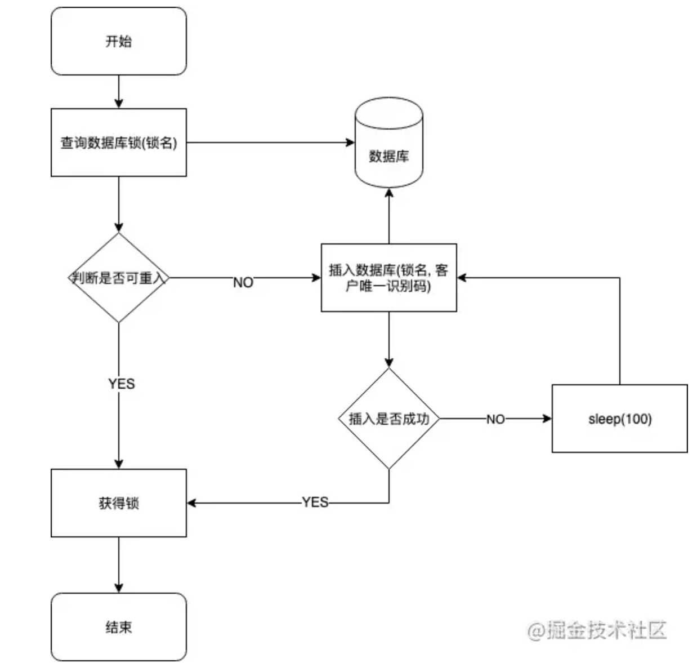
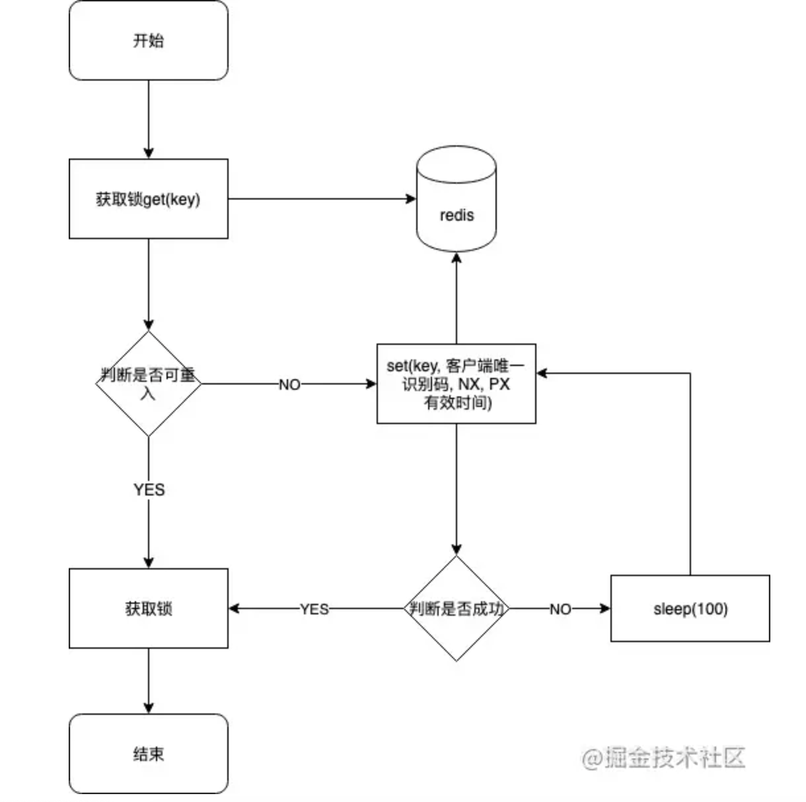

# 分布式锁

## 基于数据库

基于数据库的分布式锁, 常用的一种方式是使用表的唯一约束特性。当往数据库中成功插入一条数据时, 代表只获取到锁。将这条数据从数据库中删除，则释放送
### 怎么实现
#### 创建一张锁表
```sql
CREATE TABLE `methodLock` (
    `id` int(11) NOT NULL AUTO_INCREMENT COMMENT '主键',
    `method_name` varchar(64) NOT NULL DEFAULT '' COMMENT '锁定的方法名',
    `cust_id` varchar(1024) NOT NULL DEFAULT '客户端唯一编码',
    `update_time` timestamp NOT NULL DEFAULT CURRENT_TIMESTAMP ON UPDATE CURRENT_TIMESTAMP COMMENT '保存数据时间，自动生成',
    PRIMARY KEY (`id`),
    UNIQUE KEY `uidx_method_name` (`method_name `) USING BTREE
)
ENGINE=InnoDB DEFAULT CHARSET=utf8 COMMENT='锁定中的方法';

```
#### 添加锁
`insert into methodLock(method_name,cust_id) values (‘method_name’,‘cust_id’)`
- 这里cust_id 可以是机器的mac地址+线程编号, 确保一个线程只有唯一的一个编号。通过这个编号， 可以有效的判断是否为锁的创建者，从而进行锁的释放以及重入锁判断
#### 释放锁
`delete from methodLock where method_name ='method_name' and cust_id = 'cust_id'`
#### 重入锁判断
`select 1 from methodLock where method_name ='method_name' and cust_id = 'cust_id'`
#### 加锁以及释放锁的代码示例
```java
/**
* 获取锁
  */
public boolean lock(String methodName){
    boolean success = false;
    //获取客户唯一识别码,例如:mac+线程信息
    String custId = getCustId();
    try{
    //添加锁
        success = insertLock(methodName, custId);
    } catch(Exception e) {
    //如添加失败
    }
    return success;
}

/**
* 释放锁
  */
public boolean unlock(String methodName) {
  boolean success = false;
  //获取客户唯一识别码,例如:mac+线程信息
  String custId = getCustId();
  try{
    //添加锁
    success = deleteLock(methodName, custId);
  } catch(Exception e) {
    //如添加失败
  }
  return success;
}
```
#### 完整流程
```java
 public void test() {
        String methodName = "methodName";
        //判断是否重入锁
        if (!checkReentrantLock(methodName)) {
            //非重入锁
            while (!lock(methodName)) {
                //获取锁失败, 则阻塞至获取锁
                try{
                    Thread.sleep(100)
                } catch(Exception e) {
                }
            }
        }
        //TODO 业务处理

        //释放锁
        unlock(methodName);
}   
```
- 以上代码还存在一些问题:
  - 
  - 没有失效时间。 解决方案:设置一个定时处理, 定期清理过期锁
  - 单点问题。 解决方案: 弄几个备份数据库，数据库之前双向同步，一旦挂掉快速切换到备库上  

## Redis

### 使用命令
#### 使用redis 的set(String key, String value, String nxxx, String expx, int time)命令
- 第一个为key，我们使用key来当锁，因为key是唯一的。
- 第二个为value，我们传的是custId，这里cust_id 可以是机器的mac地址+线程编号, 确保一个线程只有唯一的一个编号。通过这个编号， 可以有效的判断是否为锁的创建者，从而进行锁的释放以及重入锁判断
- 第三个为nxxx，这个参数我们填的是NX，意思是SET IF NOT EXIST，即当key不存在时，我们进行set操作；若key已经存在，则不做任何操作
- 第四个为expx，这个参数我们传的是PX，意思是我们要给这个key加一个过期的设置，具体时间由第五个参数决定。
- 第五个为time，与第四个参数相呼应，代表key的过期时间。
#### 代码示例
```java
private static final String LOCK_SUCCESS = "OK";
private static final String SET_IF_NOT_EXIST = "NX";
private static final String SET_WITH_EXPIRE_TIME = "PX";
private static final Long RELEASE_SUCCESS = 1L;

// Redis客户端
private Jedis jedis;

/**
* 尝试获取分布式锁
* @param lockKey 锁
* @param expireTime 超期时间
* @return 是否获取成功
  */
public boolean lock(String lockKey, int expireTime) {
      //获取客户唯一识别码,例如:mac+线程信息
      String custId = getCustId();
      String result = jedis.set(lockKey, custId, SET_IF_NOT_EXIST, SET_WITH_EXPIRE_TIME, expireTime);
    
      if (LOCK_SUCCESS.equals(result)) {
         return true;
      }

      return false;
  }

/**
* 释放分布式锁
* @param lockKey 锁
* @param requestId 请求标识
* @return 是否释放成功
  */
public boolean unlock(String lockKey,) {
  //获取客户唯一识别码,例如:mac+线程信息
  String custId = getCustId();
  String script = "if redis.call('get', KEYS[1]) == ARGV[1] then return redis.call('del', KEYS[1]) else return 0 end";
  Object result = jedis.eval(script, Collections.singletonList(lockKey), Collections.singletonList(custId));

  if (RELEASE_SUCCESS.equals(result)) {
     return true;
  }
  return false;
}

/**
* 获取锁信息
* @param lockKey 锁
* @return 是否重入锁
  */
public boolean checkReentrantLock(String lockKey){
  //获取客户唯一识别码,例如:mac+线程信息
  String custId = getCustId();

  //获取当前锁的客户唯一表示码
  String currentCustId = redis.get(lockKey);
  if (custId.equals(currentCustId)) {
      return true;
  }
  return false;
}
```
#### 完整流程
```java
public void test() {
  String lockKey = "lockKey";
  //判断是否重入锁
  if (!checkReentrantLock(lockKey)) {
      //非重入锁
      while (!lock(lockKey)) {
          //获取锁失败, 则阻塞至获取锁
          try{
                Thread.sleep(100)
          } catch(Exception e) {
          }
      }
  }
  //TODO 业务处理

  //释放锁
  unlock(lockKey);
}
```
### redis实现的分布式锁会遇到什么问题？

## zookeeper

基于zookeeper临时有序节点可以实现的分布式锁。大致思想即为：每个客户端对某个方法加锁时，在zookeeper上的与该方法对应的指定节点的目录下，生成一个唯一的瞬时有序节点。 判断是否获取锁的方式很简单，只需要判断有序节点中序号最小的一个。 当释放锁的时候，只需将这个瞬时节点删除即可。同时，其可以避免服务宕机导致的锁无法释放，而产生的死锁问题。
### 可以直接使用zookeeper第三方库Curator客户端，这个客户端中封装了一个可重入的锁服务。

完整流程
```java
public void test() {
    //Curator提供的InterProcessMutex是分布式锁的实现。通过acquire获得锁，并提供超时机制，release方法用于释放锁。
    InterProcessMutex lock = new InterProcessMutex(client, ZK_LOCK_PATH);
    try {
        //获取锁
        if (lock.acquire(10 * 1000, TimeUnit.SECONDS)) {
        //TODO 业务处理
        }
    } catch (Exception e) {
            e.printStackTrace();
    } finally {
        try {
            //释放锁
            lock.release();
        } catch (Exception e) {
            e.printStackTrace();
        }
    }

}
```

1、zookeeper和redis都可以实现分布式锁，为什么大部分场景要使用redis来实现而不使用zk实现？

2、redis实现的分布式锁会遇到什么问题？

3、什么是红锁？解决了什么问题？#面试

1.zk主打CP和redis主打AP。首先redis的性能优于zk是毋庸置疑的，以我的工作经验来看保障数据的一致性不能靠分布式锁，他只能用作辅助性的作用，因此并发下锁的高可用性比锁的一致性更显得尤为重要。

2.会遇到什么问题看你的实现，比如setnx的锁续期，比如redisson的集群锁同步，宕机客户端多把锁等等。

3.至于redlock就是刚刚第二点提到的redisson框架里的一把锁，通过看门狗解决了锁续期，不过如果真的拿锁后死循环了或者客户端宕机也会死锁，除非你设置自动超时时间。集群的话就是投票半数以上的选举机智。

4.最后要说一点的是，不管啥分布式锁，在系统里都不要认为它是一把亮剑，我负责的系统多和同学同一个业务单据你敢信key前缀不一致？虽然有枚举类有约定，这样啥锁都失效，代码评审也不可能覆盖到方方面面。所以还是需要做好数据库的幂等和乐观锁控制，以及实时和T+1的监控。分布式锁不是万能的。

https://mp.weixin.qq.com/s/ybiN5Q89wI0CnLURGUz4vw