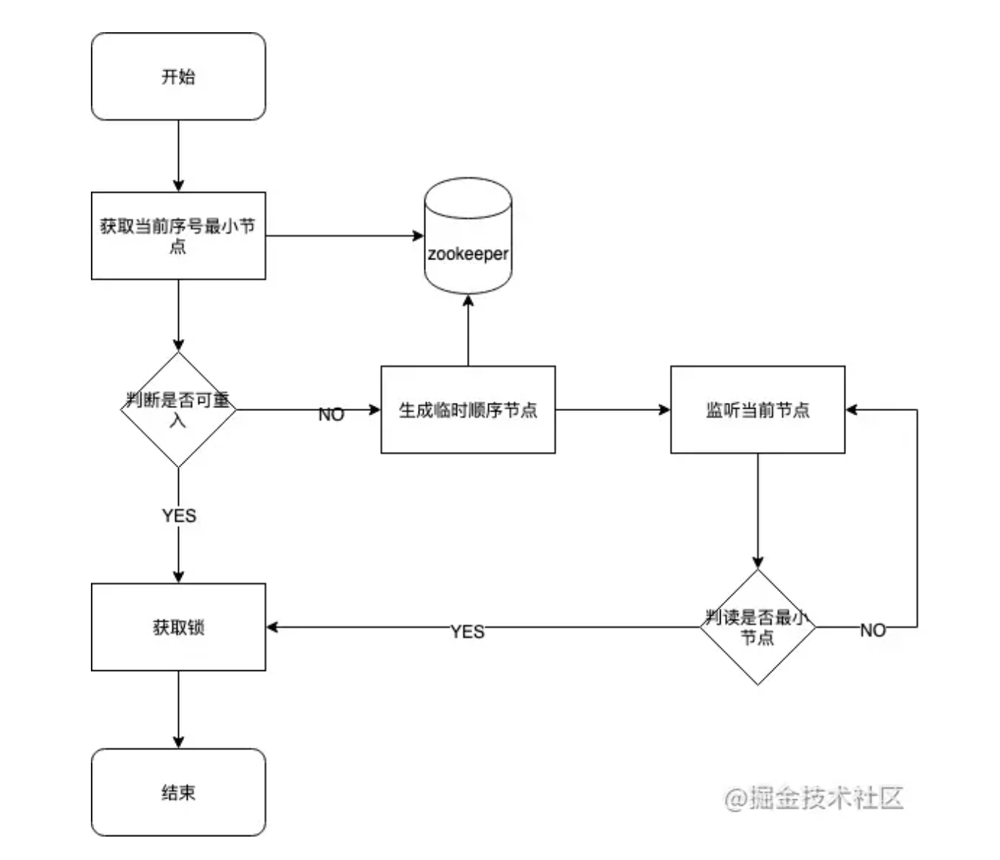

* [分布式锁](#分布式锁)
  * [基于数据库](#基于数据库)
    * [怎么实现](#怎么实现)
      * [创建一张锁表](#创建一张锁表)
      * [添加锁](#添加锁)
      * [释放锁](#释放锁)
      * [重入锁判断](#重入锁判断)
      * [加锁以及释放锁的代码示例](#加锁以及释放锁的代码示例)
      * [完整流程](#完整流程)
  * [以上代码还存在一些问题:](#以上代码还存在一些问题)
  * [Redis](#redis)
    * [使用SETNX 命令](#使用setnx-命令)
      * [使用redis 的set(String key, String value, String nxxx, String expx, int time)命令](#使用redis-的setstring-key-string-value-string-nxxx-string-expx-int-time命令)
      * [代码示例](#代码示例)
      * [完整流程](#完整流程-1)
      * [Redis 分布式锁真的安全吗？](#redis-分布式锁真的安全吗)
      * [锁过期时间不好评估怎么办？](#锁过期时间不好评估怎么办)
      * [那当「主从发生切换」时，这个分布锁会依旧安全吗？](#那当主从发生切换时这个分布锁会依旧安全吗)
      * [Redlock（红锁）](#redlock红锁)
      * [Redis 的 Redlock 有什么问题？一定安全吗？](#redis-的-redlock-有什么问题一定安全吗)
      * [业界争论 Redlock，到底在争论什么？哪种观点是对的？](#业界争论-redlock到底在争论什么哪种观点是对的)
      * [分布式锁到底用 Redis 还是 Zookeeper？](#分布式锁到底用-redis-还是-zookeeper)
  * [zookeeper](#zookeeper)
    * [可以直接使用zookeeper第三方库Curator客户端，这个客户端中封装了一个可重入的锁服务。](#可以直接使用zookeeper第三方库curator客户端这个客户端中封装了一个可重入的锁服务)
    * [参考文章](#参考文章)


# 分布式锁

## 基于数据库


基于数据库的分布式锁, 常用的一种方式是使用表的唯一约束特性。当往数据库中成功插入一条数据时, 代表只获取到锁。将这条数据从数据库中删除，则释放锁
### 怎么实现
#### 创建一张锁表
```sql
CREATE TABLE `methodLock` (
    `id` int(11) NOT NULL AUTO_INCREMENT COMMENT '主键',
    `method_name` varchar(64) NOT NULL DEFAULT '' COMMENT '锁定的方法名',
    `cust_id` varchar(1024) NOT NULL DEFAULT '客户端唯一编码',
    `update_time` timestamp NOT NULL DEFAULT CURRENT_TIMESTAMP ON UPDATE CURRENT_TIMESTAMP COMMENT '保存数据时间，自动生成',
    PRIMARY KEY (`id`),
    UNIQUE KEY `uidx_method_name` (`method_name `) USING BTREE
)
ENGINE=InnoDB DEFAULT CHARSET=utf8 COMMENT='锁定中的方法';

```
#### 添加锁
```sql
insert into methodLock(method_name,cust_id) values (‘method_name’,‘cust_id’)
```
- 这里cust_id 可以是机器的mac地址+线程编号, 确保一个线程只有唯一的一个编号。通过这个编号， 可以有效的判断是否为锁的创建者，从而进行锁的释放以及重入锁判断
#### 释放锁
```sql
delete from methodLock where method_name ='method_name' and cust_id = 'cust_id'
```
#### 重入锁判断
```sql
select 1 from methodLock where method_name ='method_name' and cust_id = 'cust_id'
```
#### 加锁以及释放锁的代码示例
```java
/**
* 获取锁
  */
public boolean lock(String methodName){
    boolean success = false;
    //获取客户唯一识别码,例如:mac+线程信息
    String custId = getCustId();
    try{
    //添加锁
        success = insertLock(methodName, custId);
    } catch(Exception e) {
    //如添加失败
    }
    return success;
}

/**
* 释放锁
  */
public boolean unlock(String methodName) {
  boolean success = false;
  //获取客户唯一识别码,例如:mac+线程信息
  String custId = getCustId();
  try{
    //添加锁
    success = deleteLock(methodName, custId);
  } catch(Exception e) {
    //如添加失败
  }
  return success;
}
```
#### 完整流程
```java
 public void test() {
        String methodName = "methodName";
        //判断是否重入锁
        if (!checkReentrantLock(methodName)) {
            //非重入锁
            while (!lock(methodName)) {
                //获取锁失败, 则阻塞至获取锁
                try{
                    Thread.sleep(100)
                } catch(Exception e) {
                }
            }
        }
        //TODO 业务处理

        //释放锁
        unlock(methodName);
}   
```
- 以上代码还存在一些问题:
  - 
  - 没有失效时间。 解决方案:设置一个定时处理, 定期清理过期锁
  - 单点问题。 解决方案: 弄几个备份数据库，数据库之前双向同步，一旦挂掉快速切换到备库上  

## Redis


### 使用SETNX 命令
#### 使用redis 的set(String key, String value, String nxxx, String expx, int time)命令
- 第一个为key，我们使用key来当锁，因为key是唯一的。
- 第二个为value，我们传的是custId，这里cust_id 可以是机器的mac地址+线程编号, 确保一个线程只有唯一的一个编号。通过这个编号， 可以有效的判断是否为锁的创建者，从而进行锁的释放以及重入锁判断
- 第三个为nxxx，这个参数我们填的是NX，意思是SET IF NOT EXIST，即当key不存在时，我们进行set操作；若key已经存在，则不做任何操作
- 第四个为expx，这个参数我们传的是PX，意思是我们要给这个key加一个过期的设置，具体时间由第五个参数决定。
- 第五个为time，与第四个参数相呼应，代表key的过期时间。
#### 代码示例
```java
private static final String LOCK_SUCCESS = "OK";
private static final String SET_IF_NOT_EXIST = "NX";
private static final String SET_WITH_EXPIRE_TIME = "PX";
private static final Long RELEASE_SUCCESS = 1L;

// Redis客户端
private Jedis jedis;

/**
* 尝试获取分布式锁
* @param lockKey 锁
* @param expireTime 超期时间
* @return 是否获取成功
  */
public boolean lock(String lockKey, int expireTime) {
      //获取客户唯一识别码,例如:mac+线程信息
      String custId = getCustId();
      String result = jedis.set(lockKey, custId, SET_IF_NOT_EXIST, SET_WITH_EXPIRE_TIME, expireTime);
    
      if (LOCK_SUCCESS.equals(result)) {
         return true;
      }

      return false;
  }

/**
* 释放分布式锁
* @param lockKey 锁
* @param requestId 请求标识
* @return 是否释放成功
  */
public boolean unlock(String lockKey,) {
  //获取客户唯一识别码,例如:mac+线程信息
  String custId = getCustId();
  String script = "if redis.call('get', KEYS[1]) == ARGV[1] then return redis.call('del', KEYS[1]) else return 0 end";
  Object result = jedis.eval(script, Collections.singletonList(lockKey), Collections.singletonList(custId));

  if (RELEASE_SUCCESS.equals(result)) {
     return true;
  }
  return false;
}

/**
* 获取锁信息
* @param lockKey 锁
* @return 是否重入锁
  */
public boolean checkReentrantLock(String lockKey){
  //获取客户唯一识别码,例如:mac+线程信息
  String custId = getCustId();

  //获取当前锁的客户唯一表示码
  String currentCustId = redis.get(lockKey);
  if (custId.equals(currentCustId)) {
      return true;
  }
  return false;
}
```
#### 完整流程
```java
public void test() {
  String lockKey = "lockKey";
  //判断是否重入锁
  if (!checkReentrantLock(lockKey)) {
      //非重入锁
      while (!lock(lockKey)) {
          //获取锁失败, 则阻塞至获取锁
          try{
                Thread.sleep(100)
          } catch(Exception e) {
          }
      }
  }
  //TODO 业务处理

  //释放锁
  unlock(lockKey);
}
```
#### Redis 分布式锁真的安全吗？
- set命令的问题（加锁和解锁非原子操作）
  - 锁过期释放别人的锁：a拿到锁操作资源，但是超时了锁自动释放，b新拿到锁开始操作，这时候a处理完了释放锁，但是此时释放是b的锁
  - 解决方案：1、增大预估锁超时时间，2、在加锁时设置一个唯一标识进去，并且解锁必须原子执行-lua脚本
- 严谨的流程
  - 加锁：SET lock_key $unique_id EX $expire_time NX
  - 操作共享资源
  - 释放锁：Lua 脚本，先 GET 判断锁是否归属自己，再 DEL 释放锁
#### 锁过期时间不好评估怎么办？
- 锁的过期时间如果评估不好，这个锁就会有「提前」过期的风险
- `方案`：加锁时，先设置一个过期时间，然后我们开启一个「守护线程」，定时去检测这个锁的失效时间，如果锁快要过期了，操作共享资源还未完成，那么就自动对锁进行「续期」，重新设置过期时间。
- Java使用 `Redisson` 在使用分布式锁时，它就采用了「自动续期」的方案来避免锁过期，这个守护线程我们一般也把它叫做「看门狗」线程
#### 那当「主从发生切换」时，这个分布锁会依旧安全吗？
- 我们在使用 Redis 时，一般会采用主从集群 + 哨兵的模式部署，这样做的好处在于，当主库异常宕机时，哨兵可以实现「故障自动切换」，把从库提升为主库，继续提供服务，以此保证可用性。
- `场景`
  - 客户端 1 在主库上执行 SET 命令，加锁成功
  - 此时，主库异常宕机，SET 命令还未同步到从库上（主从复制是异步的）
  - 从库被哨兵提升为新主库，这个锁在新的主库上，丢失了！
- 解决方案
  - Redlock（红锁）
#### Redlock（红锁）
Redlock 的方案基于 2 个前提：
- 不再需要部署从库和哨兵实例，只部署主库
- 但主库要部署多个，官方推荐至少 5 个实例

也就是说，想用使用 Redlock，你至少要部署 5 个 Redis 实例，而且都是主库，它们之间没有任何关系，都是一个个孤立的实例。
> 注意：不是部署 Redis Cluster，就是部署 5 个简单的 Redis 实例。

Redlock 具体如何使用呢？整体的流程是这样的，一共分为 5 步：

1. 客户端先获取「当前时间戳T1」
2. 客户端依次向这 5 个 Redis 实例发起加锁请求（用前面讲到的 SET 命令），且每个请求会设置超时时间（毫秒级，要远小于锁的有效时间），如果某一个实例加锁失败（包括网络超时、锁被其它人持有等各种异常情况），就立即向下一个 Redis 实例申请加锁
3. 如果客户端从 >=3 个（大多数）以上 Redis 实例加锁成功，则再次获取「当前时间戳T2」，如果 T2 - T1 < 锁的过期时间，此时，认为客户端加锁成功，否则认为加锁失败
4. 加锁成功，去操作共享资源（例如修改 MySQL 某一行，或发起一个 API 请求）
5. 加锁失败，向「全部节点」发起释放锁请求（前面讲到的 Lua 脚本释放锁）

总结一下，有 4 个重点：
1. 客户端在多个 Redis 实例上申请加锁
2. 必须保证大多数节点加锁成功
3. 大多数节点加锁的总耗时，要小于锁设置的过期时间
4. 释放锁，要向全部节点发起释放锁请求

- 为什么要在多个实例上加锁？
  - 本质上是为了「容错」，部分实例异常宕机，剩余的实例加锁成功，整个锁服务依旧可用。
- 为什么大多数加锁成功，才算成功？
  - 如果只存在「故障」节点，只要大多数节点正常，那么整个系统依旧是可以提供正确服务的。
- 为什么步骤 3 加锁成功后，还要计算加锁的累计耗时？
  - 因为操作的是多个节点，所以耗时肯定会比操作单个实例耗时更久，而且，因为是网络请求，网络情况是复杂的，有可能存在延迟、丢包、超时等情况发生，网络请求越多，异常发生的概率就越大。
  - 所以，即使大多数节点加锁成功，但如果加锁的累计耗时已经「超过」了锁的过期时间，那此时有些实例上的锁可能已经失效了，这个锁就没有意义了。
- 为什么释放锁，要操作所有节点？
  - 在某一个 Redis 节点加锁时，可能因为「网络原因」导致加锁失败。
  - 例如，客户端在一个 Redis 实例上加锁成功，但在读取响应结果时，网络问题导致读取失败，那这把锁其实已经在 Redis 上加锁成功了。
  - 所以，释放锁时，不管之前有没有加锁成功，需要释放「所有节点」的锁，以保证清理节点上「残留」的锁。

#### Redis 的 Redlock 有什么问题？一定安全吗？
- 详细的可以参见这篇文章讲的非常详细https://mp.weixin.qq.com/s/ybiN5Q89wI0CnLURGUz4vw
#### 业界争论 Redlock，到底在争论什么？哪种观点是对的？
- 详细的可以参见这篇文章讲的非常详细https://mp.weixin.qq.com/s/ybiN5Q89wI0CnLURGUz4vw
- 总结一下
  - 有人认为RedLock在遇到1、网络延迟 2、GC进程暂停 3、时钟漂移 问题时存在安全性问题
    - `GC进程暂停` 如果A请求锁定s1、s2、s3、s4、s5，拿到锁后进入GC，耗时长，锁过期释放了，此时B请求锁定s1、s2、s3、s4、s5，也拿到锁，此时A GC完毕，认为成功获取到了锁，B也认为获取到了锁（冲突）
    - `时钟漂移` 客户端 1 获取节点 A、B、C 上的锁，但由于网络问题，无法访问 D 和 E ，节点 C 上的时钟「向前跳跃」，导致锁到期 客户端 2 获取节点 C、D、E 上的锁，由于网络问题，无法访问 A 和 B ，客户端 1 和 2 现在都相信它们持有了锁（冲突）
  - 提出 fecing token 的方案
    - 客户端在获取锁时，锁服务可以提供一个「递增」的 token ，客户端拿着这个 token 去操作共享资源 ，共享资源可以根据 token 拒绝「后来者」的请求
    - 比如a获取锁后得到token33，因为GC锁过期了，B去获取锁，拿到了token34，a GC完毕用token33去操作资源，被拒绝，因为不是最新的token34 
  - redlock作者的回复
    - 对于时钟类问题 并不需要完全一致的时钟，只需要大体一致就可以了，允许有「误差」。例如要计时 5s，但实际可能记了 4.5s，之后又记了 5.5s，有一定误差，但只要不超过「误差范围」锁失效时间即可，这种对于时钟的精度要求并不是很高，而且这也符合现实环境。
    - 解释网络延迟、GC 问题 由于计算过程中需要 判断`T2 - T1 < 锁的过期时间 ` 所以这个问题不存在
    - 质疑 fencing token 机制  资源服务器基本没有拒绝「旧 token」的能力。这种方案很难实现
#### 分布式锁到底用 Redis 还是 Zookeeper？
- 客户端 1 创建临时节点后，Zookeeper 是如何保证让这个客户端一直持有锁呢？
  - 客户端 1 此时会与 Zookeeper 服务器维护一个 Session，这个 Session 会依赖客户端「定时心跳」来维持连接
  - 如果 Zookeeper 长时间收不到客户端的心跳，就认为这个 Session 过期了，也会把这个临时节点删除。

Zookeeper 的优点：
- 不需要考虑锁的过期时间
- watch 机制，加锁失败，可以 watch 等待锁释放，实现乐观锁

但它的劣势是：
- 性能不如 Redis
- 部署和运维成本高
- 客户端与 Zookeeper 的长时间失联，锁被释放问题

所以并非说哪个是最优解，各有优缺点，但现实中Redis使用的更多
## zookeeper


基于zookeeper临时有序节点可以实现的分布式锁。大致思想即为：每个客户端对某个方法加锁时，在zookeeper上的与该方法对应的指定节点的目录下，生成一个唯一的瞬时有序节点。 判断是否获取锁的方式很简单，只需要判断有序节点中序号最小的一个。 当释放锁的时候，只需将这个瞬时节点删除即可。同时，其可以避免服务宕机导致的锁无法释放，而产生的死锁问题。
### 可以直接使用zookeeper第三方库Curator客户端，这个客户端中封装了一个可重入的锁服务。

完整流程
```java
public void test() {
    //Curator提供的InterProcessMutex是分布式锁的实现。通过acquire获得锁，并提供超时机制，release方法用于释放锁。
    InterProcessMutex lock = new InterProcessMutex(client, ZK_LOCK_PATH);
    try {
        //获取锁
        if (lock.acquire(10 * 1000, TimeUnit.SECONDS)) {
        //TODO 业务处理
        }
    } catch (Exception e) {
            e.printStackTrace();
    } finally {
        try {
            //释放锁
            lock.release();
        } catch (Exception e) {
            e.printStackTrace();
        }
    }

}
```
### 参考文章
- https://juejin.cn/post/6844903863363829767
- https://mp.weixin.qq.com/s/ybiN5Q89wI0CnLURGUz4vw