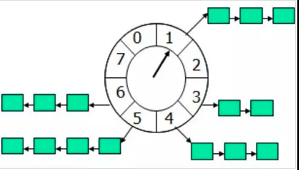
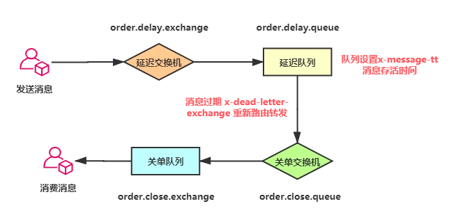

* [商城类问题](#商城类问题)
  * [秒杀](#秒杀)
    * [项目亮点](#项目亮点)
    * [秒杀流程](#秒杀流程)
    * [一. 环境的搭建](#一-环境的搭建)
    * [二. 登录功能的实现](#二-登录功能的实现)
      * [1、 数据库设计](#1-数据库设计)
      * [2、 对登录密码进行两次MD5：细节描述](#2-对登录密码进行两次md5细节描述)
      * [3、JSR303参数检验](#3jsr303参数检验)
      * [4、分布式Session？](#4分布式session)
    * [三. 实现秒杀功能](#三-实现秒杀功能)
      * [1、数据库设计](#1数据库设计)
      * [2、商品列表页](#2商品列表页)
      * [3、商品详情页](#3商品详情页)
      * [4、订单详情页](#4订单详情页)
    * [四. JMeter压测](#四-jmeter压测)
      * [1、JMeter入门](#1jmeter入门)
      * [2、Redis压测工具redis-benchmark](#2redis压测工具redis-benchmark)
    * [五. 页面优化技术](#五-页面优化技术)
      * [1、页面缓存+URL缓存+对象缓存](#1页面缓存url缓存对象缓存)
      * [2、页面静态化，前后端分离](#2页面静态化前后端分离)
      * [3、防超卖](#3防超卖)
      * [4、CDN优化](#4cdn优化)
    * [六. 接口优化](#六-接口优化)
      * [1、思路：减少数据库访问](#1思路减少数据库访问)
      * [2、优化思路](#2优化思路)
      * [3、秒杀接口优化](#3秒杀接口优化)
    * [七. 安全优化](#七-安全优化)
      * [1、秒杀接口地址隐藏](#1秒杀接口地址隐藏)
      * [2、数学公式验证码](#2数学公式验证码)
      * [3、接口限流防刷](#3接口限流防刷)
      * [4、使用一个通用拦截器](#4使用一个通用拦截器)
    * [八. 总结](#八-总结)
      * [1.问题总结（主要从三个方面：项目本身的问题、可能出现的问题、可改进的地方）](#1问题总结主要从三个方面项目本身的问题可能出现的问题可改进的地方)
      * [1.1 项目本身的问题](#11-项目本身的问题)
      * [1.2 可能出现的问题](#12-可能出现的问题)
      * [1.3 可改进的地方](#13-可改进的地方)
  * [如何解决超卖问题？](#如何解决超卖问题)
    * [redis的库存如何与数据库的库存保持一致？](#redis的库存如何与数据库的库存保持一致)
    * [redis 预减成功，DB扣减库存失败怎么办？](#redis-预减成功db扣减库存失败怎么办)
  * [订单延时取消怎么做？](#订单延时取消怎么做)
    * [方案分析](#方案分析)
      * [数据库轮询](#数据库轮询)
      * [JDK的延迟队列](#jdk的延迟队列)
      * [时间轮算法](#时间轮算法)
      * [redis zset](#redis-zset)
      * [Redis 过期回调](#redis-过期回调)
      * [使用消息队列](#使用消息队列)
  * [参考文章](#参考文章)

# 商城类问题

## 秒杀
### 项目亮点
- 使用分布式Session，可以实现让多台服务器同时可以响应
- 使用redis做缓存提高访问速度和并发量，减少数据库压力，利用内存标记减少redis的访问
- 使用页面静态化，加快用户访问速度，提高QPS，缓存页面至浏览器，前后端分离降低服务器压力
- 使用消息队列完成异步下单，提升用户体验，削峰和降流
- 安全性优化：双重md5密码校验，秒杀接口地址的隐藏，接口限流防刷，数学公式验证码
### 秒杀流程
1. 登录进入商品列表页面，静态资源缓存
2. 点击进入商品详情页面，静态资源缓存，Ajax获取验证码等动态信息
3. 点击秒杀, 将验证码结果和商品ID传给后端，如果结果正确。动态生成随机串UUID,结合用户ID和商品ID存入redis，并将path传给前端。前端获取path后，再根据path地址调用秒杀服务
4. 服务端获取请求的path参数，去查缓存是否在
5. 如果存在，并且Redis还有库存，预减redis库存，看是否已经生成订单，没有的话就将请求入消息队列
6. 从消息队列中取消息：获取商品ID和用户ID，判断数据库库存，然后下单
7. 下单：减库存，生成订单
8. 前端轮询订单生成结果。50ms继续轮询或者秒杀是否成功和失败

### 一. 环境的搭建
### 二. 登录功能的实现
主要内容

- 数据库设计
- 明文密码两次MD5处理
- JSR303参数检验+全局异常处理
- 分布式Session

#### 1、 数据库设计

- 不做注册，直接登录，在MySQL中直接创建表
- 用户表包括id、nickname、password、salt、头像、注册时间、上次登录时间、登录次数等字段

#### 2、 对登录密码进行两次MD5：细节描述

- 加密的目的：第一次是因为http是明文传输的，第二次为了防止数据库被盗

#### 3、JSR303参数检验

- 通过对输入的参数LoginVo加注解@validated，然后在传入的参数mobile和password上加上注解判断，如@NotNull判断是否为空，也可以自定义
- 全局异常处理

#### 4、分布式Session？

### 三. 实现秒杀功能
主要内容
- 数据库设计
- 商品列表页
- 商品详情页
- 订单详情页

#### 1、数据库设计

- 括商品表、商品表订单表、秒杀商品表、秒杀商品订单表

#### 2、商品列表页

- 为了展示秒杀商品的详情需要goods和miaosha_goods中的信息，所以封装一个GoodsVo，包括价格、库存、秒杀起始时间

#### 3、商品详情页

#### 4、订单详情页

- 这里也是秒杀功能的实现
- 在控制层先判断库存、然后判断订单是否存在、如果都没有就下单
- 下单顺序为减库存、下定单、写入秒杀订单
### 四. JMeter压测
主要内容
- JMeter入门
- 自定义变量模拟多个用户
- JMeter命令行使用
- Redis压测工具redis-benchmark
- Spring Boot打war包

#### 1、JMeter入门

- JMeter在windows下是图形界面
  - 打开jmeter.bat运行图形界面
  - 测试计划中添加线程组
  - 在线程组中添加HTTP请求默认值（就是端口号）
  - 在线程组中添加HTTP请求（就是要测试的类的URL）、这里可以设置带参数
  - 在线程组中添加监听器进监听
  - 也可以通过自定义模拟多用户（写一个文件，导入即可）
- JMeter在Linux下是命令行进行操
  - 在Windows上录好jmx
  - 命令行：sh jmeter.sh -n -t XXX.jmx -l result.jtl
  - 把result.jtl导入到jmeter

结果是五千并发的情况下，QPS为一千三左右

#### 2、Redis压测工具redis-benchmark

- redis-benchmark -h 127.0.0.1 -p 6379 -c 100 -n 100000
- -c为100个并发连接，-n为100000个请求
- Redis的QPS在十万左右
### 五. 页面优化技术
内容
- 页面缓存+URL缓存+对象缓存
- 页面静态化，前后端分离
- 静态资源优化
- CDN优化

#### 1、页面缓存+URL缓存+对象缓存

- 秒杀的瓶颈在于数据库，所以要加上各种粒度的缓存，最大的是页面缓存、最小的是对象缓存
- 页面缓存步骤（这里指的是商品列表）：
  - 从redisService中取缓存
  - 若缓存中没有则手动渲染，利用thymeleaf模板
  - 然后将页面加入缓存，并返回渲染页面
  - 不宜时间太长，设置为60s即可
- URL缓存（指的是商品详情页）
  - 与页面缓存步骤基本一致，但是需要取缓存和加缓存时要加入参数，GoodsId
- 对象缓存（指的是User对象）
  - 前面的页面缓存和URL缓存适合变化不大的，缓存时间比较短
  - 对象缓存是长期缓存，所以需要有个更新的步骤
  - 第一步是取缓存
  - 若缓存中没有则去数据库中查找，并加入缓存；如数据库中没有就报错
  - 更新用户的密码
- 加缓存之后的QPS大概3000
- 需要先更新数据库，后删除缓存；顺序不能反，会导致数据不一致：若线程1先删除缓存，然后线程2读操作，发现缓存中没有，把数据库中的旧数据加入缓存，然后线程1更新数据库，就会导致缓存与数据库数据不一致

#### 2、页面静态化，前后端分离

- 页面静态化无非就是使用纯html页面+Ajax请求json数据后再填充页面
- 若A页面跳转到B页面之前需要条件判断可以先在A页面中利用ajax请求判断后再跳转
- 如果不需要条件判断可以直接跳转到B的静态页面，让B自己用ajax请求数据

#### 3、防超卖

- 发生在减库存的时候
- 解决方法是在Update语句中加一个判断
- 还有一种情况是一个用户同时发了两个请求，假如库存充足，且没有订单生成，那么就会减两次库存
- 解决办法是建立用户和商品的唯一索引
- 做到以上两点是不会发生超卖的

#### 4、CDN优化

- CDN是内容分发网络，相当于缓存，只是部署在全国各地，当用户发起请求时，会找最近的CDN获取资源
- 并发大的瓶颈在于数据库，所以解决办法是加各种缓存：从浏览器开始，做页面的静态化，将静态页面缓存在浏览器中；请求到达网站之前可以部署一些CDN，让请求首先访问CDN；然后是页面缓存、URL缓存、对象缓存；
- 加缓存的缺点：数据可能不一致，只能做一个平衡
### 六. 接口优化
内容
- Redis预减库存减少数据库访问
- 内存标记减少Redis访问
- RabbitMQ队列缓冲，异步下单，增强用户体验
- RabbitMQ安装与Spring Boot集成
- 访问Nginx水平扩展
- 压测

#### 1、思路：减少数据库访问

1. 系统初始化，把商品库存数量加载到Redis中
2. 收到请求，Redis预减库存，库存不足，直接返回，否则进入3
3. 请求入队，立即返回排队中
4. 请求出队，生成订单，减少库存
5. 客户端轮询，是否秒杀成功

#### 2、优化思路

1. 系统初始化，把商品库存数量加载到Redis
2. 收到请求，Redis预减库存，库存不足，直接返回，否则进入3
3. 请求入队，立即返回排队中（异步下单）
4. 请求出队，生成订单，减少库存，把订单写入Redis中
5. 客户端轮询，判断是否秒杀成功

#### 3、秒杀接口优化

1. 之前的没有库存预热的步骤是：查库存-查订单-修改库存-生成订单
2. 系统初始化时把库存加载到数据库：MiaoshaController 继承InitializingBean实现afterPropertiesSet方法即可
3. 在上一步库存预热之后，执行步骤为：查Redis库存-判断是否存在订单-进入队列-在出队时才对数据库进行操作
4. 这一步还可以有一个优化，就是内存标记，使用一个Map，将商品ID设置为false，当买空时，设为true；然后每次不是直接访问Redis进行库存查询，而是对商品ID进行条件判断
5. 内存标记的优点是减少对Redis的访问（当商品已经卖完之后）
### 七. 安全优化
主要内容

- 秒杀接口地址隐藏
- 数学公式验证码
- 接口限流防刷

#### 1、秒杀接口地址隐藏

- 虽然前端页面在秒杀未开始时秒杀按钮设置为不可用，但是有可能用户通过前端js代码找到秒杀地址在秒杀未开始时直接访问，秒杀接口隐藏的目的是用户通过js获取到的秒杀地址并不能让其完成秒杀功能
- 在秒杀之前要先通过Controller中的/path路径下的类随机生成一个path，然后和用户ID一起存入Redis，在执行秒杀的时候再从Redis中取Path进行验证，然后进行秒杀

#### 2、数学公式验证码

- 作用：接口防刷；错开请求
- 在获取Path是进行验证

#### 3、接口限流防刷

- 当一个用户访问接口时，把访问次数写入缓存，并设置有效期
- 一分钟之内如果用户访问，则缓存中的访问次数加一，如果次数超限进行限流操作
- 如果一分钟内没有超限，缓存中数据消失，下次再访问时重新写入缓存

#### 4、使用一个通用拦截器

- 首先写一个注解AccessLimit
- 后面每个类只需要加注解即可设置防刷次数
- 定义拦截器：继承HandlerInterceptorAdapter类
### 八. 总结
#### 1.问题总结（主要从三个方面：项目本身的问题、可能出现的问题、可改进的地方）

#### 1.1 项目本身的问题

- 画一下项目的架构图
- 讲一下秒杀流程
- 秒杀模块怎么设计的
- 秒杀部分是怎么做的
- 分布式Session是怎么实现的
- 如何解决超卖？mysql锁
- 如何解决重复下单？mysql唯一索引
- 如何防刷？验证码+通用拦截器限流
- 消息队列的作用？异步削峰
- 压测没有？用什么压测？QPS是多少？
- 库存预减用的是哪个redis方法

#### 1.2 可能出现的问题

- 缓存和数据库数据一致性如何保证？
- 如果项目中的redis服务挂掉，如何减轻数据库的压力
- 假如减了库存但用户没有支付，怎么将库存还原继续进行抢购

#### 1.3 可改进的地方

- 系统瓶颈在哪？如何查找，如何再优化？
- 除了你项目里面的优化，你还有什么优化策略吗？（同上一个问题）
- 项目难点及问题解决
- 使用了大量缓存，那么就存在缓存击穿和缓存雪崩以及缓存一致性等问题
- 大量的使用缓存，对于缓存服务器也有很大的压力，如何减少redis的访问
- 在高并发请求的业务场景，大量请求来不及处理，甚至出现请求堆积的情况
- 怎么保证一个用户不能重复下单
- 怎么解决超卖现象
- 页面静态化的过程

## 如何解决超卖问题？
- 在sql加上判断防止数据为负数
- 数据库加唯一索引防止用户重复购买
- Redis预减库存减少数据库访问 
### redis的库存如何与数据库的库存保持一致？
redis的数量不是库存,他的作用仅仅只是为了阻挡多余的请求透穿到DB，起到一个保护的作用
因为秒杀的商品有限，比如10个，让1万个请求区访问DB是没有意义的，因为最多也就只能10个
请求下单成功，所有这个是一个伪命题，我们是不需要保持一致的
- Redis和数据库库存缓存更新一致问题
  - 定时查数据库更新Redis缓存

### redis 预减成功，DB扣减库存失败怎么办？
其实我们可以不用太在意，对用户而言，秒杀不中是正常现象，秒杀中才是意外，单个用户秒杀中
- 本来就是小概率事件，出现这种情况对于用户而言没有任何影响
- 对于商户而言，本来就是为了活动拉流量人气的，卖不完还可以省一部分费用，但是活动还参与了，也就没有了任何影响
- 对网站而言，最重要的是体验，只要网站不崩溃，对用户而言没有任何影响

## 订单延时取消怎么做？

### 方案分析

#### 数据库轮询
- 该方案通常是在小型项目中使用，即通过一个线程定时的去扫描数据库，通过订单时间来判断是否有超时的订单，然后进行update或delete等操作

优点:
- 简单易行，支持集群操作

缺点:
- 对服务器内存消耗大
- 存在延迟，比如你每隔3分钟扫描一次，那最坏的延迟时间就是3分钟
- 假设你的订单有几千万条，每隔几分钟这样扫描一次，数据库损耗极大


#### JDK的延迟队列
该方案是利用JDK自带的DelayQueue来实现，这是一个无界阻塞队列，该队列只有在延迟期满的时候才能从中获取元素，放入DelayQueue中的对象，是必须实现Delayed接口的。

优点:
- 效率高,任务触发时间延迟低。

缺点:
- 服务器重启后，数据全部消失，怕宕机 
- 集群扩展相当麻烦 
- 因为内存条件限制的原因，比如下单未付款的订单数太多，那么很容易就出现OOM异常 
- 代码复杂度较高

#### 时间轮算法


时间轮算法可以类比于时钟，如上图箭头（指针）按某一个方向按固定频率轮动，每一次跳动称为一个 tick。这样可以看出定时轮由个3个重要的属性参数，ticksPerWheel（一轮的tick数），tickDuration（一个tick的持续时间）以及 timeUnit（时间单位），例如当ticksPerWheel=60，tickDuration=1，timeUnit=秒，这就和现实中的始终的秒针走动完全类似了。

如果当前指针指在1上面，我有一个任务需要4秒以后执行，那么这个执行的线程回调或者消息将会被放在5上。那如果需要在20秒之后执行怎么办，由于这个环形结构槽数只到8，如果要20秒，指针需要多转2圈。位置是在2圈之后的5上面（20 % 8 + 1）

我们用Netty的HashedWheelTimer来实现
```xml
<dependency>
    <groupId>io.netty</groupId>
    <artifactId>netty-all</artifactId>
    <version>4.1.24.Final</version>
</dependency>
```
```java

import io.netty.util.HashedWheelTimer;
import io.netty.util.Timeout;
import io.netty.util.Timer;
import io.netty.util.TimerTask;
import java.util.concurrent.TimeUnit;

public class HashedWheelTimerTest {

    static class MyTimerTask implements TimerTask{
        boolean flag;
        public MyTimerTask(boolean flag){
            this.flag = flag;
        }

        public void run(Timeout timeout) throws Exception {
            // TODO Auto-generated method stub
             System.out.println("要去数据库删除订单了。。。。");
             this.flag =false;

        }

    }

    public static void main(String[] argv) {
        MyTimerTask timerTask = new MyTimerTask(true);
        Timer timer = new HashedWheelTimer();
        timer.newTimeout(timerTask, 5, TimeUnit.SECONDS);
        int i = 1;

        while(timerTask.flag){
            try {
                Thread.sleep(1000);
            } catch (InterruptedException e) {
                // TODO Auto-generated catch block
                e.printStackTrace();

            }
            System.out.println(i+"秒过去了");
            i++;
        }
    }
}
```
优点:
- 效率高,任务触发时间延迟时间比delayQueue低，代码复杂度比delayQueue低。

缺点:
- 服务器重启后，数据全部消失，怕宕机
- 集群扩展相当麻烦
- 因为内存条件限制的原因，比如下单未付款的订单数太多，那么很容易就出现OOM异常

#### redis zset
利用redis的zset,zset是一个有序集合，每一个元素(member)都关联了一个score,通过score排序来取集合中的值
- 添加元素:ZADD key score member [[score member] [score member] …]
- 按顺序查询元素:ZRANGE key start stop [WITHSCORES]
- 查询元素score:ZSCORE key member
- 移除元素:ZREM key member [member …]

那么如何实现呢？我们将订单超时时间戳与订单号分别设置为score和member,系统扫描第一个元素判断是否超时


#### Redis 过期回调
Redis 的key过期回调事件，也能达到延迟队列的效果，简单来说我们开启监听key是否过期的事件，一旦key过期会触发一个callback事件。

修改redis.conf文件开启notify-keyspace-events Ex
```shell
notify-keyspace-events Ex
```

Redis监听配置，注入Bean RedisMessageListenerContainer

```java
@Configuration
public class RedisListenerConfig {
    @Bean
    RedisMessageListenerContainer container(RedisConnectionFactory connectionFactory) {

        RedisMessageListenerContainer container = new RedisMessageListenerContainer();
        container.setConnectionFactory(connectionFactory);
        return container;
    }
}
```
编写Redis过期回调监听方法，必须继承KeyExpirationEventMessageListener ，有点类似于MQ的消息监听。
```java
@Component
public class RedisKeyExpirationListener extends KeyExpirationEventMessageListener {
 
    public RedisKeyExpirationListener(RedisMessageListenerContainer listenerContainer) {
        super(listenerContainer);
    }
    @Override
    public void onMessage(Message message, byte[] pattern) {
        String expiredKey = message.toString();
        System.out.println("监听到key：" + expiredKey + "已过期");
    }
}
```

#### 使用消息队列
RabbitMQ 延时队列

利用 RabbitMQ 做延时队列是比较常见的一种方式，而实际上RabbitMQ 自身并没有直接支持提供延迟队列功能，而是通过 RabbitMQ 消息队列的 TTL和 DXL这两个属性间接实现的。
- TTL 顾名思义：指的是消息的存活时间，RabbitMQ可以通过x-message-tt参数来设置指定Queue（队列）和 Message（消息）上消息的存活时间，它的值是一个非负整数，单位为微秒。如果同时设置队列和队列中消息的TTL，则TTL值以两者中较小的值为准。而队列中的消息存在队列中的时间，一旦超过TTL过期时间则成为Dead Letter（死信）。
- DLX即死信交换机，绑定在死信交换机上的即死信队列。RabbitMQ的 Queue（队列）可以配置两个参数x-dead-letter-exchange 和 x-dead-letter-routing-key（可选），一旦队列内出现了Dead Letter（死信），则按照这两个参数可以将消息重新路由到另一个Exchange（交换机），让消息重新被消费。


下边结合一张图看看如何实现超30分钟未支付关单功能，我们将订单消息A0001发送到延迟队列order.delay.queue，并设置x-message-tt消息存活时间为30分钟，当到达30分钟后订单消息A0001成为了Dead Letter（死信），延迟队列检测到有死信，通过配置x-dead-letter-exchange，将死信重新转发到能正常消费的关单队列，直接监听关单队列处理关单逻辑即可。


发送消息时指定消息延迟的时间
```java
public void send(String delayTimes) {
        amqpTemplate.convertAndSend("order.pay.exchange", "order.pay.queue","大家好我是延迟数据", message -> {
            // 设置延迟毫秒值
            message.getMessageProperties().setExpiration(String.valueOf(delayTimes));
            return message;
        });
    }
}
```
设置延迟队列出现死信后的转发规则
```java
/**
     * 延时队列
     */
    @Bean(name = "order.delay.queue")
    public Queue getMessageQueue() {
        return QueueBuilder
                .durable(RabbitConstant.DEAD_LETTER_QUEUE)
                // 配置到期后转发的交换
                .withArgument("x-dead-letter-exchange", "order.close.exchange")
                // 配置到期后转发的路由键
                .withArgument("x-dead-letter-routing-key", "order.close.queue")
                .build();
    }
```

## 参考文章
- https://github.com/qiurunze123/miaosha
- https://blog.csdn.net/weixin_41891177/article/details/107775394
- https://blog.csdn.net/weixin_44406146/article/details/107800771
- https://www.cnblogs.com/wyq178/p/11261711.html
- https://zhuanlan.zhihu.com/p/59944775
- https://mp.weixin.qq.com/s/fQ94NgKeR6qQAcIe0CrusA
- https://segmentfault.com/a/1190000022718540
