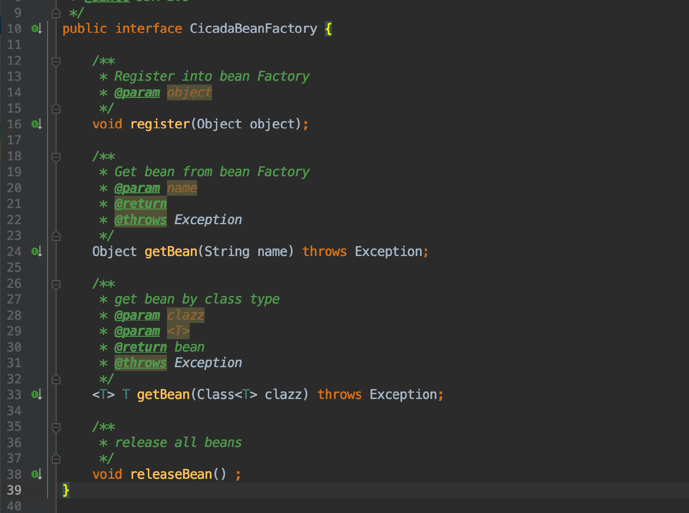
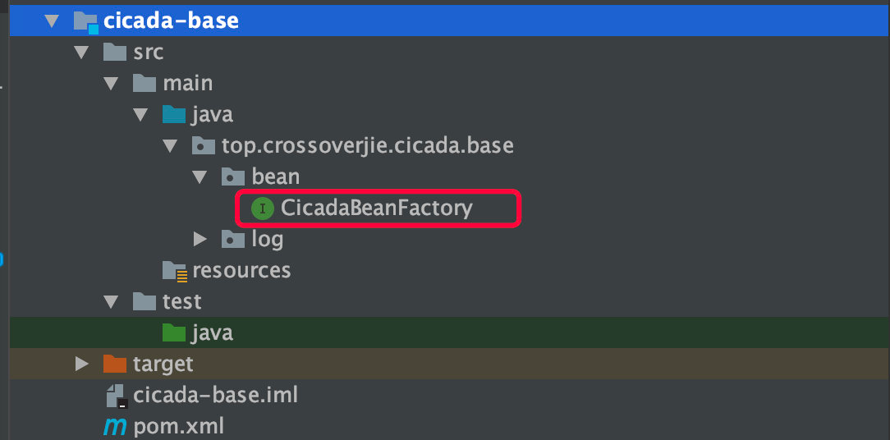
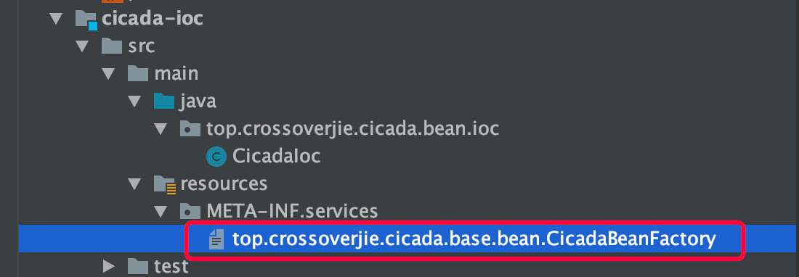
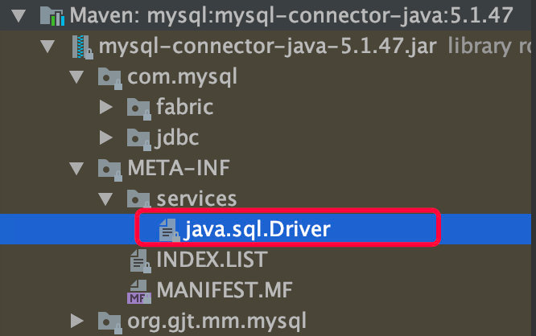
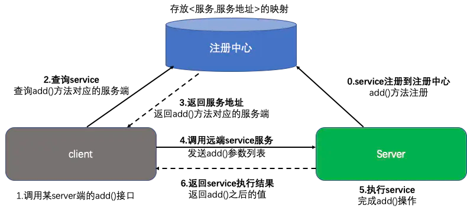
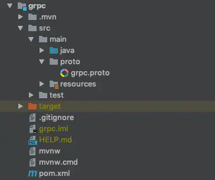
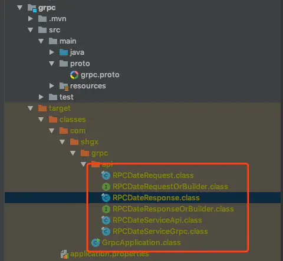
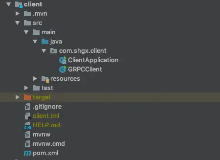
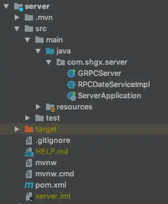

* [场景设计](#场景设计)
    * [有A、B两个大文件，每个文件几十G，而内存只有4G，其中A文件存放学号+姓名，而B文件存放学号+分数，要求生成文件C，存放姓名和分数。怎么实现？](#有ab两个大文件每个文件几十g而内存只有4g其中a文件存放学号姓名而b文件存放学号分数要求生成文件c存放姓名和分数怎么实现)
    * [秒杀系统怎么设计](#秒杀系统怎么设计)
        * [秒杀存在的问题](#秒杀存在的问题)
        * [如何解决这些问题](#如何解决这些问题)
    * [唯一ID设计](#唯一id设计)
        * [UUID](#uuid)
        * [多台MySQL服务器](#多台mysql服务器)
        * [Twitter Snowflake](#twitter-snowflake)
        * [百度UidGenerator算法](#百度uidgenerator算法)
        * [美团Leaf算法](#美团leaf算法)
    * [产品上线出问题怎么定位错误](#产品上线出问题怎么定位错误)
    * [大量并发查询用户商品信息，MySQL压力大查询慢，保证速度怎么优化方案](#大量并发查询用户商品信息mysql压力大查询慢保证速度怎么优化方案)
    * [海量日志数据，提取出某日访问百度次数最多的那个IP。](#海量日志数据提取出某日访问百度次数最多的那个ip)
    * [给定a、b两个文件，各存放50亿个url，每个url各占64字节，内存限制是4G，让你找出a、b文件共同的url？](#给定ab两个文件各存放50亿个url每个url各占64字节内存限制是4g让你找出ab文件共同的url)
        * [方案1](#方案1)
        * [方案2](#方案2)
    * [一般内存不足而需要分析的数据又很大的问题都可以使用分治的思想，将数据hash(x)%1000分为小文件再分别加载小文件到内存中处理即可](#一般内存不足而需要分析的数据又很大的问题都可以使用分治的思想将数据hashx1000分为小文件再分别加载小文件到内存中处理即可)
    * [如何保证接口的幂等性](#如何保证接口的幂等性)
        * [什么是幂等性](#什么是幂等性)
        * [什么情况下需要幂等](#什么情况下需要幂等)
        * [如何保证幂等](#如何保证幂等)
            * [1、token机制](#1token机制)
            * [2、乐观锁机制](#2乐观锁机制)
            * [3、唯一主键](#3唯一主键)
            * [4、防重表](#4防重表)
            * [5、唯一ID](#5唯一id)
    * [什么是延迟双删](#什么是延迟双删)
        * [如果延时双删，删除失败了怎么办？](#如果延时双删删除失败了怎么办)
        * [延迟删除演变方案](#延迟删除演变方案)
    * [什么是SPI](#什么是spi)
        * [SPI 实践](#spi-实践)
    * [什么是RPC？](#什么是rpc)
        * [RPC demo](#rpc-demo)
    * [gRPC](#grpc)
        * [gRPC与REST](#grpc与rest)
        * [demo](#demo)
            * [grpc](#grpc-1)
            * [client](#client)
            * [server](#server)
    * [一个优秀的RPC框架需要考虑的问题](#一个优秀的rpc框架需要考虑的问题)
* [参考文章](#参考文章)


# 场景设计
## 有A、B两个大文件，每个文件几十G，而内存只有4G，其中A文件存放学号+姓名，而B文件存放学号+分数，要求生成文件C，存放姓名和分数。怎么实现？
- hash(学号)%1000，A到a0....a1000,B到b0~b1000
- 学号相同的人一定hash到相同序号的小文件
- 加载序号相同的小文件（比如：读取a2和b2）用map储存再按姓名+分数写入C即可
## 秒杀系统怎么设计
### 秒杀存在的问题
- 高并发、瞬间请求量极大
- 黄牛、黑客恶意请求
- 链接暴露问题
- 数据库压力问题
- 库存不足和超卖问题
### 如何解决这些问题
- 页面静态化
  - 秒杀活动的页面，大多数内容都是固定不变的，如商品名称，商品图片等等，可以对活动页面做静态化处理，减少访问服务端的请求。秒杀用户会分布在全国各地，有的在上海，有的在深圳，地域相差很远，网速也各不相同。为了让用户最快访问到活动页面，可以使用CDN（Content Delivery Network，内容分发网络）。CDN可以让用户就近获取所需内容。
- 按钮至灰控制
  - 秒杀活动开始前，按钮一般需要置灰的。只有时间到了，才能变得可以点击。这是防止，秒杀用户在时间快到的前几秒，疯狂请求服务器，然后秒杀时间点还没到，服务器就自己挂了。
- 服务单一职责
  - 我们都知道微服务设计思想，也就是把各个功能模块拆分，功能那个类似的放一起，再用分布式的部署方式。
  - 如用户登录相关的，就设计个用户服务，订单相关的就搞个订单服务，再到礼物相关的就搞个礼物服务等等。那么，秒杀相关的业务逻辑也可以放到一起，搞个秒杀服务，单独给它搞个秒杀数据库。
  - 服务单一职责有个好处：如果秒杀没抗住高并发的压力，秒杀库崩了，服务挂了，也不会影响到系统的其他服务。
- 秒杀链接加盐
  - 链接如果明文暴露的话，会有人获取到请求Url，提前秒杀了。因此，需要给秒杀链接加盐。可以把URL动态化，如通过MD5加密算法加密随机的字符串去做url。
- 限流
  - 一般有两种方式限流：nginx限流和redis限流。
  - 为了防止某个用户请求过于频繁，我们可以对同一用户限流；
  - 为了防止黄牛模拟几个用户请求，我们可以对某个IP进行限流；
  - 为了防止有人使用代理，每次请求都更换IP请求，我们可以对接口进行限流。
  - 为了防止瞬时过大的流量压垮系统，还可以使用阿里的Sentinel、Hystrix组件进行限流。
- 分布式锁
  - 可以使用redis分布式锁解决超卖问题。
  - 使用Redis的SET EX PX NX + 校验唯一随机值,再删除释放锁。
  - 为了更严谨，一般也是用lua脚本代替。lua脚本如下：
- MQ异步处理
  - 如果瞬间流量特别大，可以使用消息队列削峰，异步处理。用户请求过来的时候，先放到消息队列，再拿出来消费。
- 限流&降级&熔断
  - 限流，就是限制请求，防止过大的请求压垮服务器；
  - 降级，就是秒杀服务有问题了，就降级处理，不要影响别的服务；
  - 熔断，服务有问题就熔断，一般熔断降级是一起出现。
## 唯一ID设计
### UUID
### 多台MySQL服务器
- 既然MySQL可以产生自增ID，那么用多台MySQL服务器，能否组成一个高性能的分布式发号器呢？ 显然可以。
- 假设用8台MySQL服务器协同工作，第一台MySQL初始值是1，每次自增8，第二台MySQL初始值是2，每次自增8，依次类推。前面用一个 round-robin load balancer 挡着，每来一个请求，由 round-robin balancer 随机地将请求发给8台MySQL中的任意一个，然后返回一个ID
- 这个方法跟单台数据库比，缺点是ID是不是严格递增的，只是粗略递增的。不过这个问题不大，我们的目标是粗略有序，不需要严格递增。
### Twitter Snowflake
核心思想是：采用bigint（64bit）作为id生成类型，并将所占的64bit 划分成多段。
- ①1位标识：由于long基本类型在Java中是带符号的，最高位是符号位，正数是0，负数是1，所以id一般是正数，最高位是0。
- ②41位时间截(毫秒级）：需要注意的是，41位时间截不是存储当前时间的时间截，而是存储时间截的差值（当前时间截 - 开始时间截）得到的值，这里的开始时间截，一般是指我们的id生成器开始使用的时间截，由我们的程序来指定。41位的毫秒时间截，可以使用69年（即T =（1L << 41）/（1000 60 60 24 365）= 69）。
- ③10位的数据机器位：包括5位数据中心标识Id（datacenterId）、5位机器标识Id(workerId)，最多可以部署1024个节点（即1 << 10 = 1024）。超过这个数量，生成的ID就有可能会冲突。
- ④12位序列：毫秒内的计数，12位的计数顺序号支持每个节点每毫秒（同一机器，同一时间截）产生4096个ID序号（即1 << 12 = 4096）。
PS：全部结构标识（1+41+10+12=64）加起来刚好64位，刚好凑成一个Long型。
### 百度UidGenerator算法
### 美团Leaf算法
- 分段获取
- 即当号段消费到某个点时就异步的把下一个号段加载到内存中
## 产品上线出问题怎么定位错误
- 复现问题
## 大量并发查询用户商品信息，MySQL压力大查询慢，保证速度怎么优化方案
## 海量日志数据，提取出某日访问百度次数最多的那个IP。
- 可以考虑采用“分而治之”的思想，按照IP地址的Hash(IP)%1024值，把海量IP日志分别存储到1024个小文件中。这样，每个小文件最多包含4MB个IP地址
- 对于每一个小文件，可以构建一个IP为key，出现次数为value的Hash map，同时记录当前出现次数最多的那个IP地址
- 可以得到1024个小文件中的出现次数最多的IP，再依据常规的排序算法得到总体上出现次数最多的IP；
## 给定a、b两个文件，各存放50亿个url，每个url各占64字节，内存限制是4G，让你找出a、b文件共同的url？
### 方案1
- 遍历文件a，对每个url求取hash(url)%1000，然后根据所取得的值将url分别存储到1000个小文件（记为a0,a1,...,a999）中。这样每个小文件的大约为300M。
- 遍历文件b，采取和a相同的方式将url分别存储到1000小文件（记为b0,b1,...,b999）。这样处理后，所有可能相同的url都在对应的小文件（a0vsb0,a1vsb1,...,a999vsb999）中，不对应的小文件不可能有相同的url。然后我们只要求出1000对小文件中相同的url即可。
- 求每对小文件中相同的url时，可以把其中一个小文件的url存储到hash_set中。然后遍历另一个小文件的每个url，看其是否在刚才构建的hash_set中，如果是，那么就是共同的url，存到文件里面就可以了。
### 方案2
如果允许有一定的误差，使用布隆过滤器
## 一般内存不足而需要分析的数据又很大的问题都可以使用分治的思想，将数据hash(x)%1000分为小文件再分别加载小文件到内存中处理即可

## 如何保证接口的幂等性

### 什么是幂等性
幂等性是系统服务对外一种承诺，承诺只要调用接口成功，外部多次调用对系统的影响是一致的。声明为幂等的服务会认为外部调用失败是常态，并且失败之后必然会有重试。

### 什么情况下需要幂等

以SQL为例：

- SELECT col1 FROM tab1 WHER col2=2，无论执行多少次都不会改变状态，是天然的幂等。
- UPDATE tab1 SET col1=1 WHERE col2=2，无论执行成功多少次状态都是一致的，因此也是幂等操作。
- UPDATE tab1 SET col1=col1+1 WHERE col2=2，每次执行的结果都会发生变化，这种不是幂等的。
- insert into user(userid,name) values(1,'a') 如userid为唯一主键，即重复操作上面的业务，只会插入一条用户数据，具备幂等性。
  - 如userid不是主键，可以重复，那上面业务多次操作，数据都会新增多条，不具备幂等性。
- delete from user where userid=1，多次操作，结果一样，具备幂等性

### 如何保证幂等

#### 1、token机制
- 服务端提供了发送token的接口。我们在分析业务的时候，哪些业务是存在幂等问题的，就必须在执行业务前，先去获取token，服务器会把token保存到redis中。
- 然后调用业务接口请求时，把token携带过去，一般放在请求头部。
- 服务器判断token是否存在redis中，存在表示第一次请求，然后删除token,继续执行业务。
- 如果判断token不存在redis中，就表示是重复操作，直接返回重复标记给client，这样就保证了业务代码，不被重复执行。

**关键点 先删除token，还是后删除token。**

后删除token：如果进行业务处理成功后，删除redis中的token失败了，这样就导致了有可能会发生重复请求，因为token没有被删除。这个问题其实是数据库和缓存redis数据不一致问题，后续会写文章进行讲解。

先删除token：如果系统出现问题导致业务处理出现异常，业务处理没有成功，接口调用方也没有获取到明确的结果，然后进行重试，但token已经删除掉了，服务端判断token不存在，认为是重复请求，就直接返回了，无法进行业务处理了。

先删除token可以保证不会因为重复请求，业务数据出现问题。出现业务异常，可以让调用方配合处理一下，重新获取新的token，再次由业务调用方发起重试请求就ok了。

**token机制缺点**

业务请求每次请求，都会有额外的请求（一次获取token请求、判断token是否存在的业务）。其实真实的生产环境中，1万请求也许只会存在10个左右的请求会发生重试，为了这10个请求，我们让9990个请求都发生了额外的请求。

#### 2、乐观锁机制

- 这种方法适合在更新的场景中，update t_goods set count = count -1 , version = version + 1 where good_id=2 and version = 1
- 根据version版本，也就是在操作库存前先获取当前商品的version版本号，然后操作的时候带上此version号。我们梳理下，我们第一次操作库存时，得到version为1，调用库存服务version变成了2；但返回给订单服务出现了问题，订单服务又一次发起调用库存服务，当订单服务传如的version还是1，再执行上面的sql语句时，就不会执行；因为version已经变为2了，where条件就不成立。这样就保证了不管调用几次，只会真正的处理一次。
- 乐观锁主要使用于处理读多写少的问题

#### 3、唯一主键

这个机制是利用了数据库的主键唯一约束的特性，解决了在insert场景时幂等问题。但主键的要求不是自增的主键，这样就需要业务生成全局唯一的主键。

如果是分库分表场景下，路由规则要保证相同请求下，落地在同一个数据库和同一表中，要不然数据库主键约束就不起效果了，因为是不同的数据库和表主键不相关

#### 4、防重表

使用订单号orderNo做为去重表的唯一索引，把唯一索引插入去重表，再进行业务操作，且他们在同一个事务中。这个保证了重复请求时，因为去重表有唯一约束，导致请求失败，避免了幂等问题。这里要注意的是，去重表和业务表应该在同一库中，这样就保证了在同一个事务，即使业务操作失败了，也会把去重表的数据回滚。这个很好的保证了数据一致性。

#### 5、唯一ID

调用接口时，生成一个唯一id，redis将数据保存到集合中（去重），存在即处理过。

## 什么是延迟双删
缓存和数据库数据不一致时，需要同步这两处的数据，所以出现了延迟双删策略

步骤
1. 先删除缓存
2. 再写数据库
3. 休眠500毫秒（根据具体的业务时间来定）
4. 再次删除缓存。

延迟双删其实有很多问题，并不能保证缓存和数据库一致
1. A删除缓存
2. B查询数据库获取旧值
3. B更新了缓存
4. A更新数据库
5. A延时删缓存

1～3步执行后，数据库和缓存是一致的，相当于没删除。

4～5步：先更新数据库，再删缓存。

所以延时双删演变成了：先更新数据库，再删除缓存。问题还是没解决。。。

为什么？假设，此时，在第4步执行之前，又来了个查询C，C查询到旧值。第6步：C将旧值插入缓存。此时出现缓存和数据库不一致。

延时并不能解决：C插入缓存的操作在第5步后面执行，比如C遇到网络问题、GC问题等。当然这是小概率，但并不代表不存在。

当然，延时越长，这个问题越能规避。如果业务需求不是非常严格，是可以忽略的。
### 如果延时双删，删除失败了怎么办？
失败的需要重试， 将删除缓存操作放入mq，消费去删除
### 延迟删除演变方案
1 、请求串行化
- 先删除缓存，将更新数据库操作放入有序队列
- 从缓存查不到的查询操作，都进入有序队列

问题：
- 请求压力大，大量超时

2、异步更新缓存（基于订阅binlog的同步机制）
整体技术思路：
- 读Redis：热数据基本都在Redis
- 写MySQL:增删改都是操作MySQL
- 更新Redis数据：订阅MySQ的数据操作记录binlog，来更新到Redis

这样一旦MySQL中产生了新的写入、更新、删除等操作，就可以把binlog相关的消息通过消息队列推送至Redis，Redis再根据binlog中的记录，对Redis进行更新。

问题：
- 如果此时Redis删除缓存失败了怎么办？
  - 设置缓存过期时间
  - 重试机制

## 什么是SPI
SPI 全称为 (Service Provider Interface) ，是JDK内置的一种服务提供发现机制

### SPI 实践
接下来我们来如何来利用 SPI 实现刚才提到的可拔插 IOC 容器。

既然刚才都提到了 SPI 的本质就是面向接口编程，所以自然我们首先需要定义一个接口：



其中包含了一些 Bean 容器所必须的操作：注册、获取、释放 bean。

为了让其他人也能实现自己的 IOC 容器，所以我们将这个接口单独放到一个 Module 中，可供他人引入实现。



所以当我要实现一个单例的 IOC 容器时，我只需要新建一个 Module 然后引入刚才的模块并实现 CicadaBeanFactory 接口即可。

当然其中最重要的则是需要在 resources 目录下新建一个 META-INF/services/top.crossoverjie.cicada.base.bean.CicadaBeanFactory 文件，文件名必须得是我们之前定义接口的全限定名（SPI 规范）。


其中的内容便是我们自己实现类的全限定名：
```shell
top.crossoverjie.cicada.bean.ioc.CicadaIoc
```
可以想象最终会通过这里的全限定名来反射创建对象。

只不过这个过程 Java 已经提供 API 屏蔽掉了：
```java
public static CicadaBeanFactory getCicadaBeanFactory() {
    ServiceLoader<CicadaBeanFactory> cicadaBeanFactories = ServiceLoader.load(CicadaBeanFactory.class);
    if (cicadaBeanFactories.iterator().hasNext()){
        return cicadaBeanFactories.iterator().next() ;
    }
    return new CicadaDefaultBean();
}
```
当 classpath 中存在我们刚才的实现类（引入实现类的 jar 包），便可以通过 java.util.ServiceLoader 工具类来找到所有的实现类（可以有多个实现类同时存在，只不过通常我们只需要一个）。

一些都准备好之后，使用自然就非常简单了。
```xml
<dependency>
    <groupId>top.crossoverjie.opensource</groupId>
    <artifactId>cicada-ioc</artifactId>
    <version>2.0.4</version>
</dependency>
```
我们只需要引入这个依赖便能使用它的实现，当我们想换一种实现方式时只需要更换一个依赖即可。

这样就做到了不修改一行代码灵活的可拔插选择 IOC 容器了。

SPI 的一些其他应用

MySQL 的驱动包也是利用 SPI 来实现自己的连接逻辑。




## 什么是RPC？
RPC（Remote Procedure Call）远程过程调用，简单的理解是一个节点请求另一个节点提供的服务

1. 首先客户端需要告诉服务器，需要调用的函数，这里函数和进程ID存在一个映射，客户端远程调用时，需要查一下函数，找到对应的ID，然后执行函数的代码。
2. 客户端需要把本地参数传给远程函数，本地调用的过程中，直接压栈即可，但是在远程调用过程中不再同一个内存里，无法直接传递函数的参数，因此需要客户端把参数转换成字节流，传给服务端，然后服务端将字节流转换成自身能读取的格式，是一个序列化和反序列化的过程。
3. 数据准备好了之后，如何进行传输？网络传输层需要把调用的ID和序列化后的参数传给服务端，然后把计算好的结果序列化传给客户端，因此TCP层即可完成上述过程，gRPC中采用的是HTTP2协议。

总结一下：
```java
// Client端 
//    Student student = Call(ServerAddr, addAge, student)
1. 将这个调用映射为Call ID。
2. 将Call ID，student（params）序列化，以二进制形式打包
3. 把2中得到的数据包发送给ServerAddr，这需要使用网络传输层
4. 等待服务器返回结果
5. 如果服务器调用成功，那么就将结果反序列化，并赋给student，年龄更新

// Server端
1. 在本地维护一个Call ID到函数指针的映射call_id_map，可以用Map<String, Method> callIdMap
2. 等待客户端请求
3. 得到一个请求后，将其数据包反序列化，得到Call ID
4. 通过在callIdMap中查找，得到相应的函数指针
5. 将student（params）反序列化后，在本地调用addAge()函数，得到结果
6. 将student结果序列化后通过网络返回给Client
```

- 在微服务的设计中，一个服务A如果访问另一个Module下的服务B，可以采用HTTP REST传输数据，并在两个服务之间进行序列化和反序列化操作，服务B把执行结果返回过来。
- 由于HTTP在应用层中完成，整个通信的代价较高，远程过程调用中直接基于TCP进行远程调用，数据传输在传输层TCP层完成，更适合对效率要求比较高的场景，RPC主要依赖于客户端和服务端之间建立Socket链接进行，底层实现比REST更复杂。

### RPC demo
客户端
```java
public class RPCClient<T> {
    public static <T> T getRemoteProxyObj(final Class<?> serviceInterface, final InetSocketAddress addr) {
        // 1.将本地的接口调用转换成JDK的动态代理，在动态代理中实现接口的远程调用
        return (T) Proxy.newProxyInstance(serviceInterface.getClassLoader(), new Class<?>[]{serviceInterface},
                new InvocationHandler() {
                    @Override
                    public Object invoke(Object proxy, Method method, Object[] args) throws Throwable {
                        Socket socket = null;
                        ObjectOutputStream output = null;
                        ObjectInputStream input = null;
                        try{
                            // 2.创建Socket客户端，根据指定地址连接远程服务提供者
                            socket = new Socket();
                            socket.connect(addr);

                            // 3.将远程服务调用所需的接口类、方法名、参数列表等编码后发送给服务提供者
                            output = new ObjectOutputStream(socket.getOutputStream());
                            output.writeUTF(serviceInterface.getName());
                            output.writeUTF(method.getName());
                            output.writeObject(method.getParameterTypes());
                            output.writeObject(args);

                            // 4.同步阻塞等待服务器返回应答，获取应答后返回
                            input = new ObjectInputStream(socket.getInputStream());
                            return input.readObject();
                        }finally {
                            if (socket != null){
                                socket.close();
                            }
                            if (output != null){
                                output.close();
                            }
                            if (input != null){
                                input.close();
                            }
                        }
                    }
                });
    }
}
```
服务端
```java
public class ServiceCenter implements Server {

    private static ExecutorService executor = Executors.newFixedThreadPool(Runtime.getRuntime().availableProcessors());

    private static final HashMap<String, Class> serviceRegistry = new HashMap<String, Class>();

    private static boolean isRunning = false;

    private static int port;


    public ServiceCenter(int port){
        ServiceCenter.port = port;
    }


    @Override
    public void start() throws IOException {
        ServerSocket server = new ServerSocket();
        server.bind(new InetSocketAddress(port));
        System.out.println("Server Start .....");
        try{
            while(true){
                executor.execute(new ServiceTask(server.accept()));
            }
        }finally {
            server.close();
        }
    }

    @Override
    public void register(Class serviceInterface, Class impl) {
        serviceRegistry.put(serviceInterface.getName(), impl);
    }

    @Override
    public boolean isRunning() {
        return isRunning;
    }

    @Override
    public int getPort() {
        return port;
    }

    @Override
    public void stop() {
        isRunning = false;
        executor.shutdown();
    }
   private static class ServiceTask implements Runnable {
        Socket client = null;

        public ServiceTask(Socket client) {
            this.client = client;
        }

        @Override
        public void run() {
            ObjectInputStream input = null;
            ObjectOutputStream output = null;
            try{
                input = new ObjectInputStream(client.getInputStream());
                String serviceName = input.readUTF();
                String methodName = input.readUTF();
                Class<?>[] parameterTypes = (Class<?>[]) input.readObject();
                Object[] arguments = (Object[]) input.readObject();
                Class serviceClass = serviceRegistry.get(serviceName);
                if(serviceClass == null){
                    throw new ClassNotFoundException(serviceName + "not found!");
                }
                Method method = serviceClass.getMethod(methodName, parameterTypes);
                Object result = method.invoke(serviceClass.newInstance(), arguments);

                output = new ObjectOutputStream(client.getOutputStream());
                output.writeObject(result);
            }catch (Exception e){
                e.printStackTrace();
            }finally {
                if(output!=null){
                    try{
                        output.close();
                    }catch (IOException e){
                        e.printStackTrace();
                    }
                }
                if (input != null) {
                    try {
                        input.close();
                    } catch (IOException e) {
                        e.printStackTrace();
                    }
                }
                if (client != null) {
                    try {
                        client.close();
                    } catch (IOException e) {
                        e.printStackTrace();
                    }
                }
            }
        }
    }
}

public class ServiceProducerImpl implements ServiceProducer{
    @Override
    public String sendData(String data) {
        return "I am service producer!!!, the data is "+ data;
    }
}

public class RPCTest {
    public static void main(String[] args) throws IOException {
        new Thread(new Runnable() {
            @Override
            public void run() {
                try {
                    Server serviceServer = new ServiceCenter(8088);
                    serviceServer.register(ServiceProducer.class, ServiceProducerImpl.class);
                    serviceServer.start();
                } catch (IOException e) {
                    e.printStackTrace();
                }
            }
        }).start();
        ServiceProducer service = RPCClient.getRemoteProxyObj(ServiceProducer.class, new InetSocketAddress("localhost", 8088));
        System.out.println(service.sendData("test"));
    }
}
```

## gRPC
### gRPC与REST
- REST通常以业务为导向，将业务对象上执行的操作映射到HTTP动词，格式非常简单，可以使用浏览器进行扩展和传输，通过JSON数据完成客户端和服务端之间的消息通信，直接支持请求/响应方式的通信。不需要中间的代理，简化了系统的架构，不同系统之间只需要对JSON进行解析和序列化即可完成数据的传递。
- 但是REST也存在一些弊端，比如只支持请求/响应这种单一的通信方式，对象和字符串之间的序列化操作也会影响消息传递速度，客户端需要通过服务发现的方式，知道服务实例的位置，在单个请求获取多个资源时存在着挑战，而且有时候很难将所有的动作都映射到HTTP动词。
- 正是因为REST面临一些问题，因此可以采用gRPC作为一种替代方案，gRPC 是一种基于二进制流的消息协议，可以采用基于Protocol Buffer的IDL定义grpc API,这是Google公司用于序列化结构化数据提供的一套语言中立的序列化机制，客户端和服务端使用HTTP/2以Protocol Buffer格式交换二进制消息。
- gRPC的优势是，设计复杂更新操作的API非常简单，具有高效紧凑的进程通信机制，在交换大量消息时效率高，远程过程调用和消息传递时可以采用双向的流式消息方式，同时客户端和服务端支持多种语言编写，互操作性强；不过gRPC的缺点是不方便与JavaScript集成，某些防火墙不支持该协议。
- 注册中心：当项目中有很多服务时，可以把所有的服务在启动的时候注册到一个注册中心里面，用于维护服务和服务器之间的列表，当注册中心接收到客户端请求时，去找到该服务是否远程可以调用，如果可以调用需要提供服务地址返回给客户端，客户端根据返回的地址和端口，去调用远程服务端的方法，执行完成之后将结果返回给客户端。这样在服务端加新功能的时候，客户端不需要直接感知服务端的方法，服务端将更新之后的结果在注册中心注册即可，而且当修改了服务端某些方法的时候，或者服务降级服务多机部署想实现负载均衡的时候，我们只需要更新注册中心的服务群即可。


### demo
这里使用SpringBoot+gRPC的形式实现RPC调用过程 项目结构分为三部分：client、grpc、server
#### grpc

```xml
<dependency>
      <groupId>io.grpc</groupId>
      <artifactId>grpc-all</artifactId>
       <version>1.12.0</version>
 </dependency>
```
```xml
<build>
        <extensions>
            <extension>
                <groupId>kr.motd.maven</groupId>
                <artifactId>os-maven-plugin</artifactId>
                <version>1.4.1.Final</version>
            </extension>
        </extensions>
        <plugins>
            <plugin>
                <groupId>org.xolstice.maven.plugins</groupId>
                <artifactId>protobuf-maven-plugin</artifactId>
                <version>0.5.0</version>
                <configuration>
                    <pluginId>grpc-java</pluginId>
                    <protocArtifact>com.google.protobuf:protoc:3.0.2:exe:${os.detected.classifier}</protocArtifact>
                    <pluginArtifact>io.grpc:protoc-gen-grpc-java:1.2.0:exe:${os.detected.classifier}</pluginArtifact>
                </configuration>
                <executions>
                    <execution>
                        <goals>
                            <goal>compile</goal>
                            <goal>compile-custom</goal>
                        </goals>
                    </execution>
                </executions>
            </plugin>
        </plugins>
    </build>
```
创建.proto文件
```protobuf
syntax = "proto3";   // 语法版本

// stub选项
option java_package = "com.shgx.grpc.api";
option java_outer_classname = "RPCDateServiceApi";
option java_multiple_files = true;

// 定义包名
package com.shgx.grpc.api;

// 服务接口定义，服务端和客户端都要遵守该接口进行通信
service RPCDateService {
    rpc getDate (RPCDateRequest) returns (RPCDateResponse) {}
}

// 定义消息（请求）
message RPCDateRequest {
    string userName = 1;
}

// 定义消息（响应）
message RPCDateResponse {
    string serverDate = 1;
}

```
mvn complie

生成代码：


#### client


根据gRPC中的项目配置在client和server两个Module的pom.xml添加依赖
```xml
        <dependency>
            <groupId>com.shgx</groupId>
            <artifactId>grpc</artifactId>
            <version>0.0.1-SNAPSHOT</version>
            <scope>compile</scope>
        </dependency>
```
编写GRPCClient
```java
public class GRPCClient {
    private static final String host = "localhost";
    private static final int serverPort = 9999;

    public static void main( String[] args ) throws Exception {
        ManagedChannel managedChannel = ManagedChannelBuilder.forAddress( host, serverPort ).usePlaintext().build();
        try {
            RPCDateServiceGrpc.RPCDateServiceBlockingStub rpcDateService = RPCDateServiceGrpc.newBlockingStub( managedChannel );
            RPCDateRequest rpcDateRequest = RPCDateRequest
                    .newBuilder()
                    .setUserName("shgx")
                    .build();
            RPCDateResponse rpcDateResponse = rpcDateService.getDate( rpcDateRequest );
            System.out.println( rpcDateResponse.getServerDate() );
        } finally {
            managedChannel.shutdown();
        }
    }
}

```
#### server


按照2.2.3 client的方式添加依赖

创建RPCDateServiceImpl
```java
public class RPCDateServiceImpl extends RPCDateServiceGrpc.RPCDateServiceImplBase{
    @Override
    public void getDate(RPCDateRequest request, StreamObserver<RPCDateResponse> responseObserver) {
        RPCDateResponse rpcDateResponse = null;
        Date now=new Date();
        SimpleDateFormat simpleDateFormat = new SimpleDateFormat("今天是"+"yyyy年MM月dd日 E kk点mm分");
        String nowTime = simpleDateFormat.format( now );
        try {
            rpcDateResponse = RPCDateResponse
                    .newBuilder()
                    .setServerDate( "Welcome " + request.getUserName()  + ", " + nowTime )
                    .build();
        } catch (Exception e) {
            responseObserver.onError(e);
        } finally {
            responseObserver.onNext( rpcDateResponse );
        }
        responseObserver.onCompleted();
    }
}
```
创建GRPCServer
```java
public class GRPCServer {
    private static final int port = 9999;
    public static void main( String[] args ) throws Exception {
        Server server = ServerBuilder.
                forPort(port)
                .addService( new RPCDateServiceImpl() )
                .build().start();
        System.out.println( "grpc服务端启动成功, 端口=" + port );
        server.awaitTermination();
    }
}
```
## 一个优秀的RPC框架需要考虑的问题
1. `微服务化`应用都基于微服务化，实现资源调用离不开远程调用
2. `多实例问题` 一个服务可能有多个实例，你在调用时，要如何获取这些实例的地址呢？--- 这时候就需要一个服务注册中心，从服务注册中心获取服务的实例列表，再从中选择一个进行调用。
3. `负载均衡` 选哪个调用好呢？这时候就需要负载均衡了，于是又得考虑如何实现复杂均衡
4. `缓存` 总不能每次调用时都去注册中心查询实例列表吧，这样效率多低呀，于是又有了缓存，有了缓存，就要考虑缓存的更新问题
5. `异步调用` 客户端总不能每次调用完都干等着服务端返回数据吧,于是就要支持异步调用;
6. `版本控制` 服务端的接口修改了，老的接口还有人在用，怎么办？总不能让他们都改了吧？这就需要版本控制了；
7. `线程池` 服务端总不能每次接到请求都马上启动一个线程去处理吧？于是就需要线程池；
8. `未处理完的请求` 服务端关闭时，还没处理完的请求怎么办？是直接结束呢，还是等全部请求处理完再关闭呢？


# 参考文章
- https://segmentfault.com/a/1190000020172463
- https://www.jianshu.com/p/dc1e5091a0d8
- https://juejin.cn/post/6844903866681524238
- https://www.jianshu.com/p/7d6853140e13
- https://blog.csdn.net/weixin_37704921/article/details/89212111


