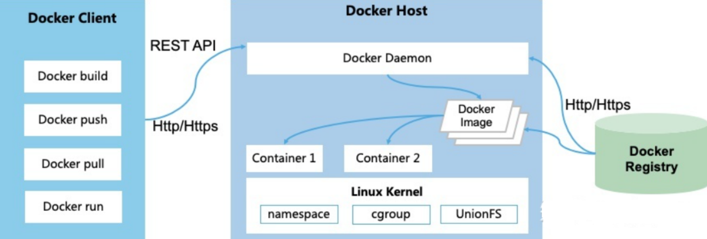

* [docker](#docker)
  * [Docker简介](#docker简介)
    * [是什么](#是什么)
    * [能干嘛](#能干嘛)
  * [Docker常用命令](#docker常用命令)
    * [帮助命令](#帮助命令)
    * [镜像命令](#镜像命令)
    * [容器命令](#容器命令)
  * [Docker应用架构](#docker应用架构)
  * [底层实现原理](#底层实现原理)
    * [Linux Namespace 命名空间](#linux-namespace-命名空间)
    * [Linux Cgroups 控制组](#linux-cgroups-控制组)
    * [联合文件系统UnionFS](#联合文件系统unionfs)
    * [容器格式](#容器格式)
    * [网络](#网络)
      * [基本原理](#基本原理)
      * [创建网络参数](#创建网络参数)
* [参考文章](#参考文章)

# docker
## Docker简介
### 是什么
解决了运行环境和配置问题软件容器，方便做持续集成并有助于整体发布的容器虚拟化技术。
### 能干嘛
容器虚拟化技术

一次构建、随处运行
- 更快速的应用交付和部署
- 更便捷的升级和扩缩容
- 更简单的系统运维
- 更高效的计算资源利用

##

## Docker常用命令
### 帮助命令
- docker version
- docker info
- docker --help
### 镜像命令
- docker images 列出本地主机上的镜像
  - OPTIONS说明：
    - -a :列出本地所有的镜像（含中间映像层）
    - -q :只显示镜像ID。
    - --digests :显示镜像的摘要信息
    - --no-trunc :显示完整的镜像信息
- docker search 某个XXX镜像名字
  - 网站 https://hub.docker.com
  - 命令 docker search [OPTIONS] 镜像名字
    - OPTIONS说明：
      - --no-trunc : 显示完整的镜像描述
      - -s : 列出收藏数不小于指定值的镜像。
      - --automated : 只列出 automated build类型的镜像；
- docker pull 某个XXX镜像名字 下载镜像
  - docker pull 镜像名字[:TAG]
- docker rmi 某个XXX镜像名字ID 删除镜像
  - 删除单个 docker rmi  -f 镜像ID
  - 删除多个 docker rmi -f 镜像名1:TAG 镜像名2:TAG
  - 删除全部 docker rmi -f $(docker images -qa)
### 容器命令
有镜像才能创建容器，这是根本前提(下载一个CentOS镜像演示)
- docker pull centos

新建并启动容器
- docker run [OPTIONS] IMAGE [COMMAND] [ARG...]

列出当前所有正在运行的容器
- docker ps [OPTIONS]

退出容器
- exit 容器停止退出
- ctrl+P+Q 容器不停止退出

启动容器
- docker start 容器ID或者容器名

重启容器
- docker restart 容器ID或者容器名

停止容器
- docker stop 容器ID或者容器名

强制停止容器
- docker kill 容器ID或者容器名

删除已停止的容器
- docker rm 容器ID

一次性删除多个容器
- docker rm -f $(docker ps -a -q)
- docker ps -a -q | xargs docker rm

重要

启动守护式容器
- docker run -d 容器名 

查看容器日志
- docker logs -f -t --tail 容器ID
  -  -t 是加入时间戳
  -  -f 跟随最新的日志打印
  -  --tail 数字 显示最后多少条

查看容器内运行的进程
- docker top 容器ID

查看容器内部细节
- docker inspect 容器ID

进入正在运行的容器并以命令行交互
- docker exec -it 容器ID bashShell
- 重新进入docker attach 容器ID
- 上述两个区别
  - attach 直接进入容器启动命令的终端，不会启动新的进程
  - exec 是在容器中打开新的终端，并且可以启动新的进程

从容器内拷贝文件到主机上
- docker cp  容器ID:容器内路径 目的主机路径

## Docker应用架构
Docker 采用了 C/S 架构，包括客户端和服务端。Docker 守护进程 （Daemon）作为服务端接受来自客户端的请求，并处理这些请求（创建、运行、分发容器）。

客户端和服务端既可以运行在一个机器上，也可通过 socket 或者 RESTful API 来进行通信。

Docker 守护进程一般在宿主主机后台运行，等待接收来自客户端的消息。

Docker 客户端则为用户提供一系列可执行命令，用户用这些命令实现跟 Docker 守护进程交互。

## 底层实现原理
Docker 底层的核心技术包括 Linux 上的命名空间（Namespaces）、控制组（Control groups）、Union 文件系统（Union file systems）和容器格式（Container format）。

我们知道，传统的虚拟机通过在宿主主机中运行 hypervisor 来模拟一整套完整的硬件环境提供给虚拟机的操作系统。虚拟机系统看到的环境是可限制的，也是彼此隔离的。 这种直接的做法实现了对资源最完整的封装，但很多时候往往意味着系统资源的浪费。 例如，以宿主机和虚拟机系统都为 Linux 系统为例，虚拟机中运行的应用其实可以利用宿主机系统中的运行环境。

我们知道，在操作系统中，包括内核、文件系统、网络、PID、UID、IPC、内存、硬盘、CPU 等等，所有的资源都是应用进程直接共享的。 要想实现虚拟化，除了要实现对内存、CPU、网络IO、硬盘IO、存储空间等的限制外，还要实现文件系统、网络、PID、UID、IPC等等的相互隔离。 前者相对容易实现一些，后者则需要宿主机系统的深入支持。

随着 Linux 系统对于命名空间功能的完善实现，程序员已经可以实现上面的所有需求，让某些进程在彼此隔离的命名空间中运行。大家虽然都共用一个内核和某些运行时环境（例如一些系统命令和系统库），但是彼此却看不到，都以为系统中只有自己的存在。这种机制就是容器（Container），利用命名空间来做权限的隔离控制，利用 cgroups 来做资源分配。

### Linux Namespace 命名空间
命名空间是 Linux 内核一个强大的特性。每个容器都有自己单独的命名空间，运行在其中的应用都像是在独立的操作系统中运行一样。命名空间保证了容器之间彼此互不影响。
### Linux Cgroups 控制组
控制组（cgroups）是 Linux 内核的一个特性，主要用来对共享资源进行隔离、限制、审计等。只有能控制分配到容器的资源，才能避免当多个容器同时运行时的对系统资源的竞争。

控制组技术最早是由 Google 的程序员在 2006 年提出，Linux 内核自 2.6.24 开始支持。

控制组可以提供对容器的内存、CPU、磁盘 IO 等资源的限制和审计管理。

### 联合文件系统UnionFS

联合文件系统（UnionFS）是一种分层、轻量级并且高性能的文件系统，它支持对文件系统的修改作为一次提交来一层层的叠加，同时可以将不同目录挂载到同一个虚拟文件系统下(unite several directories into a single virtual filesystem)。

联合文件系统是 Docker 镜像的基础。镜像可以通过分层来进行继承，基于基础镜像（没有父镜像），可以制作各种具体的应用镜像。

另外，不同 Docker 容器就可以共享一些基础的文件系统层，同时再加上自己独有的改动层，大大提高了存储的效率。

Docker 中使用的 AUFS（Advanced Multi-Layered Unification Filesystem）就是一种联合文件系统。 AUFS 支持为每一个成员目录（类似 Git 的分支）设定只读（readonly）、读写（readwrite）和写出（whiteout-able）权限, 同时 AUFS 里有一个类似分层的概念, 对只读权限的分支可以逻辑上进行增量地修改(不影响只读部分的)。

Docker 目前支持的联合文件系统包括 OverlayFS, AUFS, Btrfs, VFS, ZFS 和 Device Mapper。

各 Linux 发行版 Docker 推荐使用的存储驱动如下表。

| Linux 发行版 |Docker 推荐使用的存储驱动|
|---|---|
|Docker on Ubuntu| overlay2 (16.04 +)|
|Docker on Debian| overlay2 (Debian Stretch), aufs, devicemapper|
|Docker on CentOS| overlay2|
|Docker on Fedora| overlay2|

在可能的情况下，推荐 使用 overlay2 存储驱动，overlay2 是目前 Docker 默认的存储驱动，以前则是 aufs。你可以通过配置来使用以上提到的其他类型的存储驱动。

### 容器格式
最初，Docker 采用了 LXC 中的容器格式。从 0.7 版本以后开始去除 LXC，转而使用自行开发的 libcontainer，从 1.11 开始，则进一步演进为使用 runC 和 containerd。

### 网络
Docker 的网络实现其实就是利用了 Linux 上的网络命名空间和虚拟网络设备（特别是 veth pair）。建议先熟悉了解这两部分的基本概念再阅读本章。
#### 基本原理

首先，要实现网络通信，机器需要至少一个网络接口（物理接口或虚拟接口）来收发数据包；此外，如果不同子网之间要进行通信，需要路由机制。

Docker 中的网络接口默认都是虚拟的接口。虚拟接口的优势之一是转发效率较高。 Linux 通过在内核中进行数据复制来实现虚拟接口之间的数据转发，发送接口的发送缓存中的数据包被直接复制到接收接口的接收缓存中。对于本地系统和容器内系统看来就像是一个正常的以太网卡，只是它不需要真正同外部网络设备通信，速度要快很多。

Docker 容器网络就利用了这项技术。它在本地主机和容器内分别创建一个虚拟接口，并让它们彼此连通（这样的一对接口叫做 veth pair）。
#### 创建网络参数

Docker 创建一个容器的时候，会执行如下操作：

创建一对虚拟接口，分别放到本地主机和新容器中；

本地主机一端桥接到默认的 docker0 或指定网桥上，并具有一个唯一的名字，如 veth65f9；

容器一端放到新容器中，并修改名字作为 eth0，这个接口只在容器的命名空间可见；

从网桥可用地址段中获取一个空闲地址分配给容器的 eth0，并配置默认路由到桥接网卡 veth65f9。

完成这些之后，容器就可以使用 eth0 虚拟网卡来连接其他容器和其他网络。

可以在 docker run 的时候通过 --net 参数来指定容器的网络配置，有4个可选值：
- --net=bridge 这个是默认值，连接到默认的网桥。
- --net=host 告诉 Docker 不要将容器网络放到隔离的命名空间中，即不要容器化容器内的网络。此时容器使用本地主机的网络，它拥有完全的本地主机接口访问权限。容器进程可以跟主机其它 root 进程一样可以打开低范围的端口，可以访问本地网络服务比如 D-bus，还可以让容器做一些影响整个主机系统的事情，比如重启主机。因此使用这个选项的时候要非常小心。如果进一步的使用 --privileged=true，容器会被允许直接配置主机的网络堆栈。
- --net=container:NAME_or_ID 让 Docker 将新建容器的进程放到一个已存在容器的网络栈中，新容器进程有自己的文件系统、进程列表和资源限制，但会和已存在的容器共享 IP 地址和端口等网络资源，两者进程可以直接通过 lo 环回接口通信。
- --net=none 让 Docker 将新容器放到隔离的网络栈中，但是不进行网络配置。之后，用户可以自己进行配置。
# 参考文章
- https://yeasy.gitbook.io/docker_practice/introduction
