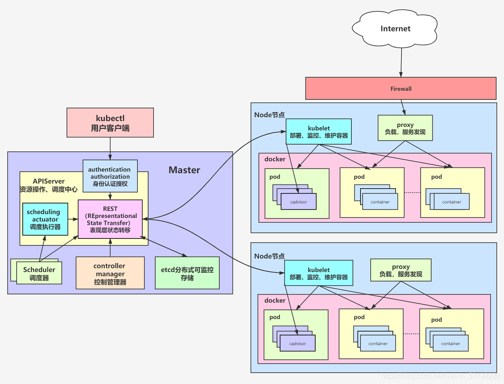

# 简介

Kubernetes 是 Google 团队发起的开源项目，它的目标是管理跨多个主机的容器，提供基本的部署，维护以及应用伸缩，主要实现语言为 Go 语言。Kubernetes 是：

- 易学：轻量级，简单，容易理解
- 便携：支持公有云，私有云，混合云，以及多种云平台
- 可拓展：模块化，可插拔，支持钩子，可任意组合
- 自修复：自动重调度，自动重启，自动复制

Kubernetes 构建于 Google 数十年经验，一大半来源于 Google 生产环境规模的经验。结合了社区最佳的想法和实践。

在分布式系统中，部署，调度，伸缩一直是最为重要的也最为基础的功能。Kubernetes 就是希望解决这一序列问题的。

Kubernetes 目前在GitHub进行维护。

# 基本概念


1. Pod
最小的可部署单位，一个 Pod 可以包含一个或多个紧密相关的容器。
容器共享网络和存储资源。
2. Node
Kubernetes 集群中的工作机器，可以是虚拟机或物理机。
每个 Node 包含运行 Pod 的必要组件，如 Kubelet、Kube-proxy 和容器运行时。
3. ReplicaSet
确保在任何时间都有指定数量的 Pod 副本在运行。
提供负载均衡和高可用性。
4. Deployment
用于管理应用的声明式更新。
可控制 ReplicaSet 的创建和扩缩容。
5. Service
定义一组 Pod 的访问策略，通过一个固定的 IP 和 DNS 名称提供负载均衡。
支持多种类型，如 ClusterIP、NodePort 和 LoadBalancer。
6. Namespace
用于在同一集群中隔离资源，适合不同环境（如开发、测试、生产）。
逻辑上分隔资源，便于访问控制。
7. Volume
持久化存储的基础，Pod 的存储方案。
支持多种类型的存储，如 NFS、PVC 等。
8. ConfigMap 和 Secret
ConfigMap：用于存储非敏感的配置信息，以键值对的形式提供给容器。
Secret：用于存储敏感信息（如密码、证书），提供更安全的处理方式。
9. Ingress
管理外部用户访问服务的规则，可以提供负载均衡、SSL 终端等功能。
通常用于 HTTP/HTTPS 流量的路由。
10. Cluster
由多个 Node 组成的整体，Kubernetes 控制器在集群中管理和调度资源。

## k8s架构



## 常用的命令

以下是一些常用的 kubectl 命令，用于管理 Kubernetes 集群中的资源：
### 1.查看资源
- kubectl get pods：获取所有 Pod 的信息。
- kubectl get services：获取所有服务的信息。
- kubectl get deployments：获取所有部署的信息。
- kubectl get nodes：获取所有节点的信息。
### 2.查看详细信息

- kubectl describe pod <pod_name>：显示特定 Pod 的详细信息。
- kubectl describe service <service_name>：显示特定服务的详细信息。
### 3.创建资源
- kubectl create -f <filename>：从配置文件创建资源。
- kubectl apply -f <filename>：应用配置文件以创建或更新资源。
### 4.删除资源
- kubectl delete pod <pod_name>：删除特定的 Pod。
- kubectl delete service <service_name>：删除特定的服务。
- kubectl delete deployment <deployment_name>：删除特定的部署。
### 5.日志和执行命令
- kubectl logs <pod_name>：获取 Pod 的日志。
- kubectl exec -it <pod_name> -- /bin/bash：在运行中的 Pod 中执行交互式 shell。
### 6.扩展和缩放
- kubectl scale deployment <deployment_name> --replicas=<num>：扩展或缩小部署的副本数量。
- kubectl autoscale deployment <deployment_name> --min=<min> --max=<max> --cpu-percent=<percent>：基于 CPU 使用情况自动扩展部署。
### 7.更新资源
- kubectl edit <resource_type> <resource_name>：编辑资源的配置。
- kubectl rollout restart deployment <deployment_name>：重启部署以应用更新。
### 8.命名空间
- kubectl get pods -n <namespace>：在指定命名空间中获取资源。
- kubectl create namespace <namespace>：创建一个新的命名空间。

## 案例：使用k8s启动一个springboot服务

使用 Kubernetes 启动一个 Spring Boot 服务的流程如下：

### 1. **准备 Spring Boot 应用**

确保你已经有一个打包好的 Spring Boot 应用，通常以 JAR 文件形式存在。可以使用 Maven 或 Gradle 进行构建。

### 2. **编写 Dockerfile**

在 Spring Boot 源码根目录下创建一个 `Dockerfile` 文件。

```dockerfile
# 使用 Java 基础镜像
FROM openjdk:11-jre-slim
# 复制 JAR 文件到镜像中
COPY target/your-spring-boot-app.jar app.jar
# 运行应用
ENTRYPOINT ["java","-jar","/app.jar"]
```

### 3. **构建 Docker 镜像**

在命令行中，导航到项目根目录并执行以下命令：

```bash
docker build -t your-image-name:latest .
```

### 4. **推送 Docker 镜像到容器仓库**

将 Docker 镜像上传到公共或私有 Docker 仓库（如 Docker Hub）。

```bash
docker tag your-image-name:latest your-repo/your-image-name:latest
docker push your-repo/your-image-name:latest
```

### 5. **编写 Kubernetes 部署配置**

创建一个名为 `deployment.yaml` 的文件，定义 Deployment 和 Service。

```yaml
apiVersion: apps/v1
kind: Deployment
metadata:
  name: springboot-deployment
spec:
  replicas: 2
  selector:
    matchLabels:
      app: springboot-app
  template:
    metadata:
      labels:
        app: springboot-app
    spec:
      containers:
        - name: springboot-container
          image: your-repo/your-image-name:latest
          ports:
            - containerPort: 8080 # 根据应用的端口进行修改

---
apiVersion: v1
kind: Service
metadata:
  name: springboot-service
spec:
  type: NodePort
  ports:
    - port: 8080
      targetPort: 8080
      nodePort: 30000 # 可用的节点端口
  selector:
    app: springboot-app
```

### 6. **部署到 Kubernetes**

使用 kubectl 命令将配置应用到 Kubernetes 集群。

```bash
kubectl apply -f deployment.yaml
```

### 7. **查看部署状态**

使用以下命令查看应用的状态：

```bash
kubectl get pods
kubectl get services
```

### 8. **访问 Spring Boot 服务**

通过集群的节点 IP 和端口访问 Spring Boot 应用：

```bash
http://<node-ip>:30000
```

### 总结

以上步骤完成了使用 Kubernetes 启动 Spring Boot 服务的流程，包括 Docker 镜像的构建、上传和 Kubernetes 配置的创建与应用。确保 Kubernetes 集群已成功运行，并已正确配置网络访问。