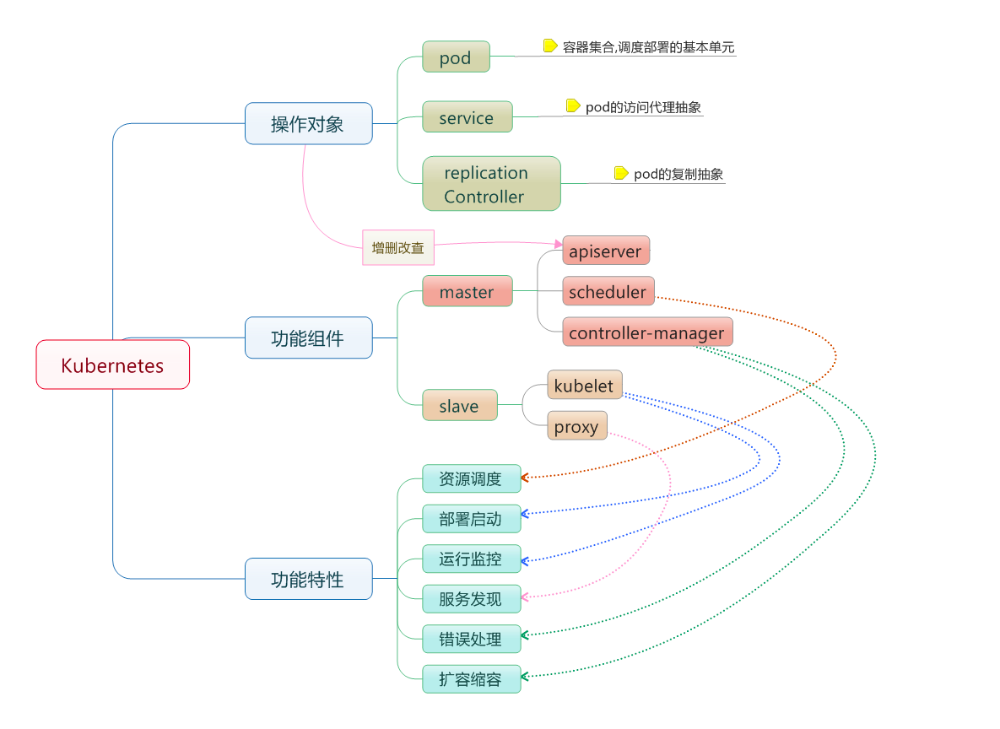

# 简介

Kubernetes 是 Google 团队发起的开源项目，它的目标是管理跨多个主机的容器，提供基本的部署，维护以及应用伸缩，主要实现语言为 Go 语言。Kubernetes 是：

- 易学：轻量级，简单，容易理解
- 便携：支持公有云，私有云，混合云，以及多种云平台
- 可拓展：模块化，可插拔，支持钩子，可任意组合
- 自修复：自动重调度，自动重启，自动复制

Kubernetes 构建于 Google 数十年经验，一大半来源于 Google 生产环境规模的经验。结合了社区最佳的想法和实践。

在分布式系统中，部署，调度，伸缩一直是最为重要的也最为基础的功能。Kubernetes 就是希望解决这一序列问题的。

Kubernetes 目前在GitHub进行维护。

# 基本概念

- 节点（Node）：一个节点是一个运行 Kubernetes 中的主机。
- 容器组（Pod）：一个 Pod 对应于由若干容器组成的一个容器组，同个组内的容器共享一个存储卷(volume)。
- 容器组生命周期（pos-states）：包含所有容器状态集合，包括容器组状态类型，容器组生命周期，事件，重启策略，以及 replication controllers。
- Replication Controllers：主要负责指定数量的 pod 在同一时间一起运行。
- 服务（services）：一个 Kubernetes 服务是容器组逻辑的高级抽象，同时也对外提供访问容器组的策略。
- 卷（volumes）：一个卷就是一个目录，容器对其有访问权限。
- 标签（labels）：标签是用来连接一组对象的，比如容器组。标签可以被用来组织和选择子对象。
- 接口权限（accessing_the_api）：端口，IP 地址和代理的防火墙规则。
- web 界面（ux）：用户可以通过 web 界面操作 Kubernetes。
- 命令行操作（cli）：kubectl命令。
