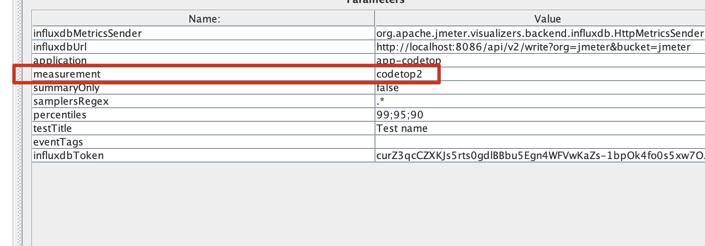
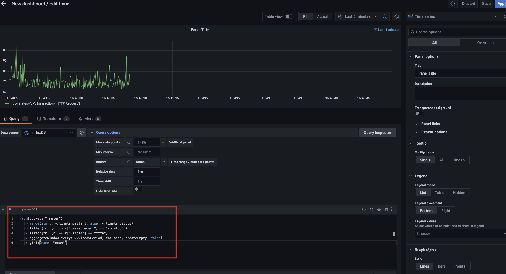

# 1、安装docker

https://www.docker.com/get-started


# 2、安装配置influxdb

https://docs.influxdata.com/influxdb/v2.0/install/?t=Docker#persist-data-outside-the-influxdb-container

在本地新建一个存放容器influx数据的目录

```shell
mkdir influxdb-docker-data-volume && cd $_
```
比如我是在本地用户的目录下新建


启动
```shell
docker run -d --name=influxdb -p 8086:8086 -v ${PWD}/influxdb/:/var/lib/influxdb2 influxdb
```
启动成功


访问influx的UI界面配置一些登录和数据库信息

http://localhost:8086/


这里可以看到用户的信息


influxdb v2使用token登录检验，这里可以获取到token的值


你也可以新建一个token并为他设置读写权限，这里的token等下在grafana添加数据源连接时需要用到


# 3、运行grafana

```shell
docker run -d --name grafana -p 3000:3000 grafana/grafana
```

访问grafana的UI界面

http://localhost:3000/login


输入默认用户名密码
```shell
admin  admin
```

这里可以在进入容器后修改grafana的配置文件
```shell
docker exec -it grafana bash
cat /etc/grafana/grafana.ini
```

要求修改密码，我这里skip,你也可以修改一下

进入后直接添加数据源


influxdb v2选择flux


连接信息如图：
```shell
URL：http://localhost:8086
Access: Server(default)
Organization：jemter    # 这里就是在上面配置influxDB时创建的
Token：xxxx # 复制上面提到的token
Default Bucket：jemter   # 上文创建的bucket
```


这里不出意外会得到一个错误


调出控制台，看下接口的信息，发现出现connection refused错误

这里分析下，接口直接请求的是grafana的接口，在容器内再请求127.0.0.1:8086 influxDB接口，问题就出现在这


我们看下docker的容器网络

docker的默认网桥bridge


如上图所示为Docker中bridge驱动模式的示意图，其中蓝色的模块表示主机上的网卡。当Docker启动时会自动在主机上创建一个虚拟网桥docker0，使用默认网络模式创建docker容器时会自动创建一对儿veth pair接口，一端连接在docker容器中（如图容器中的eth0），一端连接在虚拟网桥docker0上（如图veth）。这种veth pair是一种虚拟网络设备，主要用于不同namespace中（意味着网络隔离）的网络通信，它总是成对存在的。在这里可以把它想象成一对儿靠虚拟网线连接起来的两个虚拟网卡，一端连接着docker容器，一端连接着虚拟网桥docker0。

通过这种方式，不同docker容器之间可以通过ip地址互相通信，也可以通过虚拟网桥访问主机上的网络eth0（添加iptables规则，将docker容器对目标地址发出的访问通过地址伪装的方式修改为主机对目标地址进行访问）。

**也就是说容器间可以通信通过的是ip**

于是
```shell
docker exec -it influxdb bash
 
ip addr
```

把ip拿过来修改

再次测试save&test


完成后，我们去仪表板下载一个模板

https://grafana.com/grafana/dashboards 在这里可以搜索jmeter，有很多模板


这里有一个ID可以试试5496，如图import一个模板

点击load，再import


效果如下，有红色感叹号是因为这是influxDB 2.0版本以下的模板，查询SQL和新版的不一致，不过可以edit每个版块的SQL即可呈现数据

你也可以选择v2版本的模板

# 4、配置jmeter
```shell
添加一个线程组
添加一个接口请求
添加一个结果树
添加一个Backend Listener
```


- influxdbUrl修改为http://localhost:8086/api/v2/write?org=jmeter&bucket=jmeter
- 注意如果是其他的org和bucket需要按你在influxDB里配置的修改
- application随便写
- measurement也是随便写，但是这个字段在后面筛选数据时会用到

然后点击Add，添加一个name value
- name为influxdbToken
- value的值可以点Detail cv填进去


然后我们先设置loop count 为循环，测试一下数据


运行开始可以看下日志有没有错误，如果有错误，按日志提示修改


# 5、配置UI和查询语句
回到influxDB的UI，这里也有一些图表显示，我们来查询一下数据看看

from 选择bucket ，相当于选择数据库

后面的都是过滤条件filter

在第一个filter我们选择_measurement 选择  codetop2这里就是刚才在jmeter配置的

这里可以看出来jmeter传了一些数据到influxDB，具体的这些参数的含义可以去研究下，但是看名字比如avg是平均数吧，count是总的请求条数？

我们这样选择

然后点击submit,其实看得出来，这里就是在可视化的配置查询语句

这里显示10条，就是刚才我只发送了10次请求就停下来了，如果你是循环应该会一直递增

因为这是可视化的，我们需要把语句copy一下，去刚才的低版本模板修改SQL（新版本基于influxdb v2 flux的模板写的查询语句应该是不需要修改的）

把这里的语句copy一下，回到grafana的这个模板，我们编辑一下这个版块

可以看到这个SQL是influxDB v2版本以下的查询语句，我们把刚才在influxDB的UI copy的SQL替换图示的SQL

因为我这里不是一直循环，所以目前没有数据，因为influxDB是时序数据库，数据查询都是带时间条件的不带默认是截止是now，我们可以选择过去1小时，如果还是没有数据可以选择3小时

可以看到现在查询出来了，最后我们点击apply

回到模板首页，可以看到不报错了，数字也有了

类似的，其他版块的也可以这样修改，其实原理很简单，就是通过在grafana选择一个展示的图表，然后在这个图表下配置查询influxDB的语句，选择好查询的数据，图表就展示出来了

最后如果选择的listenter是这个，传给influxDB的值又不一样

按名字猜（我没找到文档）这里connectTime应该是连接时间，duration是持续时间，ttfb是响应时间

# 6、这里以ttfb来做个图表再来举个例子
这里我们退出刚才的模板，直接新建一个panel

panel选择time series，数据源选择我们添加的influxDB

influxDB这里选择如图

因为还写不来这个SQL，先copy自动生成的吧

把SQL粘贴到

配置一下间隔和时间，也可以不用设置哦，反正随便调，测试嘛

jmeter如果没有停，一直在循环的话，应该有如下效果

效果如下


改个名字

到仪表板观看效果，这样一个相应时间的时序图版块就OK了

再把其他字段也这样，选择一个相应的panel，填入SQL，一个大的仪表板就做好了，类似刚才的那个模板
# 参考文章
- https://www.jianshu.com/p/dd0456b8054c
- https://juejin.cn/post/6844903847383547911
