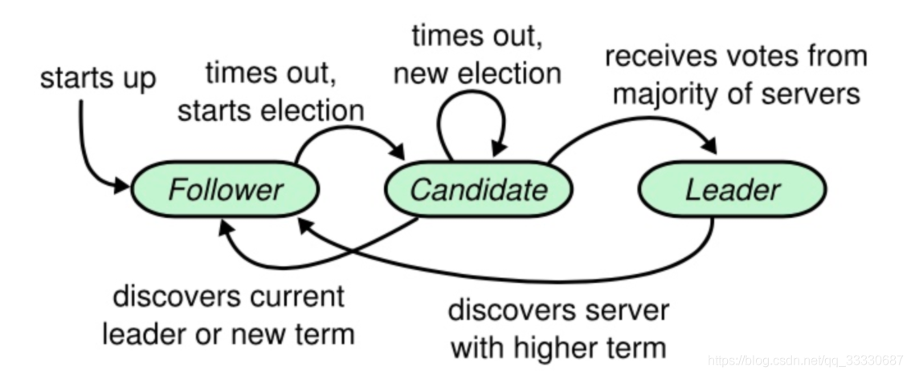
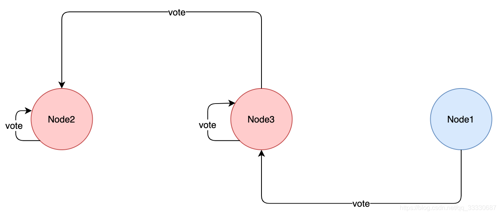

* [Elasticsearch](#elasticsearch)
  * [es的特点](#es的特点)
  * [应用场景](#应用场景)
* [Elasticsearch基本概念](#elasticsearch基本概念)
  * [索引(index)](#索引index)
  * [类型(type)](#类型type)
  * [文档(document)](#文档document)
  * [映射(mapping)](#映射mapping)
  * [倒排索引](#倒排索引)
    * [Posting List](#posting-list)
    * [Term Dictionary](#term-dictionary)
    * [Term Index](#term-index)
    * [FST(finite-state transducer有限状态转换器)](#fstfinite-state-transducer有限状态转换器)
* [集群](#集群)
  * [基本概念](#基本概念)
    * [节点(Node)](#节点node)
    * [集群(Cluster)](#集群cluster)
    * [分片索引(Shard)](#分片索引shard)
    * [索引副本(Replica)](#索引副本replica)
  * [集群简单原理](#集群简单原理)
  * [插入数据流程](#插入数据流程)
    * [储存](#储存)
  * [查询数据流程](#查询数据流程)
* [选举算法](#选举算法)
  * [7.X之前的选主流程](#7x之前的选主流程)
    * [什么时候开始选主？](#什么时候开始选主)
    * [Bully算法缺陷](#bully算法缺陷)
      * [Master假死](#master假死)
      * [脑裂](#脑裂)
        * [如何解决脑裂问题](#如何解决脑裂问题)
      * [仍然存在的问题](#仍然存在的问题)
  * [7.X之后的选主流程](#7x之后的选主流程)
    * [ES实现的Raft算法选主流程](#es实现的raft算法选主流程)
      * [动态维护参选节点列表](#动态维护参选节点列表)
* [es性能优化](#es性能优化)
  * [加大filesystem cache大小](#加大filesystem-cache大小)
  * [数据预热](#数据预热)
  * [冷热分离](#冷热分离)
  * [document设计](#document设计)
  * [禁止直接分页](#禁止直接分页)
* [es的分词器有哪些](#es的分词器有哪些)
* [es为什么这么快](#es为什么这么快)
* [参考文章](#参考文章)

# Elasticsearch
## es的特点
elasticsearch 是一个兼有搜索引擎和NoSQL数据库功能的开源系统，基于Java/Lucene构建，可以用于全文搜索，结构化搜索以及近实时分析。可以说Lucene是当今最先进，最高效的全功能开源搜索引擎框架
## 应用场景
- 搜索
- 监控
# Elasticsearch基本概念
## 索引(index)
ElasticSearch把数据存放到一个或者多个索引(indices)中。如果用关系型数据库模型对比，索引(index)的地位与数据库实例(database)相当
## 类型(type)
- 每个文档在ElasticSearch中都必须设定它的类型。文档类型使得同一个索引中在存储结构不同文档时，只需要依据文档类型就可以找到对应的参数映射(Mapping)信息，方便文档的存取。
- 可以理解为关系型数据库里的表
- 在7.x版本被移除
## 文档(document)
- 可以理解为关系数据库中的一行数据
- 文档(Document)由一个或者多个域(Field)组成，每个域(Field)由一个域名(此域名非彼域名)和一个或者多个值组成(有多个值的值称为多值域(multi-valued))
## 映射(mapping)
- mapping是对索引库中的索引字段及其数据类型进行定义，类似于关系型数据库中的表结构。ES默认动态创建索引和索引类型的mapping，这就像是关系型数据中的，无需定义表结构，更不用指定字段的数据类型。当然也可以手动指定mapping类型。
- 表结构
## 倒排索引
- 正向索引一般都是文档1->关键词1 位置->关键词2 位置
- 倒排索引是 关键词1->文档1 位置  ->文档2 位置
- 在搜索引擎中，每个文档都有一个对应的文档 ID，文档内容被表示为一系列关键词的集合。例如，文档 1 经过分词，提取了 20 个关键词，每个关键词都会记录它在文档中出现的次数和出现位置。那么，倒排索引就是关键词到文档 ID 的映射，每个关键词都对应着一系列的文件，这些文件中都出现了关键词。
### Posting List
上面所说的文章的ID就是被放在一个int的数组，存储了所有符合某个term的文档id，实际上，除此之外还包含：文档的数量、词条在每个文档中出现的次数、出现的位置、每个文档的长度、所有文档的平均长度等，在计算相关度时使用
### Term Dictionary
假设我们有很多个 term，比如：

`Carla,Sara,Elin,Ada,Patty,Kate,Selena`

如果按照这样的顺序排列，找出某个特定的 term 一定很慢，因为 term 没有排序，需要全部过滤一遍才能找出特定的 term。排序之后就变成了：

`Ada,Carla,Elin,Kate,Patty,Sara,Selena`

再使用二分查找可以用 logN 次磁盘查找得到目标。

### Term Index
但是磁盘的随机读操作仍然是非常昂贵的（一次 random access 大概需要 10ms 的时间）。所以尽量少的读磁盘，有必要把一些数据缓存到内存里。但是整个 term dictionary 本身又太大了，无法完整地放到内存里。于是就有了 term index。term index 有点像一本字典的大的章节表。比如：
```java
A 开头的 term ……………. Xxx 页
C 开头的 term ……………. Yyy 页
E 开头的 term ……………. Zzz 页
```
如果所有的 term 都是英文字符的话，可能这个 term index 就真的是 26 个英文字符表构成的了。但是实际的情况是，term 未必都是英文字符，term 可以是任意的 byte 数组。而且 26 个英文字符也未必是每一个字符都有均等的 term，比如 x 字符开头的 term 可能一个都没有，而 s 开头的 term 又特别多。实际的 term index 是一棵 trie 树（前缀树、字典树）：


例子是一个包含 "A", "to", "tea", "ted", "ten", "i", "in", 和 "inn" 的 trie 树。这棵树不会包含所有的 term，它包含的是 term 的一些前缀。通过 term index 可以快速地定位到 term dictionary 的某个 offset，然后从这个位置再往后顺序查找。
### FST(finite-state transducer有限状态转换器)
实际上，Lucene 内部的 Term Index 是用的「变种的」trie前缀树，即 FST 。FST 比 trie树好在哪？trie树只共享了前缀，而 FST 既共享前缀也共享后缀，更加的节省空间。

# 集群
## 基本概念
### 节点(Node)
一个es实例即为一个节点，一台机器可以有多个节点，正常使用下每个实例都应该会部署在不同的机器上
### 集群(Cluster)
一个ES集群由多个节点（node）组成， 每个集群都有一个共同的集群名称最为标识
### 分片索引(Shard)
如果我们的索引数据量很大，超过硬件存放单个文件的限制，就会影响查询请求的速度，ES引入了分片技术。一个分片本身就是一个完成的搜索引擎，文档存储在分片中，而分片会被分配到集群中的各个节点中，随着集群的扩大和缩小，ES会自动的将分片在节点之间进行迁移，以保证集群能保持一种平衡
### 索引副本(Replica)
副本（replica shard）就是shard的冗余备份，它的主要作用
- 冗余备份，防止数据丢失；
- shard异常时负责容错和负载均衡；
## 集群简单原理

- es的数据流程为index -> type -> mapping -> document -> field。
- index被拆分为多个shard
  - 多个shard分布在不同的机器上
  - 不同的shard又有备份replica
- ES 集群多个节点，会自动选举一个节点为 master 节点，这个 master 节点其实就是干一些管理的工作的，比如维护索引元数据、负责切换 primary shard 和 replica shard 身份等。要是 master 节点宕机了，那么会重新选举一个节点为 master 节点。
- 如果是非 master 节点宕机了，那么会由 master 节点，让那个宕机节点上的 primary shard 的身份转移到其他机器上的 replica shard。接着你要是修复了那个宕机机器，重启了之后，master 节点会控制将缺失的 replica shard 分配过去，同步后续修改的数据之类的，让集群恢复正常。

## 插入数据流程
		
写索引是只能写在主分片上，然后同步到副本分片,但是上图中每个节点上都有主分片，一条数据是根据什么策略写到指定的分片上呢？
- 这个过程是根据下面这个公式决定的
  - `shard = hash(routing) % number_of_primary_shards`
		
- （1）数据写请求发送到 node1 节点，通过路由计算得到值为1，那么对应的数据会应该在主分片S1上。
- （2）node1节点将请求转发到 S1 主分片所在的节点node2，node2 接受请求并写入到磁盘。
- （3）并发将数据复制到三个副本分片R1上，其中通过乐观并发控制数据的冲突。一旦所有的副本分片都报告成功，则节点 node2将向node1节点报告成功，然后node1节点向客户端报告成功。

### 储存
经过Lucene进行分词等预处理后数据先储存在内存中，并将此次操作写入事务日志(tansLog)，然后每隔一秒将内存的数据刷入segment缓存中，segment保证此时的数据已经可以被检索了，然后Lucene每隔30分钟或者segment的size大于512M时刷入磁盘

## 查询数据流程
- 客户端发送请求到一个 coordinate node 。
- 协调节点将搜索请求转发到所有的 shard 对应的 primary shard 或 replica shard ，都可以。
- query phase：每个 shard 将自己的搜索结果（其实就是一些 doc id ）返回给协调节点，由协调节点进行数据的合并、排序、分页等操作，产出最终结果。
- fetch phase：接着由协调节点根据 doc id 去各个节点上拉取实际的 document 数据，最终返回给客户端。
- Elasticsearch查询方式
  - 查询的方式简单分为两种
    - 通过ID搜索出对应的Doc
      - 检索内存的Translog文件
      - 检索硬盘的Translog文件
      - 检索硬盘的Segement文件
    - 通过query匹配相关的Doc
      - 从内存和硬盘的Segement文件中查找
  - 查询可以分为三个阶段
    - QUERY_AND_FETCH （查询完就返回整个Doc内容）
    - QUERY_THEN_FETCH （先查询出对应的Doc id ，然后再根据Doc id 匹配去对应的文档）
    - DFS_QUERY_THEN_FETCH （先算分，再查询）
  - 用得最多的就是QUERY_THEN_FETCH
    - 向各个主分片和副本分片分发请求
    - 得到各个节点返回的doc id，组成doc id集合
    - 再次请求各个分片拿到对应的完整Doc

# 选举算法
## 7.X之前的选主流程
Zen Discovery

采用Bully算法，它假定所有节点都有一个唯一的ID，使用该ID对节点进行排序。任何时候的当前Leader都是参与集群的最高ID节点。该算法的优点是易于实现。但是，当拥有最大ID的节点处于不稳定状态的场景下会有问题。例如，Master负载过重而假死，集群拥有第二大ID的节点被选为新主，这时原来的Master恢复，再次被选为新主，然后又假死

ES 通过推迟选举，直到当前的 Master 失效来解决上述问题，只要当前主节点不挂掉，就不重新选主。但是容易产生脑裂（双主），为此，再通过“法定得票人数过半”解决脑裂问题

只有一个 Leader将当前版本的全局集群状态推送到每个节点。 ZenDiscovery（默认）过程就是这样的:
- 每个节点计算最高的已知节点ID，并向该节点发送领导投票
- 如果一个节点收到足够多的票数，并且该节点也为自己投票，那么它将扮演领导者的角色，开始发布集群状态。
- 所有节点都会参数选举,并参与投票,但是,只有有资格成为 master 的节点的投票才有效.

有多少选票赢得选举的定义就是所谓的法定人数。 在弹性搜索中，法定大小是一个可配置的参数。 （一般配置成:可以成为master节点数n/2+1）

### 什么时候开始选主？
- 集群启动
- Master 失效
  - 非 Master 节点运行的 MasterFaultDetection 检测到 Master 失效,在其注册的 listener 中执行 handleMasterGone,执行 rejoin 操作,重新选主.注意,即使一个节点认为 Master 失效也会进入选主流程

### Bully算法缺陷
#### Master假死
Master节点承担的职责负载过重的情况下，可能无法即时对组内成员作出响应，这种便是假死。例如一个集群中的Master假死，其他节点开始选主，刚刚选主成功，原来的Master恢复了，因为原来Master节点的Id优先级最高，又开始一轮选主，重新把原来Master选举为Master

为了解决这个问题，当Master节点假死的时候会去探测是是不是真的挂了，如果不是会继续推迟选主过程

#### 脑裂
当发生网络分区故障就会发生脑裂，就会出现双主情况，那么这个时候是十分危险的因为两个新形成的集群会同时索引和修改集群的数据。

##### 如何解决脑裂问题

有一个minimum_master_nodes设置，集群中节点必须大于这个数字才进行选主，否则不进行，例如10个节点，现在发生网络分区，3个节点一组，7个节点另外一组，最开始master在3节点那边

minimum_master_nodes设置5

这个时候，3节点那组，master会判断有7个节点退出，然后检查minimum_master_nodes，发现小于配置，放弃master节点身份，重新开始选主，但是因为minimum_master_nodes配置，无法进行选主

7节点那组，发现master真的凉了，联系不上了，开始选主，选出新的Master节点

#### 仍然存在的问题
Zen的minimum_master_nodes设置经常配置错误，这会使群集更容易出现裂脑和丢失数据的风险

## 7.X之后的选主流程
7.X之后的ES，采用一种新的选主算法，实际上是 Raft 的实现，但并非严格按照 Raft 论文实现，而是做了一些调整。

Raft是工程上使用较为广泛分布式共识协议，是多个节点对某个事情达成一致的看法，即使是在部分节点故障、网络延时、网络分区的情况下。

其设计原则如下：
- 容易理解
- 减少状态的数量，尽可能消除不确定性

Raft 将问题分解为：Leader 选举，日志复制，安全性，将这三个问题独立思考。

在 Raft 中，节点可能的状态有三种，其转换关系如下：



正常情况下，集群中只有一个 Leader，其他节点全是 Follower 。Follower 都是被动接收请求，从不发送主动任何请求。Candidate 是从 Follower 到 Leader的中间状态。

Raft 中引入任期（term）的概念，每个 term 内最多只有一个 Leader。term在 Raft 算法中充当逻辑时钟的作用。服务器之间通信的时候会携带这个 term，如果节点发现消息中的 term小于自己的 term，则拒绝这个消息，如果大于本节点的 term，则更新自己的 term。如果一个 Candidate 或者 Leader 发现自己的任期号过期了，它会立即回到 Follower 状态。

Raft 选举流程为：

- 增加节点本地的 current term ，切换到Candidate状态
- 投自己一票
- 并行给其他节点发送 RequestVote RPC（让大家投他）。

然后等待其他节点的响应，会有如下三种结果：

- 如果接收到大多数服务器的选票，那么就变成Leader
- 如果收到了别人的投票请求，且别人的term比自己的大，那么候选者退化为follower
- 如果选举过程超时，再次发起一轮选举

通过下面的约束来确定唯一 Leader（选举安全性）：

- 同一任期内，每个节点只有一票
- 得票(日志信息不旧于Candidate的日志信息)过半则当选为 Leader
- 成为 Leader 后，向其他节点发送心跳消息来确定自己的地位并阻止新的选举。

当同时满足以下条件时，Follower同意投票：

- RequestVote请求包含的term大于等于当前term
- 日志信息不旧于Candidate的日志信息
- first-come-first-served 先来先得

### ES实现的Raft算法选主流程
ES 实现的 Raft 中，选举流程与标准的有很多区别：

- 初始为 Candidate状态
- 执行 PreVote 流程，并拿到 maxTermSeen
- 准备 RequestVote 请求（StartJoinRequest），基于maxTermSeen，将请求中的 term 加1（尚未增加节点当前 term）
- 并行发送 RequestVote，异步处理。目标节点列表中包括本节点。

ES 实现中，候选人不先投自己，而是直接并行发起 RequestVote，这相当于候选人有投票给其他候选人的机会。这样的好处是可以在一定程度上避免3个节点同时成为候选人时，都投自己，无法成功选主的情况。

ES 不限制每个节点在某个 term 上只能投一票，节点可以投多票，这样会产生选出多个主的情况：



- Node2被选为主：收到的投票为：Node2,Node3
- Node3被选为主：收到的投票为：Node3,Node1

对于这种情况，ES 的处理是让最后当选的 Leader 成功。作为 Leader，如果收到 RequestVote请求，他会无条件退出 Leader 状态。在本例中，Node2先被选为主，随后他收到 Node3的 RequestVote 请求，那么他退出 Leader 状态，切换为CANDIDATE，并同意向发起 RequestVote候选人投票。因此最终 Node3成功当选为 Leader。

#### 动态维护参选节点列表
在此之前，我们讨论的前提是在集群节点数量不变的情况下，现在考虑下集群扩容，缩容，节点临时或永久离线时是如何处理的。在7.x 之前的版本中，用户需要手工配置 minimum_master_nodes，来明确告诉集群过半节点数应该是多少，并在集群扩缩容时调整他。现在，集群可以自行维护。

在取消了discovery.zen.minimum_master_nodes配置后，ES 如何判断多数？是自己计算和维护minimum_master_nodes值么？不，现在的做法不再记录“quorum” 的具体数值，取而代之的是记录一个节点列表，这个列表中保存所有具备 master 资格的节点（有些情况下不是这样，例如集群原本只有1个节点，当增加到2个的时候，这个列表维持不变，因为如果变成2，当集群任意节点离线，都会导致无法选主。这时如果再增加一个节点，集群变成3个，这个列表中就会更新为3个节点），称为 VotingConfiguration，他会持久化到集群状态中。

在节点加入或离开集群之后，Elasticsearch会自动对VotingConfiguration做出相应的更改，以确保集群具有尽可能高的弹性。在从集群中删除更多节点之前，等待这个调整完成是很重要的。你不能一次性停止半数或更多的节点。（感觉大面积缩容时候这个操作就比较感人了，一部分一部分缩）

默认情况下，ES 自动维护VotingConfiguration，有新节点加入的时候比较好办，但是当有节点离开的时候，他可能是暂时的重启，也可能是永久下线。你也可以人工维护 VotingConfiguration，配置项为：cluster.auto_shrink_voting_configuration，当你选择人工维护时，有节点永久下线，需要通过 voting exclusions API 将节点排除出去。如果使用默认的自动维护VotingConfiguration，也可以使用 voting exclusions API 来排除节点，例如一次性下线半数以上的节点。

如果在维护VotingConfiguration时发现节点数量为偶数，ES 会将其中一个排除在外，保证 VotingConfiguration是奇数。因为当是偶数的情况下，网络分区将集群划分为大小相等的两部分，那么两个子集群都无法达到“多数”的条件。

# es性能优化
## 加大filesystem cache大小
es 的搜索引擎严重依赖于底层的 filesystem cache ，你如果给 filesystem cache 更多的内存，尽量让内存可以容纳所有的 idx segment file  索引数据文件，那么你搜索的时候就基本都是走内存的，性能会非常高 
## 数据预热
先查数据出来讲热数据留在cache里
## 冷热分离
热数据和冷数据单独设计index，确保热数据不会被冷数据冲掉
## document设计
把查询字段放入es即可，其他的全量数据存入数据库，比如hbase，常见的场景就是es存索引，HBASE存数据全部字段
## 禁止直接分页
拉下才能查看下一页，用上一页的scroll  id

# es的分词器有哪些
- ik分词器
- jeba分词器

# es为什么这么快
- 倒排索引

# es 的分页方案
todo
# es 的查询
todo

# 参考文章
- https://blog.csdn.net/qq_34820803/article/details/104798716
- https://blog.csdn.net/qq_33330687/article/details/105681994
