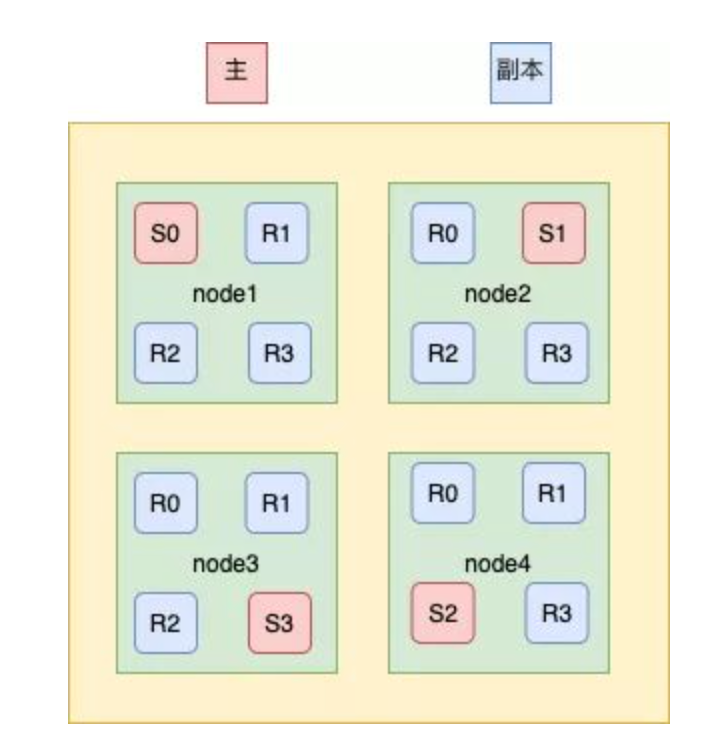

* [Elasticsearch](#elasticsearch)
  * [es的特点](#es的特点)
  * [应用场景](#应用场景)
  * [Elasticsearch基本概念](#elasticsearch基本概念)
    * [索引(index)](#索引index)
    * [类型(type)](#类型type)
    * [文档(document)](#文档document)
    * [映射(mapping)](#映射mapping)
    * [倒排索引](#倒排索引)
      * [Posting List](#posting-list)
      * [Term Dictionary](#term-dictionary)
      * [Term Index](#term-index)
      * [FST(finite-state transducer有限状态转换器)](#fstfinite-state-transducer有限状态转换器)
* [集群](#集群)
  * [基本概念](#基本概念)
    * [节点(Node)](#节点node)
    * [集群(Cluster)](#集群cluster)
    * [分片索引(Shard)](#分片索引shard)
    * [索引副本(Replica)](#索引副本replica)
  * [集群简单原理](#集群简单原理)
  * [集群详解](#集群详解)
    * [集群节点](#集群节点)
    * [节点发现](#节点发现)
    * [Master选举](#master选举)
      * [master选举谁发起，什么时候发起？](#master选举谁发起什么时候发起)
      * [当需要选举master时，选举谁？](#当需要选举master时选举谁)
      * [什么时候选举成功？](#什么时候选举成功)
      * [选举怎么保证不脑裂？](#选举怎么保证不脑裂)
  * [插入数据流程](#插入数据流程)
    * [储存](#储存)
  * [查询数据流程](#查询数据流程)
  * [es性能优化](#es性能优化)
    * [加大filesystem cache大小](#加大filesystem-cache大小)
    * [数据预热](#数据预热)
    * [冷热分离](#冷热分离)
    * [document设计](#document设计)
    * [禁止直接分页](#禁止直接分页)
  * [es的分词器有哪些](#es的分词器有哪些)
  * [es为什么这么快](#es为什么这么快)
* [参考文章](#参考文章)

# Elasticsearch
## es的特点
elasticsearch 是一个兼有搜索引擎和NoSQL数据库功能的开源系统，基于Java/Lucene构建，可以用于全文搜索，结构化搜索以及近实时分析。可以说Lucene是当今最先进，最高效的全功能开源搜索引擎框架
## 应用场景
- 搜索
- 监控
## Elasticsearch基本概念
### 索引(index)
ElasticSearch把数据存放到一个或者多个索引(indices)中。如果用关系型数据库模型对比，索引(index)的地位与数据库实例(database)相当
### 类型(type)
- 每个文档在ElasticSearch中都必须设定它的类型。文档类型使得同一个索引中在存储结构不同文档时，只需要依据文档类型就可以找到对应的参数映射(Mapping)信息，方便文档的存取。
- 可以理解为关系型数据库里的表
- 在7.x版本被移除
### 文档(document)
- 可以理解为关系数据库中的一行数据
- 文档(Document)由一个或者多个域(Field)组成，每个域(Field)由一个域名(此域名非彼域名)和一个或者多个值组成(有多个值的值称为多值域(multi-valued))
### 映射(mapping)
- mapping是对索引库中的索引字段及其数据类型进行定义，类似于关系型数据库中的表结构。ES默认动态创建索引和索引类型的mapping，这就像是关系型数据中的，无需定义表机构，更不用指定字段的数据类型。当然也可以手动指定mapping类型。
- 表结构
### 倒排索引
- 正向索引一般都是文档1->关键词1 位置->关键词2 位置
- 倒排索引是 关键词1->文档1 位置  ->文档2 位置
- 在搜索引擎中，每个文档都有一个对应的文档 ID，文档内容被表示为一系列关键词的集合。例如，文档 1 经过分词，提取了 20 个关键词，每个关键词都会记录它在文档中出现的次数和出现位置。那么，倒排索引就是关键词到文档 ID 的映射，每个关键词都对应着一系列的文件，这些文件中都出现了关键词。
#### Posting List
上面所说的文章的ID就是被放在一个int的数组，存储了所有符合某个term的文档id，实际上，除此之外还包含：文档的数量、词条在每个文档中出现的次数、出现的位置、每个文档的长度、所有文档的平均长度等，在计算相关度时使用
#### Term Dictionary
假设我们有很多个 term，比如：

`Carla,Sara,Elin,Ada,Patty,Kate,Selena`

如果按照这样的顺序排列，找出某个特定的 term 一定很慢，因为 term 没有排序，需要全部过滤一遍才能找出特定的 term。排序之后就变成了：

`Ada,Carla,Elin,Kate,Patty,Sara,Selena`

再使用二分查找可以用 logN 次磁盘查找得到目标。

#### Term Index
但是磁盘的随机读操作仍然是非常昂贵的（一次 random access 大概需要 10ms 的时间）。所以尽量少的读磁盘，有必要把一些数据缓存到内存里。但是整个 term dictionary 本身又太大了，无法完整地放到内存里。于是就有了 term index。term index 有点像一本字典的大的章节表。比如：
```java
A 开头的 term ……………. Xxx 页
C 开头的 term ……………. Yyy 页
E 开头的 term ……………. Zzz 页
```
如果所有的 term 都是英文字符的话，可能这个 term index 就真的是 26 个英文字符表构成的了。但是实际的情况是，term 未必都是英文字符，term 可以是任意的 byte 数组。而且 26 个英文字符也未必是每一个字符都有均等的 term，比如 x 字符开头的 term 可能一个都没有，而 s 开头的 term 又特别多。实际的 term index 是一棵 trie 树：


例子是一个包含 "A", "to", "tea", "ted", "ten", "i", "in", 和 "inn" 的 trie 树。这棵树不会包含所有的 term，它包含的是 term 的一些前缀。通过 term index 可以快速地定位到 term dictionary 的某个 offset，然后从这个位置再往后顺序查找。
#### FST(finite-state transducer有限状态转换器)
实际上，Lucene 内部的 Term Index 是用的「变种的」trie前缀树，即 FST 。FST 比 trie树好在哪？trie树只共享了前缀，而 FST 既共享前缀也共享后缀，更加的节省空间。
# 集群
## 基本概念
### 节点(Node)
一个es实例即为一个节点，一台机器可以有多个节点，正常使用下每个实例都应该会部署在不同的机器上
### 集群(Cluster)
一个ES集群由多个节点（node）组成， 每个集群都有一个共同的集群名称最为标识
### 分片索引(Shard)
如果我们的索引数据量很大，超过硬件存放单个文件的限制，就会影响查询请求的速度，ES引入了分片技术。一个分片本身就是一个完成的搜索引擎，文档存储在分片中，而分片会被分配到集群中的各个节点中，随着集群的扩大和缩小，ES会自动的将分片在节点之间进行迁移，以保证集群能保持一种平衡
### 索引副本(Replica)
副本（replica shard）就是shard的冗余备份，它的主要作用
- 冗余备份，防止数据丢失；
- shard异常时负责容错和负载均衡；
## 集群简单原理

- es的数据流程为index -> type -> mapping -> document -> field。
- index被拆分为多个shard
  - 多个shard分布在不同的机器上
  - 不同的shard又有备份replica
- ES 集群多个节点，会自动选举一个节点为 master 节点，这个 master 节点其实就是干一些管理的工作的，比如维护索引元数据、负责切换 primary shard 和 replica shard 身份等。要是 master 节点宕机了，那么会重新选举一个节点为 master 节点。
- 如果是非 master 节点宕机了，那么会由 master 节点，让那个宕机节点上的 primary shard 的身份转移到其他机器上的 replica shard。接着你要是修复了那个宕机机器，重启了之后，master 节点会控制将缺失的 replica shard 分配过去，同步后续修改的数据之类的，让集群恢复正常。
## 集群详解
### 集群节点
- 首先，一个Elasticsearch集群(下面简称ES集群)是由许多节点(Node)构成的，Node可以有不同的类型，通过以下配置，可以产生四种不同类型的Node
  ```shell
  conf/elasticsearch.yml:
      node.master: true/false
      node.data: true/false
  ```
- 当node.master为true时，其表示这个node是一个master的候选节点，可以参与选举在ES的文档中常被称作master-eligible node
- 当node.data为true时，这个节点作为一个数据节点，会存储分配在该node上的shard的数据并负责这些shard的写入、查询等
### 节点发现
ZenDiscovery是ES自己实现的一套用于节点发现和选主等功能的模块，没有依赖Zookeeper等工具，提供单播和多播两种发现方式，主要职责是集群中节点的发现以及选举Master节点
- `多播也叫组播` 指一个节点可以向多台机器发送请求。生产环境中ES不建议使用这种方式，对于一个大规模的集群，组播会产生大量不必要的通信
- `单播` 当一个节点加入一个现有集群，或者组建一个新的集群时，请求发送到一台机器。当一个节点联系到单播列表中的成员时，它就会得到整个集群所有节点的状态，然后它会联系Master节点，并加入集群
### Master选举
上面提到，集群中可能会有多个master-eligible node，此时就要进行master选举，保证只有一个当选master。如果有多个node当选为master，则集群会出现脑裂，脑裂会破坏数据的一致性，导致集群行为不可控，产生各种非预期的影响

为了避免产生脑裂，ES采用了常见的分布式系统思路，保证选举出的master被多数派(quorum)的master-eligible node认可，以此来保证只有一个master
- quorum可以配置是一个阈值比如配置为2，则代表2个即为多数

#### master选举谁发起，什么时候发起？
- master选举当然是由master-eligible节点发起，当一个master-eligible节点发现满足以下条件时发起选举
  - 该master-eligible节点的当前状态不是master。
  - 该master-eligible节点通过ZenDiscovery模块的ping操作询问其已知的集群其他节点，没有任何节点连接到master。
  - 包括本节点在内，当前已有超过minimum_master_nodes个节点没有连接到master。

#### 当需要选举master时，选举谁？
- 当clusterStateVersion越大，优先级越高。这是为了保证新Master拥有最新的clusterState(即集群的meta)，避免已经commit的meta变更丢失。因为Master当选后，就会以这个版本的clusterState为基础进行更新。(一个例外是集群全部重启，所有节点都没有meta，需要先选出一个master，然后master再通过持久化的数据进行meta恢复，再进行meta同步)。
- 当clusterStateVersion相同时，节点的Id越小，优先级越高。即总是倾向于选择Id小的Node，这个Id是节点第一次启动时生成的一个随机字符串。之所以这么设计，应该是为了让选举结果尽可能稳定，不要出现都想当master而选不出来的情况。

#### 什么时候选举成功？
- 假如集群中有3个master-eligible node，分别为Node_A、 Node_B、 Node_C, 选举优先级也分别为Node_A、Node_B、Node_C。三个node都认为当前没有master，于是都各自发起选举，选举结果都为Node_A(因为选举时按照优先级排序，如上文所述)。于是Node_A开始等join(选票)，Node_B、Node_C都向Node_A发送join，当Node_A接收到一次join时，加上它自己的一票，就获得了两票了(超过半数)，于是Node_A成为Master。此时cluster_state(集群状态)中包含两个节点，当Node_A再收到另一个节点的join时，cluster_state包含全部三个节点。

#### 选举怎么保证不脑裂？
- 与raft算法相比，es无法保证脑裂情况下的多master
- 那怎么避免脑裂？
  - 一般而言脑裂问题可能有以下几个原因造成
    - 网络不稳定
    - 节点负载严重被认为挂掉
    - JVM内存回收使es失去响应
  - 所以解决方案可以有
    - 调大响应超时时间减少误判
    - 选取时合理的设置多数派节点数，官方建议取值(master_eligibel_nodes/2)+1，其中 master_eligibel_nodes 为候选主节点的个数
## 插入数据流程
		
写索引是只能写在主分片上，然后同步到副本分片,但是上图中每个节点上都有主分片，一条数据是根据什么策略写到指定的分片上呢？
- 这个过程是根据下面这个公式决定的
  - `shard = hash(routing) % number_of_primary_shards`
		
- （1）数据写请求发送到 node1 节点，通过路由计算得到值为1，那么对应的数据会应该在主分片S1上。
- （2）node1节点将请求转发到 S1 主分片所在的节点node2，node2 接受请求并写入到磁盘。
- （3）并发将数据复制到三个副本分片R1上，其中通过乐观并发控制数据的冲突。一旦所有的副本分片都报告成功，则节点 node2将向node1节点报告成功，然后node1节点向客户端报告成功。

### 储存
经过Lucene进行分词等预处理后数据先储存在内存中，并将此次操作写入事务日志(tansLog)，然后每隔一秒将内存的数据刷入segment缓存中，segment保证此时的数据已经可以被检索了，然后Lucene每隔30分钟或者segment的size大于512M时刷入磁盘

## 查询数据流程
- 客户端发送请求到一个 coordinate node 。
- 协调节点将搜索请求转发到所有的 shard 对应的 primary shard 或 replica shard ，都可以。
- query phase：每个 shard 将自己的搜索结果（其实就是一些 doc id ）返回给协调节点，由协调节点进行数据的合并、排序、分页等操作，产出最终结果。
- fetch phase：接着由协调节点根据 doc id 去各个节点上拉取实际的 document 数据，最终返回给客户端。
- Elasticsearch查询方式
  - 查询的方式简单分为两种
    - 通过ID搜索出对应的Doc
      - 检索内存的Translog文件
      - 检索硬盘的Translog文件
      - 检索硬盘的Segement文件
    - 通过query匹配相关的Doc
      - 从内存和硬盘的Segement文件中查找
  - 查询可以分为三个阶段
    - QUERY_AND_FETCH （查询完就返回整个Doc内容）
    - QUERY_THEN_FETCH （先查询出对应的Doc id ，然后再根据Doc id 匹配去对应的文档）
    - DFS_QUERY_THEN_FETCH （先算分，再查询）
  - 用得最多的就是QUERY_THEN_FETCH
    - 向各个主分片和副本分片分发请求
    - 得到各个节点返回的doc id，组成doc id集合
    - 再次请求各个分片拿到对应的完整Doc
## es性能优化
### 加大filesystem cache大小
es 的搜索引擎严重依赖于底层的 filesystem cache ，你如果给 filesystem cache 更多的内存，尽量让内存可以容纳所有的 idx segment file  索引数据文件，那么你搜索的时候就基本都是走内存的，性能会非常高 
### 数据预热
先查数据出来讲热数据留在cache里
### 冷热分离
热数据和冷数据单独设计index，确保热数据不会被冷数据冲掉
### document设计
把查询字段放入es即可，其他的全量数据存入数据库，比如hbase，常见的场景就是es存索引，HBASE存数据全部字段
### 禁止直接分页
拉下才能查看下一页，用上一页的scroll  id

## es的分词器有哪些
- ik分词器
- jeba分词器

## es为什么这么快
- 倒排索引


# 参考文章
- https://blog.csdn.net/qq_34820803/article/details/104798716