* [HBASE](#hbase)
    * [什么是？](#什么是)
    * [列式存储](#列式存储)
        * [储存图](#储存图)
        * [Row Key](#row-key)
        * [列族ColumnFamily](#列族columnfamily)
        * [列：属于某一个列簇，在 HBase 中可以进行动态的添加](#列属于某一个列簇在-hbase-中可以进行动态的添加)
        * [Cell : 是指具体的 Value](#cell--是指具体的-value)
        * [TimeStamp ：在这张图里面没有显示出来，这个是指版本号，用时间戳（TimeStamp ）来表示。](#timestamp-在这张图里面没有显示出来这个是指版本号用时间戳timestamp-来表示)
    * [架构](#架构)
        * [架构图](#架构图)
* [HBase 架构组件](#hbase-架构组件)
    * [Regions](#regions)
    * [HBase Master](#hbase-master)
    * [Zookeeper](#zookeeper)
    * [这些组件是如何一起工作的](#这些组件是如何一起工作的)
    * [第一次读和写操作](#第一次读和写操作)
    * [HBase Meta Table](#hbase-meta-table)
    * [Region Server 组成](#region-server-组成)
    * [HBase 写数据步骤](#hbase-写数据步骤)
    * [HBase MemStore](#hbase-memstore)
    * [HBase Region Flush](#hbase-region-flush)
    * [HBase HFile](#hbase-hfile)
        * [HBase HFile 文件结构](#hbase-hfile-文件结构)
        * [HFile 索引](#hfile-索引)
    * [HBase Read 合并](#hbase-read-合并)
    * [HBase Minor Compaction](#hbase-minor-compaction)
    * [HBase Major Compaction](#hbase-major-compaction)
    * [Region = Contiguous Keys](#region--contiguous-keys)
    * [Region 分裂](#region-分裂)
    * [Region 负载均衡](#region-负载均衡)
    * [HDFS 数据备份](#hdfs-数据备份)
    * [HBase 故障恢复](#hbase-故障恢复)
* [Apache HBase 架构的优缺点](#apache-hbase-架构的优缺点)
    * [优点](#优点)
    * [缺点](#缺点)
* [参考文章](#参考文章)

# HBASE
## 什么是？
Hbase 是分布式、面向列的开源数据库（其实准确的说是面向列族）。HDFS 为 Hbase 提供可靠的底层数据存储服务，MapReduce 为 Hbase 提供高性能的计算能力，Zookeeper 为 Hbase 提供稳定服务和 Failover 机制，因此我们说 Hbase 是一个通过大量廉价的机器解决海量数据的高速存储和读取的分布式数据库解决方案。
## 列式存储
### 储存图
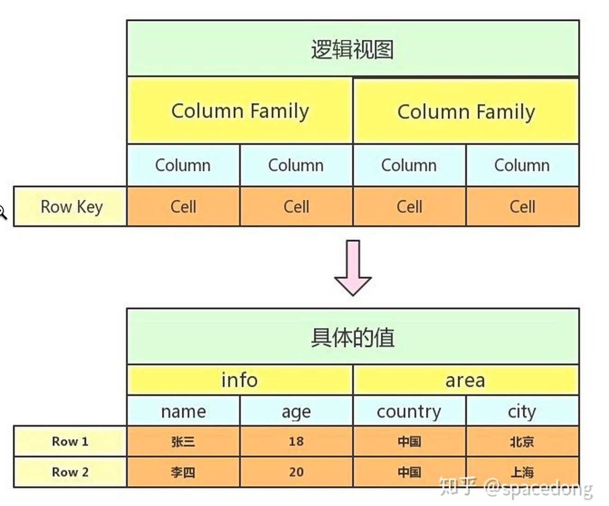
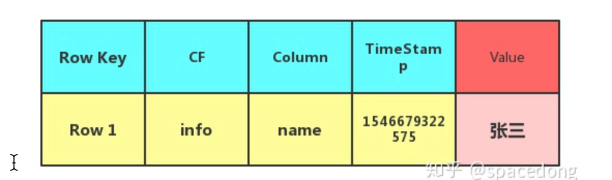
### Row Key
- 主键 不宜过长
- 扫描的方式
  - 基于row key的单行查询
  - 基于row key的范围查询
  - 全表扫描
### 列族ColumnFamily
- 列族下面可以包含任意多的列
- 官方的推荐最好是小于等于3
### 列：属于某一个列簇，在 HBase 中可以进行动态的添加
### Cell : 是指具体的 Value
### TimeStamp ：在这张图里面没有显示出来，这个是指版本号，用时间戳（TimeStamp ）来表示。
TimeStamp 是实现 Hbase 多版本的关键。在 Hbase 中使用不同的 timestame 来标识相同 rowkey 行对应的不通版本的数据。在写入数据的时候，如果用户没有指定对应的 timestamp，Hbase 会自动添加一个 timestamp，timestamp 和服务器时间保持一致。在
Hbase 中，相同 rowkey 的数据按照 timestamp 倒序排列。默认查询的是最新的版本，用户 可同指定 timestamp 的值来读取旧版本的数据。
## 架构
### 架构图
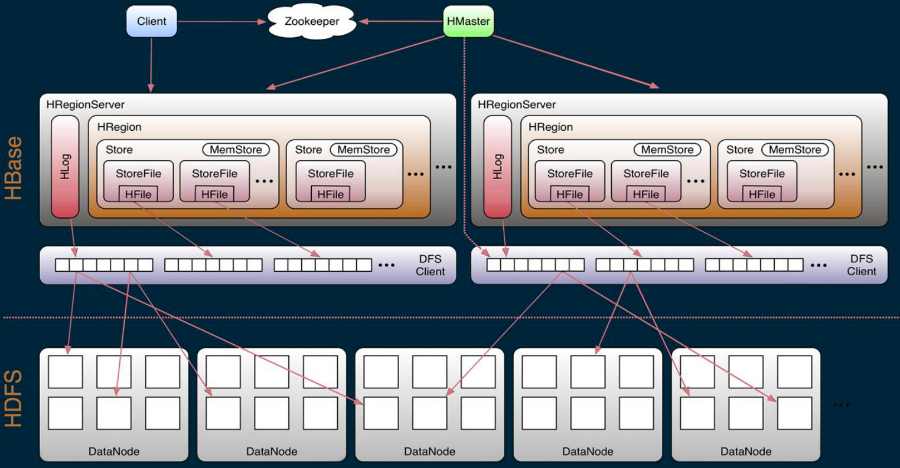

# HBase 架构组件
物理上，Hbase 是由三种类型的 server 组成的的主从式（master-slave）架构：

- Region Server 负责处理数据的读写请求，客户端请求数据时直接和 Region Server 交互。
- HBase Master 负责 Region 的分配，DDL（创建，删除 table）等操作。
- Zookeeper，作为 HDFS 的一部分，负责维护集群状态。

当然底层的存储都是基于 Hadoop HDFS 的：

- Hadoop DataNode 负责存储 Region Server 所管理的数据。所有的 HBase 数据都存储在 HDFS 文件中。Region Server 和 HDFS DataNode 往往是分布在一起的，这样 Region Server 就能够实现数据本地化（data locality，即将数据放在离需要者尽可能近的地方）。HBase 的数据在写的时候是本地的，但是当 region 被迁移的时候，数据就可能不再满足本地性了，直到完成 compaction，才能又恢复到本地。
- Hadoop NameNode 维护了所有 HDFS 物理 data block 的元信息。

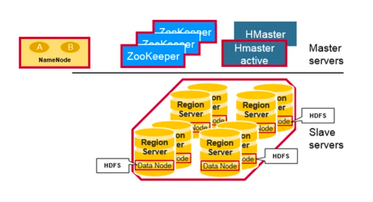

## Regions
HBase 表（Table）根据 rowkey 的范围被水平拆分成若干个 region。每个 region 都包含了这个region 的 start key 和 end key 之间的所有行（row）。Regions 被分配给集群中的某些节点来管理，即 Region Server，由它们来负责处理数据的读写请求。每个 Region Server 大约可以管理 1000 个 regions。

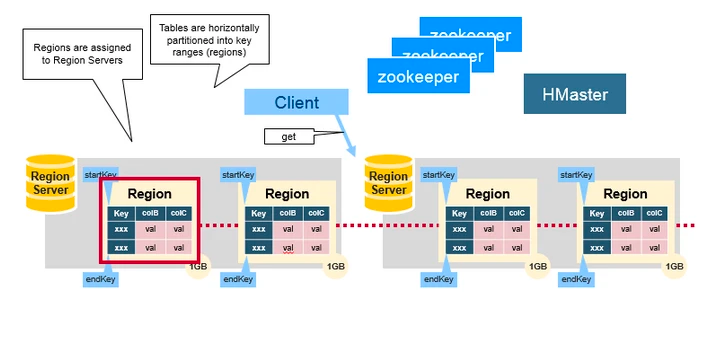

## HBase Master
也叫 HMaster，负责 Region 的分配，DDL（创建，删除表）等操作：

统筹协调所有 region server：

- 启动时分配 regions，在故障恢复和负载均衡时重分配 regions
- 监控集群中所有 Region Server 实例（从 Zookeeper 获取通知信息）

管理员功能：
- 提供创建，删除和更新 HBase Table 的接口

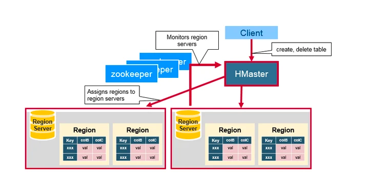

## Zookeeper
HBase 使用 Zookeeper 做分布式管理服务，来维护集群中所有服务的状态。Zookeeper 维护了哪些 servers 是健康可用的，并且在 server 故障时做出通知。Zookeeper 使用一致性协议来保证分布式状态的一致性。注意这需要三台或者五台机器来做一致性协议。

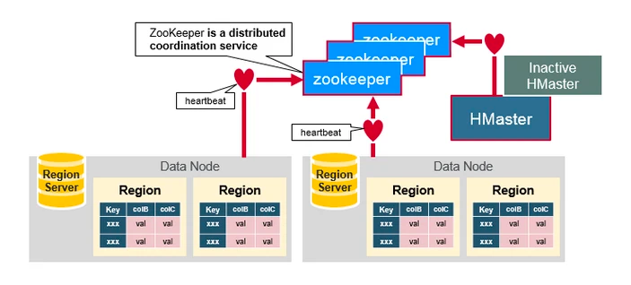

## 这些组件是如何一起工作的
Zookeeper 用来协调分布式系统中集群状态信息的共享。Region Servers 和 在线 HMaster（active HMaster）和 Zookeeper 保持会话（session）。Zookeeper 通过心跳检测来维护所有临时节点（ephemeral nodes）。

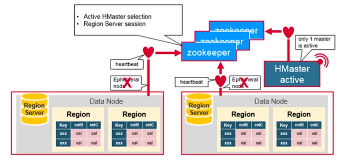

每个 Region Server 都会创建一个 ephemeral 节点。HMaster 会监控这些节点来发现可用的 Region Servers，同样它也会监控这些节点是否出现故障。

HMaster 们会竞争创建 ephemeral 节点，而 Zookeeper 决定谁是第一个作为在线 HMaster，保证线上只有一个 HMaster。在线 HMaster（active HMaster） 会给 Zookeeper 发送心跳，不在线的待机 HMaster （inactive HMaster） 会监听 active HMaster 可能出现的故障并随时准备上位。

如果有一个 Region Server 或者 HMaster 出现故障或各种原因导致发送心跳失败，它们与 Zookeeper 的 session 就会过期，这个 ephemeral 节点就会被删除下线，监听者们就会收到这个消息。Active HMaster 监听的是 region servers 下线的消息，然后会恢复故障的 region server 以及它所负责的 region 数据。而 Inactive HMaster 关心的则是 active HMaster 下线的消息，然后竞争上线变成 active HMaster。

（点评：这一段非常重要，涉及到分布式系统设计中的一些核心概念，包括集群状态、一致性等。可以看到 Zookeeper 是沟通一切的桥梁，所有的参与者都和 Zookeeper 保持心跳会话，并从 Zookeeper 获取它们需要的集群状态信息，来管理其它节点，转换角色，这也是分布式系统设计中很重要的思想，由专门的服务来维护分布式集群状态信息。）

## 第一次读和写操作
有一个特殊的 HBase Catalog 表叫 Meta table（它其实是一张特殊的 HBase 表），包含了集群中所有 regions 的位置信息。Zookeeper 保存了这个 Meta table 的位置。

当 HBase 第一次读或者写操作到来时：

- 客户端从 Zookeeper 那里获取是哪一台 Region Server 负责管理 Meta table。
- 客户端会查询那台管理 Meta table 的 Region Server，进而获知是哪一台 Region Server 负责管理本次数据请求所需要的 rowkey。客户端会缓存这个信息，以及 Meta table 的位置信息本身。
- 然后客户端回去访问那台 Region Server，获取数据。

对于以后的的读请求，客户端从可以缓存中直接获取 Meta table 的位置信息（在哪一台 Region Server 上），以及之前访问过的 rowkey 的位置信息（哪一台 Region Server 上），除非因为 Region 被迁移了导致缓存失效。这时客户端会重复上面的步骤，重新获取相关位置信息并更新缓存。

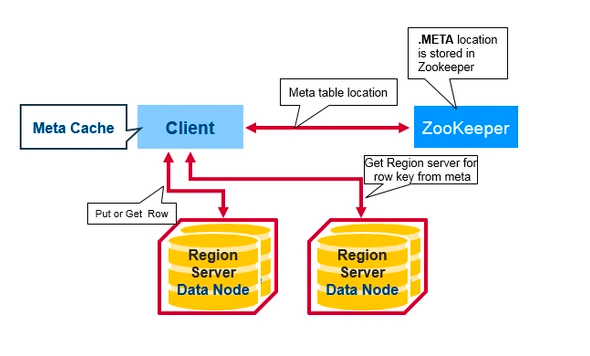

（点评：客户端读写数据，实际上分了两步：第一步是定位，从 Meta table 获取 rowkey 属于哪个 Region Server 管理；第二步再去相应的 Region Server 读写数据。这里涉及到了两个 Region Server，要理解它们各自的角色功能。关于 Meta table 下面会详细介绍。）

## HBase Meta Table

Meta table 是一个特殊的 HBase table，它保存了系统中所有的 region 列表。这张 table 类似一个 b-tree，结构大致如下：

- Key：table, region start key, region id
- Value：region server

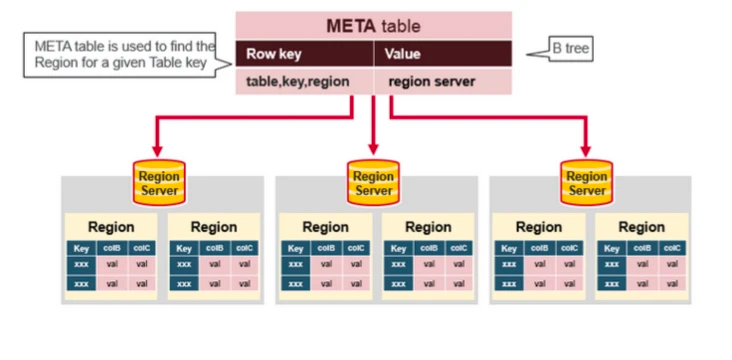

## Region Server 组成
Region Server 运行在 HDFS DataNode 上，由以下组件组成：

- `WAL`：Write Ahead Log 是分布式文件系统上的一个文件，用于存储新的还未被持久化存储的数据，它被用来做故障恢复。
- `BlockCache`：这是读缓存，在内存中存储了最常访问的数据，是 LRU（Least Recently Used）缓存。
- `MemStore`：这是写缓存，在内存中存储了新的还未被持久化到硬盘的数据。当被写入硬盘时，数据会首先被排序。注意每个 Region 的每个 Column Family 都会有一个 MemStore。
- `HFile` 在硬盘上（HDFS）存储 HBase 数据，以有序 KeyValue 的形式。

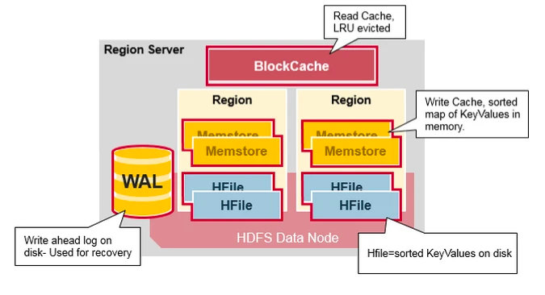

（点评：这一段是重中之重，理解 Region Server 的组成对理解 HBase 的架构至关重要，要充分认识 Region Server 的功能，以及每个组件的作用，这些组件的行为和功能在后续的段落中都会一一展开。）

## HBase 写数据步骤
当客户端发起一个写数据请求（Put 操作），第一步首先是将数据写入到 WAL 中：

- 新数据会被追加到 WAL 文件尾部。
- WAL 用来在故障恢复时恢复还未被持久化的数据。

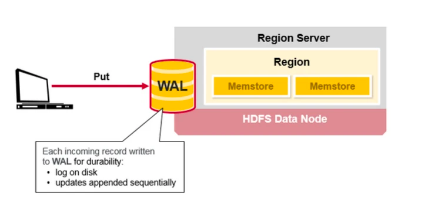

数据被写入 WAL 后，会被加入到 MemStore 即写缓存。然后服务端就可以向客户端返回 ack 表示写数据完成。

（点评：注意数据写入时 WAL 和 MemStore 更新的顺序，不能调换，必须先 WAL 再 MemStore。如果反过来，先更新完 MemStore，此时 Region Server 发生 crash，内存中的更新就丢失了，而此时数据还未被持久化到 WAL，就无法恢复了。理论上 WAL 就是 MemStore 中数据的一个镜像，应该保持一致，除非发生系统 crash。另外注意更新 WAL 是在文件尾部追加的方式，这种磁盘操作性能很高，不会太影响请求的整体响应时间。）

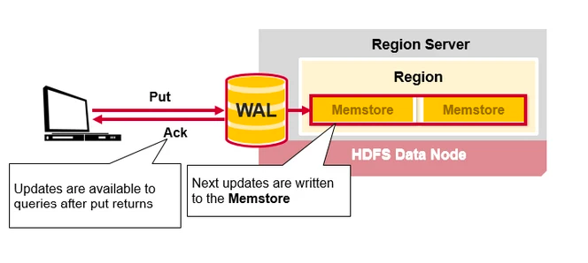

## HBase MemStore
MemStore 在内存中缓存 HBase 的数据更新，以有序 KeyValues 的形式，这和 HFile 中的存储形式一样。每个 Column Family 都有一个 MemStore，所有的更新都以 Column Family 为单位进行排序。

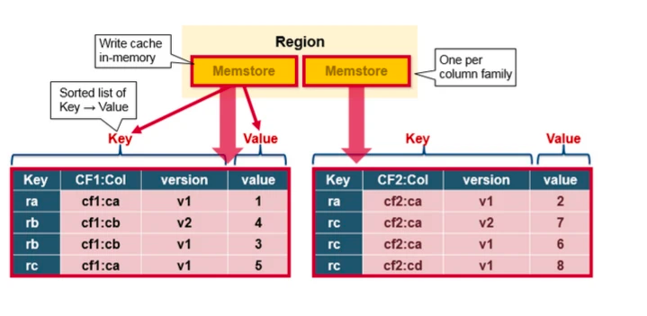

## HBase Region Flush
MemStore 中累积了足够多的的数据后，整个有序数据集就会被写入一个新的 HFile 文件到 HDFS 上。HBase 为每个 Column Family 都创建一个 HFile，里面存储了具体的 Cell，也即 KeyValue 数据。随着时间推移，HFile 会不断产生，因为 KeyValue 会不断地从 MemStore 中被刷写到硬盘上。

注意这也是为什么 HBase 要限制 Column Family 数量的一个原因。每个 Column Family 都有一个 MemStore；如果一个 MemStore 满了，所有的 MemStore 都会被刷写到硬盘。同时它也会记录最后写入的数据的最大序列号（sequence number），这样系统就能知道目前为止哪些数据已经被持久化了。

最大序列号是一个 meta 信息，被存储在每个 HFile 中，来表示持久化进行到哪条数据了，应该从哪里继续。当 region 启动时，这些序列号会被读取，取其中最大的一个，作为基础序列号，后面的新的数据更新就会在该值的基础上递增产生新的序列号。

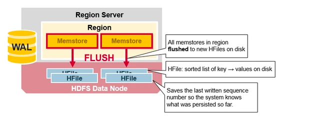

（点评：这里有个序列号的概念，每次 HBase 数据更新都会绑定一个新的自增序列号。而每个 HFile 则会存储它所保存的数据的最大序列号，这个元信息非常重要，它相当于一个 commit point，告诉我们在这个序列号之前的数据已经被持久化到硬盘了。它不仅在 region 启动时会被用到，在故障恢复时，也能告诉我们应该从 WAL 的什么位置开始回放数据的历史更新记录。）

## HBase HFile
数据存储在 HFile 中，以 Key/Value 形式。当 MemStore 累积了足够多的数据后，整个有序数据集就会被写入一个新的 HFile 文件到 HDFS 上。整个过程是一个顺序写的操作，速度非常快，因为它不需要移动磁盘头。（注意 HDFS 不支持随机修改文件操作，但支持 append 操作。）

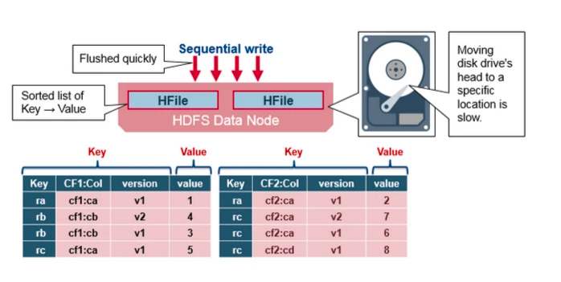

### HBase HFile 文件结构
HFile 使用多层索引来查询数据而不必读取整个文件，这种多层索引类似于一个 B+ tree：

- KeyValues 有序存储。
- rowkey 指向 index，而 index 则指向了具体的 data block，以 64 KB 为单位。
- 每个 block 都有它的叶索引。
- 每个 block 的最后一个 key 都被存储在中间层索引。
- 索引根节点指向中间层索引。

trailer 指向原信息数据块，它是在数据持久化为 HFile 时被写在 HFile 文件尾部。trailer 还包含例如布隆过滤器和时间范围等信息。布隆过滤器用来跳过那些不包含指定 rowkey 的文件，时间范围信息则是根据时间来过滤，跳过那些不在请求的时间范围之内的文件。
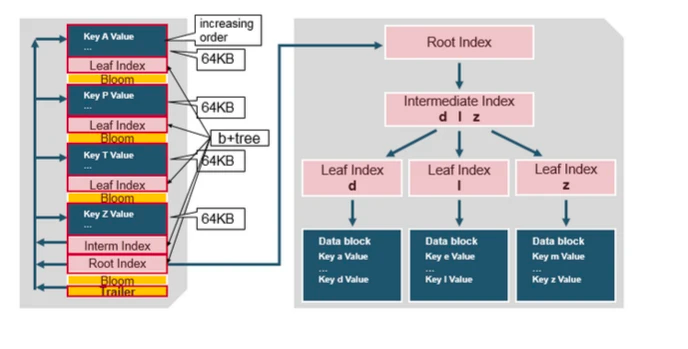

### HFile 索引
刚才讨论的索引，在 HFile 被打开时会被载入内存，这样数据查询只要一次硬盘查询。

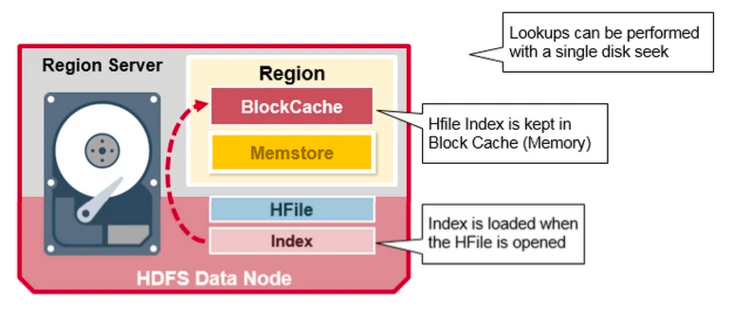

## HBase Read 合并
我们已经发现，每行（row）的 KeyValue cells 可能位于不同的地方，这些 cell 可能被写入了 HFile，可能是最近刚更新的，还在 MemStore 中，也可能最近刚读过，缓存在 Block Cache 中。所以，当你读一行 row 时，系统怎么将对应的 cells 返回呢？一次 read 操作会将 Block Cache，MemStore 和 HFile 中的 cell 进行合并：

- 首先 scanner 从 Block Cache 读取 cells。最近读取的 KeyValue 都被缓存在这里，这是 一个 LRU 缓存。
- 然后 scanner 读取 MemStore，即写缓存，包含了最近更新的数据。
- 如果 scanner 没有在 BlockCache 和 MemStore 都没找到对应的 cells，则 HBase 会使用 Block Cache 中的索引和布隆过滤器来加载对应的 HFile 到内存，查找到请求的 row cells。

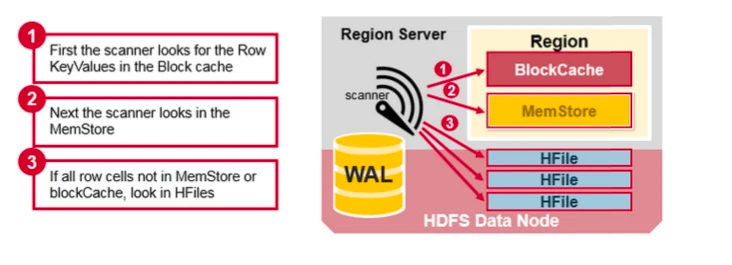

之前讨论过，每个 MemStore 可能会有多个 HFile，所以一次 read 请求可能需要多读个文件，这可能会影响性能，这被称为读放大（read amplification）。

（点评：从时间轴上看，一个个的 HFile 也是有序的，本质上它们保存了每个 region 的每个 column family 的数据历史更新。所以对于同一个 rowkey 的同一个 cell，它可能也有多个版本的数据分布在不同的 HFile 中，所以可能需要读取多个 HFiles，这样性能开销会比较大，尤其是当不满足 data locality 时这种 read amplification 情况会更加严重。这也是后面会讲到的 compaction 必要的原因）

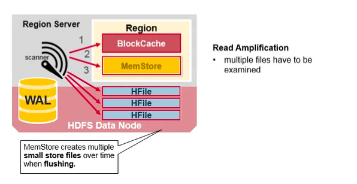

## HBase Minor Compaction

HBase 会自动合并一些小的 HFile，重写成少量更大的 HFiles。这个过程被称为 minor compaction。它使用归并排序算法，将小文件合并成大文件，有效减少 HFile 的数量。

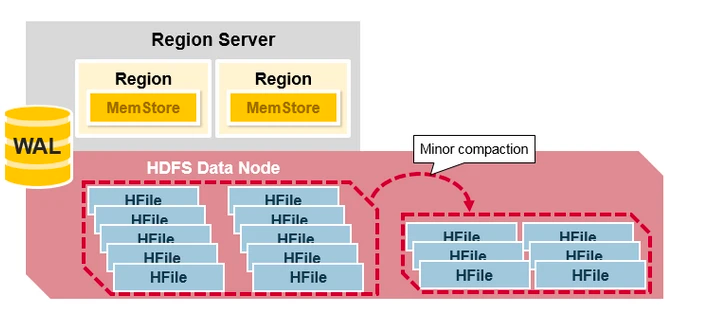

## HBase Major Compaction
Major Compaction 合并重写每个 Column Family 下的所有的 HFiles，成为一个单独的大 HFile，在这个过程中，被删除的和过期的 cell 会被真正从物理上删除，这能提高读的性能。但是因为 major compaction 会重写所有的 HFile，会产生大量的硬盘 I/O 和网络开销。这被称为写放大（Write Amplification）。

Major compaction 可以被设定为自动调度。因为存在 write amplification 的问题，major compaction 一般都安排在周末和半夜。MapR 数据库对此做出了改进，并不需要做 compaction。Major compaction 还能将因为服务器 crash 或者负载均衡导致的数据迁移重新移回到离 Region Server 的地方，这样就能恢复 data locality。

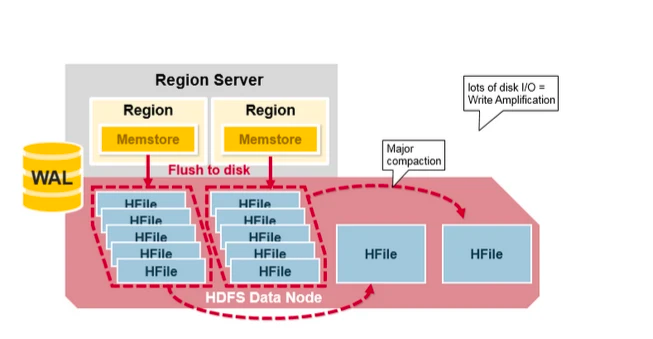

## Region = Contiguous Keys
我们再来回顾一下 region 的概念：

- HBase Table 被水平切分成一个或数个 regions。每个 region 包含了连续的，有序的一段 rows，以 start key 和 end key 为边界。
- 每个 region 的默认大小为 1GB。
- region 里的数据由 Region Server 负责读写，和 client 交互。
- 每个 Region Server 可以管理约 1000 个 regions（它们可能来自一张表或者多张表）。

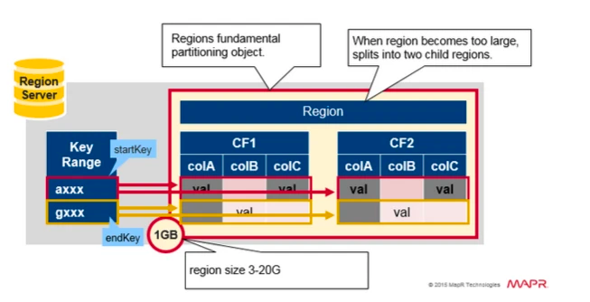

## Region 分裂
一开始每个 table 默认只有一个 region。当一个 region 逐渐变得很大时，它会分裂（split）成两个子 region，每个子 region 都包含了原来 region 一半的数据，这两个子 region 并行地在原来这个 region server 上创建，这个分裂动作会被报告给 HMaster。处于负载均衡的目的，HMaster 可能会将新的 region 迁移给其它 region server。

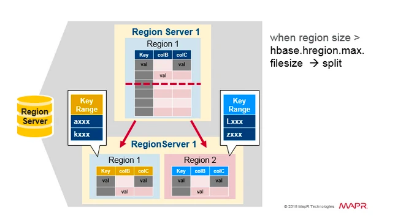

## Region 负载均衡
Splitting 一开始是发生在同一台 region server 上的，但是出于负载均衡的原因，HMaster 可能会将新的 regions 迁移给其它 region server，这会导致那些 region server 需要访问离它比较远的 HDFS 数据，直到 major compaction 的到来，它会将那些远方的数据重新移回到离 region server 节点附近的地方。

（点评：注意这里的迁移的概念，只是逻辑上的迁移，即将某个 region 交给另一个 region server 管理。）

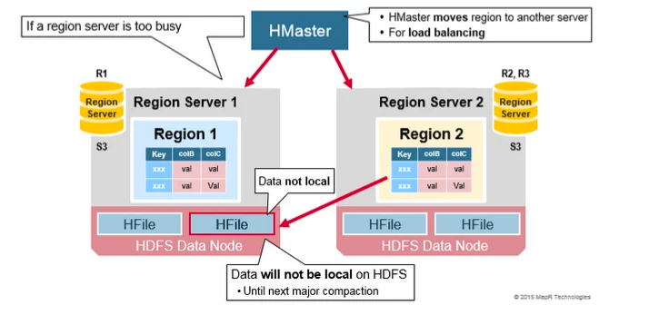

## HDFS 数据备份
所有的读写都发生在 HDFS 的主 DataNode 节点上。 HDFS 会自动备份 WAL 和 HFile 的文件 blocks。HBase 依赖于 HDFS 来保证数据完整安全。当数据被写入 HDFS 时，一份会写入本地节点，另外两个备份会被写入其它节点。

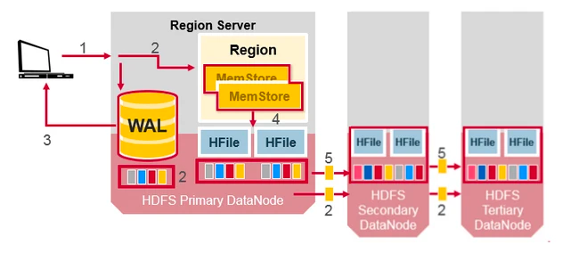

WAL 和 HFiles 都会持久化到硬盘并备份。那么 HBase 是怎么恢复 MemStore 中还未被持久化到 HFile 的数据呢？下面的章节会讨论这个问题。

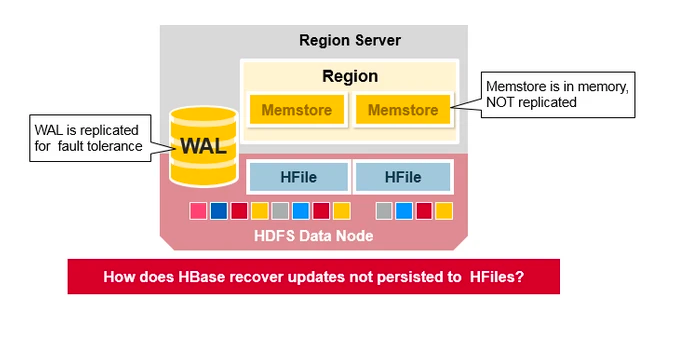

## HBase 故障恢复
当某个 Region Server 发生 crash 时，它所管理的 region 就无法被访问了，直到 crash 被检测到，然后故障恢复完成，这些 region 才能恢复访问。Zookeeper 依靠心跳检测发现节点故障，然后 HMaster 会收到 region server 故障的通知。

当 HMaster 发现某个 region server 故障，HMaster 会将这个 region server 所管理的 regions 分配给其它健康的 region servers。为了恢复故障的 region server 的 MemStore 中还未被持久化到 HFile 的数据，HMaster 会将 WAL 分割成几个文件，将它们保存在新的 region server 上。每个 region server 然后回放各自拿到的 WAL 碎片中的数据，来为它所分配到的新 region 建立 MemStore。

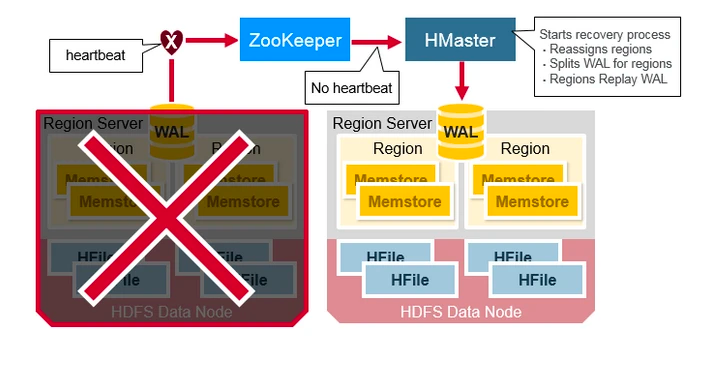

WAL 包含了一系列的修改操作，每个修改都表示一个 put 或者 delete 操作。这些修改按照时间顺序依次写入，持久化时它们被依次写入 WAL 文件的尾部。

当数据仍然在 MemStore 还未被持久化到 HFile 怎么办呢？WAL 文件会被回放。操作的方法是读取 WAL 文件，排序并添加所有的修改记录到 MemStore，最后 MemStore 会被刷写到 HFile。

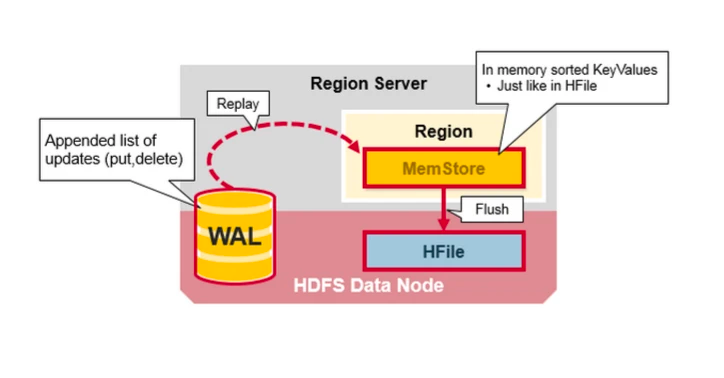

（点评：故障恢复是 HBase 可靠性保障的一个重要特性。WAL 在这里扮演了关键角色，在分割 WAL 时，数据会根据 region 分配到对应的新的 region server 上，然后 region server 负责回放这一部分数据到 MemStore 中。）

# Apache HBase 架构的优缺点

## 优点

强一致性：

- 当 write 返回时，所有的 reader 都会读到同样的值。
  
自动扩展性

- 数据变大时 region 会分裂。
- 使用 HDFS 存储备份数据。

内置恢复功能

- 使用 Write Ahead Log （类似于文件系统中的日志）

与 Hadoop 结合：

- 使用 MapReduce 处理 HBase 数据会非常直观。

## 缺点
Apache HBase 也有问题

业务持续可靠性：

- WAL 回放很慢。
- 故障恢复很慢。
- Major Compaction 时候 I/O 会飙升。
# 参考文章
- https://segmentfault.com/a/1190000019959411