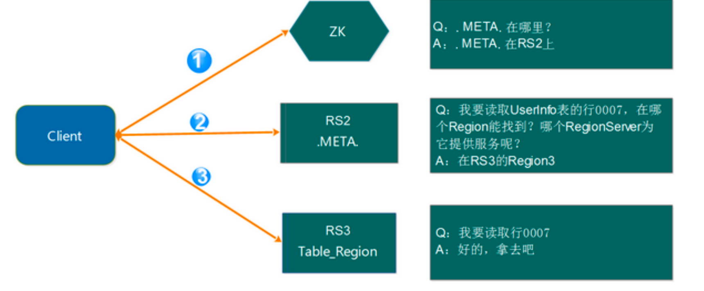
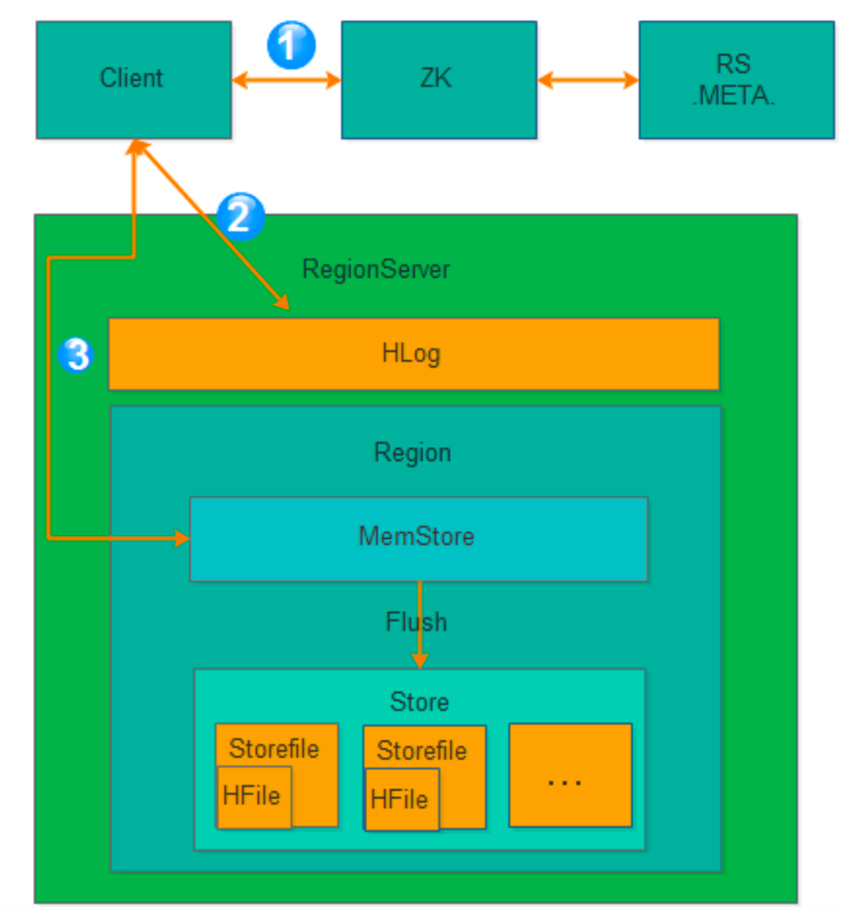

* [HBASE](#hbase)
    * [什么是？](#什么是)
    * [列式存储](#列式存储)
        * [储存图](#储存图)
        * [Rowkey](#rowkey)
        * [列族ColumnFamily](#列族columnfamily)
        * [列：属于某一个列簇，在 HBase 中可以进行动态的添加](#列属于某一个列簇在-hbase-中可以进行动态的添加)
        * [Cell : 是指具体的 Value](#cell--是指具体的-value)
        * [TimeStamp ：在这张图里面没有显示出来，这个是指版本号，用时间戳（TimeStamp ）来表示。](#timestamp-在这张图里面没有显示出来这个是指版本号用时间戳timestamp-来表示)
    * [架构](#架构)
        * [架构图](#架构图)
        * [Client](#client)
        * [Zookeeper](#zookeeper)
        * [Hmaster](#hmaster)
        * [HRegionServer](#hregionserver)
            * [HregionServer 直接对接用户的读写请求，是真正的“干活”的节点](#hregionserver-直接对接用户的读写请求是真正的干活的节点)
            * [负责切分正在运行过程中变得过大的HRegion](#负责切分正在运行过程中变得过大的hregion)
            * [负责 Storefile 的合并工作](#负责-storefile-的合并工作)
            * [HRegion](#hregion)
            * [HLog（WAL log）](#hlogwal-log)
    * [Region 寻址方式](#region-寻址方式)
    * [Hbase 的写逻辑](#hbase-的写逻辑)
# HBASE
## 什么是？
Hbase 是分布式、面向列的开源数据库（其实准确的说是面向列族）。HDFS 为 Hbase 提供可靠的底层数据存储服务，MapReduce 为 Hbase 提供高性能的计算能力，Zookeeper 为 Hbase 提供稳定服务和 Failover 机制，因此我们说 Hbase 是一个通过大量廉价的机器解决海量数据的高速存储和读取的分布式数据库解决方案。
## 列式存储
### 储存图

### Rowkey
- 主键 不宜过长
- 扫描的方式
  - 基于rowkey的单行查询
  - 基于rowkey的范围查询
  - 全表扫描
### 列族ColumnFamily
- 列族下面可以包含任意多的列
- 官方的推荐最好是小于等于3
### 列：属于某一个列簇，在 HBase 中可以进行动态的添加
### Cell : 是指具体的 Value
### TimeStamp ：在这张图里面没有显示出来，这个是指版本号，用时间戳（TimeStamp ）来表示。
TimeStamp 是实现 Hbase 多版本的关键。在 Hbase 中使用不同的 timestame 来标识相同 rowkey 行对应的不通版本的数据。在写入数据的时候，如果用户没有指定对应的 timestamp，Hbase 会自动添加一个 timestamp，timestamp 和服务器时间保持一致。在
Hbase 中，相同 rowkey 的数据按照 timestamp 倒序排列。默认查询的是最新的版本，用户 可同指定 timestamp 的值来读取旧版本的数据。
## 架构
### 架构图

### Client
Client 包含了访问 Hbase 的接口，另外 Client 还维护了对应的 cache 来加速 Hbase 的 访问，比如 cache 的.META.元数据的信息
### Zookeeper
Hbase 通过 Zookeeper 来做 master 的高可用、RegionServer 的监控、元数据的入口 以及集群配置的维护等工作
- 通过 Zoopkeeper 来保证集群中只有 1 个master 在运行，如果 master 异常，会通过竞争机制产生新的 master 提供服务
- 通过 Zoopkeeper 来监控 RegionServer 的状态，当 RegionSevrer 有异常的时候，通过回调的形式通知 Master RegionServer 上下限的信息
- 通过 Zoopkeeper 存储元数据的统一入口地址
### Hmaster
- 为 RegionServer 分配 Region
- 维护整个集群的负载均衡
- 维护集群的元数据信息发现失效的 Region，并将失效的 Region 分配到正常RegionServer 上当 RegionSever 失效的时候，协调对应 Hlog 的拆分
### HRegionServer
#### HregionServer 直接对接用户的读写请求，是真正的“干活”的节点
#### 负责切分正在运行过程中变得过大的HRegion
#### 负责 Storefile 的合并工作
#### HRegion
- 包含多个 HStore
  - Store
    - MemStore 是一块内存，如果超过阈值后就会进行刷盘，把内存里的数据刷进到 StoreFile
    - StoreFile HFile
  - 每个列族对应一个Store
  - 当HRegion的某个列簇达到一个阀值时就会分成两个新的HRegion。
#### HLog（WAL log）
WAL意为write ahead log，用来做灾难恢复使用，HLog记录数据的所有变更，一旦region server 宕机，就可以从log中进行恢复
## Region 寻址方式
- 第 1 步：Client 请求 ZK 获取.META.所在的 RegionServer 的地址。
- 第 2 步：Client 请求.META.所在的 RegionServer 获取访问数据所在的 RegionServer 地址，client 会将.META.的相关信息 cache 下来，以便下一次快速访问
  
- 第 3 步：Client 请求数据所在的 RegionServer，获取所需要的数据。
## Hbase 的写逻辑	
写入流程

- 第 1 步：Client 获取数据写入的 Region 所在的 RegionServer
- 第 2 步：请求写 Hlog, Hlog 存储在 HDFS，当 RegionServer 出现异常，需要使用 Hlog 来恢复数据。
- 第 3 步：请求写 MemStore,只有当写 Hlog 和写 MemStore 都成功了才算请求写入完成。 MemStore 后续会逐渐刷到 HDFS 中。