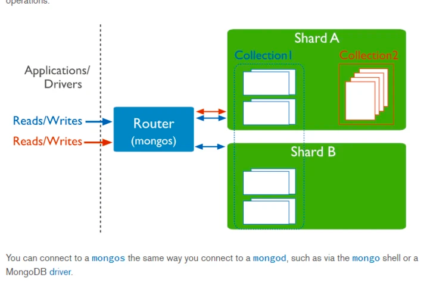
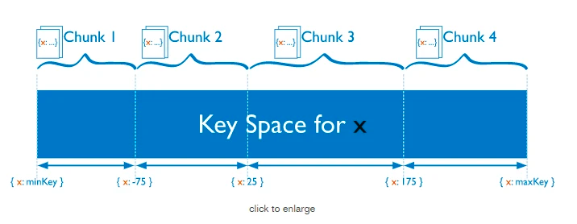
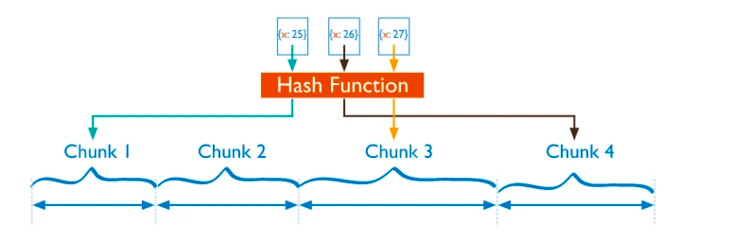
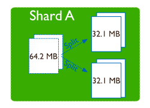
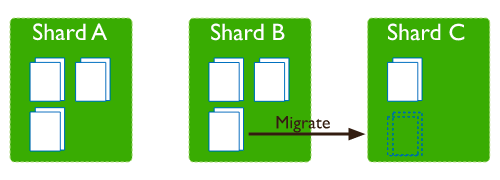

* [MongoDB](#mongodb)
* [特点](#特点)
* [关键组件](#关键组件)
    * [_id](#_id)
    * [集合](#集合)
    * [游标](#游标)
    * [数据库](#数据库)
    * [文档](#文档)
    * [字段](#字段)
* [单机mongo架构](#单机mongo架构)
* [集群模式1-MongoDB 复制（副本集）Replica set(主从关系)](#集群模式1-mongodb-复制副本集replica-set主从关系)
    * [什么是](#什么是)
    * [复制结构图](#复制结构图)
    * [复制原理](#复制原理)
* [集群模式2-MongoDB 分片](#集群模式2-mongodb-分片)
    * [什么是](#什么是-1)
    * [分片集群结构](#分片集群结构)
    * [三个主要组件](#三个主要组件)
        * [Routers mongos](#routers-mongos)
        * [Config Server](#config-server)
        * [Shard](#shard)
    * [Shard Keys 分片键](#shard-keys-分片键)
        * [关于collection（类似mysql中的table）分片](#关于collection类似mysql中的table分片)
            * [按范围（range） 切分chunk](#按范围range-切分chunk)
            * [按hash 切分chunk](#按hash-切分chunk)
    * [Chunks 块](#chunks-块)
        * [块大小](#块大小)
        * [块拆分](#块拆分)
        * [块迁移](#块迁移)
        * [块平衡](#块平衡)
        * [不可分割/巨型块](#不可分割巨型块)
* [WiredTiger存储引擎](#wiredtiger存储引擎)
    * [文档级别的并发 Document Level Concurrency](#文档级别的并发-document-level-concurrency)
    * [快照与检查点 Snapshots and Checkpoints](#快照与检查点-snapshots-and-checkpoints)
    * [日志 Journal](#日志-journal)
    * [压缩 Compression](#压缩-compression)
    * [内存使用](#内存使用)
* [参考文档](#参考文档)

# MongoDB
MongoDB 是由 C++语言编写的，是一个基于分布式文件存储的开源数据库系统。 再高负载的情况下，添加更多的节点，可以保证服务器性能。 MongoDB 旨在给 WEB 应用提供可扩展的高性能数据存储解决方案。MongoDB 将数据存储为一个文档，数据结构由键值(key=>value)对组成。 MongoDB 文档类似于 JSON 对象。字段值可以包含其他文档，数组及文档数组。
# 特点
- 面向文档的数据库
- 非关系型数据库
# 关键组件
## _id
- 文档的主键，如果没有指定则会自动创建

- ObjectId(_id)
  
  - 时间+机器ID+进程ID+计数器
  - 最重要的是开头的四个字节的时间信息，为Unix时间戳。后面三个字节是机器ID,两个字节的进程ID，三个字节的计数器。计数器会自动增长，可以保证同一进程、同一时刻内不会重复。
## 集合
- collection
- 等同于表
## 游标
指向查询结果集的指针，可以遍历游标检索结果
## 数据库
## 文档
集合中的记录称为文档
## 字段
kv键值对

# 单机mongo架构

- client 客户端发请求
- mongodb query language 查询解析层
- mongodb data model 抽象存储层
- storage engine 存储引擎层（类似MySQL，储存引擎是插拔式的，可选多种）
  - wired tiger 目前主流默认
  - MMAPV1
  - In Memory
- 基于journaling log做宕机恢复（类比mysql的redo log）：写数据之前顺序追加先写磁盘log，然后到内存，然后将定期将内存写入到磁盘中去，如果在内存写入到磁盘过程中挂掉了，会通过journaling log将数据恢复。由此可见不是准实时写入，但是可以达到高吞吐。

# 集群模式1-MongoDB 复制（副本集）Replica set(主从关系)
## 什么是
- MongoDB复制是将数据同步在多个服务器的过程。
- 复制提供了数据的冗余备份，并在多个服务器上存储数据副本，提高了数据的可用性， 并可以保证数据的安全性。
- 复制还允许您从硬件故障和服务中断中恢复数据。
## 复制结构图

## 复制原理
- mongodb的复制至少需要两个节点。其中一个是主节点，负责处理客户端请求，其余的都是从节点，负责复制主节点上的数据。
- mongodb各个节点常见的搭配方式为：一主一从、一主多从。
- 主节点记录在其上的所有操作oplog，从节点定期轮询主节点获取这些操作，然后对自己的数据副本执行这些操作，从而保证从节点的数据与主节点一致。
- 主宕机后，replica set中会重新选举。客户端就会写到新的primary上。
- 如果RS中有一半机器上宕机的，将无法写入，只能读。

# 集群模式2-MongoDB 分片	
## 什么是
- 在Mongodb里面存在另一种集群，就是分片技术,可以满足MongoDB数据量大量增长的需求。
- 当MongoDB存储海量的数据时，一台机器可能不足以存储数据，也可能不足以提供可接受的读写吞吐量。这时，我们就可以通过在多台机器上分割数据，使得数据库系统能存储和处理更多的数据。
## 分片集群结构

## 三个主要组件
### Routers mongos
客户端请求会通过mongos router（也可以是多个router，可以理解为网关代理），通过路由层可以把数据路由到具体的shard上，在这个过程中会存储许多的元信息 meta，简单理解元信息就是索引，存储的是哪个key存在了哪个shard上。同时元信息服务器【config servers】本身也是个replica set，本身也是主从复制的，提供高可用。
### Config Server
- mongod实例，存储了整个 ClusterMetadata，其中包括 chunk信息
- 配置服务器上存储了分片集群的元数据
- 配置服务器上存储集群元数据在config数据库中，mongo实例缓存这些数据并通过它们选择到各个shard的访问路径

### Shard
用于存储实际的数据块，实际生产环境中一个shard server角色可由几台机器组个一个replica set承担，防止主机单点故障

## Shard Keys 分片键
MongoDB 使用分片键在分片之间分发集合的文档。分片键由文档中的一个或多个字段组成。

###  关于collection（类似mysql中的table）分片
当查询某个collection数据的时候，router（mongos）会路由到具体的shard（Replication set）中，根据shard规则可能数据都在一个shard中，也可能存在多个。

collection会自动分层多个chunk，如下图collection1的白色的框框，每个chunk会被自动负载均衡到不同的shard（Replication set），即实际保证的是chunk在不同shard的高可用（根据设置的副本的数量），另外类似于redis的tag方法，mongodb支持zones方法

###关于collection的切分规则
#### 按范围（range） 切分chunk
类比mysql的按照id分，比如前1w个id放入a1,2w内的放在a2..

问题：字段如果是时间等类似相近的分类字段，会存在写入热点问题，会存在chunk集中存在某个shard上。

注意：key应该为建立索引Single Field，联合索引Compound Index也可以。chunk默认为64MB，超过64MB的被分割。

所有的chunk收尾相连就可以构成整个collection表
#### 按hash 切分chunk

问题：无法规避hash冲突问题，即无法彻底规避热点问题

注意：key必须为hash索引（key不允许设置唯一索引属性，也达不到唯一Unique Indexes），这样才能得到int整型去模预先配置的chunk（数据量大于默认chunk大小）或者聚合（优化）的时候影响写入性能。

## Chunks 块
MongoDB 将分片数据分成块。每个块都有一个基于shard key的包含的下限和排他的上限范围 。
### 块大小
MongoDB 中的默认块大小为 64 兆字节。您可以 增加或减少块大小。
- 小块以更频繁的迁移为代价导致更均匀的数据分布。这会使查询路由 ( mongos) 层代价更多
- 大块导致更少的迁移。从网络角度和查询路由层的内部开销来看，这都更有效。但是，这些效率是以数据潜在的不均匀分布为代价的。

对于许多部署，以牺牲稍微不那么均匀分布的数据集为代价来避免频繁和潜在的虚假迁移是有意义的

### 块拆分
拆分是一个防止块变得太大的过程。当块增长超过指定的块大小时，或者如果块中的文档数量超过每个块要迁移的最大文档数，MongoDB 会根据块表示的分片键值拆分块。一个块可以在必要时分成多个块。插入和更新可能会触发拆分。拆分是一种有效的元数据更改。要创建拆分，MongoDB的确实不迁移任何数据或影响的碎片。

拆分可能会导致分片中集合的块分布不均匀。在这种情况下，平衡器会在分片之间重新分配块

### 块迁移
MongoDB 迁移分片集群中的块，以在分片之间均匀分布分片集合的块。迁移可能是：
- 手动的。仅在有限的情况下使用手动迁移，例如在批量插入期间分发数据。有关更多详细信息，请参阅手动迁移块。
- 自动的。当分片集合的块在分片之间分布不均匀时，平衡器进程会自动迁移块。有关更多详细信息，请参阅迁移阈值。

### 块平衡
该平衡器是管理数据块迁移的后台进程。如果最大和最小分片之间的块数差异超过 迁移阈值，则平衡器开始跨集群迁移块以确保数据的均匀分布。

### 不可分割/巨型块
在某些情况下，块可以增长到超过指定的块大小，但不能进行拆分。最常见的情况是当一个块表示单个分片键值时。由于块无法拆分，它会继续增长超过块大小，成为巨型块。随着这些巨型块的不断增长，它们可能会成为性能瓶颈，尤其是在分片键值出现频率很高的情况下

# WiredTiger存储引擎
MongoDB默认的储存引擎可适用于大多数场景
## 文档级别的并发 Document Level Concurrency
WiredTiger使用文档级并发控制进行写操作。因此，多个客户端可以并发同时修改集合的不同文档。

对于大多数读写操作，WiredTiger使用乐观并发控制模式。WiredTiger仅在全局、数据库和集合级别使用意向锁。当存储引擎检测到两个操作之间存在冲突时，将引发写冲突，从而导致MongoDB自动重试该操作。

一些全局操作（通常是涉及多个数据库的短暂操作）仍然需要全局“实例范围级别的”锁。其他一些操作（例如删除集合）仍然需要独占数据库锁。
## 快照与检查点 Snapshots and Checkpoints
WiredTiger使用MultiVersion并发控制（MVCC）方式。在操作开始时，WiredTiger为操作提供数据的时间点快照。快照提供了内存数据的一致视图。

写入磁盘时，WiredTiger将所有数据文件中的快照中的所有数据以一致的方式写入磁盘。现在持久的数据充当数据文件中的检查点。该检查点可确保数据文件直到最后一个检查点（包括最后一个检查点）都保持一致；即检查点可以充当恢复点。

从3.6版本开始，MongoDB配置WiredTiger以60秒的间隔创建检查点（即将快照数据写入磁盘）。在早期版本中，MongoDB将检查点设置为在WiredTiger中以60秒的间隔或在写入2GB日志数据时对用户数据进行检查，以先到者为准。

在写入新检查点期间，先前的检查点仍然有效。这样，即使MongoDB在写入新检查点时终止或遇到错误，重启后，MongoDB仍可从上一个有效检查点恢复。

当WiredTiger的元数据表被原子更新以引用新的检查点时，新的检查点将变为可访问且永久的。一旦可以访问新的检查点，WiredTiger就会从旧的检查点释放页面。

使用WiredTiger，即使没有日志，MongoDB也可以从最后一个检查点恢复；但是，要恢复上一个检查点之后所做的更改，请运行日志功能。

- 从MongoDB 4.0开始，您不能指定–nojournal选项或storage.journal.enabled：使用WiredTiger存储引擎的副本集成员为false。
## 日志 Journal

WiredTiger将预写日志（即日志）与检查点结合使用以确保数据持久性。

WiredTiger日志保留检查点之间的所有数据修改。如果MongoDB在检查点之间退出，它将使用日志重播自上一个检查点以来修改的所有数据。有关MongoDB将日志数据写入磁盘的频率的信息，具体请参阅日志处理。

WiredTiger日志使用快速压缩库进行压缩。要指定其他压缩算法或不进行压缩，请使用storage.wiredTiger.engineConfig.journalCompressor设置参数。有关更改日志压缩器的详细信息，请参阅“更改WiredTiger日志压缩器”文档。

如果日志记录小于或等于128字节（WiredTiger的最小日志记录大小），则WiredTiger不会压缩该记录。

您可以通过将storage.journal.enabled设置为false来禁用独立实例的日志记录，这可以减少维护日志记录的开销。对于独立实例，不使用日志意味着MongoDB意外退出时，您将丢失最后一个检查点之前的所有数据修改信息。

## 压缩 Compression

使用WiredTiger，MongoDB支持对所有集合和索引进行压缩。压缩可最大程度地减少存储空间的使用量，但会增加CPU的开销。

默认情况下，WiredTiger对所有集合使用块压缩和snappy压缩库，对所有索引使用前缀压缩。

对于集合，还提供以下块压缩库：
- zlib
- zstd（从MongoDB 4.2开始支持）

要指定替代压缩算法或不压缩，请使用storage.wiredTiger.collectionConfig.blockCompressor参数设置。

对于索引，要禁用前缀压缩，请使用storage.wiredTiger.indexConfig.prefixCompression设置。

压缩设置还可以在集合和索引创建期间基于每个集合和每个索引进行配置。请参见指定存储引擎选项和db.collection.createIndex（）storageEngine选项。

对于大多数压缩工作负载，默认压缩设置可以平衡存储效率和处理要求。

默认情况下，WiredTiger日志也被压缩。有关日志压缩的信息，请参阅日志。
## 内存使用
通过WiredTiger，MongoDB可以利用WiredTiger内部缓存和文件系统缓存。

从MongoDB 3.4开始，默认的WiredTiger内部缓存大小是以下两者中的较大者：
- 50％（RAM-1 GB）或256 MB。
- 例如，在总共有4GB RAM的系统上，WiredTiger缓存将使用1.5GB RAM（0.5 *（4 GB-1 GB）= 1.5 GB）。相反，总内存为1.25 GB的系统将为WiredTiger缓存分配256 MB，因为这是总RAM的一半以上减去一GB（0.5 *（1.25 GB-1 GB）= 128 MB <256 MB） 。

通过文件系统缓存，MongoDB 自动使用 WiredTiger 缓存或其他进程未使用的所有空闲内存。
# 参考文档
- https://juejin.cn/post/6844904186300071943
- https://segmentfault.com/a/1190000022271347
- https://docs.mongodb.com/manual/core/wiredtiger/