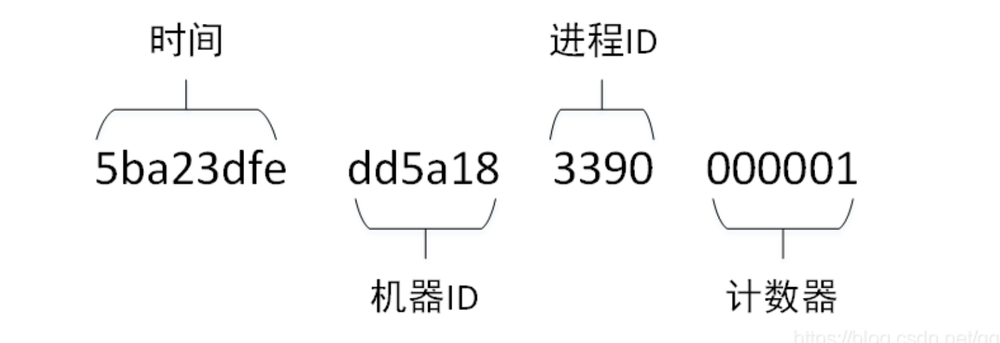
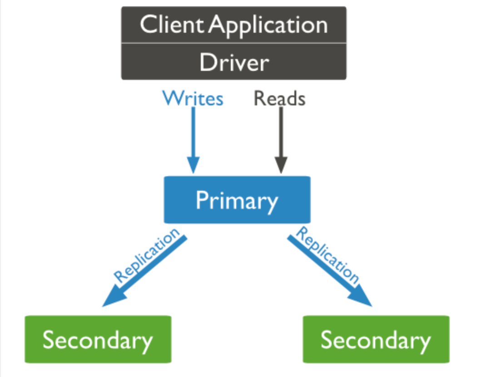
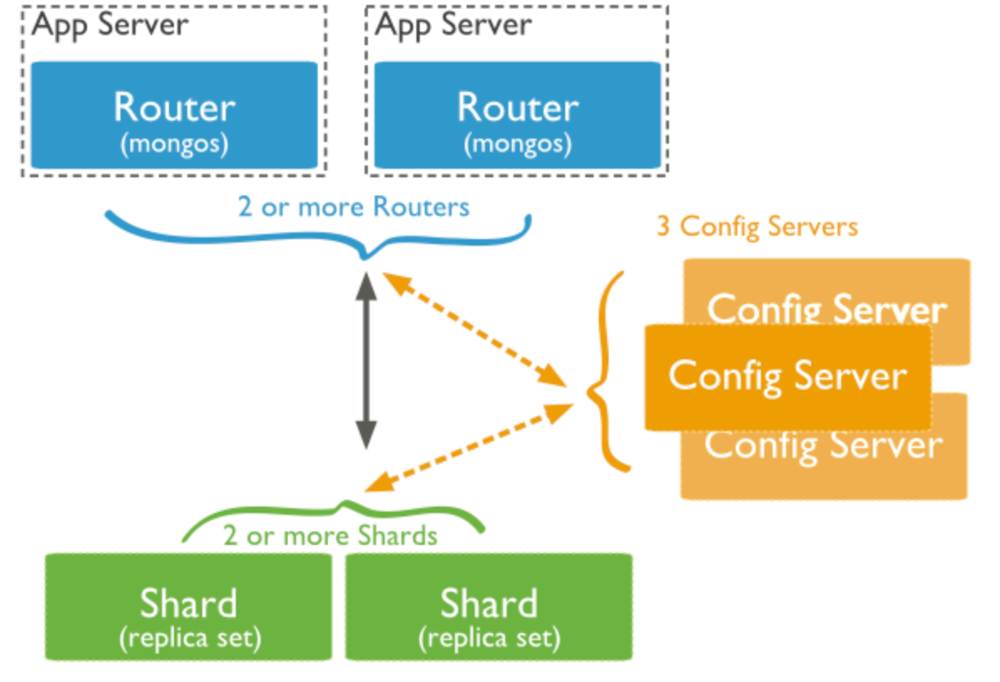

* [MongoDB](#mongodb)
    * [特点](#特点)
    * [关键组件](#关键组件)
        * [_id](#_id)
        * [集合](#集合)
        * [游标](#游标)
        * [数据库](#数据库)
        * [文档](#文档)
        * [字段](#字段)
    * [MongoDB 复制（副本集）](#mongodb-复制副本集)
        * [什么是](#什么是)
        * [复制结构图](#复制结构图)
        * [复制原理](#复制原理)
    * [MongoDB 分片](#mongodb-分片)
        * [什么是](#什么是-1)
        * [分片集群结构](#分片集群结构)
        * [三个主要组件](#三个主要组件)
            * [Shard](#shard)
            * [Config Server](#config-server)
            * [Query Routers](#query-routers)
# MongoDB
## 特点
- 面向文档的数据库
- 非关系型数据库
## 关键组件
### _id
- 文档的主键，如果没有指定则会自动创建

- ObjectId(_id)
  
  - 时间+机器ID+进程ID+计数器
  - 最重要的是开头的四个字节的时间信息，为Unix时间戳。后面三个字节是机器ID,两个字节的进程ID，三个字节的计数器。计数器会自动增长，可以保证同一进程、同一时刻内不会重复。
### 集合
- collection
- 等同于表
### 游标
指向查询结果集的指针，可以遍历游标检索结果
### 数据库
### 文档
集合中的记录称为文档
### 字段
kv键值对
## MongoDB 复制（副本集）
### 什么是
- MongoDB复制是将数据同步在多个服务器的过程。
- 复制提供了数据的冗余备份，并在多个服务器上存储数据副本，提高了数据的可用性， 并可以保证数据的安全性。
- 复制还允许您从硬件故障和服务中断中恢复数据。
### 复制结构图

### 复制原理
- mongodb的复制至少需要两个节点。其中一个是主节点，负责处理客户端请求，其余的都是从节点，负责复制主节点上的数据。
- mongodb各个节点常见的搭配方式为：一主一从、一主多从。
- 主节点记录在其上的所有操作oplog，从节点定期轮询主节点获取这些操作，然后对自己的数据副本执行这些操作，从而保证从节点的数据与主节点一致。
## MongoDB 分片	
### 什么是
- 在Mongodb里面存在另一种集群，就是分片技术,可以满足MongoDB数据量大量增长的需求。
- 当MongoDB存储海量的数据时，一台机器可能不足以存储数据，也可能不足以提供可接受的读写吞吐量。这时，我们就可以通过在多台机器上分割数据，使得数据库系统能存储和处理更多的数据。
### 分片集群结构

### 三个主要组件
#### Shard
用于存储实际的数据块，实际生产环境中一个shard server角色可由几台机器组个一个replica set承担，防止主机单点故障
#### Config Server
- mongod实例，存储了整个 ClusterMetadata，其中包括 chunk信息
- 配置服务器上存储了分片集群的元数据
- 配置服务器上存储集群元数据在config数据库中，mongo实例缓存这些数据并通过它们选择到各个shard的访问路径
#### Query Routers
前端路由，客户端由此接入，且让整个集群看上去像单一数据库，前端应用可以透明使用