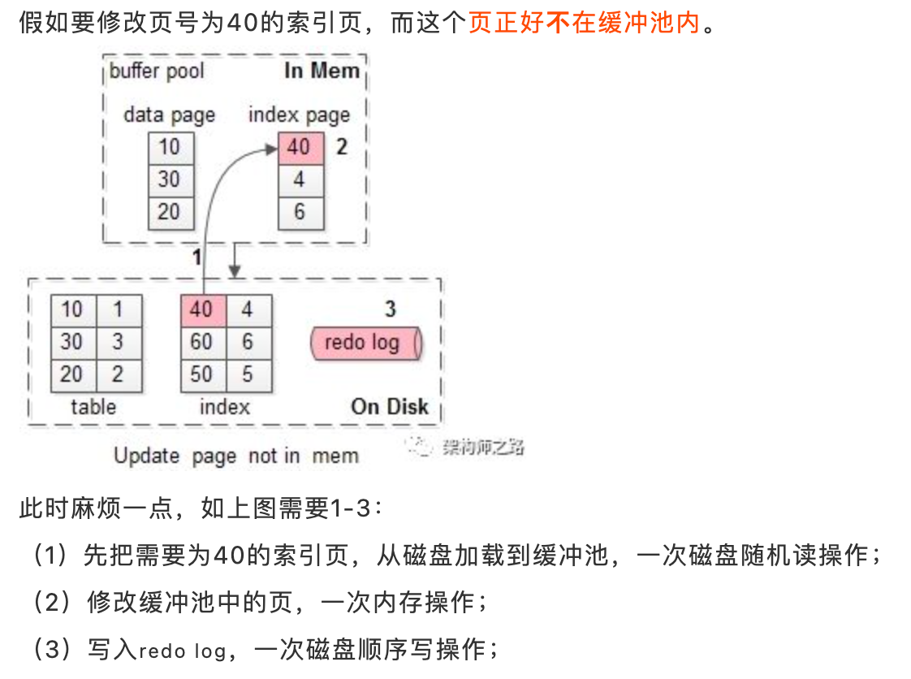

* [MySQL](#mysql)
  * [架构](#架构)
  * [客户端](#客户端)
  * [server层](#server层)
  * [储存引擎](#储存引擎)
  * [物理文件层](#物理文件层)
  * [SQL优化](#sql优化)
    * [explain](#explain)
    * [属性](#属性)
    * [如何做慢查询排查的](#如何做慢查询排查的)
      * [什么是慢查询日志](#什么是慢查询日志)
      * [使用工具分析](#使用工具分析)
    * [select * select col 主要区别](#select--select-col-主要区别)
    * [select count(*)  count(1)  count(col) 主要区别](#select-count--count1--countcol-主要区别)
  * [储存引擎](#储存引擎-1)
    * [InnoDB](#innodb)
      * [架构图](#架构图)
      * [架构划分](#架构划分)
        * [内存结构](#内存结构)
          * [缓冲池 (Buffer Pool)](#缓冲池-buffer-pool)
          * [写缓冲 (Change Buffer)](#写缓冲-change-buffer)
          * [自适应哈希索引 (Adaptive Hash Index)](#自适应哈希索引-adaptive-hash-index)
          * [日志缓冲 (Log Buffer)](#日志缓冲-log-buffer)
        * [磁盘结构](#磁盘结构)
      * [特点总结](#特点总结)
    * [MyISAM](#myisam)
  * [MyISAM和InnoDB的区别总结](#myisam和innodb的区别总结)
    * [存储结构](#存储结构)
    * [存储空间](#存储空间)
    * [可移植性、备份及恢复](#可移植性备份及恢复)
    * [事务支持](#事务支持)
    * [AUTO_INCREMENT](#auto_increment)
    * [表锁差异](#表锁差异)
    * [全文索引MySql全文索引](#全文索引mysql全文索引)
    * [表主键](#表主键)
    * [表的具体行数](#表的具体行数)
    * [CRUD操作](#crud操作)
    * [外键](#外键)
  * [索引](#索引)
    * [B树](#b树)
      * [b+ tree](#b-tree)
      * [为什么数据库索引用B+树，而不用list、map、二叉树或红黑树](#为什么数据库索引用b树而不用listmap二叉树或红黑树)
      * [MySQL B+树一般几层，怎么算的](#mysql-b树一般几层怎么算的)
      * [b tree](#b-tree-1)
      * [联合索引的树存储结构](#联合索引的树存储结构)
    * [哈希索引](#哈希索引)
    * [全文索引](#全文索引)
    * [空间数据索引](#空间数据索引)
    * [MySQL 索引失效](#mysql-索引失效)
    * [like索引失效原理](#like索引失效原理)
    * [ICP(index condition pushdown)](#icpindex-condition-pushdown)
      * [怎么理解ICP](#怎么理解icp)
      * [分析试验数据提升原因](#分析试验数据提升原因)
      * [ICP的使用条件](#icp的使用条件)
    * [索引优化](#索引优化)
    * [MyISAM的索引](#myisam的索引)
    * [InnoDB的索引](#innodb的索引)
    * [主键和唯一索引的区别](#主键和唯一索引的区别)
  * [联合索引的底层组织方式](#联合索引的底层组织方式)
  * [事务](#事务)
    * [ACID](#acid)
      * [原子性（Atomicity，或称不可分割性）](#原子性atomicity或称不可分割性)
      * [一致性（Consistency）](#一致性consistency)
      * [隔离性（Isolation）](#隔离性isolation)
        * [隔离级别](#隔离级别)
          * [读未提交：read uncommitted](#读未提交read-uncommitted)
          * [读已提交：read committed](#读已提交read-committed)
          * [可重复读：repeatable read](#可重复读repeatable-read)
          * [串行化：serializable](#串行化serializable)
      * [持久性（Durability）](#持久性durability)
  * [事务日志](#事务日志)
    * [redo log（重做日志）](#redo-log重做日志)
    * [undo log（回滚日志）](#undo-log回滚日志)
  * [二进制日志( binlog )](#二进制日志-binlog-)
  * [redo log和binlog的区别](#redo-log和binlog的区别)
  * [redo log和binlog一致性问题](#redo-log和binlog一致性问题)
    * [先写binlog还是先写redo log的呢？](#先写binlog还是先写redo-log的呢)
      * [假设一：先写redo log再写binlog](#假设一先写redo-log再写binlog)
      * [假设二：先写binlog再写redo log](#假设二先写binlog再写redo-log)
    * [MySQL的内部XA（两阶段提交）](#mysql的内部xa两阶段提交)
    * [总结](#总结)
  * [锁](#锁)
    * [行级锁](#行级锁)
    * [表级锁](#表级锁)
    * [页锁](#页锁)
  * [切分](#切分)
    * [水平切分](#水平切分)
    * [垂直切分](#垂直切分)
  * [复制](#复制)
    * [主从复制](#主从复制)
      * [原理](#原理)
      * [主从复制的模式](#主从复制的模式)
      * [问题](#问题)
    * [读写分离](#读写分离)
  * [中间件](#中间件)
    * [mycat](#mycat)
    * [ShardingSphere](#shardingsphere)
      * [Sharding-JDBC](#sharding-jdbc)
      * [Sharding-Proxy](#sharding-proxy)
  * [数据库三范式](#数据库三范式)
    * [第一范式](#第一范式)
    * [第二范式](#第二范式)
    * [第三范式](#第三范式)
* [参考文章](#参考文章)

# MySQL
## 架构

## 客户端
各种语言都提供了连接mysql数据库的方法，比如jdbc、php、go等，可根据选择 的后端开发语言选择相应的方法或框架连接mysql
## 	server层
包括连接器、查询缓存、分析器、优化器、执行器等，涵盖mysql的大多数核心服务功能，以及所有的内置函数（例如日期、世家、数 学和加密函数等），所有跨存储引擎的功能都在这一层实现，比如存储过程、触发器、视图等
- `连接器` 连接器负责来自客户端的连接、获取用户权限、维持和管理连接
- `查询缓存`
  - mysql拿到一个查询请求后，会先到查询缓存查看之前是否执行过这条语句
  - MySQL 8.0 版本直接将查询缓存的整块功能删掉了
- `分析器`
  - 词法分析（识别关键字，操作，表名，列名）
  - 语法分析 (判断是否符合语法）
- `优化器` 优化器是在表里面有多个索引的时候，决定使用哪个索引；或者在一个语句有多表关联（join）的时候，决定各个表的连接顺序。优化器阶段完成后，这个语句的执行方案就确定下来了，然后进入执行器阶段
- `执行器`
  - 首先，肯定是要判断权限，就是有没有权限执行这条SQL。工作中可能会对某些客户端进行权限控制
  - 如果有权限，就打开表继续执行。打开表的时候，执行器就会根据表的引擎定义，去使用这个引擎提供的接口

最终对结果集进行过滤、排序以及键值对的比较等
- cpu密集型
## 	储存引擎
复制数据的存储和提取，是真正与底层物理文件打交道的组件。 数据本质是存储在磁盘上的，通过特定的存储引擎对数据进行有组织的存放并根据业务需要对数据进行提取。存储引擎的架构模式是插件式的，支持Innodb，MyIASM、Memory等多个存储引擎。现在最常用的存储引擎是Innodb，它从mysql5.5.5版本开始成为了默认存储引擎
- io密集型
## 	物理文件层
存储数据库真正的表数据、日志等。物理文件包括：redolog、undolog、binlog、errorlog、querylog、slowlog、data、index等
## SQL优化
### explain
Explain 用来分析 SELECT 查询语句，开发人员可以通过分析 Explain 结果来优化查询语句
### 属性
- `id`: SELECT 查询的标识符. 每个 SELECT 都会自动分配一个唯一的标识符.
  - SQL执行的顺序的标识,SQL从大到小的执行
    1. id相同时，执行顺序由上至下
    2. 如果是子查询，id的序号会递增，id值越大优先级越高，越先被执行
    3. id如果相同，可以认为是一组，从上往下顺序执行；在所有组中，id值越大，优先级越高，越先执行
- `select_type`: SELECT 查询的类型.
  - `SIMPLE`, 表示此查询不包含 UNION 查询或子查询
  - `PRIMARY`, 表示此查询是最外层的查询
  - `UNION`, 表示此查询是 UNION 的第二或随后的查询
  - `DEPENDENT UNION`, UNION 中的第二个或后面的查询语句, 取决于外面的查询
  - `UNION RESULT`, UNION 的结果
  - `SUBQUERY`, 子查询中的第一个 SELECT
  - `DEPENDENT SUBQUERY`: 子查询中的第一个 SELECT, 取决于外面的查询. 即子查询依赖于外层查询的结果.
- `table`: 查询的是哪个表
- `partitions`: 匹配的分区
- `type`: 表示MySQL在表中找到所需行的方式，又称“访问类型”
  - `NULL`: MySQL在优化过程中分解语句，执行时甚至不用访问表或索引，例如从一个索引列里选取最小值可以通过单独索引查找完成
  - `system`: 表中只有一条数据. 这个类型是特殊的 const 类型.
  - `const`: 针对主键或唯一索引的等值查询扫描, 最多只返回一行数据. const 查询速度非常快, 因为它仅仅读取一次即可.
  - `eq_ref`: 此类型通常出现在多表的 join 查询, 表示对于前表的每一个结果, 都只能匹配到后表的一行结果. 并且查询的比较操作通常是 =, 查询效率较高
  - `ref`: 此类型通常出现在多表的 join 查询, 针对于非唯一或非主键索引, 或者是使用了 最左前缀 规则索引的查询
  - `range`: 表示使用索引范围查询, 通过索引字段范围获取表中部分数据记录. 这个类型通常出现在 =, <>, >, >=, <, <=, IS NULL, <=>, BETWEEN, IN() 操作中.
    - 当 type 是 range 时, 那么 EXPLAIN 输出的 ref 字段为 NULL, 并且 key_len 字段是此次查询中使用到的索引的最长的那个
  - `index`: 表示全索引扫描(full index scan), 和 ALL 类型类似, 只不过 ALL 类型是全表扫描, 而 index 类型则仅仅扫描所有的索引, 而不扫描数据.
    - index 类型通常出现在: 所要查询的数据直接在索引树中就可以获取到, 而不需要扫描数据. 当是这种情况时, Extra 字段 会显示 Using index
  - `ALL`: 表示全表扫描, 这个类型的查询是性能最差的查询之一. 通常来说, 我们的查询不应该出现 ALL 类型的查询, 因为这样的查询在数据量大的情况下, 对数据库的性能是巨大的灾难. 如一个查询是 ALL 类型查询, 那么一般来说可以对相应的字段添加索引来避免
  - `ALL < index < range ~ index_merge < ref < eq_ref < const < system<NULL`
- `possible_keys`: 此次查询中可能选用的索引
- `key`: 此次查询中确切使用到的索引.
- `key_len`: 表示索引中使用的字节数，可通过该列计算查询中使用的索引的长度（key_len显示的值为索引字段的最大可能长度，并非实际使用长度，即key_len是根据表定义计算而得，不是通过表内检索出的）
- `ref`: 哪个字段或常数与 key 一起被使用
- `rows`: 显示此查询一共扫描了多少行. 这个是一个估计值.
- `filtered`: 这个字段表示存储引擎返回的数据在server层过滤后，剩下多少满足查询的记录数量的比例，注意是百分比，不是具体记录数。这个字段不重要
- `extra`: 额外的信息
  - `Using where`:列数据是从仅仅使用了索引中的信息而没有读取实际的行动的表返回的，这发生在对表的全部的请求列都是同一个索引的部分的时候，表示mysql服务器将在存储引擎检索行后再进行过滤
  - `Using temporary`：表示MySQL需要使用临时表来存储结果集，常见于排序和分组查询
  - `Using filesort`：MySQL中无法利用索引完成的排序操作称为“文件排序”
  - `Using join buffer`：改值强调了在获取连接条件时没有使用索引，并且需要连接缓冲区来存储中间结果。如果出现了这个值，那应该注意，根据查询的具体情况可能需要添加索引来改进能。
  - `Impossible where`：这个值强调了where语句会导致没有符合条件的行。
  - `Select tables optimized away`：这个值意味着仅通过使用索引，优化器可能仅从聚合函数结果中返回一行
### 如何做慢查询排查的
#### 什么是慢查询日志
具体指运行时间超过long_query_time值的SQL，则会被记录到慢查询日志中。long_query_time的默认值为10，意思是运行10秒以上的语句。
- 如果不是调优需要的话，一般不建议启动该参数，因为开启慢查询日志会或多或少带来一定的性能影响。慢查询日志支持将日志记录写入文件
- 默认关闭：`SHOW VARIABLES LIKE '%slow_query_log%';`
   
  - 临时生效：`set global slow_query_log=1;`
  - 永久生效，修改配置文件my.cnf（其它系统变量也是如此）
- 查询当前系统中有多少条慢查询记录
  - `show global status like '%Slow_queries%';`
#### 使用工具分析
- mysql自带的 mysqldumpslow,
  - `mysqldumpslow  /var/lib/mysql/mysql-slow.log`
    - 得到的信息
      - 主要功能是, 统计不同慢sql的
      - 出现次数(Count),
      - 执行最长时间(Time),
      - 累计总耗费时间(Time),
      - 等待锁的时间(Lock),
      - 发送给客户端的行总数(Rows),
      - 扫描的行总数(Rows),
      - 用户以及sql语句本身(抽象了一下格式, 比如 limit 1, 20 用 limit N,N 表示).
  - 一般一台服务器有很多数据库，这样根本看不出来啊
- mysqlsla 
  - 需要单独安装
  - 使用举例
    - 统计慢查询文件为/data/mysql/127-slow.log的所有select的慢查询sql，并显示执行时间最长的100条sql，并写到sql_select.log中去
    - `mysqlsla -lt slow  -sf "+select" -top 100  /data/mysql/127-slow.log >/tmp/sql_select.log`
    					
  - 返回参数
    - `Count`, sql的执行次数及占总的slow log数量的百分比.
    - `Time`, 执行时间, 包括总时间, 平均时间, 最小, 最大时间, 时间占到总慢sql时间的百分比.
    - `95% of Time`, 去除最快和最慢的sql, 覆盖率占95%的sql的执行时间.
    - `Lock Time`, 等待锁的时间.95% of Lock , 95%的慢sql等待锁时间.Rows sent, 结果行统计数量, 包括平均, 最小, 最大数量.
    - `Rows examined`, 扫描的行数量.
    - `Database`, 属于哪个[数据库]
    - `Users`, 哪个用户,IP, 占到所有用户执行的sql百分比
    - `Query abstract`, 抽象后的sql语句
    - `Query sample`, sql语句
  - 对于得到这个信息还可以进一步分析，就是登陆到mysql 的客户端，登陆数据库，执行 EXPLAIN查看sql具体的 type 信息。
### select * select col 主要区别
- select * 是查询表的所有字段，数据返回量肯定比较大
- 如果只是查询单独字段，最好写单独字段不要查询全部字段
- 如果查询单独字段比如select abc，而写了select * 如果abc有索引，则会读完索引的数据再去读其他data造成性能问题
### select count(*)  count(1)  count(col) 主要区别
count(1) 和count(*) 没有什么很大区别

count(1) 和 count(col) 
- 主要区别是 count(1)会统计值为null的数据,count(*)也不会忽略
- 而count(col)会忽略

## 储存引擎
### InnoDB
#### 架构图
				
#### 架构划分
##### 内存结构
###### 缓冲池 (Buffer Pool) 
buffer pool是主存中的一个区域，InnoDB在访问表和索引数据时在这里进行缓存。buffer pool允许直接从内存访问常用数据，从而提高处理速度。在专用服务器上，多达80%的物理内存通常分配给缓冲池
- `预读` 磁盘读写，并不是按需读取，而是按页读取，一次至少读一页数据（一般是16K），如果未来要读取的数据就在页中，就能够省去后续的磁盘IO，提高效率
- `LRU` 管理这些缓冲页
  - `传统的LRU` 把入缓冲池的页放到LRU的头部，作为最近访问的元素，从而最晚被淘汰
    1. 页已经在缓冲池里，那就只做“移至”LRU头部的动作，而没有页被淘汰；
    2. 页不在缓冲池里，除了做“放入”LRU头部的动作，还要做“淘汰”LRU尾部页的动作
  - `MySQL LRU`
    - 问题
      - `预读失效` 由于预读(Read-Ahead)，提前把页放入了缓冲池，但最终MySQL并没有从页中读取数据，称为预读失效
        - 如何对预读失效进行优化？
          - 思路
            1. 让预读失败的页，停留在缓冲池LRU里的时间尽可能短；
            2. 让真正被读取的页，才挪到缓冲池LRU的头部；
          - 方法
            - 将LRU分为两个部分
            
              - 新生代(new sublist)
              - 老生代(old sublist)
            - 新老生代收尾相连，即：新生代的尾(tail)连接着老生代的头(head)
            - 新页（例如被预读的页）加入缓冲池时，只加入到老生代头部
              - 如果数据真正被读取（预读成功），才会加入到新生代的头部
              - 如果数据没有被读取，则会比新生代里的“热数据页”更早被淘汰出缓冲池
      - `缓冲池污染` 当某一个SQL语句，要批量扫描大量数据时，可能导致把缓冲池的所有页都替换出去，导致大量热数据被换出，MySQL性能急剧下降，这种情况叫缓冲池污染
        - 例如，有一个数据量较大的用户表，当执行： `select * from user where name like "%shenjian%";` 虽然结果集可能只有少量数据，但这类like不能命中索引，必须全表扫描，就需要访问大量的页：
          1. 把页加到缓冲池（插入老生代头部）；
          2. 从页里读出相关的row（插入新生代头部）；
          3. row里的name字段和字符串shenjian进行比较，如果符合条件，加入到结果集中；
          4. …直到扫描完所有页中的所有row…
          - 如此一来，所有的数据页都会被加载到新生代的头部，但只会访问一次，真正的热数据被大量换出。
        - 老生代停留时间窗口
          1. 假设T=老生代停留时间窗口；
          2. 插入老生代头部的页，即使立刻被访问，并不会立刻放入新生代头部；
          3. 只有满足“被访问”并且“在老生代停留时间”大于T，才会被放入新生代头部
          - 举例
              								
  - 参数
    - `innodb_buffer_pool_size` 配置缓冲池的大小，在内存允许的情况下，DBA往往会建议调大这个参数，越多数据和索引放到内存里，数据库的性能会越好
    - `innodb_old_blocks_pct` 老生代占整个LRU链长度的比例，默认是37，即整个LRU中新生代与老生代长度比例是63:37。
    - `innodb_old_blocks_time` 老生代停留时间窗口，单位是毫秒，默认是1000，即同时满足“被访问”与“在老生代停留时间超过1秒”两个条件，才会被插入到新生代头部
  - 总结
    1. 缓冲池(buffer pool)是一种常见的降低磁盘访问的机制；
    2. 缓冲池通常以页(page)为单位缓存数据；
    3. 缓冲池的常见管理算法是LRU，memcache，OS，InnoDB都使用了这种算法；
    4. InnoDB对普通LRU进行了优化：
      - 将缓冲池分为老生代和新生代，入缓冲池的页，优先进入老生代，页被访问，才进入新生代，以解决预读失效的问题
      - 页被访问，且在老生代停留时间超过配置阈值的，才进入新生代，以解决批量数据访问，大量热数据淘汰的问题
###### 写缓冲 (Change Buffer)
目的是提升 InnoDB 性能，加速写请求，避免每次写入都进行磁盘 IO。 在MySQL5.5之前，叫插入缓冲(insert buffer)，只针对insert做了优化；现在对delete和update也有效，叫做写缓冲(change buffer),它是一种应用在非唯一普通索引页(non-unique secondary index page)不在缓冲池中，对页进行了写操作，并不会立刻将磁盘页加载到缓冲池，而仅仅记录缓冲变更(buffer changes)，等未来数据被读取时，再将数据合并(merge)恢复到缓冲池中的技术。写缓冲的目的是降低写操作的磁盘IO，提升数据库性能
- 情况
  - 情况一
    						
  - 情况二
    						
  - 加入写缓冲优化
    							
  - 此后的读取情况
    							
  - 为什么写缓冲优化，仅适用于非唯一普通索引页呢？
    - 如果索引设置了唯一(unique)属性，在进行修改操作时，InnoDB必须进行唯一性检查。也就是说，索引页即使不在缓冲池，磁盘上的页读取无法避免(否则怎么校验是否唯一？)，此时就应该直接把相应的页放入缓冲池再进行修改
    - 除了数据页被访问，还有哪些场景会触发刷写缓冲中的数据呢？
      1. 有一个后台线程，会认为数据库空闲时；
      2. 数据库缓冲池不够用时；
      3. 数据库正常关闭时；
      4. redo log写满时
    - 什么业务场景，适合开启InnoDB的写缓冲机制？
      - 什么时候不适合
        1. 数据库都是唯一索引；
        2. 或者，写入一个数据后，会立刻读取它；
      - 适合
        1. 数据库大部分是非唯一索引；
        2. 业务是写多读少，或者不是写后立刻读取；
###### 自适应哈希索引 (Adaptive Hash Index)
InnoDB的哈希索引
1. InnoDB用户无法手动创建哈希索引，这一层上说，InnoDB确实不支持哈希索引；
2. InnoDB会自调优(self-tuning)，如果判定建立自适应哈希索引(Adaptive Hash Index, AHI)，能够提升查询效率，InnoDB自己会建立相关哈希索引，这一层上说，InnoDB又是支持哈希索引的；
- 原理
						
  - 为啥叫“自适应(adaptive)”哈希索引？
  - 系统自己判断“应该可以加速查询”而建立的，不需要用户手动建立，故称“自适应”。
  - 系统会不会判断失误，是不是一定能加速？
  - 不是一定能加速，有时候会误判。
###### 日志缓冲 (Log Buffer) 
redo log，binlog都先写入到日志缓冲区，然后再追加写入到磁盘日志文件中，主要的目的是把磁盘随机IO写优化成磁盘批量写和顺序写（磁盘顺序写的性能要比随机写高非常多）
- 事务提交时，将redo log写入Log Buffer，就会认为事务提交成功
- 如果写入Log Buffer的数据，write入OS cache之前，数据库崩溃，就会出现数据丢失
- 如果写入OS cache的数据，fsync入磁盘之前，操作系统奔溃，也可能出现数据丢失
  - `策略一`：最佳性能(`innodb_flush_log_at_trx_commit=0`) 每隔一秒，才将Log Buffer中的数据批量write入OS cache，同时MySQL主动fsync。 这种策略，如果数据库奔溃，有一秒的数据丢失。
  - `策略二`：强一致(`innodb_flush_log_at_trx_commit=1`) 每次事务提交，都将Log Buffer中的数据write入OS cache，同时MySQL主动fsync。 这种策略，是InnoDB的默认配置，为的是保证事务ACID特性。
  - `策略三`：折衷(`innodb_flush_log_at_trx_commit=2`) 每次事务提交，都将Log Buffer中的数据write入OS cache； 每隔一秒，MySQL主动将OS cache中的数据批量fsync。这种策略，如果操作系统奔溃，最多有一秒的数据丢失。
##### 磁盘结构
//TODO
#### 特点总结
- 支持事务处理，
- 支持外键，
- 支持崩溃修复能力和并发控制。如果需要对事务的完整性要求比较高（比如银行），要求实现并发控制（比如售票），那选择InnoDB有很大的优势。如果需要频繁的更新、删除操作的数据库，也可以选择InnoDB，因为支持事务的提交（commit）和回滚（rollback）
### MyISAM
- 不支持事务
- 不支持行级锁
- MyISAM 崩溃后发生损坏的概率比 InnoDB 高很多，而且恢复的速度也更慢
- MyISAM 支持压缩表和空间数据索引
- 插入数据快，空间和内存使用比较低。如果表主要是用于插入新记录和读出记录，那么选择MyISAM能实现处理高效率。如果应用的完整性、并发性要求比 较低，也可以使用

## MyISAM和InnoDB的区别总结

### 存储结构
**MyISAM**：每个MyISAM在磁盘上存储成三个文件。分别为：表定义文件、数据文件、索引文件。第一个文件的名字以表的名字开始，扩展名指出文件类型。.frm文件存储表定义。数据文件的扩展名为.MYD (MYData)。索引文件的扩展名是.MYI (MYIndex)。

**InnoDB**：所有的表都保存在同一个数据文件中（也可能是多个文件，或者是独立的表空间文件），InnoDB表的大小只受限于操作系统文件的大小，一般为2GB。

### 存储空间
**MyISAM**： MyISAM支持支持三种不同的存储格式：静态表(默认，但是注意数据末尾不能有空格，会被去掉)、动态表、压缩表。当表在创建之后并导入数据之后，不会再进行修改操作，可以使用压缩表，极大的减少磁盘的空间占用。

**InnoDB**： 需要更多的内存和存储，它会在主内存中建立其专用的缓冲池用于高速缓冲数据和索引。

### 可移植性、备份及恢复
**MyISAM**：数据是以文件的形式存储，所以在跨平台的数据转移中会很方便。在备份和恢复时可单独针对某个表进行操作。

**InnoDB**：免费的方案可以是拷贝数据文件、备份 binlog，或者用 mysqldump，在数据量达到几十G的时候就相对痛苦了。

### 事务支持
**MyISAM**：强调的是性能，每次查询具有原子性,其执行数度比InnoDB类型更快，但是不提供事务支持。

**InnoDB**：提供事务支持事务，外部键等高级数据库功能。 具有事务(commit)、回滚(rollback)和崩溃修复能力(crash recovery capabilities)的事务安全(transaction-safe (ACID compliant))型表。

### AUTO_INCREMENT 
**MyISAM**：可以和其他字段一起建立联合索引。引擎的自动增长列必须是索引，如果是组合索引，自动增长可以不是第一列，他可以根据前面几列进行排序后递增。

**InnoDB**：InnoDB中必须包含只有该字段的索引。引擎的自动增长列必须是索引，如果是组合索引也必须是组合索引的第一列。

### 表锁差异
**MyISAM**： 只支持表级锁，用户在操作myisam表时，select，update，delete，insert语句都会给表自动加锁，如果加锁以后的表满足insert并发的情况下，可以在表的尾部插入新的数据。

**InnoDB**： 支持事务和行级锁，是innodb的最大特色。行锁大幅度提高了多用户并发操作的新能。但是InnoDB的行锁，只是在WHERE的主键是有效的，非主键的WHERE都会锁全表的。

### 全文索引MySql全文索引
**MyISAM**：支持 FULLTEXT类型的全文索引

**InnoDB**：不支持FULLTEXT类型的全文索引，但是innodb可以使用sphinx插件支持全文索引，并且效果更好。

### 表主键
**MyISAM**：允许没有任何索引和主键的表存在，索引都是保存行的地址。

**InnoDB**：如果没有设定主键或者非空唯一索引，就会自动生成一个6字节的主键(用户不可见)，数据是主索引的一部分，附加索引保存的是主索引的值。

### 表的具体行数
**MyISAM**： 保存有表的总行数，如果select count() from table;会直接取出出该值。

**InnoDB**： 没有保存表的总行数，如果使用select count(*) from table；就会遍历整个表，消耗相当大，但是在加了wehre条件后，myisam和innodb处理的方式都一样。\

### CRUD操作
**MyISAM**：如果执行大量的SELECT，MyISAM是更好的选择。

**InnoDB**：如果你的数据执行大量的INSERT或UPDATE，出于性能方面的考虑，应该使用InnoDB表。
### 外键
**MyISAM**：不支持

**InnoDB**：支持

## 索引
- 按数据结构分类可分为：B+tree索引、Hash索引、Full-text索引。
- 按物理存储分类可分为：聚簇索引、二级索引（辅助索引）。
- 按字段特性分类可分为：主键索引、普通索引、前缀索引。
- 按字段个数分类可分为：单列索引、联合索引（复合索引、组合索引）。
### B树
#### b+ tree
- B+tree 非叶子节点只存储键值信息

- 叶子结点单链表有序
- 利用磁盘预读特性
  - 为了减少磁盘 I/O 操作，磁盘往往不是严格按需读取，而是每次都会预读。预读过程中，磁盘进行顺序读取，顺序读 取不需要进行磁盘寻道，并且只需要很短的磁盘旋转时间，速度会非常快。 操作系统一般将内存和磁盘分割成固定大小的块，每一块称为一页，内存与磁盘以页为单位交换数据。数据库系统将 索引的一个节点的大小设置为页的大小，使得一次 I/O 就能完全载入一个节点。并且可以利用预读特性，相邻的节点 也能够被预先载入。
#### 为什么数据库索引用B+树，而不用list、map、二叉树或红黑树
- 为什么不用b树
  - b+树只有叶子节点存放数据，而b树每个索引节点都会存放数据，查询范围数据时io次数会大大增加
  - b+树叶子结点也是链表，在范围查找时也是非常高效
- 为什么不使用hash
  - hash只能值匹配不能实现范围查询
  - 不能实现排序
  - 不能联合索引
  - 数据量大，hash冲突大
- 为什么不是AVL
  - b+树的高度远低于AVL，查找效率更高
- 为什么不是红黑树
  - 树高度
  - 红黑树的平衡
#### MySQL B+树一般几层，怎么算的
非叶子节点就是一个16k大小的page，所以对于一棵树能存多少数据，主要就看非叶节点能存下多少个[主键ID+指针]了

下面以一个高度=2，且主键ID是一个bigint(8字节)来分析可以存下多少数据(这个假设是有意义的，在绝大部分主键id都是一个自增的bigint)。

Innodb中一个指针是6字节长度。所以[主键ID+指针]总共就占14字节。所以一个16K大小的节点可以存下的[主键ID+指针]个数=16K/14=16384/14=1170，也就是说一个高度=2的B+树可以放下1170个叶子节点，即1170个用于存放行数据的page，即可以存放的行数据的大小=1170*16K=18720K=1.8M，准确的说这是树上的，还有很多不在树上的，所以实际能放下的数据不止1.8M。

如果下面我们分析高度=3，即有两层非叶子节点的B+树，能存放多少数据。根节点的16k的page可以存放16k/14=1170个[主键ID+指针]，即第二层就可以有1170个page。所以总共树上可以放的叶子节点的个数=1170*1170=1368900，所以能放下的数据=1368900*16K=21902400K=21G。同理，因为不是所有的行数据都在树上，所以高度=3的B+树不止放下21G的数据的。

所以，在实际中，绝大部分的表的索引树的高度都不会超过4。
#### b tree
所有节点都会储存信息


#### 联合索引的树存储结构


联合索引的所有索引列都出现在索引树上，并依次比较三列的大小。

### 哈希索引
哈希索引能以 O(1) 时间进行查找，但是失去了有序性
- 无法用于排序与分组
- 只支持精确查找，无法用于部分查找和范围查找
### 全文索引
MyISAM 存储引擎支持全文索引，用于查找文本中的关键词，而不是直接比较是否相等
### 空间数据索引
- MyISAM 存储引擎支持空间数据索引（R-Tree），可以用于地理数据存储。空间数据索引会从所有维度来索引数据，
- 可以有效地使用任意维度来进行组合查询
- 必须使用 GIS 相关的函数来维护数据。
### MySQL 索引失效
- `违反最左匹配原则` 最左匹配原则：最左优先，以最左边的为起点任何连续的索引都能匹配上，如不连续，则匹配不上。
- `多条件联合查询时最好建联合索引`
- 遇到`范围`查询（>、<、between、like）就会停止匹配。
  - 使用范围后的索引会失效，例如 `select * from table where a > 1 and b= 9` a索引生效，b索引生效
- 使用`不等于`（!= 、<>）
  - 这种要看MySQL是怎么优化的，因为`=`是走索引的比如有1%的数据，而`!= `相当于查询另外99%的数据，相当于全表扫描了所以选择不走索引
- 如`计算、函数、（手动或自动）类型转换`等操作，会导致索引失效而进行全表扫描。
- in 值较多时会失效
  - 推测是查找的效率 < 全表扫描

### like索引失效原理
```sql
where name like "a%"
where name like "%a%"
where name like "%a"
```
我们先来了解一下%的用途

- %放在右边，代表查询以"a"开头的数据，如：abc
- 两个%%，代表查询数据中包含"a"的数据，如：cab、cba、abc
- %放在左边，代表查询以"a"为结尾的数据，如cba

为什么%放在右边有时候能用到索引
- %放右边叫做：前缀
- %%叫做：中缀
- %放在左边叫做：后缀

没错，这里依然是最佳左前缀法则这个概念 如果索引是字符串，那么B+树是由字符串组成的。

字符串的排序方式：先按照第一个字母排序，如果第一个字母相同，就按照第二个字母排序。。。以此类推

**一、%号放右边（前缀）**

由于B+树的索引顺序，是按照首字母的大小进行排序，前缀匹配又是匹配首字母。所以可以在B+树上进行有序的查找，查找首字母符合要求的数据。所以有些时候可以用到索引。

**二、%号放左边**

是匹配字符串尾部的数据，我们上面说了排序规则，尾部的字母是没有顺序的，所以不能按照索引顺序查询，就用不到索引。

**三、两个%%号**

这个是查询任意位置的字母满足条件即可，只有首字母是进行索引排序的，其他位置的字母都是相对无序的，所以查找任意位置的字母是用不上索引的。
### ICP(index condition pushdown)
索引下推

首先，我们可以通过如下语句开启或关闭Myslq的ICP特性：
```sql
SET optimizer_switch = 'index_condition_pushdown=off'; //关闭
SET optimizer_switch = 'index_condition_pushdown=on';  //开启
```

#### 怎么理解ICP
Index Condition Pushdown (ICP)是MySQL用索引去表里取数据的一种优化。如果禁用ICP，引擎层会穿过索引在基表中寻找数据行，然后返回给MySQL Server层，再去为这些数据行进行WHERE后的条件的过滤。ICP启用，如果部分WHERE条件能使用索引中的字段，MySQL Server 会把这部分下推到引擎层。存储引擎通过使用索引条目，然后推索引条件进行评估，使用这个索引把满足的行从表中读取出。ICP能减少引擎层访问基表的次数和MySQL Server 访问存储引擎的次数。

用两张图解释下：

关闭ICP：


此时，索引符合之前推文提过的最左前缀原理，当多列索引的某一列是范围查询后，之后的字段便不会走索引。

开启ICP:


开启ICP后，查询同样符合最左前缀规则，但是当多列索引的某一列是范围查询后，之后的字段还是会被下推到存储引擎（Storage Engine）层进行条件判断，过滤出符合条件的数据后再返回给Server层。而由于在引擎层就能够过滤掉大量的数据，这样无疑能够减少了对base table和mysql server的访问次数。从而提升了性能。

#### 分析试验数据提升原因
关闭ICP是这样的：
1. 从索引里面取出下一条pid=14的记录，然后利用主键字段读取整个行。
2. 然后对这个完整的行利用其余的条件这个进行判断看是否符合条件，在Server层进行过滤和处理。

开启ICP是这样的：

1. 从索引里面取出下一条pid=14的记录，然后利用这个索引的其他字段条件进行判断，如果条件成立，执行第2步。在引擎层上进行过滤和处理。
2. 在上一步中筛选出来符合条件的才会利用主键索引里面找到这个完整行，返回。

也就是说： 在没有ICP前，由于优化器只能只能使用前缀索引来过滤满足条件的查询，那么mysql只能够利用索引的第一个字段pid，来扫描demo表满足pid=14条件的记录，而后面的nid和country由于使用了模糊查询，而不能在索引中继续过滤满足条件的记录，这样就导致了Server层对demo表的扫描增加了许多；

有了ICP，mysql在读取demo表前，继续检查满足nid和country条件的记录,这个行为在引擎层完成。直接把过滤好的返回给Server层，就减少了Server层的操作。总之是把之前在SERVER层的下推到引擎层去处理。

这里也就解释了ICP（索引条件下推）其实就是将索引条件下推到引擎层啦。

#### ICP的使用条件
只能用于二级索引(secondary index)。

explain显示的执行计划中type值

（join 类型）为range、 ref、 eq_ref或者ref_or_null。

且查询需要访问表的整行数据，即不能直接通过二级索引的元组数据获得查询结果(索引覆盖)。

对于InnnoDB表，ICP仅用于二级索引。（ICP的目的是减少全行读取的次数，从而减少IO操作），对于innodb聚集索引，完整的记录已被读入到innodb缓冲区，在这种情况下，ICP不会减少io。

ICP可以用于MyISAM和InnnoDB存储引擎，不支持分区表（5.7将会解决这个问题）
### 索引优化
- `独立的列`
  - 在进行查询时，索引列不能是表达式的一部分，也不能是函数的参数，否则无法使用索引 `SELECT actor_id FROM sakila.actor WHERE actor_id + 1 = 5;`
- `多列索引`
  - 在需要使用多个列作为条件进行查询时，使用多列索引比使用多个单列索引性能更好 `SELECT film_id, actor_ id FROM sakila.film_actor WHERE actor_id = 1 AND film_id = 1;`
- `索引列的顺序`
  - 让选择性最强的索引列放在前面
  - 索引的选择性是指：不重复的索引值和记录总数的比值。最大值为 1，此时每个记录都有唯一的索引与其对应。选择 性越高，每个记录的区分度越高，查询效率也越高
- `前缀索引`
  - 对于 BLOB、TEXT 和 VARCHAR 类型的列，必须使用前缀索引，只索引开始的部分字符
- `覆盖索引`
  - 索引包含所有需要查询的字段的值
### MyISAM的索引
- MyISAM的索引与行记录是分开存储的，叫做非聚集索引（UnClustered Index）
- 主键索引与普通索引是两棵独立的索引B+树，通过索引列查找时，先定位到B+树的叶子节点，再通过指针定位到行记录

### InnoDB的索引
InnoDB的主键索引与行记录是存储在一起的，故叫做聚集索引（Clustered Index）
- 没有单独区域存储行记录
- 主键索引的叶子节点，存储主键，与对应行记录（而不是指针）
- 普通索引的叶子节点，存储主键

- 所以主键不宜用很长的列

### 主键和唯一索引的区别
- 主键一定是唯一性索引，唯一性索引并不一定就是主键
- 一个表中可以有多个唯一性索引，但只能有一个主键
- 主键列不允许空值，而唯一性索引列允许空值
  - 注意唯一索引的null值会使唯一索引失效，一般设置为不为空或者空字符串`''`

## 联合索引的底层组织方式
数据：


现在建立联合索引(b,c,d)

bcd联合索引在B+树上的结构图：


## 事务
事务是由存储引擎实现的
### ACID
#### 原子性（Atomicity，或称不可分割性）
- 定义 原子性是指一个事务是一个不可分割的工作单位，其中的操作要么都做，要么都不做；如果事务中一个sql语句执行失败，则已执行的语句也必须回滚，数据库退回到事务前的状态
- 实现原理 undo log
#### 一致性（Consistency）
- 一致性是指事务必须使数据库从一个一致性状态变换到另一个一致性状态，也就是说一个事务执行之前和执行之后都必须处于一致性状态
- 如转账的栗子: 假设用户A和用户B两者的钱加起来一共是5000，那么不管A和B之间如何转账，转几次账，事务结束后两个用户的钱相加起来应该还得是5000，这就是事务的一致性
#### 隔离性（Isolation）
- 事务内部的操作与其他事务是隔离的，并发执行的各个事务之间不能互相干扰
  - (一个事务)写操作对(另一个事务)写操作的影响：锁机制保证隔离性
  - (一个事务)写操作对(另一个事务)读操作的影响：MVCC保证隔离性
##### 隔离级别
###### 读未提交：read uncommitted
事物A和事物B，事物A未提交的数据，事物B可以读取到 这里读取到的数据叫做“脏数据
###### 读已提交：read committed
事物A和事物B，事物A提交的数据，事物B才能读取到 这种隔离级别会导致“不可重复读取”
###### 可重复读：repeatable read
事务A和事务B，事务A提交之后的数据，事务B读取不到（B始终读到的数据是第一次读到的）
- 当一个事务在读取某个范围的记录时，另外一个事务在这个范围内插入了一条新的数据，当事务再次进行读取数据时，发现比第一次读取记录多了一条，这就是所谓的幻读，两次读取的结果不一致.
- 虽然可以达到可重复读取，但是会导致“幻像读”
  - MVCC解决幻读
    - MVCC 实现三大要素
      - `隐式字段`
        - 在 Innodb 存储引擎中，在有聚簇索引的情况下每一行记录中都会隐藏俩个字段，如果没有聚簇索引则还有一个 6byte 的隐藏主键
      - `隐藏列` 一个记录的是何时被创建的，一个记录的是什么时候被删除 存储的是事务 ID
        - 俩个隐式字段为 DB_TRX_ID，DB_ROLL_PTR，没有聚簇索引还会有 DB_ROW_ID 这个字段
          - `DB_TRX_ID`：记录创建这条记录上次修改他的事务 ID。
          - `DB_ROLL_PTR`：回滚指针，指向这条记录的上一个版本
        - `undo log（回滚日志）` undo log 保存的是一个版本链，也就是使用 DB_ROLL_PTR 这个字段来连接的。
          - 当事务不可见时就会读取相应的之前版本链上的版本
      - `ReadView` 通过隐藏列和版本链，MySQL可以将数据恢复到指定版本；但是具体要恢复到哪个版本，则需要根据ReadView来确定。所谓ReadView，是指事务（记做事务A）在某一时刻给整个事务系统（trx_sys）打快照，之后再进行读操作时，会将读取到的数据中的事务id与trx_sys快照比较，从而判断数据对该ReadView是否可见，即对事务A是否可见
        - 当前系统中还有哪些活跃的读写事务，把它们的事务id放到一个列表中，我们把这个列表命名为为m_ids
        - 如果被访问版本的 trx_id 属性值小于 m_ids 列表中最小的事务id，表明生成该版本的事务在生成 ReadView 前已经提交，所以该版本可以被当前事务访问。
        - 如果被访问版本的 trx_id 属性值大于 m_ids 列表中最大的事务id，表明生成该版本的事务在生成 ReadView 后才生成，所以该版本不可以被当前事务访问。
        - 如果被访问版本的 trx_id 属性值在 m_ids 列表中最大的事务id和最小事务id之间，那就需要判断一下 trx_id 属性值是不是在 m_ids 列表中，如果在，说明创建 ReadView 时生成该版本的事务还是活跃的，该版本不可以被访问；如果不在，说明创建 ReadView 时生成该版本的事务已经被提交，该版本可以被访问。
            
        ```
        1、初始：
          事务1
          事务2
          事务3
          事务4 读取
          事务5
              
        2、事务2提交了：
          事务1
          事务2 commit
          事务3
          事务4
          事务5
              
        3、事务4打快照：
          事务1
          事务3
          事务4 生成trx_sys[1-5]
          事务5
                
        4、事务4读取事务0：
          事务1
          事务3
          事务4 再次读取，内容如果包含事务0的内容，0 < trx_sys[1-5]最小1 可以被读取
          事务5
              
        5、事务4读取事务6：
          事务1
          事务3
          事务4 再次读取，内容如果包含事务0的内容，6 > trx_sys[1-5]最大5 不可以被读取
          事务5
                
          事务6
                
        6、事务4读取事务3：
          事务1
          事务3
          事务4 再次读取，内容如果包含事务3的内容，3 在 trx_sys[1-5]中 ，因为创建时还活跃(创建时事务3还未提交)，不可以被读取
          事务5
                
          事务6
              
        7、事务4读取事务2：
          事务1
          事务3
          事务4 再次读取，内容如果包含事务2的内容，2 在 trx_sys[1-5]中 ，因为创建时事务2已提交，可以被读取
          事务5
                
          事务6
        ```
  - 加锁读
    - 示例
      - 共享锁读取 `select...lock in share mode`
        - 共享锁事务之间的读取是可以正常获取的
        - 共享锁之间的update是需要等待锁释放的
      - 排它锁读取 `select...for update`
        - 读取和修改都是不允许的
        - innodb_lock_wait_timeout 设置全局的锁超时时间
    - 加锁读在查询时会对查询的数据加锁（共享锁或排它锁）。由于锁的特性，当某事务对数据进行加锁读后，其他事务无法对数据进行写操作，因此可以避免脏读和不可重复读。
    - 而避免幻读，则需要通过next-key lock。next-key lock是行锁的一种，实现相当于record lock(记录锁) + gap lock(间隙锁)；其特点是不仅会锁住记录本身(record lock的功能)，还会锁定一个范围(gap lock的功能)。因此，加锁读同样可以避免脏读、不可重复读和幻读，保证隔离性
####### MVCC、间隙锁都可以解决幻读，有什么区别？
mvcc 又被称为快照读，间隙锁称为当前读
- 快照读的优势是不加锁，并发高，缺点是不是实时数据，是历史数据，严格意义来说不算解决了幻读问题
- 当前读是实时数据
###### 串行化：serializable
事务A和事务B，事务A在操作数据库时，事务B只能排队等待
- 这种级别可以避免“幻像读”，每一次读取的都是数据库中真实存在数据，事务A与事务B串行，而不并发
####  持久性（Durability）
定义 持久性是指事务一旦提交，它对数据库的改变就应该是永久性的。接下来的其他操作或故障不应该对其有任何影响。
- 实现原理：redo log
## 事务日志	
### redo log（重做日志）
- 保证事务持久性
- MySQL每执行一条语句，现将记录写入log buffer ，然后写入OS buffer（cache），系统调用fsync()刷入redo log磁盘
- redo log 采用大小固定，循环写入的方式，写到结尾会回到开头写
- MySQL提供了buffer pool（内存）来提高读取速度，并且对数据的修改也会首先写入bufferpool等待后刷入磁盘，如果在还未刷入磁盘时发生宕机就会发生数据丢失，所以引入redo log（磁盘）对数据的修改也会记录在redo log中，DB宕机后重启，InnoDB会首先去查看数据页中的LSN的数值。这个值代表数据页被刷新回磁盘的LSN的大小。然后再去查看redo log的LSN的大小。如果数据页中的LSN值大说明数据页领先于redo log刷新回磁盘，不需要进行恢复。反之需要从redo log中恢复数据
  - LSN (逻辑序列号)
    - LSN不仅记录在重做日志中，还存在于每个页中，在每个页的头部，值FIL_PAGE_LSN记录该页的LSN。表示页最后刷新时LSN的大小
    - 单调递增的
- 与bing日志的不同
  - bing日志使数据库可以基于时间点恢复数据，也用于主从复制而且是MySQL服务层提供的，二进制
### undo log（回滚日志）
- 事务原子性和隔离性实现的基础
- 当事务对数据库进行修改时，InnoDB会生成对应的undo log；如果事务执行失败或调用了rollback，导致事务需要回滚，便可以利用undo log中的信息将数据回滚到修改之前的样子
- undo log属于逻辑日志，它记录的是sql执行相关的信息。当发生回滚时，InnoDB会根据undo log的内容做与之前相反的工作：对于每个insert，回滚时会执行delete；对于每个delete，回滚时会执行insert；对于每个update，回滚时会执行一个相反的update，把数据改回去
## 二进制日志( binlog )
用于记录数据库执行的写入性操作(不包括查询)信息，以二进制的形式保存在磁盘中
- Server 层进行记录
- binlog 是通过追加的方式进行写入的，可以通过 max_binlog_size 参数设置每个 binlog文件的大小，当文件大小达到给定值之后，会生成新的文件来保存日志
- binlog使用场景
  - `主从复制` 在 Master 端开启 binlog ，然后将 binlog 发送到各个 Slave 端， Slave 端重放 binlog 从而达到主从数据一致
  - `数据恢复` 通过使用 mysqlbinlog 工具来恢复数据
- binlog刷盘时机
  - 对于 InnoDB 存储引擎而言，只有在事务提交时才会记录 biglog ，此时记录还在内存中，那么 biglog 是什么时候刷到磁盘中的呢？ mysql 通过 sync_binlog 参数控制 biglog 的刷盘时机，取值范围是 0-N
    - 0：不去强制要求，由系统自行判断何时写入磁盘；
    - 1：每次 commit 的时候都要将 binlog 写入磁盘；
    - N：每N个事务，才会将 binlog 写入磁盘。
- binlog日志格式
  - `STATMENT`
    - MySQL 5.7.7 之前，默认的格式是 STATEMENT
    - 基于 SQL 语句的复制( statement-based replication, SBR )，每一条会修改数据的sql语句会记录到 binlog 中
      - * 优点： 不需要记录每一行的变化，减少了` binlog ` 日志量，节约了 ` IO ` , 从而提高了性能；
      - * 缺点： 在某些情况下会导致主从数据不一致，比如执行` sysdate() ` 、 ` slepp() ` 等 。
  - `ROW`
    - MySQL 5.7.7 之后，默认值是 ROW
    - 基于行的复制( row-based replication, RBR )，不记录每条sql语句的上下文信息，仅需记录哪条数据被修改了
      - 优点： 不会出现某些特定情况下的存储过程、或function、或trigger的调用和触发无法被正确复制的问题 ；
      - 缺点： 会产生大量的日志，尤其是 alter table 的时候会让日志暴涨
  - `MIXED`
    - 基于 STATMENT 和 ROW 两种模式的混合复制( mixed-based replication, MBR )，一般的复制使用 STATEMENT 模式保存 binlog ，对于 STATEMENT 模式无法复制的操作使用 ROW 模式保存 binlog
- 日志格式通过 binlog-format 指定

## redo log和binlog的区别
- redo log和binlog的产生方式不同。redo log是在物理存储引擎层产生，而binlog是在MySQL数据库的Server层产生的，并且binlog不仅针对InnoDB存储引擎，MySQL数据库中的任何存储引擎对数据库的更改都会产生binlog。
- redo log和binlog的记录形式不同。MySQL Server层产生的binlog记录的是一种逻辑日志，即通过SQL语句的方式来记录数据库的修改；而InnoDB层产生的redo log是一种物理格式日志，其记录的是对于磁盘中每一个数据页的修改。
- redo log和binlog记录的时间点不同。binlog只是在事务提交完成后进行一次写入，而redo log则是在事务进行中不断地被写入，redo log并不是随着事务提交的顺序进行写入的，这也就是说在redo log 中针对一个事务会有多个不连续的记录日志。

## redo log和binlog一致性问题
binlog和redo log都是在事务提交阶段记录的。这时我们不禁会有一些疑问：

- 是先写binlog还是先写redo log的呢？
- 写binlog和redo log的顺序对于数据库系统的持久性和主从复制会不会产生影响？
- 如果有影响，MySQL又是怎么做到binlog和redo log的一致性的呢？

带着这些问题，我深入地研究了MySQL中binlog和redo log的一致性问题。

### 先写binlog还是先写redo log的呢？
#### 假设一：先写redo log再写binlog
想象一下，如果数据库系统在写完一个事务的redo log时发生crash，而此时这个事务的binlog还没有持久化。在数据库恢复后，主库会根据redo log中去完成此事务的重做，主库中就有可这个事务的数据。但是，由于此事务并没有产生binlog，即使主库恢复后，关于此事务的数据修改也不会同步到从库上，这样就产生了主从不一致的错误。
#### 假设二：先写binlog再写redo log
想象一下，如果数据库系统在写完一个事务的binlog时发生crash，而此时这个事务的redo log还没有持久化，或者说此事务的redo log还没记录完（至少没有记录commit log）。在数据库恢复后，从库会根据主库中记录的binlog去回放此事务的数据修改。但是，由于此事务并没有产生完整提交的redo log，主库在恢复后会回滚该事务，这样也会产生主从不一致的错误。

通过上面的假设和分析，我们可以看出，不管是先写redo log还是先写binlog，都有可能会产生主从不一致的错误，那么MySQL又是怎么做到binlog和redo log的一致性的呢？
### MySQL的内部XA（两阶段提交）
XA-2PC (two phase commit, 两阶段提交 )

XA是由X/Open组织提出的分布式事务的规范。XA规范主要定义了(全局)事务管理器(TM: Transaction Manager)和(局部)资源管理器(RM: Resource Manager)之间的接口。XA为了实现分布式事务，将事务的提交分成了两个阶段：也就是2PC (tow phase commit)，XA协议就是通过将事务的提交分为两个阶段来实现分布式事务。
- prepare 阶段：第一阶段，事务管理器向所有涉及到的数据库服务器发出prepare"准备提交"请求，数据库收到请求后执行数据修改和日志记录等处理，处理完成后只是把事务的状态改成"可以提交",然后把结果返回给事务管理器.
- commit 阶段：事务管理器收到回应后进入第二阶段，如果在第一阶段内有任何一个数据库的操作发生了错误，或者事务管理器收不到某个数据库的回应，则认为事务失败，回撤所有数据库的事务。数据库服务器收不到第二阶段的确认提交请求，也会把"可以提交"的事务回撤。如果第一阶段中所有数据库都提交成功，那么事务管理器向数据库服务器发出"确认提交"请求，数据库服务器把事务的"可以提交"状态改为"提交完成"状态，然后返回应答。

MySQL中的XA实现分为：外部XA和内部XA。前者是指我们通常意义上的分布式事务实现；后者是指单台MySQL服务器中，Server层作为TM(事务协调者)，而服务器中的多个数据库实例作为RM，而进行的一种分布式事务，也就是MySQL跨库事务；也就是一个事务涉及到同一条MySQL服务器中的两个innodb数据库(因为其它引擎不支持XA)。

**内部XA的额外功能**

在MySQL内部，在事务提交时利用两阶段提交(内部XA的两阶段提交)很好地解决了上面提到的binlog和redo log的一致性问题：

- 第一阶段： InnoDB Prepare阶段。此时SQL已经成功执行，并生成事务ID(xid)信息及redo和undo的内存日志。此阶段InnoDB会写事务的redo log，但要注意的是，此时redo log只是记录了事务的所有操作日志，并没有记录提交（commit）日志，因此事务此时的状态为Prepare。此阶段对binlog不会有任何操作。
- 第二阶段：commit 阶段，这个阶段又分成两个步骤。第一步写binlog（先调用write()将binlog内存日志数据写入文件系统缓存，再调用fsync()将binlog文件系统缓存日志数据永久写入磁盘）；第二步完成事务的提交（commit），此时在redo log中记录此事务的提交日志（增加commit 标签）。
可以看出，此过程中是先写redo log再写binlog的。但需要注意的是，在第一阶段并没有记录完整的redo log（不包含事务的commit标签），而是在第二阶段记录完binlog后再写入redo log的commit 标签。还要注意的是，在这个过程中是以第二阶段中binlog的写入与否作为事务是否成功提交的标志。

通过上述MySQL内部XA的两阶段提交就可以解决binlog和redo log的一致性问题。数据库在上述任何阶段crash，主从库都不会产生不一致的错误。

此时的崩溃恢复过程如下：

- 如果数据库在记录此事务的binlog之前和过程中发生crash。数据库在恢复后认为此事务并没有成功提交，则会回滚此事务的操作。与此同时，因为在binlog中也没有此事务的记录，所以从库也不会有此事务的数据修改。
- 如果数据库在记录此事务的binlog之后发生crash。此时，即使是redo log中还没有记录此事务的commit 标签，数据库在恢复后也会认为此事务提交成功（因为在上述两阶段过程中，binlog写入成功就认为事务成功提交了）。它会扫描最后一个binlog文件，并提取其中的事务ID（xid），InnoDB会将那些状态为Prepare的事务（redo log没有记录commit 标签）的xid和Binlog中提取的xid做比较，如果在Binlog中存在，则提交该事务，否则回滚该事务。这也就是说，binlog中记录的事务，在恢复时都会被认为是已提交事务，会在redo log中重新写入commit标志，并完成此事务的重做（主库中有此事务的数据修改）。与此同时，因为在binlog中已经有了此事务的记录，所有从库也会有此事务的数据修改。

### 总结
上述利用两阶段提交解决了事务提交时binlog和redo log的一致性问题，此过程的实现是在MySQL 5.6 之前。但是此过程存在严重缺陷：此过程中为了保证MySQL Server层binlog的写入顺序和InnoDB层的事务提交顺序是一致的，MySQL数据库内部使用了prepare_commit_mutex这个锁。但是在启用了这个锁之后，并不能并发写入binlog，从而导致了group commit失效。这个问题在MySQL 5.6中的Binary Log Group Commit（BLGC）得到解决。

## 锁
### 行级锁
加在数据行(row)上的锁，行级锁是粒度最低的锁，发生锁冲突的概率也最低、并发度最高。但是加锁慢、开销大，容易发生死锁现象
- InnoDB行锁是通过给索引上的索引项加锁来实现的
- Record lock：记录锁，单个行记录上的锁
- Gap lock：间隙锁，锁定一个范围，不包括记录本身
- Next-key lock：record+gap临键锁，锁定一个范围，包含记录本身
### 表级锁
加在表(table)上的锁，粒度最高，发生锁冲突的概率大，并发度较低。一次将整个表锁定，加锁快、开销小。
### 页锁
页级锁是MySQL中锁定粒度介于行级锁和表级锁中间的一种锁。表级锁速度快，但冲突多，行级冲突少，但速度慢。所以取了折衷的页级，一次锁定相邻的一组记录。只有BDB引擎支持页级锁
## 切分
### 水平切分
水平切分又称为 Sharding，它是将同一个表中的记录拆分到多个结构相同的表中
- 当一个表的数据不断增多时，Sharding 是必然的选择，它可以将数据分布到集群的不同节点上，从而缓存单个数据库的压力。
  - 优点
    - 单库单表的数据保持在一定的量级，有助于性能的提高。
    - 切分的表的结构相同，应用层改造较少，只需要增加路由规则即可。
    - 提高了系统的稳定性和负载能力。
  - 缺点
    - 切分后，数据是分散的，很难利用数据库的Join操作，跨库Join性能较差。
    - 拆分规则难以抽象。
    - 分片事务的一致性难以解决。
    - 数据扩容的难度和维护量极大。
### 垂直切分
垂直切分是将一张表按列切分成多个表，通常是按照列的关系密集程度进行切分，也可以利用垂直切分将经常被使用的列和不经常被使用的列切分到不同的表中
- 优点
  - 拆分后业务清晰，拆分规则明确。
  - 系统之间进行整合或扩展很容易。
  - 按照成本、应用的等级、应用的类型等奖表放到不同的机器上，便于管理。
  - 便于实现动静分离、冷热分离的数据库表的设计模式。
  - 数据维护简单。
- 缺点
  - 部分业务表无法关联(Join), 只能通过接口方式解决，提高了系统的复杂度。
  - 受每种业务的不同限制，存在单库性能瓶颈，不易进行数据扩展和提升性能。
  - 事务处理复杂。
## 复制
### 主从复制
#### 原理
主库会生成一个 log dump 线程,用来给从库 I/O 线程传 Binlog 数据。 从库的 I/O 线程会去请求主库的 Binlog，并将得到的 Binlog 写到本地的 relay log (中继日志)文件中。 SQL 线程,会读取 relay log 文件中的日志，并解析成 SQL 语句逐一执行。
- 主节点
  - 打开 Master 端的 Binlog 功能
  - `log dump thread` 当从节点连接主节点时，主节点会为其创建一个 log dump 线程，用于发送和读取 Binlog 的内容。在读取 Binlog 中的操作时，log dump 线程会对主节点上的 Binlog 加锁；当读取完成发送给从节点之前，锁会被释放。主节点会为自己的每一个从节点创建一个 log dump 线程
- 从库
  - `I/O 线程` 当从节点上执行start slave命令之后，从节点会创建一个 I/O 线程用来连接主节点，请求主库中更新的Binlog。I/O 线程接收到主节点的 log dump 进程发来的更新之后，保存在本地 relay-log（中继日志）中
  - `SQL 线程` SQL 线程负责读取 relay log 中的内容，解析成具体的操作并执行，最终保证主从数据的一致性
#### 主从复制的模式
- 异步模式 (async-mode)
  - 这种模式下，主节点不会主动推送数据到从节点，主库在执行完客户端提交的事务后会立即将结果返给给客户端，并不关心从库是否已经接收并处理，这样就会有一个问题，主节点如果崩溃掉了，此时主节点上已经提交的事务可能并没有传到从节点上，如果此时，强行将从提升为主，可能导致新主节点上的数据不完整
    - 从库主动拉
    - 不保证数据完整复制
  - 默认
- 半同步模式(semi-sync)
  - 介于异步复制和全同步复制之间，主库在执行完客户端提交的事务后不是立刻返回给客户端，而是等待至少一个从库接收到并写到 relay log 中才返回成功信息给客户端（只能保证主库的 Binlog 至少传输到了一个从节点上），否则需要等待直到超时时间然后切换成异步模式再提交。
    - 等待至少一个从库回复
    - 超时后使用异步模式
- 全同步模式
  - 指当主库执行完一个事务，然后所有的从库都复制了该事务并成功执行完才返回成功信息给客户端。因为需要等待所有从库执行完该事务才能返回成功信息，所以全同步复制的性能必然会收到严重的影响
    - 所有从库全部完成后主库才确认成功
#### 问题
延迟
- 主库的TPS很高，从库来不及同步
- 解决
  - 官方称为Enhanced Multi-threaded Slaves，即MTS
  - MySQL 5.7 版本引入了基于组提交的并行复制
  - 多线程并发执行relay log提交的事务
### 读写分离
- Apache ShardingSphere
- 主库主写，从库主读
## 中间件
### mycat
MyCAT主要是通过对SQL的拦截，然后经过一定规则的分片解析、路由分析、读写分离分析、缓存分析等，然后将SQL发给后端真实的数据块，并将返回的结果做适当处理返回给客户端
### ShardingSphere
Sharding-JDBC、Sharding-Proxy和Sharding-Sidecar（计划中）这3款相互独立的产品组成
#### Sharding-JDBC
1. SQL 解析：解析分为词法解析和语法解析。我先通过词法解析器将这句 SQL 拆分为一个个不可再分的单词，再使用语法解析器对 SQL 进行理解，并最终提炼出解析上下文。简单来说就是我要理解这句 SQL，明白它的构造和行为，这是下面的优化、路由、改写、执行和归并的基础。
2. SQL 路由：我根据解析上下文匹配用户对这句 SQL 所涉及的库和表配置的分片策略（关于用户配置的分片策略，我后文会慢慢解释），并根据分片策略生成路由后的 SQL。路由后的 SQL 有一条或多条，每一条都对应着各自的真实物理分片。
3. SQL 改写：我将 SQL 改写为在真实数据库中可以正确执行的语句（逻辑 SQL 到物理 SQL 的映射，例如把逻辑表名改成带编号的分片表名）。
4. SQL 执行：我通过多线程执行器异步执行路由和改写之后得到的 SQL 语句。
5. 结果归并：我将多个执行结果集归并以便于通过统一的 JDBC 接口输出。
#### Sharding-Proxy
- Sharding-Proxy的定位是透明化的数据库代理，它封装了数据库二进制协议，用于完成对异构语言的支持
- 前端（Frontend）负责与客户端进行网络通信，采用的是基于NIO的客户端/服务器框架，在Windows和Mac操作系统下采用NIO模型，Linux系统自动适配为Epoll模型，在通信的过程中完成对MySQL协议的编解码；
- 核心组件（Core-module）得到解码的MySQL命令后，开始调用Sharding-Core对SQL进行解析、改写、路由、归并等核心功能；
- 后端（Backend）与真实数据库的交互暂时借助基于BIO的Hikari连接池。BIO的方式在数据库集群规模很大，或者一主多从的情况下，性能会有所下降。所以未来我们还会提供NIO的方式连接真实数据库

## 数据库三范式
### 第一范式
1NF是对属性的原子性，要求属性具有原子性，不可再分解；

_表：字段1、 字段2(字段2.1、字段2.2)、字段3 ......_

如学生（学号，姓名，性别，出生年月日），如果认为最后一列还可以再分成（出生年，出生月，出生日），它就不是一范式了，否则就是；
### 第二范式
2NF是对记录的唯一性，要求记录有唯一标识，即实体的唯一性，即不存在部分依赖；

_表：学号、课程号、姓名、学分;_

这个表明显说明了两个事务:学生信息, 课程信息;由于非主键字段必须依赖主键，这里学分依赖课程号，姓名依赖与学号，所以不符合二范式。
### 第三范式
3NF是对字段的冗余性，要求任何字段不能由其他字段派生出来，它要求字段没有冗余，即不存在传递依赖；

_表: 学号, 姓名, 年龄, 学院名称, 学院电话_

因为存在依赖传递: (学号) → (学生)→(所在学院) → (学院电话) 。

# 参考文章
- https://www.zhihu.com/question/20596402/answer/529312016
- https://segmentfault.com/a/1190000013695030
- https://cloud.tencent.com/developer/article/1704743
- https://zhuanlan.zhihu.com/p/73035620
- https://www.jianshu.com/p/c6483ded042d
- https://juejin.cn/post/6844904073955639304
- https://blog.csdn.net/huangjw_806/article/details/100927097